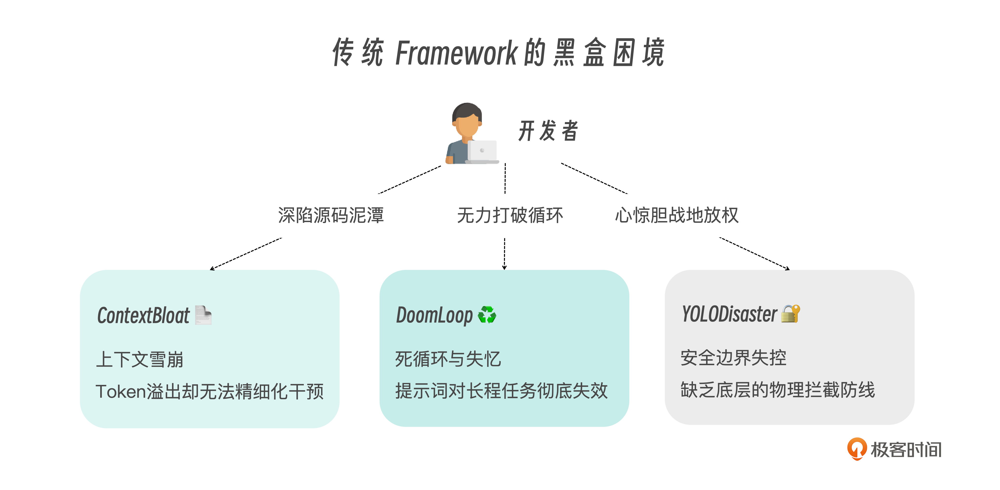
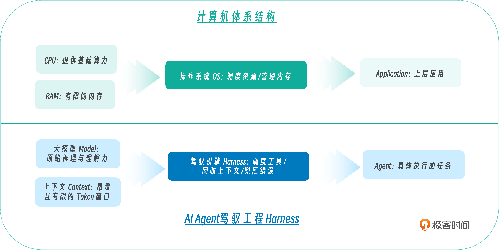

# 开篇词｜框架正在坍塌：像写操作系统一样，复刻 OpenClaw 的底层 Harness

**作者：Tony Bai**

> 只有亲自造过轮子的人，才知道车辆在高速过弯时，底盘的极限到底在哪里

你好，我是Tony Bai。欢迎来到《从0开始构建 Agent Harness》的课堂。

在正式开启我们这场硬核的底层构建之旅前，我想先与你分享一个近乎每天都在我，或许也在你身边上演的场景。

这是一个普通的下午，你正在尝试用大模型写一个具备代码审查能力的 AI Agent。IDE 的屏幕上，是你引入的一堆庞大的第三方框架代码（比如 LangChain 或 AutoGen）；而在另一块屏幕上，是大模型的控制台或日志输出。

你的开发工作流，变成了一场在黑盒与报错之间不断妥协的**“补丁探戈”**：

1. 你发现 Agent 在读取一个 3000 行的日志文件时，大模型 API 冰冷地抛出了 `400 Token limit exceeded`。于是你赶紧去翻阅框架文档，试图找到一个配置项来截断文本。
2. 紧接着，Agent 在尝试修复一个编译报错时，陷入了死胡同。它连续 10 次执行了完全相同的、错误的 `bash` 命令，毫无察觉地在原地打转。你叹了口气，在 System Prompt 里加上一句极其苍白的警告：“千万不要陷入死循环！”
3. 更可怕的是，由于你赋予了它执行本地 Shell 的权限，在某次幻觉中，它误解了当前的工作路径，试图执行类似 `rm -rf ./*` 的高危操作。你惊出一身冷汗，赶紧去重写正则黑名单。

这些场景，你熟悉吗？

## 从“盲目调包”到“黑盒失控”：我们离真实的生产力有多远？

自从大语言模型（LLM）的 API 开放以来，我们似乎都默认了上面这种“调包”的开发模式。我们乐此不疲地引入一层又一层的上层抽象，用几十行代码跑起一个看似无所不能的 Demo，并为之感到欣喜。

但扪心自问，当把这些基于框架拼凑出来的 Agent 投入到长周期的真实生产环境中时，它们真的可用吗？

这层阻碍我们迈向真正工业级 AI 应用的隔阂，我称之为 Agent 开发的“三大失控摩擦力”：

1. **上下文失控**：我们盲目地给模型塞入几十个工具描述，却不知道大模型的注意力会被这些冗长的系统设定严重稀释，导致“降智”和幻觉。
2. **状态失控**：传统的框架在内存中维护着极其复杂的隐式状态机。一旦对话轮数过多，模型就会得“健忘症”；一旦遇到顽固报错，模型就会陷入死循环（Doom Loop）。而由于状态被框架封装在黑盒里，人类开发者根本无法在中途介入干预。
3. **边界失控**：我们既希望 Agent 拥有改变物理世界的能力（执行代码、修改文件），又缺乏底层的物理拦截机制。大模型的“冲动”一旦越界，就是灾难。

我们可以用一张图来直观感受，在传统的框架模式下，开发者是如何被这些黑盒摩擦力消耗精力的：

这些摩擦力的存在，让我们意识到：**单纯靠堆砌 Prompt 或者调用更高层级的应用框架，是永远无法构建出工业级 Agent 的。**

那么，真正的解法，究竟是什么？

## 认知重塑：框架正在坍塌，Harness（驾驭工程）正在崛起

要理解这场架构革命的深刻性，我们必须清晰地看到 AI Agent 演进的一条底层暗线。

在深入剖析了当今业界最顶尖的原生 Coding Agent（如 Anthropic 的 Claude Code 以及备受瞩目的开源项目 OpenClaw）后，我得到了一个极其深刻的行业洞见：

> The Framework Layer is Collapsing into the Harness.  
> 传统的应用框架层正在加速坍塌，并逐渐融入底层的驱动工程中。

在早期，由于大模型逻辑推理能力弱，我们需要用厚重的 Framework 去帮它做意图识别、路由分发。框架扮演的是一个“事无巨细的微管家”。但今天，面对 GPT-5.2 或 Claude 4.6 Sonnet 这样极其聪明的模型，它们原生就具备了顶级的规划（Planning）和工具调用（Function Calling）能力。此时，“微管家”式的框架反而成了阻碍。

我们需要的不再是教模型“怎么想”的抽象层，而是一个为模型提供健壮物理躯体和生存环境的**底层引擎——这就是 Harness（驾驭工程）**。

我们可以用计算机体系结构来做一个最直观的类比：

**Harness 的本质，就是为大模型写一个微型操作系统（OS）。**在这个 OS 里，大模型是 CPU，上下文窗口是极其珍贵的 RAM（内存），各种本地操作是外设（硬件）。Harness 不干涉 CPU 的计算，但它必须极其严苛地管理内存回收（上下文压缩）、调度硬件接口（极简工具集）、并随时准备触发系统中断（拦截高危操作与死循环）。

大模型（CPU）决定了智力（算力）的上限，而 Harness （OS）决定了这套智力在现实世界中能发挥出几成。

> 注：Harness原意为“马具/缰绳”，Harness Engineering 是指通过构建受控环境，包括设计和构建约束机制、反馈回路、工作流控制和持续改进循环等，让AI在约束下高效可靠地工作。国内多译为“驾驭工程”或“管控工程”，这里使用“驾驭工程”这种译法。

## 为什么是 OpenClaw？极简哲学的胜利

如果要构建这样一个工业级的 Agent Harness 引擎，我们需要一个顶级的学习标杆。在众多开源项目中，OpenClaw（及其底层运行时 `pi`）以其反直觉但又无比高效的设计哲学脱颖而出。

在拆解 OpenClaw 的源码时，我被它解决复杂工程问题时的“大道至简”深深折服：

1. **极简工具法则（Minimal Toolset）**：当别人都在疯狂集成包含几十个 API 的臃肿 MCP 协议时，OpenClaw 坚信大模型本身足够聪明，因此**只暴露 4 个完备的基础原语：**`Read`、`Write`、`Edit` 和 `Bash`。只要给模型一个 `bash`，它就能自己去运行 `git`、`grep`，甚至自己写脚本来解决问题。这就从根源上消灭了工具层面带来的上下文膨胀。
2. **状态外部化（Externalized State）**：这是 OpenClaw 的神来之笔。它完全抛弃了在代码内存中维护复杂的任务状态机。相反，它强制 Agent 将数据写在工作区的Markdown文件中，比如将宏大的规划写在 `PLAN.md` 中，将微观的进度写在 `TODO.md` 中。记忆不再是黑盒，而是人类随时可以打开、阅读甚至手动修改的纯文本。这实现了真正的“零成本人机协同”。
3. **YOLO 哲学与防御纵深**：在本地开发环境，它奉行 YOLO（You Only Live Once，全权信任）模式，让 Agent 自由狂奔；但同时，它又在底层埋下了坚固的安全中间件（Middleware），用于在部署到远端服务器时，瞬间挂起高危命令，等待人类的审批放行。

这套化繁为简的 Harness 哲学，正是我们在 AI 时代最需要的工程智慧。

## 重新定位：新范式下开发者的角色跃迁

听到这里，你可能会意识到，这场从 Framework 到 Harness 的演进，不仅是一次技术架构的升级，更是一次关于**工程师自我价值重塑**的严肃命题。

当 AI 拥有了强大的原生推理和行动能力，我们的角色将从一个“调包侠”或“Prompt 裱糊匠”，蜕变为整个 AI 物理法则的“设计者”与“驾驭者”。

你将花更多的时间思考：

* 如何设计一个像 OS GC（垃圾回收）一样的阶梯掩码算法，在不丢失模型意图的前提下，榨干最后一点 Token 空间？
* 如何在底层构建一个安全的防线，让大模型在发疯执行 `rm -rf` 时被精准拦截？
* 如何为引擎建立科学的链路追踪（Tracing）和自动化度量（Benchmark）体系，用数据证明你的 Agent 真的变聪明了？

我们不再是黑盒框架的使用者，而是成为了构筑 AI 世界秩序的系统架构师。

## 专栏模块设计：你的 Harness 架构师进阶地图

为了帮助你系统地完成这次技能升级与思维跃迁，在这个专栏中，我将带你使用 Go 语言，吸收 OpenClaw 的顶级架构哲学，从零开始写出一个轻量、极简但五脏俱全的工业级 Agent Harness 引擎——我们称之为 `go-tiny-claw`。

  
为什么选 Go？因为在构建高并发、流式通信以及底层基础设施时，Go 有着得天独厚的优势。当然，如果你是 Python 或 Rust 开发者也请放心，本专栏的核心资产是**“架构思想与驾驭逻辑”**，这些底层哲学放之四海而皆准。

整个专栏被精心设计为 24 讲，划分为六个递进的章节。它就像一张清晰的系统构建图纸：

**第一章：认知与核心引擎（The Core Engine）**

我们将抛弃黑盒，纯手写大模型原生的 ReAct 循环。设计优雅的多模型适配层（接入 Claude 与OpenAI兼容 API 模型），并前瞻性地引入独立的“慢思考（Thinking）”机制，极大提升复杂任务的规划成功率。

**第二章：极简工具与物理交互（Action & Tools）**

打造强扩展性的 Tool Registry。深刻贯彻极简工具哲学。手写支持多级模糊匹配的健壮 `Edit` 工具，并利用 Go 的并发特性压榨出并行工具执行的性能极限。

**第三章：上下文工程体系（Context Engineering）**

这是决定 Agent 智商的生命线。我们将实现系统提示词的动态组装、超长文本的阶梯降级压缩（Compaction）；更重要的是，摒弃复杂的内部状态机，把“记忆”与“待办”完全外部化为本地的文件系统。

**第四章：稳定性控制与多智能体（Safety & Coordination）**

让 Agent 走向生产环境。实现运行时提醒（Reminders）斩断死循环；通过 Middleware 拦截危险操作，在飞书中弹出卡片等待人类审批（Human-in-the-loop）；引入 Subagent 隔离复杂任务。

**第五章：可观测性与科学度量（Observability & Evaluation）**

这是高级工程师的分水岭。为引擎引入链路追踪（Tracing）、成本审计，并搭建自动化 Benchmark 评估脚本，科学量化引擎的每一次进步。

**第六章：端到端实战串讲（End-to-End Practice）**

全要素组装。我们将最终打造出一个强悍的 CLI 工具，以及一个能在飞书群里随时被召唤、具备安全底线的 AgentOps 运维自动化助手。

## 写在最后：造轮子的意义与拥抱前沿

在这个开源框架满天飞的时代，可能有人会问：“既然已经有了那么多工具，为什么我们还要从零开始造轮子？”

我的回答是：**只有亲自造过轮子的人，才知道车辆在高速过弯时，底盘的极限到底在哪里。**

在这个被 AI 席卷的时代，一部分人可能会因为固守“调包框架”的安逸而被底层的性能瓶颈和失控所反噬；而另一部分人，则会选择主动向下深钻，学会如何像写操作系统一样驾驭这股强大的新力量。

未来已来，它就蕴藏在那些最底层的代码和极简的架构哲学中。现在，我正式邀请你，放下焦虑，带上你的键盘，与我一起开启这场硬核的底层引擎构建之旅。让我们共同见证，一个工业级的 AI Agent 引擎，是如何在你手中诞生并改变世界的。

在开篇词的最后，我还想坦诚地与大家再分享一点。

Harness Engineering（驾驭工程）是一个极其前沿且目前在业界（无论是学术界还是工业界）都处于高速演进甚至处于“野蛮生长”阶段的全新命题。

从 Anthropic 内部流出的工程实践，到开源社区 OpenClaw 的极简架构，这个领域的底层认知几乎每个月都在经历着重塑与推翻。我们今天在专栏中“奉为圭臬”的某些设计哲学，也许在未来随着大模型（如拥有更强原生规划能力）的问世，都有可能被证明存在偏颇，甚至是被完全抛弃的过渡方案。

**这正是拥抱前沿技术最迷人，也最具风险的地方。**

因此，我对这门专栏的定位绝不是一份静态文档。后续如果在业界出现了新的Harness 架构理论，或者新的优秀工业实践，我会尽量以“加餐”的形式，及时为大家带来最前沿的复盘、纠偏与源码迭代。我们第一讲见！

---

## 精选评论

**silence**: 有个说法 Agent = Model + Harness，模型差距缩小，主要就是卷 harness 了。

这门课教怎么写 harness， 19 号出的，20 号通勤路上+ 午休把简介、开篇、两节正文撸了一遍，酣畅淋漓。

预期跟着课程实践一遍，做 AI Agent 手拿把掐的。

> **作者回复**: [手动抱拳]

---

**戒不掉de爱°**: 老师。有交流群吗

> **作者回复**: 编辑老师那边有一个交流群。

---

**zhangwq**: 1. 纯好奇编程语言TS/JS是怎么落选的？claude code 大量代码都是这个，为什么在老师的文章中都上不了台面？
2.既然claude code 都“开源”了，基于这个讨论是不是更有代入感？

> **作者回复**: 关于语言，TS/JS 绝非上不了台面，Agent Harness的编写是语言无关(大家用什么语言都可以，重要的是学习harness背后的思想），专栏选用 Go语言，一来是因为它是我个人的主力编程语言，二来Go在ai基础设施、应用方面也是有很大的潜力，希望更多的开发人员能用go进行ai agent相关的开发而已。
> 
> 关于问题2，专栏策划和编写时，cc尚未“开源”。cc是ai agent的头部，非常值得学习和讨论。这个后续可能会在加餐里加以跟踪更新。第一版专栏策划里，的确没有考虑这点。ai领域真是变化太快了。

---

**镞砺括羽**: java开发适合这么课程吗

> **作者回复**: 虽然课程本身实现是go代码，但harness方法的思路是语言无关的，借助大模型，你也可以理解go示例代码，甚至将示例翻译为java。

---

**PatrickL**: 做机器学习的叫调参侠，做大模型开发的叫调包侠。最简单的SimpleRAG，我用LlamaIndex框架写5行代码就能搞定。都说不要重复造轮子，那么为什么我们还要学这门课程？
大道至简的至有两层意思，一层意思是“最”，另一层意思是“到达”。为了到达简单，它的源头就不得不复杂。看山是山，看山不是山，看山还是山。
虽然我们最终都是调参侠或者调包侠，但知道了如何造轮子，理解了复杂之后，我们遇到关键问题时才不会慌忙错乱，到达真正意义上的最简单。就像一句话说得好，手里有粮，心中不慌。我想说，懂得造轮，调包更顺。

> **作者回复**: 👍

---

**sheep**: 1. 字节有一个go 框架，叫eino。这个和我们的harness Engine有啥关联咩
2. 老师有打算再后续新的文章中，有一个环节就是，与CC做一下设计对比么

> **作者回复**: 我理解eino是一个与langchain类似的ai应用开发框架，支持智能体编排、rag、workflow等。当然它也有agent专用 sdk，可以用来构建agent。它可能已经将构建harness的一些底层机制做了封装。。
> 
> 我编写专栏时，cc还没有leak呢。后续如果有时间和精力，可能会在加餐里聊聊各个主要专题方面，cc是如何做的设计和实现。
> 
> 
> 
> 

---

**kimoti**: 就是因为大模型还不够智能，所以才需要驾驭大模型。

> **作者回复**: 👍

---

**番茄酱**: 老师，openclaw跟hermes的区别跟联系是什么？

> **作者回复**: hermes最近才火起来的。我也才刚刚研究。
> 
> 官方介绍hermes是一个可自演进的ai agent。

---

**东方奇骥**: 白老师的课都是精品

> **作者回复**: [手动抱拳]

---

**MClink**: 第一次学习前沿技术。算是跟上步伐了吗哈哈哈哈

> **作者回复**: 💪

---

**了凡**: 老师，目前 agent 有哪些业务使用场景吗？

> **作者回复**: 据我不完全的了解，目前 Agent 落地的核心逻辑是“容错度高 + 信息搜集密度大”的场景。
> 
> 1.  代码与研发辅助（Coding Agent）：如大家常用的Claude Code、Codex等，用于代码生成、代码审查、跨文件重构等。
> 2.  自动化运维（AgentOps / ChatOps）：我们在专栏后半段演示的，通过飞书接入，处理日常的服务器资源巡检、报警日志分析与初级故障自愈
> 。
> 3.  个人助理 ，比如本专栏常提及的OpenClaw、Hermes等。
> 4. 客服与知识库问答：不仅仅是搜索匹配，而是能通过调用工具去查用户的实际订单状态并进行复合推理。
> 

---

**普通熊猫 ଘ(੭ˊ꒳​ˋ)੭✧**: 感谢课程, 不知道老师看的是哪个版本的 openclaw , 据我所知, openclaw 一直以来都不止 read, write, edit, bash 四个工具,  比如获取网络文档的工具 :

https://docs.openclaw.ai/tools/web-fetch

> **作者回复**: 这里只是参考openclaw思路，并未参考任何openclaw代码。并且这里是复刻一个极简版的，仅提供了四个 read, write, edit, bash工具。但是框架是具有扩展性的，大家后续可以根据需要“注册”自己实现的工具。

---

**Hector**: 企业没涉及agent的业务场景，还需要开发自己agent runtime吗

> **作者回复**: 如果自己使用claude code这样的工具，要了解这样的coding agent的工作原理，了解和学习agent harness也是有裨益的。

---

**子豪sirius**: 白老师的课支持。AI这几年发展太快了，各种新术语几个月就冒出一个，需要沉下心来学习背后的核心思想。

> **作者回复**: [手动抱拳]

---

**邹志鹏**: claude code 源码 "开源" 了, 是否可以参考一下, 对课程内容有些更新?

> **作者回复**: 编写课程时，cc还没有leak呢😄
> 
> 大家可以结合课程的讲解，课后可以有针对性的看看“非官方”途径泄露的cc代码在这方面是怎么做的。cc算是业界最佳实践了[手工抱拳]。

---

**gsz**: 催更

> **作者回复**: [手动抱拳] 

---

**really_z**: python适合么老师 

> **作者回复**: 适合啊。学会harness核心思路后，语言并不重要了，go也好，python也好，都适合用来实现属于自己的harness。

---

**大菠萝**: 那么 langchain langgraph 这些框架未来是什么定位？

> **作者回复**: 在大模型能力尚弱的阶段，这些框架通过硬编码的“链”提供了稳定性。这些框架生命力很强，随着新概念的出现，他们也会随之演进，提供对harness等的包装和支持。虽然像大船调头，慢且有包袱。
> 
> 此外，这些框架可能还会更像上层丰富的“库（Library）”或“行业 SOP 模板”。开发者会使用 Harness 思想构建核心OS，然后调用这些框架提供的连接器（Connectors）去快速适配各类外部生态。

---

**Cy23**: 反复聆听，细细品味

> **作者回复**: [手动抱拳]

---

**毁灭吧**: 原生工作流，就买了，这个再来跟练一遍！

> **作者回复**: [手动抱拳]

---

**毁灭吧**: 太强了，是我目前需要的课程，强悍如斯！

> **作者回复**: [手动抱拳]

---

**tsukiyo**: 正在严肃学习

> **作者回复**: 💪

---

**Demon.Lee**: 又把老师请来了，点赞👍

刚学完 AI 原生工作流 🙃

> **作者回复**: 👍 [手动抱拳]

---

**许凯**: 老师，如果用成品框架的话，claude agent sdk时不时就已经非常成熟合适了

> **作者回复**: Claude Agent SDK 确实非常优秀，它是 Anthropic 官方给出的参考实现。但请记住：我们这门课的目的不是教你“使用”一个Agent SDK，而是教你如何“编写”一个 SDK。 当大家跟着课程理解了 go-tiny-claw 背后的 Harness 机制，就能更好地理解类似Claude Agent SDK这样的agent sdk了。并且可以不局限于agent sdk的条框，构建出属于自己的、完全可控的 Agent引擎。
>  

---

**万里**: 老师，请问有没有可在生产环境使用的go的agent框架开源项目推荐

> **作者回复**: Go 生态目前的确不像 Python /TS那样有非常垄断性且成熟的“全家桶”。我之前用过的agent sdk主要是Google的adk-go，主要集成google本家的gemini 模型。国内似乎用的不多。另外字节的eino也有adk，但我个人并未用过，不知使用起来如何。

---

**晴天了**: 老师 我没有明白 harness 就是一个种协议呢 还是一种框架.  如果说它是协议 但是它好像也是代码的一部分(需要写tool + memory = harness Agent). 如果它是框架呢 它又没有现成的框架代码. 劳烦老师解惑. 

> **作者回复**: 我的理解，不一定完全正确。
> 
> Harness 不是一个网络协议（像 HTTP），也不是一个提供了一堆可调用的类库的业务框架（像 Spring 或 LangChain）。 
> 
> Harness 是一种底层的工程架构模式，它是一套运行时的“脚手架”或“微型操作系统”。 就像 Linux 内核一样，你不会说Linux 是一种协议。Harness 就是那些维持 Main Loop 运转、管理上下文内存压缩、挂载工具注册表的实实在在的底层代码。你把它写好之后，它在后台默默运行，为上层的智能体提供物理驱动和安全防护。
> 
> 当然目前也有一些开源项目，号称harness框架。更多是方便大家构建自己的harness的高级sdk。
> 

---

**小虎子11🐯**: 这门课来得太及时了

> **作者回复**: 👍

---

**Void**: 学习一个开源软件的第一步是跑起来。
“Harness Engineering（驾驭工程）是一个极其前沿且目前在业界（无论是学术界还是工业界）都处于高速演进甚至处于“野蛮生长”阶段的全新命题。从 Anthropic 内部流出的工程实践，到开源社区 OpenClaw 的极简架构，这个领域的底层认知几乎每个月都在经历着重塑与推翻。”
在“亲自造过轮子”之前，老师是否会演示一下 OpenAI、Anthropic 内部流出的工程实践？因为事实上OpenAI (https://openai.com/zh-Hans-CN/index/harness-engineering/) 的内容稍微详细一些外，Anthropic的最佳实践更像是一篇新闻稿。

---

**Isaac**: "Framework" 是指CrewAI, LangChain, AutoGen么？我一直理解要获得 Harness ，需要Framework来实现呢。我就带着这个问题继续学习吧 :)

---

**习惯、从不习惯**: 老师你是希望我一行一行代码去写呀！还是用AI 写！其实想知道怎么学你这门课程

