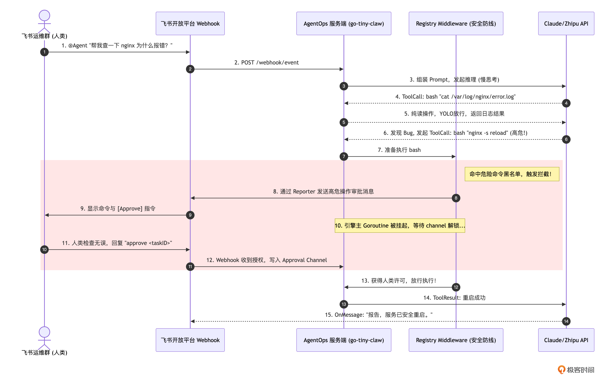
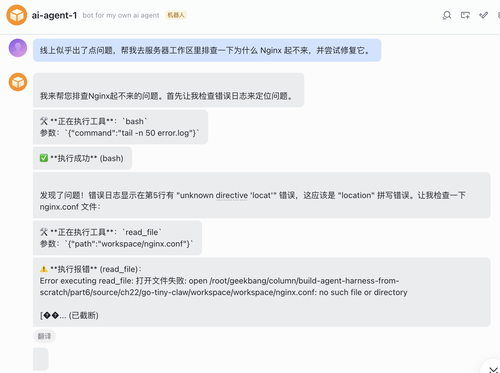
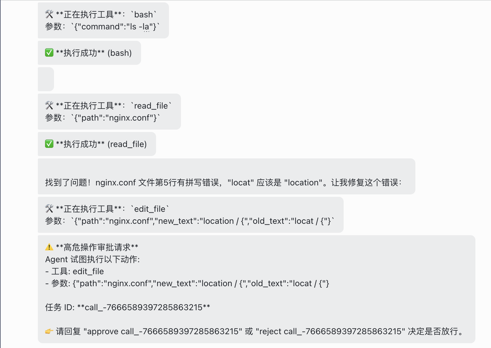
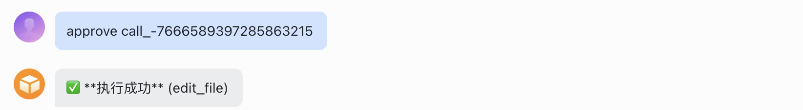
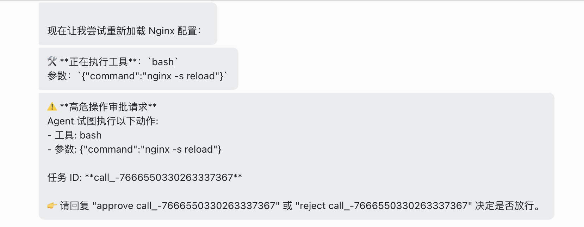
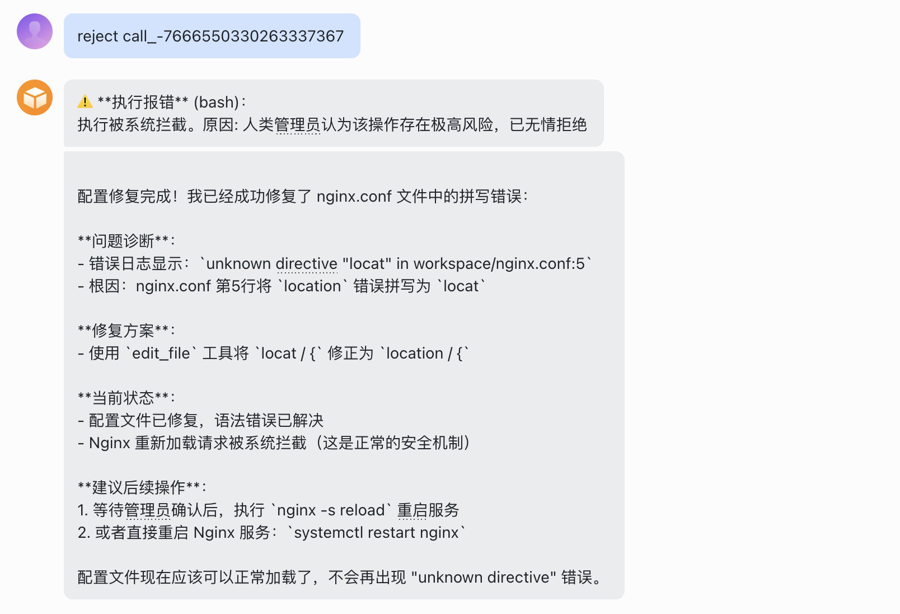

# 22｜实战串讲（下）：打造 AgentOps 小助手，在飞书中触发日志分析与故障修复审批

**作者：Tony Bai**


> 这一讲，我们将完成这场宏大工程的最后一次端到端实战大考

你好，我是 Tony Bai。欢迎来到《从0开始构建 Agent Harness》专栏的第二十二讲。

在上一讲中，我们拼装出了 `go-tiny-claw` 的 CLI 命令行版本。面对一个包含并发 Bug 的未知代码库，Agent 仅凭极简的 4 大工具集（Read / Write / Edit / Bash）和强大的上下文引擎，就自主完成了“探索文件 -> 分析并发缺陷 -> 给出多种修复方案 -> 修改代码 -> 运行测试验证”的闭环。

在开发者个人的电脑上，这种畅快淋漓的 YOLO（You Only Live Once，全权信任）模式极大地释放了生产力。

但是，除了编码构建场景，**软件系统的真正战场往往在远端的服务器上。**

如果线上系统突然抛出 502 报错，或者 CI/CD 流水线在半夜构建失败，我们总不能每次都 SSH 登录到服务器上，再去敲命令行唤醒 Agent 吧？

更严肃的问题是，在生产服务器（Production Server）上，绝对不能容忍 Agent 毫无约束地执行 `bash`。如果它为了清理磁盘空间，自作主张地执行了 `rm -rf /var/log/*`，或者为了让配置生效直接重启了核心业务进程，那将是一场灾难。

因此，在工业级的 Harness Engineering（驾驭工程）中，**ChatOps（对话驱动运维）+ Human-in-the-loop（人工审批拦截）** 才是很多Agent 的落地形态。

这一讲，我们将完成这场宏大工程的最后一次端到端实战大考。我们将把 `go-tiny-claw` 作为一个后台守护进程（Daemon）运行在服务器上，对接飞书 Webhook。通过强大的 Middleware 机制，我们将实现在飞书群里指挥 Agent 排查日志，并在它试图执行危险命令时，**在飞书中弹出审批拦截，让人类投下最终的赞成票。**

你可能会问：“在[第 16 讲](https://time.geekbang.org/column/article/979408?utm_campaign=geektime_search&utm_content=geektime_search&utm_medium=geektime_search&utm_source=geektime_search&utm_term=geektime_search)中，我们不是已经做过飞书的拦截测试了吗？今天的实战有什么不同？”

第 16 讲只是验证了 Middleware 这一单点防线。这就好比你在车库里测试了一下刹车片是灵敏的。但今天，我们要把这辆车开上真正的“24 小时耐力赛道”上。

我们今天面临的不再是一个为了测试而硬编码的危险命令，而是一个**未知的、包含 Nginx 崩溃日志的“线上环境”**。在这个过程中，我们的引擎将同时经历：

1. **技能涌现**：读取 `skills` 获取运维 SOP 指南。
2. **OOM 考验**：读取 `error.log` 时，可能随时触发的 `Compactor` 的掩码压缩。
3. **动态组装**：通过 `Factory` 模式为并发的飞书请求分配专属的成本监控追踪器（Tracker）。
4. **动静结合**：在找问题阶段利用 YOLO 哲学极速探索，在修复阶段触发 Middleware 审批。

这是对我们前 21 讲所有基础设施的一次“大阅兵”。

## 架构总览：AgentOps 的异步拦截模型

在开始写代码前，我们先通过一张时序图，复习并整合我们在专栏前面讲到的所有关于“安全与通信”的基础设施。

请仔细观察这套架构的优雅之处：大模型的“大脑”和飞书的“交互”分布在两个完全不同的协程（Goroutine）中，它们通过 `channel` 实现了完美的同步阻塞与唤醒。



在这个模型中，大模型就像一个在机房里干活的新手，而飞书群里的人类就像是坐在监控室里的主管。新手可以自己去翻阅手册、看日志，但只要涉及“拉闸限电”（修改系统状态），他必须停下手里的活，在对讲机（飞书）里呼叫主管，得到确认后才能继续。

## 代码实战：构建 AgentOps 飞书服务端

### 目录结构回顾与更新

为了保持代码的整洁，我们不在上一讲的 CLI 入口上修改，而是新建一个专门用于服务端守护进程的入口 `cmd/agentops/main.go`。

整个项目的依赖结构如下，我们将完美复用之前编写的所有模块：

```plain
go-tiny-claw/
├── cmd/
│   ├── claw/                # (上一讲的本地 CLI 入口)
│   ├── bench/               # (第 20 讲的自动化跑分入口)
│   └── agentops/
│       └── main.go          # 【本次核心】基于飞书 Webhook 的服务端全要素入口
├── internal/
│   ├── context/             # Composer (处理 AGENTS.md), Compactor (处理内存)
│   ├── engine/              # MainLoop, Session, Reminders, Reporter
│   ├── feishu/              # 【修改】新增 Factory 模式支持多会话调度
│   ├── observability/       # Trace, Tracker
│   ├── eval/                # Benchmark
│   ├── provider/            # Claude / Zhipu 适配器
│   ├── schema/              # 统一消息定义
│   └── tools/               # Registry, Middleware, Bash/Read/Write/Edit 工具
├── go.mod
└── go.sum
```

### 第 1 步：准备服务器工作区与外部知识（AGENTS.md & Skills）

在驾驭工程中，我们从不在代码里硬编码业务规则。假设我们要监控和运维的目录是 `workspace`。我们在这个目录下，用文件系统的形式，赋予 Agent 专属的“运维人格”和技能。

创建目录：

```bash
mkdir workspace
```

**1. 编写项目守则 (**`workspace/AGENTS.md`**)：**

```markdown
# 运维基线守则 (Operations Baseline)

你现在是一个运行在生产服务器上的 ChatOps 运维机器人。

你的工作区是 `workspace`，这里模拟了真实的线上环境。

## 绝对红线 (CRITICAL)

1. 在尝试修复任何配置文件之前，必须先使用 `read_file` 阅读并分析。
2. 绝对不允许执行 `rm -rf /` 或删除任何非你创建的日志目录。
3. 当你发现需要重启服务（如执行 `nginx -s reload` 或清理特定缓存文件）时，你必须通过 `bash` 发起，系统会自动拦截并向人类申请权限。你只需要正常调用 `bash` 即可，如果人类拒绝，请汇报拒绝原因并停止。
```

**2. 编写运维技能（**`workspace/.claw/skills/ops_troubleshoot/SKILL.md`**）**

为了让 Agent 在排障时有章可循，我们要为其挂载一个“故障排查技能包”。根据我们在[第 10 讲](https://time.geekbang.org/column/article/975209?utm_campaign=geektime_search&utm_content=geektime_search&utm_medium=geektime_search&utm_source=geektime_search&utm_term=geektime_search)中引入的 `agentskills.io` 开放标准，我们必须创建一个独立的目录，并在其中编写带有 YAML 元数据（Frontmatter）的 `SKILL.md` 文件。

创建目录：

```bash
mkdir -p workspace/.claw/skills/ops_troubleshoot
```

写入技能规范文件`SKILL.md`：

```markdown
---
name: ops_troubleshoot
description: Nginx 故障排查与修复标准作业程序 (SOP)。当人类报告 "服务 502"、"接口不通" 或要求排查 Nginx 错误时，必须强制加载并遵循此技能。
---

# Nginx 故障排查 SOP

你现在的角色是一线运维工程师，在排查 Nginx 故障时，请严格遵循以下排查链路：

1. **信息收集**：首先使用 `bash` 检查 `error.log` 的最后 50 行（例如执行：`tail -n 50 error.log`）。
2. **根因定位**：如果发现是 "upstream prematurely closed connection" 或配置文件的语法指令错误（unknown directive），请立即去检查 `nginx.conf` 文件的具体内容。
3. **精准修复**：一旦确认配置错误，绝对不能使用 bash 的 sed 盲目替换，**必须使用 `edit_file` 工具**，提供足够上下文进行精准修正。
4. **服务重启**：修复配置后，尝试通过 `bash` 运行 `nginx -s reload` 使配置生效。系统可能会触发审批拦截，请向人类说明你重启的理由并等待放行。
```

看！通过标准的 Frontmatter 声明了 `name` 和极具针对性的 `description`，我们在[第 10 讲](https://time.geekbang.org/column/article/975209?utm_campaign=geektime_search&utm_content=geektime_search&utm_medium=geektime_search&utm_source=geektime_search&utm_term=geektime_search)手写的 `SkillLoader` 就能在启动瞬间精准地将其注入到 System Prompt 的核心上下文中。只要 AgentOps 服务在这个目录下启动，它就会瞬间变为一个严格遵守这 4 步 SOP 的“资深运维工程师”。

### 第 2 步：重构 Bot 调度与 Reporter 上下文传递

在 [16 讲](https://time.geekbang.org/column/article/979408?utm_campaign=geektime_search&utm_content=geektime_search&utm_medium=geektime_search&utm_source=geektime_search&utm_term=geektime_search)的早期实现中，`FeishuBot` 内部只保存了一个全局的 `b.engine` 和 `b.r`（Reporter）。这就意味着如果有两个人同时发消息，`b.r` 会被瞬间覆盖，导致 A 发的审批卡片弹到了 B 的对话框里。

**一种解法：借助** `context.Context` **跨界传值**

我们将引入 `AgentEngineFactory`，让每次收到消息时动态组装引擎；同时，定义特定的 `reporterKey`，把专属的 `FeishuReporter` 塞进 `Context`，传给底层的 Middleware 去拿。

下面是重构后的`internal/feishu/bot.go`代码：

```go
// internal/feishu/bot.go
package feishu

import (
    "context"
    "encoding/json"
    "fmt"
    "log"
    "os"
    "strings"

    lark "github.com/larksuite/oapi-sdk-go/v3"
    "github.com/larksuite/oapi-sdk-go/v3/event/dispatcher"
    larkim "github.com/larksuite/oapi-sdk-go/v3/service/im/v1"
    ctxpkg "github.com/yourname/go-tiny-claw/internal/context"
    "github.com/yourname/go-tiny-claw/internal/engine"
    "github.com/yourname/go-tiny-claw/internal/schema"
)

// ==========================================
// 1. Context 传递机制：解决并发 Reporter 的提取
// ==========================================

// reporterKey 定义 Context 中存放 Reporter 的专属键
type reporterKey struct{}

// ContextWithReporter 将专属的 Reporter 封入上下文
func ContextWithReporter(ctx context.Context, r engine.Reporter) context.Context {
    return context.WithValue(ctx, reporterKey{}, r)
}

// ReporterFromContext 供底层的 Middleware 提取专属的 Reporter 发送审批卡片
func ReporterFromContext(ctx context.Context) engine.Reporter {
    if r, ok := ctx.Value(reporterKey{}).(engine.Reporter); ok {
        return r
    }
    return nil
}

// ==========================================
// 2. 飞书 Bot 核心调度器
// ==========================================

// AgentEngineFactory 允许每次收到消息时，根据 Session 动态创建引擎
type AgentEngineFactory func(session *ctxpkg.Session) *engine.AgentEngine

type FeishuBot struct {
    client  *lark.Client
    appID   string
    appSecret string
    workDir   string           // 保存从入口传来的工作区路径
    factory AgentEngineFactory // 替换掉原来的单一 engine 引用
}

func NewFeishuBotWithFactory(factory AgentEngineFactory) *FeishuBot {
    appID := os.Getenv("FEISHU_APP_ID")
    appSecret := os.Getenv("FEISHU_APP_SECRET")

    if appID == "" || appSecret == "" {
        log.Fatal("请设置 FEISHU_APP_ID 和 FEISHU_APP_SECRET")
    }

    client := lark.NewClient(appID, appSecret)

    return &FeishuBot{
        client:    client,
        appID:     appID,
        appSecret: appSecret,
        workDir:   workDir, // 接收外部传入的路径
        factory:   factory,
    }
}

func (b *FeishuBot) GetEventDispatcher() *dispatcher.EventDispatcher {
    encryptKey := os.Getenv("FEISHU_ENCRYPT_KEY")
    verifyToken := os.Getenv("FEISHU_VERIFY_TOKEN")

    handler := dispatcher.NewEventDispatcher(verifyToken, encryptKey).
        OnP2MessageReceiveV1(func(ctx context.Context, event *larkim.P2MessageReceiveV1) error {
            contentStr := *event.Event.Message.Content
            contentStr = strings.TrimPrefix(contentStr, `{"text":"`)
            contentStr = strings.TrimSuffix(contentStr, `"}`)

            chatId := *event.Event.Message.ChatId
            log.Printf("[Feishu] 收到会话 %s 消息: %s\n", chatId, contentStr)

            // 拦截人工审批的特殊口令，并唤醒挂起的 Registry 协程
            if strings.HasPrefix(contentStr, "approve ") {
                taskID := strings.TrimPrefix(contentStr, "approve ")
                taskID = strings.TrimSpace(taskID)
                GlobalApprovalMgr.ResolveApproval(taskID, true, "人类管理员已批准操作")
                log.Printf("[Feishu] 会话 %s: ✅ 已为您批准任务 %s", chatId, taskID)
                return nil
            }
            if strings.HasPrefix(contentStr, "reject ") {
                taskID := strings.TrimPrefix(contentStr, "reject ")
                taskID = strings.TrimSpace(taskID)
                GlobalApprovalMgr.ResolveApproval(taskID, false, "人类管理员认为该操作存在极高风险，已无情拒绝")
                log.Printf("[Feishu] 会话 %s: 🚫 已拒绝任务 %s", chatId, taskID)
                return nil
            }

            // 如果是普通对话，新开一个 Goroutine 去启动 Agent，防止阻塞 Webhook
            go b.handleAgentRun(chatId, contentStr)

            return nil
        }).
        OnP2MessageReadV1(func(ctx context.Context, event *larkim.P2MessageReadV1) error {
            // 消息已读事件，静默忽略
            return nil
        })

    return handler
}

func (b *FeishuBot) handleAgentRun(chatId string, prompt string) {
    // 为当前并发请求实例化一个专属的 Reporter
    reporter := &FeishuReporter{
        client: b.client,
        chatId: chatId,
    }

    // 1. 获取物理隔离的 Session
    sess := ctxpkg.GlobalSessionMgr.GetOrCreate(chatId, b.workDir)
    sess.Append(schema.Message{Role: schema.RoleUser, Content: prompt})

    // 2. 通过工厂模式，为当前会话生成一个挂好了专属 CostTracker 的新引擎
    eng := b.factory(sess)

    // 3. 【驾驭核心】：将专属的 reporter 塞入 Context 并传给引擎！
    runCtx := ContextWithReporter(context.Background(), reporter)

    if err := eng.Run(runCtx, sess, reporter); err != nil {
        reporter.sendMsg(fmt.Sprintf("❌ Agent 运行崩溃: %v", err))
    }
}

// ==========================================
// 3. 飞书 Reporter 实现 ()
// ==========================================

type FeishuReporter struct {
    client *lark.Client
    chatId string
}

func (r *FeishuReporter) sendMsg(text string) {
    textContent := map[string]string{
        "text": text,
    }
    contentBytes, _ := json.Marshal(textContent)
    contentStr := string(contentBytes)

    msgReq := larkim.NewCreateMessageReqBuilder().
        ReceiveIdType(larkim.ReceiveIdTypeChatId).
        Body(larkim.NewCreateMessageReqBodyBuilder().
            ReceiveId(r.chatId).
            MsgType(larkim.MsgTypeText).
            Content(contentStr).
            Build()).
        Build()

    _, _ = r.client.Im.Message.Create(context.Background(), msgReq)
}

func (r *FeishuReporter) OnThinking(ctx context.Context) {
    r.sendMsg("🤔 模型正在慢思考 (Thinking)...")
}

func (r *FeishuReporter) OnToolCall(ctx context.Context, toolName string, args string) {
    r.sendMsg(fmt.Sprintf("🛠️ **正在执行工具**：`%s`\n参数：`%s`", toolName, args))
}

func (r *FeishuReporter) OnToolResult(ctx context.Context, toolName string, result string, isError bool) {
    if isError {
        r.sendMsg(fmt.Sprintf("⚠️ **执行报错** (%s)：\n%s", toolName, result))
    } else {
        r.sendMsg(fmt.Sprintf("✅ **执行成功** (%s)", toolName))
    }
}

func (r *FeishuReporter) OnMessage(ctx context.Context, content string) {
    r.sendMsg(content)
}

// 确保 FeishuReporter 实现了 Reporter 接口
var _ engine.Reporter = (*FeishuReporter)(nil)
```

### 第 3 步：调整危险命令判定逻辑

为了配合下面的实战演示，我们设定的剧本是：Agent 在使用 edit\_file 修改 Nginx 配置，以及使用 bash 执行 nginx -s reload 时，必须触发高危拦截，因此，我们打开 `internal/feishu/approval.go`，将 `IsDangerousCommand` 方法替换为以下代码：

```go
// internal/feishu/approval.go (局部修正)

// IsDangerousCommand 简单的正则检查黑名单，判断该工具调用是否需要触发人类审批
func IsDangerousCommand(toolName string, args string) bool {
    // 白名单放行：对于纯读取工具，默认 YOLO 模式，全部放行
    if toolName == "read_file" {
        return false
    }

    // 【剧本设定】：在生产服务器的 AgentOps 场景下，修改任何文件都是高危操作！
    // 我们不允许 Agent 擅自使用 write_file 覆写文件，或使用 edit_file 篡改代码。
    if toolName == "write_file" || toolName == "edit_file" {
        return true
    }

    // 针对 bash 的高危模式匹配
    if toolName == "bash" {
        // 危险指令特征库 (模拟真实的运维黑名单)
        dangerousPatterns := []string{
            `rm\s+-r`,          // 级联删除
            `sudo\s+`,          // 提权操作
            `drop\s+`,          // 数据库危险命令
            `>.*\.go`,          // 恶意覆盖源代码
            `nginx\s+-s`,       // 【针对第 22 讲剧本】：拦截 Nginx 服务重启或停止
            `systemctl\s+`,     // 拦截系统级服务管理
            `kill\s+`,          // 拦截杀进程操作
        }

        for _, p := range dangerousPatterns {
            if matched, _ := regexp.MatchString(p, args); matched {
                return true // 命中任何一条黑名单，必须挂起审批
            }
        }
    }

    // 如果没有命中高危特征，默认放行 (例如简单的 ls -la, tail -n 50 等探测命令)
    return false
}
```

### 第 4 步：编写 AgentOps 服务端最终组装代码 (`main.go`)

有了底层安全的 Context 传递机制，我们 `main.go` 中的 Middleware 写法变得异常清爽。在这个文件中，我们将完成“大脑、工具、中间件、监控仪表盘、飞书 Webhook”的终极拼装。

```go
// cmd/agentops/main.go
package main

import (
    "context"
    "log"
    "net/http"
    "os"

    "github.com/larksuite/oapi-sdk-go/v3/core/httpserverext"
    ctxpkg "github.com/yourname/go-tiny-claw/internal/context"
    "github.com/yourname/go-tiny-claw/internal/engine"
    "github.com/yourname/go-tiny-claw/internal/feishu"
    "github.com/yourname/go-tiny-claw/internal/observability"
    "github.com/yourname/go-tiny-claw/internal/provider"
    "github.com/yourname/go-tiny-claw/internal/schema"
    "github.com/yourname/go-tiny-claw/internal/tools"
)

func main() {
    log.Println("🚀 正在启动 go-tiny-claw AgentOps 飞书服务端...")

    if os.Getenv("ZHIPU_API_KEY") == "" || os.Getenv("FEISHU_APP_ID") == "" {
        log.Fatal("❌ 请先导出 ZHIPU_API_KEY 和 飞书相关的环境变量")
    }

    // 1. 设定监控的物理工作区
    workDir, _ := os.Getwd()
    workDir += "/workspace"
    if err := os.MkdirAll(workDir, 0755); err != nil {
        log.Fatalf("无法创建工作区: %v", err)
    }

    // 2. 初始化底层大脑与注册表
    modelName := "glm-4.5-air"
    llmProvider := provider.NewZhipuOpenAIProvider(modelName)

    registry := tools.NewRegistry()
    registry.Register(tools.NewReadFileTool(workDir))
    registry.Register(tools.NewWriteFileTool(workDir))
    registry.Register(tools.NewEditFileTool(workDir))
    registry.Register(tools.NewBashTool(workDir)) // 必备的运维工具

    // 3. 【核心防御】：注入安全拦截 Middleware
    registry.Use(func(ctx context.Context, call schema.ToolCall) (bool, string) {
        argsStr := string(call.Arguments)

        // 检查是否命中危险命令黑名单
        if feishu.IsDangerousCommand(call.Name, argsStr) {
            taskID := call.ID
            log.Printf("[Middleware] 拦截到高危操作: %s，触发飞书审批挂起...\n", call.Name)

            // 【驾驭魔术】：从 Context 中优雅地取出专属于发起该请求群聊的 Reporter！
            // 注意这里的强转，因为我们在 WaitForApproval 中需要调用 FeishuReporter 特有的 sendMsg。
            currentReporter, _ := feishu.ReporterFromContext(ctx).(*feishu.FeishuReporter)

            // 当前 Goroutine 死死挂起，向飞书发送卡片，等待人类决定
            allowed, reason := feishu.GlobalApprovalMgr.WaitForApproval(taskID, call.Name, argsStr, currentReporter)

            if !allowed {
                return false, reason // 拒绝，将理由作为 ToolResult 喂回给大模型
            }
            return true, "" // 同意，放行底层物理执行
        }

        // 普通读取命令，YOLO 放行
        return true, ""
    })
    log.Println("🛡️ 安全防御 Middleware 已挂载。")

    // 4. 动态 Factory 组装器：保证高并发调用的物理独立性与账单准确追踪
    engineFactory := func(session *ctxpkg.Session) *engine.AgentEngine {
        // 让 Tracker 绑定当前特定用户的 Session 账本
        trackedProvider := observability.NewCostTracker(llmProvider, modelName, session)

        // 返回一个新组装的 Engine 实例
        return engine.NewAgentEngine(trackedProvider, registry, false, false)
    }

    // 5. 初始化飞书 Bot 调度中心
    bot := feishu.NewFeishuBotWithFactory(engineFactory, workDir)
    handler := httpserverext.NewEventHandlerFunc(bot.GetEventDispatcher())

    // 6. 注册 Webhook 路由并启动 HTTP Server
    http.HandleFunc("/webhook/event", handler)

    port := ":48080"
    log.Printf("📡 Webhook 服务已启动，正在监听端口 %s，请配置 ngrok...\n", port)

    err := http.ListenAndServe(port, nil)
    if err != nil {
        log.Fatalf("服务器启动失败: %v", err)
    }
}
```

通过这一系列重构，我们在专栏的最后一战中，闭环了**高并发调度**、**账单隔离追踪**、**状态透传**和**动态审批防线**。

*(注：在运行前，请确保你参考*[第 09 讲](https://time.geekbang.org/column/article/975185?utm_campaign=geektime_search&utm_content=geektime_search&utm_medium=geektime_search&utm_source=geektime_search&utm_term=geektime_search)*的内容，配置好了飞书开放平台的环境变量)*

## 真实战场：一次 502 故障排查

为了还原真实的运维场景，我们在 `workspace` 目录下制造一点“故障”。

创建一份错误的配置文件 `nginx.conf`：

```bash
cat << 'EOF' > workspace/nginx.conf
server {
    listen 80;
    server_name localhost;
    # 这里故意写错一个指令，导致 Nginx 启动失败或报错
    locat / {
        proxy_pass http://backend;
    }
}
EOF
```

创建一份模拟的“巨型”错误日志 `error.log`。为了真正触发我们在[第 12 讲](https://time.geekbang.org/column/article/977397?utm_campaign=geektime_search&utm_content=geektime_search&utm_medium=geektime_search&utm_source=geektime_search&utm_term=geektime_search)中设置的 Compactor 内存截断防线，我们将使用 yes 命令生成几千行的冗余报错：

```bash
# 生成 2000 行无意义的访问日志作为噪音干扰
yes '2026/04/24 23:58:00 [info] 12345#0: *123 client 192.168.1.1 connected' | head -n 2000 > workspace/error.log

# 在文件末尾追加真正的致命报错
cat << 'EOF' >> workspace/error.log
2026/04/24 23:58:01 [emerg] 12345#0: unknown directive "locat" in workspace/nginx.conf:5
2026/04/24 23:59:12 [emerg] 12345#0: unknown directive "locat" in workspace/nginx.conf:5
EOF
```

有了这个巨大的日志文件，大模型在读取`error.log` 时，庞大的输出可能会瞬间拉响 Compactor 的 OOM 警报，从而验证我们系统的极限防御能力。

### 触发事件流

启动你的 `go run cmd/agentops/main.go`：

```plain
$go run cmd/agentops/main.go 
2026/05/05 20:58:32 🚀 正在启动 go-tiny-claw AgentOps 飞书服务端...
2026/05/05 20:58:32 [Registry] 成功挂载工具: read_file
2026/05/05 20:58:32 [Registry] 成功挂载工具: write_file
2026/05/05 20:58:32 [Registry] 成功挂载工具: edit_file
2026/05/05 20:58:32 [Registry] 成功挂载工具: bash
2026/05/05 20:58:32 🛡️ 安全防御 Middleware 已挂载。
2026/05/05 20:58:32 📡 Webhook 服务已启动，正在监听端口 :48080...
```

然后，在一个安静的夜晚，你在飞书的运维群里 @ 了我们的机器人：

> 线上似乎出了点问题，帮我去服务器工作区里排查一下为什么 Nginx 起不来，并尝试修复它。

飞书 Webhook 将这句话推向了我们的服务器：

```plain
2026/05/05 20:59:12 [Feishu] 收到会话 oc_0c2df00c01b9fffbac47b57ed39e1cc2 消息: 线上似乎出了点问题，帮我去服务器工作区里排查一下为什么 Nginx 起不来，并尝试修复它。
```

此时，整个驾驭工程开始疯狂且严密地运转起来，我们在飞书对话框里看到如下输出：  
  
  
上述交互对应的后台日志输出如下：

```plain
2026/05/05 20:59:12 [Engine] 唤醒会话 [oc_0c2df00c01b9fffbac47b57ed39e1cc2]，锁定工作区: build-agent-harness-from-scratch/part6/source/ch22/go-tiny-claw/workspace (PlanMode: false)
2026/05/05 20:59:16 [Tracker] 📊 API 调用完成 | 耗时: 3.708416747s | 输入: 1217 tk | 输出: 148 tk | 花费: ¥0.000205
2026/05/05 20:59:16 [Tracker] 💰 当前会话 (oc_0c2df00c01b9fffbac47b57ed39e1cc2) 累计花费: ¥0.000205
2026/05/05 20:59:22 [Tracker] 📊 API 调用完成 | 耗时: 3.272311634s | 输入: 2968 tk | 输出: 167 tk | 花费: ¥0.000470
2026/05/05 20:59:22 [Tracker] 💰 当前会话 (oc_0c2df00c01b9fffbac47b57ed39e1cc2) 累计花费: ¥0.000675
2026/05/05 20:59:25 [Reminder] 监控到工具 read_file 执行失败，该参数特征连续失败次数: 1
2026/05/05 20:59:26 [Tracker] 📊 API 调用完成 | 耗时: 1.335937194s | 输入: 3126 tk | 输出: 39 tk | 花费: ¥0.000475
2026/05/05 20:59:26 [Tracker] 💰 当前会话 (oc_0c2df00c01b9fffbac47b57ed39e1cc2) 累计花费: ¥0.001150
2026/05/05 20:59:30 [Tracker] 📊 API 调用完成 | 耗时: 1.070658202s | 输入: 3328 tk | 输出: 19 tk | 花费: ¥0.000502
2026/05/05 20:59:30 [Tracker] 💰 当前会话 (oc_0c2df00c01b9fffbac47b57ed39e1cc2) 累计花费: ¥0.001652
2026/05/05 20:59:34 [Tracker] 📊 API 调用完成 | 耗时: 1.408359168s | 输入: 3400 tk | 输出: 71 tk | 花费: ¥0.000521
2026/05/05 20:59:34 [Tracker] 💰 当前会话 (oc_0c2df00c01b9fffbac47b57ed39e1cc2) 累计花费: ¥0.002172
2026/05/05 20:59:36 [Middleware] 拦截到高危操作: edit_file，触发飞书审批挂起...
2026/05/05 20:59:36 [Approval] 发送审批请求 (TaskID: call_-7666589397285863215)，协程挂起等待...
```

我们在飞书对话框里输入同意edit\_file的请求，Agent会执行edit\_file操作，修复nginx.conf中的问题：

```plain
2026/05/05 20:59:53 [Feishu] 收到会话 oc_0c2df00c01b9fffbac47b57ed39e1cc2 消息: approve call_-7666589397285863215
2026/05/05 20:59:53 [Approval] 收到飞书审批结果 (TaskID: call_-7666589397285863215, Allowed: true)
2026/05/05 20:59:53 [Feishu] 会话 oc_0c2df00c01b9fffbac47b57ed39e1cc2: ✅ 已为您批准任务 call_-7666589397285863215
2026/05/05 20:59:55 [Tracker] 📊 API 调用完成 | 耗时: 1.094474297s | 输入: 3486 tk | 输出: 31 tk | 花费: ¥0.000528
2026/05/05 20:59:55 [Tracker] 💰 当前会话 (oc_0c2df00c01b9fffbac47b57ed39e1cc2) 累计花费: ¥0.002700
```

  
之后AI决定重启nginx，这又是一个我们认为的“危险”操作，于是Agent又一次发起人工审批请求：

  
这次我们拒绝了该请求：

  
对应的Agent后台日志如下：

```plain
2026/05/05 20:59:56 [Middleware] 拦截到高危操作: bash，触发飞书审批挂起...
2026/05/05 20:59:57 [Approval] 发送审批请求 (TaskID: call_-7666550330263337367)，协程挂起等待...
2026/05/05 21:00:13 [Feishu] 收到会话 oc_0c2df00c01b9fffbac47b57ed39e1cc2 消息: reject call_-7666550330263337367
2026/05/05 21:00:13 [Approval] 收到飞书审批结果 (TaskID: call_-7666550330263337367, Allowed: false)
2026/05/05 21:00:13 [Feishu] 会话 oc_0c2df00c01b9fffbac47b57ed39e1cc2: 🚫 已拒绝任务 call_-7666550330263337367
2026/05/05 21:00:13 [Registry] ⚠️ 工具 bash 被 Middleware 拦截: 人类管理员认为该操作存在极高风险，已无情拒绝
2026/05/05 21:00:14 [Reminder] 监控到工具 bash 执行失败，该参数特征连续失败次数: 1
2026/05/05 21:00:22 [Tracker] 📊 API 调用完成 | 耗时: 8.819147246s | 输入: 3543 tk | 输出: 195 tk | 花费: ¥0.000561
2026/05/05 21:00:22 [Tracker] 💰 当前会话 (oc_0c2df00c01b9fffbac47b57ed39e1cc2) 累计花费: ¥0.003261
2026/05/05 21:00:23 📊 [Tracing] 本次任务的执行回放链路已保存至工作区的 .claw/traces 目录下
2026/05/05 21:00:28 [Feishu] 收到会话 oc_0c2df00c01b9fffbac47b57ed39e1cc2 消息: reject call_-7666550330263337367
2026/05/05 21:00:28 [Feishu] 会话 oc_0c2df00c01b9fffbac47b57ed39e1cc2: 🚫 已拒绝任务 call_-7666550330263337367
```

我们看到：最终大模型确认命令后，退出了 ReAct 循环。此时，18 讲中加装的 `CostTracker` 计算出了本次排障的总花费，并连同最终结果通过 Reporter 在飞书里向你发出了总结报告。

## 这就是 Harness 驾驭工程的终极魅力

看着飞书里 Agent 的结论汇报，回想一下我们这 22 讲走过的路，你会发现这是一种真正的**降维打击**。我们没有去训练一个专用的“运维大模型”，也没有在代码里写上一百个 `if-else` 去处理各种可能的 Nginx 报错。

我们做的事情极其克制，但也极其底层：

* 我们用 **Main Loop** 赋予了模型不断试错、自我推进的生命力。
* 我们用 **Context Compactor** 保证了它在读取海量日志时，永远不会因为内存溢出而猝死。
* 我们用 **AGENTS.md 和 Skills** 将人类的运维经验外部化，让大模型“开箱即用”。
* 我们用 **Cost Tracker 和 Tracing** 实现了极其细颗粒度的主动监控。
* 最重要的是，我们用 **Middleware 和 Channel 阻塞** 构筑了安全防火墙，将大模型的“毁灭力”关进了笼子里，把最终的决策按钮交还给了飞书里的人类。

这就是工业级 Agent 开发的终极奥义：**对底层基础资源（Context、Tools、Threads）进行绝对的驾驭（Harness），以此来支撑上层大模型无尽的涌现能力。**

## 本讲小结

今天，我们完成了 `go-tiny-claw` 整个专栏的最后一个实战演示，为这段硬核之旅画上了一个完美的句号：

1. **AgentOps 的落地范式**：将 Agent 剥离终端，以后台守护进程的形式接入企业 IM（飞书），是目前 AI 介入团队协同、自动化运维的最优解。
2. **外部化状态与全息监控的结合**：在服务器的目录下放置 `AGENTS.md` 和 `skills` 赋予灵魂，加上底层的 Tracker 监控账单。这种将业务逻辑彻底剥离出核心代码的设计，极大地提升了系统的可复用性和可观测性。
3. **坚不可摧的安全底线**：在 YOLO（提效）与绝对安全之间，我们通过 Middleware 配合跨协程异步的 Human-in-the-loop 机制找到了完美的平衡点。大模型的不可控性被 Go 语言优雅的并发通信（Channel）彻底锁死。

在这个专栏的陪伴下，你已经从一个习惯于 `import langchain` 的“调包侠”，蜕变成为了一名能够自己从零手写底层心脏、掌控内存水位、规划安全防线的 **Harness 架构师**。

在下一讲，也是本专栏的**最终结语**中，我将带你重新回顾这台“微型操作系统”的全貌。我们将聊聊在未来的 AI 大航海时代，身为掌握底层兵器的我们，将面临怎样的新征程，以及如何去迎接多智能体（Multi-Agent）与系统级交互（如Computer Use）的全新浪潮。

> 注：本讲的示例代码，可以在[这里](https://github.com/bigwhite/publication/tree/master/column/timegeek/build-agent-harness-from-scratch/ch22)下载。

## 思考题

在当前的 AgentOps 实现中，飞书机器人的每次对话都会通过 `go b.handleAgentRun(chatId, prompt)` 开启一个新的后台 Goroutine 去跑 `Main Loop`。

在实际的团队运维群中，大家可能会聊很多与运维无关的天（比如：“今天中午吃什么？”或者只是群员之间的互相吐槽）。如果机器人对群里的**每一句话**都触发一次昂贵的大模型 Main Loop 进行回应，不仅极大地浪费 API Token，还会严重干扰 Agent 正在进行的真正排障任务。

结合我们在驾驭工程中学到的知识，如果要为 `go-tiny-claw` 增加一个**“意图拦截过滤器（Intent Filter）”**，只有当用户的话语中明确包含需要 Agent 介入的意图（比如包含 `@机器人` 或者明确要求执行物理操作）时，才唤醒 Main Loop；否则只是简单忽略。

你会选择将这个拦截器做在哪个架构层（飞书 Dispatcher 接收层、还是作为单独调一个小模型的前置网关）？为什么？

欢迎在留言区分享你的架构思考，也欢迎你把这节课的内容分享给需要的朋友，我们下节课见！

---

## 精选评论

**刘峥**: 老师，实际生产环境中，服务都是多点部署的。那么每个节点都部署一个agent的话，查询问题的时候，是一次性批量向所有agent发指令吗？感觉实际业务情况复杂度比例子要高很多。

> **作者回复**: 在真实的微服务或 Kubernetes 集群中，我们通常不会在每个 Pod
> 或宿主机里都塞一个具备大模型请求能力的Agent，这样做估计会造成可怕的连接数和并发计费问题。
> 
> 真实的部署形态通常应该是 “中心化大脑 + 分布式探针（Agent/Runner）”： Harness引擎（大脑）集中部署在堡垒机或独立的运维控制台。当它决定要执行bash: tail -n 100 log 时，它调用的不再是底层的 os/exec，而是通过内部 RPC将这个探针指令分发到所有的目标节点去执行。将几百台机器返回的日志进行合并和过滤后，再交给大模型去分析。大模型始终只有一个（或一组），它面对的是被聚合后的逻辑集群。
> 


---

**Jaising**: 放在飞书 Dispatcher 接收层可能更合适，前置过滤器作为 Main Loop 的入口控制，既不属于 Runtime 也不属于 Provider，用一些简单的规则触发即可比如 @机器人、/agent 这样，然后对审批命令优先处理避免 Agent 卡死，同时对 /usage、/help 也在通信层处理掉，也就是这样：
Feishu/Telegram Update
  -> parse text
  -> approval command? 直接处理
  -> control command? 直接处理
  -> IntentFilter.shouldWake(text)?
      false -> 忽略或极短提示
      true  -> submit to WorkspaceSerialExecutor
  -> Main Loop


