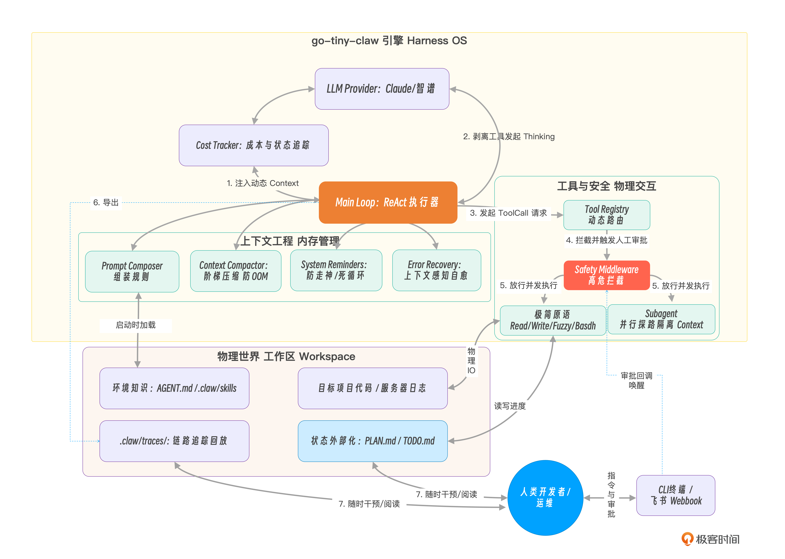

# 结束语｜Agent 的尽头是 OS，大模型时代开发者的驾驭新征程

**作者：Tony Bai**

> 恭喜你学完这门课的内容，我们来回顾一下

你好，我是 Tony Bai。欢迎来到《从0开始构建 Agent Harness》专栏的最后一讲，也是本专栏的结课语。

如果你能一路坚持敲完这 22 讲的代码，看着终端里或者飞书群里那个不知疲倦甚至有点“小聪明”的 `go-tiny-claw` 跑起来，首先，我要向你表达最诚挚的祝贺与敬意！

在过去的这 22 讲中，我们共同完成了一项在很多人看来有些“疯狂”甚至“反直觉”的挑战：

我们完全抛弃了市面上大火的 LangChain、AutoGen 等现成应用框架。转而使用纯粹的 Go 语言，从零开始，手工打磨出了一个类似于顶级 Coding Agent（如 Claude Code / OpenClaw）底层引擎的微型操作系统（OS）。

在这个过程中，我们并没有沉溺于如何编写花哨的 Prompt，也没有去追逐五花八门的 RAG 向量数据库。我们把 90% 的精力，投入到了极其底层、脏活累活最多，但也是最决定生死的 **Harness Engineering（驾驭工程）** 中。

今天，作为这门专栏的结课语，让我们放下手中的键盘，泡一杯咖啡。我想和你一起回头看看我们走过的这段复刻之路，重新审视这台由“心脏、手脚、内存、防火墙与仪表盘”拼装而成的微型 OS，并聊聊在未来的 AI 浪潮中，身为掌握底层兵器的你，将面临怎样的新征程。

## 回顾：一张价值千金的驾驭工程全景图

在专栏开篇词中，我曾抛出一个可能颠覆你认知的观点：**“The Framework Layer is Collapsing into the Harness.（传统的框架层正在坍塌，并逐渐融入底层驱动中）”**

经历过 22 讲的代码淬炼，当你亲手写下 `Context Compactor`（阶梯掩码压缩器），写下拦截 `rm -rf` 的 `Middleware`，写下能让飞书会话goroutine瞬间挂起的 `channel` 时，你现在一定对这句话有了无比深刻的体会。

因为你发现，让 Agent 变聪明的，往往不是大模型 API 本身有多贵，而是你如何“驾驭”它、限制它、以及如何为它提供优质的上下文（Context）和健壮的环境边界。

让我们用最后一张全局的架构图，来复盘一下我们的心血结晶——`go-tiny-claw`**的全景设计哲学**：

看着这张图，你是否感受到了这台引擎跳动的脉搏？让我们再回顾一下，这台引擎背后那几个**极其反常识、但极度有效**的哲学。

**极简主义：为什么只要 4 个基础工具？**

在[第 6 讲](https://time.geekbang.org/column/article/970292)，我们顶住了“为每种操作写一个专用工具”的诱惑。我们没有去写 `git` 工具，没有去写 `npm` 工具，更没有去堆砌上百个 MCP Server 接口。

我们仅仅保留了 **4 个基础原语**：`read`、`write`、`edit` 和 `bash`。

因为我们深刻意识到：工具描述（Schema）越多，**Context Bloat（上下文膨胀）** 就越严重，大模型的注意力（Attention）就越容易被稀释。把底层操作系统的能力还给模型，用自然语言驱动 `bash`，这才是正确之路。

**状态外部化：为什么抛弃了复杂的图数据库？**

在[第 13 讲](https://time.geekbang.org/column/article/978775)，我们没有在 Go 代码里定义任何复杂的 `AgentState` 结构体来保存长程任务进度。我们通过提示词，强制模型去工作区写 `PLAN.md` 和 `TODO.md`。

因为在真实的工业协同中，藏在进程内存里的状态是脆弱且不可读的。**把复杂的状态机变成肉眼可见的 Markdown 文件**，不仅节约了昂贵的 Token，更实现了“零成本的人机协同”。哪怕引擎崩溃了 100 次，只要 `TODO.md` 还在，重启后 Agent 就能无缝恢复进度。

**阶梯防线：为什么要像 OS 一样拦截一切？**

在第 [12](https://time.geekbang.org/column/article/977397)、[14](https://time.geekbang.org/column/article/977397) 和 [15](https://time.geekbang.org/column/article/979401) 讲，我们用 `Compactor` 实现了内存回收的“阶梯掩码（Masking）”；用 `Error Recovery` 实现了带上下文的错误自愈；用 `System Reminders` 在模型死循环的前一秒强行注入了警告。在[第 16 讲](https://time.geekbang.org/column/article/979408)，更是用 `Middleware` 死死卡住了危险命令，逼迫人类在飞书里点击 Approve。

因为在生产环境里，**我们永远不能信任大模型的理智**。只有底层的 Harness 拥有了主动打断、内存截断和权限拦截的能力，Agent 才能具备真正的工业级韧性。

**科学度量：为什么我们要花那么多篇幅写 Tracker 和 Benchmark？**

在最后几个模块（第 [18](https://time.geekbang.org/column/article/981027)、[19](https://time.geekbang.org/column/article/981479)、[20](http://time.geekbang.org/column/article/981494) 讲），我们为引擎外挂了成本审计、Tracing 链路追踪，并手写了 Benchmark 跑分脚本。

因为如果不算明“经济账”，如果你不能像看微服务链路一样回放 Agent 的死亡轨迹，如果你不能用 `go test` 数据证明你的 `Fuzzy Edit` 算法真的提升了成功率，你的项目永远只会是一个“玩具”。

## Agent 的尽头是 OS：未来的演进方向

我们的 `go-tiny-claw` 已经相对完善了，但这仅仅是驾驭工程浩瀚宇宙的冰山一角。

大模型的能力几乎每个月都在发生质的飞跃（想想我们刚开始写专栏时和现在的模型对比）。作为一个深谙底层原理的 Harness 架构师，你接下来可以带着这台引擎，继续去挑战以下几个前沿方向：

1. **接入标准化协议：MCP（Model Context Protocol）**

虽然在专栏中，为了贯彻极简主义，我们没有引入臃肿的 MCP。但在复杂的企业内部环境中，如果你的 AgentOps 助手需要去查询线上的 MySQL 数据库、对接 Jira 系统抓取工单，你不可能为所有的内部系统都在 Go 引擎里重写一遍 `BaseTool`。

未来，你完全可以在你的 `Tool Registry` 中引入一个轻量级的 `MCP Client`，让 `go-tiny-claw` 能够按需（Lazy Loading）发现并接入公司内部的标准化 MCP Server。这会让你的 Agent 瞬间拥有跨越部门边界、操纵整个公司基建的能力。

2. **Computer Use：从终端走向 GUI 桌面**

你可能已经注意到了 Anthropic 等厂商推出的 **Computer Use** 能力（让大模型直接控制鼠标键盘、看屏幕截图）。

在驾驭工程的视角下，这其实并没有改变 Main Loop 的核心架构！

你只需要在 `go-tiny-claw` 的 `Tool Registry` 中新增几个极简的 GUI 原语工具：`take_screenshot`（截图并转为 base64 发给多模态大模型）、`click_mouse(x, y)`、`type_text(string)`。然后，辅以一个稍微复杂点的 Prompt Composer，你的 Agent 就能瞬间从一个“只会敲代码的终端极客”，进化为一个“能帮你点外卖、做 Excel 报表的桌面全能管家”。

3. **基于 AST 的终极外科手术刀**

目前我们的 `edit_file` 工具依赖的是多级字符串模糊匹配（Fuzzy Match）。这在多数的场景下可能工作良好，但在修改极其复杂的嵌套代码时，大模型依然容易在缩进上产生幻觉。

如果你想把 `go-tiny-claw` 打造成一个纯粹用于代码重构的终极利器，你可以尝试把 Go 语言的 AST（抽象语法树）解析器，或者 LSP（Language Server Protocol）客户端集成到底层工具中。

这样，大模型就能通过更加语义化的指令（如：`"把 main 包下 User 结构体的 Name 字段改为小写"`）来精准重构代码，彻底消灭基于文本替换导致的语法破坏。

## 驾驭工程的深水区挑战

我们在专栏中手写的 `go-tiny-claw` 已经为你构建底层引擎打下了最坚实的地基。但在它蜕变为如钢铁侠的“贾维斯（J.A.R.V.I.S）”般无所不能的超级系统之前，仍有好多未被完全征服的“深水区”等待你去探索，比如：

* **真正的沙箱隔离（Sandboxing）**：在面向多租户的云端场景下，单纯的 Middleware 拦截是不够的。你需要探索如何利用 Docker、Firecracker（MicroVM）或 WebAssembly（Wasm）技术，为每个 Agent 分配一个用完即毁、绝对隔离的物理执行沙箱。
* **企业级的细粒度权限体系（Permission System）**：就像 Claude Code 广受好评的 `settings.json` 设计一样，你需要将“高危拦截”从硬编码中剥离出来，构建一套灵活的策略引擎。让终端用户可以自定义某个 Bash 命令到底是处于 `allow`（无脑放行）、`ask`（弹窗审批）还是 `deny`（绝对禁止）的权限级别。
* **动态热插拔的插件系统（Plugin System & Market）**：目前我们的外挂技能（Skills）是手工存放在特定目录下的静态的 Markdown 文本。你可以尝试将其演进为可插拔的 Plugin 架构，允许开发者在不重启引擎的情况下，随时安装、卸载甚至在公司内部的 Plugin Market 中分发带有特定执行逻辑的“超级技能”。
* **极致的 Token 省流进化（Token Economy Optimization）**：随着上下文越来越长，即使有 Compactor 掩码压缩，开销依然惊人。你可以尝试引入基于语意的本地小模型（如 Qwen2.5-0.5B）进行“先脱水压缩，后发往大模型”的串级架构，或者深度利用前沿 API 的 Prompt Caching 机制实现庞大 `AGENTS.md` 的零成本复用。
* **智能体自进化（Agentic Self-Evolution）**：这是目前学术界和工业界都在疯狂探索的圣杯（工业界如 [Hermes 项目](https://github.com/nousresearch/hermes-agent)便是一个典型代表）。 在这个阶段，Harness 不仅仅是“跑”大模型，而是能够在“闲时”去收集和扫描每次执行失败的 Trace 链路和人类的纠偏记录，像“人类做梦”一样提取出高频的报错规律（比如“为什么每次重构都会遗漏路由注册”）。 然后，它会自动去修改并更新工作区内的 `AGENTS.md` 以及相关 `skills`，把这些沉淀下来的教训变成新的标准作业程序（SOP）。这样，引擎在日复一日的运行中，就能实现真正脱离人类干预的“经验自我迭代”。

这些高阶专题，由于篇幅与学习曲线的限制，并未在本次正篇中完全展开。我强烈建议你结合这 22 讲的底座源码，发挥作为Harness工程师的智慧，去尝试自己实现它们。

如果在业界涌现了突破性的开源架构，或者大家对某个特定方向（比如沙箱隔离方案）呼声极高，我也会考虑在后续通过**【专栏加餐】**的形式，与大家一起继续这场技术的狂欢！

## 开发者的驾驭新征程

这门专栏，到这里就真正结束了。

几年前，当 ChatGPT 刚刚爆火时，大家还在焦虑地争论：“程序员到底会不会被 AI 替代？”

但今天，当你能从底层用 Go 语言手写包含并发锁（Channel）、内存压缩（Compaction）、甚至任务隔离（Subagent）的智能体“操作系统”时，我相信你心中已经有了坚定的答案。

**大模型（CPU）虽然越来越强大，但它永远需要一个坚固、优雅、极具工程美感的操作系统（Harness OS）来承载。**

那些只会复制粘贴、“调包”框架的初级开发模式，确实会面临严峻的挑战；但是，能够看透大模型能力边界、能够用系统编程思想在物理世界与 AI 之间构筑安全防线、能够设计出极具弹性架构的 **系统工程师（System Engineer）和 Harness 架构师**，反而会迎来属于他们的黄金时代。

你不再仅仅是在写 CRUD 的“业务逻辑”，你是在为一个全新的硅基生命“编写它的物理定律”。

去把 `go-tiny-claw` 改个名字吧！去 fork 它，去修改它，去给它换上更强的大脑，去赋予它更多符合你们团队特性的外挂技能（Skills），让它真正在你们公司的服务器里跑起来。

期待在不远的将来，能在某个知名的技术大会上，或者 GitHub 的 Trending 榜单上，看到由你亲自“驾驭”的工业级 Agent！

愿你在 AI 大航海时代里，乘风破浪，无往不利。

感谢你这 23 讲的坚持与陪伴，咱们江湖再见！👋

我准备了一份 [结课问卷](https://geekbang.feishu.cn/share/base/form/shrcnvKxNg4b7pZcch7vaknzNKd)，希望你可以填写一下你对专栏的建议和意见！

---

## 精选评论

**张申傲**: https://github.com/ZhangShenao/harness9
这是我用 Go 语言实现的 harness 框架，欢迎感兴趣的老师和同学一起交流~

