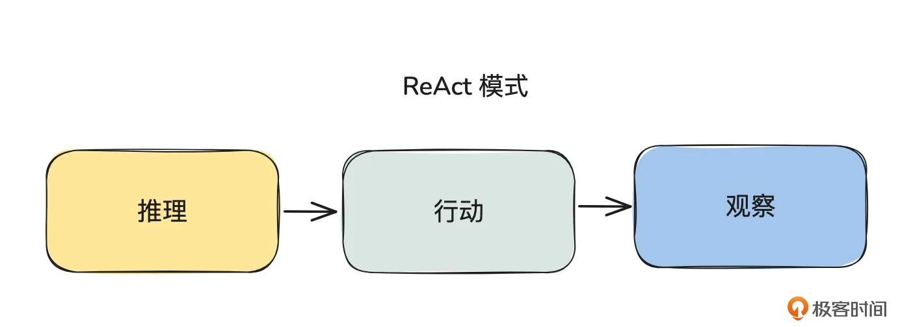
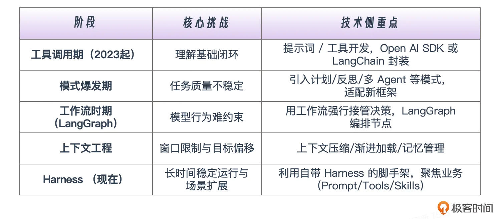

# 01｜全景：Agent 开发的技术演进与课程定位
你好，我是邢云阳。

正式开启我们的《Harness Agent 脚手架实战课》学习之旅前，我们先来思考几个开放性的问题，给大脑热热身。

- 你认为 Agent 开发本质上是在开发什么？

- 在平时的公司项目或日常工作中，主要在使用什么框架（脚手架）进行 Agent 开发？

- 除了编写代码，你有没有尝试过使用 Claude Code 去处理其他类型的任务？


带着这几个问题，我们先来系统梳理一下 Agent 开发的技术演进脉络。不是为了掉书袋，而是以此明确这套课程的“坐标”，让你更清楚我们接下来要走向哪里。

## Agent 开发的技术演进路线

Agent 开发的热潮兴起于 2023 年，但从技术原理上追溯，最早可以归结为 Function Calling（函数调用）与 ReAct 这两大工具调用机制。

### 工具调用 Agent 的原理与开发方式

Function Calling 机制由 OpenAI 首创，其核心是将工具文档注册给模型，让模型能够在合适的场景下主动选择合适的工具来解决问题。ReAct 框架的功能与之类似，但它通过提示词的形式，显式地教会了模型“推理（Reasoning）- 行动（Acting）- 观察（Observing）”的完整过程，使得整个链路更加透明且具备可观测性。



要实现这两个功能，主流方法有两种。

第一种是 **直接使用 OpenAI SDK**。其 Completions 接口原生支持注册工具文档并触发 Function Calling 机制。而对于 ReAct，控制模型进行思考与工具调用的是一份 ReAct 系统提示词。在这个基础上，这两类功能都需要再编写一个 While 循环（就是现在常说的 Agent Loop）来控制人类与模型的多轮对话及工具调用，这样才能完成闭环。

实现这两类功能的代码规模通常仅用几十行。例如，ReAct 的 Agent Loop 代码如下所示：

```
while True:
    response = send_messages(messages)
    response_text = response.choices[0].message.content

    final_answer_match = re.search(r'Final Answer:\s*(.*)', response_text)
    if final_answer_match:
        final_answer = final_answer_match.group(1)
        break

    messages.append(response.choices[0].message)

    action_match = re.search(r'Action:\s*(\w+)', response_text)
    action_input_match = re.search(r'Action Input:\s*({.*?}|".*?")', response_text, re.DOTALL)

    if action_match and action_input_match:
        tool_name = action_match.group(1)
        params = json.loads(action_input_match.group(1))

        observation = ""
        if tool_name == "get_scoreget_closing_price_by_name":
            observation = get_closing_price(params['name'])

        messages.append({"role": "user", "content": f"Observation: {observation}"})
```

代码通过拆解模型的返回消息中是否包含 Final Answer，来判断是否模型已经解决了问题。这部分内容在我之前的三门课程开篇都做过详细拆解，因为这是转型 Agent 开发后，理解“Agent 是什么、如何工作”的必修课。

第二种则是 **使用 LangChain 这类框架**。作为 Agent 开发脚手架的先驱，LangChain 的特点是对开发中的各个模块进行了高度封装，包括模型调用、While 循环到工具管理等，最后通过链式调用将其串联成一条完整的业务线。使用 LangChain 开发 Agent，代码更简洁、代码量变少了，理解门槛也变低了。

这个阶段，开发者的重点通常放在提示词的优化与工具的开发中，也可以说是放在业务的开发中。

### 多种设计模式和脚手架的出现

但业务场景不断深入，纯工具调用 Agent 的弊端也逐渐显现，最典型的便是“幻觉”问题以及任务完成质量不稳定、难以达到预期效果。

为了解决这些问题，业界开始探索通过模仿人类解决问题的方式来提升 Agent 的表现，多种 Agent 设计模式应运而生。常见的包括这几种。

- 计划模式：先规划出任务执行步骤，让模型严格按照步骤推进。

- 反思模式：设置一个“反思智能体”去审查“执行智能体”的输出，并提出改进意见。

- 人机协作模式：在关键节点中断 Agent 的执行，邀请人类介入提供决策。

- 多 Agent 模式：按照任务或角色划分出子 Agent，由一个管理员 Agent 统一调度。


伴随着这些设计模式的出现，AutoGPT、CrewAI 等新的 Agent 开发脚手架也大量涌现。这个阶段，开发者的工作量又加大了，因为需要分出大量精力去研究和适配这些复杂的设计模式。

### 工作流与 LangGraph

在引入了多种设计模式后，大家发现整个 Agent 系统最薄弱的一环依然是模型本身的能力。有时很难仅凭一套提示词就 100% 约束模型的行为，任务的输出步骤和结果依然充满不确定性。为了尽量减少这种情况，让 Agent 系统能够尽量按照人类预设的步骤运行，于是 **“工作流模式”** 开始流行。

这种模式的核心思想是将任务步骤用“节点”来表示，然后用一条“流水线”将这些节点串联起来。在这种架构下，模型只存在于节点之上，专注于完成该节点内具体的小任务；而“下一步该怎么做”的决策权，不再完全交给模型，而是由人类通过工作流流水线强行接管。这就像电视剧《狂飙》中高启强对唐小虎说的那句：“小虎啊，我有很长时间没管过你了，我这些年对你的期盼可能太大了，从现在开始，我来接手。”

对于普通开发者，使用 Coze 与 Dify 等平台都可以通过拖拉拽的方式完成工作流编排。但对于需要写代码的 Agent 工程师，LangGraph 才是编排工作流的神器。

LangGraph 节点定义极其灵活，可以是一个 Agent，也可以只是与模型的一次对话，甚至是一个工具调用或函数执行；LangGraph 的工作流功能也非常强大，支持循环、分叉、并行等多种逻辑。

直到今天，绝大多数追求效果稳定性的企业项目，依然采用基于 LangGraph 构建工作流的形式。在这一阶段，借助 LangGraph 这一强大框架，开发者得以将重心重新放回业务构建上。

### 从上下文工程到 Harness 工程

从 2025 年开始，“上下文工程”这一概念得到了业界的广泛关注。开发者们意识到，在之前的 Agent 构建过程中，无论使用何种设计模式，本质都是在尽可能地为模型提供丰富的上下文以辅助解决问题——这便是上下文工程早期的理解，聚焦于上下文的构建。

然而随着实践深入，大家发现不可能无限制地为模型堆砌上下文：一方面模型的上下文窗口容量有限；另一方面，当对话轮次过多后，模型会越来越偏离最初的目标。因此，上下文工程的另一个方向——“上下文管理”被更加重视，诸如渐进式加载、上下文压缩、记忆工程等成为了新的研究热点。

在这一阶段，LangGraph 依然是主流脚手架，而上下文工程的具体策略则更多依赖开发者自行实现。

到了 2025 年下半年，Claude Code、OpenCode 等编程工具开始火爆。许多人在体验了其强大且丝滑的 AI 编程能力后，开始深入研究其 Agent 系统的设计：为什么它能够连续稳定运行几十分钟、甚至几个小时？为什么能够浏览大型代码库而不会撑爆模型的上下文窗口？为什么仅使用几个简单的基础工具，就能成为操作系统级的 AI 编程助手？

此外随着 Skills 概念的火爆，很多人逐渐意识到，原来 Claude Code 不仅能用来编程，配合业务相关的 Skills，它完全可以胜任写 PPT 等其他工作。

进入 2026 年，一个全新的概念横空出世，这便是 Harness Engineering。它通过 Agent = Model + Harness 的公式向我们揭示了一个本质：自 2023 年以来，大家做的各种各样的 Agent 设计，本质上都是为了让 Model 的输出更加稳定，因此这些都属于 Harness 的范畴。

Claude Code、OpenClaw（其底层 Agent 是 Pi-Mono）被公认为是在 Harness 部分实现得极其出色的 Agent。它们都拥有自己的 SDK，可以非常方便地直接构建自带 Harness 的 Agent。近期 LangChain 推出的 DeepAgents，也是在 LangChain、LangGraph 脚手架的基础上，融合了 Harness 的思想，构成了新一代的 Agent 脚手架。

## Harness 时代如何学习 & 课程定位

讲到这里，相信大家对于“Agent 开发本质上是在开发什么？”这个问题已经有了清晰的答案。核心就在于，我们应当将主要精力聚焦于业务开发本身，例如提示词（Prompt）、工具（Tools）以及 Skills 的打磨与优化。而当我们的 Agent 系统表现出不稳定性时，再去针对性地运用工程化手段对其进行调优。

此时，可能很多同学会问：“那我到底要不要去深入研究 Claude Code 的源码？”我的回答是：看需求。

如果你的团队正在 **打造一款类似 Claude Code 的通用智能体产品**，且团队明确要求全链路自研、不依赖开源框架；或者你近期正在准 **备求职面试**，那么深入研究 Claude Code 的源码，去透彻理解其底层原理，确实是非常有必要的。

但如果你的团队是以 **业务落地为主**，比如深耕 AI 办公、AI 医疗等垂直领域。那么在 Harness 时代，市面上已经有越来越多的脚手架提供了工程级别的 Harness 支持。例如 Claude Code 官方提供的 Claude Agent SDK、OpenClaw 底层使用的 Pi-Mono Agent SDK，以及 LangChain 推出的 DeepAgents 等等。

在这种情况下，我们依然要像之前熟练使用 LangChain、LangGraph 一样，把这些新一代的脚手架用好、用透，从而将宝贵的精力最大限度地投入到业务逻辑构建当中。

由于在我之前，市面上已经有多门优秀的课程从各个维度深入剖析了 Claude Code、OpenClaw 等热门 Agent 的底层原理，因此这门课程不会再重复造轮子。我们的重点将放在讲解 Harness 时代的新一代 Agent 脚手架，并带大家通过实战项目，真正掌握如何运用这些脚手架去高效解决业务问题。

## 总结

今天，我们系统回顾了 AI Agent 开发的技术演进脉络——从 2023 年 Function Calling 的初步探索，到近期 Harness Engineering 范式的全面兴起。在此过程中，我们不仅剖析了各个阶段开发者所面临的核心挑战与技术侧重点，也针对 Harness 时代的不同技术背景人群，梳理出了差异化的学习与转型策略。



展望未来，AI Agent 的开发框架正呈现出高度的趋同性。正如我们在云原生时代熟悉的 Client-go、Kubebuilder，或是互联网前端时代的 Vue 等工具一样， **Agent 框架也将逐渐演变为由头部厂商主导并持续迭代的基础设施**。

面对这一趋势，对于广大普通开发者而言，未来的核心竞争力将不再局限于对某一特定框架的底层死磕，而在于能否快速掌握这些标准化的“脚手架”，并将精力真正聚焦于上层业务逻辑的设计与创新之中。

## 思考题

请思考一下目前几乎 80% 以上企业级 Agent 系统都在使用的 LangGraph 框架，在目前的 Harness 时代是否还有前景？

欢迎你在留言区展示你的思考过程，我们一起探讨。如果你觉得这节课的内容对你有帮助的话，也欢迎你分享给其他朋友，我们下节课再见！