# 02｜起点：从数据分析场景看 CodeAct 模式
你好，我是邢云阳。

今天起，我们将正式踏入 Harness 脚手架的学习旅程。作为入门，我为你精心挑选了由 Hugging Face 团队于 2024 年 12 月开源的 Smolagents 框架。

这是一款极其轻量（核心逻辑仅约 1000 行代码）且高效的开发框架。在 2024 年底那个年代，大家都在拼命为 Agent 添加各种各样的工具的，Smolagents 就采用了 CodeAct 这种高效灵活的模式，并且该模式一直沿用至今，是不是很有前瞻性？

## 传统工具调用型 Agent 在数据分析场景中的表现

为了帮你更透彻地理解 Smolagents 的运行机制，在正式上手代码之前，我们不妨先从“数据分析”这一典型场景切入，来深入探究一下 CodeAct 模式究竟为何如此强大。

假设我们已经有了一个包含某只股票近一年收盘价的 CSV 文件，现在需要分析其走势、计算移动平均线并绘制图表。

在传统的工具调用型 Agent 中，我们通常需要预先准备一系列工具：比如用于读取 CSV 数据的工具（基于 Pandas 库）、用于数值计算的工具（基于 NumPy 库），以及用于绘制移动平均线图表的工具（基于 Matplotlib 库）。

除了数据读取相对通用外，其他工具往往是针对特定计算或绘图需求定制的。这就导致了一个问题：我们要分析的指标越多，需要注册和定制的工具就越多。最终，Agent 会携带大量工具，导致上下文窗口被冗长的工具描述文档大量占用，引发经典的上下文管理难题。

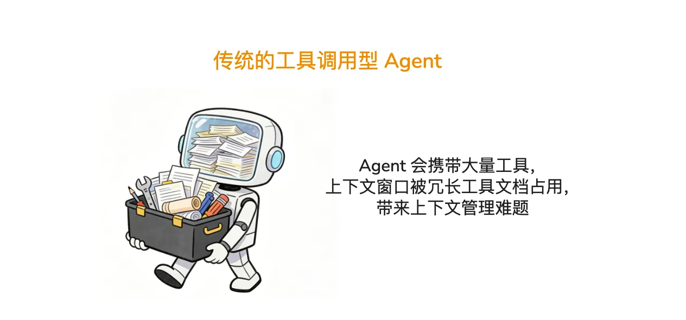

再看看该场景下传统工具调用型 Agent 的运行逻辑。以经典的 ReAct 框架为例，当用户输入提示词“请读取 xxx.csv 中的 xx 股票近一年的收盘价数据，帮我分析其走势、计算移动平均线并画出移动平均线图表”时，ReAct Agent 会先进行思考，然后调用工具读取数据；接着观察工具执行结果，再次思考，再调用工具计算移动平均线……

这种方式就像一个拿着算盘的学徒，拨一下算一下，交互次数非常频繁。那么面对海量数据时，就很容易因大量数据挤占上下文导致“上下文污染”，或因交互次数过多引发“上下文腐烂”。

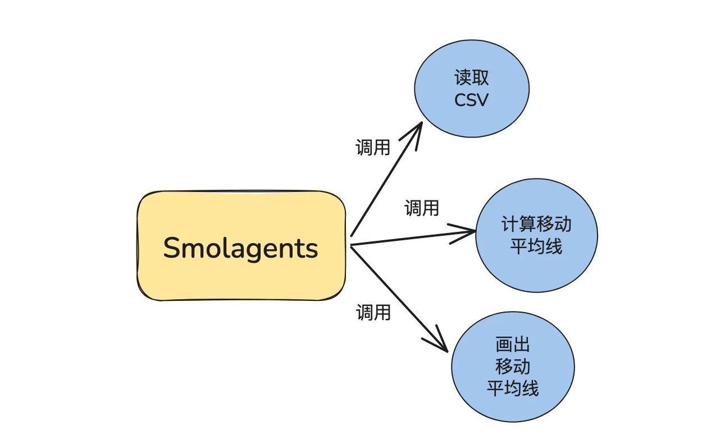

如果不借助 Agent，而是由人类程序员来解决这个问题，我们通常会直接写一个完整 Python 代码，将上述三个功能串联起来，一次性运行并得出结果。显然，这种“一把梭”的效率远高于分次运行每一个函数。

这正是这节课想传达的核心观点：用 Agent 处理任务的正解，不在于创建一个又一个的工具让模型去调用，而是要尽量以让模型生成代码的形式，直接高效地解决问题。

基于这个观点，一种名为 CodeAct 的 Agent 设计模式应运而生。其本质就是让模型通过编写代码来解决问题。接下来，我们就看一下在数据分析场景下，CodeAct 是如何运行的。

## **CodeAct 设计模式在数据分析场景中的表现**

在 CodeAct 模式下，Agent 会自带一个代码解释器工具。该工具的入参是由模型根据用户提示词生成的、能够解决当前问题的代码（通常是 Python 或 TypeScript）。

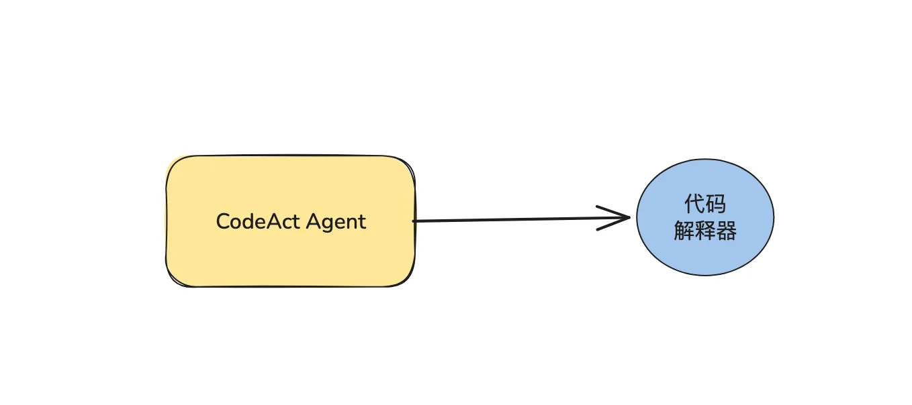

这样，整个 Agent 依然可以沿用 ReAct 的设计模式，进行“思考-工具调用-观察结果”的循环。甚至直接依赖模型本身的 Function Calling 能力构建一个最简单的 Agent Loop 也可以。不同点在于，在工具调用前，模型会生成解决当前问题的代码；工具调用环节，会调用代码解释器；观察工具结果变成了观察代码执行结果是否能解决当前问题。

在数据分析这种典型的需要编写 Pandas 等代码，且代码不固定，需要根据实际场景和数据边改代码边分析的场景下，CodeAct 模式的作用和效率尤为突出。开发者无需提前定义读取 CSV、计算移动平均线等繁杂的工具。在 CodeAct 模式中，如果使用的模型写代码能力比较强（比如智谱的 GLM-5、Kimi-K2.6 等），甚至可以直接一次性生成完整代码并完成任务。

## 使用OpenAI SDK 搭建一个CodeAct Agent

下面，我将使用 OpenAI SDK 搭建一个简易的 CodeAct 模式 Agent 代码，让你直观看看它的运行过程与效果。

### 系统提示词的设计

一切从系统提示词（System Prompt）开始。为了让这个 CodeAct Agent 具备良好的通用性，我们需要通过清晰的指令来规范它的行为。我设计的系统提示词如下：

```
你是一个在 {os.getcwd()} 目录下的能够编写和执行代码的智能助手。
当用户提出问题时，你需要：
1. 分析问题并确定需要编写什么代码
2. 编写能解决问题的Python代码
3. 使用execute_python工具执行代码
4. 分析执行结果，如果有错误则修改代码再次执行
5. 最终给用户提供答案

请确保你的代码能够正确执行并将最终结果存储在名为'result'的变量中。
```

这段提示词首先使用 os.getcwd() 获取当前目录的路径，以便为模型规定工作目录。之后通过五个明确的步骤，引导模型遵循“问题理解 → 代码生成 → 执行 → 调试 → 答案输出”的闭环流程，并对每个环节的要求做了严格规范。

### 代码解释器的设计

模型生成的代码必须在一个真实的运行环境中落地，才能获取到实际结果，因此我们需要设计一个代码解释器。在工业生产环境中，为了保障系统安全，通常会采用容器化沙箱（如 Docker）、受限解释器或专用的远程执行服务。

但在这节课的学习示例中，为了降低理解门槛，我们将使用 Python 内置的 exec。

```
def execute_python(code: str) -> str:
    """执行Python代码并返回结果。"""
    try:
        print("##执行代码:\n",code)
        # 创建本地环境执行代码
        local_vars = {}
        exec(code, {}, local_vars)  # python可以动态 执行 代码
        result= local_vars.get('result', '执行成功')
        print("##执行结果:\n",result)
        return str(result)
    except Exception as e:
        return f"Error executing code: {str(e)}
```

工具代码的核心是第 7 行，通过 exec 去执行动态代码。

### **Agent Loop** **的实现**

最后的核心是 Agent Loop 的实现。这个示例的 Agent，我们是基于模型自身的 Function Calling 能力构建的。因此 Agent Loop 主要是通过一个 While True 循环，来控制人类与模型间的多轮对话与多轮工具调用。这部分代码在我之前的专栏中反复演练过，下面再次放出核心代码，供你参考。

```
def agent_loop(messages):
    max_rounds = 10
    current_round = 0

    while True:
        current_round += 1

        if current_round > max_rounds:
            print(f"Maximum rounds {max_rounds} reached, exiting")
            sys.exit(0)

        response = send_messages(messages)

        if response.choices[0].message.tool_calls != None:
            messages.append(response.choices[0].message)

            for tool_call in response.choices[0].message.tool_calls:
                if tool_call.function.name == "execute_python":
                    arguments_dict = json.loads(tool_call.function.arguments)
                    result = execute_python(arguments_dict['code'])

                    messages.append({
                        "role": "tool",
                        "content": result,
                        "tool_call_id": tool_call.id
                    })
        else:
            break
```

代码最核心的部分在第 14 - 20 行，通过判断 OpenAI SDK 定义的 response.choices\[0\].message.tool\_calls 结构是否为空，来判断模型是进行了工具调用还是输出了最终答案。

如果进行了工具调用，代码会进行 execute\_python 函数的调用。

### **测试代码效果**

最后，我们来测试一下该 Agent 的运行效果，本次 Agent 的模型选用的是 Minimax-M2.7。

我首先使用 Claude Code 编写了一段代码，使用 AKShare 库去拉取燕京啤酒股票近一年日 K 数据，我生成的代码如下：

```
import akshare as ak
from datetime import datetime, timedelta

# 燕京啤酒股票代码
stock_code = "000729"

# 计算近一年的日期范围
end_date = datetime.now().strftime("%Y%m%d")
start_date = (datetime.now() - timedelta(days=365)).strftime("%Y%m%d")

# 获取日K线数据
stock_zh_a_hist_df = ak.stock_zh_a_hist(
    symbol=stock_code,
    period="daily",
    start_date=start_date,
    end_date=end_date,
    adjust="qfq"  # 前复权
)

# 保存到CSV文件
csv_filename = f"yanjing_beer_daily_k_{start_date}_{end_date}.csv"
stock_zh_a_hist_df.to_csv(csv_filename, index=False, encoding="utf-8-sig")
print(f"\n数据已保存至: {csv_filename}")
```

代码很简单，核心就是调用 stock\_zh\_a\_hist 接口获取数据。运行该代码，会将数据存储到yanjing\_beer\_daily\_k\_20250518\_20260518.csv文件中。

之后运行该 Agent，输入提示词：“请读取yanjing\_beer\_daily\_k\_20250518\_20260518.csv中的数据，之后计算移动平均线，并画出这些线”。

运行后的部分轮次的对话输出如下图所示：

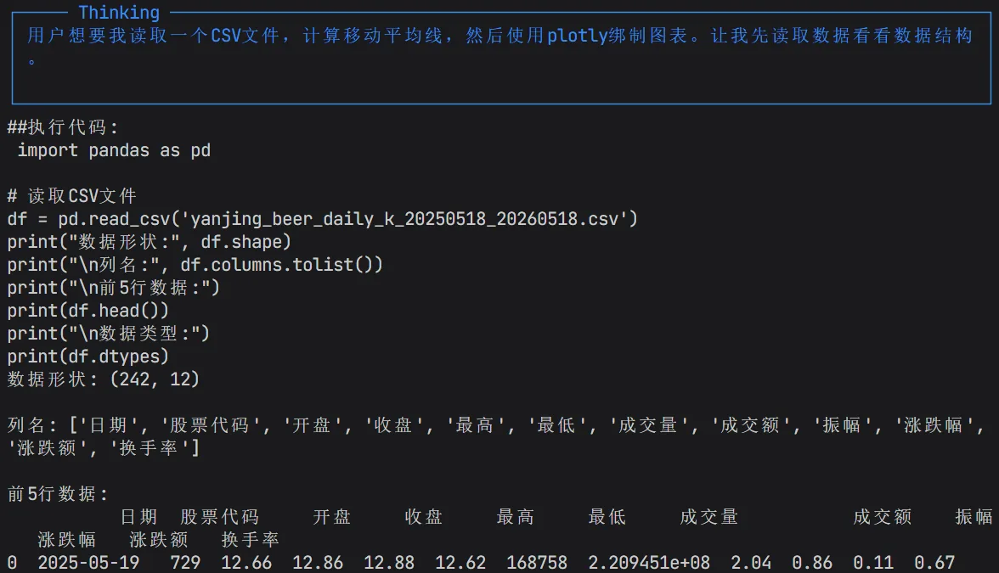

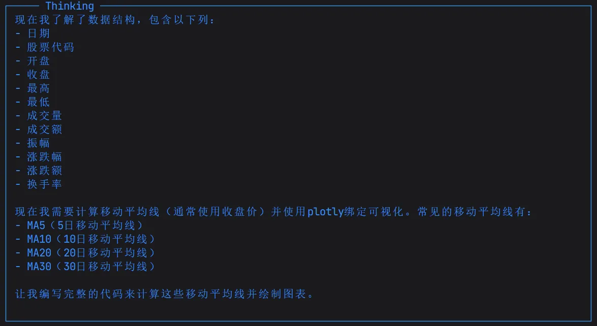

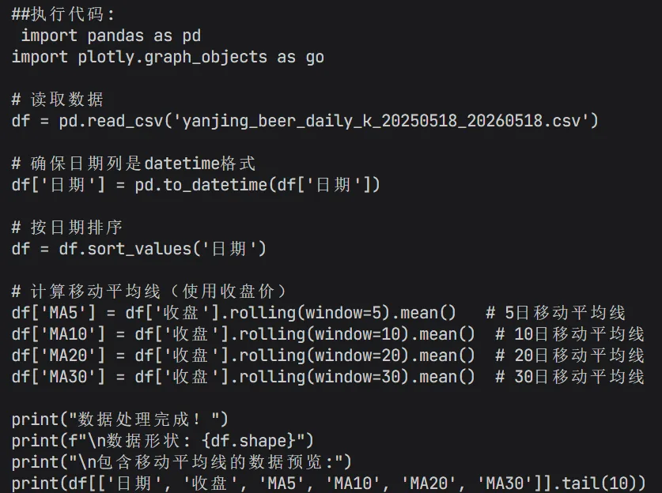

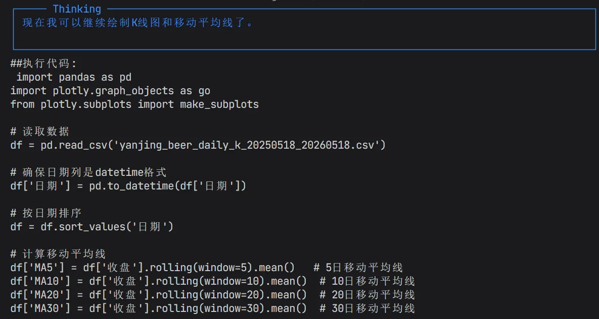

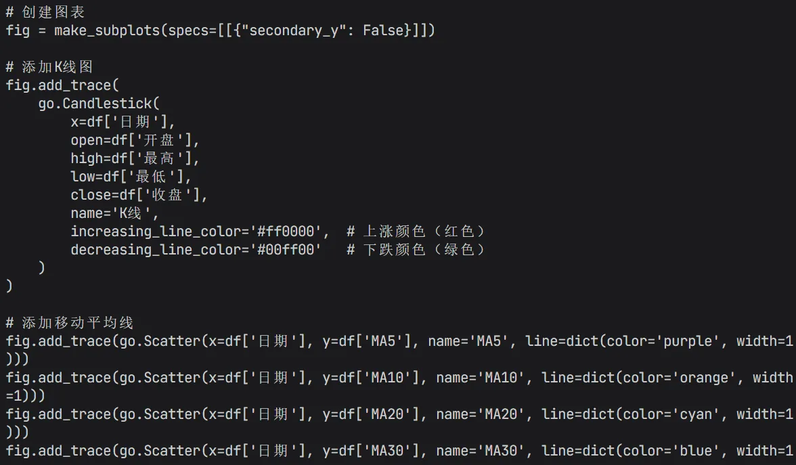

从图中可以看到，Agent 循序渐进地完成了数据读取，计算、绘图等步骤。每一步都是通过生成代码的方式完成。最后，Agent 会使用 plotly 库绘制出一个 HTML 格式的图，效果下图所示：

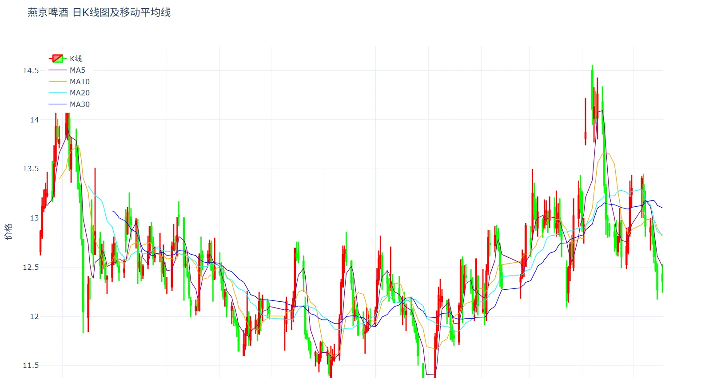

以上便是 CodeAct 设计模式的实现原理，非常简单易懂。

## **Smolagents 基于 CodeAct 设计模式的加强**

在掌握了 CodeAct 的基础原理后，我们回到开篇提到的 Smolagents 框架。

Smolagents 框架中设计了两类 Agent：一类是传统的工具调用型 Agent，即 ToolCallingAgent；另一类则是基于 CodeAct 深度扩展而来的 CodeAgent。两类 Agent 的底层都采用 ReAct 的思想。

CodeAgent 并不满足于仅仅让模型产出一段解决原生任务的代码，它的核心优势在于能够让模型“阅读”并理解本地定义好的工具代码文件。在此基础上，模型能够像一位经验丰富的资深程序员一样，直接产出一段能够“一把梭”调用多个工具的完整代码。而且代码运行在沙箱（本地虚拟环境、Docker 等多种沙箱环境可选）中，可以确保隔离性与安全性。

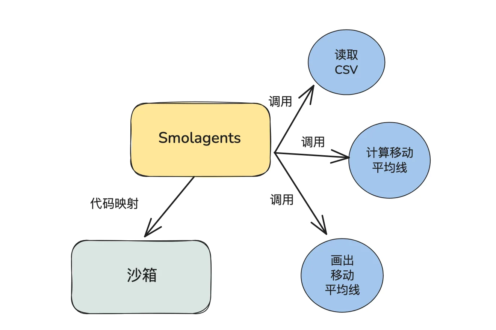

以之前的数据分析场景为例，假设本地已经存在读取 CSV 文件、计算移动平均线、绘制图表这三个工具函数。当我们将这三个本地工具交给 CodeAgent 后，模型会在底层将这些工具的函数签名和逻辑内化，生成类似如下代码：

```
# CodeAgent 自主生成的完整分析脚本
df = read_csv("stock_data.csv")  # 调用本地读取工具
if df is not None:
    ma_data = calculate_moving_average(df, window=5)  # 调用本地计算工具
    plot_chart(ma_data, title="5日移动平均线")  # 调用本地画图工具
    final_answer("分析图表已生成完毕！")
else:
    final_answer("文件读取失败，请检查路径。")
```

CodeAgent 之所以能如此智能地串联这些工具，背后依赖了两个严密的底层机制，我们依次了解看看。

**机制一** **工具信息注入系统提示词：让模型认识工具**

当你将本地定义好的工具传入 CodeAgent 时，框架底层会利用 Python 的反射机制，自动提取这些函数的名称、文档字符串以及参数。这些纯文本信息会被自动填充进一段预设的 Jinja2 模板中，组装成一段详尽的系统提示词。这段提示词会明确告诉模型有哪些工具可以被利用。

这样一来，模型在思考阶段就能清晰地“看”到本地工具的接口定义，知道该如何在代码中正确调用它们。

Smolagents 的系统提示词位于 src/smolagents/prompts 下，上述获取工具描述注入提示词的代码调用栈如下图所示：

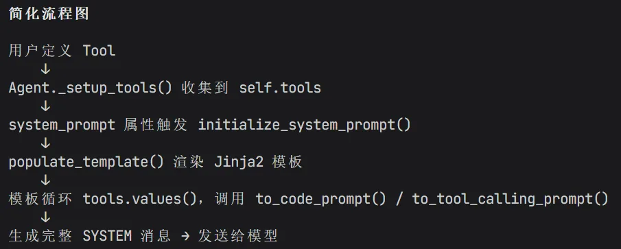

感兴趣的同学可以下载源码进一步了解。

**机制二** **工具源码打包映射：让沙箱执行工具**

当模型根据提示词生成了 Python 代码块后，Smolagents 需要将本地定义的工具代码注入到沙箱中，以便模型生成的代码可以真实调用到工具。

此时分为两种情况。第一种是使用本地代码解释器的情况，Smolagents 会将工具代码映射到 static\_tools 字典中，然后通过 AST 解释器进行工具代码的执行。

第二种是使用远程沙箱，比如E2B/docker 的情况，Smolagents 会将工具源码序列化后发送到远程沙箱中，然后在远程沙箱中重建代码。

下图展示了两种情况的代码执行路径：

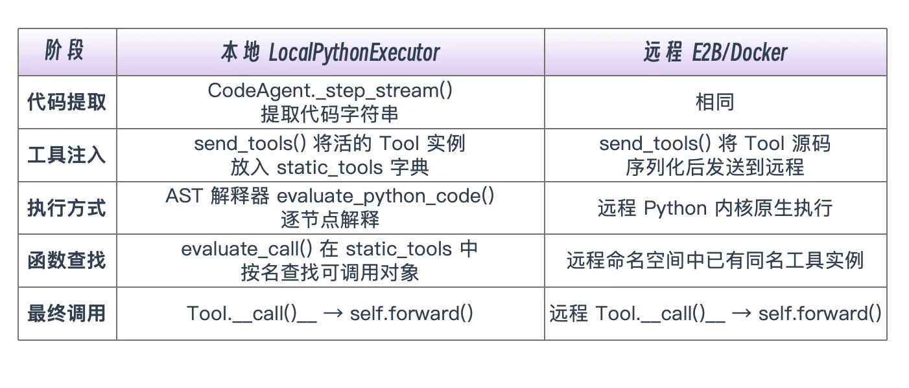

通过这种“提示词注入接口，沙箱注入源码”的双重机制，CodeAgent 将原本割裂的工具调用串联成了一个具备条件判断、变量传递和异常处理的严密逻辑闭环，真正实现了一把梭式的自动化执行。

下节课开始，我们就开始学习 Smolagents 的各项功能和使用方法。

## 总结

今天，我们主要是从 CodeAct 设计模式出发，结合例子，让你理解该设计模式相比传统工具调用模式的高效性与灵活性。

该模式在现代 Coding Agent 框架中已经得到了广泛的应用。比如在后面的课程，大家会发现，当我们把代码解释器工具换成 Bash 工具，也就是一个可以在 Linux 上执行命令行的工具时，一个最小版 Coding Agent（比如 Claude Code）雏形，便可以成功搭建。这便是 Bash is all your need 的思想。

## 思考题

请思考并列举几个特别适合使用 CodeAct 模式的场景，并说明为什么。

欢迎你在留言区展示你的思考过程，我们一起探讨。如果你觉得这节课的内容对你有帮助的话，也欢迎你分享给其他朋友，我们下节课再见！