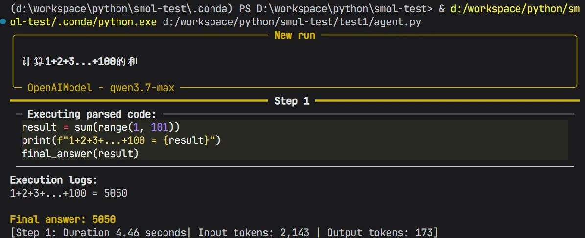
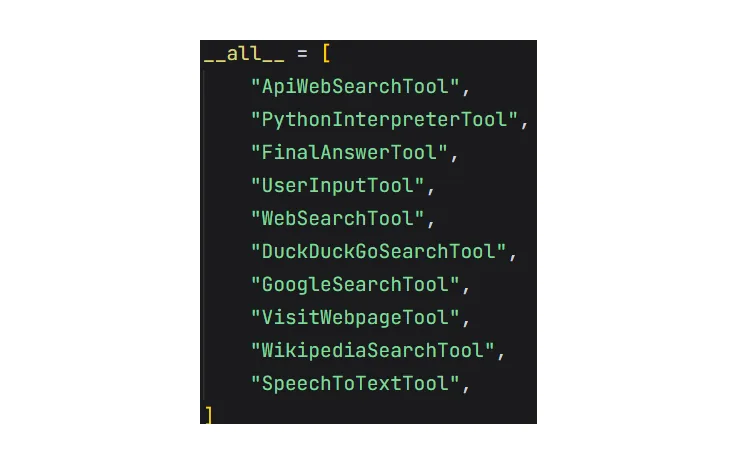
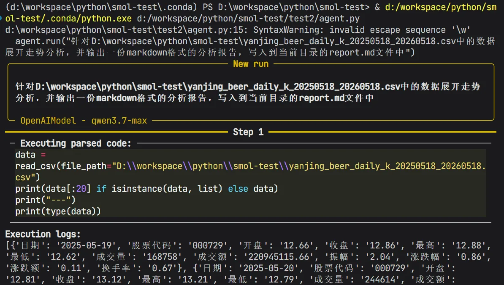
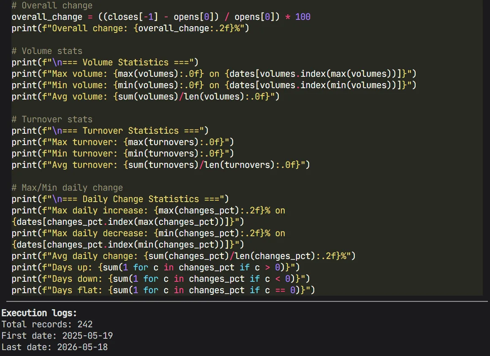
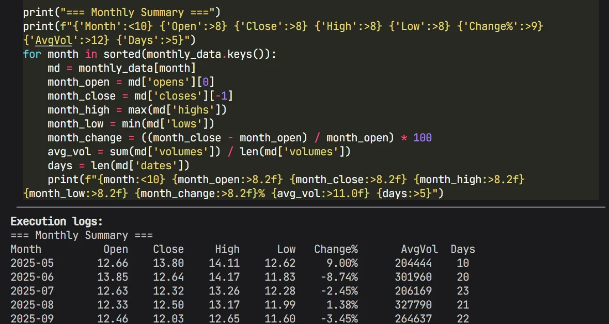
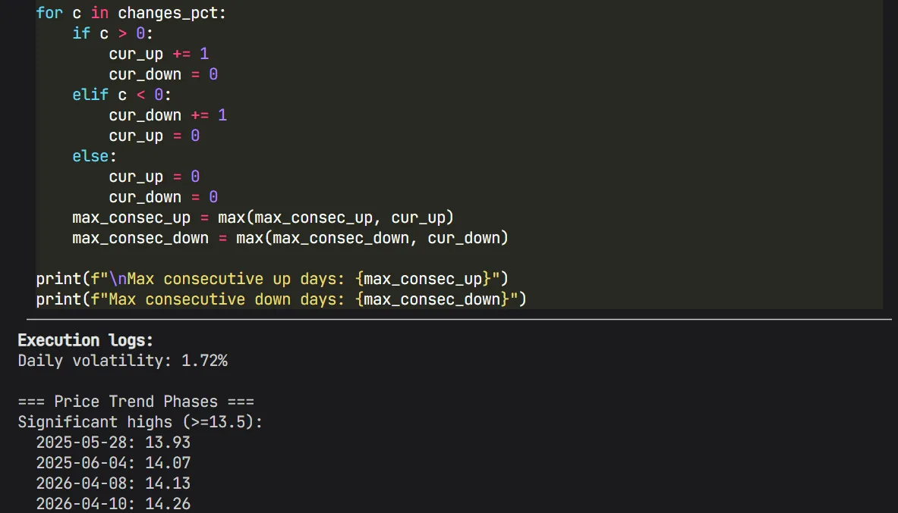
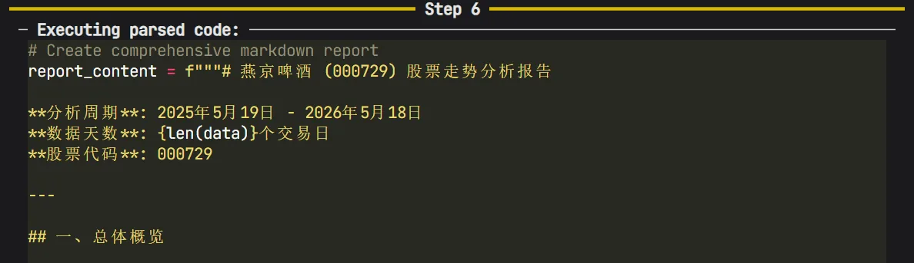
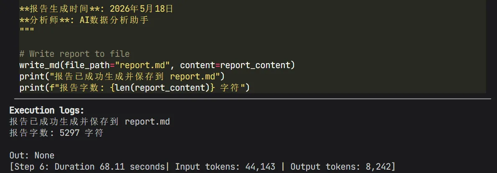
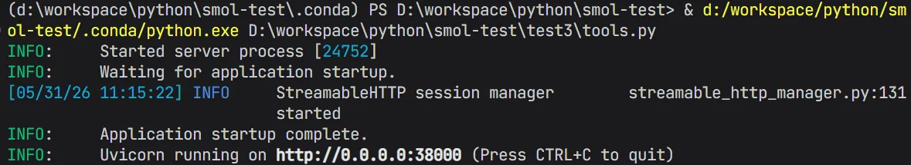
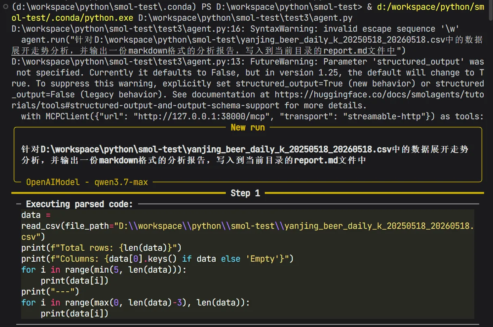

# 03｜核心：用 Smolagents 结合自定义工具完成数据分析报告生成
你好，我是邢云阳。

上一节课中，我们通过代码深入剖析了 CodeAct 模式的运行机制，还学习了 Smolagents 相较于基础 CodeAct 模式有哪些增强特性。

今天，我们正式进入实战环节，学习如何利用 Smolagents 结合自定义工具完成数据分析任务。

## Smolagents 快速上手

让我们先从环境配置和简单使用开始。

### 环境配置

首先，我们需要安装 Smolagents 的 Python SDK。你可以在 Python 环境中执行以下命令：

```
pip install "smolagents[toolkit]"
pip install "smolagents[openai]"
```

上述命令分别用于安装 Smolagents 的基础工具包，并适配 OpenAI 格式客户端的组件。这个适配是出于兼容性的考虑，让 Smolagents 能够兼容并调用符合 OpenAI 接口规范的模型服务。

### 快速跑通 Smolagents

安装完成后，我们可以通过后续示例代码验证环境配置是否成功，并观察 Agent 的基础运行逻辑。

```
from smolagents import CodeAgent, OpenAIModel

model = OpenAIModel(
    model_id="qwen3.7-max",
    api_key="sk-",
    api_base="https://dashscope.aliyuncs.com/compatible-mode/v1",
)
agent = CodeAgent(tools=[], model=model, stream_outputs=False)

agent.run("计算1+2+3...+100的和")
```

代码第 1 行引入了 CodeAgent 与 OpenAIModel 两个包，其中 CodeAgent 就是之前在第 2 节课讲过的基于 CodeAct 模式的 Agent，OpenAIModel 则是用于 Smolagents 连接 OpenAI 兼容模型的客户端。

代码第 3 - 7 行配置了千问的模型作为 CodeAgent 的模型。

代码第 8 行初始化了 CodeAgent，并传入了几个参数。其中 tools 代表使用什么工具，此处我们没有填写，代表暂时不配置任何工具。model 是上文配置的千问，stream\_outputs=False 表示不使用流式输出。

最后在第 10 行，通过run()方法运行 CodeAgent，并传入了用户提示词计算 1 到 100 的和。

运行效果如下：



可以看到，模型首先生成了一段利用 sum() 函数求和的 Python 代码，随后在本地沙箱环境中执行该代码，并最终返回计算结果 5050。

这一过程与我们在第二节课中手动实现的 CodeAct Agent 原理（即“思考-编码-执行-反馈”）是一致的。

## 自定义工具完成数据分析报告生成

虽然 Smolagents 提倡使用 Code 直接解决问题，但对于特定业务，工具依然不可或缺。对于这一部分，Smolagents 提供了完整的解决方案，包括可以使用内置工具、MCP 工具、LangChain 工具以及自定义工具等等。

### 内置工具与自定义工具

Smolagents 定义了部分内置工具，其源码位于src/smolagents/default\_tools.py中，全部工具列表如下：



包括了 Google 等联网搜索工具、访问网页的工具等等，可以在代码中直接 import 使用，比如下面代码展示了如何使用 WebSearchTool：

```
from smolagents import CodeAgent, WebSearchTool, OpenAIModel

agent = CodeAgent(tools=[WebSearchTool()], model=model, stream_outputs=False)
```

但是这些工具大多在国外搜索引擎，对于国内用户来说，基本用不上。因此我们仅仅是参考其代码的编写手法，之后定义自己的工具。

根据 WebSearchTool 的源码可以发现，所有自定义工具均需继承自 Tool 基类，并严格包含以下五大核心要素，以便 LLM 能够准确理解并调用。

1. name（工具名称）：一个直观描述工具功能的属性（例如 model\_download\_counter）。

2. description（工具描述）：用于填充代理系统提示词（System Prompt）的详细说明，帮助模型理解工具的适用场景。

3. inputs（输入参数）：一个包含键值对的字典，其中 type 和 description 用于帮助 Python 解释器对输入做出准确的类型推断。

4. output\_type（输出类型）：指定工具返回值的类型。输入与输出的类型均应采用双峰格式，支持 string、boolean、integer、number、image、audio、array、object、any、null 等标准类型。

5. forward（执行逻辑）：包含具体推理与执行代码的核心方法。


我们以生成数据分析报告为例，讲解一下如何自定义 Smolagents 工具。

对于数据分析报告的分析，我们可以设计两个简单的工具，第一个是 Read 工具，用于读取 CSV文件，第二个工具是 Write 工具，用于将最后的分析报告写入到 CSV 文件中。

这部分代码，可以让 Claude Code 参考 **WebSearchTool** 的源码进行编写，也可以自己编写。如果是让 Claude Code 编写，提示词可以写让 Claude Code 参考 WebSearchTool 源码编写 ReadCSVTool 和 WriteMDTool 两个工具类，工具类编写的要点是要包含刚才说的那 5 个元素。

我们以 ReadCSVTool 为例展示一下编写完成的工具代码：

```
class ReadCSVTool(Tool):
    name = "read_csv"
    description = """
    用于读取指定的 csv 文件"""
    inputs = {
        "file_path": {
            "type": "string",
            "description": "csv 文件的路径",
        }
    }
    output_type = "any"

    def forward(self, file_path: str) -> any:
        path = Path(file_path)
        if not path.exists():
            raise FileNotFoundError(f"文件不存在: {file_path}")
        if not path.suffix.lower() == ".csv":
            raise ValueError(f"不是CSV文件: {file_path}")

        with path.open("r", encoding="utf-8-sig", newline="") as f:
            reader = csv.DictReader(f)
            return [row for row in reader]
```

代码包含了五大元素，其中通过 forward 函数实现了读取 csv 文件的功能。 WriteMDTool 的实现也是同样的套路。

之后，可以直接在前面快速上手的那份代码中，直接使用这两个工具，然后换一下用户提示词就可以，代码如下：

```
from smolagents import CodeAgent, OpenAIModel
from tools import ReadCSVTool, WriteMDTool

agent = CodeAgent(tools=[ReadCSVTool(), WriteMDTool()], model=model, stream_outputs=False)

agent.run("针对D:\workspace\python\smol-test\yanjing_beer_daily_k_20250518_20260518.csv中的数据展开走势分析，并输出一份markdown格式的分析报告，写入到当前目录的report.md文件中")
```

运行后的结果如下。首先，模型编写了代码调用 read\_csv 工具读取了指定的 CSV 文件。read\_csv 工具便是 Smolagents 从 ReadCSVTool 工具类映射而来的。



之后，它分多个步骤编写了代码，统计比如振幅、单日最大最小涨幅、月线等等指标：







最后编写代码，调用 write\_md 工具，将报告写入到 report.md 文件中：





从整个过程我们可以看出，CodeAct 模式的灵活性远超传统工具调用模式，可以根据用户提示词的不同，生成不同的代码来解决问题，而不是像传统工具调用模式一样，因为业务工具的能力边界，限制用户提示词的编写。

此外，Smolagents 可以将用户自定义工具映射到 Python 环境中，从而直接由模型生成代码，然后完成调用，完美融合了 CodeAct 与传统工具调用模式的特点。

### MCP 工具

除了按照 Smolagents 规定的格式编写本地工具外，Smolagents 还封装了 MCP Client，可以连接 Stdio 与 Streamable-HTTP 协议的 MCP Server，从而调用工具。因此，我们自定义工具时，又多了一种选择——将工具封装为 MCP Server。

同样采用上述数据报告生成的示例，来动手试验一下如何使用 Smolagents 对接 MCP 工具。

我们可以通过 Claude Code 直接完成包含 read\_csv 和 write\_md 的两个工具的 MCP Server 编写，比如提示词可以这样写：

```
在 @tools.py 文件中写两个函数：
第一个是read_csv函数，用于读取指定CSV文件的内容，第二个函数是write_md函数，用于将markdown内容写入到指定的md文件中。
之后将这两个函数，使用mcp库的FastMCP包，封装为一个MCP Server的两个工具，MCP Server使用stream-http方式通信，host为0.0.0.0，端口为38000
```

这样就会生成一个包含这两个工具的 MCP Server，代码我会作为配套资料传到我的 [GitHub](https://github.com/xingyunyang01/Geek04/tree/main "") 上，在这里就不贴代码了。

启动 MCP Server 后，可以看到如下效果：



之后我们还要修改一下 CodeAgent 的代码，引入 Smolagents 封装好的 MCPClient 来连接 MCP Server，代码如下：

```
from smolagents import CodeAgent, MCPClient, OpenAIModel

with MCPClient({"url": "http://127.0.0.1:38000/mcp", "transport": "streamable-http"}) as tools:
    agent = CodeAgent(tools=tools, model=model, stream_outputs=False)
    agent.run("针对D:\workspace\python\smol-test\yanjing_beer_daily_k_20250518_20260518.csv中的数据展开走势分析，并输出一份markdown格式的分析报告，写入到当前目录的report.md文件中")
```

代码第 1 行引入了 MCPClient 包，代码第 3 行初始化了 MCPClient，配置了 MCP Server 的 url 以及协议。最后的 as tools，是将 MCP Server 的工具引出来，然后在代码第 4 行赋值给了 tools 变量。

最后还需要安装一下 Smolagents 的 MCP 组件库，上述代码才能运行，安装命令如下：

```
pip install smolagents[mcp]
```

代码运行后的效果与使用自定义工具基本一致。



最后，MCP Client 还支持结构化输出的设置。比如下面的代码示例：

```
from pydantic import BaseModel, Field
from mcp.server.fastmcp import FastMCP

mcp = FastMCP("Weather Service")

class WeatherInfo(BaseModel):
    location: str = Field(description="The location name")
    temperature: float = Field(description="Temperature in Celsius")
    conditions: str = Field(description="Weather conditions")
    humidity: int = Field(description="Humidity percentage", ge=0, le=100)

@mcp.tool(
    name="get_weather_info",
    description="获取指定地点的天气信息并作为结构化数据输出",
)
def get_weather_info(city: str) -> WeatherInfo:
    return WeatherInfo(
        location=city,
        temperature=22.5,
        conditions="partly cloudy",
        humidity=65
    )
```

可以看到，如果 MCP Server 的工具返回值使用 Pydantic 库定义了结构化输出，则 MCPClient 可以用一个structured\_output=True 来支持结构化输出。

具体代码如下：

```
with MCPClient({"url": "http://127.0.0.1:38000/mcp", "transport": "streamable-http"}, structured_output=True
) as tools:
```

OK，通过这个例子，你已经掌握了如何基于 Smolagents 提供的便利，使用自定义工具做业务。

## 总结

今天我们讲解了 Smolagents 的 CodeAgent 模式的快速上手方法，还一起跑通了自定义工具的开发流程。其实学习任何新框架流程都大同小异，掌握这些核心要素都是入门的第一步。毕竟，无论一款脚手架的特性多么丰富，其最终落脚点始终在于如何通过工具高效地解决实际问题。

此外，如果你仔细看过我之前的专栏，可能已经发现，我讲解的方式发生了显著变化。我不再像过去一样展示海量的代码细节，而是越来越注重引导你利用 AI 来生成代码。它生成的代码可能每次都有细微差异，那么理解原理和代码核心逻辑，就成了我们有效 review 和调试的必要前提。因此，我建议你也把注意力更多 **聚焦于脚手架的功能特性与使用范式。**

这种方式的转变，也是当前软件开发的主流趋势的体现——开发者的核心竞争力正逐渐从单纯的代码编写，转向 **对框架逻辑的深刻理解与对 AI 工具的高效驾驭**。

## 思考题

请思考一下这节课所讲的两种工具编写方式，哪一种更加实用呢？或者说分别有什么使用场景？

欢迎你在留言区展示你的思考过程，我们一起探讨。如果你觉得这节课的内容对你有帮助的话，也欢迎你分享给其他朋友，我们下节课再见！