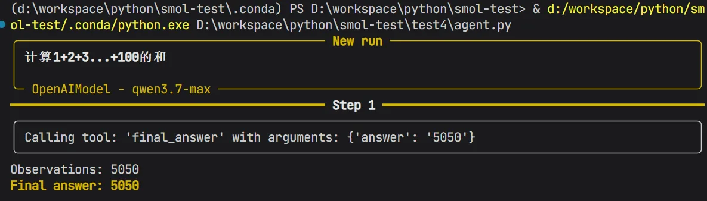
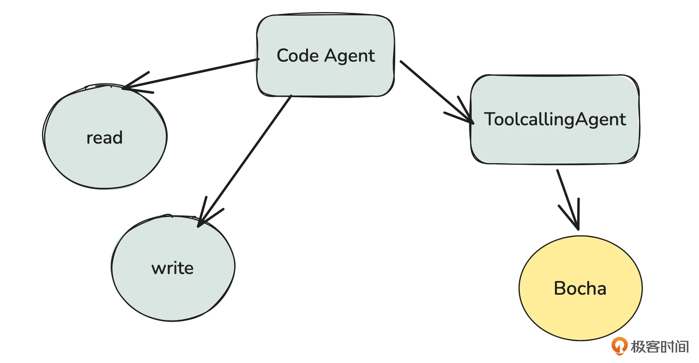
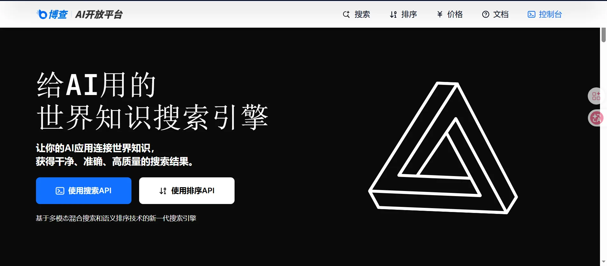
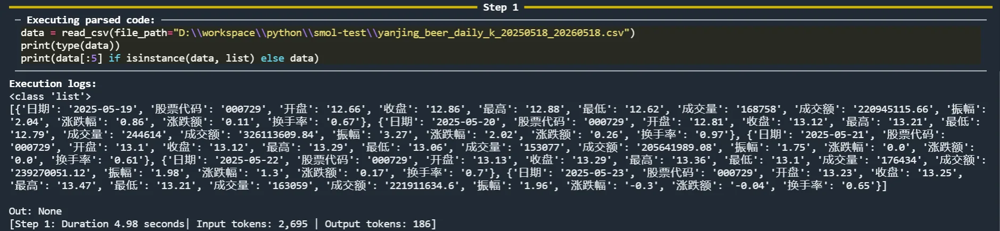
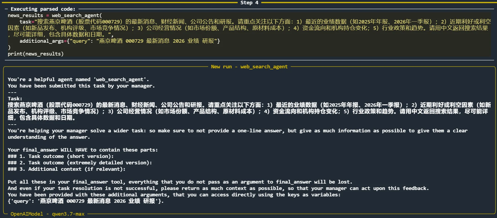
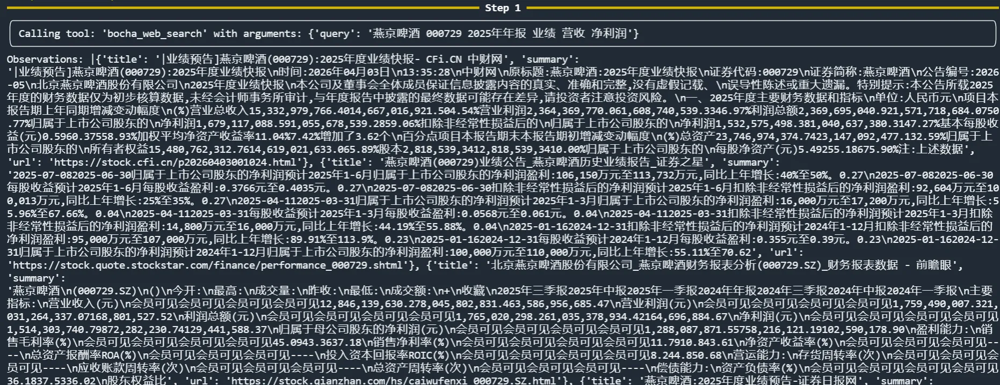
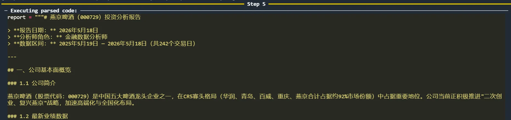

# 04｜扩展：通过多 Agent 协同机制提升分析深度
你好，我是邢云阳。

这节课，我们将进入 Smolagents 脚手架系列的最后一讲，重点探讨 ToolCallingAgent 以及多 Agent 协同机制。掌握了这些高级功能，我们就能进一步提升数据分析报告的深度与全面性。

## ToolCallingAgent

ToolCallingAgent 是一种典型的工具调用型 Agent，其底层基于 ReAct（推理与行动）思想实现。在使用方式上，掌握起来也不难，因为它与我们之前接触的 CodeAgent 基本一致。

让我们通过一个简单的示例代码，为你直观展示它的用法。

```
from smolagents import ToolCallingAgent, OpenAIModel

model = OpenAIModel(
    model_id="qwen3.7-max",
    api_key="sk-",
    api_base="https://dashscope.aliyuncs.com/compatible-mode/v1",
    extra_body={"enable_thinking":False},
)
agent = ToolCallingAgent(tools=[], model=model)

agent.run("计算1+2+3...+100的和")
```

这段代码与上一节课 CodeAgent 的模型配置相比，主要区别在于第 7 行增加了一个 extra\_body 参数。

extra\_body 是千问（Qwen）官方在 OpenAI 标准 SDK 之外提供的扩展参数，用于传入一些特定的自定义配置。在这个例子中，我们传入了 {"enable\_thinking": False}，其作用是关闭模型的深度思考功能。

这个配置至关重要。对于基于 ReAct 模式的 Agent， **必须关闭模型的内部深度思考**。因为如果开启，模型会优先在内部进行长篇幅的思考，这会与 ReAct 框架本身预设的“思考-行动”循环逻辑产生冲突，影响工具调用的正确执行。

在代码的第 9 行，我们初始化 ToolCallingAgent 时，特意像上一节课测试 CodeAgent 那样，先不传入任何工具（tools=\[\]），以此来观察其在没有外部工具辅助下的表现。

代码的运行效果如下：



可以看到，模型依然给出了正确的计算结果。但这并非通过调用工具实现，而是单纯依赖其自身训练数据中内置的知识。这正好揭示了 ToolCallingAgent 与 CodeAgent 的本质区别：ToolCallingAgent 的能力来源要么是模型自身的预训练知识，要么是开发者为它提供的外部工具。

## 多 Agent 协同提升分析深度

对于 Smolagents 提供的 CodeAgent 和 ToolCallingAgent 两种核心 Agent。我们将二者结合使用，可以充分发挥各自的优势，构建出更强大的分析系统。

我们继续给前面的例子添砖加瓦，在之前数据分析的基础上，引入一个负责联网搜索的 Agent。通过它获取个股相关的最新新闻，再结合日 K 线数据进行综合研判，从而为投资决策提供更精准、更全面的建议。

在 Smolagents 的设计中，由于其核心思想就是要以代码的方式解决问题。因此 CodeAgent 通常作为主 Agent 协调全局，并处理部分适合于用代码方式完成的任务，而 ToolCallingAgent 则可以作为子 Agent（Sub-Agent）调用特定工具来完成辅助任务。基于此，我们可以设计出如下的系统架构：



接下来，我们就根据这张架构图，开始逐步实现整个系统。

### 联网搜索工具的实现

首先，我们需要实现一个联网搜索工具。虽然市面上有 Google、Sougou、DuckDuckGo 等免费搜索方案，但它们或存在搜索精度问题，或对网络环境有特殊要求。因此，这里引入一个在专业项目中常用的付费方案——博查（BoCha）。



博查是一款专为 AI 开发者设计的专业搜索引擎。与百度等传统通用搜索引擎不同，博查针对大语言模型（LLM）的需求进行了深度优化，能够从近百亿高质量网页（涵盖新闻、学术、百科及多模态内容源）中检索并提供结构化信息，数据清洗质量极高。

博查提供了三种类型的 API：

1. Web Search API：基础的联网搜索接口。

2. AI Search API：在联网搜索基础上增加大模型处理，可实现意图识别和搜索结果总结。

3. Agent Search API：在搜索基础上集成 Agent 能力，实现类似 DeepResearch 的深度研究效果。


这里我们选择 Web Search API 来构建联网搜索工具。由于我对博查比较熟，因此就自己简单实现了一下，代码如下：

```
class BoChaWebSearch(Tool):
    name = "bocha_web_search"
    description = """
    用于根据搜索词调用Bocha Web Search API 进行联网搜索"""
    inputs = {
        "query": {
            "type": "string",
            "description": "要搜索的查询",
        }
    }
    output_type = "string"

    def forward(self, query: str) -> str:
        data = {
            "query":query,
            "summary":True,
            "count":10,
            "page":1
        }
        endpoint = "https://api.bochaai.com/v1/web-search"
        API_KEY = os.getenv("BOCHA_API_KEY")
        headers = {
            "Authorization": f"Bearer {API_KEY}",
            "Content-Type": "application/json"
        }

        response = requests.post(endpoint, headers=headers, data=json.dumps(data))
        response.raise_for_status()
        search_ret = response.json()
        return self.bocha_for_list(search_ret)

    def bocha_for_list(self, search_ret: dict):
        data = search_ret["data"]
        pages = data["webPages"]["value"]
        ret=[]
        for page in pages:
            ret.append({"title":page["name"],"summary":page["summary"],"url":page["url"]})
        return ret
```

该代码遵循 Smolagents 自定义工具的标准结构。在 forward 函数中，我们实现了对 Web Search API 的访问。获取博查返回的原始数据后，通过 bocha\_for\_list 方法将其格式化为更易读的列表形式。

如果你不想自己实现，现在我们也可以让 AI 代劳。你可以把博查官方给出的 API 文档—— [⁠⁠⁠Web Search API - 飞书云文档](https://bocha-ai.feishu.cn/wiki/RXEOw02rFiwzGSkd9mUcqoeAnNK "") 粘贴给 Claude Code，让它阅读该文档，然后写一个 BochaWebSearch工具。

### 子 Agent 的构建

接下来，我们构建子 Agent。该 Agent 将使用 ToolCallingAgent，专门负责处理联网搜索任务。代码如下：

```
web_search_agent = ToolCallingAgent(
    name = "web_search_agent",
    description = "可以根据用户的问题，进行联网搜索，返回搜索结果",
    tools=[BoChaWebSearch()],
    model=model,
    max_steps=10
)
```

和这节课开头基础的 ToolCallingAgent 示例相比，我们增加了 name 和 description 两个关键参数。这两个参数相当于 Agent 的“名片”，为主 Agent 提供识别和调用该子 Agent 所需的信息。

### 主 Agent 的构建

主 Agent 依然采用上一节课介绍的 CodeAgent。代码如下：

```
agent = CodeAgent(
    tools=[ReadCSVTool(), WriteMDTool()],
    model=model,
    managed_agents=[web_search_agent]
)
```

与上一节课的代码相比，我们新增了 managed\_agents 参数。顾名思义，该参数用于为主 Agent（CodeAgent）指定一个可管理的子 Agent 列表。

完成代码构建后，我们只需通过精心设计的提示词，即可驱动这套多 Agent 系统进行深度分析。以下是用于测试的提示词：

```
#角色设定：你是一位专业的金融数据分析师。
#任务目标：请结合本地数据与最新网络资讯，对“燕京啤酒”进行全面的行情与基本面分析，并生成一份 Markdown 格式的投资分析报告。
#具体执行步骤：
1. 本地数据走势分析：
  - 读取并分析文件 D:\workspace\python\smol-test\yanjing_beer_daily_k_20250518_20260518.csv。
  - 提取关键指标（如开盘价、收盘价、最高/最低价、成交量等），分析近一年的股价整体走势、波动特征及关键时间节点。
2. 联网搜索与资讯挖掘：
  - 搜索燕京啤酒近期的财经新闻、公司公告及研报。
  - 重点梳理近期的利好因素（如业绩预增、新品发布、机构评级等）与潜在风险（如市场竞争、资金流向、原材料成本等）。
3. 综合分析与总结：
  - 将本地技术面数据与网络基本面消息相结合，进行交叉验证与统一分析。
  - 给出客观的总结性观点。
4. 输出报告：
  - 整合以上所有分析内容整合成一份结构清晰、排版美观的 Markdown 报告。
  - 将报告内容完整写入当前工作目录下的 report.md 文件中。
```

该提示词的关键在于第 2 步，它明确要求进行联网搜索。这是我们测试的重点，用于验证主 Agent 是否能成功启动子 Agent 来执行搜索任务。

此外，值得一提的是，所谓精心设计提示词，一定不是由人来一个字一个字敲出来的，通常是人与AI共同创建的。比如，在最开始可以给出一个简单的框架，包含人设、任务目标、执行步骤、边界等等，类似写 SKILL.md 那样。之后，可以把这版提示词教给 AI，然后告诉他，还需要处理什么样的业务等等，由 AI 对提示词进行润色。业务这部分理解得越透彻，描述得越精准详细，AI润色的效果越好。

### 测试

接下来，我们运行代码，进行测试。

如下图所示，程序启动 CodeAgent，首先按照提示词要求，读取并分析日 K 线数据。



这个过程持续了三步，在完成本地数据分析后，程序进入第 4 步，调用子 Agent (web\_search\_agent) 执行子任务。截图中显示的“New run”表明系统开启了全新的 Agent 实例和独立的上下文环境。



随后，子 Agent 开始进行联网搜索。请注意下图中的“Step 1”，它进一步印证了这是一个全新的对话流程。



子 Agent 完成任务后，程序控制权交还给主 Agent。主 Agent 继续执行第 5 步，将所有分析内容整合并写入报告文件。



至此，一套高效、智能的多 Agent 协同分析系统便轻松构建完成，并取得了非常理想的效果。

## 总结

这节课，我们深入讲解了 Smolagents 中的 ToolCallingAgent，以及如何通过主从 Agent 协同工作，构建多 Agent 架构。现在你已经充分了解了 Smolagents 脚手架的主要功能，下一步就是多练、多用，把熟练度刷上去。

作为 Code Agent 或 Coding Agent 的先驱之一，Smolagents 始终秉持轻量化的设计哲学。它在 ReAct 框架的基础上，配合沙箱环境，专注于用代码解决问题。虽然它不像后续介绍的 Claude Agent SDK 等框架那样具备复杂记忆、会话管理和监控等高级特性，但其轻量、简洁的特点，使其在处理日常轻量级任务时具有独特的优势。

最后，需要特别提醒的是，我们在课程示例中是在本地 Python 环境中直接运行模型生成的代码。这种方式在生产环境中 **存在代码越权等安全隐患**。因此，强烈建议在生产环境中使用 Docker 作为远程沙箱来运行代码，以实现有效的安全隔离。具体方法你可以参考如下文档： [Secure code execution](https://huggingface.co/docs/smolagents/tutorials/secure_code_execution#docker-setup "")。

## 思考题

请思考在 Smolagents 设计的体系下，构建多 Agent 系统时，有没有必要让主 Agent 不做任何业务，而是为其添加多个子 CodeAgent、ToolCallingAgent来处理业务，主 Agent 只做调度与结果整理？

欢迎你在留言区展示你的思考过程，我们一起探讨。如果你觉得这节课的内容对你有帮助的话，也欢迎你分享给其他朋友，我们下节课再见！