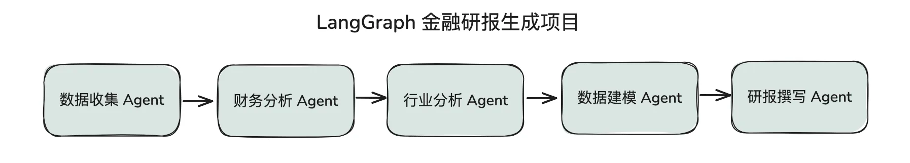

# 05｜起点：从复杂金融任务看Claude Agent SDK
你好，我是邢云阳。

掌握了 CodeAct 范式与 Smolagents 框架之后，我们实际上已经做了一次思想升级。具体来说，跨越了 2025 年之前以传统工具调用为主的 Agent 构建思维，正式与当前主流的“以代码生成与执行为核心、工具调用为辅助”的 Coding Agent 前沿理念接轨。

现在你应该对 Smolagents 有了更深入的理解，我们可以把它看成 ReAct Agent 的升级版，它架构精简、上手极快，我们很短时间里就能用它搭建出可用的 Agent。但本质上它只是个核心 Agent 源码不到千行的轻量脚手架，自然也有局限性：缺乏上下文管理、长期记忆、自我反思机制以及安全护栏等所谓 Harness 工程的组件。

因此，面对真实且复杂的企业级业务场景时，我们就需要引入 “Harness 含量”更高的工程化框架。基于这一需求，我们来学习 Claude Agent SDK，这是由 Anthropic 官方推出的闭源开发套件。该 SDK 脱胎于曾被誉为“全球最强 AI 编程助手”的 Claude Code，旨在帮助开发者构建真正具备自主决策与执行能力的生产级 Agent。

我将以金融研报生成项目为例，带领你逐步在实战中上手 Claude Agent SDK 的使用方式。

## 项目背景

在基金公司或投资机构中，撰写研究报告是一项至关重要的工作。

无论是宏观经济与策略分析、行业趋势研判，还是针对特定公司或个股的深度剖析，都有许多讲究。不同类型的报告不仅需要处理形式各异的数据，还涉及高度专业的知识应用。这不仅要求研究人员进行海量的数据收集与深度分析，还得耗费大量时间精力进行内容研判与逻辑推演。

然而，尽管投研工作看似复杂多变，其底层逻辑实际上仍遵循着许多固定的方法论与标准化步骤。这些重复性的研究流程完全可以被归纳、提炼并固化下来。

如果我们能够将这些成熟的分析方法转化为可复用的 Skills 进行沉淀，并在此基础上搭建一套Agent 系统，便能将原本依赖个人经验的零散动作升级为标准化的智能工作流。

这里你可以先思考一下，哪些动作可以标准化，这样的 Agent 系统都需要哪些能力。这些问题，都是我们后续实现 Agent 必要的前置工作。

## 手工撰写研报的基本流程

以撰写个股深度研报为例，传统的手工撰写流程通常包含一套严谨的标准化步骤。

首先，研究人员需要研究目标公司的财务情况，这就需要获取目标公司过去 3 至 5 年的三大财务报表（资产负债表、利润表和现金流量表）作为基础数据源。这些数据可通过数据抓取接口获取，免费的接口有 AKShare API（但近几来网络不太稳定），对于网络稳定性要求更高可以考虑付费数据抓取接口 TuShare API 。

随后，需对报表数据进行多维度的财务分析，涵盖盈利能力、偿债能力、营运能力及现金流状况，并结合市盈率（PE）、市净率（PB）等指标进行估值测算。

在此基础上，研究还需横向展开：一方面提取同行业均值及 3 至 5 家可比公司的财务数据进行对标分析，以明确目标公司的相对优劣势；另一方面梳理股权结构（比如股东构成等），结合管理层背景与资本配置历史进行定性评估。

此外，还需深入剖析主营业务构成、技术专利、渠道优势等核心竞争力要素，从而构建完整的“护城河”分析框架。

最后，通过检索海量新闻与政策资讯完成风险研判，并将上述所有研究成果汇总为一份图文并茂、逻辑严密的研究报告。

如果你遇到的需求，是把其他传统业务 Agent 化，也建议你像我示范的这样，先梳理一下标准化的步骤，这样更容易帮你看清工程痛点。

## Agent 撰写研报的问题

梳理完上述流程，会发现核心痛点是数据处理量极其庞大。若直接将全量原始数据及各阶段的分析结果一股脑塞入大模型的上下文窗口中，极易引发 Token 溢出问题。

例如，在 2025 年我使用 LangGraph 框架配合 qwen3-max 模型（256K 上下文）开发该项目时，仅载入近 3 年的三大表数据并做了几轮对话分析，便触发了上下文长度达到上限的错误。

为解决这一问题，当时设计了如下图所示的做法，将复杂任务拆解为多个 LangGraph 节点，比如数据收集节点，数据分析节点等等，每个节点完成任务后将结果写入本地文件，上下文中仅保留文件路径与功能描述。这种将中间状态持久化到磁盘的策略，也是 Cursor、扣子空间等产品惯用的上下文管理手段。

然而，自行实现这套机制不仅耗时耗力，且难以做到尽善尽美。纵观当时的成熟框架，不论是 LangChain、LangGraph 还是 CrewAI、Smolagents 等都需要自行设计实现上下文管理。

放到现在这个节点再审视这个任务，如果直接使用 Claude Code 成熟产品，这样的问题就可以被轻松解决。毕竟 Claude Code 对于百万行代码库的浏览、总结、修改等，都绰绰有余。但作为一款编程工具，它并不适合作为面向终端用户的金融产品底座。

因此，官方推出的闭源套件 Claude Agent SDK 成为了破局的关键。

## Claude Agent SDK 的优势

Claude Agent SDK 允许开发者直接构建具备 Claude Code 同等能力的生产级 Agent，这是它的最大价值在于。该 SDK 完整继承了 Agent Loop、内置工具（Bash、Read等）、SubAgent、Skills、Hook 拦截器以及监控体系等核心组件，并提供了极为成熟的上下文管理机制。

读过 Claude Code 泄露源码的同学可能会了解到，Claude Code 内部实现了一套精密的五级渐进式上下文压缩策略，以确保长任务的稳定运行。

1. Tool Result Budget（预算工具结果）：为每个工具的执行结果设定最大字节阈值（默认5万字符）。一旦超限，内容将被转存至磁盘，上下文中仅保留紧凑的引用指针。

2. 裁剪（Snip）：这部分没有源码，猜测是通过智能裁剪历史消息中的冗余部分来释放 Token 空间。

3. 微压缩（Microcompact）：针对已超出缓存有效期（默认5分钟 TTL）的历史工具结果，仅保留最近 N 个有效结果，更早的记录则被替换为 \[old tool result content cleared\] 标记。

4. 上下文折叠（Context Collapse）：这部分目前也没有源码，猜测是创建早期历史消息的只读折叠视图，在不丢失原始记录的前提下生成摘要，降低显性占用。

5. 自动压缩（Autocompact）：作为终极手段，系统会 fork 出子 Agent，利用 LLM 对历史消息生成高度浓缩的摘要并永久替换原文，该过程不可逆。

这套机制层层递进，只有在低级别压缩无法满足需求时，才会触发破坏力更强、计算成本更高的下一级策略。相比于我们自己构建的上下文管理机制，显然更加高明。

有同学可能会问，那我自己参考源码实现一套可不可以？

当然可以，但是没有必要。因为 Claude Code 有专门的团队不断地做设计、做升级维护，设计出越来越强的 Agent 脚手架是他们的工作。但我们的大多数人的工作是做业务，是如何把 AI 技术在公司业务中落地，比如做 AI 运维助手、AI 办公助手等等。

因此，时间相对有限的情况下，精力应放在如何使用这些机制，这些机制能给我们的项目带来什么好处上面。后续浮现一些需要深入钻研底层原理的问题时，再见招拆招即可。

## 总结

这节课我们以金融研报生成项目为例，了解了这类项目引入 Claude Agent SDK 能带来哪些好处。经历了今天的基本流程梳理，相信你已经直观体会到了，使用传统不带 Harness 的 Agent 脚手架来构建金融研报生成系统，需要面对那些挑战。

光说不练假把式，下节课开始，我们将带领大家正式开启一段全新的重构之旅。我们会利用 Claude Agent SDK 结合 Skills，对之前用 LangGraph 构建的金融研报生成项目，做一次系统性的架构升级和重构。通过这个过程，大家不仅能直观感受到新架构在上下文管理和任务编排上的卓越性能，还能深入掌握 SDK 的核心用法和最佳实践。

## 思考题

有人说，Skills 可以代替 LangGraph 等工作流，对这个观点，你怎么认为？

欢迎你在留言区展示你的思考过程，我们一起探讨。如果你觉得这节课的内容对你有帮助的话，也欢迎你分享给其他朋友，我们下节课再见！