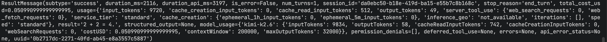
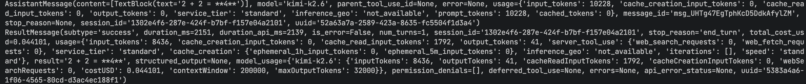
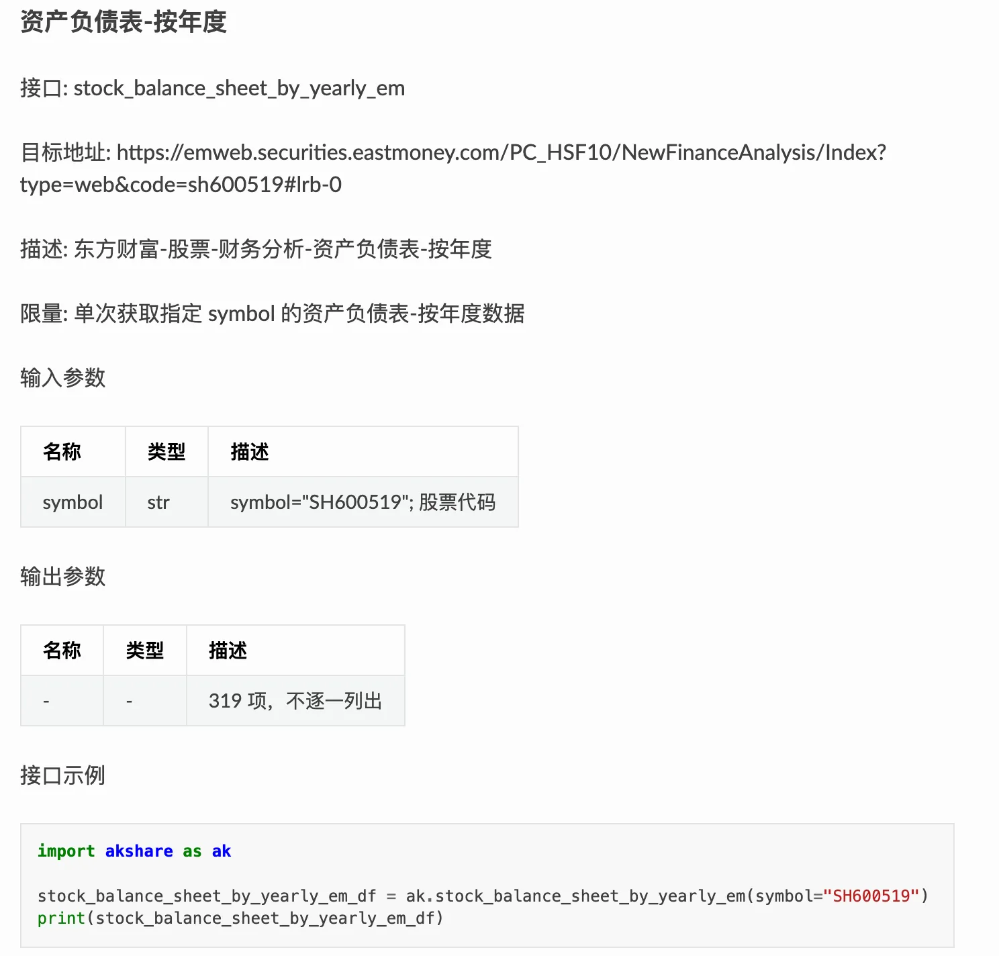
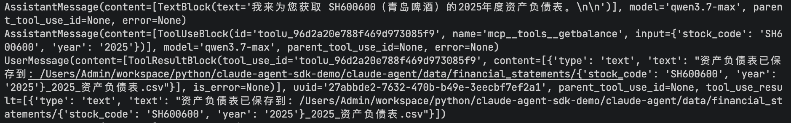

# 06｜核心：快速构建 Agent Loop 并接入研报所需的工具集
你好，我是邢云阳。

技术进步让许多原本需要自行设计的方案，如今都能用更成熟的框架替代，效果也更好。上节课我们完成了理论梳理，也统一了设计思路和框架选型。那么从这节课开始，我们将进入代码实战环节，学习如何用 Claude Agent SDK 升级原有的金融研报生成项目（基于 LangGraph 构建）。

## 环境搭建

按照惯例，我们还是要先搞定搭建环境这一步。Claude Agent SDK 支持 Python 与 TpyeScript 两种开发语言，这两种都是做 AI 开发的首选语言。

尤其是在近一个阶段，由于 AI 项目普遍需要流式输出、并发等特性，TypeScript 语言因为在这一方面天然支持得比 Python 要好，因此像是 Claude Code、OpenClaw 都采用了 TypeScript 语言进行了开发，TypeScript 的风头也更高了。

但由于很多同学是一路从 OpenAI SDK、LangChain 等走过来的，好不容易熟悉了 Python 语言，又要转TypeScript 觉得有点压力，所以我们这个项目还是使用 Python 进行开发，等到下一个项目用 Pi-Mono 框架时，由于其仅支持 TypeScirpt，届时我们再切换到 TypeScirpt。

### 安装 Python SDK

首先安装 Python SDK，命令如下：

```
pip install claude-agent-sdk==0.1.62
```

之所以选择 0.1.62 版本是因为最新版本的 SDK 在调用工具部分的 API 接口发生了改变，导致在接入国产模型时，会报 API Error：400 bad request。因此我们只能退而求其次，选择 API 接口没改变之前的版本，也就是 2026 年 1 月份左右的版本。如果你用的是 Claude 模型，版本问题可以忽略。

### 配置国内模型

由于 Claude Agent SDK 是一个闭源框架，正常来说，仅支持 Claude 自己的模型。但我们依然可以通过修改其环境变量的方式，将其修改为使用支持 Anthropic API 的国内模型，比如 Kimi、MiniMax 等等。配置方法如下：

```
from dotenv import load_dotenv

load_dotenv()

os.environ.setdefault("ANTHROPIC_BASE_URL", "https://api.kimi.com/coding/")
os.environ.setdefault("ANTHROPIC_MODEL", "kimi-k2.6")
os.environ.setdefault("ANTHROPIC_SMALL_FAST_MODEL", "kimi-k2.6")
os.environ.setdefault("ANTHROPIC_API_KEY", os.getenv("KIMI_API_KEY"))
```

一共需要配置 ANTHROPIC\_BASE\_URL、ANTHROPIC\_MODEL、ANTHROPIC\_SMALL\_FAST\_MODEL、ANTHROPIC\_API\_KEY 四个 Claude Agent SDK 的环境变量，由于我不想把 api\_key 暴露在代码中，因此选择了使用 load\_dotenv 从项目环境变量（.env文件）中读取。

### Demo 测试

完成配置后，可以直接运行官网给出的示例代码测试一下是否配置成功。代码如下：

```
import anyio
from claude_agent_sdk import query
import os
from dotenv import load_dotenv

load_dotenv()

os.environ.setdefault("ANTHROPIC_BASE_URL", "https://api.kimi.com/coding/")
os.environ.setdefault("ANTHROPIC_MODEL", "kimi-k2.6")
os.environ.setdefault("ANTHROPIC_SMALL_FAST_MODEL", "kimi-k2.6")
os.environ.setdefault("ANTHROPIC_API_KEY", os.getenv("KIMI_API_KEY"))

async def main():
    async for message in query(prompt="2+2=?"):
        print(message)

anyio.run(main)
```

代码使用了 Claude Agent SDK 提供的 query 方法，直接完成了 2 + 2等于几的对话，query 方法是 Claude Agent SDK 用于进行一次性、无状态的快捷对话的方法，不支持连续对话，追问，适用于快速完成一个一次性的任务。代码运行结果如下：



代码将输出一个结构，其中 result='2 + 2 = 4.' 为结果。

这其实就构建了一个高度封装的 Agent Loop。而我们还可以通过修改其配置项，为它注入系统提示词、配置工具、工具权限、设置工作目录等等。这就需要用到 ClaudeAgentOptions。

## ClaudeAgentOptions：为 Agent Loop 增加配置项

ClaudeAgentOptions 同样来自于 claude\_agent\_sdk 库，可以在调用 query 之前，要先选择 ClaudeAgentOptions 中我们需要的参数进行设置。比如以下示例代码演示了对系统提示词、工具、工作目录、Loop 循环次数的配置。

```
from claude_agent_sdk import query, ClaudeAgentOptions

options = ClaudeAgentOptions(
    system_prompt="你是一个有帮助的助手",  #系统提示词
    max_turns=3, #循环次数
    allowed_tools=["Read", "Write", "Bash"], #允许使用的工具，这几个都是内置工具
    permission_mode='acceptEdits', #设置工具权限，允许不经过人类确认，直接进行文件编辑
    cwd="/Users/Admin/workspace/python/claude-agent-sdk-demo/claude-agent" #工作目录
)
```

之后，可以修改 query 方法，为其加入 options。代码如下：

```
async for message in query(prompt="在当前目录下，新建一个test.txt文件，然后写入12345", options=options):
    print(message)
```

运行后，会在当前目录下完成创建文件和写入内容的任务。

但是 query 方法由于太简单，很多特性都支持有限，比如自定义工具等，因此咱们还需要掌握另一种更加常用的 Agent Loop 构建方式，也就是 ClaudeSDKClient。

## 入门 ClaudeSDKClient

《飞驰人生3》电影不知道大家看过没有，如果用电影中的例子做比喻。query 就相当于张弛团队使用天梯公司的车参赛一样，使用者几乎没有任何调取数据、调教赛车的权力，顶多换个轮胎（更换 Claude Agent SDK 内置工具）。而使用 ClaudeSDKClient 则相当于基于奥迪的车自己做改装，可玩性大大提升。

ClaudeSDKClient 最基础的写法如下：

```
from claude_agent_sdk import ClaudeSDKClient
import anyio
import os
from dotenv import load_dotenv

load_dotenv()

os.environ.setdefault("ANTHROPIC_BASE_URL", "https://api.kimi.com/coding/")
os.environ.setdefault("ANTHROPIC_MODEL", "kimi-k2.6")
os.environ.setdefault("ANTHROPIC_SMALL_FAST_MODEL", "kimi-k2.6")
os.environ.setdefault("ANTHROPIC_API_KEY", os.getenv("KIMI_API_KEY"))

async def main():
    async with ClaudeSDKClient() as client:
        await client.query("2+2=?")

        # Extract and print response
        async for msg in client.receive_response():
            print(msg)

anyio.run(main)
```

代码与 query 相比是初始化了一个 ClaudeSDKClient 客户端，然后在客户端的内部调用客户端自己的 query。代码运行后的效果，这和直接使用 query 差不多。



此外，我们前面定义好的 ClaudeAgentOptions 同样可以在 ClaudeSDKClient 中使用，只需要把 options 当作参数传入到 ClaudeSDKClient() 即可，代码如下：

```
async with ClaudeSDKClient(options=options) as client:
```

了解了以上的基础写法后，后面不管用到工具还是 hooks 等，我们都是在该基础代码上的配置叠加，就比较好理解了。

## 自定义工具完成金融数据抓取

接下来，进入到项目的部分。在上节课，我们分析了金融研报的生成步骤，了解到在撰写研报之前，首先需要获取各项数据。所以在这节课，我们就将数据获取的部分定义成工具，之后接入到 Agent Loop 中。

### 代码实现

首先是获取上市公司三大会计表的工具，这部分数据可以通过免费，但今年以来，时常网络不稳定的 [AKshare](https://akshare.akfamily.xyz/data/stock/stock.html "") 进行抓取，如果想要稳定，可以使用付费的 [Tushare](https://tushare.pro/ "")。

比如以获取资产负债表为例，可以在AKshare 中找到如下图所示接口文档，直接按照示例代码便可以获取指定股票代码的年度报表。



不过，我们不能直接把数据返回，因为这样会直接进入到模型的上下文窗口中，这样做的话，还没有进行后续的分析过程，就先浪费了上下文。

更好的做法是按需加载。因此，我们应该将数据抓取到指定 CSV 文件中，然后只返回文件的路径。这样，最后的工具函数的代码实现如下：

```
@tool("getbalance", "获取沪深A股公司的资产负债表，并保存到文件中，其中参数stock_code是带市场标识的股票代码，比如SH600600，参数year是年份", {"stock_code": str, "year": str})
async def get_balance_sheet_A(stock_code: str = "SH600600", year: str = "2025"):
    try:
        df_balance_sheet = ak.stock_balance_sheet_by_yearly_em(symbol=stock_code)

        # 只取REPORT_DATE是2025-12-31的数据
        df_balance_sheet = df_balance_sheet[df_balance_sheet['REPORT_DATE'] == f'{year}-12-31 00:00:00']

        # 获取项目根目录
        project_root = os.getcwd()

        # 创建完整的文件路径
        filepath = os.path.join(project_root, "data", "financial_statements", f"{stock_code}_{year}_资产负债表.csv")

        # 创建目录（如果不存在）
        os.makedirs(os.path.dirname(filepath), exist_ok=True)

        # 使用指定目录保存文件
        df_balance_sheet.to_csv(filepath, index=False, encoding='utf-8-sig')

        return {
            "content": [
                {"type": "text", "text": f"资产负债表已保存到: {filepath}"}
            ]
        }

    except Exception as e:
        return {
            "content": [
                {"type": "text", "text": f"获取资产负债表失败: {e}"}
            ]
        }
```

工具代码的业务实现是调用 AKshare 的 stock\_balance\_sheet\_by\_yearly\_em 接口获取指定股票的年度资产负债表数据，然后从里面摘取 2025 年度的，之后保存到当前路径下。需要注意的是作为工具函数，按照 Claude Agent SDK 的规定，工具的返回值必须采用代码 21-25 行的结构，将返回值放在字典中。之后，还需要如代码第一行所示，加上@tool 装饰器，它的第一个参数是工具名称，第二个是工具描述，第三个是工具参数说明。

要将该工具注册到 ClaudeAgentOptions 中供模型在 Agent Loop 中使用，需要按照 Claude Agent SDK 的规定格式，将工具封装为一个本地的 MCP Server。具体代码如下：

```
server = create_sdk_mcp_server(
    name="financial-tools",
    version="1.0.0",
    tools=[get_balance_sheet_A]
)
```

这段代码也很简单。代码使用 claude\_agent\_sdk 库的 create\_sdk\_mcp\_server 创建一个 MCP Server，之后第 2 行代码定义了 MCP Server 的名称，第 3 行是版本，第 4 行是添加进 MCP Server 的工具，可以添加多个，这里仅仅以上面定义的获取资产负债表的工具作为示例，需要注意的是 **这里填的是工具函数的名称，不是工具文档中的工具名称。**

之后可以将该 MCP Server 以及其工具配置到 ClaudeAgentOptions 中，代码如下：

```
options = ClaudeAgentOptions(
    mcp_servers={"tools": server},
    allowed_tools=["mcp__tools__getbalance"]
)
```

代码第 2 行，我们通过字典的方式将 MCP Server 配置到 mcp\_servers 变量中，之后在第 3 行将加了 mcp\_\_tools\_\_ 前缀的工具配置到 allowed\_tools 列表中。

需要注意的是，第 2 行的 “tools” 变量与第 3 行的 mcp\_\_tools 中的 tools，这两个名称是一一对应的。“tools”是官方默认起的名字，但不是固定死的。如果你觉得不好听，也可以自定义，比如写成 “abc”也可以。如果第 2 行写的“abc”，则第 3 行要写成 mcp\_\_abc\_\_。

注意以上细节之后，其他部分就是纯粹地去写业务代码了。

### 测试

在完成代码构建后，接下来我们运行一下该代码，测试一下其效果：



从效果看，数据被成功抓取，并且写成了文件保存到了指定目录中。恭喜你进行到这里，是不是感受到了脚手架的便利？

## 总结

这节课我们快速上手了如何基于 Claude Agent SDK + 国内模型构建具备自定义工具调用能力的 Agent Loop。

要注意，使用国内模型时要选择旧的 Claude Agent SDK 版本，比如我使用的是一月份的版本，这个坑我花了一个周末才解决掉。当然随着国内模型对 Anthropic API 的不断更新支持，或许过一段时间，不兼容的地方就兼容了，你可以在具体使用时再对版本进行一下测试。

这一部分主要还是为了给你讲解 Claude Agent SDK 的开发的一些基本套路和容易出错的细节点。其实从技术角度来说，我们不一定非要把数据抓取等业务定义成工具，让模型自主去判断；而是完全可以定义成Skills 中的一个脚本，或者是一个 CLI，这样，我们可以在 Skills 中定义好数据抓取的步骤等，之后让模型顺序调用，既精确又能节省上下文。只有当工具比较独立，不需要配合 Skills 使用时，定义成工具才会比较合适。


下一节课，我们将会把业务封装为 Skills，完成整体金融研报生成的效果，敬请期待。

## 思考题

请思考，你认为什么样的业务代码适合封装为工具，什么样的业务代码适合作为 Skills 中的一个脚本？

欢迎你在留言区展示你的思考过程，我们一起探讨。如果你觉得这节课的内容对你有帮助的话，也欢迎你分享给其他朋友，我们下节课再见！