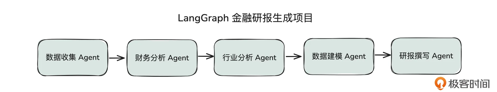
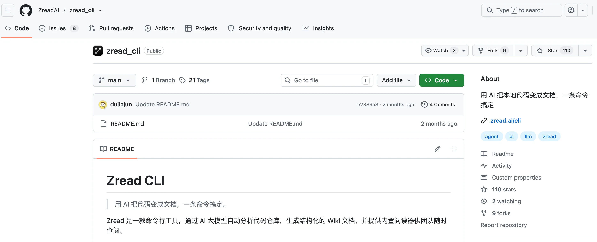
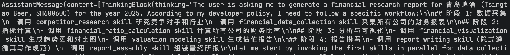
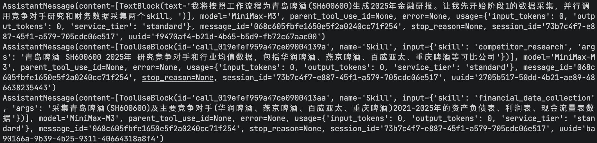

# 07 | 应用：构建替代工作流的 Skills 完成金融研报的生成
你好，我是邢云阳。

在前面的课程中，我们演示了如何将业务逻辑封装为自定义工具，并交由 ClaudeSDKClient 调用。然而，正如我们在前文所探讨的，Claude Code 的设计哲学强调：Agent 的工具集应当遵循“少而精”的原则，优先保留具备通用能力的工具。这是因为工具数量的膨胀会不可避免地挤占宝贵的上下文窗口，进而影响模型的推理质量与响应效率。

## 从单独调用工具进阶到以 skills 为主

为了化解这一矛盾，Claude Code 官方在架构层面进行了两阶段的优化探索。

第一阶段是引入 **工具的渐进式加载机制**，其核心是 MCP Tool Search。当注册的工具定义占据上下文窗口超过 10% 的阈值时，系统会自动触发该机制。此时，系统不再一次性将所有工具的完整定义注入上下文，而是仅加载工具的简要名称与描述。只有当模型判断确实需要调用某个工具时，才会按需检索并加载其详细的参数与调用说明。这种“按需获取”的策略，大幅降低了常驻上下文的开销。

第二阶段则是 **Skills（技能**） 机制的推出。Skills 同样采用了渐进式加载的设计思路，但其加载的内容并非工具定义，而是指导模型完成特定任务的步骤说明、业务规范以及参考文档等。换言之，Skills 将“如何做一件事”的方法论从上下文中剥离出来，仅在模型需要执行具体任务时才动态载入。这不仅进一步释放了上下文空间，也让 Agent 的能力扩展变得更加灵活与高效。这样说可能你暂时没什么感觉，后续我们演示 Skill 封装实例的时候，你就明白我的意思了。

通过这两个阶段的演进，Claude Code 在保持工具丰富性的同时，有效控制了上下文窗口的占用，为构建复杂而高效的 Agent 提供了更为稳健的基础。

## AI Agent 应用开发思路转变

这种开发思路的转变，标志着 Agent 项目构建逻辑的进阶。

回顾去年，我们在启动一个 Agent 项目时，往往陷入“框架先行”的工程惯性中。开发者首先需要选定一个底层脚手架（如 LangGraph），随后投入大量精力去设计复杂的图节点、处理上下文传递以及编排循环逻辑，最后才是编写具体的工具。这种模式虽然工程化程度高，但整体代码量庞大，且系统往往显得僵硬。

而今年的最佳实践则转向了“业务先行”。开发者的首要任务不再是挑选框架，而是审视业务本身：是否存在固定的业务流程？这些流程是否可以被提炼并封装为 Skills？一旦完成业务逻辑的 Skill 化，后续的开发便变得极为轻量。

即便是非技术背景的开发者，也能熟练地将这些 Skills 安装到 OpenClaw（龙虾）、Claude Code 或 Codex 等终端工具中，快速完成功能闭环。当然，对于需要深度定制的 Agent 产品而言，我们不能直接使用这些封装好的终端，而是需要通过使用具备同等底层能力的脚手架（如 Claude Agent SDK）来实现相同的架构效果。

## 新思路下的金融研报生成项目开发方法

以去年我们探讨过的 LangGraph 金融研报生成项目为例，这种思路的转换尤为明显。



如上图所示，该项目从数据抓取到最终研报生成的全过程，本质上是一个高度固定的线性工作流，并不涉及复杂的并行处理或环形依赖。面对这类场景，我们完全无需再搭建沉重的图结构，而是可以直接编写一个 Skill ，或者更简单一点——直接采用计划模式，写一段步骤清晰的系统提示词，将标准化的研报生成流程固化下来，交由 Agent 自主调度执行。

进一步深入到具体的数据抓取环节，通过上节课的学习，我们知道，这一过程通常需要依次调用多个接口来获取资产负债表等财务数据。这些底层工具本身并不复杂，例如上一小节提到的资产负债表抓取工具，其核心逻辑仅仅是调用 AKShare 接口并将数据持久化到本地。

对于这类高频且标准化的操作，我们同样可以将其封装为一个 Skill。在 Skill 的定义中，我们可以明确列出需要抓取的数据字段，并将具体的抓取代码以脚本的形式存放在 Skill 的 scripts 目录下。借助 Claude Agent SDK 原生的代码执行能力，Agent 可以直接运行这些脚本。这种“将执行逻辑代码化、将编排逻辑 Skill 化”的做法，不仅大幅提升了开发效率，更通过消除模型在简单逻辑上的推理不确定性，显著提高了任务执行的准确度。

### Skill 的设计与实现

那针对这个项目，我们可以将每一块业务都设计为一个 Skill，保证 Skill 的功能的独立性。下面的表格展示了我设计的 Skill 及其功能。

Skill

功能

具体实现业务

competitor\_research

竞争对手分析

通过联网搜索识别与待分析公司具体业务和市值相似的公司

financial\_data\_collection

财务数据采集

采集指定公司三大表等财务数据

financial\_ratio\_calculation

财务比率计算

根据采集到的财务数据，计算利润率等财务指标

financial\_visualization

财务图表生成

根据财务指标进行图表的绘制

valuation\_modeling

估值与预测模型

根据财务指标以及行业数据进行估值计算

report\_writing

研报写作规范

定义一套研报的写作规范

report\_assembly

研报组装与输出

汇总前面所有 Skill 的输出，进行研报的撰写

这些 Skill，并不是我手工写出的。而是通过 Claude Code 结合 Skill-Creator 这个 Skill 自动编写出之后，我又针对不合理的地方（比如业务流程不符合我们预期）略微做的修改。

那想要让 Claude Code 能够写出符合业务的 Skill，必然需要让其理解之前 LangGraph 的那一套代码。这套代码由于代码量相比一些百万行级的大型项目来说，只能算是一个小项目，因此我们直接让 Claude Code 去分析与理解代码的结构与功能等等，Claude Code 也可以做得很好。之后可以根据其分析结果，让其设计一下需要生成哪几个 Skill 。

那如果是代码量比较大的项目，我们使用这种“一句话”的 Vibe Coding 式的分析，就比较难分析全面。此时，我们应先针对项目生成功能文档、设计文档等，基于这些文档再去分析。在这里，我为大家推荐一个工具，名字叫做 zread\_cli。该工具是一个命令行工具，可以通过 AI 直接阅读代码库，然后生成非常全面的结构化 Wiki 文档。



Skill 由于内容比较多，并且也比较偏业务，我就挑选其中一个展示一下，其他的就不在课程中贴内容展示了，我会将其传到我的 [Github](https://github.com/xingyunyang01/Geek04/tree/main "xxx") 上，感兴趣的同学可以下载后自行查看。

下面展示financial\_data\_collection这个skill。首先是标签部分：

```
name: financial-data-collection
description: |
  采集中国 A 股和港股上市公司的财务数据，包括资产负债表、利润表、现金流量表和财务指标。
  当用户提到财务数据、财报、三大报表、财务指标、akshare、上市公司财务、股票财务数据、
  竞争对手财务数据、年报数据、采集财务数据等任何与财务数据采集相关的需求时，务必使用此 skill。
  本 skill 提供标准化脚本，将数据保存为 utf-8-sig 编码的 CSV，供后续计算和分析使用。
```

标签部分，描述了在什么场景或者用户提到什么关键词时会用这个 skill，标签内容的好坏，直接决定 agent 后期是否能调到这个 skill。

接下来是 skill 的正文部分，首先需要写清楚用途与使用场景：

```
**# 财务数据采集技能 (Financial Data Collection)**

**## 用途**

本 skill 用于采集中国 A 股和港股上市公司的财务数据，具体包括：

- ****资产负债表****：资产、负债、所有者权益等科目
- ****利润表****：营业收入、成本、利润等科目
- ****现金流量表****：经营、投资、筹资活动现金流
- ****财务指标****：盈利能力、偿债能力、运营能力、成长能力等综合指标

采集结果以标准化 CSV 格式保存，可直接用于后续的财务指标计算、趋势分析、对比分析和估值建模。

**## 何时使用此 skill**

只要用户任务涉及以下内容，就应当使用本 skill：

- 采集/获取/下载上市公司财务数据
- 三大报表、年报、财务报表
- 财务指标、财务比率
- 贵州茅台、五粮液等具体公司财务数据
- 竞争对手财务数据对比
- 使用 akshare 获取财经数据
- 为财务分析、研报生成准备数据
```

这一部分相当于标签的扩展版，是当 agent 通过标签选择调用该 skill 时，提供给 Agent 的更详细信息，让 Agent 进一步确认该 skill 是否符合业务需求。

之后是，脚本的使用说明。由于抓取这些财务数据，需要使用 akshare 库的接口，因此，在 skill 的 scripts 文件夹中，预设了 akshare 脚本。我们需要告诉 Agent，脚本怎么使用，具体内容如下：

````
**## 输入要求**

调用主脚本 `scripts/collect_financial_data.py` 时需要以下参数：

| 参数 | 必填 | 说明 | 示例 |
|---|---|---|---|
| `--code` | 是 | 股票代码（纯数字，不要带 SH/SZ/ HK 前缀） | `600519` |
| `--name` | 是 | 公司名称（用于日志和报告） | `贵州茅台` |
| `--market` | 是 | 市场类型 | `A股` 或 `港股` |
| `--years` | 是 | 分析年份，可多个 | `2022 2023 2024` |
| `--output-dir` | 否 | 输出目录 | 默认 `/workspace/data/financial_statements` |
| `--sleep` | 否 | 请求间隔秒数 | 默认 `0.5` |
| `--retries` | 否 | 失败重试次数 | 默认 `3` |
| `--verbose` | 否 | 是否输出详细日志 | 默认关闭 |

**## 快速开始**

**### 1. 安装依赖**

```bash
pip install -r skills/financial_data_collection/requirements.txt
```

**### 2. 采集单公司数据**

```bash
python skills/financial_data_collection/scripts/collect_financial_data.py \
  --code 600519 \
  --name 贵州茅台 \
  --market A股 \
  --years 2022 2023 2024
```

**### 3. 采集竞争对手数据**

对每一家竞争对手公司分别执行上述命令，仅替换 `--code`、`--name` 参数即可。

例如：

```bash
python skills/financial_data_collection/scripts/collect_financial_data.py --code 000858 --name 五粮液 --market A股 --years 2022 2023 2024
python skills/financial_data_collection/scripts/collect_financial_data.py --code 000568 --name 泸州老窖 --market A股 --years 2022 2023 2024
python skills/financial_data_collection/scripts/collect_financial_data.py --code 600809 --name 山西汾酒 --market A股 --years 2022 2023 2024
```
````

再然后是具体的执行步骤，这些步骤涵盖了抓取财务数据的顺序步骤，具体内容如下：

```
**## 工作流建议**

对于一份完整的财务研报，建议按以下顺序使用本 skill：

1. 先使用本 skill 采集目标公司的多年度财务数据
2. 再使用本 skill 采集所有竞争对手公司的多年度财务数据
3. 检查每个公司是否都生成了 4 × N 个 CSV 文件（N 为年数）
4. 阅读 `{code}_collection_summary.json` 确认无严重错误
5. 将输出目录交给下一个 skill（财务指标计算）继续处理
```

这个 skill 的主要内容就是这些，有了这个例子是不是觉得 skill 也没什么神秘的？skill 核心就是描述清楚场景用途，然后定义好 CLI，以及 CLI 对应的脚本。这也是目前 Skill + CLI 取代 MCP 的经典范式。

### 工具的设计

在上面的 Skill 中，有需要用到联网搜索功能的，比如搜索行业竞争对手等等。虽然 Claude Agent SDK 已经带了 WebSearch 工具，但是只有使用其原版 Claude 模型的用户才可以使用，作为我们接入国内模型的用户是不能用的。因此，我们需要自己去实现一个。

我们这就来学习工具的设计。实现方案呢，还是采用第 4 节课讲过的博查方案，这是目前国内联网搜索精准度比较高的方案。具体实现代码细节，则是按照第 6 节课讲解的方式，将具体业务函数加上@tool，然后封装为 MCP（Claude Agent SDK 规定了，想新加工具必须封装为 MCP）。

### 系统提示词的设计

由于没有了 LangGraph 工作流做研报生成步骤的强行编排。我们只能依靠系统提示词来让模型按照我们希望的顺序来完成任务。我设计的系统提示词如下：

```
你是一位金融研报项目协调员。用户会提供股票代码、公司名称、市场和分析年份。

你的工作流程（按顺序执行）：

## 阶段 1: 数据采集
- 调用 competitor_research skill 研究竞争对手和行业
- 调用 financial_data_collection skill 采集所有公司的财务报表

## 阶段 2: 指标计算
- 调用 financial_ratio_calculation skill 计算所有公司的财务比率

## 阶段 3: 分析与可视化
- 调用 financial_visualization skill 生成趋势图和对比图
- 调用 valuation_modeling skill 生成估值报告

## 阶段 4: 报告撰写
- 调用 report_writing skill（隐式遵循其写作规范）
- 调用 report_assembly skill 组装最终研报

## 状态管理
所有中间产物都保存在文件系统中，你通过 read/glob 工具检查产物是否存在。
如果某个 skill 失败，记录警告并尝试继续。
```

之后将系统提示词写入到 ClaudeAgentOptions 的 system\_prompt 变量中。

```
options = ClaudeAgentOptions(
    system_prompt=SYSTEM_PROMPT,
)
```

### 将 Skill 加入到 Agent 中

最后，我们需要将 Skill 加入到 Agent 程序中，使得 Agent 运行时，能够选到这些 SKill。具体的步骤也很简单。我们首先在 Agent 的工作目录下建立一个.claude/skills/文件夹，之后将前面生成的 Skill 文件夹放入到该文件夹中。

之后在 ClaudeAgentOptions 中加入如下代码：

```
options = ClaudeAgentOptions(
    cwd="/path/to/project",  # 你当前的工作目录
    skills="all",  # 启用所有加载到的 SKill
    allowed_tools=["Read", "Write", "Bash"，"Glob", "mcp__tools__bochasearch"],
)
```

代码第 2 行设置工作目录，在这个项目的场景中，主要是为了让 Agent 可以准确地找到位于工作目录下的 SKill。

代码第 3 行表示可以让 Agent 使用所有在工作目录的 .claude/skills/文件夹下的 Skill。如果仅仅想要挑选其中的某些 Skill，则代码可以写成 skills=\["competitor\_research", "financial\_data\_collection"\]。

代码第 4 行是授权使用了一些必备工具，其中包括我们自己定义的博查搜索工具。其他代码与之前一样保持不变。

这样，我们这个基于 Claude Agent SDK + SKills 的项目就开发完了。

### 测试

最后可以使用提示词“生成青岛啤酒 SH600600 的 2025 年金融研报”进行测试。测试的部分截图如下：

首先，Agent 会确认和梳理一下当前的任务，以及任务的步骤：



之后 Agent 便会依次调用系统提示词中规定好的 Skills ，执行任务。



在这个过程中，会不断有中间产物被写入到文件中。最终生成一份图文并茂的研报。

强烈建议你亲自动手试一下，上手后你就能发现，整个过程非常丝滑流畅。而且，有时遇到一些数据分析或者生成问题时，Agent 还可以现场写代码去补救，从而帮助我们解决问题。尽管整个过程涉及到大量的数据，我们也没有去关心上下文的问题，Agent 内部就自动处理好了。

这便是用好脚手架，站在巨人的肩膀上的优势。

## 总结

这节课，我们在几乎没怎么写传统代码的情况下，借助 Claude Agent SDK + Skills 的架构以及 Vibe Coding 的方式，完成了金融研报生成项目的重构。相比过去使用 LangGraph 构建的版本，该版本在代码量上大幅减少，关于 Agent 的代码非常少，但是在灵活性与可复用性上却大幅增加。通过将业务模块沉淀成为 Skill，我们可以做到一处编写，多处使用。

此外，原本大量封装的业务工具，也基本都被转成了 Skill 中的脚本。这些脚本可以被 Claude Agent SDK 直接执行，大幅提升效率以及准确性。

这些都是今年以来，做 Agent 项目出现的典型变化，传统代码不再是主旋律了。我们编写提示词，编写 Skill，其实就是在写“代码”。

## 思考题

虽然 Claude Agent SDK 可以自动帮我们解决上下文的问题。但在该项目中，7 个 Skill 挤到一个 Agent 中，也还是有点太臃肿了。我们应如何优化这个问题呢？

欢迎你在留言区展示你的思考过程，我们一起探讨。如果你觉得这节课的内容对你有帮助的话，也欢迎你分享给其他朋友，我们下节课再见！