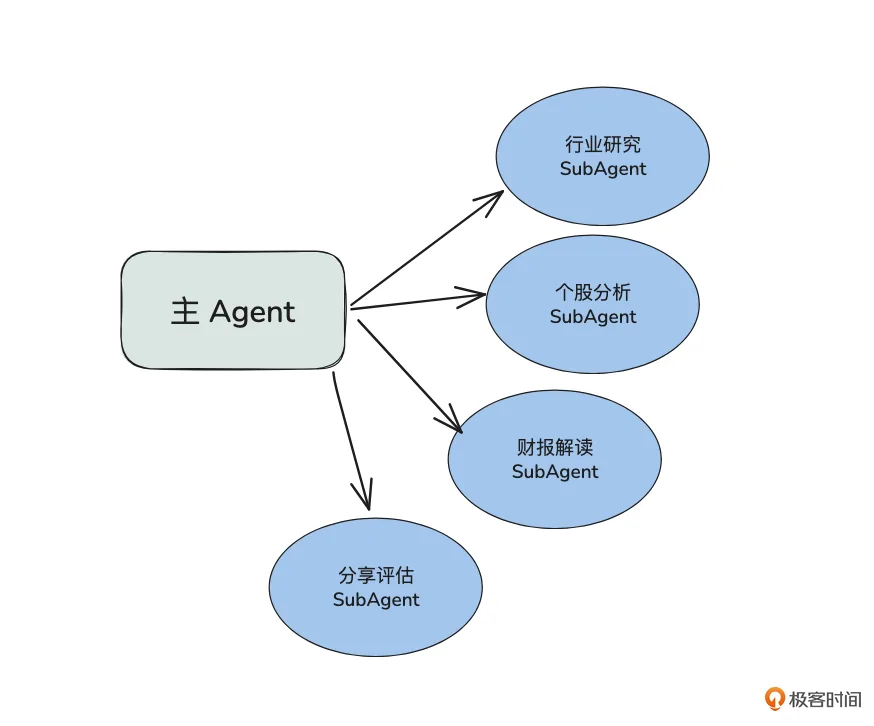
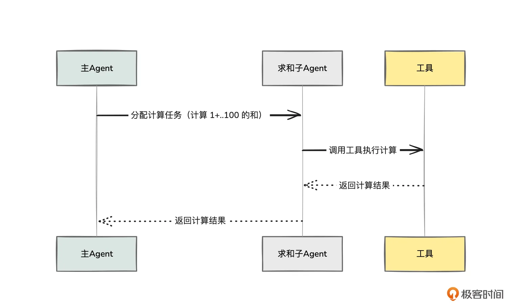
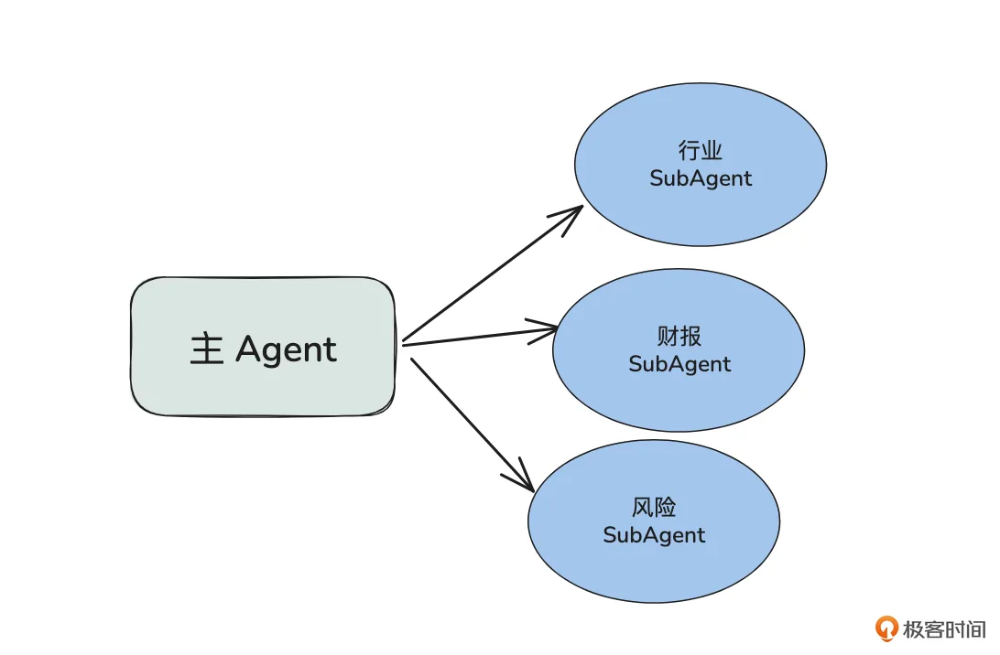
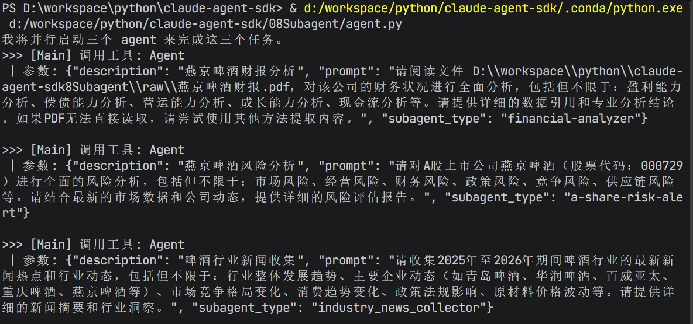
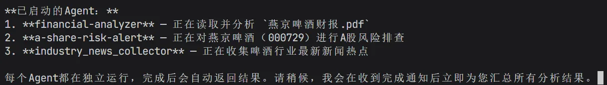
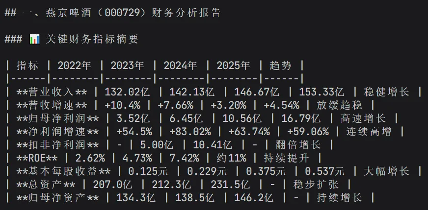
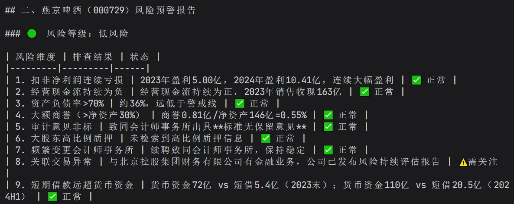
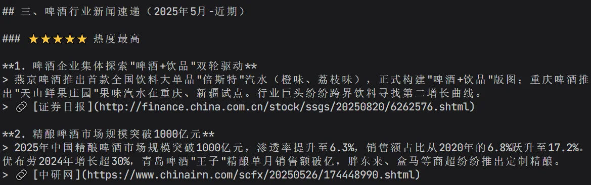

# 08｜起点：多代理编排设计支持复杂投研场景
你好，我是邢云阳。

在上一章中，我们借助金融研报项目，深入了解了 Claude Agent SDK 的基础特性与代码编写手法，其中最核心的便是如何在单个 Agent 中接入多个工具以及 Skills。

然而，随着项目复杂度的提升，单 Agent 架构往往会显得力不从心。试想一下这样的场景：当用户希望同时为三家公司生成金融研报，或者需要对同一家上市公司同步进行行业研究、个股分析、财报解读与风险评估时，单 Agent 无论是在执行效率上，还是在上下文窗口的容量限制上，都显得捉襟见肘。此时，构建多 Agent 系统，也就是我们常说的“多代理编排”，就显得尤为重要了。

因此，今天我们将重点探讨多 Agent 系统主要解决哪些痛点，以及如何使用 Claude Agent SDK 来高效构建这样的系统。

## 多 Agent 系统解决什么问题

引入多 Agent 系统，主要能够帮助我们突破三大瓶颈。

### 上下文隔离问题

在单 Agent 系统中，所有的工具描述文档、Skills 元数据、对话内容以及工具调用的中间结果，都会一股脑地堆积在该 Agent 的模型上下文窗口中。尤其是在 MCP（Model Context Protocol）时代，一个 MCP Server 下可能挂载了数十个工具，每次 Agent 初始化连接时，模型宝贵的上下文空间就会被大量的工具文档占据。

此外，许多对话内容与工具调用结果往往只是“中间过程”。例如，如果让 Agent 计算 1+2+……+100 的值，我们只需要最终的结果“5050”，前面的累加步骤完全不重要。如果这些冗余的中间信息过多，不仅会挤占宝贵的上下文窗口，还会导致模型逐渐“遗忘”原本的核心任务，进而引发幻觉的累积。

通过构建多 Agent 系统，我们可以将工具进行逻辑分组，并分配给不同的子 Agent。这样一来，繁杂的中间探索过程就被限制在子 Agent 内部，主 Agent 最终获取的只有精炼的结论。这极大地保证了主 Agent 上下文的“干净”与高效。

### 并行化执行问题

正如前面提到的场景，如果用户需要同时为三家公司生成金融研报，单 Agent 在效率上存在天然的局限——它无法做到“一心多用”，只能按顺序串行处理。

而多 Agent 系统可以轻松打破这一限制。我们可以针对这三家公司分别创建独立的子 Agent，让它们并发执行研报生成任务。最后，再由主 Agent 统一汇总结果。在理想情况下，这种并行处理的效率将是单 Agent 串行执行的三倍。

### 专业化定制

回到另一个典型场景：对某一家上市公司进行全方位的分析（包括行业研究、个股分析、财报解读、风险评估等）。此时，我们可以根据功能划分出不同的子 Agent，让每一个子 Agent 术业有专攻。



这意味着，每个子 Agent 都可以拥有独立的系统提示词、专属的工具集、特定的 Skills，并且可以根据任务的难易程度，差异化地调用不同规格的模型（例如，简单任务使用轻量级模型，复杂推理使用高性能模型），这样就能在提升专业度的同时，有效降低整体的运营成本。

## Claude Code 中的 SubAgent

在了解了多 Agent 系统的作用后，我们将开始学习在 Claude Agent SDK 中如何构建多 Agent 系统及其代码实现。

对于熟悉 Claude Code 编程的同学，SubAgent（子代理）这一特性想必并不陌生。在 Claude Code 中，我们既可以通过 /agents 命令，也可以手动在 .claude/agents/ 目录下创建 子代理名称.md 配置文件的形式，来显式地定义和创建 SubAgent。 **SubAgent 的核心价值，在于它能够独立处理专项子任务，从而完美实现上下文的严格隔离以及多任务的并发处理。**

如下图所示，从架构本质上来看，SubAgent 其实就是主 Agent 的一个专属工具。这与我们在以往课程和直播中提到的、基于 Function Calling（函数调用）或 ReAct 模式搭建多 Agent 系统的基础原理如出一辙。

主 Agent 既可以根据用户的明确指令显式地调用 SubAgent（例如：“请使用代码审查 SubAgent 帮我完成 XX 代码的审查”），也可以根据具体的业务逻辑自行判断是否需要启用某个 SubAgent。在主 Agent 的视角里，调用 SubAgent 与调用一个普通的工具没有任何区别。



令人欣喜的是，在 Claude Agent SDK 中同样内置了这项强大的功能。开发者可以通过极简的代码方式，直接完成多 Agent 系统的构建。

## 基于 SubAgent 构建行业 / 财报 / 风险分析多 Agent 系统

接下来，我们将通过一个综合投研平台的实战案例，深入讲解如何使用 Claude Agent SDK 的 SubAgent 功能来构建多 Agent 系统。

在这个平台中，我们规划了三个核心功能模块：

1. 行业热点洞察：针对特定行业（例如研究燕京啤酒时，聚焦啤酒行业）进行新闻热点的搜索与总结。

2. 财报深度分析：当研究某家上市公司时，自动解析其财报数据，提取关键财务指标。

3. 风险全面评估：针对长期价值投资的需求，评估目标股票的风险状况，包括是否可能被ST、是否存在退市风险、公司内部是否有负面舆情等。


这三个功能模块在逻辑上互不依赖，原则上可以独立且并行地开展工作。因此，将它们分别封装成独立的 SubAgent 是非常合适的架构选择。整体架构将形成一个主 Agent 统筹管理行业、财报、风险三个 SubAgent 的形态，而这三个 SubAgent 则分别通过挂载专属的 Skills 来实现其核心业务功能。



下面，我们逐一进行业务和代码层面的拆解与实现。

### 行业 SubAgent

行业 SubAgent 的核心能力由 ClawHub 上的 industry-news-collector Skills 提供，该 Skills 能够实现指定行业的热点新闻聚合与热度排序。其底层逻辑是在指定的搜索源进行关键词检索，一旦匹配到相关内容 URL，便调用 WebFetch 工具抓取全文，最后综合判断并输出热度排序结果。

有了现成的 Skills，SubAgent 的构建变得异常简单。我们可以借助 Claude Agent SDK 提供的 AgentDefinition 类快速完成定义，代码如下：

```
def industry_news_collector_agent() -> AgentDefinition:
    return AgentDefinition(
        description="行业信息收集助手",
        prompt="你是一个行业信息收集助手",
        tools=["Read", "Grep", "Glob", "Bash", "Write", "Edit", "WebFetch", "mcp__websearch__bochasearch"],
        skills=["industry_news_collector"],
        model="kimi-k2.6",
    )
```

这段代码定义了一个 industry\_news\_collector\_agent 函数，返回一个 AgentDefinition 实例。

其中，description 是对该 SubAgent 的功能描述（类似于工具说明书），用于指导主 Agent 在何时调用它；prompt 是 SubAgent 的系统提示词；tools 定义了该 SubAgent 的可用工具集，这里重点配置了自定义的 WebSearch 工具 mcp\_\_websearch\_\_bochasearch 以及系统内置的 WebFetch 工具；skills 则指定了上文提到的 industry\_news\_collector Skills；model 指定了该 SubAgent 底层调用的大模型。

### 财报 SubAgent

财报 SubAgent 依赖于 ClawHub 上的 financial-report-analyzer Skills，旨在实现 PDF 格式财务报告的智能解析，自动提取关键财务指标，并生成可视化分析图表与投资参考报告。

```
def financial_analyzer_agent() -> AgentDefinition:
    return AgentDefinition(
        description="财报分析助手",
        prompt="你是一个财报分析助手",
        tools=["Read", "Grep", "Glob", "Bash", "Write", "Edit"],
        skills=["financial-report-analyzer"],
        model="kimi-k2.6",
    )
```

### 风险 SubAgent

风险 SubAgent 集成了 ClawHub 上的 a-share-risk-alert Skills，专门用于 A 股市场的风险预警、ST 预警及退市风险排查。该 Skills 需要查询财务报表、实时行情等多维数据源，并通过联网搜索检索审计意见、监管处罚、诉讼公告及 ST 公告等信息。因此，它同样需要配置联网搜索工具：

```
def risk_alert_agent() -> AgentDefinition:
    return AgentDefinition(
        description="A股个股风险分析助手",
        prompt="你是一个A股个股风险分析助手",
        tools=["Read", "Grep", "Glob", "Bash", "Write", "Edit", "WebFetch", "mcp__websearch__bochasearch"],
        skills=["a-share-risk-alert"],
        model="kimi-k2.6",
    )
```

### 构建主 Agent

在完成三个 SubAgent 的定义后，我们需要构建一个主 Agent 来统筹管理它们，以便在下发任务时，主 Agent 能够智能地挑选合适的 SubAgent 来协同工作。核心代码如下：

```
async for message in query(
    prompt=prompt_stream(),
    options=ClaudeAgentOptions(
        include_partial_messages=True,
        mcp_servers={"websearch": websearch_server},
        allowed_tools=["Read", "Grep", "Glob", "Agent", "AskUserQuestion", "mcp__websearch__bochasearch"],
        agents=agents_config,
    ),
)
```

代码依然通过 query 方法来驱动 Agent 系统的运行。

其中，prompt\_stream() 负责将用户的历史对话（包含最新提示词）输入系统；ClaudeAgentOptions 则对主 Agent 进行了详细配置：include\_partial\_messages 开启了流式输出；mcp\_servers 注册了自定义的 MCP Server；allowed\_tools 限定了主 Agent 的可用工具列表；而 agents 则是将我们刚刚定义的 SubAgent 列表注册到系统中。

三个 SubAgent 的配置字典如下：

```
agents_config = {
    "financial-analyzer": financial_analyzer_agent(),
    "industry_news_collector": industry_news_collector_agent(),
    "a-share-risk-alert": risk_alert_agent(),
}
```

至此，主 Agent 的配置宣告完成。代码启动后，通过运行 query 方法，系统便能开始执行用户下发的复杂任务。

### 测试

为了验证三个 SubAgent 的并行运行效果，我准备了一份燕京啤酒 2025 年的年报 PDF 文件置于代码目录下，并编写了以下提示词进行测试：

```
请完成以下三个任务：
1. 请使用financial-analyzer agent，阅读D:\workspace\python\claude-agent-sdk\08Subagent\raw\燕京啤酒财报.pdf，之后进行财务分析。
2. 请使用a-share-risk-alert agent，对燕京啤酒进行风险分析。
3. 请使用industry_news_collector agent，收集最近啤酒行业的新闻热点。
```

这里我采用了显式指定 SubAgent 的方式。主要原因是当前部分国产模型的自主规划能力尚有提升空间，若不显式指定，主 Agent 可能会倾向于自行调用 Skills 串行处理，从而无法充分展现多 Agent 并行的优势。

运行代码后，主 Agent 会精准地调用 Agent 工具，启动三个 SubAgent 并传入相应的提示词。



随后，三个任务将并发执行。



经过一段时间的等待后，会分别输出财务分析、风险分析和行业热点洞察的结果，部分截图见下图。这里提醒你一句，如果你操作的时候，给出的结果有细微差异很正常，但主要内容还是差不多的，因为 skills 规定了模型应该怎么思考。

财务分析：



风险分析：



行业分析：



## 总结

今天，我们完整演示了如何构建一个实用的多 Agent 系统。相信现在你已经对如何利用 Claude Agent SDK 的 SubAgent 功能有了进一步认识。

回顾一下就会发现，从整体来看，代码编写并非难点，因为 SDK 已经对底层逻辑进行了极佳的封装。我们的核心收获应聚焦于两点：一是对业务架构的理解，即“一个 SubAgent + 一个 Skills”即可封装出强大的垂直领域能力，大家可以灵活替换为自己的业务逻辑；二是对 SubAgent 设计原理的类比理解。

自 2023 年以来，除了工作流、A2A 等模式，将子 Agent 视为一种“工具”，由主 Agent 像调用工具一样去调度，已成为多 Agent 系统最主流且高效的构建范式，期待你能灵活运用到自己的日常工作里。

## 思考题

请思考一下使用 SubAgent 最核心的价值点是什么？

期待看到你在留言区展示思考过程，我们一起探讨。如果你觉得这节课的内容对你有帮助的话，也欢迎你分享给其他朋友，我们下节课再见！