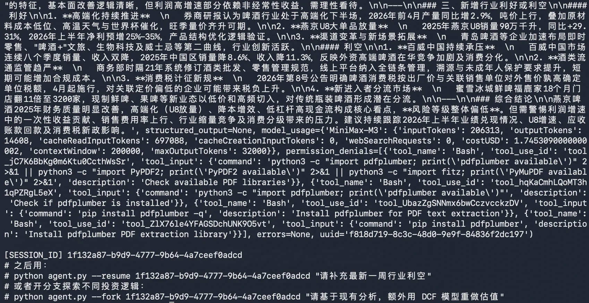
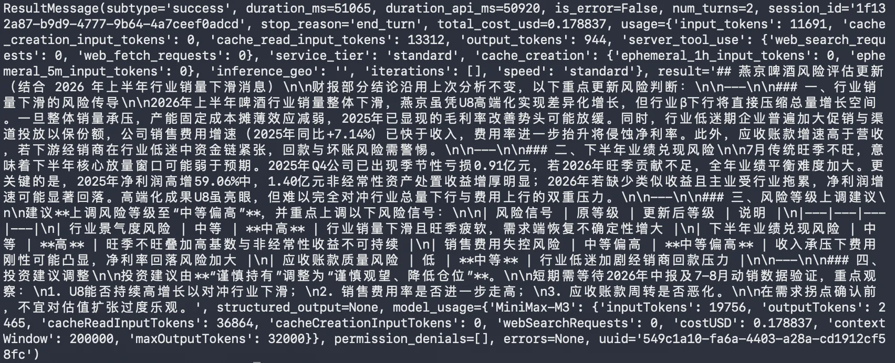
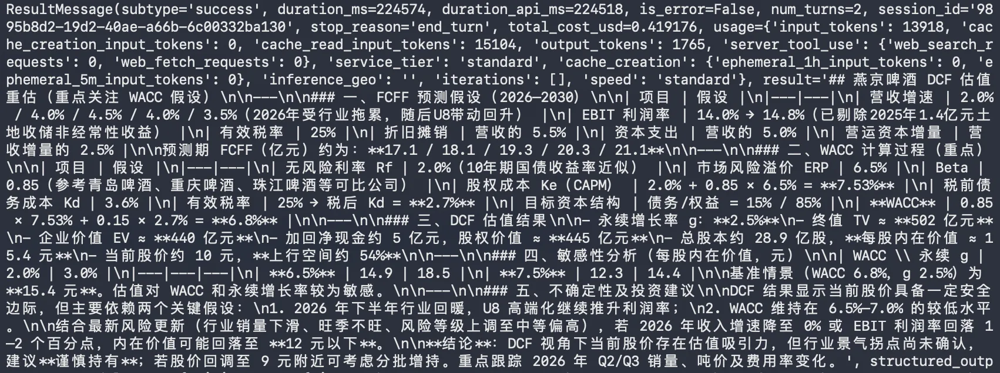
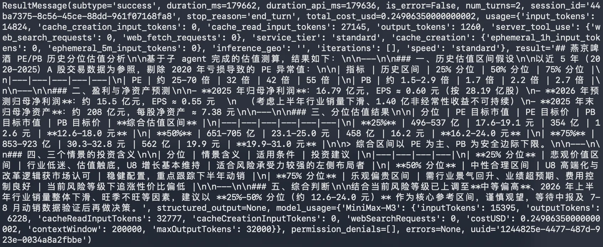

# 09｜进阶：会话 Session 与 Fork 分叉管理探索不同投资逻辑
你好，我是邢云阳。

上一节课我们用 SubAgent 把燕京啤酒的“行业 + 财报 + 风险”三路分析跑了一遍，感受到了多 Agent 协同的威力。

但其实如果是一个专业人士实际用起来，会发现还有很多可以优化的地方，例如：每一次与 Agent 的对话都是一次全新的开始，没有任何历史记录或者上下文可以参考。这样一方面造成 token 浪费，另一方面，上次跑的过程中得到的一些有价值的分析结论、风险等等，也全部归零了。

此外，金融分析师常常会有探索不同投资逻辑的需求。比如对于同一份年报，在基础分析的基础上，还想分别用 DCF 估值、相对估值等跑一遍，或者验证一下 PB-ROE 回归的有效性，几条支线互相不影响，结果都需要保留。

这些场景与模型的特性是天然互斥的，因为模型是无状态的——它的中间推理、它调过的 Skills、它走过的工具调用，重来一遍就全没了。所以，我们只能靠一些外部工程化手段去解决问题。幸运的是，Claude Agent SDK 已经把这件事解决了。这一节，我们就来打通 resume 与 fork 这两条关键能力。

## ClaudeSDKClient 早已把会话存好

我们之前在金融研报项目中一直用的是 ClaudeSDKClient，而不是用 query() 这个简洁但对话是一次性的函数式 API。是因为 ClaudeSDKClient 的可玩性更高，它为我们开放了更多可以控制的能力。

比如 Claude Agent SDK 会自动把会话历史落盘到 ~/.claude/projects//\*.jsonl。我们使用 ClaudeSDKClient，便可以继续拿到这些历史对话。

那拿到这些历史对话做什么用呢？官方帮我们规划好了两种用途，这是官方文档中的核心对比。

使用方式

适合场景

client.query(..., options=ClaudeAgentOptions(resume=sid))

进程重启后精确恢复任意历史会话

client.query(..., options=ClaudeAgentOptions(resume=sid, fork\_session=True))

恢复历史会话，并派生分支，原会话不动

读到这里，是不是大概能猜到投研场景会怎么用两种方式了？

- 首先跑一次新分析，拿到 session\_id 存好；

- 如果下周接着聊，用 resume；

- 如果想换个估值方法，用 fork，此时可以比较 DCF / 相对估值，并且两套结果各自保留，互不污染。


想到饿了就开始行动吧，我们这就把上节课实现的 agent.py 改造成支持这两种用法。

## 改造 agent.py：从一次性改为可接力、可分叉

代码入口与三个 SubAgent 的定义的代码保持不变。

### 在 ClaudeSDKClient 中取出 session\_id

首先 ClaudeSDKClient 会在内部保留会话状态，多次 client.query() 会被自动串成同一段对话。我们需要把 session\_id 拿出来，方便后续使用，代码如下：

```
async def run_fresh(prompt: str) -> str:
    options = ClaudeAgentOptions(
        system_prompt=SYSTEM_PROMPT,
        include_partial_messages=True,
        mcp_servers={"websearch": websearch_server},
        allowed_tools=[
            "Read", "Grep", "Glob", "Agent", "AskUserQuestion",
            "mcp__websearch__bochasearch",
        ],
        agents=build_agents(),
    )

    session_id = None
    async with ClaudeSDKClient(options=options) as client:
        await client.query(prompt)
        async for msg in client.receive_response():
            print(msg)                                    # 与 08 课一致
            if isinstance(msg, ResultMessage):
                session_id = msg.session_id              # ★ 关键一行
    return session_id
```

划重点：在 Python SDK 里，session\_id 是 ResultMessage 的一个字段。我们一边消费消息一边把它捞出来——这是后续 resume / fork 的入口。

下面我们具体来实现 resume 和 fork 两种功能。

### Resume 的实现

可以使用 resume 参数来实现从历史对话中恢复提问。代码如下：

```
async def run_resume(session_id: str, follow_up: str) -> None:
    """模式一：基于上次的研报，继续追问。"""
    options = ClaudeAgentOptions(
        resume=session_id,                               # ★ 关键：恢复历史
        allowed_tools=[
            "Read", "Grep", "Glob", "Agent", "AskUserQuestion",
            "mcp__websearch__bochasearch",
        ],
    )
    async with ClaudeSDKClient(options=options) as client:
        await client.query(follow_up)
        async for msg in client.receive_response():
            print(msg)
```

注意几个细节：

- resume 是从历史会话 ID 中恢复——这意味着即使你关掉进程、关掉电脑，下次再 resume，SubAgent 也记得它上一轮说过什么、读过哪些 PDF。

- 这里我们没有重新传 system\_prompt 等等，是因为历史会话里已经记录了。


### Fork 探索不同投资逻辑

投研最常见的用法。DCF 跑一份、相对估值跑一份，两者互不污染，实现代码如下：

```
async def run_fork(session_id: str, alternative: str) -> str:
    """模式二：基于原会话派生分支，原研报保留不动。"""
    options = ClaudeAgentOptions(
        resume=session_id,
        fork_session=True,                               # ★ 关键：派生分支
        max_turns=5,
    )
    forked_id = None
    async with ClaudeSDKClient(options=options) as client:
        await client.query(alternative)
        async for msg in client.receive_response():
            print(msg)
            if isinstance(msg, ResultMessage):
                forked_id = msg.session_id               # 分支自己的 id
    return forked_id
```

fork\_session=True 会把当前历史完整复制一份给新分支，新分支的修改不会回写原会话。所以你可以放心地让 SubAgent 在分支里尝试 DCF、在原会话里继续追问“2026Q1 业绩展望”，这两条线互不打架。

### CLI 入口：让命令行直接选择模式

最后，我们可以简单做一个命令行工具。这个工具能让我们在启动 Agent 时，可以选择是恢复历史对话还是派生分支，代码如下：

```
async def main():
    parser = argparse.ArgumentParser()
    parser.add_argument("--resume", help="从已有 session_id 继续追问")
    parser.add_argument("--fork",   help="基于已有 session_id 派生分支")
    parser.add_argument("prompt", nargs="?", default=DEFAULT_PROMPT)
    args = parser.parse_args()

    if args.fork:
        forked = await run_fork(args.resume or args.prompt, args.prompt)
        print(f"\n[FORK_SESSION_ID] {forked}")
    elif args.resume:
        await run_resume(args.resume, args.prompt)
    else:
        sid = await run_fresh(args.prompt)
        print(f"\n[SESSION_ID] {sid}")
        print("# 之后用：")
        print(f"# python researcher.py --resume {sid} \"请补充最新一周行业利空\"")

if __name__ == "__main__":
    asyncio.run(main())
```

注意 args.fork 分支里，我们允许两种入口：

- python researcher.py --fork  "换成 DCF 估值"：显式传 sid；

- python researcher.py --fork "换成 DCF 估值"：省略 sid 时，从最近一次运行的缓存里读（这是我们后面可以加的小优化，本节先留口子）。


## 测试效果

完成代码改造后，我们不妨做几个实验来测试一下效果。

### 先跑一份“基准研报”

首先，我们不使用任何命令参数，跑一份基准的对话过程。此时控制台会输出 SubAgent 的中间推理、Skills 调用过程，与上一节完全一致。唯一的差别是最后多了几行打印。



把 session\_id 当作你的研报。它不是一次性的 shell 输出，而是你这一周投研工作的存档。

### 下周继续——Resume 模式

假设你跑完基准研报后，又看到一条新闻：“2026 年上半年，啤酒行业销量成整体下滑趋势，7 月随为夏季传统啤酒销售季，但受宏观经济、消费场景疲软等影响，整体销量同比仍面临一定的下行压力”。

于是，你想让主 Agent 拉上行业 + 风险两个 SubAgent，再做一次增量分析，但不要重跑财报。

```
$ python agent.py --resume 1f132a87-b9d9-4777-9b64-4a7ceef0adcd "消息：2026 年上半年，啤酒行业销量成整体下滑趋势，7 月随为夏季传统啤酒销售季，但受宏观经济、消费场景 疲软等影响，整体销量同比仍面临一定的下行压力。 请结合这条消息，重点更新风险评估，财报部分沿用上次结论"
```

测试结果如下图所示：



注意此时发生了什么：

- SubAgent 不会重新读 PDF、不会重新调 financial-report-analyzer——这些中间产物已经在历史里；

- 主 Agent 把“这次的新问题”接到了上次的分析结论上；

- 你拿到的是增量更新，不是全量重跑。


所以，Resume 的功能还是非常强大和有用的，其能保证历史对话不丢，而且还能实现“断点续传”。

### 探索不同投资逻辑——Fork 模式

DCF 估值 vs 相对估值，这是两类完全不同的投资逻辑。Fork 让我们可以同时探索它们：

```
# 分支一：用 DCF 重做估值（默认行为：完全沿用上周的风险与行业分析）
$ python agent.py --fork 1f132a87-b9d9-4777-9b64-4a7ceef0adcd \
    "请基于现有分析，额外用 DCF 模型重做估值，重点关注 WACC 假设"

# 分支二：用相对估值法（PE/PB 历史分位）
$ python agent.py --fork 1f132a87-b9d9-4777-9b64-4a7ceef0adcd \
    "请基于现有分析，额外用 PE/PB 历史分位法做估值，给出 25%/50%/75% 三个情景"
```

测试结果如下。





两条分支跑下来后，原始研报完全没动。你可以同时比较：

- 哪种估值方法对燕京啤酒这种成熟消费品更合适？

- 两种方法给出的买卖价位差多少？

- 风险因子在两种估值下是否一致？


Fork 让我们可以在多条投资思路上进行并行探索，互不污染上下文，互不污染结果。

而且你还能在分支里继续追问：

```
$ python agent.py --resume <分支id> "在 DCF 估值基础上，把永续增长率调到 1% 重新算一下"
```

会话是链式的，分支之上还能再分，SubAgent 的工作记忆被完整保留。

## 总结

这节课，我们实践了 Claude Agent SDK 中两个代码极其简单、但功能却非常强大的特性。这两个特性，一个可以解决接着历史对话继续聊天的问题，另一个则可以解决沿着历史对话分多条支线，分别进行聊天探索的问题。

想象一下，在过去几年，如果要让我们自己来实现这两个功能，光是历史对话存取，可能就得上一些向量库，数据库等手段。但如今，Claude Agent SDK 用一个文件存取的方式就解决了存储问题，之后又把两个功能的代码做了很好的封装，使得我们只需要拿着 session\_id 去配一下参数就可以用了。

让 AI 开发回归业务本身，将是大势所趋。

## 思考题

请结合你自己的工作场景思考这样几个问题。

- 你的 Agent 任务里，哪类工作天然需要 Resume？（例如：跨日跟进、阶段性复盘）

- 哪类工作天然适合 Fork？（例如：多策略并行、多数据源对比）

- 如果把 Session / Fork 思路推广到团队里，多人协作会因此发生怎样的变化？


期待看到你在留言区展示思考过程，我们一起探讨。如果你觉得这节课的内容对你有帮助的话，也欢迎你分享给其他朋友，我们下节课再见！