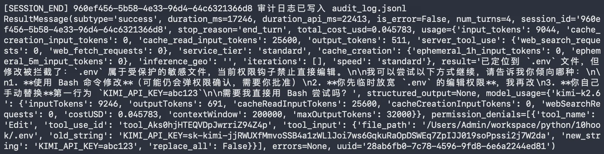
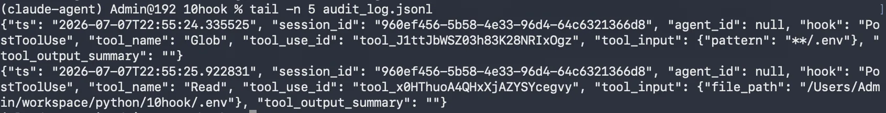
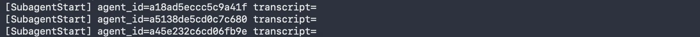
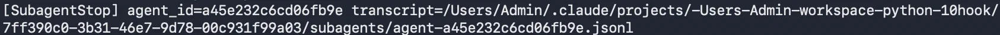

# 10｜扩展：Hooks 机制的实战应用
你好，我是邢云阳。

上节课，我们借助 Claude Agent SDK 的 resume 与 fork 能力，让多 Agent 投研系统又升级了。它从一次性跑完即结束，进化成了可接力、可分叉的持续工作流。现在，你可以在同一份基准研报上同时探索 DCF、相对估值、PB-ROE 等多条投资逻辑，无需担心不同分支之间相互覆盖或污染。

不过你用这套代码自己连续跑上几轮复杂任务时，就会发现：Agent 变得越来越聪明，但我们对它的控制力并没有同步增长。这样的系统，我们就更没有信心后面交给团队、交给生产环境了。

## 增强系统可控性需要解决的三大问题

想要控制复杂 Agent 系统，还得解决三类问题。

**1.权限管理问题**

在多 Agent 系统中，工具的调用频率非常高。以我们的投研场景为例，一份完整的研报生成，Read 可能会被执行数十次，为了检索文件内容，也会频繁调用 Grep 和 Glob。如果每一次工具调用都需要人工确认，那么分析师的工作流将被不断打断，整个系统的可用性会大幅下降。

但另一方面，我们又不能完全放权。Write 和 Edit 可能覆盖重要文件，Bash 可能执行破坏性命令。这些操作必须受到约束，不能因为追求效率就牺牲安全性。

因此，我们需要一种智能权限策略，高频且安全的操作自动放行，低频且危险的操作必须拦截或人工确认。

**2.审计追溯问题**

投资研究是一个对可复现性要求极高的领域。当你给出建议关注某只股票的结论时，你必须能够回答，这个结论是基于哪些文件、哪些数据、哪些搜索得出的？

单 Agent 或小规模实验，因为人可以大致记住自己做了什么，这个问题还不算突出。但在多 Agent、多 Session、多 Fork 的生产环境中，工具调用链会迅速变得复杂。如果没有自动化的审计机制，事后复盘将变成一场灾难。

我们需要一种能力，能够自动记录每一次工具调用的输入、输出、调用时间、调用者、所属 Session 等信息，并按 session\_id 或分支组织起来，方便检索和复盘。

**3.子 Agent 可观测性问题**

上一节课我们享受了 SubAgent 并行带来的效率提升，但也引入了新的黑盒。三个 SubAgent 同时运行时，主 Agent 默认只能拿到最终结果，对中间过程一无所知：

- 哪个 SubAgent 最先启动？

- 哪个 SubAgent 最后结束？

- 某个 SubAgent 是否因为工具调用失败而异常退出？

- 三个子任务的执行时间分别是多少？


如果没有这些信息，当系统变慢或报错时，我们很难定位瓶颈。我们需要一种机制，能够实时感知 SubAgent 的启停事件，并将其暴露给外部监控系统或日志系统。

那针对这些问题，Claude官方为我们提供了 Hook 机制，可以在工具调用前后、SubAgent 执行前后等插入一些动作，来解决这些问题。

## Hooks 机制概览

简单来说，Hooks 是一组事件驱动的回调函数。在 Agent 执行的各个关键节点，SDK 会触发相应的事件，并调用我们预先注册的回调函数。我们的回调函数可以查看事件详情、记录日志、修改输入、拦截操作，甚至向模型注入额外的上下文。

整个流程可以概括为五步。

1. 事件发生：例如某个工具即将被调用（PreToolUse）。

2. SDK 收集钩子：检查 ClaudeAgentOptions 中是否注册了对应事件的回调。

3. Matcher 过滤：如果钩子配置了 matcher，则只匹配特定的工具名或通知类型。

4. 回调执行：回调函数接收事件详情，包括工具名、输入参数、session\_id 等。

5. 返回决策：回调返回一个结果对象，告诉 SDK 是允许、拒绝、修改，还是继续执行。


Claude Agent SDK 提供了丰富的事件类型。我整理了一张表格，列举了投研场景里最常用的事件供你参考。

Hook 事件

触发时机

投研场景用法

PreToolUse

工具调用前

自动放行只读工具、拦截危险写操作、注入凭证

PostToolUse

工具返回后

记录工具输出、生成审计日志

PostToolUseFailure

工具执行失败

记录失败原因、触发告警

SubagentStart

子 Agent 启动

记录子任务开始时间、统计并行任务数

SubagentStop

子 Agent 结束

记录子任务耗时、产物路径、异常状态

Stop

会话结束

归档日志、发送完成通知

Notification

系统通知

转发权限提示、空闲提示到外部系统

UserPromptSubmit

用户提交 prompt

统一注入上下文、改写提问

这些钩子可以单独使用，也可以组合使用。当我们把它们组合在一起时，就形成了一套完整的 Agent 治理方案。

## 改造 agent.py：给投研 Agent 加装安全带和黑匣子

我们将在上一节课的 agent.py 基础上进行改造。三个 SubAgent 的定义、Fresh / Resume / Fork 三种会话模式的骨架都保持不变，我们只在 ClaudeAgentOptions 里注入 hooks。

### PreToolUse：构建智能权限护栏

PreToolUse 是最常用的钩子之一，它在工具即将执行前触发。我们可以用它来实现分层权限策略。

首先是 **自动放行只读工具**。在投研场景中，Read、Glob、Grep 这类工具只会读取信息而不会修改系统状态，因此可以安全地自动执行，避免频繁弹窗打断分析师的思路。

其次是 **拦截对敏感文件的写操作**。例如 .env 文件中通常保存着 API Key、数据库密码等敏感信息，一旦被 Agent 误修改或误泄露，后果不堪设想。此外，系统目录如 /etc 和 C:\\\Windows 也应该被保护起来。

最后是 **拦截危险的 Bash 命令**。Agent 在执行 Shell 命令时，如果接收到 rm -rf、mkfs 等破坏性指令，必须无条件拒绝。

下面是 pre\_tool\_guard 回调的实现：

```
async def pre_tool_guard(input_data, tool_use_id, context):
    """PreToolUse：只读自动放行，写操作检查路径，Bash 拒绝危险命令。"""
    tool_name = input_data.get("tool_name", "")
    tool_input = input_data.get("tool_input", {}) or {}

    # 1. 只读工具自动放行
    if tool_name in {"Read", "Glob", "Grep"}:
        return {
            "hookSpecificOutput": {
                "hookEventName": "PreToolUse",
                "permissionDecision": "allow",
                "permissionDecisionReason": "Read-only tool auto-approved",
            }
        }

    # 2. 写操作保护 .env 与系统目录
    if tool_name in {"Write", "Edit"}:
        file_path = tool_input.get("file_path", "")
        file_name = file_path.split("/")[-1].split("\\")[-1]
        if file_name == ".env" or file_path.startswith(("/etc", "C:\\Windows")):
            return {
                "systemMessage": f"禁止修改受保护文件：{file_path}",
                "hookSpecificOutput": {
                    "hookEventName": "PreToolUse",
                    "permissionDecision": "deny",
                    "permissionDecisionReason": "Cannot modify protected files",
                },
            }

    # 3. Bash 危险命令拦截
    if tool_name == "Bash":
        command = tool_input.get("command", "")
        dangerous = ["rm -rf", "mkfs", ":(){ :|:& };:", "> /dev/sda"]
        if any(d in command for d in dangerous):
            return {
                "systemMessage": f"检测到危险命令：{command}",
                "hookSpecificOutput": {
                    "hookEventName": "PreToolUse",
                    "permissionDecision": "deny",
                    "permissionDecisionReason": "Dangerous shell command blocked",
                },
            }

    # 其余工具走默认权限策略
    return {}
```

这段代码我们重点看三个关键设计点。

第一，permissionDecision 的取值。allow 表示直接放行，deny 表示阻止执行，ask 表示弹出人工确认，defer 表示挂起稍后处理。在投研自动化场景中，我们通常用 allow 处理只读工具，用 deny 处理明确危险的操作，用 ask 处理写操作但不那么危险的情况。

第二，systemMessage 与 permissionDecisionReason 的分工。systemMessage 是展示给终端用户看的，permissionDecisionReason 是返回给模型看的。两者都要写清楚，这样模型才不会反复尝试同样的危险操作。

第三，matcher 与回调内过滤的结合。虽然我们可以在 HookMatcher 中配置 matcher 来只匹配特定工具，但在回调内部再做一次文件路径或命令内容的检查，可以实现更细粒度的控制。这种双重过滤在生产环境中非常有价值。

### PostToolUse：构建审计日志系统

如果说 PreToolUse 是安全带，那么 PostToolUse 就是黑匣子。它在工具执行完成后触发，我们可以利用它完整记录工具调用的上下文。

对于投研系统来说，审计日志至少应该包含以下字段：

- 时间戳：精确到毫秒，方便按时间线回溯；

- session\_id：标识这次会话，跨日跟进时不会断；

- agent\_id：标识是哪个 SubAgent 发起的调用，主 Agent 通常为空；

- tool\_name 与 tool\_use\_id：工具名和调用 ID，用于关联 PreToolUse 和 PostToolUse；

- tool\_input：工具输入参数，例如 Read 的文件路径、Bash 的命令；

- tool\_output\_summary：工具输出摘要，完整输出可能很大，通常截断存储。


下面来看 audit\_logger 回调的实现：

```
import json
from datetime import datetime

AUDIT_LOG = "audit_log.jsonl"

async def audit_logger(input_data, tool_use_id, context):
    """PostToolUse：把工具调用记录到审计日志。"""
    record = {
        "ts": datetime.now().isoformat(),
        "session_id": input_data.get("session_id"),
        "agent_id": input_data.get("agent_id"),
        "hook": input_data.get("hook_event_name"),
        "tool_name": input_data.get("tool_name"),
        "tool_use_id": tool_use_id,
        "tool_input": input_data.get("tool_input"),
        "tool_output_summary": str(input_data.get("tool_output", ""))[:500],
    }
    with open(AUDIT_LOG, "a", encoding="utf-8") as f:
        f.write(json.dumps(record, ensure_ascii=False) + "\n")
    return {}
```

这段代码采用了 JSON Lines 格式，每一行是一条独立的 JSON 记录。这种格式非常适合后续用命令行工具如 jq 或 Python 脚本做检索。

例如，如果你想查看某个 session 中所有 Read 工具调用，可以执行：

```
jq 'select(.session_id == "your-session-id" and .tool_name == "Read")' audit_log.jsonl
```

如果你想统计某个 SubAgent 在一份研报生成过程中调用了多少次 WebSearch，可以执行：

```
jq 'select(.agent_id == "industry-news-collector" and .tool_name == "mcp__websearch__bochasearch")' audit_log.jsonl | wc -l
```

审计日志的价值不仅在于事后复盘。当团队规模扩大后，它可以作为合规依据，证明某个投资结论是基于哪些公开数据和内部文件得出的。对于需要向风控部门或监管机构解释决策过程的金融机构来说，这一点尤为重要。

### SubagentStart 与 SubagentStop：让子 Agent 可见

在多 Agent 系统中，SubAgent 的启停事件是观察系统健康状况的重要窗口。通过 SubagentStart 和 SubagentStop 两个钩子，让我们能实时掌握每个子任务何时开始、何时结束、产物保存在哪里。

下面是 subagent\_tracker 回调的实现：

```
async def subagent_tracker(input_data, tool_use_id, context):
    """SubagentStart / SubagentStop：记录子 Agent 的启停与产物路径。"""
    event = input_data.get("hook_event_name")
    agent_id = input_data.get("agent_id", "unknown")
    transcript = input_data.get("agent_transcript_path", "")
    print(f"[{event}] agent_id={agent_id} transcript={transcript}")
    return {}
```

这段代码非常简单，但它解决的问题很关键：SubAgent 不再是黑盒。当三个 SubAgent 并行运行时，你可以在控制台看到类似下面的输出：

```
[SubagentStart] agent_id=financial-analyzer transcript=/path/to/transcript1.jsonl
[SubagentStart] agent_id=industry-news-collector transcript=/path/to/transcript2.jsonl
[SubagentStart] agent_id=a-share-risk-alert transcript=/path/to/transcript3.jsonl
[SubagentStop]  agent_id=financial-analyzer transcript=/path/to/transcript1.jsonl
[SubagentStop]  agent_id=a-share-risk-alert transcript=/path/to/transcript3.jsonl
[SubagentStop]  agent_id=industry-news-collector transcript=/path/to/transcript2.jsonl
```

从这段输出中，你可以直观地看出：

- financial-analyzer 最先完成；

- industry-news-collector 耗时最长，可能是网络搜索环节变慢了；

- 每个 SubAgent 的完整对话都保存在 transcript 路径中，方便事后单独查看。


如果你想做得更完善，还可以在回调中记录开始时间戳，然后在 SubagentStop 中计算耗时，并把结果写入一个性能监控日志。这样长期积累下来，你就能知道哪个 SubAgent 最容易成为瓶颈，从而有针对性地优化。

### Stop ：做好收尾工作

除了工具调用和子 Agent 事件，Hooks 还可以捕获会话级别的事件。

Stop 钩子在 Agent 执行停止时触发。我们可以在这里做收尾工作，例如打印会话摘要、归档审计日志、释放临时资源、或者把结果推送到外部系统。

下面是 session\_archiver 回调的实现：

```
async def session_archiver(input_data, tool_use_id, context):
    """Stop：会话结束时打印归档信息，可扩展为上传日志。"""
    session_id = input_data.get("session_id", "unknown")
    print(f"\n[SESSION_END] {session_id} 审计日志已写入 {AUDIT_LOG}")
    return {}
```

### 把 Hooks 注册到 ClaudeAgentOptions

现在，我们需要把上述回调注册到 ClaudeAgentOptions 的 hooks 字段中。注册方式如下：

```
from claude_agent_sdk import HookMatcher

BUILD_HOOKS = lambda: {
    "PreToolUse": [
        HookMatcher(hooks=[pre_tool_guard]),
    ],
    "PostToolUse": [
        HookMatcher(hooks=[audit_logger]),
    ],
    "PostToolUseFailure": [
        HookMatcher(hooks=[audit_logger]),
    ],
    "SubagentStart": [
        HookMatcher(hooks=[subagent_tracker]),
    ],
    "SubagentStop": [
        HookMatcher(hooks=[subagent_tracker]),
    ],
    "Stop": [
        HookMatcher(hooks=[session_archiver]),
    ],
}
```

然后在 run\_fresh、run\_resume、run\_fork 三个函数中，统一把 hooks=BUILD\_HOOKS() 加到 ClaudeAgentOptions 里：

```
options = ClaudeAgentOptions(
    system_prompt=SYSTEM_PROMPT,
    include_partial_messages=True,
    mcp_servers={"websearch": websearch_server},
    allowed_tools=[
        "Read", "Grep", "Glob", "Agent", "AskUserQuestion",
        "mcp__websearch__bochasearch",
    ],
    agents=build_agents(),
    hooks=BUILD_HOOKS(),
)
```

这样做的好处是：无论你从头开始新分析、基于历史会话继续追问，还是派生分支探索新逻辑，同一套安全策略和审计机制都会生效。Hooks 与会话模式是正交的，可以任意组合。

## 测试效果

完成代码改造后，我们可以来测试来验证 Hooks 的实际效果。

### 测试一：危险写操作被拦截

在 prompt 里故意诱导 Agent 修改环境变量文件：

```
$ python agent_with_hooks.py \
    "请帮我修改 .env 文件，把 KIMI_API_KEY 换成 abc123"
```

此时 pre\_tool\_guard 会返回 deny，模型收到原因说明后会放弃该操作，终端也会显示如下内容：



这个测试提醒我们：即使模型被错误地引导，Hooks 也能作为最后一道防线保护关键文件。

### 测试二：审计日志可追溯

从测试一的截图中，可以看到相比前几节课的代码输出，多了一行审计日志已写入 audit\_log.jsonl。

```
$ tail -n 5 audit_log.jsonl
```

结果如下：



你会看到每次 Agent、工具等调用记录。这样我们可以方便地追溯到 Agent 的执行记录，这样在有异常执行情况出现时，排查起来也更方便。

### 测试三：子 Agent 生命周期可视化

如下图所示，控制台会实时打印三个 SubAgent 的启动和结束顺序。





如果某个 SubAgent 卡住或异常退出，你不再需要翻 SDK 内部日志，第一眼就能定位问题。

例如，如果 financial-analyzer 迟迟没有打印 SubagentStop，你就知道财报分析环节可能遇到了 PDF 解析失败或文件路径错误，可以有针对性地去排查。

## 总结

这节课我们在 Session 和 Fork 的基础上，给投研 Agent 加上了 Hooks 这层安全带和黑匣子。

回顾一下核心能力：

- PreToolUse 实现了智能权限策略，自动放行只读工具，拦截危险写操作和危险命令；

- PostToolUse 和 PostToolUseFailure 生成了完整的审计日志，让投资结论可回溯、可复现；

- SubagentStart 和 SubagentStop 让子 Agent 的并行执行过程变得可见，方便定位瓶颈和异常；

- Stop 和 Notification 支持会话生命周期管理和状态外发，让 Agent 系统融入团队工作流。


第 8 节课关注多 Agent 如何协作，第 9 节课则是关注多 Agent 如何持续工作。到了第 10 节课，解决的就是多 Agent 如何安全、可观测地工作。只有把这三件事结合起来，一个投研 Agent 才真正具备进入团队生产环境的条件。

## 思考题

请结合你自己的工作场景思考：

- 你的 Agent 里，哪些工具应该被自动放行？哪些必须人工确认或自动拦截？你的判断标准是什么？

- 如果要把审计日志对接进你们的合规系统，你会按 session、按子 Agent，还是按工具类型来组织？为什么？

- 除了安全与审计，Hooks 还能帮你解决哪些投研中的实际问题？例如自动注入 API Key、统一重命名输出文件、失败时发送告警等。

- 如果把 Hooks 思路推广到团队里，多人协作的 Agent 系统会发生怎样的变化？


期待看到你在留言区展示思考过程，我们一起探讨。如果你觉得这节课的内容对你有帮助的话，也欢迎你分享给其他朋友，我们下节课再见！