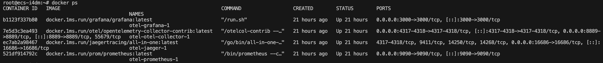
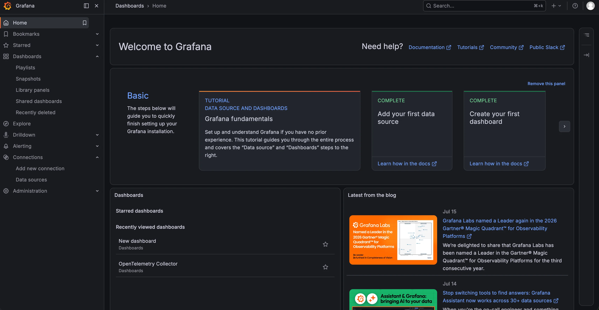
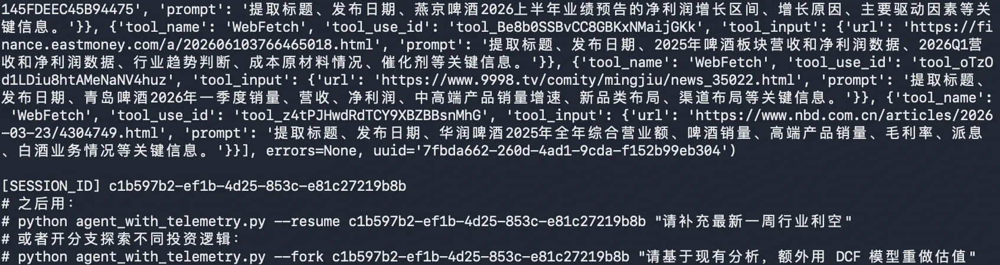
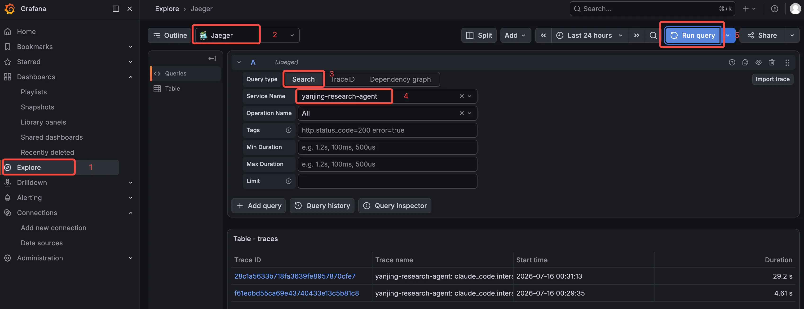
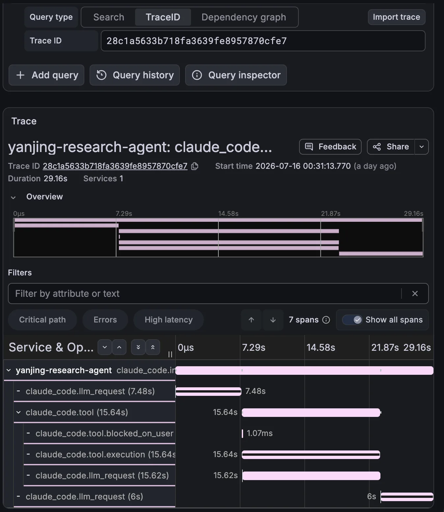
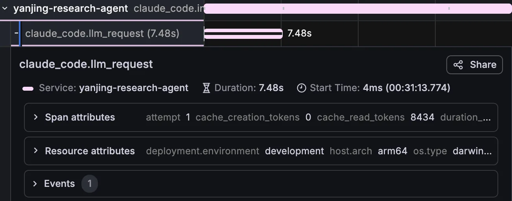
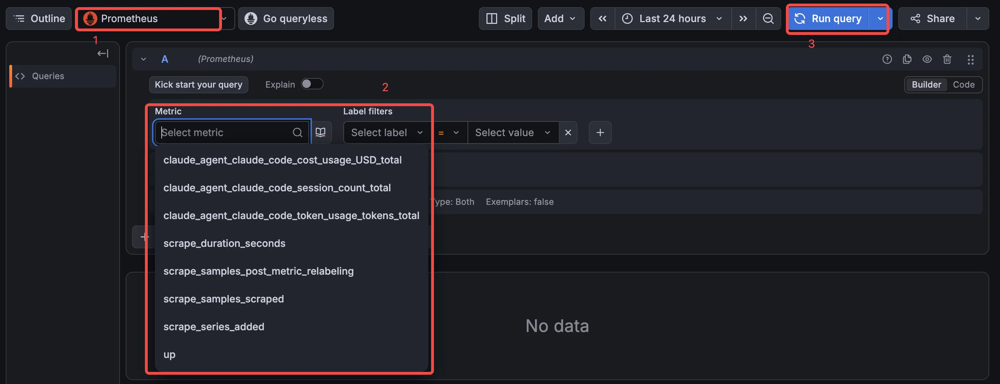
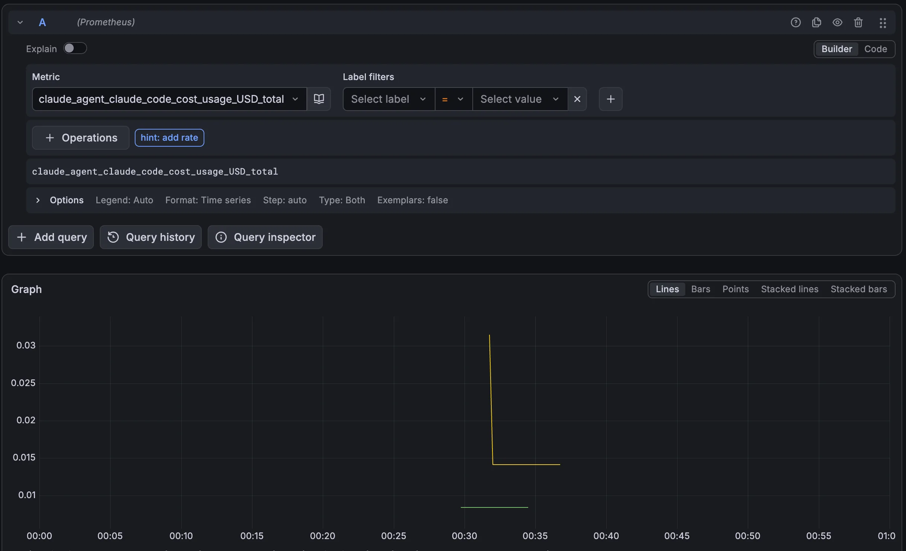
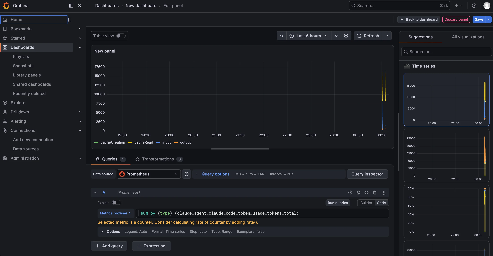

# 11｜扩展：OpenTelemetry 全链路监控与成本管理
你好，我是邢云阳。

上节课，我们借助 Hook 机制，在工具、SubAgent 执行前后植入了“中间件”的功能，借此加强了系统控制力。

但在公司里做产品时，用户更关心的是监控。比如，开发人员更关心调用链，也就是主 Agent 调用了哪些 SubAgent，SubAgent 又调用了哪些工具等等。通过查看调用链，可以知道问题在哪，瓶颈在哪。

至于领导，最喜欢看带有各种图表指标的监控大盘，了解他的钱花哪去了。Claude Agent SDK 是懂用户，也懂领导的，它准备好了无缝接入 OpenTelemetry 的功能，我们只需要正确配置环境变量，就能把 traces、metrics、log events 统一导出到任意 OTLP 后端。这节课，我们就把上节课的 agent\_with\_hooks.py 再升级一下，让它具备全链路可观测与成本管理能力。

## 一句话理解 OpenTelemetry

如果你之前没有接触过 OpenTelemetry，可以把它理解成一套“应用体检标准”。它由云原生计算基金会（CNCF）维护，定义了三种核心数据格式.

- **Traces（链路）**：记录一次请求从头到尾经过了哪些环节、每个环节花了多少时间，以及环节之间的父子关系。把它想象成快递的物流轨迹，你就能知道包裹从发货到签收每一步发生了什么。

- **Metrics（指标）**：记录可聚合的数值，比如 token 总数、请求次数、错误率、响应时间分位值。把它想象成体检报告里的血压、心率，适合长期趋势分析和告警。


- **Log events（日志事件）**：记录离散的结构化事件，比如某次 prompt 的提交、某次工具调用的结果、某次 API 错误。把它想象成病历本上的每一次就诊记录。


这三类数据都通过统一的 **OTLP（OpenTelemetry Protocol）** 协议发送出去，后端可以是 Jaeger、Datadog、Grafana、Honeycomb、Langfuse，也可以是你自己搭建的 collector。对 Agent 应用来说，最大的好处是：我们不需要为每一种监控后端单独写接入代码，配置好 OTLP 端点，所有数据就自动流过去了。

## OpenTelemetry 在 SDK 中是如何工作的

Claude Agent SDK 本身并不直接生成遥测数据，而是把配置透传给内部启动的 Claude Code CLI 子进程。CLI 子进程内置了 OpenTelemetry 插桩，会自动记录三种信号。

信号

包含内容

开启方式

Metrics

token、cost、会话数、代码行数、工具决策等计数器

OTEL\_METRICS\_EXPORTER=otlp

Log events

每次 prompt、API 请求、API 错误、工具结果的结构化记录

OTEL\_LOGS\_EXPORTER=otlp

Traces

每次 interaction、模型请求、工具调用、Hook 执行的 span

OTEL\_TRACES\_EXPORTER=otlp + CLAUDE\_CODE\_ENHANCED\_TELEMETRY\_BETA=1

这里有两个关键点需要注意。

第一，总开关是 CLAUDE\_CODE\_ENABLE\_TELEMETRY=1。只有设置了这个变量，后续的信号导出才会生效。

第二，Traces 目前处于 beta 阶段，需要额外设置 CLAUDE\_CODE\_ENHANCED\_TELEMETRY\_BETA=1。metrics 和 log events 则不需要这个开关。

配置方式有两种：

- 进程环境变量：在 shell、Docker、K8s 中统一设置，所有 query() 调用自动生效。这是生产环境推荐的做法。

- ClaudeAgentOptions.env：为某一次调用单独设置，适合同一进程里不同 Agent 需要不同遥测配置的场景。在 Python 中，env 会与当前进程环境合并。


对于我们这个投研 Agent，因为首次执行 / Resume / Fork 三种场景都希望复用同一套遥测配置，所以我会把它封装成一个 build\_otel\_env() 工厂函数，再分别注入到三个 ClaudeAgentOptions 中。

## 改造 agent\_with\_hooks.py：接入 OpenTelemetry

我们将在上节课的 agent\_with\_hooks.py 基础上进行改造，新增两部分内容。

1. 一个 build\_otel\_env() 函数，负责构造所有 OpenTelemetry 环境变量；

2. 在 run\_fresh、run\_resume、run\_fork 的 ClaudeAgentOptions 中注入 env。


### 构造 OpenTelemetry 环境变量

下面是 build\_otel\_env() 的实现：

```
def build_otel_env(
    service_name: str = "yanjing-research-agent",
    enduser_id: str = "",
    tenant_id: str = "",
) -> dict[str, str]:
    """构造 OpenTelemetry 环境变量，可传入服务名、用户、租户等标签。"""
    attrs = [
        "service.version=1.0.0",
        "deployment.environment=development",
    ]
    if enduser_id:
        from urllib.parse import quote
        attrs.append(f"enduser.id={quote(enduser_id)}")
    if tenant_id:
        from urllib.parse import quote
        attrs.append(f"tenant.id={quote(tenant_id)}")

    return {
        # 1. 总开关
        "CLAUDE_CODE_ENABLE_TELEMETRY": "1",
        # 2. Traces 需要 beta 开关
        "CLAUDE_CODE_ENHANCED_TELEMETRY_BETA": "1",
        # 3. 为三种信号各选一个 exporter
        "OTEL_TRACES_EXPORTER": "otlp",
        "OTEL_METRICS_EXPORTER": "otlp",
        "OTEL_LOGS_EXPORTER": "otlp",
        # 4. OTLP 传输配置
        "OTEL_EXPORTER_OTLP_PROTOCOL": "http/protobuf",
        "OTEL_EXPORTER_OTLP_ENDPOINT": os.getenv("OTEL_EXPORTER_OTLP_ENDPOINT", "http://localhost:4318"),
        "OTEL_EXPORTER_OTLP_HEADERS": os.getenv("OTEL_EXPORTER_OTLP_HEADERS", ""),
        # 5. 服务名与资源属性
        "OTEL_SERVICE_NAME": service_name,
        "OTEL_RESOURCE_ATTRIBUTES": ",".join(attrs),
        # 6. 短任务调低导出间隔，避免数据丢失
        "OTEL_METRIC_EXPORT_INTERVAL": "1000",
        "OTEL_LOGS_EXPORT_INTERVAL": "1000",
        "OTEL_TRACES_EXPORT_INTERVAL": "1000",
    }
```

这段代码有五个层次，我们逐一解读。

**1.总开关与 beta 开关**

CLAUDE\_CODE\_ENABLE\_TELEMETRY=1 是所有信号的前置条件。CLAUDE\_CODE\_ENHANCED\_TELEMETRY\_BETA=1 则是开启 Traces 所必需的。如果你暂时不想看调用链，只关心成本和日志，可以只保留 metrics 和 logs，去掉 traces 相关的变量。

**2.exporter 配置**

三种信号可以独立选择 exporter。SDK 推荐统一使用 otlp，即 OpenTelemetry Protocol。你也可以按需只开启其中一种或两种。

**3.OTLP 传输配置**

OTEL\_EXPORTER\_OTLP\_PROTOCOL 设置为 http/protobuf，OTEL\_EXPORTER\_OTLP\_ENDPOINT 指向 collector 地址。这里我用环境变量做兜底，默认本机 4318 端口，方便本地 Jaeger 测试。OTEL\_EXPORTER\_OTLP\_HEADERS 则用于认证，例如 Authorization=Bearer your-token。

**特别提醒：** 不要把 `console` 设为 exporter。因为 console 输出会占用 SDK 与 CLI 子进程之间的通信通道，导致运行异常。本地调试请用 Jaeger 等本地 collector。

**4.服务名与资源属性**

默认服务名是 claude-code。如果你运行多个 Agent，最好在 OTEL\_SERVICE\_NAME 里给它们各自命名。OTEL\_RESOURCE\_ATTRIBUTES 可以附加版本号、部署环境等标签，方便在可观测后端按服务筛选。

**5.导出间隔**

CLI 默认 metrics 每 60 秒导出一次，traces 和 logs 每 5 秒导出一次。对于投研这种单次运行可能就几分钟的任务，我们把三个间隔都降到 1 秒，避免进程结束时还有数据没来得及发送。

### 注入到三种会话模式

build\_otel\_env() 准备好之后，只需要在三个 ClaudeAgentOptions 里加上 `env=otel_env` 即可。以 run\_fresh 为例：

```
async def run_fresh(prompt: str, otel_env: dict[str, str] | None = None) -> str:
    """从头开始一次分析，跑完把 session_id 吐出来，方便后续 resume / fork。"""
    options = ClaudeAgentOptions(
        system_prompt=SYSTEM_PROMPT,
        include_partial_messages=True,
        mcp_servers={"websearch": websearch_server},
        allowed_tools=[
            "Read", "Grep", "Glob", "Agent", "AskUserQuestion",
            "mcp__websearch__bochasearch",
        ],
        agents=build_agents(),
        hooks=BUILD_HOOKS(),
        env=otel_env or build_otel_env(),      # ★ 注入 OpenTelemetry 配置
    )

    session_id = None
    async with ClaudeSDKClient(options=options) as client:
        await client.query(prompt)
        async for msg in client.receive_response():
            print(msg)
            if isinstance(msg, ResultMessage):
                session_id = msg.session_id
    return session_id
```

run\_resume 和 run\_fork 的改造方式完全一致，都是在 ClaudeAgentOptions 里加上 `env=otel_env or build_otel_env()`。

### 用户与租户归因

当团队多人共用一个 Agent 服务时，我们需要把每次调用的成本归属到具体的人。OpenTelemetry 支持通过 OTEL\_RESOURCE\_ATTRIBUTES 注入 enduser.id 和 tenant.id。

我在 CLI 入口新增了两个可选参数：

```
parser.add_argument(
    "--user",
    metavar="USER_ID",
    default="",
    help="当前分析师 ID，用于 OpenTelemetry 用户归因",
)
parser.add_argument(
    "--tenant",
    metavar="TENANT_ID",
    default="",
    help="当前租户/团队 ID，用于 OpenTelemetry 用户归因",
)
```

然后在 main() 里调用 build\_otel\_env(enduser\_id=args.user, tenant\_id=args.tenant)。enduser.id 和 tenant.id 会出现在每条 span、每个 metric、每个 log event 上，方便后续按人、按团队做成本分摊。

需要注意的是，这些值里如果包含逗号、空格、等号，必须先做 percent-encode，否则会破坏 OTEL\_RESOURCE\_ATTRIBUTES 的解析。代码里我用 urllib.parse.quote 做了处理。

### 敏感数据控制

OpenTelemetry 默认只导出演示结构：耗时、模型名、工具名、token 数等。Agent 读取或写入的内容默认不会被记录。但如果你需要更细粒度的审计，可以通过以下变量按需开启：

变量

作用

OTEL\_LOG\_USER\_PROMPTS=1

在事件和 interaction span 上记录 prompt 文本

OTEL\_LOG\_TOOL\_DETAILS=1

在 tool\_result 事件上记录工具输入参数

OTEL\_LOG\_TOOL\_CONTENT=1

在 tool span 上以 span event 形式记录完整工具输入输出

OTEL\_LOG\_RAW\_API\_BODIES

记录完整 API 请求/响应 JSON

在投研场景中，财报 PDF 内容、搜索关键词、内部文件路径都可能涉及敏感信息。因此我建议， **默认不开启这些变量**，只有当你的可观测 pipeline 经过安全审批、确实需要内容级审计时，再按需打开。

## 测试效果

完成代码改造后，我们来验证一下效果。由于监控数据涉及到 Trace、Metrics等多源数据，因此建议使用 OpenTelemetry 的适配器来统一收集数据，然后推送到 Jaeger，Prometheus 等监控平台上。

我使用 AI 为大家生成了一份带有 OpenTelemetry 适配器，Prometheus、Jaeger、Grafana等组件的 docker compose Yaml 文件，你可以在我的 [Github](https://github.com/xingyunyang01/Geek04/tree/main/11opentelemetry/otel "") 自取，拿到后使用命令 docker compose up -d 把组件拉起，效果如下图所示：



接下来，我们在浏览器输入 http://:3000，输入默认用户名/密码，admin/admin，可以打开 Grafana 控制台。



### 运行一次带遥测的研报分析

我们执行后面的命令。

```
$ python agent_with_telemetry.py
```

终端输出与前几节课基本一致：



### 查看全链路 Trace

之后在 Grafana 控制台按照下图的步骤编号依次操作。先点击左侧 Explore，之后在上方 Outline 后面的选择框选择 Jaeger。第三步 Query type 选择 Search，之后 Service Name 选择我们在程序中设置的 yanjing-research-agent 这个名称。最后点击右上角的 Run Query，即可搜索到 Trace，并在最下方的 Table-traces 中显示出来。



我们可以点击一条 Trace 的 Trace ID，查看具体的 Trace 信息。



整条 trace 依次包括：

- claude\_code.llm\_request：主 Agent 的每次模型请求，包含模型名、延迟、输入/输出 token 数；

- claude\_code.tool：每次工具调用，例如启动 SubAgent、调用 Read/Grep/WebSearch；

- claude\_code.tool.blocked\_on\_user：工具等待权限确认的耗时；

- claude\_code.tool.execution：工具实际执行的耗时；


例如，我们点开第一个 claude\_code.llm\_request，就可以看到模型调用情况。



当主 Agent 通过 Agent 工具启动 SubAgent 时，SubAgent 内部产生的 `llm_request` 和 tool 的 `Span` 会嵌套在父 Agent 的 `claude_code.tool` 下面。也就是说， **主 Agent、三个 SubAgent、几十次工具调用，会被串成一条完整的 trace**。

这对投研排查非常有价值。例如，你发现某次研报生成特别慢，点开 trace 就能直观看到：是财报 SubAgent 的 PDF 解析卡住了，还是行业 SubAgent 的搜索网络延迟高，抑或是主 Agent 在某一轮模型请求上耗时过长。

### 按 session 过滤

Traces 默认会带上 session.id 属性。当你用 resume 或 fork 复用同一段历史时，可以在 Jaeger 里按 session.id 过滤，把同一个研报从初始分析到后续追问、再到多个估值分支的所有 trace 串起来看。

```
$ python agent_with_telemetry.py --resume  \
    --user analyst-01 \
    --tenant research-team-a \
    "请补充最新一周行业利空"
```

这样，投研工作就不再是一堆孤立的终端输出，而是一条可持续追溯、可成本归因的数字化链路。

### 查看 Metrics 做成本管理

我们可以在刚才那个面板把 Outline 后面的 Jaeger 换成 Prometheus，就可以查看 Metrics 信息。



比如我们选择第一个 claude\_agent\_claude\_code\_cost\_usage\_USD\_total 这个指标，然后点击 Run query 按钮。便可以看到该指标的图形。



此外，我们还可以在 Dashboard 中增加看板，利用一些 Prom 语句来查看聚合指标。比如下图展示了使用 Sum 语法来计算累计 Token 消耗。



借助这些指标，很多实际问题就都有了答案：

- 生成一份完整研报，三个 SubAgent 加起来消耗了多少 token？

- DCF 估值分支和相对估值分支，哪个更费钱？

- analyst-01 和 analyst-02 这个月分别产生了多少成本？

- research-team-a 和 research-team-b 哪个团队调用更频繁？


## 总结

这节课我们在 Session、Fork、Hooks 的基础上，又给投研 Agent 加上了 OpenTelemetry 这层“全景仪表盘”。

我们来回顾一下核心收获：

- Claude Agent SDK 通过子进程 CLI 自动导出 OpenTelemetry 三种信号：Metrics、Log events、Traces；

- 只需配置环境变量即可开启，不需要改动业务逻辑；

- OTEL\_SERVICE\_NAME 和 OTEL\_RESOURCE\_ATTRIBUTES 让我们能按服务、版本、环境筛选数据；

- enduser.id 和 tenant.id 让成本可以精确归因到人和团队；

- Traces 把整个主 Agent → SubAgent → 工具调用 → 模型请求的链路串联在一起，方便定位瓶颈和异常；

- Metrics 中的 token 和 cost 计数器是成本管理的基础，可以结合后端告警做预算控制；

- 内容级日志默认关闭，只有经过安全审批后才按需开启。


从第 8 课的多 Agent 协作，到第 9 课的 Session / Fork 持续工作，再到第 10 课的 Hooks 安全治理，最后到这节课的 OpenTelemetry 全链路监控与成本管理——一个真正能进入团队生产环境的投研 Agent，才算慢慢成型。

## 思考题

请结合你自己的工作场景思考后面的问题。

- 你的 Agent 任务里，哪些指标最值得优先接入 OpenTelemetry？是 trace 链路、token 成本，还是工具调用频率？

- 如果要把成本按人或按项目拆分，你会如何设计 enduser.id 和 tenant.id？

- 在开启 OTEL\_LOG\_TOOL\_CONTENT 等内容级日志时，你会如何评估数据安全和审计价值之间的平衡？

- 如果把 OpenTelemetry 与上节课的 Hooks 审计日志结合，本地审计和远端遥测各自适合承担什么角色？


期待看到你在留言区展示思考过程，我们一起探讨。如果你觉得这节课的内容对你有帮助的话，也欢迎你分享给其他朋友，我们下节课再见！