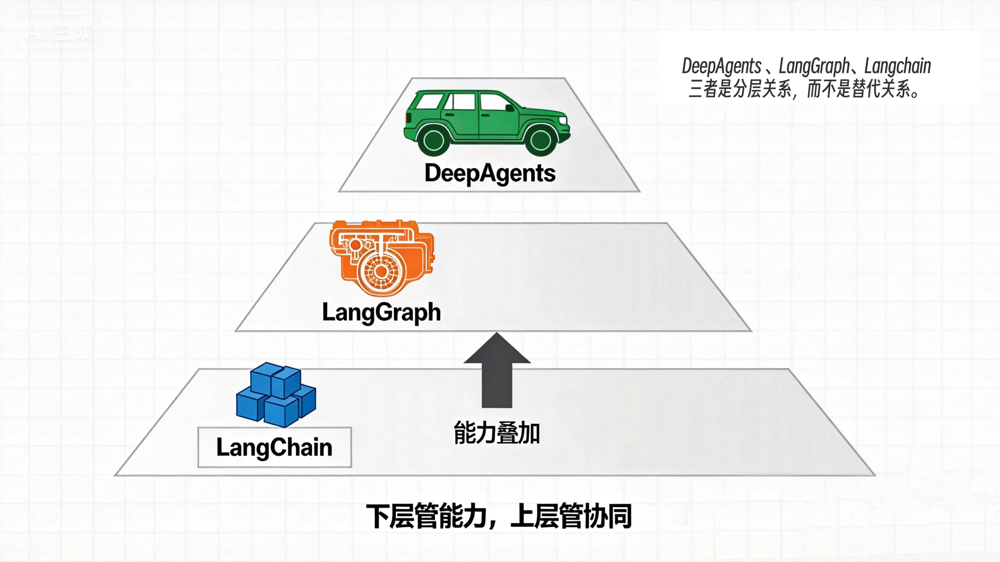

# 12｜起点：Deepagents 快速入门与 LangChain 老项目升级
你好，我是邢云阳。

在上一章，我们利用 Claude Agent SDK 的诸多特性，从多 Agent 协作、Session / Fork 持续工作、Hooks 安全治理到 OpenTelemetry 全景监控，逐步完善我们的投研系统。此刻，一个能进入团队生产环境的投研 Agent 已经初具雏形。

不过，当这套系统真的要长期演进时，一个新的问题就会浮现出来：Claude Agent SDK 与 Claude 模型、Anthropic 生态绑定较深。对于所在团队已经在 LangChain / LangGraph 上积累了大量工具、项目经验，做项目又要求使用国内模型，或者支持在不同模型提供商之间灵活切换，就需要寻找同样提供“Agent Harness”能力、但更加开放和可移植的方案。

这正是 Deepagents 的定位。它是由 LangChain 团队推出的 Agent Harness，底层基于 LangChain 的构建块和 LangGraph 的运行时，但向上封装了与 Claude Agent SDK 非常相似的“开箱即用”能力：文件系统、任务规划、子代理、人机协同、权限控制、可观测性等等。

这节课，我们就来解决三个问题。

1. LangChain、LangGraph、Deepagents 三者到底是什么关系？

2. Deepagents 的 Harness 特性如何快速上手？

3. 一个原本用 LangChain / LangGraph 手写的项目，如何顺利升级到 Deepagents？


## LangChain、LangGraph、Deepagents 三者的关系

在深入代码之前，我们稍微花点时间，把 LangChain 社区自 2023 年以来推出的这三代项目间的关系搞清楚。

### LangChain：基础构建块

LangChain 是 Agent 的“零件库”。它提供了模型接口、提示模板、工具定义、向量存储、文档加载器、输出解析器等通用组件。你可以把它理解为乐高积木：工具很全，但怎么拼成一个能在真实环境里稳定运行的 Agent，还需要你自己设计。

在 Agent 开发场景里，LangChain 常用于完成下面几类任务。

- 用 ChatModel 封装不同厂商的 LLM；

- 用 @tool 装饰器把业务封装成工具；

- 用链式调用快速地把模型、工具，对话等连接成一个 Agent。


### LangGraph：运行时与编排引擎

LangGraph 是 Agent 的“发动机”。它在 LangChain 组件之上提供了状态图、持久化检查点、人机协同中断、循环控制等能力。

如果说 LangChain 解决的是“单个步骤怎么做”，LangGraph 解决的就是“多个步骤怎么串起来、怎么容错、怎么持久化”。LangGraph 在 2026 年之前基本是国内做项目的首选。因为它提供的工作流机制解决了模型单纯利用计划模式或者思考链容易遗漏步骤，忘记目标或者出现幻觉等问题，属于使用外部工程化手段、强行接管模型决策类工作的一种方式。模型的决策能力越弱，越能体现出 LangGraph 的价值。

### Deepagents：拥有了 Harness 的 LangChain

**Deepagents** 是 LangChain 团队对 Agent Harness 这一层产品的实现。它不想再让你从零拼装 LangChain + LangGraph，而是直接提供一个封装好的函数，把真实任务里最常见的能力内置进去，比如：

- 执行环境：工具调用、虚拟文件系统、可选沙箱、代码解释器；

- 上下文管理：Skills、Memory、自动摘要、上下文卸载、提示缓存；

- 任务委托：内置 write\_todos 做规划、内置 task 工具派生子代理；

- 人机协同：interrupt\_on 在关键操作前暂停等待确认。


官方文档里有一个很贴切的比喻：Deepagents 是 **agent harness**，LangChain 是 **framework**，LangGraph 是 **runtime**。三者是分层关系，而不是替代关系。



项目

角色

类比

投研场景用法

LangChain

构建块

乐高零件

定义模型、工具、检索链

LangGraph

运行时

发动机

编排多步骤工作流、持久化状态

Deepagents

Harness

整车

直接跑出能读文件、派生子 Agent、写报告的投研 Agent

对于我们这门课来说， **Deepagents 和 Claude Agent SDK 处于同一层**。它们都试图回答同一个问题：如何把一个大语言模型变成一个能在真实环境里完成复杂任务的 Agent。

区别主要在于Claude Agent SDK 更贴近 Anthropic / Claude 生态，体验高度一致；而 Deepagents 更贴近 LangChain / LangGraph 生态，模型选择更开放，与现有 LangChain 资产更容易互通。

## 快速上手 Deepagents

Deepagents 的入门代码非常简洁，我们照例先从环境配置开始讲起。

### 安装与配置

创建一个独立环境，安装 Deepagents ：

```
pip install Deepagents
```

然后设置模型。Deepagents 内部针对主流的国外模型厂商，封装了调用库，代码中只需要通过 provider:model 字符串选择模型，例如 google\_genai:gemini-3.5-flash、openai:gpt-5.4，非常简洁。但对于使用国内模型的用户，除了 DeepSeek，其他模型暂不支持这种简洁的方式。因此需要使用 LangChain 传统的方式来设置模型，代码如下：

```
import os
from langchain_openai import ChatOpenAI

model = ChatOpenAI(
    model_name="MiniMax-M3",
    base_url="https://api.minimaxi.com/v1",
    api_key=os.getenv("MINIMAX_API_KEY"),
)
```

上述代码使用了兼容 OpenAI SDK 的格式，可以自由地替换所有支持 OpenAI SDK 的厂商的模型。

### 一个最小可运行的 DeepAgent

在搞定了模型部分后，接下来的工作就非常简单了，直接定义后端（后面具体讲解），然后调用函数 create\_deep\_agent 就可以直接创建出一个具备 Harness 的 Agent。

```
import os
from langchain_openai import ChatOpenAI
from Deepagents import create_deep_agent
from Deepagents.backends import LocalShellBackend
from dotenv import load_dotenv

load_dotenv()

model = ChatOpenAI(
    model_name="MiniMax-M3",
    base_url="https://api.minimaxi.com/v1",
    api_key=os.getenv("MINIMAX_API_KEY"),
)

backend = LocalShellBackend("./", virtual_mode=True)

agent = create_deep_agent(
    model=model,
    backend=backend,
)

result = agent.invoke({"messages": "当前目录下有哪些文件？"})
```

这个 Agent，内置了前面说过的那些上下文管理、任务委派等等能力，无需像过去使用 LangChain 开发一样，从零自己实现。

### 内置 Harness 工具一览

在上面最小可运行 demo 的基础上，工具是 Deepagents 中非常重要的一环。和 Claude Agent SDK 一样，其默认拥有一套 Harness 工具：

工具

作用

投研场景怎么用

`ls`

列目录

查看工作区有哪些研报文件

`read_file`

读文件，支持分页/多模态

读财报 PDF、读新闻摘要

`write_file`

写文件

输出研究报告

`edit_file`

精确替换字符串

修改报告中的某个数据

`delete`

删除文件或目录

清理临时文件

`glob` / `grep`

文件搜索

批量查找财报章节

`execute`

执行 shell 命令（沙箱后端）

运行 Python 做估值计算

`task`

派生子代理

把行业/财报/风险分析拆给子 Agent

`write_todos`

维护任务列表

跟踪研报生成进度

这些工具由 Agent 根据选择了什么样的 backend 后端来自动暴露给模型。你可以通过 backend 和 permissions 控制它能访问哪些真实资源。

### 后端：Deepagents 中最重要的概念

上面多次提到 backend 后端，现在来详细说一下。所谓 backend 后端，就是 Agent 访问文件系统的能力的区分，常用的后端包含以下几个：

- StateBackend（默认）：与 LangGraph 的状态管理器类似，仅仅是记录 Agent 运行状态，没有操作文件系统的能力；

- FilesystemBackend：访问本地磁盘，进行文件读写，需要划定读写文件系统的路径，避免出现路径逃逸。所谓路径逃逸，就是说，我想让 Agent 只访问 a 目录，结果它访问了 b 目录；

- LocalShellBackend：比 FilesystemBackend 更进了一步，不仅可以读写文件，还可以进行 Bash 操作。

- StoreBackend：基于 LangGraph Store 的持久化，跨线程共享，主要用于对话记忆；

- CompositeBackend：把不同路径路由到不同后端。


在这些后端中，最复杂的是 CompositeBackend，后面的代码演示了其用法。

```
from Deepagents import create_deep_agent
from Deepagents.backends import CompositeBackend, StateBackend, FilesystemBackend

agent = create_deep_agent(
    model="anthropic:claude-sonnet-4-6",
    backend=CompositeBackend(
        default=StateBackend(),
        routes={
            "/workspace/": LocalShellBackend(
                root_dir="/Users/Admin/workspace/python/12Deepagents/projects",
                virtual_mode=True,
            ),
        },
    ),
)
```

重点看这几个细节。在代码第 6 行，声明了使用 CompositeBackend。在第 7 行，显示使用了 StateBackend。在第 9 行，使用了 LocalShellBackend，并在第 10 行定义了 LocalShellBackend 可操作的文件路径。

### 权限管理

在有了工具与后端后，我们可以操作本地文件系统了，但是权限控制不能放松。我们可以通过 permissions 参数进行声明：

```
from Deepagents import FilesystemPermission

agent = create_deep_agent(
    ...,
    permissions=[
        FilesystemPermission(
            operations=["write"],
            paths=["/.env", "/etc/**", r"C:\Windows\**"],
            mode="deny",
        ),
    ],
)
```

比如以上代码，设置了 write 工具不能操作的路径（/.env 等等）。

这样，Deepagents 的核心用法，我们就已经上手了。是不是觉得代码非常简单呢？基本就是一些变量的配置，和 Claude Agent SDK 差不太多，尤其是对于之前用过 LangChain create\_agent() 方法来构建 Agent 的你来说，这些代码更好理解。

## 把老项目升级到 Deepagents

许多团队从 2023 年以来，已经在 LangChain / LangGraph 上写了不少 Agent。这节课的第三个重点，就是学习一个原本用 LangChain/LangGraph 实现的 Agent，如何升级到 Deepagents。

### 将 LangChain 升级到 Deepagents

在 LangChain 的项目中，核心是构建一个能够进行工具调用，且能多次循环的 Agent，之后我们在外围做一些上下文之类的处理。在构建 Agent 的过程中，经常会用到 create\_agent() 方法来直接获得一个开箱即用的类 react agent。

我们结合例子看一下。代码如下：

```
from langchain.agents import create_agent

# 1. 定义工具（一个普通的 Python 函数）
def get_weather(city: str) -> str:
    """获取指定城市的天气"""
    return f"{city} 今天天气晴朗，22°C，适合出门！"

# 2. 创建 Agent
agent = create_agent(
    model="deepseek:deepseek-v4-pro",          # 格式：provider:model
    tools=[get_weather],              # 绑定工具
    system_prompt="你是一个天气助手", # 设定角色
)

# 3. 运行 Agent
result = agent.invoke({
    "messages": [
        {"role": "user", "content": "北京今天天气怎么样？"}
    ]
})

# 4. 获取最终回复
print(result["messages"][-1].content)
```

在后期，create\_agent() 还增加了中间件功能，用户可以使用一些中间件来增强 agent 的能力。说白了，就是早期构建 Harness的方式，我们同样结合代码来看看。

```
from langchain.agents import create_agent
from langchain.agents.middleware import PIIMiddleware, SummarizationMiddleware, HumanInTheLoopMiddleware

agent = create_agent(
    model="deepseek:deepseek-v4-pro",
    tools=[read_email, send_email],
    middleware=[
        PIIMiddleware(patterns=["email", "phone", "ssn"]),  # 过滤敏感信息
        SummarizationMiddleware(model="anthropic:claude-sonnet-4-5", max_tokens_before_summary=500),  # 浓缩过长历史
        HumanInTheLoopMiddleware(interrupt_on={"send_email": {"allowed_decisions": ["approve", "edit", "reject"]}})  # 敏感操作需人工审批
    ]
)
```

不过，到了 Deepagents 时代，上述代码可以全部放弃了。我们可以直接用 Deepagents 的 create\_deep\_agent() 替换 create\_agent() 来构建更好的 agent。

### LangGraph 升级到 Deepagents

LangGraph 的改造需要分成两个维度。

第一种是局部改造。对于已基于工作流构建且运行稳定的多智能体系统，并不需要大改，更推荐按需局部做改造。比如当前许多项目在每个 Agent 节点中直接使用 `langgraph.prebuilt` 模块提供的 `create_react_agent` 方法，来快速获取开箱即用的 ReAct Agent。这部分内容如果有 Harness 需求，就可将其替换为更灵活的 `create_deep_agent`。

第二种是全面重构。 若项目具备整体升级的条件，则可参考此前在金融研报生成项目（详见第二章）中的实践路径——我们已借助 Claude Agent SDK 与 Skills 完成了项目代码改造升级。同样的思路，放在Deepagents 也适用。

代码如下：

```
import os
from langchain_openai import ChatOpenAI
from Deepagents import create_deep_agent
from Deepagents.backends import LocalShellBackend
from dotenv import load_dotenv

load_dotenv()

model = ChatOpenAI(
    model_name="MiniMax-M3",
    base_url="https://api.minimaxi.com/v1",
    api_key=os.getenv("MINIMAX_API_KEY"),
)

backend = LocalShellBackend("./", virtual_mode=True)

agent = create_deep_agent(
    model=model,
    backend=backend,
    skills=["./my-project/skills/"],
    system_prompt="""
你是一位金融研报项目协调员。用户会提供股票代码、公司名称、市场和分析年份。

你的工作流程（按顺序执行）：

## 阶段 1: 数据采集
- 调用 competitor_research skill 研究竞争对手和行业
- 调用 financial_data_collection skill 采集所有公司的财务报表

## 阶段 2: 指标计算
- 调用 financial_ratio_calculation skill 计算所有公司的财务比率

## 阶段 3: 分析与可视化
- 调用 financial_visualization skill 生成趋势图和对比图
- 调用 valuation_modeling skill 生成估值报告

## 阶段 4: 报告撰写
- 调用 report_writing skill（隐式遵循其写作规范）
- 调用 report_assembly skill 组装最终研报

## 状态管理
所有中间产物都保存在文件系统中，你通过 read/glob 工具检查产物是否存在。
如果某个 skill 失败，记录警告并尝试继续。""",
)

run_config = {"recursion_limit": 100}

result = agent.invoke({"messages": "生成青岛啤酒SH600600的2025年金融研报"}, run_config=run_config)

print(result)
```

可以看到思路与 Claude Agent SDK 几乎是一模一样。但是这其中还有 LangGraph 时代的影子，或者说不够智能的地方，那就是代码第 46 行的对话轮次限制。

对于 Claude Agent SDK 来说，不需要关心轮次限制，它可以自动完成处理。但是在 Deepagents 中，我们需要手动设置一下，否则默认是 25 轮，对于目前的复杂任务来说，太小了。当然，100 轮对于很多任务来说，可能也不够，但我们不能无限制的加轮次（比如加到500）。更好的方案是把任务拆分，引入SubAgent 分工完成。

## 总结

作为 Deepagents 新篇章的起点，这节课我们从 LangChain、LangGraph、Deepagents 的区别的角度切入，之后还完成了Deepagents 的初步配置、快速上手任务，最后探讨了老项目升级到 Deepagents 的思路。

回顾一下我们今天的核心收获，主要有三点。

1\. **LangChain 是构建块，LangGraph 是运行时，Deepagents 是** **H** **arness**。三者分层协作，不是互相替代。Deepagents 站在 LangGraph 之上，把真实任务里反复出现的样板代码抽象成了内置能力。

2\. **Deepagents 的** **H** **arness 特性可以一行代码上手**：create\_deep\_agent 自动带来规划、文件系统、子代理、权限、流式等能力，模型选择也更开放。

**3\. LangChain/LangGraph** **老项目升级：** LangChain老项目可以直接使用 create\_deep\_agent 替换掉 create\_agent，同时需要关注 read，write 等工具，Deepagents 已经内置了。LangGraph 老项目改造，则需要结合实际的需求来看是局部改造还是全面重构。

## 思考题

请结合你自己的工作场景思考：你团队现有的 LangChain / LangGraph 项目中，有没有升级为 Deepagents 的需求？为什么？

期待看到你在留言区展示思考过程，我们一起探讨。如果你觉得这节课的内容对你有帮助的话，也欢迎你分享给其他朋友，我们下节课再见！