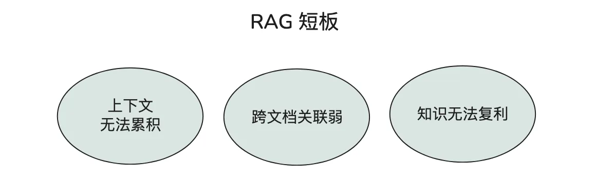

# 13｜基础：LLM-Wiki 快速理解与入门
你好，我是邢云阳。

2026 年 4 月，人工智能科学家以及著名教育家 Andrej Karpathy（卡帕西）提出了一种名为 LLM-Wiki 的个人知识编译系统，用来重构他自己的研究知识管理方式。无论他本人，还是这次他提出的概念，都在 AI 圈内非常有影响力，该帖子一经发布便迅速在技术社区引发传播，累计浏览量超过 2000 万，直接成为当月讨论度最高的一个 AI 事件。

那为什么这样一个看似“个人笔记系统”的方案会引爆整个互联网？本质在于他第一次把 LLM 的使用范式从“对话式工具”推向了“知识生产系统”，模型不再是被动回答问题，而是主动参与知识管理、结构生成与长期演化。

这节课，我们就来好好地聊一聊 LLM-Wiki。

## 回顾传统 RAG 的基本流程

正式介绍 LLM-Wiki 之前，我们稍微回顾一下大家更熟悉的 RAG（检索增强生成）。

RAG 的基本逻辑是：每次用户提问时，从原始文档中检索出相关片段，然后把片段塞进 prompt，让模型基于这些片段生成答案。对于简单的问答场景，这套方法非常有效。比如问“某公司 2025 年营收是多少”，从年报里检索出对应段落，模型直接回答即可。

但当我们做一些更复杂的研究型任务时，RAG 的短板就会暴露出来。



**第一，上下文无法累积。** 每次提问都是独立的检索 \+ 生成过程。上一次分析中得到的结论、修正过的数据、排除过的假设，不会自动进入下一次对话。如果你要连续追踪一个行业三个月，就得反复把背景信息喂给模型。

**第二，跨文档关联弱。** 单独检索某份文档里的片段，难以发现多份资料之间的矛盾和联系。比如 A 研报说某公司毛利率上升是因为产品结构优化，B 研报说是因为原材料降价，C 研报又提到行业竞争加剧。RAG 很难主动把它们放在同一页面上做对比和关联。

**第三，知识无法** **形成** **复利。** 原始资料永远是“原料”，AI 每次都要重新理解、重新总结。研究做得越久，重复劳动越多，而不是越用越聪明。

LLM-Wiki 的核心思想，就是把这些“一次性理解”变成“可持续维护的知识资产”。

## LLM-Wiki 到底是什么

Andrej Karpathy 提出，与其每次让 AI 临时读原始文档，不如让 AI 先把资料“编译”成一个结构化的、互相链接的 Markdown 页面网络，然后基于这个 Wiki 来回答问题。这其实有点像之前的知识图谱，各个知识不是孤立的片段，而是存在联系。

LLM-Wiki 整个构建流程可以概括为三步：

1\. **阅读资料**：AI 读取原始文档（PDF、网页、笔记等）。

2\. **提取与编译**：从中提取关键实体、概念、关系，按照预定格式写成 Markdown 页面。

3\. **持续维护**：新资料进来时，更新已有页面、添加链接、标记矛盾，让知识库像 Wiki 一样生长。

最终形成的是一个 **纯 Markdown + 文件系统** 的知识库。你可以用 VS Code、Obsidian、Git 直接查看和管理它，不依赖任何黑盒向量数据库。

## LLM-Wiki 与 RAG 的核心区别

为了更直观地理解两者的差异，我把它们放在一起对比。

维度

传统 RAG

LLM-Wiki

工作方式

每次提问时临时检索片段

先编译成结构化 Wiki，再基于 Wiki 查询

知识状态

无状态，每次从零开始

有状态，知识持续累积

上下文能力

受限于单次检索窗口

跨页面、跨文档的关联被显式维护

可审计性

黑盒向量库，难追溯

纯 Markdown + Git，每次变更可审计

知识复利

低，重复处理原始资料

高，新资料在已有结构上增量生长

人工介入

主要在提问和审答案

可以在编译阶段审查、修正 Wiki 页面

## LLM-Wiki的架构

那在粗略了解了 LLM-Wiki 的概念后，接下来，我们再详细讲解一下 LLM-Wiki 的架构，为后续构建 LLM-Wiki 打下基础。LLM-Wiki 的架构可以总结为三层加两个关键文件，我们依次来看。

### raw 层：原始资料的“仓库”

`raw/` 目录存放的是原始、不可变的资料。可以是 PDF 转成的 Markdown、爬取的文章、你的读书笔记、会议录音转录稿等等。这一层只供 AI 读取，不直接对外提供答案。

它的作用是保留“证据”。当 Wiki 中的某个结论需要复核时，你可以随时回到 raw 层，找到最初的出处。

### wiki 层：AI 维护的核心知识库

`wiki/` 目录是 LLM-Wiki 的核心。里面的每一个 Markdown 页面，都是 AI 根据 schema 规则编译出来的知识单元。常见的页面类型包括：

- `index.md`：Wiki 的总目录和导航。

- `entities/`：实体页，比如人、公司、技术、产品等。

- `concepts/`：概念页，比如“DCF 估值”、“注意力机制”。

- `summaries/`：单份资料或单次会议的总结。

- `synthesis/`：综合对比页，比如“燕京啤酒 vs 青岛啤酒”、“PE 估值 vs DCF 估值”。


这些页面之间通过 Markdown 链接互相引用，形成一个真正的知识网络。

### schema 层：如何在 Wiki 层组织知识库的规则

`schema.md` 是整个 Wiki 的维护规则。它告诉 AI：

- 什么样的内容应该新建一个页面？

- 每个页面应该包含哪些字段？

- 页面之间如何建立链接？

- 遇到矛盾信息时应该怎么标记？

- index.md 和 log.md 应该怎么更新？


schema 是你的业务规则在 Wiki 层面的体现。一个好的 schema 能让 AI 持续、稳定地产出结构一致的知识页面。部分 schema.md 的内容示例如下：

```
# Wiki Schema — 投研知识库结构定义

> 本文件定义 Wiki 的页面类型、命名约定、frontmatter 规范、工作流。
> 由你和 LLM 共同迭代演进。当前版本: v1.0

## 三层架构

| 层级 | 路径 | 性质 | 说明 |
|------|------|------|------|
| Raw Sources | `/data/raw/` | 只读,不可变 | 原始资料(研报 PDF、新闻、公告、复盘) |
| Wiki | `/data/wiki/` | LLM 读写 | 结构化 Markdown 知识库 |
| Schema | `/data/schema.md` | 本文件 | Wiki 结构与工作流配置 |

## 页面类型与命名

| 类型 | 命名格式 | 示例 | 存放位置 |
|------|---------|------|---------|
| 个股档案 | `{代码}-{公司简称}.md` | `300750-宁德时代.md` | `/data/wiki/` |
| 行业综述 | `industry-{行业名}.md` | `industry-动力电池.md` | `/data/wiki/` |
| 宏观/概念 | `macro-{概念名}.md` | `macro-美联储加息.md` | `/data/wiki/` |
| 资料摘要 | `source-{关键词或代码}.md` | `source-300750-宁德时代2025年报.md` | `/data/wiki/` |
| 策略/复盘 | `strategy-{策略名}.md` | `strategy-网格交易复盘.md` | `/data/wiki/` |

## 关键文件

- **`/data/wiki/index.md`** — 内容总览目录。按类别(个股/行业/宏观/策略/资料)组织,每条含链接 + 核心逻辑一句话摘要。LLM 每次导入时更新。
- **`/data/wiki/log.md`** — 投研操作日志。按时间顺序追加(新事件在上方),格式如 `## [YYYY-MM-DD] 操作类型 | 简述`。

......

## 交叉引用原则

- **Wikilink** 风格:`[[300750-宁德时代]]` — 支持 Obsidian 图谱视图
- 每个个股页底部都要有"来源"链接,指回资料摘要页
- 摘要页末尾列出"相关概念",形成概念网络
- **标注跨资料关联**:多篇研报提到相似观点时,在页面中明确标注
- **标注矛盾观点**:不同资料的冲突要明确标注,不偷偷覆盖
```

这样，根据以上分层，一个最简单的项目结构示例如下：

```
my-wiki/
├── raw/                 # 原始不可变资料
│   ├── 燕京啤酒2025年报.md
│   └── 啤酒行业研究报告.md
├── wiki/                # AI 维护的核心知识库
│   ├── index.md         # 总目录导航
│   ├── entities/
│   │   └── 燕京啤酒.md
│   ├── concepts/
│   │   └── 毛利率.md
│   ├── summaries/
│   │   └── 燕京啤酒2025年报摘要.md
│   └── synthesis/
│       └── 燕京啤酒vs青岛啤酒.md
├── schema.md            # 维护规则
└── .git/                # 用 Git 跟踪变化
```

在这三层中，有两个文件非常重要，每一次更新知识，这两个文件都会跟着被 AI 更新。

### index.md：Wiki 的目录导航

`index.md` 相当于整本百科全书的目录。它会列出当前 Wiki 中有哪些实体、概念、总结和综合分析，方便 AI 在后续任务中快速定位到相关页面。

比如一个投研场景下的 `index.md` 可以设计成这样：

```
**# 投研 Wiki 索引**

**## 实体**
- [[燕京啤酒]] — 国内啤酒行业上市公司
- [[青岛啤酒]] — 国内啤酒行业龙头

**## 概念**
- [[毛利率]] — 营业收入减去营业成本后的比率
- [[DCF 估值]] — 现金流折现估值方法

**## 总结**
- [[燕京啤酒2025年报摘要]]

**## 综合分析**
- [[燕京啤酒vs青岛啤酒]] — 盈利能力与估值对比
```

### log.md：审计日志

`log.md` 记录 Wiki 的变更历史。每次 AI 新增、修改、合并页面时，都会在这里追加一条记录，包括变更时间、涉及页面、变更原因和原始资料来源。

它的作用类似 Git 的提交日志，但更适合人类快速阅读。当你发现 Wiki 中某个结论有问题时，可以通过 log.md 快速追溯到它是基于哪份资料、在哪次更新中产生的。

```
**# Wiki 变更日志**

**## 2026-07-18**
- 新增 [[燕京啤酒]] 实体页，来源：raw/燕京啤酒2025年报.md
- 更新 [[毛利率]] 概念页，补充啤酒行业平均水平
- 新增 [[燕京啤酒vs青岛啤酒]] 综合分析页
```

到这里，对于 LLM-Wiki 的入门和理解也就差不多了，那我们具体该如何构建出这个知识库？需要写什么样的代码来实现吗？这些内容我们下节课讲解。

## 总结

今天我们介绍了 LLM-Wiki 这种让 AI 知识“长住”下来的工程化思路。

回顾一下核心收获：

- LLM-Wiki 不是替代 RAG，而是把“临时检索”升级为“持续维护的知识库”。

- 它的核心流程是：阅读 raw 资料 → 按 schema 编译成 Markdown 页面 → 通过链接形成知识网络 → 持续更新维护。

- 三层架构分别是 raw 层（原始资料）、wiki 层（结构化知识）和 schema 层（维护规则）。

- `index.md` 负责导航， `log.md` 负责审计，两者都应由 AI 自动维护。

- 纯 Markdown + 文件系统 + Git 的组合，让知识库对人类和 AI 都友好，同时具备可审计和可复利增长的能力。


那在今年以来，大家会发现，好多 AI 圈提出的新的思路，好像有点“倒退”的嫌疑。比如用 CLI 替代工具，用 Markdown 方案来替代向量数据库方案等等。那这其实不是倒退，而是经过了前面几年探索，走了很多弯路之后的理性回归。

就拿 RAG 来讲，深入实践过的同学都知道，其实我们很难在大规模知识场景中，将召回率提升到很高的水平，这是 RAG 本身的机制决定的。真正想要召回率高，需要多花钱上知识图谱，因为图谱存在实体间的关联，才能大幅提升关联知识的召回率。但这个过程中由于需要让 AI 理解知识，提取实体，是很费 token 的。

所以其实在真正项目中，很多时候都是把知识直接存文件，然后在提示词中写死，让 AI 在需要的场景中去读取。这种看似比较 low 的做法，反而会让召回率大大提升。那大家看今天的 Skill 以及 LLM-Wiki，其实现思路就有上面所述方法的影子，只不过会把方案优化得更好，这便是理性回归。

## 思考题

请结合你自己的工作场景思考：

- 你当前的工作里，有哪些知识或资料是反复被 AI 重新处理的？它们是否适合沉淀成 LLM-Wiki？

- 如果你来根据你的业务场景设计 schema.md，你会定义哪些页面类型和链接规则？


期待看到你在留言区展示思考过程，我们一起探讨。如果你觉得这节课的内容对你有帮助的话，也欢迎你分享给其他朋友，我们下节课再见！