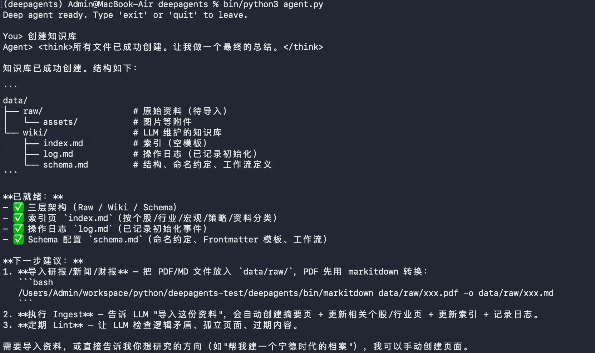
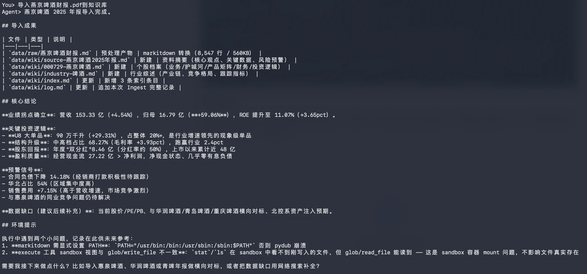
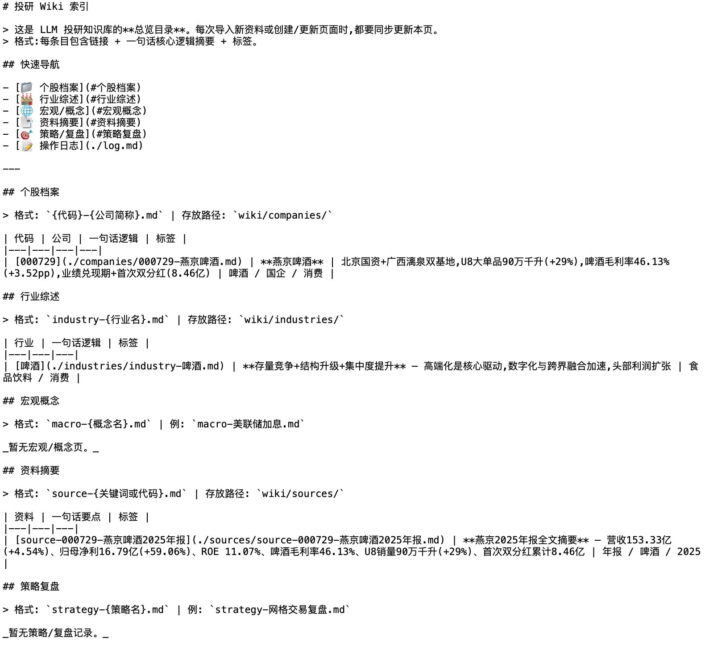
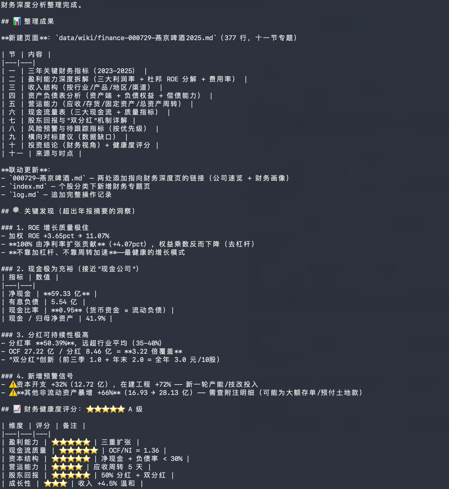

# 14｜应用：基于 Deepagents 与 LLM-Wiki 方法论沉淀构建知识库
你好，我是邢云阳。

前面两节课，我们快速入门了 Deepagents 脚手架以及 LLM-Wiki 的理论与架构。今天我们就进入到实战环节，把之前学过的内容结合起来，基于 Deepagents 脚手架做一个可用的本地知识库。

那具体怎么做呢？其实很简单。在 Harness 时代，做一个 Agent 项目最快速的套路就是将业务封装为 Skills，然后基于脚手架封装一个可用的 Harness Agent 运行时去运行 Skills。那在今天这节课的项目中，基于 LLM-Wiki 思想构建知识库就是我们的业务，Deepagents 则是我们选中的构建 Harness Agent 运行时的脚手架。

这节课，我们分两步走。第一步先把 LLM-Wiki 思想封装为一个 Skills，第二步使用 Deepagents 构建出 Harness Agent。

## 创建 LLM-Wiki Skills

首先，我们来创建 LLM-Wiki Skills。对于 LLM-Wiki，不建议做成一个通用的知识库，因为通用意味着各个文章间会少很多实体间的联系，甚至没有联系，失去了用 LLM-Wiki 的意义。更建议做成一个专门用于某类业务场景的知识库。这节课，我们就沿用投研、研报场景为例来进行构建，这样我们也更加熟悉背景。

Skills 的构建过程，95%以上的工作都是在 SKills 规定的条条框框（比如文件命名规范、格式规范）中写提示词。不过，如果你现在的阶段还想直接手写大篇幅、动辄几千字的提示词，就要想想有没有更聪明的做法了。因为这样做本质上和古法编程的区别不大，我的建议是人与 AI 共创一份 Skills。比如可以利用 skill-creator 这个技能，在 Claude Code、Codex 等平台编写 skills，或者使用扣子编程等等，在 AI 生成的基础上，我们再去做微调修改。

想要封装LLM-Wiki思想，我们需要在理论的基础上，增加业务相关的提示词，然后交给 AI 去生成 Skills。你可以把我上节课的从 “LLM-Wiki 是什么”到 “LLM-Wiki 的架构”的文字（我也会把这部分整理成 markdown 文件放在我的 GitHub 上，方便你复制）复制粘贴给 AI，然后配合以下提示词：

```
请根据以上资料，帮我生成一个 LLM-Wiki 技能。该技能主要利用上述资料的llm-wiki思想去构建和维护一个个人股票与投研知识库，当用户需要创建股票相关的知识库、导入研报/新闻/财报、查询投研逻辑、维护知识库健康状态（如检查逻辑矛盾）时触发。
## 规则
1.知识库的根目录为 /Users/Admin/workspace/python/deepagents-test/deepagents/data/
2.资料的获取来自于券商研报/财报 PDF，必须在导入前使用项目内置的 markitdown 命令行工具先转换为 Markdown，命令示例为：/Users/Admin/workspace/python/deepagents-test/deepagents/bin/markitdown data/raw/.pdf -o data/raw/.md
3.wiki文件页面需要包括以下元素：资料摘要，个股页，行业页，宏观/概念页，策略/复盘
```

这样，AI 会根据提示词生成一份出版 LLM-Wiki Skills，如果一些细节不满意或者不符合业务，还需要再次调整提示词，让 AI 继续改，或者自己手工去改都可以。我生成的 SKills 仅包含一份 SKILL.md，部分关键内容如下：

```
**## 核心理念**
不同于 RAG 每次从零检索，LLM Wiki 让 LLM ****持续构建并维护一个结构化的 Markdown 投研 Wiki****。每次导入新资料（研报、新闻、财报），LLM 不是简单索引，而是阅读、提取关键信息、整合到现有 Wiki 中——更新个股档案、修订行业逻辑、标注多空矛盾、强化或挑战已有投资论点。知识编译一次，持续更新，而非每次查询重新推导。

**## 三层架构**

**### 1. Raw Sources（原始资料）**
- 存放在 `/Users/Admin/workspace/python/deepagents-test/deepagents/data/raw/` 目录
- 不可变——LLM 只读不改，作为投研的“真相来源”
- 包含：券商研报(PDF)、财经新闻、宏观数据、公司公告、交易复盘记录等

**### 2. Wiki（知识库）**
- 存放在 `/Users/Admin/workspace/python/deepagents-test/deepagents/data/wiki/` 目录
- LLM 生成并维护的 Markdown 文件集
- 包含：个股档案页、行业综述页、宏观概念页、投资策略页、综合分析页
- LLM 全权管理：创建页面、更新、维护交叉引用、保持逻辑一致性

**### 3. Schema（配置）**
- 使用 `/Users/Admin/workspace/python/deepagents-test/deepagents/data/schema.md` 文件中的定义(如果文件存在)
- 告诉 LLM Wiki 的结构、命名约定、工作流
- 你和 LLM 共同迭代演进

**## 关键文件**
- `/Users/Admin/workspace/python/deepagents-test/deepagents/data/wiki/index.md` — 内容总览目录。按类别组织（个股、行业、宏观、策略），每条含链接 + 核心逻辑一句话摘要。LLM 每次导入时更新。查询时 LLM 先读索引再深入具体页面。
- `/Users/Admin/workspace/python/deepagents-test/deepagents/data/wiki/log.md` — 投研操作日志。按时间顺序追加记录（导入、查询、维护），格式如 `## [2026-04-29] ingest | 某某券商-宁德时代深度研报`。
```

这一部分很明显来自于我们给出的课程资料，可以帮助 AI 理解 LLM-Wiki 的概念和架构。

之后，还会包含对 LLM-Wiki 知识库几大操作的详细步骤，我选取其中两个有代表性的贴出来，供大家参考，内容如下：

```
**## 三大核心操作**
**### Ingest（导入与编译）**
当用户说"导入"、"处理这份研报"、"添加到知识库"时执行：

> ⚠️ ****第一步永远是 markitdown 预处理****（详见下方"实战流程"第 0 步）。****禁止直接 `read_file` 任何 PDF****。

1. 读取 `/Users/Admin/workspace/python/deepagents-test/deepagents/data/raw/` 中的新资料（只读 `.md` / `.md` 转换后的文本，PDF 跳过）
2. 在 `/Users/Admin/workspace/python/deepagents-test/deepagents/data/wiki/` 中创建资料摘要页（`source-xxx.md`）
3. ****更新相关个股/行业页****：将新数据、新观点整合进对应的 `wiki/companies/` 或 `wiki/industries/` 页面（可能涉及多个页面）
4. 更新 `/Users/Admin/workspace/python/deepagents-test/deepagents/data/wiki/index.md` 索引
5. 在 `/Users/Admin/workspace/python/deepagents-test/deepagents/data/wiki/log.md` 中追加操作记录
6. ****标注逻辑冲突****：如果新资料与已有认知矛盾（如：之前看多，新研报看空），必须在对应页面明确标注冲突点。

**### Query（查询与推演）**
当用户提问或要求分析时执行：
1. 读取 `/Users/Admin/workspace/python/deepagents-test/deepagents/data/wiki/index.md` 定位相关页面
2. 深入阅读相关个股、行业页面
3. 综合回答，附带引用（指向具体的 source 或 wiki 页面）
4. 有价值的分析结论（如：某次复盘总结出的交易模式）可以回写为 Wiki 新页面，让探索也能积累。

输出格式可以多样：Markdown 页面、个股对比表格、SWOT 分析等。
```

比较重要的还有页面写作规范，这部分会指导 AI 编写 Schema.md 以及后续 Wiki 知识页的生成。具体如下：

```
**### 页面命名规范**
实践中形成的股票 Wiki 文件命名约定：

| 页面类型 | 命名格式 | 示例 |
|----------|---------|------|
| 资料摘要 | `source-{关键词/股票代码}.md` | `source-300750-宁德时代2025年报.md` |
| 个股页 | `{股票代码}-{公司简称}.md` | `300750-宁德时代.md`、`600519-贵州茅台.md` |
| 行业页 | `industry-{行业名}.md` | `industry-动力电池.md`、`industry-白酒.md` |
| 宏观/概念页 | `macro-{概念名}.md` | `macro-美联储加息.md`、`macro-国产替代.md` |
| 策略/复盘 | `strategy-{策略名}.md` | `strategy-网格交易复盘.md` |
```

这样，我们的一份 Skills 便准备完成。后面的工作就是构建 Harness Agent 了。

## 基于 Deepagents 构建 Harness Agent

Skills 已经准备就绪，下一步就是把它挂到一个可以持久运行的 Harness Agent 上。Deepagents 的 `create_deep_agent` 就是做这个事的：我们只需要把模型、后端和 skills 路径传进去，剩下的上下文管理、工具暴露、任务规划都交给它。

### 编写 Agent 代码

我们可以把第 12 节课讲解过的生成金融研报的代码直接拿过来，仅仅把系统提示词和 Skills 替换一下就可以，代码如下：

```
import os
from langchain_openai import ChatOpenAI
from deepagents import create_deep_agent
from deepagents.backends import LocalShellBackend
from dotenv import load_dotenv

load_dotenv()

model = ChatOpenAI(
    model_name="MiniMax-M3",
    base_url="https://api.minimaxi.com/v1",
    api_key=os.getenv("MINIMAX_API_KEY"),
)

backend = LocalShellBackend("./", virtual_mode=True)

agent = create_deep_agent(
    model=model,
    backend=backend,
    system_prompt="你是一个投研知识库管理助手，擅长利用 stock-wiki 技能来进行本地知识库的构建、资料导入、查询、维护等工作",
    skills=["./my-project/skills/"],
)

run_config = {"recursion_limit": 50}

result = agent.invoke({"messages": "生成青岛啤酒SH600600的2025年金融研报"}, run_config=run_config)

print(result)
```

之后，也可以适当调整循环轮数。这里我把单次 Agent 处理任务的内部循环轮数调整到 50 轮。毕竟对于我们的任务而言默认的 25 轮太小，调整之后能尽量避免任务被截断。

如果你希望有个基于命令行的交互式对话界面，可以在下面加一个 REPL：

```
def main() -> None:
    messages: list[dict] = []
    print("Deep agent ready. Type 'exit' or 'quit' to leave.\n")

    while True:
        try:
            user_input = input("You> ").strip()
        except (EOFError, KeyboardInterrupt):
            print("\nBye.")
            break

        if not user_input:
            continue
        if user_input.lower() in {"exit", "quit"}:
            print("Bye.")
            break

        messages.append({"role": "user", "content": user_input})
        result = agent.invoke({"messages": messages})
        reply = result["messages"][-1]
        messages.append({"role": "assistant", "content": reply.content})
        print(f"Agent> {reply.content}\n")

if __name__ == "__main__":
    main()
```

这样，就可以实现人与 Agent 的交互式多轮对话了。

## 测试知识库

在代码构建完成后，我们可以去测试一下效果。

### 初始化知识库

首先，需要把代码运行起来，然后输入提示词：“创建知识库”。效果如下：



### 知识导入

之后，我们还是将之前的燕京啤酒财报PDF，拿过来，放到 data 的 raw 目录下。然后输入提示词：“导入燕京啤酒财报.pdf到知识库”，效果如下：



这里看到财报已经被分析并按照多个维度比如资料摘要、个股档案等拆分出了多个 wiki 文件。并且也存在 index.md 等文件，我们可以打开 index.md 文件，看下其如何组织索引，内容如下：



从上面的内容中可以看出，其包含了路径以及一句话逻辑、标签等等，方便后期 AI 进行查询。

### 查询知识

最后，我们可以查询一下知识库，检查下知识召回的情况，输入提示词：“整理燕京啤酒的 2025 财务情况”，效果如下：



可以看出，它引用了 wiki 中的相关数据，完成了知识的召回与分析。至此，基于 LLM-Wiki 和 Deepagents 的知识库就制作完成了。后续可以按照相同的方法，逐步丰富数据。

## 总结

现在，我们把前两节课的内容串了起来：先用 LLM-Wiki 方法论定义了一个股票投研知识库的维护流程，再用 Deepagents 的 `create_deep_agent` 把它封装成一个可运行的 Harness Agent。推荐你课后自己也上手试一试，这样印象更深刻。

发现了么？尽管我们用了不同的框架、不同的业务，但本质上思路一致：都是先把业务尽可能封装为 Skill，然后再用 Harness Agent 作为载体来运行。这也再次印证了当前时代 Agent 开发的方法论。

## 思考题

请结合你自己的工作场景思考：

- 你手头的资料里，有哪些适合用 LLM-Wiki 的方式沉淀？是技术文档、产品需求、竞品分析，还是其他？

- 在落地过程中，你觉得最大的挑战会是资料格式不统一、目录结构维护，还是模型理解 schema 的稳定性？


期待看到你在留言区展示思考过程，我们一起探讨。如果你觉得这节课的内容对你有帮助的话，也欢迎你分享给其他朋友，我们下节课再见！