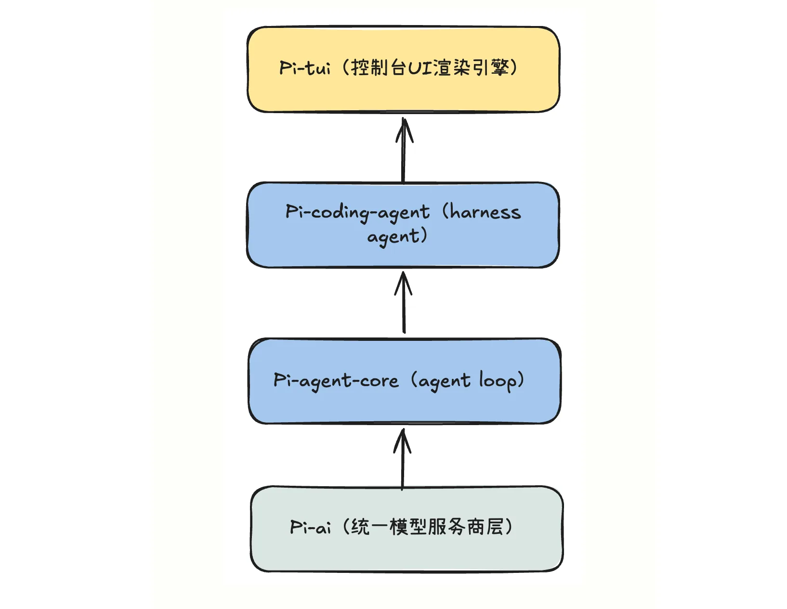
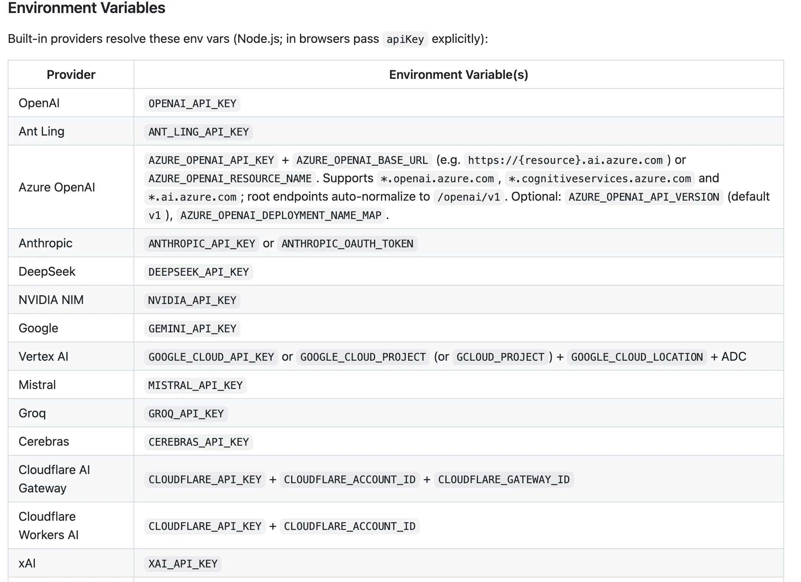
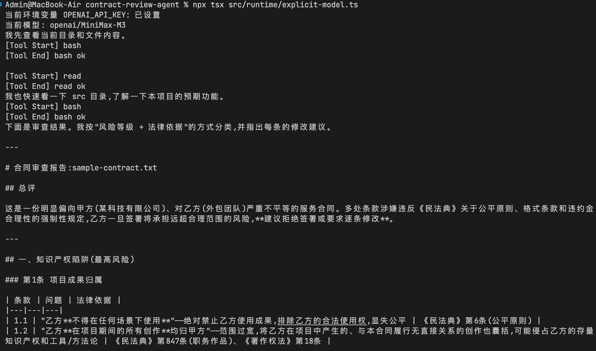

# 15｜起点：基于 pimono 打造生产级合同审查 Agent Runtime
你好，我是邢云阳。

在前面的课程中，我们学习了 Claude Agent SDK。不得不承认，Claude Agent SDK 的 Harness 工程非常成熟，上下文管理、Skills、Hooks 都提供了开箱即用的体验。但它有一个始终绕不开的痛点—— **闭源**。

这意味着你无法看到其内部实现细节，无法根据业务需求深度定制，甚至在遇到国产模型兼容性问题时只能被动等待官方修复——就像我们在第 6 讲中不得不退回到 0.1.62 版本那样。因此，在上一章，我们介绍了 Deepagents 这个脚手架，它可以部分平替 Claude Agent SDK。

除了 Deepagents，如果我们走出 Python 技术栈，TypeScript 脚手架 [**Pi-mono**](https://github.com/earendil-works/pi "") 也是非常好的选择，它是随着龙虾（OpenClaw）一起火起来的。对于 TypeScript 技术栈的 AI 开发者，选择 Pi-mono 有天然的优势：源码就在你眼前，每一层设计都清晰可扩展。

从这一讲开始，我们将开启一个全新的项目： **基于 Pi-mono 构建一个生产级合同审查 Agent**。我会以合同审查这个具体业务案例为载体，带你逐层掌握 Pi-mono 的核心机制与用法。

## 项目背景

合同审查是企业法务、采购、商务团队最高频的工作之一。一份普通的商业合同可能包含数十页文本，涉及甲乙方权利义务、违约责任、知识产权归属、争议解决等多个关键模块。传统的人工审查方式不仅耗时，而且高度依赖审查者的经验。新手法务可能漏掉隐藏条款，哪怕是资深法务也会被海量合同淹没。

更麻烦的是，合同审查并非简单的“找关键词”。同样一句话“甲方有权根据市场情况调整价格”，在采购合同里可能是正常的调价机制，在技术外包合同里却可能是不平等条款。判断风险需要结合 **合同类型、我方角色、行业惯例、具体语境** 等多重因素。

而这些挑战恰好是 Agent 擅长的领域——长文本处理。Agent 可以快速通读全文，不遗漏条款。

- 结构化输出：把非结构化的合同文本转化为风险清单、修订建议。

- 可复用规则：把法务经验沉淀为 Skill 和工具，实现标准化审查。

- 人机协同：高风险条款交给人类确认，低风险条款自动处理。


但要把这些能力落地，我们需要一个既能承载复杂业务，又足够透明的脚手架。这就是 Pi-mono 的价值所在。

## 为什么选 Pi-mono

Pi-mono 最吸引人的地方在于它的 **工程分层**。不像一些把所有功能揉在一起的框架，Pi-mono 把 Agent 能力拆成了几个职责清晰的包（稍后展开说）。你既可以直接使用高层的 pi-coding-agent 快速获得一个开箱即用的 Harness Agent，也可以下沉到 pi-agent-core 甚至 pi-ai 来做自由定制。

这种分层带来两个直接好处：

第一， **可审计**。闭源框架出了问题你只能猜，而 Pi-mono 的源码就在本地，你可以一行行跟进去看 Agent Loop 是怎么调 LLM 的、工具是怎么执行的、事件是怎么流转的。

第二， **可替换**。如果你发现默认的上下文压缩策略不适合合同审查场景，可以直接替换。

## Pi-mono 的分层设计

Pi-mono 的核心包按照从底到上的顺序可以分成四层。



**第一层是 pi-ai**，也就是统一 AI 层。它负责屏蔽不同 LLM Provider 的差异。无论是 Anthropic、OpenAI、Google 还是 Bedrock，在 Pi-mono 里都使用同一套 Model、Context、Message 抽象。你只需要提供模型配置和 API key，剩下的流式输出、工具调用格式、参数校验都由这一层处理。

对于合同审查项目，这一层让我们可以轻松切换模型。比如日常审查用成本较低的模型做初筛，遇到复杂条款时再切换到更强的模型做深度分析，而业务代码几乎不用改。

这点可以说是 Pi-mono 中做得让人最舒服的一点，其他框架比如 Deepagents 等，都做不到这种跨协议的统一性。

**第二层是 pi-agent-core**，这是真正的 Agent 运行时。它提供了 Agent 类和 AgentLoop，管理状态、订阅事件、执行工具、处理 steering 和 followUp。这一层的核心是 **事件驱动模型**：Agent 的每一次状态变化都会以事件的形式发出，UI 层和扩展层通过订阅这些事件来更新界面或拦截行为。

**第三层是 pi-coding-agent**，这是面向应用开发者的 SDK 层。它在 Agent 之上封装了 AgentSession，帮你处理会话持久化、上下文压缩、自动重试、扩展加载、内置工具集等工程细节。对大多数业务场景来说，直接基于这一层开发就够了。

**第四层是 pi-tui**，终端 UI 渲染引擎。它用差分渲染技术让终端界面像浏览器一样流畅，支持自定义组件、对话框、选择器等。后续我们会用它来优化合同审查的终端交互体验。

理解了这个分层，你就知道遇到问题时该往哪一层找答案：模型调用问题看 `pi-ai`，循环逻辑问题看 `pi-agent-core`，业务封装问题看 `pi-coding-agent`，界面问题看 `pi-tui`。

## 统一 AI 层对多 Provider 的抽象

在正式写代码之前，我们需要先理解 Pi-mono 是如何抽象不同 LLM Provider 的。

在 `pi-ai` 中，一个模型由 `Model` 对象描述：

```
interface Model {
  id: string;           // 模型 ID，如 claude-sonnet-4
  name: string;         // 显示名称
  api: Api;             // API 类型，如 "anthropic-messages"
  provider: string;     // Provider 名称
  baseUrl: string;      // 基础 URL
  reasoning: boolean;   // 是否支持思考/推理
  input: ("text" | "image")[];
  cost: { input: number; output: number; cacheRead: number; cacheWrite: number };
  contextWindow: number;
  maxTokens: number;
}
```

`api` 字段是关键。它告诉 `pi-ai` 该用哪种协议与模型通信。Pi-mono 内置了 `anthropic-messages`、 `openai-responses`、 `openai-completions`、 `google-generative-ai`、 `bedrock-converse-stream` 等多种 API 实现。如果你要接入私有模型，可以自己实现一个 `StreamFn`，只要返回符合协议的 `AssistantMessageEventStream` 即可。

`streamSimple` 是 `pi-ai` 提供的一个高层函数，它会根据 `model.api` 自动路由到对应的实现。我们在后面会直接使用它。

## Agent 事件驱动模型

Pi-mono 最值得深入理解的是它的事件驱动模型。

传统的 Agent 框架大多是"函数调用式"的：你调用一个函数，它返回结果，然后你决定下一步做什么。而 Pi-mono 的 Agent 是 **流式事件式** 的：你发起一个 prompt，Agent 会在整个运行过程中不断 emit 事件，你可以订阅这些事件来观察、记录、干预。

一个典型的运行周期会发出这样的事件序列：

```
agent_start
  turn_start
    message_start (user)
    message_end (user)
    message_start (assistant)
    message_update (assistant 流式输出)
    message_end (assistant)
    tool_execution_start
    tool_execution_end
    message_start (toolResult)
    message_end (toolResult)
  turn_end
agent_end
```

这里有几个关键设计：

- **turn**：一次 assistant 回复 + 它触发的所有工具调用/结果构成一个 turn。合同审查中，一个 turn 可能对应“模型读取合同 → 识别风险 → 调用工具提取条款 → 生成修改建议”的整个对话过程。

- **message\_update**：只在 assistant 消息流式输出时发出，适合做实时的打字机效果。

- **tool\_execution\_start/end**：工具执行的生命周期事件，我们可以在这里做审计、拦截、进度展示。

- **agent\_end**：整个 prompt 运行结束。注意它不代表所有后台监听器结束，只是不再触发新事件。


这种事件模型让 UI、扩展、日志、安全护栏都能以统一的方式介入 Agent 运行。相比在 Agent 内部硬编码各种逻辑，事件驱动让系统更松耦合、更容易扩展。

## 理解 AgentSession 与 Agent 的关系

最后，我们要厘清两个容易混淆的概念： `AgentSession` 和 `Agent`。

`Agent` 来自 `@earendil-works/pi-agent-core`，是底层的 Agent 运行时。它只关心一个问题：给定一个 system prompt、一组 messages、一组 tools，如何与 LLM 循环交互。

`AgentSession` 来自 `@earendil-works/pi-coding-agent`，是高层封装。它在 `Agent` 之上增加了：

- 会话持久化（把 messages 写入本地 session 文件）

- 上下文压缩（ `compact()`）

- 自动重试

- 扩展系统绑定

- 默认工具集管理

- steering / followUp 队列


在业务代码中，我们通常直接操作 `AgentSession`，只有在需要深度定制循环行为时才会接触 `Agent`。

你可以通过 `session.agent` 访问底层 `Agent`：

```
console.log(session.agent.state.tools.map((t) => t.name));
console.log(session.agent.state.messages.length);
```

这种设计再一次体现了 Pi-mono 的分层思想：高层足够便利，底层也随时可达。

## 代码实战

好，理论铺垫告一段落，我们开始动手环节。

### 环境搭建

首先创建项目目录：

```
mkdir contract-review-agent
cd contract-review-agent
npm init -y
```

安装 Pi-mono 核心包：

```
npm install @earendil-works/pi-coding-agent
```

由于 Pi-mono 本身是用 TypeScript 写的，并且使用 Node 的 strip-types 模式运行，所以我们不需要配置复杂的 tsconfig。但为了类型提示，建议安装 TypeScript 和 Node 类型：

```
npm install -D typescript @types/node
```

然后在项目根目录创建 `.env` 文件，配置模型 API key。这里以 OpenAI 端点为例：

```
OPENAI_API_KEY=sk-...
```

使用其他模型，需要在 [这里](https://github.com/earendil-works/pi/tree/main/packages/ai#supported-providers "") 查看一下支持的模型供应商以及如何设置环境变量。也就是看这个表：



这里我贴了一部分，大家需要可以点击 [超链接](https://github.com/earendil-works/pi/tree/main/packages/ai#supported-providers "") 具体了解，基本上主流模型都覆盖了。

### 想用的模型不在支持列表中怎么办？

你可能想问，万一有一些冷门模型，不在 Pi 的支持列表中？其实只要它支持 OpenAI 兼容接口，同样可以用。Pi-mono 的 `pi-ai` 层会自动处理协议差异。只不过代码会麻烦一点，比如如果正常支持的模型，在代码中可以这样写：

```
const { session } = await createAgentSession({
    model: getModel("openai", "gpt-4o"),
    thinkingLevel: "medium",
    cwd: process.cwd(),
});
```

重点是第 2 行，直接用字符串方式设置模型供应商和模型 id 就可以了。

但如果是不在模型支持列表中的，但又能兼容 OpenAI 的，那在环境变量 OPENAI\_API\_KEY 填入你所使用的模型的 API Key 的前提下，可以通过以下代码进行实现。我以 MiniMax 为例做后续讲解，不过这里仅仅是演示，因为 MiniMax 本身也是 Pi 支持的模型供应商。代码如下：

```
const minimaxiModel = {
  id: "MiniMax-M3",
  name: "MiniMax M3",
  api: "openai-responses",
  provider: "openai",
  baseUrl: "https://api.minimaxi.com/v1",
  reasoning: false,
  input: ["text"],
  cost: { input: 0, output: 0, cacheRead: 0, cacheWrite: 0 },
  contextWindow: 128000,
  maxTokens: 8192,
} satisfies Model<"openai-responses">;

const { session, modelFallbackMessage } = await createAgentSession({
    cwd: process.cwd(),
    model: minimaxiModel,
    thinkingLevel: "medium",
  });
```

以上代码通过构建一个支持 OpenAI 的 responses API 的 model 结构来定义模型参数。需要重点关注的以下几行代码中的参数。

第 2 行的 id 就是模型的id，这里要按照模型供应商官方给出的 id来填，不能填错。

第 3 行的 name，随便填，写abc也可以。

第4行的 api 要重点关注，因为此处用的是 OpenAI 最新的对话 API，也就是 responses。如果你的模型供应商不支持，则需要改为使用支持 completions API 的代码（参考代码在后面我也提供了）。

第 5 行，由于使用的是兼容 openai 的协议，因此供应商需要填openai。

第 6 行，填入你的模型供应商的 openai 兼容端点地址。

除此之外，其他的就没什么了。下面给出支持completions API 的代码：

```
const minimaxiModel = {
  id: "MiniMax-M3",
  name: "MiniMax M3",
  api: "openai-completions",
  provider: "openai",
  baseUrl: "https://api.minimaxi.com/v1",
  reasoning: false,
  input: ["text"],
  cost: { input: 0, output: 0, cacheRead: 0, cacheWrite: 0 },
  contextWindow: 128000,
  maxTokens: 8192,
} satisfies Model<"openai-completions">;
```

相比上面的代码，除了第 4 行和第 12 行，什么都不需要改。

### 最小 Agent Runtime 代码

环境和模型就绪后，我们写一个最小的 Runtime。在 `src/runtime/minimal.ts` 中：

```
import { createAgentSession } from "@earendil-works/pi-coding-agent";
import "dotenv/config";

async function main() {
  const { session } = await createAgentSession({
    model: getModel("openai", "gpt-4o"),
    thinkingLevel: "medium",
    cwd: process.cwd(),
  });

  session.subscribe((event) => {
    if (event.type === "message_update" && event.assistantMessageEvent.type === "text_delta") {
      process.stdout.write(event.assistantMessageEvent.delta);
    }

    if (event.type === "tool_execution_start") {
      console.log(`\n[Tool Start] ${event.toolName}`);
    }

    if (event.type === "tool_execution_end") {
      console.log(`[Tool End] ${event.toolName} ${event.isError ? "failed" : "ok"}`);
    }
  });

  await session.prompt(
    "请审查当前目录下的 sample-contract.txt，识别其中的不平等条款、违约责任失衡和知识产权陷阱。"
  );
}

main().catch(console.error);
```

这段代码虽然短，但已经覆盖了一个生产级 Runtime 的核心要素：

- `createAgentSession()`：自动完成模型解析、API key 获取、默认工具加载、扩展发现、会话初始化。

- `session.subscribe()`：订阅事件流。这里我们只处理了 `message_update` 和工具执行事件，后续可以根据需要增加更多处理。

- `session.prompt()`：发送用户消息，触发一个完整的 Agent Run。


注意第 3 行 `import "dotenv/config"`，它会把 `.env` 文件中的环境变量加载到 `process.env` 中。 `createAgentSession` 会通过 `pi-ai` 的 auth 机制自动读取 `OPENAI_API_KEY`。

另外第 6 行的 `getModel` 会根据 provider 和 model id 返回一个 `Model` 对象。Pi-mono 会负责把它路由到正确的 API 实现上。

最后顺带提一下第 7 行的 `thinkingLevel`。Pi-mono 支持 off、minimal、low、medium、high、xhigh、max 多种推理强度，对于合同审查这种需要深度推理的任务，建议至少选 `medium`。Pi-mono 会根据模型能力自动适配到该模型支持的范围，避免你传了一个模型不支持的级别导致报错。

### 运行效果

实现代码后，我们看看效果。先在项目根目录放一个 `sample-contract.txt`，里面写一段简单的合同文本：

```
技术服务合同

甲方：某科技有限公司
乙方：某外包团队

1. 项目成果归甲方所有，乙方不得在任何场景下使用。
2. 甲方有权根据市场情况调整服务价格，乙方应予配合。
3. 乙方延迟交付每日罚款合同金额的 1%，甲方延迟付款不承担责任。
4. 争议由甲方所在地人民法院管辖。
```

运行：

```
npx tsx src/runtime/minimal.ts
```

你会看到终端开始流式输出审查结果，中间如果模型调用了 `read` 工具读取文件，还会打印 `[Tool Start] read` 和 `[Tool End] read ok`。



返回的内容虽然看起来简单，但它已经是一个可以工作的合同审查 Agent Runtime：能读文件、能流式回复、能显示工具调用。后面几讲我们会逐步在这个骨架上增加解析工具、风险分类、长上下文处理、安全护栏和 UI，敬请期待。

## 总结

这节课我们从 Claude Agent SDK 闭源的痛点出发，引出了开源的 Pi-mono 脚手架，并以合同审查为业务场景，初步了解了 Pi-mono 的四层架构：

- `pi-ai` 统一多 Provider 的模型调用；

- `pi-agent-core` 提供事件驱动的 Agent 运行时；

- `pi-coding-agent` 封装出可直接使用的 `AgentSession`；

- `pi-tui` 负责终端 UI 渲染。


我们还动手写了一个最小可运行的合同审查 Agent Runtime，虽然只有几十行代码，但它已经具备了读文件、流式输出、工具调用观察等核心能力。下一节课，我们将在它之上加入合同解析工具和风险分类工具，让 Agent 真正开始“看懂”合同。

## 思考题

如果让你设计一个需要实时展示工具执行进度的合同审查 UI，你认为 Pi-mono 事件驱动模型会给你带来哪些便利？

欢迎你在留言区展示你的思考过程，我们一起探讨。如果你觉得这节课的内容对你有帮助的话，也欢迎你分享给其他朋友，我们下节课再见！