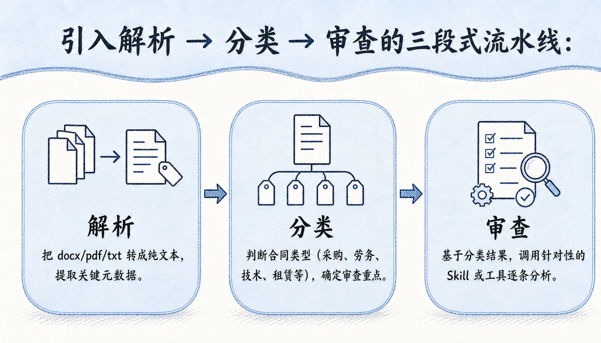
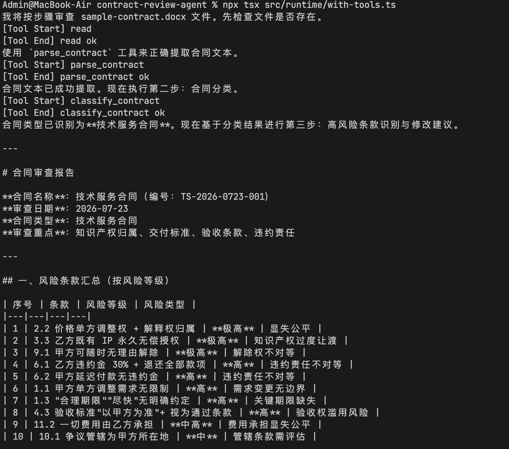

# 16｜基础：统一工具接口与结构化输出实现合同文档解析与分类
你好，我是邢云阳。

上节课我们跑通了基于 Pi-mono 的最小合同审查 Agent Runtime。虽然它只能读取一个 txt 文件，风险识别方面做得也很简单，但已经具备了一个生产级 Agent 最核心的骨架：模型调用、事件订阅、工具执行。

从这节课开始，我们要让这个 Agent 真正“看懂”合同。合同审查的第一步不是直接问大模型“这份合同有没有风险”，而是先把 **非结构化的合同文件转化为结构化的信息**：它是什么类型的合同？涉及哪些关键条款？哪些部分需要重点审查？只有把这些问题搞清楚，后续的 LLM 推理才能有的放矢。

今天我们就围绕两个核心能力展开： **合同文档解析** 与 **合同风险分类**。在这个过程中，你会掌握 Pi-mono 统一工具接口的设计方式，以及如何用结构化输出来提升 Agent 的可控性。

## 为什么需要先解析和分类

很多初学者做合同审查 Agent 时，容易犯一个错误：直接把整个合同文件的内容一次性塞进 prompt，然后让模型自己分析。这种方式在小合同上可能还能用，但遇到几十页甚至上百页的商业合同，问题立刻暴露。

第一， **上下文浪费严重**。合同中大量内容是标准套话，比如“鉴于甲乙双方本着平等互利原则”“根据xx法”等，这些文字对风险识别帮助不大，却占用了宝贵的 Token。

第二， **模型注意力分散**。一份长合同里既有通用条款也有关键条款，如果没有引导，模型很难把推理资源集中在真正重要的部分。

第三， **输出不可控**。直接问“有什么风险”，模型可能给出一段散文式的回答，难以和后续的报告生成、修订建议等环节对接。



更好的做法是引入 **解析 → 分类 → 审查** 的三段式流水线：

- **解析**：把 docx/pdf/txt 转成纯文本，提取关键元数据。

- **分类**：判断合同类型（采购、劳务、技术、租赁等），确定审查重点。

- **审查**：基于分类结果，调用针对性的 Skill 或工具逐条分析。


## Pi-mono 的工具理论

这节课我们先实现前两个环节（解析和分类）。这两个环节都需要靠工具来实现，因此我们先来学习一下 Pi-mono 中如何定义工具。

### 内部工具与外部工具

在 Pi-mono 中，工具分为两类： **内部工具** 和 **外部工具**。

内部工具是 `pi-coding-agent` 自带的通用工具，包括 `read`、 `bash`、 `edit`、 `write`、 `grep`、 `find`、 `ls` 等。这些工具在 `createAgentSession` 时默认就已经加载到 Agent 中，不需要你额外注册。它们的特点是通用性强，适合处理文件、执行命令、搜索文本等基础操作。

外部工具则是你根据业务需求自己定义的工具，比如“解析合同”“分类合同”“生成审查报告”等。外部工具通过 `defineTool` 函数注册，并作为 `customTools` 传入 `createAgentSession`。

这种设计，与我们前面学习的 Claude Agent SDK 与 Deepagents 的设计思路是一致的。

对于我们这个项目，内置的 `read` 工具已经能读取文本文件，但 docx 和 pdf 需要额外解析。所以我们需要定义两个外部工具： `parse_contract` 和 `classify_contract`。

### 统一工具接口

在写工具之前，我们需要理解 Pi-mono 的统一工具接口长什么样。

一个工具定义必须包含以下字段：

- **name**：工具名称，LLM 通过这个名字调用工具。必须是唯一、简洁、描述性强的英文标识符。

- **label**：人类可读的标签，用于 UI 展示。

- **description**：工具描述，这是 LLM 决定是否调用这个工具的重要依据。描述要清楚说明工具的用途、适用场景和参数含义。

- **parameters**：参数 schema，使用 TypeBox 定义。Pi-mono 会用它做参数校验。

- **execute**：工具执行函数。接收 toolCallId、参数、signal、onUpdate 和 ctx，返回 `AgentToolResult`。


`AgentToolResult` 的结构是：

```
{
  content: TextContent | ImageContent[];  // 返回给 LLM 看的文本或图片
  details: unknown;                        // 结构化数据，给 UI 或后续逻辑用
  usage?: Usage;                           // 可选的 token 用量
}
```

这里有一个关键设计： `content` 是给大模型看的，通常是简短文字； `details` 是给程序用的，可以是任意结构化对象。这种分离很有必要，既能给模型提供简洁反馈，又能保留完整数据供后续处理。

## 实现自定义工具

### 安装解析依赖

在理解了结构之后，我们来实现自定义工具。首先安装文件解析依赖：

```
npm install mammoth pdf-parse
```

`mammoth` 用于解析 Word 文档， `pdf-parse` 用于解析 PDF。txt 文件直接用 Node.js 内置的 `fs` 读取即可。

### 实现合同解析工具

之后，我们来实现合同解析工具，代码如下：

```
import { defineTool } from "@earendil-works/pi-coding-agent";
import { Type } from "typebox";
import { promises as fs } from "node:fs";
import path from "node:path";
import mammoth from "mammoth";
import pdfParse from "pdf-parse";

export const parseContractTool = defineTool({
  name: "parse_contract",
  label: "解析合同",
  description: "解析 Word/PDF/文本合同，提取纯文本和基础元数据（文件名、格式、字符数）。",
  parameters: Type.Object({
    filePath: Type.String({ description: "合同文件路径，支持 .docx/.pdf/.txt" }),
  }),
  async execute(_toolCallId, { filePath }) {
    const ext = path.extname(filePath).toLowerCase();
    let text = "";

    if (ext === ".docx") {
      const buffer = await fs.readFile(filePath);
      const result = await mammoth.extractRawText({ buffer });
      text = result.value;
    } else if (ext === ".pdf") {
      const buffer = await fs.readFile(filePath);
      const result = await pdfParse(buffer);
      text = result.text;
    } else if (ext === ".txt") {
      text = await fs.readFile(filePath, "utf-8");
    } else {
      throw new Error(`不支持的文件格式: ${ext}`);
    }

    return {
      content: [
        {
          type: "text",
          text: `已解析 ${path.basename(filePath)}，格式 ${ext}，共 ${text.length} 个字符。`,
        },
      ],
      details: {
        filePath,
        fileName: path.basename(filePath),
        format: ext,
        charCount: text.length,
        text,
      },
    };
  },
});
```

这个工具做了几件事：

1. 根据文件扩展名选择解析方式。

2. 把解析后的纯文本放在 `details.text` 中，供后续工具和 LLM 使用。

3. 把简洁的摘要信息放在 `content` 中返回给 LLM，避免一次性把全文塞进模型上下文。


### 实现合同分类工具

接下来实现 `classify_contract` 工具。它的作用是根据合同文本判断合同类型，并给出审查重点。

```
import { defineTool } from "@earendil-works/pi-coding-agent";
import { Type } from "typebox";

const CONTRACT_TYPES = [
  "技术服务",
  "采购供货",
  "劳务用工",
  "房屋租赁",
  "股权投资",
  "保密协议",
  "合作协议",
  "其他",
] as const;

export const classifyContractTool = defineTool({
  name: "classify_contract",
  label: "合同分类",
  description: "根据合同文本判断合同类型，并给出该类合同的典型审查重点。",
  parameters: Type.Object({
    text: Type.String({ description: "合同文本的前 3000 个字符或关键片段" }),
  }),
  async execute(_toolCallId, { text }) {
    const sample = text.slice(0, 3000);

    // 启发式分类：实际生产环境中可以让 LLM 调用此工具时由模型判断，
    // 这里提供一个快速兜底规则，避免短文本时过度依赖模型推理。
    const type = detectType(sample);
    const focusAreas = getFocusAreas(type);

    return {
      content: [
        {
          type: "text",
          text: `合同类型：${type}。审查重点：${focusAreas.join("、")}。`,
        },
      ],
      details: {
        type,
        focusAreas,
        sampleLength: sample.length,
      },
    };
  },
});

function detectType(text: string): string {
  const t = text.toLowerCase();
  if (t.includes("技术服务") || t.includes("开发") || t.includes("交付物") || t.includes("源代码")) return "技术服务";
  if (t.includes("采购") || t.includes("供货") || t.includes("买卖") || t.includes("货款")) return "采购供货";
  if (t.includes("劳务") || t.includes("用工") || t.includes("劳动合同") || t.includes("工资")) return "劳务用工";
  if (t.includes("租赁") || t.includes("房屋") || t.includes("租金") || t.includes("房东")) return "房屋租赁";
  if (t.includes("股权") || t.includes("投资") || t.includes("增资") || t.includes("估值")) return "股权投资";
  if (t.includes("保密") || t.includes("机密") || t.includes("泄露")) return "保密协议";
  if (t.includes("合作") || t.includes("框架协议") || t.includes("战略合作")) return "合作协议";
  return "其他";
}

function getFocusAreas(type: string): string[] {
  const map: Record = {
    技术服务: ["知识产权归属", "交付标准", "验收条款", "违约责任"],
    采购供货: ["付款条件", "交货期限", "质量标准", "退换货条款"],
    劳务用工: ["劳动关系", "保密义务", "竞业限制", "解除条件"],
    房屋租赁: ["租金支付", "押金退还", "维修责任", "提前解约"],
    股权投资: ["估值调整", "对赌条款", "股东权利", "退出机制"],
    保密协议: ["保密范围", "保密期限", "违约责任", "例外情形"],
    合作协议: ["合作范围", "收益分配", "知识产权", "退出机制"],
    其他: ["权利义务平衡", "违约责任", "争议解决", "合同期限"],
  };
  return map[type] ?? map["其他"];
}
```

这个工具的核心是 `details`：它返回了 `type` 和 `focusAreas`。后续我们可以根据 `type` 决定调用哪个 Skill，根据 `focusAreas` 引导 LLM 关注特定风险。

你可能会问：分类这么简单，为什么不直接让 LLM 判断，还要写个工具？

原因是 **确定性和成本控制**。对于格式相对固定的合同，启发式规则可以快速、零成本地给出分类；只有当规则不确定时，才需要 LLM 介入。 **这种** **“** **规则兜底 \+ LLM 增强** **”** **的混合模式，是生产级 Agent 的常见做法。**

## 把工具注册到 Agent

定义好工具后，需要把它们注册到 Agent 中。代码如下：

```
import { createAgentSession } from "@earendil-works/pi-coding-agent";
import "dotenv/config";
import { parseContractTool } from "../tools/contract-parser.js";
import { classifyContractTool } from "../tools/risk-classifier.js";

async function main() {
  const { session } = await createAgentSession({
    cwd: process.cwd(),
    customTools: [parseContractTool, classifyContractTool],
    tools: ["read", "parse_contract", "classify_contract"],
  });

  session.subscribe((event) => {
    if (event.type === "message_update" && event.assistantMessageEvent.type === "text_delta") {
      process.stdout.write(event.assistantMessageEvent.delta);
    }

    if (event.type === "turn_end") {
      const msg = event.message as any;
      if (msg.errorMessage) {
        console.error(`\n[模型错误] ${msg.stopReason}: ${msg.errorMessage}`);
      }
    }

    if (event.type === "tool_execution_start") {
      console.log(`\n[Tool Start] ${event.toolName}`);
    }

    if (event.type === "tool_execution_end") {
      console.log(`[Tool End] ${event.toolName} ${event.isError ? "failed" : "ok"}`);
    }
  });

  await session.prompt(
    "请按以下步骤审查 sample-contract.txt：\n" +
      "1. 使用 parse_contract 解析合同文件；\n" +
      "2. 使用 classify_contract 对合同进行分类；\n" +
      "3. 基于分类结果，识别该类型合同的高风险条款并给出修改建议。"
  );
}

main().catch((err) => {
  console.error("[运行错误]", err);
  process.exit(1);
});
```

这里有几个关键点：

- **customTools**：传入我们自己定义的工具。

- **tools**：显式声明哪些工具启用。如果省略，Pi-mono 默认启用内置工具，并自动启用所有自定义工具。显式声明可以让我们精确控制工具集。

- **Prompt 里明确步骤**：让 Agent 按“解析 → 分类 → 审查”的顺序执行，而不是让它自由发挥。


## 结构化输出

前面我们提到，工具返回的 `details` 可以携带结构化数据。这就是 Pi-mono 里实现结构化输出的一种重要方式。

以 `parse_contract` 为例，它的 `details` 包含了：

```
{
  filePath: string;
  fileName: string;
  format: string;
  charCount: number;
  text: string;
}
```

这些结构化数据可以被后续工具或扩展使用。例如，我们可以写一个扩展，在 `tool_execution_end` 事件里读取 `details`，把解析结果保存到数据库，或者根据 `charCount` 决定是否触发分块审查。

除了工具 `details`，结构化输出还可以通过后面这两种方式实现。

**方式一：要求 LLM 返回 JSON**

在 prompt 中明确要求模型返回 JSON：

```
请输出以下 JSON 格式：
{
  "contractType": "技术服务",
  "risks": [
    {"level": "high", "type": "知识产权", "clause": "...", "suggestion": "..."}
  ]
}
```

**方式二：用 TypeBox 定义输出 schema**

对于更复杂的场景，可以定义一个返回 JSON 的工具，让模型调用该工具时自动填充参数。Pi-mono 会用 TypeBox 校验参数，本质上就是把"结构化输出"变成"带 schema 的工具调用"。

对于合同审查项目，推荐组合使用：

- `classify_contract` 返回 `details.type` 结构化数据。

- 后续审查工具要求 LLM 返回 JSON 数组形式的风险清单。

- 扩展层读取 `details`，生成最终的审查报告。


## 运行效果

安装依赖并运行后面的命令。

```
npm install mammoth pdf-parse
npx tsx src/runtime/with-tools.ts
```

Agent 会依次调用 `parse_contract` 和 `classify_contract`，然后基于分类结果输出风险识别和修改建议。你可以在终端看到工具调用的开始/结束标记，以及流式的审查结果。



## 总结

这节课，我们在最小 Runtime 的基础上，引入了合同审查的核心工具链。

- **合同解析工具**：支持 docx/pdf/txt，把非结构化文件转成结构化文本。

- **合同分类工具**：基于启发式规则判断合同类型，确定审查重点。

- **统一工具接口**：理解了 name/label/description/parameters/execute 的设计。

- **结构化输出**：通过 details 字段传递程序可用的数据。


这些工具虽然简单，但已经让 Agent 从“随便看看”升级为“按流程、有重点地审查”。下一节课，我们会处理一个更现实的问题：当合同很长时，如何避免上下文溢出，又如何对大合同做分块审查和风险量化。

## 思考题

在 `parse_contract` 工具中，我们选择把完整文本放在 `details.text` 中，而不是直接返回给 LLM。你认为这种“元数据给 LLM，完整数据给程序”的设计，在哪些场景下特别有价值？它和 Claude Agent SDK 中把大工具结果写入文件，只返回路径的做法有什么异同？

欢迎你在留言区展示你的思考过程，我们一起探讨。如果你觉得这节课的内容对你有帮助的话，也欢迎你分享给其他朋友，我们下节课再见！