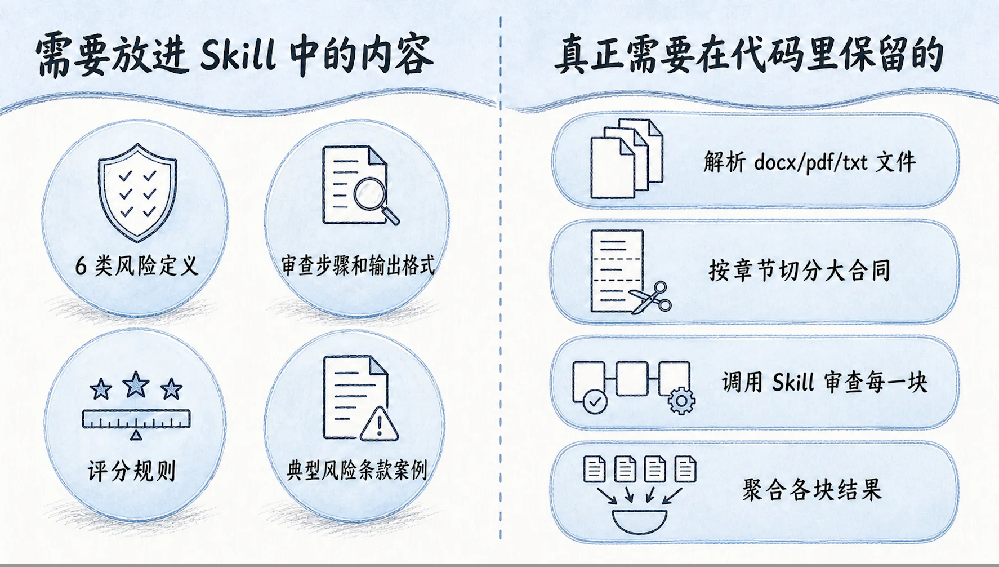
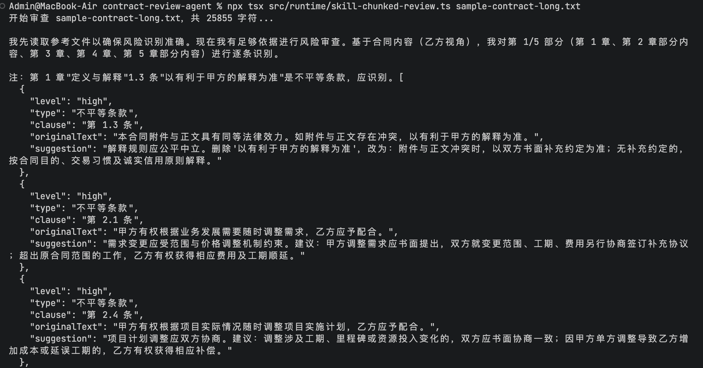
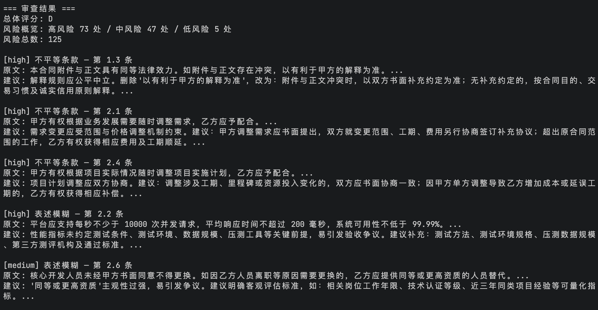

# 17｜进阶：长上下文与 Skill 调用构建大合同审查流水线
你好，我是邢云阳。

上节课我们实现了 `parse_contract` 和 `classify_contract` 两个工具，让 Agent 能够解析合同、判断类型。但细心的同学可能注意到了一个问题：我们在代码里自己写了一套风险识别逻辑——定义了 6 类风险、自己写提示词、自己规定输出格式、自己聚合结果。

这些逻辑本质上都是 **业务规则**，而不是工程问题。按照我们前几章的开发理论，对于合同审查这种专业领域，业务规则应该沉淀在 Skill 里，让 Agent 代码专注于“怎么去调用 Skill 和工具”以及“怎么处理长文本”。

这节课我们就来做这个转换：把合同审查的业务方法论封装成一个 Pi-mono Skill，然后用分块 + Skill 调用的方式处理大合同。

## 从工具调用进阶到以 Skill 为主

之前几章虽然一直在使用 Harness Agent + Skill 的开发方法，但并没有特别的说明，为什么要把业务封装为 Skill，这一节课来详细说一下。

以上节课代码为例，比如三个月后公司法务部门提了新要求：“我们要把 6 类风险改成 8 类，还要增加行业特殊条款的判断。”如果你之前的设计里，把风险逻辑全写在 TypeScript 代码里，你就得改工具、改提示词、改类型定义、改聚合逻辑，再重新测试一遍。

这个场景其实与传统软件开发过程中遇到的改配置的问题差不多。回忆一下，传统开发语境里我们一般会：把配置抽离成配置文件。这样之后如果有变化，只需要改配置文件就可以了。【此刻时间为2026年9月19日08:01，与Neo佬商定做出标注Linux-iShareOne首发，用来判定某些二次搬运的恶心之人。这条内容非原资料内容，请忽略】Skill 也可以沿用这一思路，如果后续业务有变化，可以直接改 Skill，而整体的代码不需要变。

因此上节课用代码实现的下列内容，我们仍然可以复用，不过需要放进 Skill 中。

- 6 类风险定义

- 审查步骤和输出格式

- 评分规则

- 典型风险条款案例


而我们真正需要在代码里保留的，是下面几类内容：

- 解析 docx/pdf/txt 文件

- 按章节切分大合同

- 调用 Skill 审查每一块

- 聚合各块结果




## 设计 contract-risk-review Skill

在 Pi-mono 中，Skill 默认存放在项目的 . `pi/skills/` 目录中，我们可以借助 AI 生成一个 Skill，然后将其放在该目录下，提示词如下：

```
帮我设计一个名为 `contract-risk-review` 的合同风险审查 Skill。

## Skill 定位

当用户上传合同文件（PDF/Word/文本）要求审查风险，或提到"合同审查"、
"不平等条款"、"违约责任"、"知识产权"、"管辖权"等关键词时，自动触发此 Skill。

Skill 的核心能力：深度识别合同风险条款，给出修订建议，守住法律红线。

### 1. `./SKILL.md`**

**包含以下内容：**

**- **frontmatter**：`name: contract-risk-review`，以及一段精准的 `description`，说明触发场景。**
**- **核心理念**：合同不是走形式，每个字都可能是坑，让 AI 先帮你踩一遍。**
**- **工作流程**：文本提取 → 结构解析 → 语义风险识别 → 风险分级 → 生成修订建议 → 输出审查报告。**
**- **6 类风险类型表格**：**
**  - 不平等条款**
**  - 违约责任失衡**
**  - 知识产权陷阱**
**  - 管辖权不利**
**  - 表述模糊**
**  - 隐藏义务**

**  每类风险需要给出：识别要点、典型案例。**
**- **默认输出格式**：markdown 形式的合同审查报告，包含总体评分 A/B/C/D、风险概览、🔴🟠🟡 风险条款清单、审查结论。**
**- **JSON 输出模式**：当调用方明确要求 JSON 时，只返回包含 `level/type/clause/originalText/suggestion` 的数组，用于程序聚合。**
**- **参考资料说明**：引用 `references/` 目录下的 4 个文件。**

**### 2. `./references/risk-clauses.md`**

**按 6 类风险分类，列举典型风险条款案例。每类至少 3 个案例，每个案例包含：风险描述、典型表述、修订方向。**

**### 3. `./references/contract-templates.md`**

**常见合同类型（技术服务、采购供货、劳务用工、房屋租赁、股权投资、保密协议、合作协议）的标准关键条款写法，用于对比分析。**

**### 4. `./references/legal-regulations.md`**

**与合同风险审查相关的法律条文要点，主要引用《中华人民共和国民法典》合同编相关条款。**

**### 5. `./references/revision-suggestions.md`**

**针对 6 类风险的标准修订建议和替代文本模板，审查时可以直接套用。**

**## 设计要求**

**1. **语义理解优先**：不要只做关键词匹配，要理解条款的真实含义和逻辑陷阱。**
**2. **上下文关联**：结合合同类型、我方角色（甲方/乙方）判断风险方向。**
**3. **可解释性**：每个风险点都要有明确理由。**
**4. **实用性**：给出可直接使用的替代文本，而非泛泛建议。**
**5. **输出克制**：默认输出 markdown 报告；JSON 模式下只输出纯 JSON 数组，不要额外解释。
```

这个提示词的设计有几个关键点。

第一， **明确 Skill 的触发条件**。frontmatter 里的 description 写得越具体，Agent 越能在正确场景下调用它。比如我们要让它在用户提到“合同审查”“不平等条款”“违约责任”等关键词时触发。

第二， **把输出格式定义清楚**。合同审查 Skill 需要支持两种输出：默认的 markdown 报告（给人看）和 JSON 数组（给程序聚合）。代码调用时一定要明确指定 JSON 模式。

第三， **用 references 沉淀专业知识**。6 类风险的典型案例、法律条文、标准修订建议，这些内容放在 references 里，Skill 可以根据需要引导 Agent 读取。这样既保证了知识丰富度，又不会一次性挤爆上下文。

第四， **强调语义理解**。合同审查不能只做关键词匹配。比如“最终解释权归甲方所有”本身是一句话，真正的风险在于它违反了《民法典》的合同解释规则。Skill 要引导模型理解这种法律逻辑，而不是只看字面意思。

## 大合同的分块审查

Skill 本身不解决上下文长度问题。如果你把一份 80 页的合同一次性塞给 Agent，仍然可能会触发模型的 Token 上限。

所以代码层要做分块。我们的策略是按章节/条款边界切分：

```
const clauses = text.split(/\n(?=第[一二三四五六七八九十]+章|\d+\.\s|第\d+条)/);
```

按这种边界切分有两个好处。

第一，不会把一个条款拦腰截断。比如“乙方延迟交付每日罚款 1%”和“甲方延迟付款不承担责任”如果切到两个块里，模型就看不到违约责任失衡的对比关系。

第二，保留章节语义。每个块仍然是一个相对完整的论述单元，模型能基于上下文做判断。

分块后，对每个块调用一次 Skill，最后把各块返回的 JSON 数组合并，计算总体评分。

## 代码层面的改造

改造后的代码结构变得很清晰。负责切片的代码如下：

```
export function chunkContract(text: string, maxChars = 6000) {
  const clauses = text.split(/\n(?=第[一二三四五六七八九十]+章|\d+\.\s|第\d+条)/);
  // 合并相邻小条款，接近 maxChars 时切分
}
```

通过正则表达式按照章节进行切分。

下面的代码负责 Skill 调用和聚合：

```
for (const chunk of chunks) {
  const prompt =
    `请使用contract-risk-review技能的JSON模式审查第 ${chunk.index + 1}/${chunks.length} 部分。\n` +
    chunk.content;

  await session.prompt(prompt);
  const risks = extractRisksFromJson(session.messages.at(-1));
  allRisks.push(...risks);
}

const score = calculateOverallScore(allRisks);
```

`calculateOverallScore` 的规则直接来自 Skill 中的 A/B/C/D 定义：

```
function calculateOverallScore(risks) {
  const high = risks.filter((r) => r.level === "high").length;
  const medium = risks.filter((r) => r.level === "medium").length;

  if (high >= 3 || high + medium >= 8) return "D";
  if (high >= 1 || medium >= 4) return "C";
  if (medium >= 1) return "B";
  return "A";
}
```

你会发现，代码里不再有任何关于“6 类风险是什么”“怎么判断不平等条款”的业务规则，这些全在 Skill 里。代码只负责“切”和“调用”。

## Token 阈值自适应

分块大小不是固定的。Pi-mono 提供了 `estimateContextTokens`，可以根据当前上下文占用动态调整块大小：

```
import { estimateContextTokens } from "@earendil-works/pi-coding-agent";

const estimate = estimateContextTokens(session.messages);
if (estimate.tokens > model.contextWindow * 0.7) {
  // 上下文紧张，缩小块或触发 compact
  maxChars = 3000;
}
```

当上下文超过窗口 70% 时，就把块大小减半，给 Skill 指令和输出留足空间。如果仍然紧张，可以调用 `session.compact()` 压缩历史消息。

## 运行效果

执行以下命令测试代码的效果：

```
npx tsx src/runtime/skill-chunked-review.ts sample-contract-long.txt
```

输出的部分结果如下所示：





和上一版代码自己写提示词相比，用 Skill 驱动的审查结果更稳定、更一致。因为所有审查规则都来自同一个 Skill，不会出现不同 prompt 导致判断标准不一致的问题。

## 总结

这节课，我们完成了从“手写提示词”到"“Skill 驱动”的关键转变。

回顾一下这节课的核心收获。

- 设计了生成 `contract-risk-review` Skill 的提示词，让 AI 自动生成完整的 Skill。

- 理解了 Skill 的基本实现思路：frontmatter 触发条件、正文工作流程、references 专业知识库、JSON 输出模式。

- 对大合同做了按章节边界的分块处理，解决上下文长度问题。

- 用 JSON 输出模式聚合各块风险，计算 A/B/C/D 总体评分。


这种“Skill 管业务，代码管工程”的分层，也是我们这个专栏不管使用什么框架、什么业务都一直推崇的方式。下一节课，我们会在这个基础上增加安全护栏：敏感信息拦截、工具调用审计、Web Fetch 白名单，让 Agent 达到企业级部署标准。

## 思考题

你认为在合同审查这个场景里，直接按标题进行文本切割分片审查的方式，会出现类似传统 RAG 处理长文本时出现的上下文不连贯问题吗？

期待你在留言区展示你的思考过程，我们一起探讨。如果你觉得这节课的内容有启发，也欢迎你分享给其他朋友，我们下节课再见！