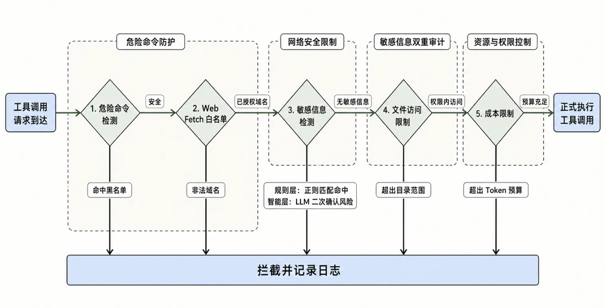
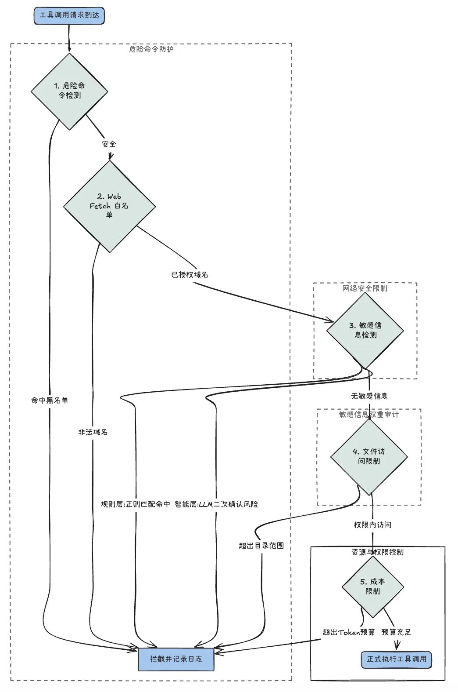

# 18｜进阶：拦截管道构建合同敏感信息的多层安全护栏
你好，我是邢云阳。

上节课我们把合同审查业务封装成了 Skill，让 Agent 代码专注于工程编排。但把所有审查结果都丢给 LLM 后患无穷。合同里往往包含客户的身份证号、银行账号、内部定价、商业机密等敏感信息，如果 Agent 不加限制地使用工具，把这些数据写入日志、发送到外网、甚至上传到第三方 API，后果不堪设想。

这节课我们就来构建一套多层安全护栏，覆盖 Agent 的所有危险操作。

## 为什么需要安全护栏

合同审查 Agent 的危险操作集中在三类。

- **危险命令执行**。Agent 经常需要用 bash 执行系统命令。如果不加限制，模型可能误执行 `rm -rf`、 `curl ... | sh` 等破坏性命令。

- **敏感数据外发**。 `web_fetch`、 `web_search`、甚至是 `write` 工具，都可能把合同中的敏感信息泄露到外部。

- **越权文件访问**。Agent 可能读取项目目录之外的文件，比如 SSH 私钥、其他客户的合同等。


更隐蔽的风险是 **LLM 自己的工具调用判断失误**。模型可能基于上下文推断出“这里可以调用 web\_fetch”，但实际上合规要求不能外发合同原文。所以我们不能依赖模型的判断，必须在工程层面做硬拦截。

## Pi-mono 的事件拦截机制

Pi-mono 提供了一套完整的事件拦截机制，覆盖工具调用的全生命周期：

- **tool\_call**：工具执行前，可以阻止或修改参数。

- **tool\_result**：工具执行后，可以修改返回值。

- **context**：LLM 调用前，可以修改 messages。

- **before\_provider\_request**：请求发送前，可以修改 payload。


这个机制怎么用呢？举个例子，一个典型的工具执行流程如下：

```
LLM 决定调用工具 → tool_call 事件（可拦截）→ 参数校验 → 工具执行 → tool_result 事件（可改写）→ LLM 看到结果
```

我们重点使用 `tool_call` 事件做拦截。这是工具执行前的最后一道防线，也是最适合做合规控制的位置。

Pi-mono 的扩展 API 提供 `pi.on("tool_call", handler)` 接口。Handler 返回 `{ block: true, reason: "..." }` 就可以阻止工具执行，返回 `undefined` 则表示放行：

```
pi.on("tool_call", async (event, ctx) => {
  if (event.toolName === "bash") {
    const cmd = (event.input as any).command as string;
    if (/rm\s+-rf|curl.*\|.*sh|sudo/.test(cmd)) {
      return { block: true, reason: "检测到危险命令" };
    }
  }
  return undefined;
});
```

注意几个关键点：

- **handler 返回** `undefined` **表示允许**，返回 `{ block: true, reason } ` 表示阻断。返回的对象里 `reason` 会作为错误信息返回给 LLM，模型可以根据原因决定下一步行动。

- **handler 是异步的**。你可以做网络请求、数据库查询等耗时操作。

- **handler 收到信号是当前操作的终止信号**。


以上机制相当于 Pi-mono 为我们提供了钩子或者说类似中间件机制的东西，但具体应该在触发什么样的规则时予以拦截，则是我们需要自己去实现的。

## 多层护栏的架构

一个完整的护栏应该是一组规则按顺序执行，每个规则负责不同的检查维度：





我们先把规则抽象成一个统一的类型：

```
type GuardRule = (event: ToolCallEvent, ctx: ExtensionContext) => Promise;
type GuardResult =
  | { action: "pass" }
  | { action: "block"; reason: string }
  | { action: "rewrite"; input: any };
```

然后实现一个统一的管道执行器：

```
const guards: GuardRule[] = [
  dangerousCommandGuard,      // 1. 危险命令检测
  webFetchWhitelistGuard,     // 2. Web Fetch 白名单
  sensitiveContentGuard,      // 3. 敏感信息检测（内部含正则 + LLM）
  fileAccessGuard,            // 4. 文件访问限制
  costLimitGuard,             // 5. 成本限制
];

async function runSecurityGuards(event: ToolCallEvent, ctx: ExtensionContext): Promise<{ block?: true; reason?: string } | undefined> {
  for (const guard of guards) {
    const result = await guard(event, ctx);
    if (result.action === "block") {
      return { block: true, reason: result.reason };
    }
    if (result.action === "rewrite") {
      event.input = result.input;
    }
  }
  return undefined;
}

pi.on("tool_call", async (event, ctx) => {
  return await runSecurityGuards(event, ctx);
});
```

这种管道设计有两个好处：

- **规则可插拔**。每条规则独立，可以单独启用、禁用或替换。

- **规则可组合**。不同规则叠加检查，例如先检查命令是否危险，再检查参数里是否含敏感信息。


接下来我们逐一实现这五条规则。

### 规则 1：危险命令检测

Agent 执行的 bash 命令是最直接的破坏入口：

```
function dangerousCommandGuard(event: ToolCallEvent): GuardResult {
  if (event.toolName !== "bash") return { action: "pass" };

  const cmd = (event.input as any).command as string;
  const dangerous = [
    /rm\s+-rf/,
    /curl.*\|.*sh/,
    /sudo/,
    />\s*\/dev\/null.*&/,
  ];

  if (dangerous.some(p => p.test(cmd))) {
    return { action: "block", reason: "检测到危险命令" };
  }
  return { action: "pass" };
}
```

可以通过设置一些命令黑名单，然后做匹配，从而拦截这些黑名单命令。

### 规则 2：敏感信息检测（正则 + LLM 双重检测）

这条规则是我们护栏里的核心，也是最容易被误读的地方。请注意： **正则检测和 LLM 检测不是两条独立的** **“** **拦截层** **”** **，而是同一条敏感信息检测规则里的前后两道闸门。**

为什么这样设计？因为它们的优缺点正好互补：

\- **正则**：速度快、可解释，但容易误报（把订单号当成银行卡号），也容易漏掉语义敏感信息。

\- **LLM**：能识别语义层面的敏感信息，但消耗 Token，不能每个工具调用都跑。

所以我们用正则做第一道闸，只有正则命中了，才触发 LLM 做第二道确认。这样既控制了成本，又能提高准确率。

#### 第一道闸：正则初筛

```
const SENSITIVE_PATTERNS = [
  { name: "身份证号", regex: /\d{6}(19|20)\d{2}(0[1-9]|1[0-2])(0[1-9]|[12]\d|3[01])\d{3}[\dXx]/g },
  { name: "手机号", regex: /1[3-9]\d{9}/g },
  { name: "银行卡号", regex: /\d{16,19}/g },
  { name: "邮箱", regex: /[\w.-]+@[\w.-]+\.\w+/g },
];

function detectByRegex(text: string): string[] {
  const hits: string[] = [];
  for (const { name, regex } of SENSITIVE_PATTERNS) {
    const matches = text.match(regex);
    if (matches) {
      hits.push(`${name}: ${matches.length} 处`);
    }
  }
  return hits;
}
```

正则负责快速发现格式化敏感信息。命中只代表“可疑”，并不直接阻断。

#### 第二道闸：LLM 语义确认

正则抓不到非格式敏感信息，比如“我司核心客户是某某公司”这种语义上的机密。我们用轻量 LLM 做二次检测：

```
async function detectByLLM(text: string, model: Model): Promise {
  const prompt = `分析以下文本是否包含敏感信息（身份证、银行账号、商业机密、内部定价、对方公司名等）。` +
    `只返回敏感信息列表，每行一个，格式：类型: 内容摘要。如果没有，返回"无"。\n\n文本：\n${text}`;

  const response = await streamSimple(model, {
    systemPrompt: "你是一个敏感信息检测助手。",
    messages: [{ role: "user", content: prompt }],
  });

  const result = await response.result();
  if (result.stopReason === "error") return [];
  const text2 = result.content.filter(c => c.type === "text").map(c => c.text).join("");
  return text2 === "无" ? [] : text2.split("\n").filter(Boolean);
}
```

#### 两道闸组合成一条规则

```
async function sensitiveContentGuard(event: ToolCallEvent, ctx: ExtensionContext): Promise {
  const inputText = JSON.stringify(event.input);

  // 第一道闸：正则初筛
  const regexHits = detectByRegex(inputText);
  if (regexHits.length === 0) return { action: "pass" };

  // 第二道闸：LLM 语义确认（仅当正则命中）
  const llmHits = await detectByLLM(inputText, ctx.model);

  if (llmHits.length > 0) {
    return {
      action: "block",
      reason: `检测到敏感信息: ${[...regexHits, ...llmHits].join("; ")}`,
    };
  }

  // 正则命中但 LLM 判断不敏感，记录日志后放行
  ctx.ui?.notify(`正则命中但 LLM 判断不敏感: ${regexHits.join("; ")}`, "warning");
  return { action: "pass" };
}
```

注意“ **正则命中 \+ LLM 不命中** **”** 的情况。这可能是误报，也可能是真敏感但 LLM 没识别。我们记录日志后放行，让人工审计日志来持续优化正则规则。

**工程上还要控制成本** **，** LLM 检测只在正则命中后触发，使用便宜的小模型，并设置超时和 fallback 机制。

### 规则 3：Web Fetch 白名单

外发请求是另一个高风险操作。即使模型没有泄露合同原文，访问钓鱼网站或上传到第三方 API 也是大麻烦：

```
const WEB_FETCH_WHITELIST = [
  "gov.cn",             // 政府网站
  "court.gov.cn",       // 裁判文书网
  "gsxt.gov.cn",        // 国家企业信用信息公示系统
  "tianyancha.com",     // 天眼查
  "qcc.com",            // 企查查
];

function webFetchWhitelistGuard(event: ToolCallEvent): GuardResult {
  if (event.toolName !== "web_fetch" && event.toolName !== "web_search") {
    return { action: "pass" };
  }

  const url = (event.input as any).url as string;
  try {
    const hostname = new URL(url).hostname;
    const allowed = WEB_FETCH_WHITELIST.some(domain => hostname.endsWith(domain));
    if (!allowed) {
      return {
        action: "block",
        reason: `域名 ${hostname} 不在白名单`,
      };
    }
  } catch {
    return { action: "block", reason: "URL 格式无效" };
  }

  return { action: "pass" };
}
```

白名单是粗粒度的“信任边界”，但非常有效。允许访问的域名必须由法务和 IT 共同评审，且定期更新。

### 规则 4：文件访问限制

合同审查 Agent 应该只能访问项目目录下的合同文件，不能读取其他敏感文件：

```
function fileAccessGuard(event: ToolCallEvent, ctx: ExtensionContext): GuardResult {
  if (event.toolName !== "read") return { action: "pass" };

  const filePath = (event.input as any).filePath as string;
  const cwd = ctx.cwd;
  const absolute = path.resolve(cwd, filePath);

  // 禁止访问敏感目录
  const forbidden = [".ssh", ".env", ".aws/credentials", ".git/config"];
  if (forbidden.some(p => absolute.includes(p))) {
    return { action: "block", reason: "禁止访问敏感文件" };
  }

  // 必须落在项目目录内
  if (!absolute.startsWith(cwd)) {
    return { action: "block", reason: "禁止访问项目目录外的文件" };
  }

  return { action: "pass" };
}
```

这一规则保护两类场景：一是防止 Agent 读取 SSH 私钥、AWS 凭证等敏感文件；二是防止 Agent 读取其他客户的合同造成数据串台。

### 规则 5：成本限制

合同审查可能消耗大量 Token，尤其是大合同的多次审查。在生产环境，我们必须给 Agent 设置 Token 预算：

```
function costLimitGuard(event: ToolCallEvent, ctx: ExtensionContext): GuardResult {
  const usage = ctx.sessionUsage;  // 从 ctx 获取当前 Token 用量
  if (usage.totalTokens > 1_000_000) {
    return { action: "block", reason: "已超过 Token 预算" };
  }
  return { action: "pass" };
}
```

Pi-mono 在 `ctx` 中暴露了当前会话的累计 Token 用量。我们可以根据业务预算设定阈值，超过即阻断。

## 把护栏注册为扩展

在完成了多层护栏的代码编写后，我们按照事件拦截机制的代码编写方法，将其注册进 tool\_call 的事件拦截中。代码如下：

```
pi.on("tool_call", async (event, ctx) => {
    await logToolCall(event);
    return await runSecurityGuards(event, ctx);
  });
```

runSecurityGuards 函数便是我们上面实现的多层护栏。

但是在 Pi-mono 的架构中，真正能把事件拦截机制运行起来，还必须将其封装为一个扩展，或者也可以理解为一个插件，封装的代码如下：

```
// src/extensions/security-guard.ts
import type { ExtensionAPI } from "@earendil-works/pi-coding-agent";
import { runSecurityGuards, logToolCall } from "../guard/guards.js";

export default function (pi: ExtensionAPI) {
  pi.on("tool_call", async (event, ctx) => {
    await logToolCall(event);
    return await runSecurityGuards(event, ctx);
  });

  pi.on("tool_result", async (event, ctx) => {
    await logToolCallResult(event);
  });
}
```

启用方式有两种：

1\. **作为扩展文件**：放在 `~/.pi/agent/extensions/`，重启 pi 自动加载。

2\. **直接在 SDK 中注册**：在 `createAgentSession` 里传入 `extensions: [securityGuardExtension]`。

## 运行效果

部署好扩展后，Agent 的所有工具调用都会经过这五层检查：

```
npx tsx src/runtime/secured-review.ts sample-contract-long.txt
```

当 Agent 试图访问非白名单的 URL 时，你会看到后面的信息。

```
[工具被阻断] web_fetch: 域名 example.com 不在白名单
```

当 Agent 试图把合同正文写入日志文件、且正则命中手机号时，效果如下。

```
[工具被阻断] write: 检测到敏感信息: 手机号: 3 处
```

模型会收到阻断原因，决定下一步行动。比如尝试换一个工具、或者告知用户无法完成此操作。

## 总结

这节课我们构建了合同审查 Agent 的多层安全护栏，核心架构是构建多层的拦截机制，然后把所有规则都通过 `pi.on("tool_call", ...)` 注册到 Pi-mono 的事件拦截机制上，按顺序执行，全部通过才允许工具运行。

很多同学问什么是 Harness，我们这节课所做的把工作放在模型外去做的方式，就是 Harness。发现了吗？在这套护栏机制中，大部分内容都没有走 LLM，而是通过常规的、传统的工程化手段去解决。

这样做有三方面考虑。首先是成本控制角度，很多操作可以不必经过 LLM；其次是出于效率考虑，毕竟一件事情通过代码解决和通过 LLM 解决，二者所花费的时间不是一个量级；最后还有对于 LLM 的不信任，因此要采用外部工程化手段解决。

## 思考题

正则检测容易误报，LLM 检测又消耗 Token。在实际生产中，你认为应该如何平衡“安全”和“误报”？比如宁可误报阻断让用户重写 prompt，还是允许可疑操作但记录日志？这背后涉及到哪些产品决策？

欢迎你在留言区展示你的思考过程，我们一起探讨。如果你觉得这节课的内容对你有帮助的话，也欢迎你分享给其他朋友，我们下节课再见！