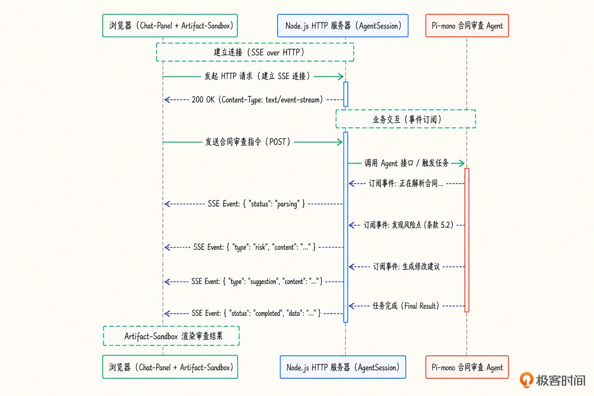
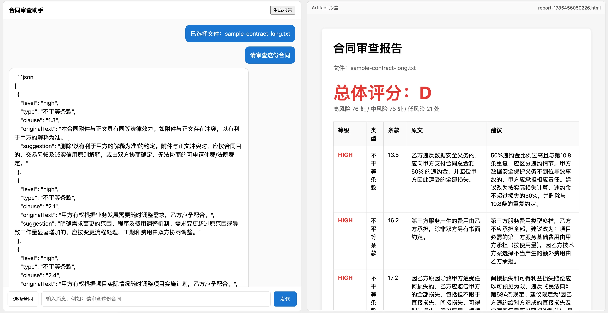

# 19｜扩展：ChatPanel 助力 Agent 丝滑接入聊天对话 Web 页面
你好，我是邢云阳。

前面几节课，合同审查 Agent 一直跑在终端里。对开发者来说，终端高效直接；但要把 Agent 交付给法务、采购、商务同事使用，一个网页聊天界面才更方便。

这节课我们就来补齐最后一块拼图：基于浏览器原生 Web Components 打造 ChatPanel，并通过 Server-Sent Events 把 Pi-mono Agent 的事件流实时推送到前端。学完今天内容，我们将拥有一个可以直接嵌入到任何网页里的合同审查聊天组件。

## 为什么选择 Web Component

选择原生 Web Components 主要考虑三点。

第一， **零构建依赖**。课程主线是 Agent 工程和 Pi-mono，不希望被 Vite、Webpack、JSX 配置冲淡重点。一个 `.js` 文件、一个 `.css ` 文件，直接引入就能跑。

第二， **可嵌入性**。 `` 标签可以被任何页面、任何框架直接引用，法务部门现有的 OA 系统、React 后台、Vue 门户，只要加载一个 JS 文件就能使用，不需要改造前端工程。

第三， **与 Pi-mono 哲学一致**。Pi-mono 强调轻量、可组合、不绑定特定 UI 框架，Web Components 正好延续这种风格。理解了事件流和权限预检机制之后，把它迁移到 React 或 Vue 只是换一个组件封装方式。

## 整体架构

我们的架构分三层：



后端负责三件事：暴露 `/api/chat` 接口接收用户请求、创建 Agent Session 并订阅其事件、通过 SSE 把事件实时推送给前端。前端负责维护消息列表、消费 SSE、渲染流式输出和工具状态，并在发送消息前弹出权限预检对话框。浏览器的 Artifact 沙盒则用 sandbox 属性的 iframe 安全展示 LLM 生成的 HTML 报告。

这里有一个关键选择：为什么用 SSE 而不是 WebSocket？因为 Agent 的事件流本质上是 **服务器单向推送**，SSE 在 HTTP 之上实现，天然支持自动重连、断线恢复、基于文本的流式数据，而且不需要额外协议握手。只有在需要客户端高频反向发送（比如每执行一个工具就弹窗确认）时，WebSocket 才更合适。这节课的权限预检是在请求发起前做一次确认，SSE 完全够用。

## 后端：SSE 服务器

后端代码在 `src/web/server.ts`。我们使用 Node.js 原生的 ` http.createServer，` 不引入 Express，保持最小依赖。

创建 Session 时，通过 tools 白名单严格限制可用工具：

```
const { session } = await createAgentSession({
  cwd: process.cwd(),
  model: minimaxiModel,
  thinkingLevel: "medium",
  customTools: [parseContractTool, classifyContractTool],
  tools: ["read", "write", "parse_contract", "classify_contract"],
});
```

这相当于一道粗粒度安全护栏：默认禁用 bash、web\_fetch 等高危工具，Agent 只能做读取文件、写入报告、解析和分类合同这些必要操作。比起在工具执行前做拦截，这种方式更彻底——模型根本看不到它不该用的工具，从源头上减少攻击面。

订阅事件后，把消息增量、工具调用、审查结果转成 SSE：

```
session.subscribe(async (event) => {
  if (event.type === "message_update" && event.assistantMessageEvent.type === "text_delta") {
    sendSSE(res, "message_delta", { delta: event.assistantMessageEvent.delta });
  }
  if (event.type === "tool_execution_start") {
    await logToolCall({ toolName: event.toolName, toolCallId: event.toolCallId, input: event.args });
    sendSSE(res, "tool_start", { toolName: event.toolName });
  }
  if (event.type === "tool_execution_end") {
    sendSSE(res, "tool_end", { toolName: event.toolName, isError: event.isError });
  }
});

const text = await fs.readFile(filePath, "utf-8");
sendSSE(res, "status", { text: `正在审查 ${filePath}，共 ${text.length} 字符...` });

const result = await reviewWithSkill(session, text);
sendSSE(res, "report", { score: result.score, summary: result.summary, riskCount: result.risks.length });
sendSSE(res, "done", {});
```

这里我们把 Pi-mono 的事件模型映射成前端更容易消费的事件类型。message\_delta 对应流式文本，tool\_start/end 让用户看到 Agent 正在做什么，status 展示当前阶段，report 一次性返回结构化结果，done 标记本次对话结束。

`sendSSE` 把事件名和数据一起包进 JSON，方便前端直接解析：

```
function sendSSE(res: ServerResponse, event: string, data: unknown) {
  res.write(`data: ${JSON.stringify({ event, data })}\n\n`);
}
```

除了 /api/chat，后端还实现了 /api/upload 处理文件上传，以及 /api/report 生成独立 HTML 报告。报告生成逻辑把审查结果渲染成表格形式的 HTML，存入 reports/ 目录，前端通过 /reports/ 访问。

## 前端：ChatPanel Web Component

src/web/static/chat-panel.js 实现了一个原生 Custom Element，使用 Shadow DOM 隔离样式，避免和宿主页面冲突。

组件内部维护三类状态：历史消息 messages、当前正在流式输出的 Assistant 消息 currentStreamingMessage、文件用户上传文件 pendingFile / 最后使用的文件路径 lastFilePath。

当用户点击发送时，组件先弹出权限预检对话框：

```
onSend() {
  const message = input.value.trim();
  if (!message) return;
  input.value = "";
  this.addMessage("user", message);
  this.showPermissionDialog(message);
}

onPermission(allowed) {
  this.shadowRoot.getElementById("permission-overlay").style.display = "none";
  if (!allowed) {
    this.addMessage("assistant", "已取消操作。");
    return;
  }
  this.startChat(this.pendingMessage);
}
```

对话框明确告知用户 Agent 会调用哪些工具、可能写入哪些目录。这是企业级 Agent UI 的标准做法：不让模型在未经确认的情况下执行任何可能影响文件系统或外发数据的操作。预检不是走过场，而是把"模型自治"和"人类监督"之间的边界明确化。

权限通过后，组件发起 fetch 请求，并读取响应体的 ReadableStream：

```
const res = await fetch(`${this.apiBase}/api/chat`, {
  method: "POST",
  headers: { "Content-Type": "application/json" },
  body: JSON.stringify({ message, filePath: this.lastFilePath }),
});

const reader = res.body.getReader();
const decoder = new TextDecoder();
let buffer = "";

while (true) {
  const { done, value } = await reader.read();
  if (done) break;
  buffer += decoder.decode(value, { stream: true });
  const packets = buffer.split("\n\n");
  buffer = packets.pop() ?? "";
  for (const packet of packets) {
    const lines = packet.split("\n");
    const dataLine = lines.find((l) => l.startsWith("data:"));
    if (!dataLine) continue;
    try {
      const parsed = JSON.parse(dataLine.slice(5).trim());
      this.handleSSEPacket(parsed);
    } catch {}
  }
}
```

这里按 SSE 规范用两个换行符 \\n\\n 分割数据包，每个包内再找到 data: 行，解析出 { event, data }。相比 EventSource API，手动读取 ReadableStream 更灵活，可以自定义重连、错误处理、请求头（例如后续加入认证 token）。

根据事件类型，组件分别渲染：

- message\_delta：追加到当前 Assistant 消息文本，实现打字机效果。

- tool\_start / tool\_end：以灰色工具消息展示，让用户感知 Agent 的工作进度。

- status：以居中状态消息展示当前阶段。

- report：展示总体评分和风险摘要。

- error：展示错误信息。

- done：重置流式状态，启用“生成报告”按钮。


这种实时反馈让用户体验接近常见的聊天产品，而不是等 Agent 全部跑完才一次性吐结果。对合同审查这种可能耗时数十秒的任务来说，持续反馈能显著降低用户焦虑。

## Artifact 沙盒

合同审查完成后通常会生成 HTML 报告。直接把 HTML 插到主页面是有风险的：报告内容来自 LLM 生成，如果里面包含 “script”标签，就可能执行恶意代码或读取主页面数据。

解决方案是使用 sandbox 属性的 iframe：

```
class ArtifactSandbox extends HTMLElement {
  loadUrl(url) {
    this.shadowRoot.getElementById("sandbox").src = url;
  }
}

customElements.define("artifact-sandbox", ArtifactSandbox);
```

在 index.html 里，左侧是 chat-panel，右侧是 artifact-sandbox。用户点击“生成报告”后，后端生成 HTML 存入 reports/ 目录，前端收到 artifact-ready 自定义事件，把报告路径交给沙盒组件加载。iframe 的 sandbox 属性会限制内页权限，即使报告里有脚本，也无法访问父页面、无法弹窗、无法提交表单。

## 文件上传与路径安全

ChatPanel 支持用户上传本地合同文件。后端 /api/upload 解析 multipart/form-data，把文件保存到 uploads/ 目录，并返回相对路径：

```
const uploadsDir = path.join(process.cwd(), "uploads");
await fs.mkdir(uploadsDir, { recursive: true });
const filePath = path.join(uploadsDir, filename);
await fs.writeFile(filePath, fileData);
res.end(JSON.stringify({ filePath: path.relative(process.cwd(), filePath) }));
```

生产环境要注意两点：一是对文件名做 sanitize，防止路径遍历攻击；二是返回相对路径，让 Agent 读取时限制在当前工作目录内。更进一步，可以在后端校验文件类型、大小，甚至先用杀毒引擎扫描，再交给 Agent 处理。

## 错误处理与断线恢复

一个容易被忽视的问题是网络抖动。SSE 本身有自动重连机制，但 fetch + ReadableStream 需要手动处理。我们可以在 startChat 外围加 try/catch，遇到错误时给用户明确的提示；也可以在 req.on("close", ...) 里感知客户端断开，及时释放资源。

后端已经在 handleChat 里做了这种处理：

```
let sessionClosed = false;
req.on("close", () => {
  sessionClosed = true;
});
```

当前端关闭连接时，后续事件不再发送，避免无效计算和内存泄漏。

## 运行与测试

启动 Web 服务：

```
npm run start:web
```

终端显示：

```
合同审查 ChatPanel 服务已启动：http://localhost:3456
```

打开浏览器访问该地址，输入“请审查这份合同”并选择 sample-contract.txt，会弹出权限预检对话框。点击“允许”后，左侧开始流式输出审查过程，中间如果调用了 parse\_contract 等工具，会以灰色消息展示。最后出现总体评分和风险摘要。点击“生成报告”，右侧沙盒会加载格式化 HTML 报告。



## 进一步扩展

这个 ChatPanel 只是最小可运行骨架，实际生产环境还可以做很多增强，这里我列几项供你参考。

1\. **用户认证**：在 SSE 连接前校验 JWT，防止未授权访问。

2\. **会话隔离**：每个用户拥有独立的 session id，消息和历史互不干扰。

3\. **持久化**：把聊天记录和审查结果存入数据库，支持后续查询和审计。

4\. **WebSocket 双向通信**：如果需要每个危险工具都弹窗确认，WebSocket 比 SSE 更自然。

5\. **更丰富的 Artifact 类型**：除了 HTML 报告，还可以渲染 diff、PDF、图表等。

6\. **移动端适配**：调整左右分栏为上下堆叠，适配法务同事在手机上使用的场景。

## 总结

这节课我们把合同审查 Agent 从终端搬到了 Web 页面。现在我们回顾一下都做了哪些事儿。

- 用 Node.js 原生 HTTP 服务器搭建 SSE 服务，把 Pi-mono Agent 的事件流实时推送到浏览器。

- 用原生 Web Components 实现“chat-panel”，包含消息列表、文件上传、SSE 流式渲染和权限预检弹窗。

- 用 “artifact-sandbox”在 iframe 沙盒里安全展示 LLM 生成的 HTML 报告。

- 通过 tools 白名单限制 Agent 可用工具，并记录审计日志。


这个网页版 Agent 已经可以作为一个最小可用的产品原型，嵌入到公司内网或 OA 系统中使用。下一节课，我们会回到终端，深入 Pi-mono 的 TUI 自绘引擎和内置组件库，看看如何在命令行里做出媲美 GUI 的交互体验。

## 思考题

这节课的权限预检是在用户发送消息前做一次性的确认。如果要升级为“每个危险工具执行前都弹窗确认”，后端和前端的通信协议需要做哪些改动？你会选择 SSE、WebSocket，还是轮询来实现这种双向确认？为什么？

欢迎你在留言区展示你的思考过程，我们一起探讨。如果你觉得这节课的内容对你有帮助的话，也欢迎你分享给其他朋友，我们下节课再见！