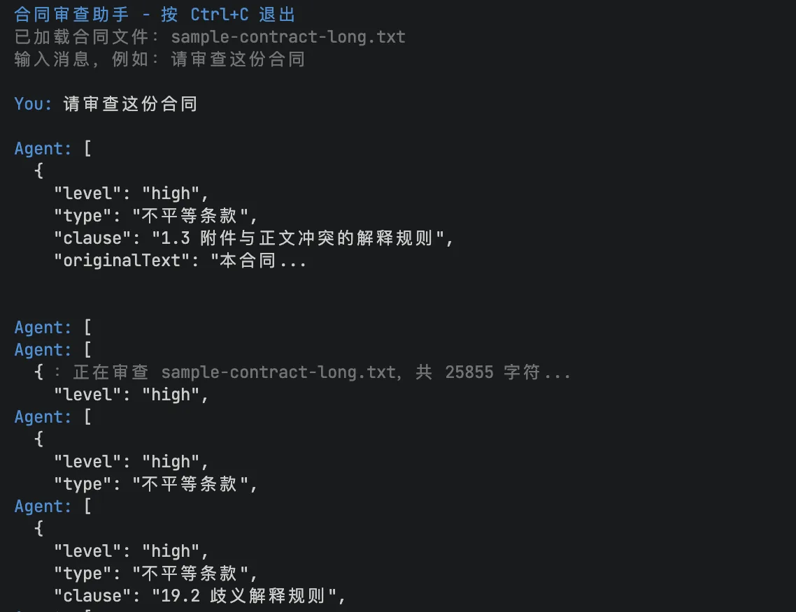

# 20｜TUI：Pimono TUI 自绘引擎与内置组件库实战
你好，我是邢云阳。

上节课我们把合同审查 Agent 搬到了 Web 页面，用 ChatPanel 实现了浏览器里的聊天交互。这节课，我们再次回到终端中，用另外一种名字叫做 TUI 的界面来实现交互。这两年比较火的 Claude Code、OpenCode 等等都是主打 TUI （文本用户界面）的交互方式。

Pi-mono 自带的 `pi-tui` 包就是为这种场景准备的——它提供了一套终端 UI 自绘引擎和内置组件库，让你在命令行里也能做出媲美 GUI 的交互体验。

这节课我们就用 `pi-tui` 给合同审查 Agent 做一个终端界面。你会看到它是如何实现差分渲染、组件化布局、键盘事件处理，以及如何把 Agent 的事件流实时展示在终端里。

## 为什么还需要 TUI

可能有的同学会问：既然已经有了 Web UI，为什么还要做 TUI？

原因有三点。

- **启动成本**。Web 需要启动 HTTP 服务器、打开浏览器，而 TUI 只需要 `npx tsx src/runtime/tui-review.ts sample-contract.txt`，秒开即用。

- **开发者友好**。很多工程师的工作流就是终端 \+ 编辑器。审查结果直接显示在终端里，不需要切换窗口，和 `grep`、 `git`、 `vim` 等工具一脉相承。

- **远程/服务器场景**。当你通过 SSH 登录到远程服务器运行 Agent 时，没有浏览器可用，TUI 就是唯一的人机交互界面。


当然，TUI 不是替代 Web UI，而是补充。Web 适合给非技术用户，TUI 适合给开发者自己用。

## Pi-mono TUI 的核心设计

`pi-tui` 是一个轻量级的终端 UI 框架。它的核心设计可以概括成三点：组件化、差分渲染和内置组件库，我们依次看一下。

### 组件化

所有可见元素都是 `Component`，必须实现两个方法：

```
interface Component {
  render(width: number): string[];
  invalidate(): void;
  handleInput?(data: string): void;
}
```

`render(width)` 接收当前可用宽度，返回一个字符串数组，每个字符串代表终端的一行。 `handleInput` 可选，用于接收键盘输入。 `Container` 负责把子组件按顺序堆叠起来。

### 差分渲染

`TUI` 类负责管理整个渲染循环。它不会每帧清空屏幕重画，而是对比上一次渲染结果，只更新变化的部分。这样既减少了终端闪烁，又降低了 CPU 占用，即使在复杂界面下也能保持流畅。

### 内置组件库

`pi-tui` 提供了一系列常用组件。

```
Input：单行文本输入，支持光标移动、粘贴、撤销
SelectList：选择列表，支持上下移动、搜索、分页
Text：多行文本显示，自动换行。
Box：带背景和内边距的容器
Markdown：终端里渲染 Markdown
Loader：加载动画
```

这些组件可以直接组合，不需要像 React 那样写 JSX。

## 搭建合同审查 TUI

我们要实现的界面布局如下：

```
┌────────────────────────────────────────┐
│ 合同审查助手 - 按 Ctrl+C 退出            │  <- Header
├────────────────────────────────────────┤
│                                        │
│ You: 请审查这份合同                     │  <- OutputLog
│ Agent: 正在分析...                      │
│ [Tool Start] parse_contract             │
│ [Tool End] parse_contract ok            │
│ === 审查结果 ===                         │
│ 总体评分：D                             │
│                                        │
├────────────────────────────────────────┤
│ 状态：Agent 运行中...                    │  <- StatusBar
├────────────────────────────────────────┤
│ You: ___________                        │  <- PromptInput
└────────────────────────────────────────┘
```

整个界面由四个自定义组件组成： `Header`、 `OutputLog`、 `StatusBar`、 `PromptInput`。

### 自定义组件

`Header` 和 `StatusBar` 最简单，只需要渲染一行带颜色的文本：

```
class Header implements Component {
  private title: string;
  constructor(title: string) { this.title = title; }
  invalidate() {}
  render(width: number): string[] {
    return [`${BLUE}${this.title}${RESET}`.slice(0, width).padEnd(width, " ")];
  }
}
```

`OutputLog` 稍微复杂一点，它需要累积多行文本，并且支持追加和流式拼接：

```
class OutputLog implements Component {
  private lines: string[] = [];

  append(line: string) { this.lines.push(line); }
  appendRaw(text: string) {
    if (this.lines.length === 0) this.lines.push(text);
    else this.lines[this.lines.length - 1] += text;
  }

  render(width: number): string[] {
    return this.lines.map((l) => l.slice(0, width));
  }
}
```

`appendRaw` 非常关键：Agent 的流式输出是一段一段到达的，我们不想每段都换行，而是要把它们拼接在当前 Assistant 消息的同一行里，实现终端里的"打字机效果"。

`PromptInput` 包装了 `pi-tui` 的 `Input` 组件，给它加上一个 `You:` 标签，并处理 `Ctrl+C` 退出：

```
class PromptInput implements Component, Focusable {
  readonly input = new Input();
  focused = false;
  onSubmit?: (value: string) => void;
  onCtrlC?: () => void;

  handleInput(data: string) {
    if (matchesKey(data, "ctrl+c")) {
      this.onCtrlC?.();
      return;
    }
    this.input.handleInput(data);
  }

  render(width: number): string[] {
    const label = `${GREEN}You:${RESET} `;
    const inputLines = this.input.render(width - label.length);
    return inputLines.map((line) => label + line);
  }
}
```

### 主运行时

`src/runtime/tui-review.ts` 把组件组装起来，并订阅 Agent 事件：

```
const root = new Container();
root.addChild(this.header);
root.addChild(this.outputLog);
root.addChild(this.statusBar);
root.addChild(this.promptInput);

this.tui.addChild(root);
this.tui.setFocus(this.promptInput.input);
this.tui.start();
```

当用户输入消息并按下回车时，触发 Agent 审查：

```
private async onSubmit(message: string) {
  this.outputLog.append(`${BLUE}You:${RESET} ${message}`);
  this.tui.requestRender();

  this.isRunning = true;
  this.statusBar.setText("Agent 运行中...");
  this.tui.requestRender();

  await this.runAgent(message);

  this.isRunning = false;
  this.statusBar.setText("就绪");
  this.tui.requestRender();
}
```

## 把 Agent 事件流映射到 TUI

TUI 里的 Agent 事件处理和 Web 版本类似，只是渲染目标从 DOM 变成了终端字符。

```
session.subscribe(async (event) => {
  if (event.type === "message_update" && event.assistantMessageEvent.type === "text_delta") {
    if (!this.assistantStarted) {
      this.outputLog.append(`${BLUE}Agent:${RESET} `);
      this.assistantStarted = true;
    }
    this.outputLog.appendRaw(event.assistantMessageEvent.delta);
    this.tui.requestRender();
  }

  if (event.type === "tool_execution_start") {
    this.outputLog.append(`${DIM}[Tool Start] ${event.toolName}${RESET}`);
    this.tui.requestRender();
  }

  if (event.type === "tool_execution_end") {
    this.outputLog.append(`${DIM}[Tool End] ${event.toolName}${RESET}`);
    this.tui.requestRender();
  }
});
```

注意这里我们不需要 SSE，因为 TUI 和后端运行在同一个 Node.js 进程里。 `session.subscribe` 直接拿到事件，调用 `this.tui.requestRender()` 触发一次重绘即可。

## 差分渲染的体验

`pi-tui` 的 `TUI` 类会在内部维护一个终端画面的“上一帧”。当某个组件状态变化时，你调用 `requestRender()`，TUI 会重新执行所有组件的 `render()`，但只把真正变化的字符写到终端。这意味着：

- 流式输出时，只有最后一行在更新，上方历史消息不会闪烁。

- 状态栏变化时，只有底部一行重绘。

- 输入框光标移动时，只有光标附近几个字符变化。


这种差分渲染是 TUI 框架的灵魂。如果你自己用 `console.log` 实现终端 UI，一旦内容多了就会满屏滚动、闪烁；而 `pi-tui` 能把它稳定在一个固定区域内。

## 键盘事件与焦点管理

`pi-tui` 的焦点系统很简单：通过 `tui.setFocus(component)` 设置焦点组件，键盘输入就会路由到该组件的 `handleInput`。我们的 `PromptInput` 实现了 `handleInput`，所以输入框一直处于焦点状态。

`matchesKey(data, "ctrl+c")` 用于识别 Ctrl+C 组合键。因为终端 raw 模式下，普通 `process.on("SIGINT")` 不会生效，必须在输入层手动捕获退出键。

## 运行与测试

接下来我们跑跑看。首先启动 TUI。

```
npm run start:tui
# 或指定合同文件
npm run start:tui sample-contract.txt
```

终端会进入全屏交互模式。输入“请审查这份合同”并回车，Agent 开始工作，你会看到类似后面截图里的内容。



按 `Ctrl+C` 退出。

## TUI vs Web vs 纯终端

最后我们对比一下三种交互方式。

维度

纯终端（printf）

TUI（pi-tui）

Web（ChatPanel）

启动速度

最快

快

慢（需启动服务器+浏览器）

交互能力

弱

强（输入、选择、动画）

最强

适用用户

开发者

开发者/高级用户

非技术用户

远程场景

适合

适合

需网络

实现复杂度

低

中

高

对于合同审查 Agent 来说，三种方式分别对应：快速调试用 TUI、交付业务同事用 Web、CI/CD 集成用纯终端输出。

## 总结

这节课我们用 `pi-tui` 给合同审查 Agent 打造了一个终端交互界面：

- 理解了 `pi-tui` 的三大核心设计：组件化、差分渲染、内置组件库。

- 实现了 `Header`、 `OutputLog`、 `StatusBar`、 `PromptInput` 四个自定义组件。

- 把 Pi-mono Agent 的事件流实时映射到终端输出，实现流式打字机效果。

- 体验了 `Container`、 `TUI`、 `ProcessTerminal`、 `Input` 等内置组件的使用方式。


到这里，你已经掌握了基于 TypeScript 技术栈构建智能体的方法，Pi-mono Agent SDK 打造合同审查助手的项目也全部完成了。我们从最基础的 Agent Runtime 开始，逐步加入了工具、Skill、长上下文处理、安全护栏、Web ChatPanel 和 TUI，最终形成了一个可以在终端、Web、甚至进一步扩展到企业系统的合同审查 Agent。

目前的企业级 Agent 项目开发中，Agent 部分如果不要求自己实现一套 Harness 框架，而是像课程中的四个项目那样，直接使用现成脚手架，其实并不困难。

在此基础上，需要扩展的是传统能力，如多租户、高并发、队列，以及对话切换、断连重连等。这部分你可以参考阿里云的 [AgentScope](https://github.com/agentscope-ai/agentscope "")，该项目分为 AgentService 层（处理传统基础设施）和 Agent 层（处理 Agent 逻辑）。阿里在传统开发方面经验丰富，你可以借鉴其 AgentService 层的设计思路与架构，融合到自己的项目中。

## 思考题

你认为为什么近两年的 Agent 产品，很多都提供了 TUI 界面，甚至是主打 TUI 界面？

欢迎你在留言区展示你的思考过程，我们一起探讨。如果你觉得这套课程对你有帮助的话，也欢迎你分享给其他朋友，我们整个系列的正文部分到此结束，感谢你的陪伴！

