# DeepSeek Harness：插件化 Agent 框架与生态入门
你好，我是邢云阳。

学完前面的课程，相信你已经对 Harness 时代的几款主流脚手架有了比较系统的认识：Claude Agent SDK 擅长把 Claude Code 的能力原封不动地交付到业务里；DeepAgents 是 LangChain 社区对 Harness 工程的回应，更适合有 LangChain 情怀的老玩家使用；Pi-mono 则用开源、分层的 TypeScript 架构，把 Coding Agent 的每一层都摊开来，方便深度定制。

这一讲，我们来加餐一个同样处在 Harness 赛道上、但设计思路又截然不同的新选手——由 DeepSeek 开源的 **DeepSeek-Harness（简称 dsh）**。如果说前面几个框架的扩展方式主要是“在 SDK 里写代码”，那么 dsh 的核心理念则是 **“一切皆插件”**：不仅工具、模型适配器、UI 是插件，就连 Agent Loop 本身和会话日志机制都是插件，整个运行时由 Cordis 插件框架驱动。

今天我先带你快速了解 dsh 是什么、它有哪些特点。然后，我们来比较一下它和前面学过的框架有什么区别，以及它周边已经长出来的插件生态。最后，我将通过几个实战示例，分别演示如何快速启动一个带 Web 界面的 Agent、如何安装插件、以及如何开发并打包自己的第一个插件。

## DeepSeek Harness 是什么

DeepSeek Harness 是 DeepSeek AI 在近期发布的开源 Agent Harness。它既是 **一个可以直接运行的 Coding Agent 产品**（提供 Web UI 和 headless 两种形态），又是 **一套可组装的底层框架**。

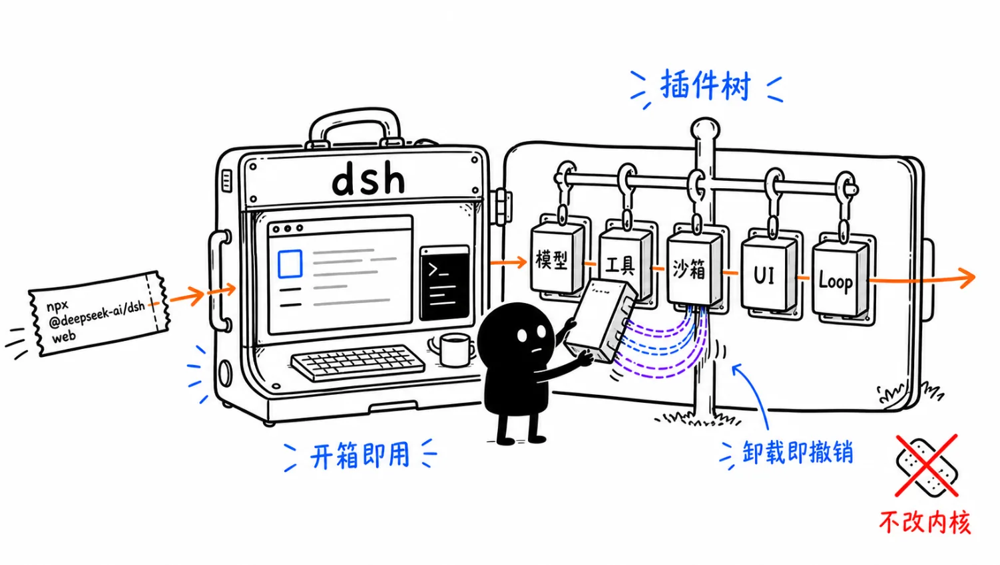

你既可以用一行命令启动它：

```
npx @deepseek-ai/dsh web
```

打开浏览器就是一个完整的 Codex 风格的 Coding Agent 界面；也可以把它当作底座，通过插件替换模型适配器、工具实现、沙箱后端、UI 渲染，甚至替换 Agent Loop 的默认驱动，组装出完全不一样的 Agent 产品。

dsh 的底层基于 **Cordis** 插件框架。Cordis 的核心思想是：运行中的 dsh 是一棵 **插件树**，每个插件向共享上下文贡献服务、类型化事件和可逆的副作用。插件之间通过 `ctx.` 查找服务，通过 `inject` 声明依赖，通过事件进行通信，而不是直接 import 彼此的具体实现。

这意味着，dsh 里 **不存在一个需要打补丁的特权内核**。你想扩展它，不是去改框架源码，而是把新插件挂载到现有插件旁边；插件卸载时，它注册的所有工具、事件监听、提示词片段都会自动撤销。

## DeepSeek Harness 的四个核心特点

### 1\. 一切皆插件

在 dsh 中， **产品的每一部分都是插件** **。**

- 模型适配器（ `ctx.llm`）是插件

- 工具注册表和执行流水线（ `ctx.tools`）是插件

- 会话日志和持久化（ `ctx.sessions`）是插件

- 系统提示词组装（ `ctx.systemPrompt`）是插件

- Agent Loop 本身（ `ctx.agentLoop`）也是插件


这种设计的直接好处是：你可以从配置层替换任何一部分，而不需要 fork 整个框架。例如，把本地沙箱换成 E2B 远程沙箱，只需要换一个 `ctx.sandbox` 的 provider，Bash、PTY、LSP 等 Consumer 会自动跟着迁移过去。

### 2\. Cordis：服务、注入、事件、可逆副作用

Cordis 的五个核心概念构成了 dsh 的骨架：

- **插件是实现 Service 的对象**：可以是一个带 `apply(ctx)` 的函数，也可以是一个 Service 子类。

- **上下文是服务的容器**：每个服务占据稳定的 `ctx.`，如 `ctx.tools`、 `ctx.llm`。

- **通过 inject 声明依赖**：插件声明所需服务后，框架会等依赖就绪才加载它。

- **类型化事件用于通信**：事件有 `emit`、 `waterfall`、 `parallel`、 `serial` 等分发模式。

- **注册是可逆的副作用**：工具、监听器、提示词片段都通过 `ctx.effect()` 或 `ctx.on()` 安装，插件卸载时自动清理。


这套机制让 dsh 在扩展性上非常像“Agent 界的 VS Code”——核心很小，能力全靠插件叠加。

### 3\. 能力 seam：可替换的能力边界

dsh 把可替换能力抽象为 **seam**，每个 seam 包含三种角色：

- **Service Definition**：声明接口

- **Service Provider**：实现接口

- **Consumer**：面向模型或 UI 使用接口


比如 `shell` 能力就有独立的 Definition、本地 provider、Consumer 工具。你替换 provider，Consumer 不需要改代码。这种分层比 Pi-mono 的 `pi-ai / pi-agent-core / pi-coding-agent` 更细，更接近微内核操作系统的设计。

### 4\. 会话日志是模型上下文的唯一来源

dsh 有一个很强的运行时不变量： **模型可见即已记录**。任何到达模型请求的内容，都必须能从会话日志重建。fork、恢复、transcript、遥测、持久化都派生自同一个事件流。

这和 Claude Agent SDK 的五级上下文压缩、Pi-mono 的 `AgentSession` 持久化异曲同工，但 dsh 把它上升到了架构的第一性原则：日志不是副产物，而是运行时的核心数据源。

## 与 Claude Agent SDK、DeepAgents、Pi-mono 的对比

为了更直观地理解 dsh 的定位，我们把它和前面学过的几个框架放在一起对比。

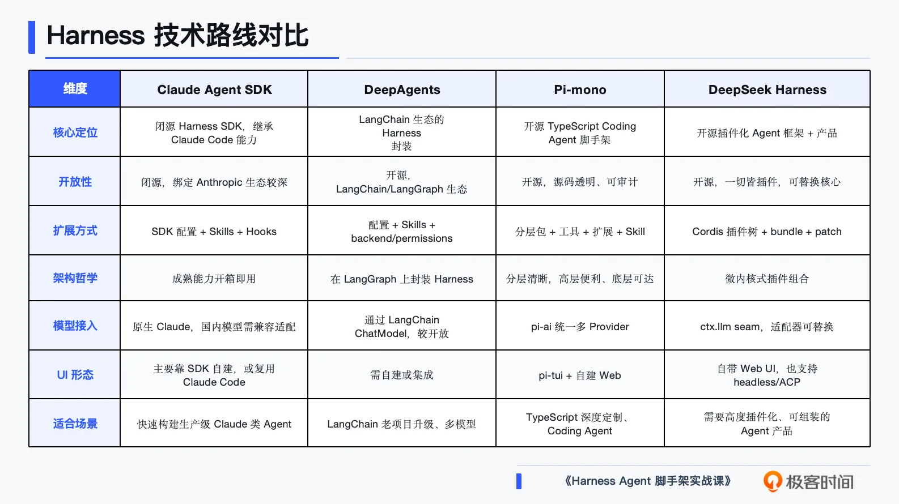

简单总结一下我们如何按需选脚手架。

- 如果你想要 **最快复刻一个 Claude Code 级别的产品**，Claude Agent SDK 依然是首选。

- 如果你的团队已经在 LangChain/LangGraph 上有很多积累， **DeepAgents 是平滑升级路径**。

- 如果你希望源码完全透明、想深度定制循环和 UI， **Pi-mono 是很好的开源选择**。

- 如果你相信“未来 Agent 能力应该像 VS Code 插件一样可插拔”，那 **DeepSeek Harness 值得你重点研究**。


下面我们通过几个简单的示例来从代码角度学会 dsh 的使用和开发。

## 示例一：快速启动带 Web 界面的 Agent

dsh 的一键启动体验做得非常简洁。假设你已经安装了 Node.js，执行：

```
npx @deepseek-ai/dsh web
```

默认会启动 Web UI，地址是 `http://127.0.0.1:3080`。

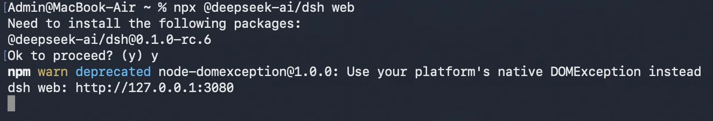

第一次打开界面，你需要做两件事：

1\. **配置模型**：进入“设置 → 模型”，输入你的 DeepSeek API Key。如果你使用其他 OpenAI 兼容端点，也可以在 providers 页面添加自定义 base URL。

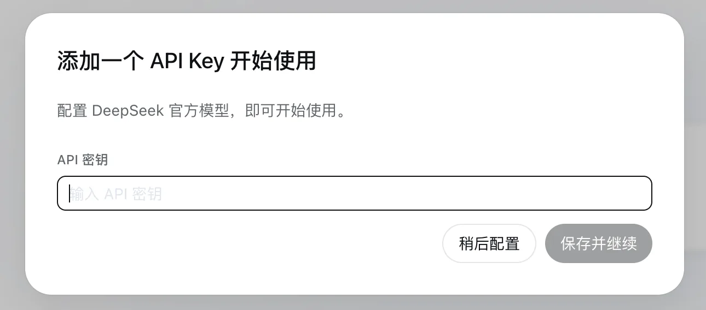

2\. **选择工作区**：点击“选择工作区”，添加你启动 Agent 时所在的工作目录，然后选中它。工作区（文件夹）是 Agent 默认能读写的文件系统边界。

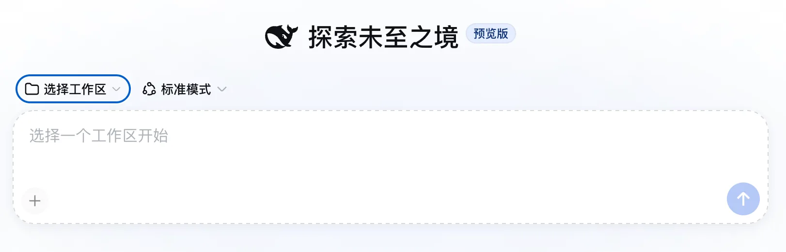

完成这两步后，你就可以在输入框发送任务了：

```
请分析当前工作区的项目结构，列出主要文件并说明它们的作用。
```

Agent 会调用 `ls`、 `read` 等工具，读取文件并生成回答。和 Claude Code 一样，当操作需要审批时，Web UI 会先弹窗询问。

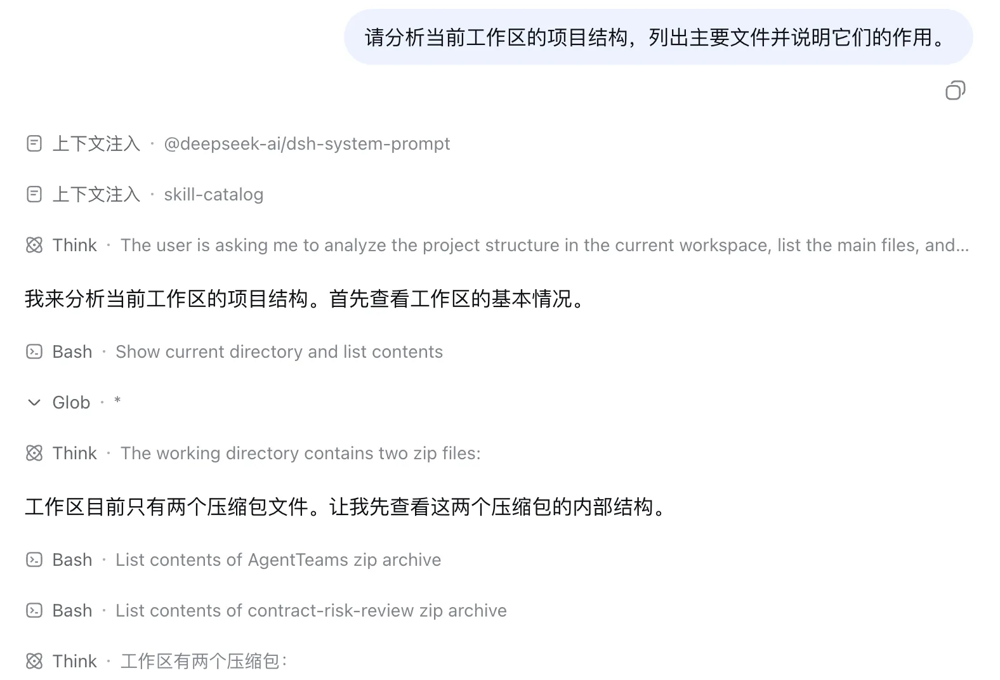

这个过程的思考和响应速度比其他框架要快得多。

如果你想从源码运行（适合后续开发插件），可以用后面的命令：

```
git clone https://github.com/deepseek-ai/deepseek-harness.git
cd deepseek-harness
pnpm install
pnpm run build
pnpm dsh web
```

## 示例二：为 Agent 安装插件

dsh 的插件安装命令非常直接。假设我们想装一个社区整理的插件市场 `dshmarket`，只需要执行：

```
dsh plugin --profile web add dshmarket
```

这里有几个概念需要理解：

- **profile**：位于 `$DSH_HOME/profiles/` 下，描述一份可启动的组合。 `web` 是默认的 profile 模板。

- **bundle（组合包）**：一个 npm 包，通过 `dsh.bundle` manifest 声明自己贡献了一个配置层。

- **dsh plugin add**：会把包安装进 profile，并自动把它追加到 `dsh.profile.bundles` 列表中。


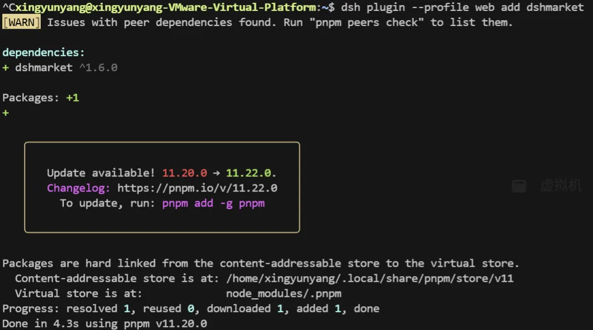

安装完成后，可以用 `--dump-config` 查看实际生效的插件树：

```
dsh --profile web --dump-config
```

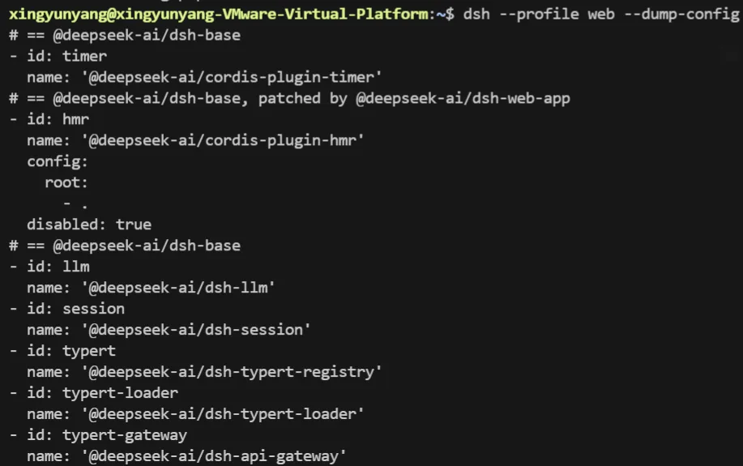

如果想安装 GitHub 上的插件，可以直接用 git 地址：

```
dsh plugin --profile web add github:you/awesome-plugin#
```

需要注意的是，git 安装拉取的是源码，因此包内需要包含 `prepare` 脚本来自行构建。pnpm ≥10 还会要求你在 profile 的 `pnpm-workspace.yaml` 里显式授权 `allowBuilds`，这一点在生产环境中要格外谨慎。

如果想要实现对话式安装插件（类似在爱马仕（Hermes）、龙虾中通过对话安装技能的效果），需要你安装一下dsh-find-plugin插件，命令为：

```
dsh plugin --profile web add dsh-find-plugin
```

这样，我们便可以通过网页对话，直接去安装插件。比如，我们安装一个在桌面上带宝可梦萌宠的插件：

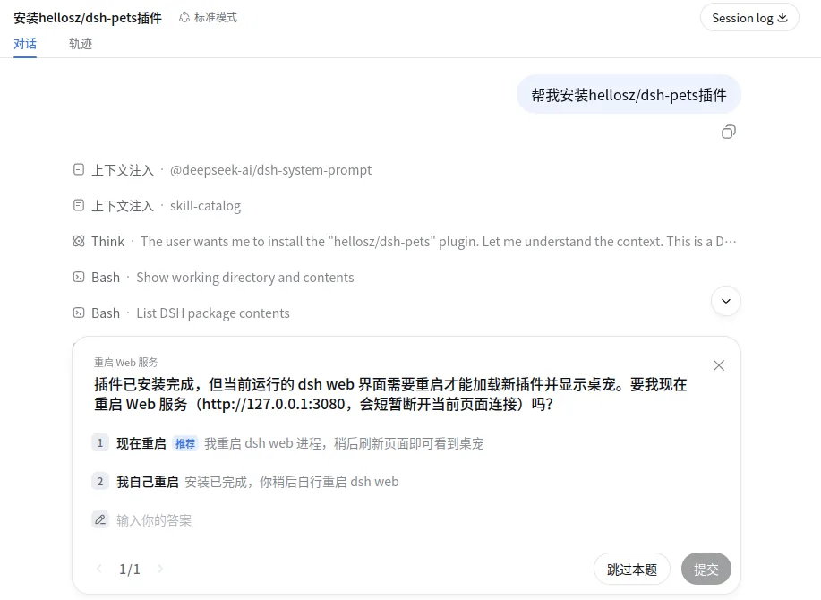

之后重启 Web 后，就可以看到皮卡丘了：

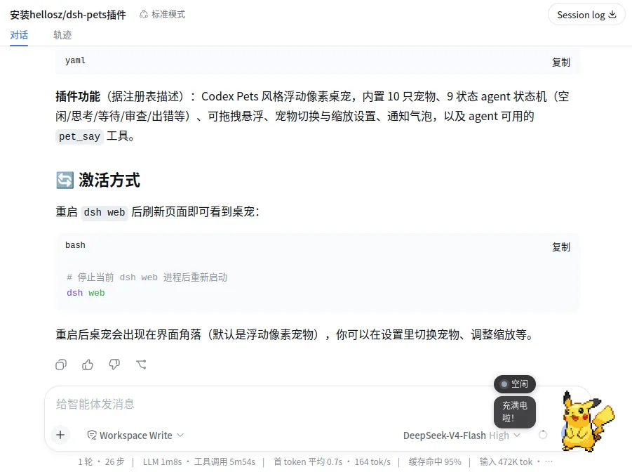

移除插件也很简单，使用下面的命令或者对话式要求移除均可。

```
dsh plugin --profile web remove dshmarket
```

## 示例三：开发并打包你的第一个插件

接下来我们动手写一个最小插件。假设我们要为 Agent 增加一个 `greet` 工具，它可以根据名字打招呼。

### 步骤 1：创建插件源文件

在仓库根目录创建临时目录：

```
mkdir -p scratch-plugin/src
```

创建 `scratch-plugin/src/my-plugin.ts`：

```
import type { Context } from '@deepseek-ai/cordis'
import { defineTool } from '@deepseek-ai/dsh-tools'

export const name = 'greet-tool'
export const inject = ['tools']

export function apply(ctx: Context) {
  ctx.tools.register(defineTool({
    name: 'greet',
    description: 'Greet someone by name.',
    parameters: {
      name: { type: 'string', required: true, description: 'The name to greet' },
    },
    output: {
      schema: { type: 'string' },
      render: (_args, value) => [{ type: 'text', text: value }],
    },
    async execute(args) {
      return `Hello, ${args.name}!`
    },
  }))
}
```

这里的关键点：

- `inject: ['tools']` 声明依赖，框架会等工具注册表就绪再加载本插件。

- `defineTool` 根据 `parameters` 推导并校验参数类型。

- `execute` 返回规范值， `output.render` 把它转成模型能看到的文本内容。


这份代码的 API 写法与官方内置插件（如 @deepseek-ai/dsh-tool-bash）完全一致，本身没有问题。但有两个坑必须在动手前知道。

第一个坑就是 **依赖解析位置**。插件文件里的 @deepseek-ai/\* 导入，是 **从插件文件所在目录向上** 查找 node\_modules 的。在 deepseek-harness 仓库里开发没问题（仓库根目录就有 node\_modules）；但如果你用的是 **全局安装的 dsh**（npx @deepseek-ai/dsh 或全局 npm 安装），把 scratch-plugin 放在任意目录启动会直接报 ERR\_MODULE\_NOT\_FOUND: Cannot find package '@deepseek-ai/dsh-tools'。

解决办法就是把插件目录放进 **profile 目录** 下，让 Node 沿目录向上找到 profile 自己的 node\_modules，例如：

```
mkdir -p ~/.dsh/profiles/web/scratch-plugin/src
# 把 my-plugin.ts 放到 ~/.dsh/profiles/web/scratch-plugin/src/ 下
```

另外 ，建议补一个 package.json 声明 "type": "module"。没有它的话，Node 需要把 .ts 文件重新解析为 ES 模块（会报 MODULE\_TYPELESS\_PACKAGE\_JSON 警告并产生性能开销）：

```
{ "type": "module" }
```

### 步骤 2：用 patch 方式本地加载

创建 `scratch-plugin/cordis.yml`：

```
- insert:
    - id: greet
      name: '/absolute/path/to/deepseek-harness/scratch-plugin/src/my-plugin.ts'
```

注意 name 必须是 **绝对路径**（全局安装场景就填 profile 目录下的绝对路径，如 /home/you/.dsh/profiles/web/scratch-plugin/src/my-plugin.ts），然后启动。

- 仓库开发模式：


```
pnpm dsh web --patch ./scratch-plugin/cordis.yml
```

- 全局安装模式（web 就是 --profile web 的别名，--patch 可重复使用）：


```
dsh --profile web --patch /home/you/scratch-plugin/cordis.yml
```

在 Web UI 里输入：

```
Use the greet tool to greet Ada.
```

Agent 就会调用 `greet`，并收到 `Hello, Ada!`。

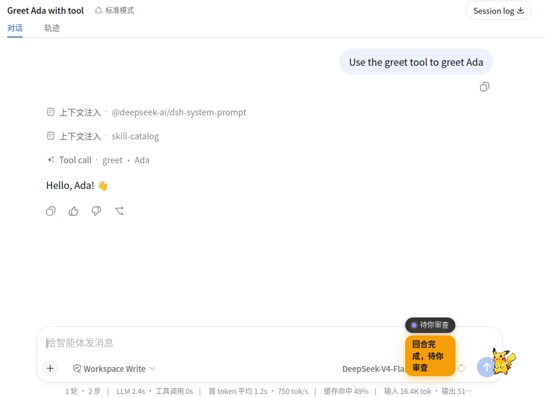

### 步骤 3：打包成可安装的 bundle

如果想把插件分享给别人，需要把它打包成组合包。目录结构如下：

```
hello-plugin/
├── package.json       # 声明 dsh.bundle
├── cordis.patch.yml   # 配置层
└── index.js           # 插件入口
```

`package.json`：

```
{
  "name": "dsh-hello-plugin",
  "version": "0.1.0",
  "type": "module",
  "main": "index.js",
  "files": ["index.js", "cordis.patch.yml"],
  "dsh": { "bundle": { "patch": "./cordis.patch.yml" } }
}
```

`index.js`（ **注意：bundle 应该把步骤 1 的 greet 工具真正带进来**，而不是只打一行日志——原版的 console.log 版 bundle 分享出去后，别人装上根本拿不到 greet 工具）：

```
import { defineTool } from '@deepseek-ai/dsh-tools'

export const name = 'greet-tool'
export const inject = ['tools']

export function apply(ctx) {
  ctx.tools.register(defineTool({
    name: 'greet',
    description: 'Greet someone by name.',
    parameters: {
      name: { type: 'string', required: true, description: 'The name to greet' },
    },
    output: {
      schema: { type: 'string' },
      render: (_args, value) => [{ type: 'text', text: value }],
    },
    async execute(args) {
      return `Hello, ${args.name}!`
    },
  }))
}
```

`cordis.patch.yml`：

```
- insert:
    - id: hello
      name: dsh-hello-plugin
```

安装到 profile：

```
dsh plugin --profile demo add ./hello-plugin
```

之后就可以用：

```
dsh --profile demo
```

来启动一个包含你插件的 Agent。

这个过程实测下来，同样有三个踩坑点。

**第一，本地目录安装是符号链接，bundle 必须自带依赖**。dsh plugin add ./hello-plugin 会把目录以 link: 形式装进 profile，并 **自动把包追加到 dsh.profile.bundles 列表**（不需要手改 manifest）。但 Node 解析符号链接时会回到插件的 **真实路径** 去解析 @deepseek-ai/\* 导入，默认会 ERR\_MODULE\_NOT\_FOUND。

解决办法是让 bundle **自带 node\_modules**（这也是发布到 npm 时 dependencies 的正确用法）：

```
cd hello-plugin
pnpm add @deepseek-ai/dsh-tools@^0.1.0-rc.6
```

**第二，demo profile 只有 base 层、没有 Web/headless 应用外壳**，dsh --profile demo 会加载插件后退出，适合验证“插件能装上、能加载”，但不适合交互。要在 Web GUI 里真正用上 greet 工具，把 bundle 装进 web profile 并 **重启 dsh web** 即可：

```
dsh plugin --profile web add ./hello-plugin
```

第三，npm 上 @deepseek-ai/dsh-headless 的 latest 标签目前指向一个依赖了未发布包的旧版本，直接装会报 404；需要时请 **显式指定版本**，例如 dsh plugin --profile headless add @deepseek-ai/dsh-headless@^0.1.0-rc.6。示例二里的 dshmarket 等社区包不受影响。

## 示例四：直接基于 dsh 开发插件

刚才示例三的代码开发过程，其实比较繁琐。在 AI 时代，我们其实不需要了解这么多细节，也可以开发。比如，可以直接在 dsh 的 web 页面上，发送“帮我开发一个能在飞书中使用 dsh 的插件”，让 dsh 会去阅读 dsh 的源码，学习如何开发插件，然后自动帮你完成开发。

你可以查看它的分析和产出过程，也能起到观摩和学习的效果。

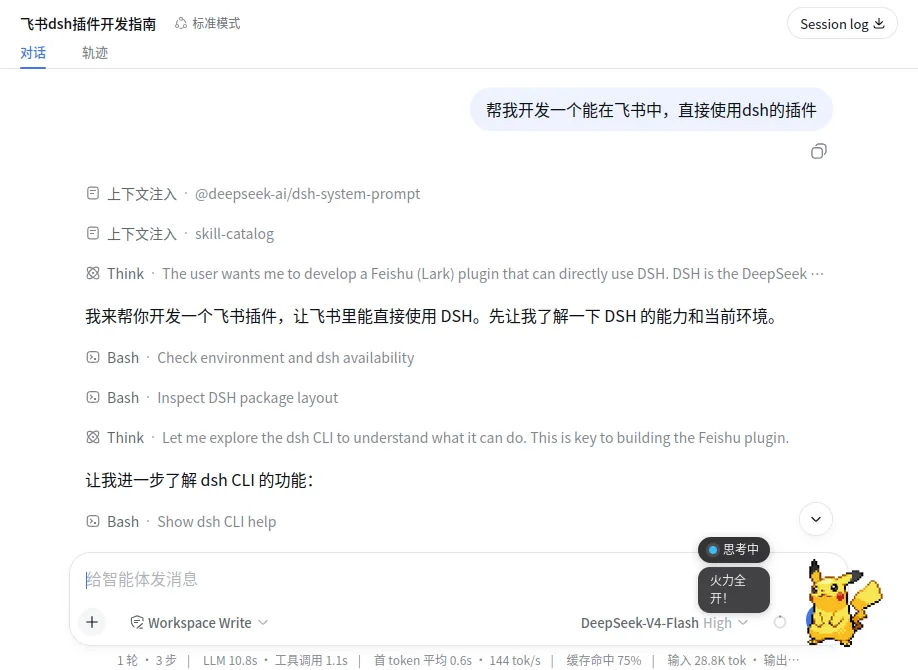

## 插件生态速览

虽然 dsh 还是开发者预览阶段，但社区已经围绕它长出了相当丰富的插件生态。 `awesome-dsh-plugin` 仓库整理了数百个插件，大致可以分为这样几类。

- **UI 增强**：侧边栏文件浏览器、命令面板、消息导航条、Diff 查看器、Mermaid 渲染、桌面宠物等。

- **用量与计费**：实时余额显示、Token 用量热力图、会话成本统计、多供应商钱包等。

- **主题与外观**：Catppuccin、QQ 2007、Cyberpunk 2077、液态玻璃、自定义壁纸等皮肤。

- **模型与账号接入**：Codex 订阅接入、Ollama、NewAPI、sub2api、模型路由与降级等。

- **工具与能力**：文件上传、语音输入、终端面板、Git 图、Web 预览、MCP 管理等。

- **记忆与工作流**：长记忆、TODO、计划模式、子代理监控、任务 DAG 等。


这个生态的活跃度说明，dsh 的插件化设计确实降低了社区贡献门槛。但也正如 awesome-dsh-plugin 仓库自己提醒的： **安装插件等于在你的机器上运行第三方代码，权限和你本人一样大**，收录不等于安全审查，安装前务必查看源码。

## 总结

DeepSeek Harness 是一个由 Cordis 驱动的、秉持“一切皆插件”理念的开源 Agent 框架，它后续会发展成什么样子，我们拭目以待。

现在，我们回顾一下这一讲的核心要点。

- dsh 既是可以直接运行的 Coding Agent，也是可以深度组装的底层框架。

- 一切皆插件：模型、工具、会话、Agent Loop 甚至 UI 都可以从配置层替换。

- Cordis 提供服务、注入、事件和可逆副作用机制，让扩展变得松耦合且安全。

- 与 Claude Agent SDK、DeepAgents、Pi-mono 相比，dsh 更强调插件化组合和可替换能力。

- 社区已经围绕 dsh 形成了丰富的插件生态，但安装第三方插件时要注意安全。


当然，dsh 目前仍处于开发者预览阶段，API 和包结构可能会快速变化。如果你现在就想在生产环境中使用它，建议先保持关注、在小范围内试验；如果你相信插件化是 Agent 框架的终局形态，那么从现在开始理解它的设计思想，会是一笔很划算的投资。

## 思考题

- 你认为“一切皆插件”的设计，在带来灵活性的同时，会引入哪些工程上的新挑战？

- 如果你要把前面学过的金融研报生成项目或合同审查项目迁移到 dsh 上，你会把哪些部分做成插件，哪些部分保留在业务代码里？

- 在 dsh 的插件生态中，你最想先试用或开发哪一类插件？为什么？


期待你在留言区踊跃发言，我们一起探讨。如果今天的分享对你有启发，也欢迎你把今天的内容分享给有需要的朋友。