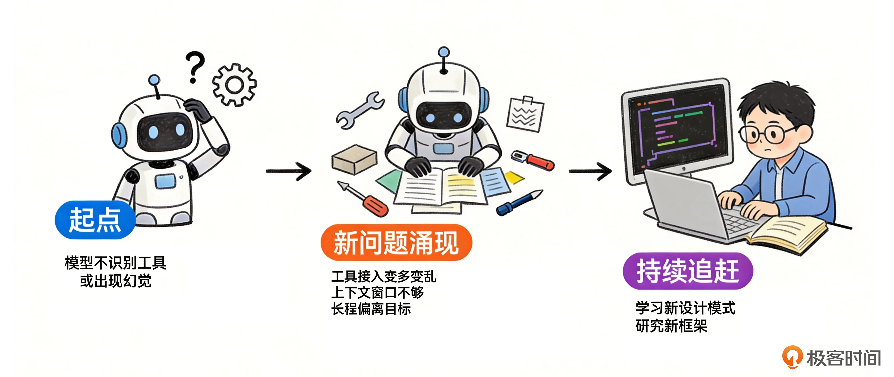
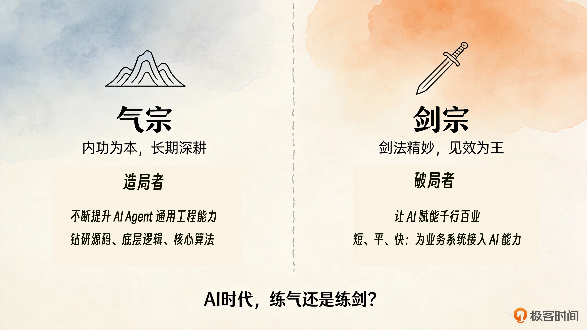
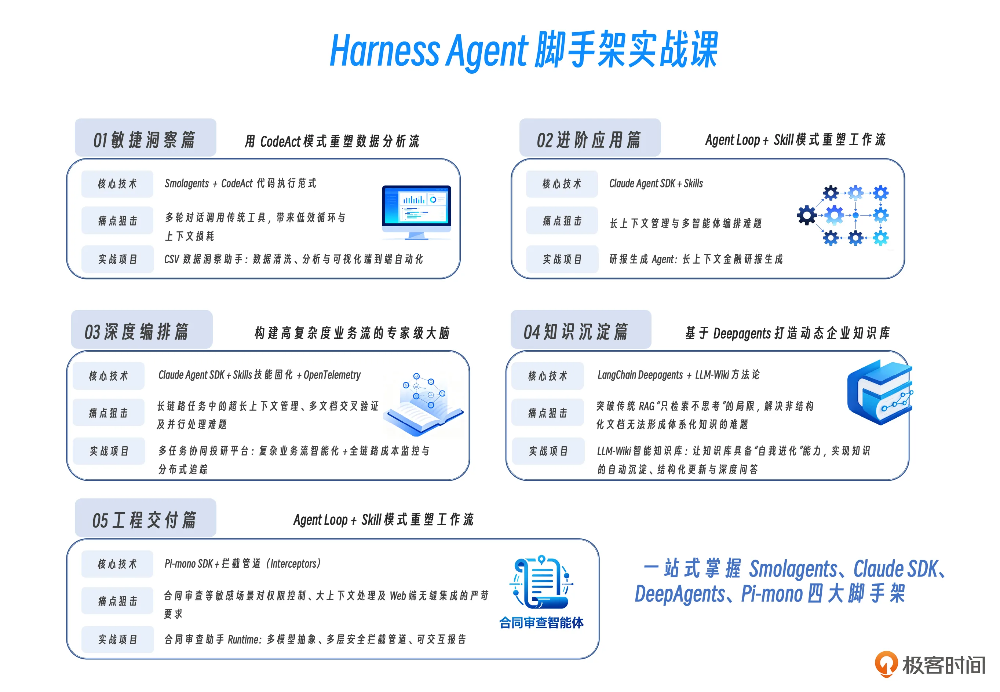

# 开篇词｜掌握四套脚手架，让 Agent 开发回归业务本身
你好，我是邢云阳。

时隔近一年，我带着全新课程 《Harness Agent 脚手架实战课》 再次和大家见面啦！

回望这一年，AI 技术的狂飙突进速度，足以用“震撼”来形容。想必各位 AI 开发者同行，在惊叹大模型能力持续突破、AI 产品层出不穷的同时，心里也藏着不少真切的感受。而我最深的体会，浓缩成一个字就是：累。

可能有朋友会问：“这么累为啥还要持续折腾？”说实话，看着 Claude Code 自动生成的代码越来越丝滑、漂亮，我也想过这问题。但我的答案是：作为工程师，如果哪天我不觉得累了，说明我已经彻底掉队，连新东西都懒得看了。

## 从学一门手艺到追一列快车

曾几何时，技术圈的红利周期格外漫长：学一套前端开发框架，稳稳用 8-10 年不成问题； 吃透 K8s 部署与应用开发，5 年以上的技术老本足够吃； 哪怕退一步，不去研究复杂的技术，只要精通一门后端语言、能写 API 接口，加上对业务的理解，也能在软件行业立足多年。

但进入 AI 时代，尤其是 2025 年下半年开始，这套旧逻辑被彻底颠覆。Claude Code、Codex 等工具的普及，让产品经理、律师、医生、歌手等等也能轻松实现全栈开发；K8s Yaml 编写、基础问题排查、Operator 开发，也早已不是拉开老员工和新员工差距的关键。

在这样的趋势下，所有人都在聚焦想法落地，也直接推动 AI 技术与产品迭代驶入快车道：龙虾（OpenClaw）、爱马仕（Hermes）、LLM-Wiki 等优质项目接连涌现，AI 领域新鲜事物的不断涌现，让我们疲惫且兴奋。

这一点，AI 开发者的感触远比旁人更深。

2023～2024 年，我们一度以为，AI 产品关键在模型的能力，只要深耕工具开发，搭配一个简单的 ReAct Agent，就能完成 AI 业务落地。要是模型不识别我们的工具或者出现幻觉，那就优化提示词。

可很快我们又迎来了新的挑战，比如：工具接入变多变乱、模型上下文窗口总是不够用、长程问题越来越偏离最初目标……这让我们不得不继续学习新的 AI 设计模式、新框架。

到了 2025-2026 年，Claude Code 等标杆产品爆火，全民开发 Skills、借助 AI 工具提效成为常态。很多非程序员朋友因为对自身业务更加熟悉，反而用 Claude Code 或龙虾 + Skills，做出了很多有意思的智能体产品。这给本身就受到冲击的程序员带来了更大的压力，我们依旧要马不停蹄地追赶新产品、学习新技术，才有可能成为新技术出现时，最先理解并熟练运用的那部分人。

## 认知过载的时代，AI 开发者如何建立核心竞争力？

无休止的追赶，也让我们不得不重新思考：AI 时代，到底该怎么规划自己的学习路线？

这让我想起《笑傲江湖》里的华山派气剑之争：一派是气宗，坚信“内功为本，剑法为末”，岳不群曾言“十年之期，剑宗占优；二十年之期，难分伯仲；三十年之期，气宗无敌”； 另一派是剑宗，推崇“剑法精妙为先，内功次之”，追求快速制敌、见效为王。

放到如今知识爆炸的 AI 时代，人的精力终究有限，每个开发者都面临着“练气”还是“练剑”的抉择：很多资深程序员是天生的“气宗”，偏爱钻研源码、底层逻辑、核心算法，追求“知其然，更知其所以然”；即便到了 AI 时代，依旧乐此不疲地深耕 Claude Code 泄露源码、龙虾项目源码……

一边是快速迭代、不追就落后的“剑宗式”实用技术，一边是夯实根基、长期受益的“气宗式“底层能力，AI 开发者究竟该如何平衡？

顺着“气宗”与“剑宗”的比喻，我们不妨把目光投向当下的 AI 开发岗位，了解 AI 开发岗位需求现状，你才能做出更清晰的判断。在实际的职场生态中，目前的 AI Agent 开发工作大致可以划分为两大阵营，它们对“气”与“剑”的侧重截然不同。

**第一类，是不断提升 AI Agent 通用工程能力的“造局者”。** 以 DeepSeek、Kimi 等企业为代表，他们致力于打造对标甚至超越 Claude Code 的 AI Coding 产品。对于身处这一赛道的开发者而言，深刻理解 Agent 设计模式、逐行剖析 Claude Code 等顶尖产品的源码，是日常工作的必修课。这不仅是技术进阶的阶梯，更是必须重点“练气”的根基，唯有内功深厚，方能在底层架构的博弈中立于不败之地。

**第二类，则是致力于 AI 赋能千行百业的“破局者”。** 他们可能就职于互联网大厂、做 FDE，或者配合 FDE 将 AI 能力接入传统企业的业务系统（如开发合同审查助手）；也可能直接扎根于传统企业内部，主导利用 AI 进行企业智能化转型。这类岗位的核心特征是“短、平、快”：业务需求极其庞大，一年几十甚至上百个需求是常态；项目往往聚焦于垂类智能体，技术难度未必极高，但周期极短，企业迫切需要看到降本提效的实际成果。

面对这种高频、快节奏的业务诉求，开发者最核心的竞争力在于“快”——能否迅速掌握业界前沿的 AI Agent 开发思想、套路与脚手架。在这个赛道里，效率就是生命。过去可能需要借助 LangChain 或 LangGraph 耗费数周、数才能搭建的复杂链路，如今借助 Harness 脚手架配合各类 Skills，往往能在极短时间内高效交付。

因此，对于这部分开发者而言，以“练剑”为主、“练气”为辅，才是顺应业务节奏的明智之举。 **将精力聚焦于实战招式与工程落地，用最快的剑法解决最迫切的业务痛点，方能在这个充满变数的 AI 时代游刃有余。**

从目前的就业形势与招聘需求来看，第二类工作，明显需求量要更大一点，因为这代表着企业从过去的数字化转型到现在的智能化转型的发展。

## 你的 Agent 开发能力提升指南

在现阶段，想要快速 Agent 开发能力，边做边学是效果最好的方式。但大部分人卡在这三类问题上。

- **技术选型难取舍：** 面对丰富的开源生态，如何能够评估与选型出符合自己业务场景与技术栈的 Agent 框架。

- **实战机会难获得：** 缺乏贴近真实业务约束的测试环境，导致技术停留在 Demo 阶段，无法形成工程化的能力闭环。

- **工程落地难推进**：从原型到生产环境的跨越中，面对复杂业务、多 Agent 编排、技能封装、安全交付等工程问题，如何充分利用 Harness 脚手架的众多能力？

我特别理解上面这些困扰，因为这些也是我经历过的。所以我从众多 Agent 开发的主流框架里，精心挑选了 **Smolagents、Claude Agent SDK、DeepAgents 和 Pi-mono 四大前沿框架**，并结合真实的项目实战，为你量身打造了这套课程。

**课程配套代码仓库在这里**：https://github.com/xingyunyang01/Geek04/tree/main

为什么选这四个脚手架？它们能在众多技术框架里脱颖而出，替代之前我们常用的 LangChain、LangGraph 等技术栈，且自带 Harness 能力支持，能够帮助我们快速构建高质量的生产级 Agent。

课程安排如下图所示：

**快速交付篇，主角是 Smolagents。**

传统工具调用型 Agent 在处理数据分析时，往往陷入“问一句→调一次→等结果→再问一句”的低效行动，上下文越积越重，效率越拖越低。并且固定的脚本工具，无法覆盖千变万化的数据需求，从而导致工具越设计越多。而 Smolagents 的核心设计—— CodeAct 代码执行范式改变了这种困境。在实现 CSV 数据洞察 Agent 项目的过程中，你将体会到 Smolagents 这个核心代码仅千行的轻量级框架多么好用。

**进阶应用篇和深度编排篇，主角是 Claude Agent SDK。**

你可能听说过 Claude Code。作为曾被誉为“世界最强 AI 编程工具” Claude Code 的底层孵化产物，这款闭源 SDK 能让我们构建出具备同等卓越能力的 Agent。

还记得 [去年课程](https://time.geekbang.org/course/intro/101074901 "xxx") 中，我们使用 LangGraph 搭建金融研报生成系统时，那庞大且繁琐的多 Agent 编排代码吗？这次彻底翻新。这次我们将利用 Claude Agent SDK 的自动上下文压缩和 SubAgent 机制，配合 Skills 技能固化，对原有项目进行改造升级，让你亲自感受工程效率的跃升。

深度编排篇，我们用同一个框架挑战更高难度——多任务协同投研平台。长链路下的上下文管理、多文档交叉验证、并行分支探索，这些靠传统编排很难优雅解决的问题，我们会借助 Fork 分叉机制和 Hooks 安全护栏逐一攻克，同时接入 OpenTelemetry 实现全链路成本监控与追踪。

**知识沉淀篇，主角是DeepAgents。**

如果你熟悉 LangChain，一定知道它曾有一个极简库叫 create\_agent，但它仅支持基础循环和工具调用。Deepagents 是它的全面进化版，融入了上下文管理、安全沙箱、文件系统、Skills 以及子 Agent 等一整套 Harness 模块，开箱即用。

这个篇章我们瞄准一个真实困境：传统 RAG 知识库做着做着就变成了“高级全文检索”，能查能答，但不会思考，更不会自己更新。而我们要实现一个 LLM-Wiki 智能知识库，将 LLM-Wiki 的“知识自我进化”理念直接封装为 Agent Skills，让知识库具备自动沉淀、结构化更新与深度问答的能力。对于已有 LangChain 技术栈的团队，这是让老项目拥抱 Harness 的最低成本路径。

**工程交付篇，主角是 Pi-mono。**

你可能对这个名字陌生，但它的“外壳”你一定听过——OpenClaw。从架构上看，OpenClaw 只是套了一层支持飞书等 IM 交互和定时任务调度的皮，真正的执行引擎正是 Pi-mono。

它是 TypeScript 生态中难得一见的全功能 Harness 脚手架，且完全开源。如果你需要在 Web 前端集成 Agent 能力，或面对权限合规要求极高的场景（如支付场景），TypeScript 栈几乎是绕不开的选择。

对应的实战项目是合同审查助手 Runtime。我们会借助 Pi-mono 的分层架构实现多模型抽象，通过多层安全拦截管道（Interceptors）保障权限校验与合规审查，并利用 ChatPanel 组件让审查报告可交互展示。

整个课程安排得非常紧凑，且浓缩了大量 Agent 开发中的典型项目。无论是希望进阶自己能力的 AI 开发者，还是转型到 Agent 赛道的传统开发同学，都可以通过课程学习一次性掌握这四个 Agent 开发主流框架。

**我期待你能从这门课带走三样东西。**

- **一套“场景→框架”的选型方法论。** 以后再遇到新业务，你不再需要在各个框架的文档之间反复横跳、纠结选型，而是能快速判断：这个场景适合轻量的 CodeAct 方案，还是需要 Claude SDK 的深度编排，抑或是需要统一 LangChain 技术栈的 Deepagents ，又或者因选型 TypeScript 栈而选择 Pi-Mono。

- **四个可以直接拿去用的实战项目。** CSV 数据洞察助手、多任务协同投研平台、LLM-Wiki 智能知识库、合同审查助手 Runtime——每一份代码都是可以复用到你自己业务中的真实资产，而不是玩具级别的 Demo。

- **一次彻底告别“越学越废”的成长体验。** 所有的知识点服务于实战项目，而项目里凝聚了诸多业务痛点的解决方案。你跟着走一遍，就等于亲自踩过了这些坑，下次遇到类似问题，你知道怎么拆、怎么选、怎么交付。最后再有一个整体的一句话收尾。

AI 应用开发这个领域变化太快，没人能保证你学完就成专家。如果你能跟着我，把这四个脚手架用起来，并且踏踏实实把课程中四个项目亲自动手操练一遍，不敢说让你“豁然开朗”，但至少能让你具备快速实现生产级 Agent 的工程水平。这样未来你再面对一个新的 Agent 需求时，不会茫然无措——你知道从哪里下手，也知道用什么工具收尾。

别再做旁观者了，去成为造浪的人。现在，请跟随我快速上手 Harness 脚手架的使用套路，然后举一反三，一起把脑海里反复排练的诸多想法，变成真正能跑起来的 Agent 吧！