# 直播回放：5 倍效率提升，用 DeepAgents 重构 Agent 开发流
> 直播嘉宾：邢云阳 资深 AI 技术专家

极客时间的朋友大家好，我是邢云阳。我上一门课程完结大概在去年 2025 年 11 月份，到现在有 7 个月没和大家见面了。这段时间我也比较忙，主要是换了一次工作，目前做的是 AI 和业务协同方面的工作，比如把 AI 赋能到业务当中、给企业提效等场景。

今天给大家讲一个全新的框架——DeepAgents，我起的标题叫做“5 倍效率提升，用 DeepAgents 重构 Agent 开发流”。今天我们不怎么深讲技术，技术是次重点。我们主要聊思路——今年 AI 发展速度这么快，我们做 AI 开发相比于去年，发生了哪些思路性的变化。

## 从工具调用到 Harness 的四个阶段

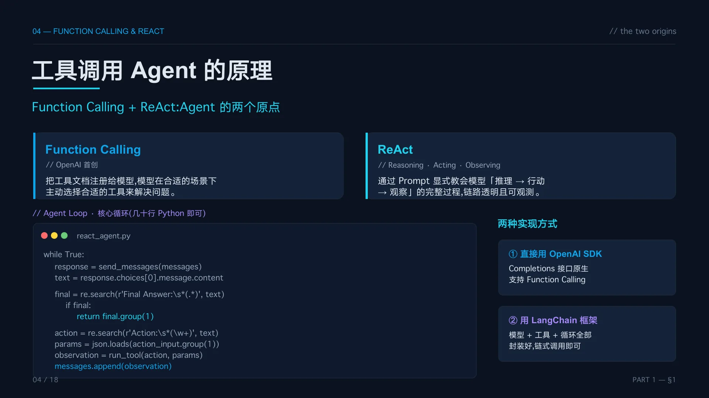

### Agent 的两个原点

从 2023 年开始回顾，ChatGPT 火爆之后，工具调用型 Agent 的概念就被提出来了。当时有两个方法。

第一个是 Function Calling，利用模型内置的能力，让模型在合适的场景下主动选择工具来解决问题。第二个是 ReAct，即使模型本身不具备某些能力，比如方程求解，我们通过一段 ReAct 提示词赋能给它，它也能具备推理、工具选择、调用结果观察这一系列完整链路。

而且 ReAct 的思想相比于 Function Calling 更加透明，每一步的执行过程都便于观测。直到今天，很多大型智能体软件比如 Claude Code，底层依然有 ReAct 的影子。虽然不再是简简单单一个 while true 就搞定了，但 ReAct 的思想仍然是做智能体非常重要的底层思想。

当时用代码实现也非常简单，可以直接用 OpenAI 的 SDK，借助 Completions 接口，在一个 while 循环当中不断和模型对话，拆解返回内容就可以实现 Function Calling 和 ReAct。如果想再简洁一点，当时有一个很火的框架叫 LangChain，它把模型调用、工具调用、各种循环全都封装好了，链式调用几行代码就能搞定。主要工作就放在开发工具上，把后端 API 转化成工具，死命地往模型里塞，这是当时比较野蛮粗暴的做法。

但大家很快发现这么做是不行的。工具不是塞越多就越强大，塞多了之后模型自己也会出现幻觉，都不知道该调哪个工具了。工具的上下文会对模型的上下文窗口造成严重影响。

### 设计模式涌现

如何解决这些问题？到了 2024 年左右，多种设计模式涌现出来了。

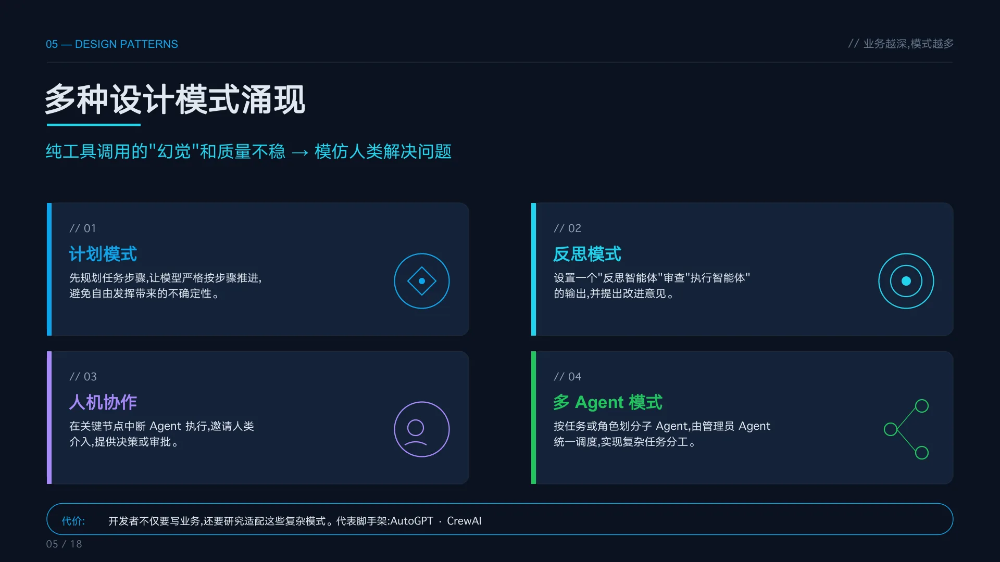

比如计划模式，两个智能体一个生成计划、另一个按计划执行。反思模式，一个智能体执行、另一个反思，把反思结果和下一步该怎么做反馈给执行智能体继续做。还有人机协作，直到今天依然非常重要，我们平时用 Claude Code时，它经常做着做着突然停下来，给出 1、2、3 的选项让我们去选择、去确认。多智能体模式，按任务或角色划分智能体，不过现在我们更多是从上下文的角度去考虑多智能体的分工。

这些设计模式代表了当时那个时代的发展。简单的一个 Agent 加工具已经解决不了问题了，我们需要从业务出发去设计智能体，让它走得更加健壮。当时做 AI Agent 开发，至少一半以上的时间都在做 Agent 健壮性的开发，只有差不多 40% 的时间才能顾及到工具和 MCP。

### 工作流接管控制权

再往后，我们进入到了工作流和 LangGraph 的时代，差不多是 2024 年下半年到 2025 年上半年。工作流出现的目的，是因为不管是用提示词还是计划模式，有时候还是很难约束模型的行为——当时的模型没有现在做得这么丝滑，提示词 1、2、3、4、5 都写好了，它还是可能跳步或者漏步。为了让它严格按规定步骤执行，我们只能不再相信模型，把模型仅仅当作内容生成器，模型以外的流程控制由人工通过工程化手段来完成。

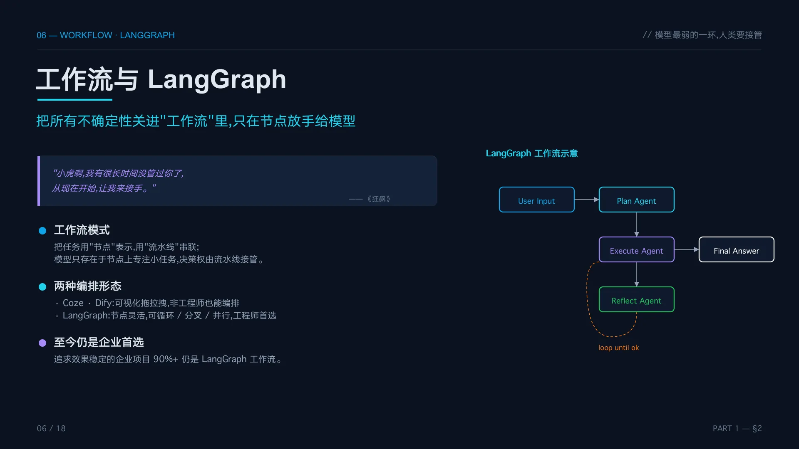

工作流的实现也很简单。过程有 5 个步骤就设 5 个节点，每个节点可以是 Agent 也可以是简单的模型调用，让第一个节点执行步骤一、把结果传给第二个节点，通过外部工程化手段控制整个流程的执行。

用《狂飙》里强哥的经典语录来形容，非常形象。唐小虎放飞自我做事没通知强哥，还惹了很多麻烦，强哥知道之后就说：”小虎啊，我有好长时间没管过你了，从现在开始让我来接手。”这就是从模型自主决策到工作流的转变。时至今日，追求效果稳定的企业项目 90% 以上仍然是 LangGraph 工作流。

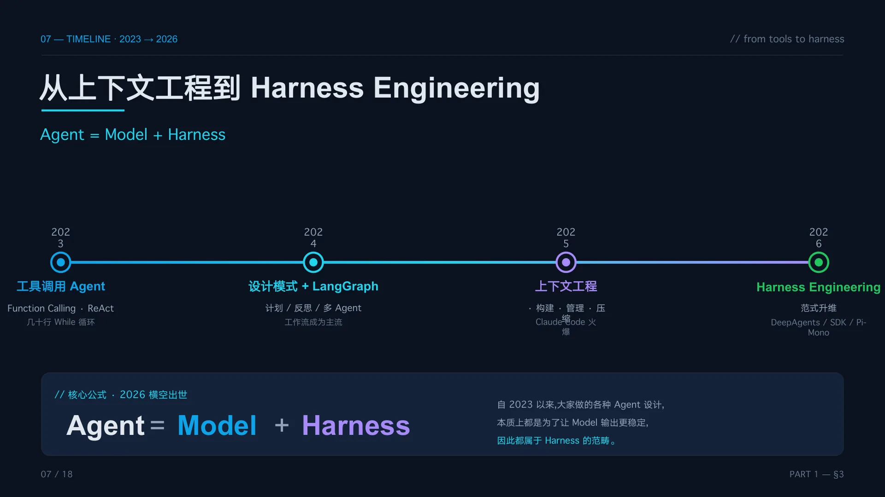

### 从上下文工程到 Harness 时代

再往后就进入了上下文工程时代，差不多 2025 年 5 月之后。之前我们无脑地往模型里塞各种信息——大段提示词、大段参考资料，用 RAG 发现召回不准就干脆把整篇文章稍微删减一下直接灌给模型，接一堆 MCP Server，一个 Server 就有 100 个工具，模型啥事没干，20% 的上下文就被吃掉了。所以上下文工程从“如何构建上下文”转向了“如何管理上下文”，这个阶段需要做很多非业务的工作，比如上下文压缩。

到了 Harness 时代（大约今年 2 月份），突然发现整个思路好像升维了。之前我们需要自己去用 LangChain、LangGraph、CrewAI 这些框架，但它们具备的只是最基础的功能——帮你封装模型调用、工具调用这些底层的东西。上层如何把东西用好，不在框架的范围之内，需要你自己干。

但到了 Harness 时代，这些事情好像不需要自己去干了。很多非程序员——律师、业务研发、药物研发、汽车研发——他们听说 Claude Code 好用，装上去再装上 Skill，发现啥事不用干，光提问就能把工作做好。今年 OpenClaw、Hermes 火了之后也是，全民都在装，装上 Skill 就能做事情了。而且这些东西随叫随到，有些长任务执行三四十分钟也能搞定，定时任务也能搞定。

这个时代有一个有意思的现象：好多非技术背景的人用 Harness 框架用得比程序员还好。因为程序员往往被限死在框架思维当中，觉得处理表格还得写程序、调用库。我有个同事不是程序员，装好 Hermes 直接拿来做表格，做得非常好，输出效果和他手工用 Excel 做的一样。我问他怎么知道 Hermes 能做表格的？他说：“其实我不知道，但我觉得这东西被吹得这么厉害，要是连表格都做不了我还装它干啥？”所以他就去试了，结果发现 Hermes 内置了表格处理技能。

**这就是一个思维方面的转变——技术变成第二位了，不再是那么重要的事。**

这也可以引起很多反思。之前自己去搞上下文压缩、搞计划模式、拿底层的 LangChain、LangGraph 框架去做，到现在还有没有意义？我们做的能不能比 Claude Code 更好？如果不行的话，要不要转变一下思路，用现在已经做好的东西来升级老项目？

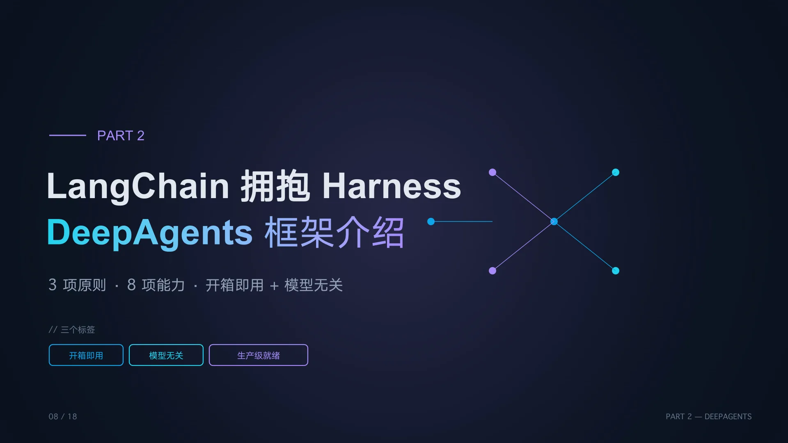

## DeepAgents 框架介绍

### 三个设计原则

基于这样的思考，今天给大家带来一个框架——DeepAgents。它是 LangChain 社区拥抱 Harness 的产物，也是 LangChain 的第三代框架：第一代 LangChain，第二代 LangGraph，第三代就是 DeepAgents。

Harness 的核心很简单——让 Agent 跑得更稳定。从 2023 年以来我们做的各种设计模式和各种操作，初心都不是在炫技，而是为了解决模型输出不稳定的问题。这些都属于 Harness 的范畴。之前 LangChain 只能帮我们封装模型调用和工具调用，LangGraph 只能拼节点做连连看，更高级的稳定性问题它们搞不了。进入 Harness 时代后，大家发现用底层东西太麻烦了，根本达不到 Harness 的要求。所以 LangChain 与时俱进，推出了 DeepAgents——一个开箱即用的 Harness Agent。

它有三个设计原则。第一是 **开箱即用**，几行代码调一下接口就能拿到一个完整封装的 Harness Agent，直接把提示词和技能提交给它就能做事。第二是 **模型无关**，不像 Claude Agent SDK 天然和 Claude 系列模型绑定，DeepAgents 是开源社区的框架，各种模型都能用，模型部分还是用以前 LangChain 的代码，不需要做任何改变。第三是 **生产级就绪**，提供可观测、可部署、沙箱、文件系统等能力，完全可以用于生产环境。

### 八项核心能力

DeepAgents 核心的 Harness 能力一共有 8 项。

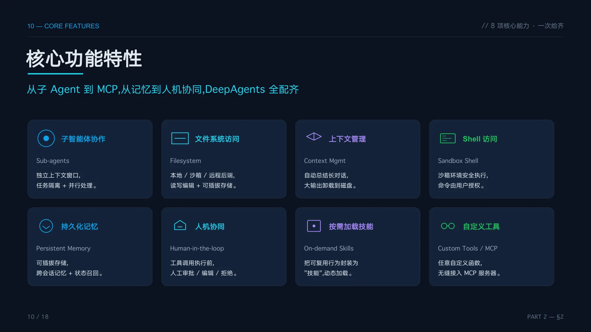

首先是 **子智能体协作**（Sub-Agents），这在上下文工程时代以来变得非常重要。一个智能体的上下文是有限的，放太多上下文会造成污染，不如拆成多个子智能体，让它们各自独立处理任务，最后只把干净的结果给主智能体。

第二是 **文件系统访问**，我们知道使用 Claude Code 的时候，通过 read、write、bash、glob 这几个简单的操作系统级工具就能读写本地文件、查看代码库。这个功能现在已经是做 Agent 的必备功能了，不管是做代码还是做业务都需要大量文件读写操作。既然涉及文件系统就要考虑安全性，所以本地沙箱、远程沙箱、虚拟文件系统等可插拔后端必不可少。

第三是 **上下文管理**，在上下文工程时代我们做了很多探索，各厂商互相借鉴思路，现在也都能做得差不多。套路就那几种——把工具调用结果替换成占位符、多轮对话总结、大输出卸载到磁盘，都比较公开透明了。

第四是 **Shell 访问**，和文件系统访问的区别在于它能执行命令行操作。 **去年我讲过一个核心思想——大家要重视 Coding Agent 模式，它在未来一定会成为做智能体的第一大模式。** 现在也应验了，像 Claude Code 去做任务的时候，工具调用只是辅助，更多时候是写一段代码然后执行，用代码的方式完成业务。比如做爬虫，以前写死爬虫文件当工具给 Agent 调用，网站结构变了就得改工具；现在可以让 Agent 自主分析网页结构、生成代码去爬，失败了就改代码再爬，非常灵活。能执行代码命令就离不开 Shell 工具。

第五是 **持久化记忆**，涉及上下文工程中研究的长短期记忆等。

第六是 **人机协作**，危险操作和需要人类确认的地方让人去点一下，有权限管理——全放通还是部分放通。

第七是 **按需加载技能**，现在开发 Agent 的新范式——之前是开发一堆工具塞给 Agent，现在可以写技能让 Agent 渐进式加载，既省上下文又能按步骤执行。第八是 **自定义工具**，在内置工具和技能之外确实需要调工具的地方，比如访问数据库，可以通过 MCP 等方式接入。

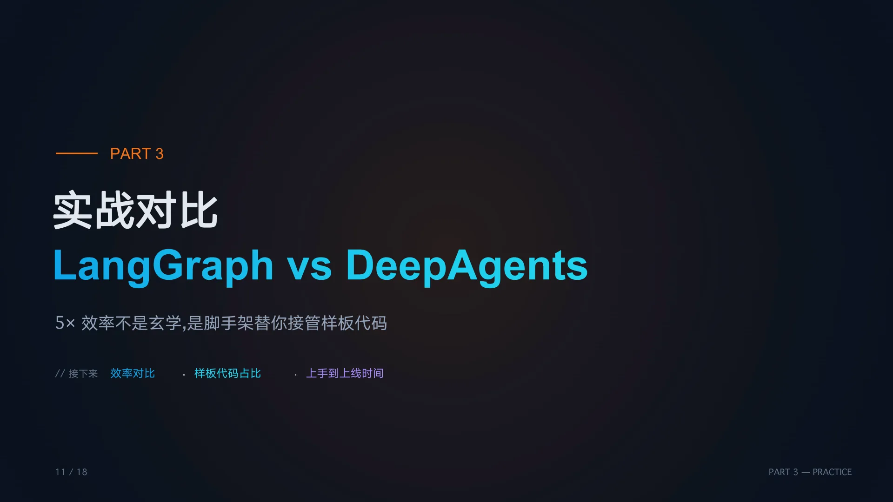

## 实战：LangGraph vs DeepAgents

前面讲了从 2023 年以来 Agent 开发思想的转变以及 DeepAgents 框架的介绍，接下来我们做一个实战对比，看看以前用 LangGraph 和现在用 Harness 框架做业务开发有什么不同。

### LMM-Wiki：从检索到编译

今天用的例子是 LMM-Wiki，几个月前由卡巴西提出来的，当时比较火，说是能替代 RAG，确实效果也比 RAG 好。RAG 搞到现在检索率提升还是比较慢。

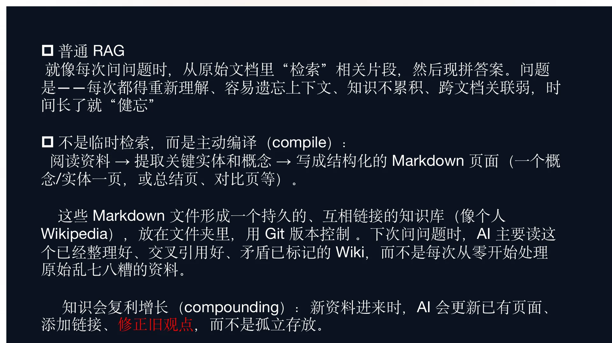

普通 RAG 每次提问时从原始文档中检索相关片段、拼出答案给用户。问题在于每次是无状态的——这次检索和下次检索之间没有任何联系，每次都需要重新理解问题，容易遗忘上下文，时间长了就健忘。

LMM-Wiki 的理念不是临时检索，而是主动编译。拿到文档后，用 AI 提取里面的实体和概念，写成结构化的 Markdown 页面，形成一个持久的、互相链接的知识库，就像个人 Wikipedia 一样放在文件夹里用 git 做版本管理。下次提问时 AI 读的是已经整理好、交叉引用好的 wiki，而不是每次从零处理原始资料。不管是检索效率还是各方面都有显著增强。而且新资料进来时，AI 会更新已有页面、添加链接、修正旧观点，知识是复利增长的。

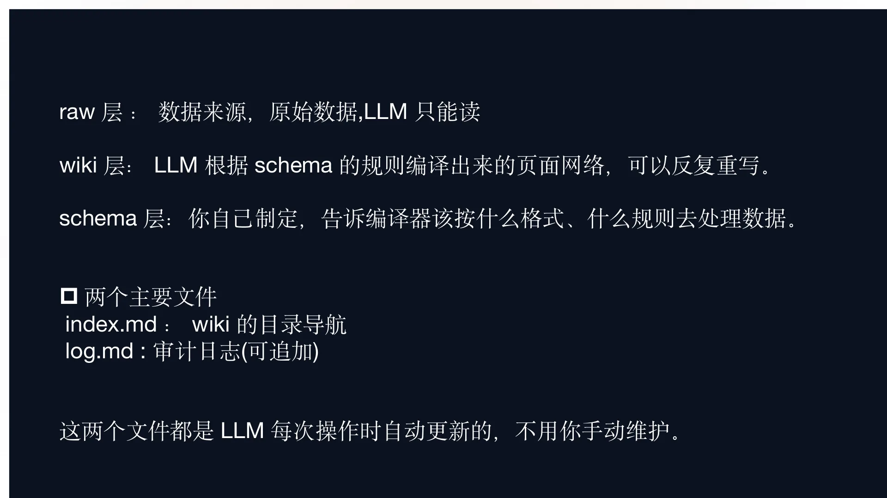

LMM-Wiki 主要分成三层。第一层是 raw 层，存放原始文件，比如从网上爬取的网页、PDF 等，LMM-Wiki 只能读不能改，不能破坏原始数据。第二层是 wiki 层，就是最后生成的个人 wiki，是模型根据预定义规则编译出来的 wiki 页面和索引页面，可以反复读写、交叉修改。第三层是 schema 层，定义如何从原始文件中提取实体和概念的规则，告诉模型按什么格式、什么规则处理数据。

在 wiki 层中有两个文件比较重要：一个是 index.md，wiki 的目录导航，每加一个文件就生成一条链接和摘要；另一个是审计日志，可追加的，方便追溯之前追加了哪些文件、做了哪些修改。这两个文件模型每次都会自动维护，不需要手动做。

### 50 行代码搞定

大家可以想想，现在产品经理已经给了需求、告诉你思路了，在没有 Harness 之前——时间回到 2023 年到 2025 年——这个事应该怎么做？大多数人会选择 LangGraph，因为很明显这里面有很多工作流：根据规则读取文件、编译文件、更新日志，有先后步骤的规定。但用 LangGraph 做确实比较复杂。

现在我们看看使用 DeepAgents 怎么做。首先不看 Agent 代码，先看技能。过去用工作流定义 1、2、3、4、5 步，现在完全可以用技能的方式代替工作流。

我们把 LMm-Wiki 的核心理念和操作流程交给 AI，让 AI 帮我们生成一个初版的 Skill。它不同于 RAG 每次从头检索，而是持续构建并维护结构化的 Markdown 投研 wiki；可以导入新资料，大模型去阅读提取关键信息整合到现有 wiki 中。定义好三层目录结构，再把各种操作规则固化到 Skill 里——导入资料时先提取 PDF 内容、创建摘要页、更新个股行业页、更新索引、追加操作记录，查询和维护等操作也有各自的可执行步骤。

有了这个 Skill 之后，用 DeepAgents 只需要 50 行代码，就这么多了，再写就是前后端交互、并发这些与 Agent 无关的操作了。

DeepAgents 秉承了 LangChain 社区一贯的风格。在 LangChain 时代可以直接获取一个带 Function Calling 功能的 Agent，接口叫 `create_agent`；到了 LangGraph 时代有 `prebuilt_agent`；到了 DeepAgents 时代，接口改叫 `create_deep_agent`，调一下就自动创建好一个带 Harness 的 Agent，具体实现全都封装在里面。所以在老项目中升级也挺简单的，换换接口工作已经完成 80% 了。

这个接口传几个参数：模型定义用的还是 LangChain 老代码的格式，和 DeepAgents 没有任何关系；backend 是可插拔后端，今天我需要执行命令行操作就选了带 Shell 功能的 `local_shell_backend`，设置了目录权限防止逃逸；skill 参数就是把 Skill 放在某个目录下、把路径丢给它。然后写一个 while true 循环实现连续对话，把用户提示词交给 Agent、通过 invoke 函数运行、打印输出。就这么简单。

现在这些业务都比较复杂了，不像以前一两分钟结果就出来，有时候要运行十几二十分钟。我在直播前跑了一遍效果：代码刚写好时 data 目录不存在，我输入 `创建知识库`，它就把目录建好了，包括 raw 和 wiki 两个文件夹，raw 下面有 source 存静态资源，wiki 下面有 schema、log、index。

创建完之后它提示我把 PDF 文件放到 raw 文件夹下。我准备了一份燕京啤酒的年报 PDF 放进去，输入“导入燕京啤酒财报 PDF 到知识库”，这个过程等待了十几分钟。它先调了一个微软开源的 PDF 转 Markdown 工具把 PDF 转成 Markdown（这个命令行工具我写到了 Skill 里），然后拿 Markdown 去做编译。最后在 index.md 中加了一行燕京啤酒的 wiki 条目，生成了行业综述、资料摘要，日志也非常详细。

**现在这种 Skill 加 CLI 的方式也是开发主流，替代了传统使用 MCP 的模式。**

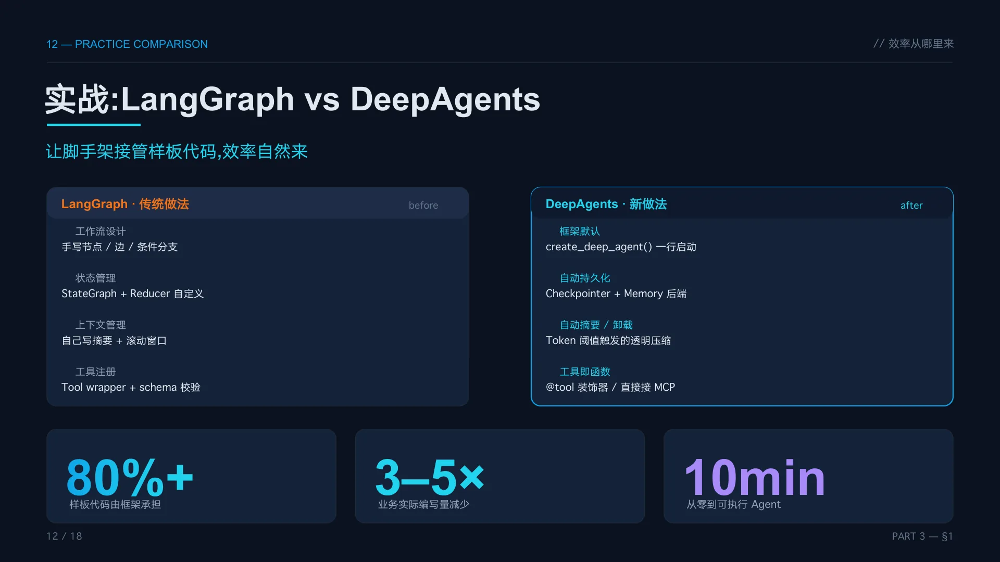

整个过程用了差不多 50 行代码，如果不做控制台交互可能就是 30 行甚至 20 行，主要时间都花在如何把 Skill 编好。

那如果用 LangGraph 做同样的事呢？我用 Claude Code 分析了这个 Skill，让它画出了 LangGraph 的节点图。从 Skill 中可以看到它涵盖了不同模块的很多步骤，每一小段步骤都可以是一个 LangGraph 工作流。整个系统有一个总的工作流图，里面有意图分类器判断是创建知识库、导入还是查询，根据不同意图匹配到不同的子工作流。最复杂的插入操作工作流涉及 PDF 转 Markdown、读取工具、抽取摘要、新建摘要页、做关联、更新各种文件等等，整个过程非常复杂。每一个节点对应一个 LangGraph 节点，实际做过 LangGraph 开发的同学都知道，光定义这些工作流节点就要花很多时间，代码量非常大。

对比一下：LangGraph 传统做法需要手写节点、边、条件分支、状态管理、上下文管理、工具注册通通自己来。DeepAgents 相当于把手动挡的车变成了自动挡，各种功能都内置好了，开箱即用，一行就能把 Agent 启动，还附加了各种管理功能，比我们自己纯手写的要强好多——毕竟人家是专业做这个的，天天在研究，还有很多开源贡献者贡献代码。而我们在业务工作中一方面要分心业务、另一方面要做 Agent 开发，完全不是一个量级。

**仅仅是定义节点就要花费大量时间且代码量巨大的 LangGraph，换成 DeepAgents 一行搞定、代码简洁，可以减少 80% 到 90% 的代码，实际效率五倍不止，差不多 10 分钟做一个 demo 出来没问题。**

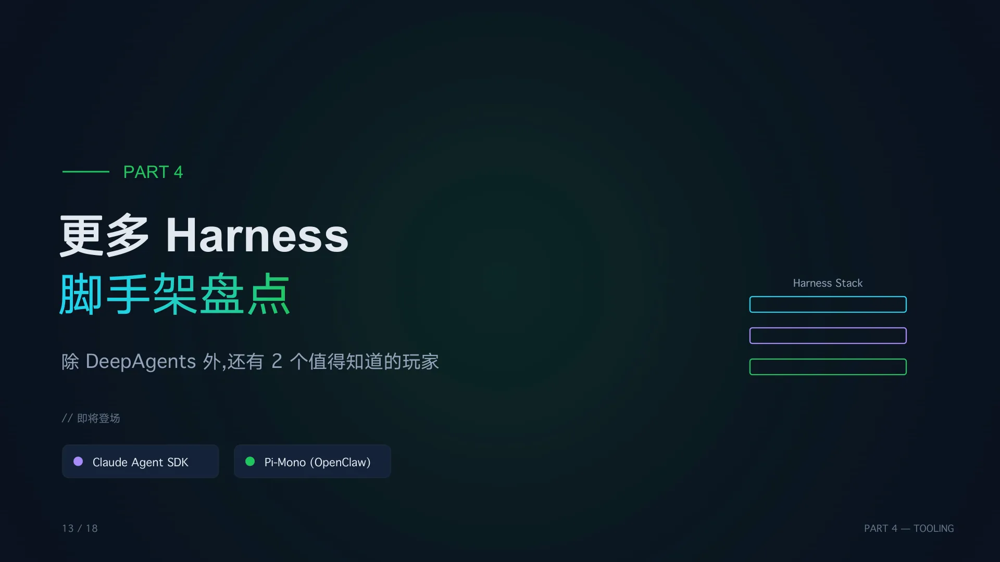

## 更多 Harness 脚手架

除了 DeepAgents，还有两个值得知道的 Harness 框架。

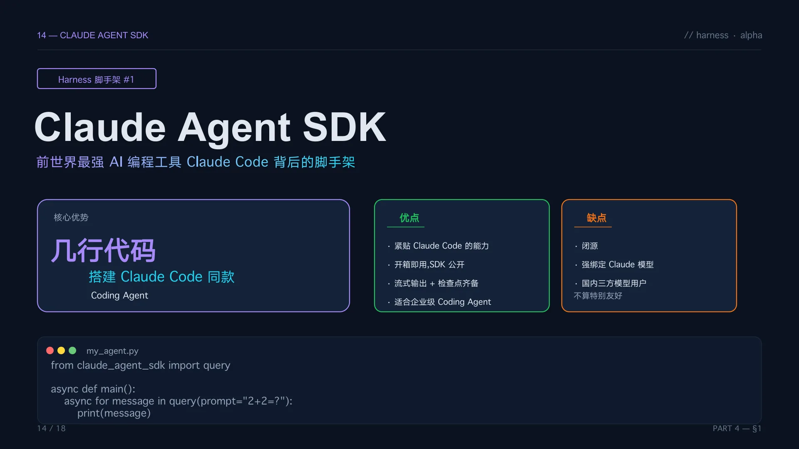

### Claude Agent SDK

第一个是前世界最强 AI 编程工具 Claude Code 背后的脚手架——Claude Agent SDK。

在 Skill 没有火之前，大家很长时间都以为 Claude Code 就是一个 AI 编程工具，功能就是写代码，并不以为它还能做业务。但从 Skill 开源之后，网上有了很多 Skill，大家逐渐知道接入 Skill 的 Claude Code 可以做各种各样的业务了。但如果要做一个公司内部的产品，不可能底层分一个 Claude Code、接几个 Skill、上面套个前端这么搞。

更官方的方式是使用它提供的 SDK，用几行代码就能搭建一个 Claude Code 同款的 Coding Agent。引入 query 函数，把提示词塞给 query、遍历返回的消息打印出来，一次与 Agent 的对话就完成了，代码非常简洁。

优点不用多说，Claude Code 公认世界最强不是白吹的，各种 Harness 能力都具备、非常全套，开箱即用快速搭建 Agent 没问题，企业级应用也能直接用。但对于国内用户来说缺点也很突出：它闭源了，偷偷改点什么东西我们不知道。之前我接国内模型，可能这个月还可以用，下个月更新版本后发现调工具出现 400 报错，回退一个版本发现又行了——存在国内模型接口和 Claude 接口更新频率不同步的问题。

所以如果能做海外项目或者有机会用原版模型的话，使用这个 SDK 非常丝滑、能力也很强大。但如果使用国内模型，需要选好版本，更新后还要做好重新适配的心理准备。

我也给大家演示一下使用 Claude Agent SDK 升级项目的效果。去年我做了一个金融研报生成的项目，当时用 LangGraph 做的，功能比较多——要抓财务数据、股东信息、行业信息等各种数据，然后做分析、计算利润、生成阶段性报告、画图，最后整合成完整的金融研报。当时有七个节点，每个节点都是一个 Agent，内部也很复杂，代码量挺大的。

今年我用 Claude Agent SDK 重构了这个项目。代码只有 103 行。 **之前那些节点都去哪了？都转化成了 Skill——一共七个 Skill**，是我让 Claude Code 分析去年的 LangGraph 代码、结合 Skill Creator 生成的，我只在理解不大到位的地方稍微做了点改动。用 Claude Agent SDK 写了一个 Agent，给它附上 Skill，允许它用 read、write、bash、glob 这些工具，外加一个我自己封装的博查联网搜索工具（因为 Claude Code 原版联网搜索在国内不能用）。这是我唯一新增的工具，其他全都是各种脚本。

比如竞争对手分析的 Skill，它写了一个脚本自动去抓数据，Agent 通过 bash 工具在后端执行。去年这些是一个个工具让 Agent 去调的，现在整体代码量和效率完全不一样了。

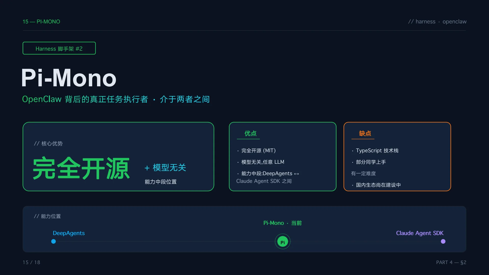

### Pi-Mono

另一个框架叫 Pi-Mono，保守估计 60% 的同学可能没听说过。但它没听说过不代表它的成熟产品没听说过——OpenClaw，就是我们之前说的龙虾。

OpenClaw 本身不牛，它的能力只是在 Agent 外面套一层壳子——定时任务、接飞书这些外围功能。真正把任务做好的 Agent 是用什么写的？就是 Pi-Mono。所以 OpenClaw 火了之后也带动了 Pi-Mono 的 star 上涨，也成了我做 Agent 项目的备选框架。

Pi-Mono 的核心优势是完全开源、模型无关——和 DeepAgents 一样，国内国外模型随便接。能力介于 DeepAgents 和 Claude Agent SDK 之间，不如 Claude Agent SDK 做得那么丰富，但比 DeepAgents 要强一些，因为 DeepAgents 始终没有脱离 LangGraph、LangChain 作为底层框架的限制。

比如交给 Agent 一个特别复杂的任务，Skill 巨复杂，可能需要跑四五十分钟、一个多小时，经历几十轮上百轮对话。用 Claude Agent SDK 完全不用担心上下文问题、对话循环轮次耗尽这些问题。

但 DeepAgents 就需要去测一下，因为底层 LangGraph 默认循环 25 轮，想要对话几十轮上百轮，一方面要修改默认限制、给它加大，另一方面无脑加大可能也不行，还需要拆分子 Agent 等手段，工作量就大一些。Claude Agent SDK 可以直接丝滑地全干出来。Pi-Mono 能力接近 Claude Agent SDK，但一些特性上还不如它丰富。

Pi-Mono 的缺点是 TypeScript 技术栈，部分同学上手有一定难度——做前端的同学熟一些，做后端的一般不熟。不过现在 Agent 代码也用不到复杂的语法，再加上有 AI 编程工具，其实也不用怕。

## 课程安排

上面讲的这些内容也是我课程中摘出来的一部分。这门课程分成 5 个篇章，涵盖了直播所讲的全部内容，在此之外还有一些补充——比如 Kotlin 为什么火起来了、做小业务不需要那么重框架时有什么轻量级替代品等等。

第一章是敏捷洞察篇，用 CodeAct 模式重塑数据分析流；第二章是进阶应用篇，用 Claude Agent SDK 加 Skill 做研报生成 Agent；第三章是深度编排篇，用 Claude Agent SDK 做复杂业务流加全链路追踪；第四章讲 DeepAgents 和 LMM-Wiki 搭建动态知识库；第五章讲 Pi-Mono，用 TypeScript 开源框架做合同审查助手。学完可以掌握 Smolagents、Claude Agent SDK、DeepAgents、Pi-Mono 四大 Agent 开发脚手架。

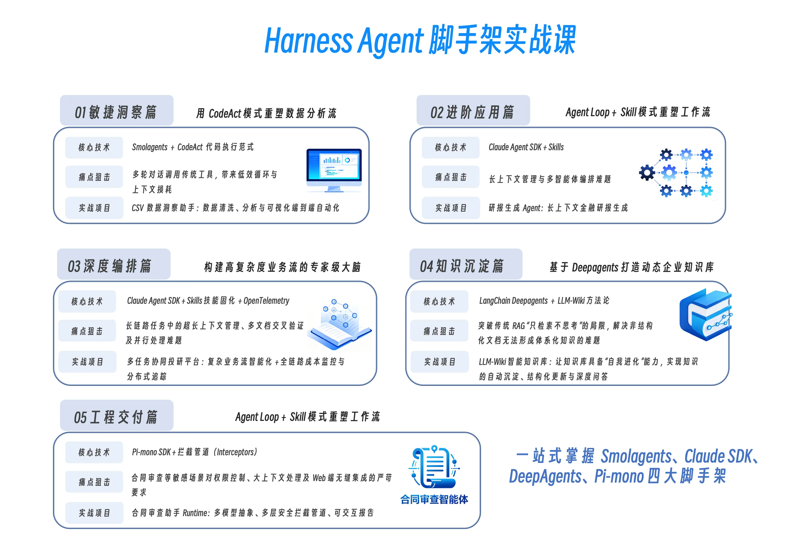