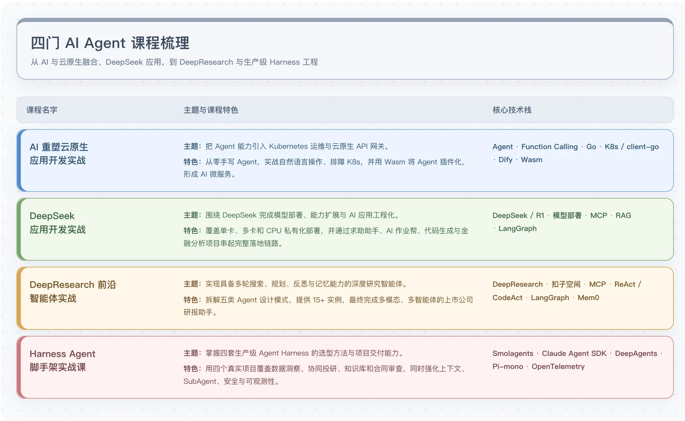
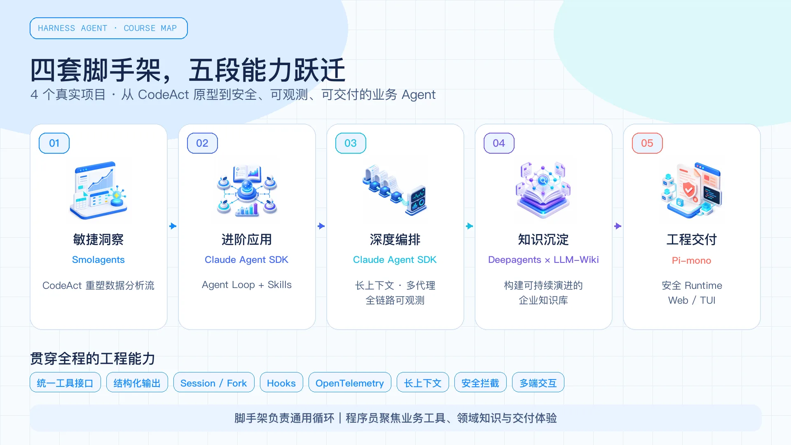

# 结束语｜行动交给现在，结果交给时间
你好，我是邢云阳。

时间过得真快，转眼这一季的课程也要和大家说再见了。回头看，从 2024 年底做第一季《AI 重塑云原生开发实战》这门专栏算起，到现在一年八个月左右的时间，已经上线了四季专栏了。这四季专栏的核心，其实都是在不同的技术发展阶段，围绕着“ **如何开发一个 AI Agent 应用**”这一条主线展开讨论。

## 蓝海年代：2024 年底

2024 年底的时候，虽然 AI Agent 已经发展了一年多，但其实大多数人都没有上车。彼时能够熟悉 LangChain，或者能够写出一个 ReAct Agent，就能上车大厂、实现薪资翻倍，是妥妥的蓝海时期。

那时候我写第一季课程 [《AI 重塑云原生开发实战》](https://time.geekbang.org/column/intro/100845001 "xxx")，很多人觉得云原生和 AI 没关系，但我的判断是：未来所有的应用都要被 AI 重塑一遍，云原生工程师不主动拥抱 AI，就只能被动等待被淘汰。当时那样说，听起来有点“狼来了”，但站在 2026 年回头看，这个判断至少没有大错。

比如，目前做云端 Agent 平台 Cloud Agent，基础设施就是 Kubernetes，如果你恰巧会这个，又同时懂 Agent 开发，就会很吃香。

## 卷出深度：2025 年初

到了 2025 年初，我做第二季课程 [《DeepSeek 应用开发实战》](https://time.geekbang.org/column/intro/100995901 "xxx") 时，赶上了 DeepSeek 横空出世，成为大国重器；赶上了 Manus 成为新闻热搜；Manus 也反推了 MCP 在国内 AI 圈开始流行。

在那个时候，找工作就要比 2024 年底稍微难一点了，需要与时俱进，能应对面试官关于模型部署、蒸馏、MCP 等等内容的提问。还有一个热点是工作流，典型代表是 Dify、Coze、LangGraph 等等，如果能在面试时提到 LangGraph，恭喜你，已经领先公司技术栈半年了。

## 长线作战的智能体：2025 年下半年

2025 年的下半年，我在第三季课程时 [《DeepResearch 应用开发实战》](https://time.geekbang.org/course/intro/101074901 "xxx")，重点总结了当时市面上已具备“规划—反思—执行”循环的智能体有哪些技术特征，还在课程里延伸了它所用的思考工具、联网搜索等配套能力。

在那时，智能体已经逐步露出了一个苗头：如何开发出一个能够长时间运行的智能体。比如 DeepResearch 在提示词写得比较好、研究的论点比较复杂时，能够持续运行几十分钟，最后给出一份报告。我们当时的课程最后的项目——金融研报生成系统是基于 LangGraph 工作流构建的，引入了多智能体以及 DeepResearch 等思想。该项目在生成金融研报时能够持续跑接近 1 个小时（这个时长放在当时看还是不错的）。这非常考验智能体的稳定性和上下文能力。

对此，我的体感是，相比 2024 年底，技术难度提高了不是一两个维度。所以那时候面试大厂，难度也是陡然增加，但对于一些中厂来说，大概还是“会写 MCP 就能进去”的水平。

## 技术平权时代：2026 年

时间来到今年（2026 年），情况又发生了变化。

从技术角度讲，好像 Agent 开发的技术又上了一个新的台阶，因为 Harness 工程这个理念被广泛接受了，似乎我们又要像过去几年一样，研究原理、研究怎么自己用代码去实现 Harness 工程。

然而从非技术角度讲，今年一个很大的变化是：技术平权的时代来了。

比如最近很火的 WorkBuddy，众所周知是一个办公助手，涵盖我们工作当中多方面的内容，除了代码编程，写文案、做表格、绘制 PPT 等等都涉及了。而且它还内置了很多 Skills，以及“专家”的概念，比如数据分析专家、工作台搭建专家等等。这个“工作台搭建”最近在抖音上炒得火热，其他赛道的视频号主也在教别人怎么搭建工作台，甚至帮别人搭建工作台成为一种新兴业务。但这在 WorkBuddy 上其实就是几句话的事。

我们继续深挖 WorkBuddy，会发现其前身是专门用来写代码的 CodeBuddy，也就是 Claude Code、Codex 在国内的竞品。但是这个产品并没有火，而是其进阶到可以处理各种业务的办公助手时才火。这也反映了：代码已经成为了我们实现最终业务目的过程中，比重不那么高的一环。如今把 AI 工具用到实际业务中，要比纯写代码更有吸引力。

## 原理要不要学？

今年年初 Harness 比较火的阶段，我就开始构思这门课了。当时我也在用 Claude Agent SDK 去开发一些智能体，我发现好像我不去研究原理，也能做出来比之前研究原理并自己实现时，效果更好的智能体产品。不过从自己做的东西效果不错，到提炼这些经验凝结成课程，仍然需要一个沉淀过程。

我的看法是，做技术这件事，其实到最后比拼的不是谁更聪明，而是谁能把最朴素的事情重复做、持续做。原理要懂，但更要紧的是把原理落到工程里，落到业务里。

“原理要不要学”？这是大家在评论区和群里讨论得挺多的一个问题，我的回答是： **需要，但不必特别着急**。

如果你最近要去面试，尤其是大厂或一线 AI 公司的岗位，原理是绕不开的。面试官问 MCP 协议、问 Agent Loop、问 Skill 是怎么加载的、问工具调用的错误处理，其实问的不是你死记硬背了多少知识点，而是你 **与时俱进的能力、对系统设计的理解力，以及遇到新框架时能多快上手**。这种能力是没办法靠背题获得的，只能靠真正读过一遍源码（用 AI 读）、画过一张架构图、跟着敲过一轮 demo。

但一旦进了公司，真实的工作其实是另外一回事。日常开发里，你大概率是在用框架搭建业务：比如过去用 LangGraph，现在用 Claude Agent SDK 或者 Pi-mono 跑一个 Agent Runtime。框架选对了，产品形态就稳了—— **只要你的交互是在模仿 Codex，体验就不会差；只要你的框架用的是 Claude Agent SDK 或者 Pi-mono，功能基本不会差到哪去**。这就是过去一年多我最大的体感：原理是地基，但框架才是砖瓦，盖房子靠的是砖瓦。

所以如果你现在时间有限，优先级应该是： **先把框架用熟，把业务跑通，再回头补原理**。反过来，如果你时间充裕、又想进大厂，那就去阅读一下 Claude Code 源码，可以看一下其他老师的原理课程。

做技术这件事，其实到最后比拼的不是谁更聪明，而是谁能把最朴素的事情重复做、持续做。原理要懂，但更要紧的是把原理落到工程里，落到业务里。

## 关于这一季课程

因为 Code Agent 模式是当前最主流的 Agent 形态，所以这一季课程我们从 CodeAct 模式切入。然后又依次学习了自带 Harness 的 Code Agent 脚手架，包含 Claude Agent SDK、Deepagents 以及 Pi-mono。在这个过程中我提供了大量示例，方便你掌握这些脚手架的使用方式，了解其核心特性。

不过有条主线是一以贯之的：不管我们使用什么 Harness 脚手架去做业务，方法论都差不多，那就是先设计好 Skills 以及工具，然后交给脚手架去跑。目前大家看到的 Workbuddy 的专家等类似功能，其实就是这种模式。

过去我们用 Dify 等平台去创建智能体，底层用的是 ReAct、Function Calling，然后我们去提供特定提示词（包含提示词优化），并引入必要工具。现在其实也差不太多，无非是底层换成 Harness 脚手架搭建出的 Agent，然后在页面设计好提示词、提供工具并上传 Skill 包。有兴趣的话，你甚至可以 Vibe Coding 出这样一款低代码的 Harness Agent 平台 Demo，去跑跑试试，对于理解当前的开发思路很有帮助。

## 行动交给现在，结果交给时间

最后也是最重要的话。做技术这几年，最常被问到的问题就是“现在学 AI 还来得及吗”“做 XX 方向有前景吗”“我应该先研究原理还是实战”。

我自己的答案是：这些问题的答案，都不在你问的时候，而在你做的时候。

如果你在 2024 年底看了我第一季课程，并跟着做了一些实践；如果你在 2025 年初看了第二季，顺手用 DeepSeek 写了几个小工具；如果你在 2025 年中看了第三季，尝试做了一个属于你自己的 DeepResearch；如果你在 2026 年看了这一季，并且真的把合同审查 Agent 跑起来……那么此时，你已经成为了 AI Agent 王朝的“四朝元老”，不管是原理还是实践都能信手拈来。不是因为你比我聪明，而是因为你做了。

技术这件事，从来不是想出来的，是做出来的。 **行动交给现在，结果交给时间。**

## 写在最后

下一季课程什么时候开始，我还没想好。但只要环境在变，AI Agent 这个赛道就还会有新的故事。到时候如果还有时间、还有心力，我一定回来。如果这一季的课程对你有帮助，不妨推荐给身边的朋友。也欢迎在评论区聊聊你的想法——你做过的 Agent、踩过的坑、跑通过的项目，都是对其他朋友最大的帮助。

感谢你陪我走到这里，最后希望你可以抽几分钟填一下 [毕业问卷](https://geekbang.feishu.cn/share/base/form/shrcnqzHSvXm2h8DEgh47jsbdrd "xxx")，我会认真查看大家的反馈。期待咱们下个路口见！

