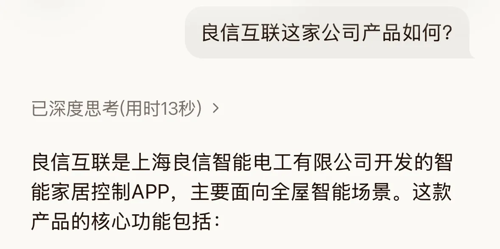
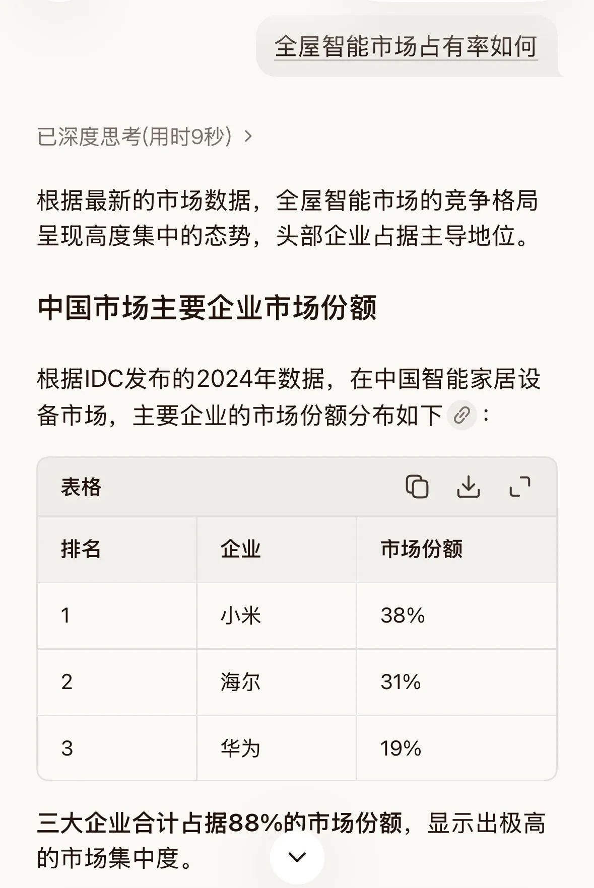
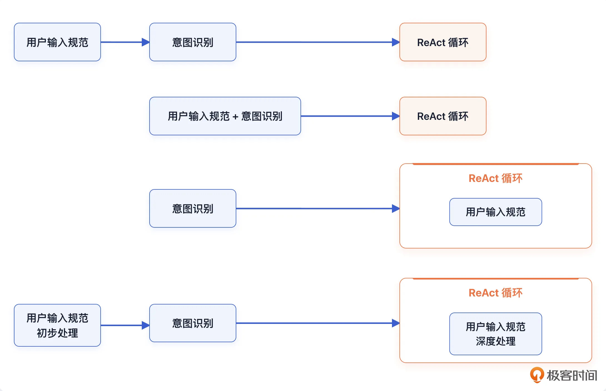
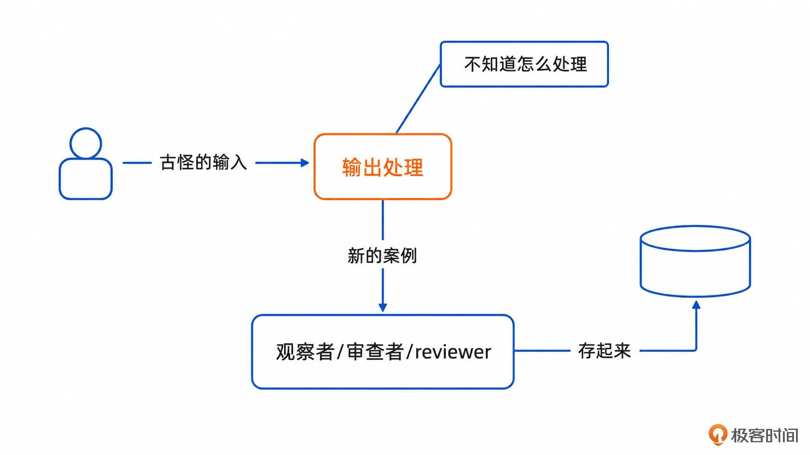
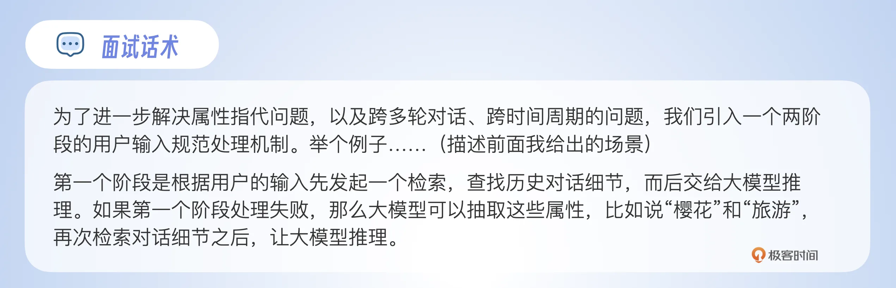
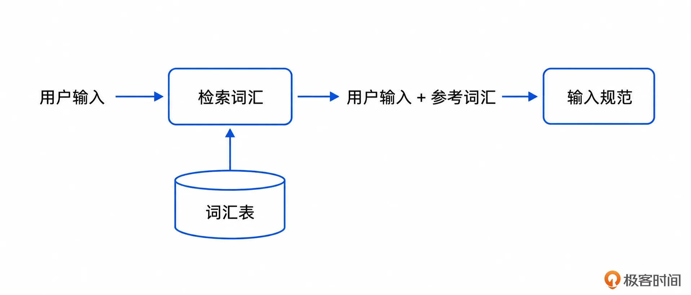
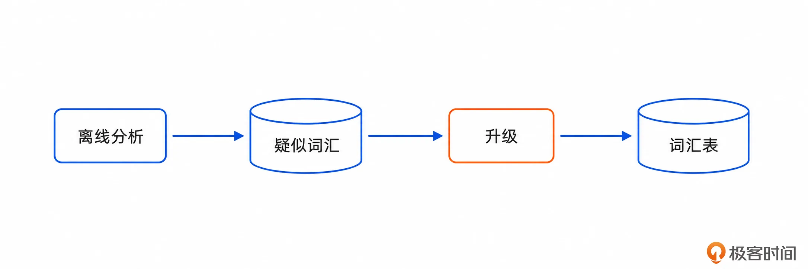
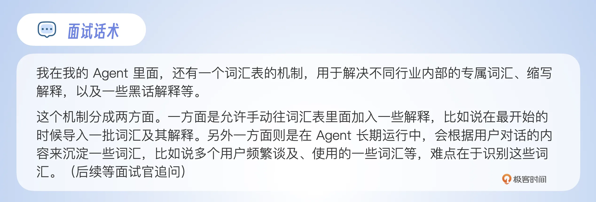
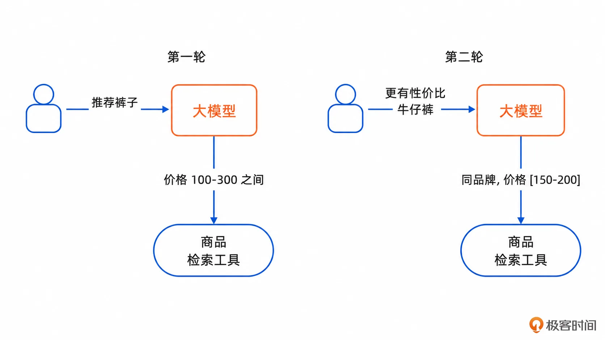
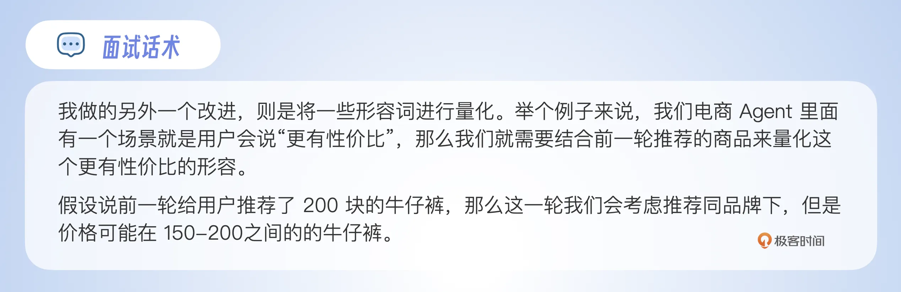

# 01｜用户输入规范化：为什么你的 Agent 连“那个”“最划算”都听不懂？
你好，我是大明。

课程的第一个章节我们来聊“意图识别”这个大的话题，在这个话题下，我们遇到的第一个问题就是“如何理解用户的输入”。在实践中，用户的输入都是很随便的，正如我们日常说话一样随意。因此你在设计 Agent 的时候就难免会遇到一些问题，比如用户的输入是一个病句、用户使用了倒装句、用户喜欢用代词、用户使用缩写，甚至有时候用户会输入一些“黑话”。

解决这个问题，就被称为用户输入归一化/用户输入规范化/理解用户输入，这是所有的 Agent 都需要考虑的问题，在专栏里我都会使用 **用户输入规范化** 来代指这个问题及其解决方案。Agent 中的 **用户输入规范** 和 **意图识别** 这两件事，就类似于传统软件工程理论中的需求分析，其重要性可见一斑，因此我把它放在专栏的第一讲。

而在面试中，一旦面试官问了这个问题，那么“恭喜”你，遇到懂行的了，要做好被拷打的准备。毕竟相当多的 Agent 其实根本没考虑过这种问题，会考虑这个问题的要么是 Agent 成熟度比较高了，要么是面试官遇到了相关的问题，要着手解决了。

那么反过来说，因为它并没有那么常见，所以你在面试中主动提及你处理的一些比较奇特的用户输入，就能让你在面试中显得与众不同，从而赢得竞争优势。

### 常见的用户输入错误和例子

为了让你有一个直观的感觉，这里我列举一些用户的输入，当然还有更多，受制于篇幅就不列出来了。

大类

说明

典型例子

指代问题

用户用“这个、那个、第一个、刚才那个”等表达代替具体对象

- 第二个适合生产吗？

- 刚才那个项目怎么包装？

缺失问题

用户输入不完整，缺少主语、宾语、动作对象、约束条件等

- 市场占有率多少？

- 帮我优化一下。

表达问题

用户表达口语化、跳跃、病句、语序混乱，或者临时改口

- 不是，我说的是另一个。

- 这个不太行，换个更像面试能讲的。

词义问题

用户使用非标准术语、同义词、黑话、内部代号或多义词

- RAG / 检索增强 / 知识库

- 抓手/不够 P8

主观判断问题

用户使用依赖个人偏好、场景和标准的判断词

- 哪个最有性价比？

- 再高级一点。

外部事实问题

用户使用需要实时数据、检索结果或工具返回才能确定的表达

- 最近哪个框架更火？

- 现在最便宜的是哪个？

### 一个典型的例子

为了让你感受这个输入规范性处理不当的弊端，我这里给你展示一下我近期使用的一个国产 Agent 的效果，如图。

我问了两个问题：

- 良信互联这家公司产品如何？

- 全屋智能市场占有率如何？

我作为一个用户，我问第二个问题是因为我在第一个问题的回答里面看到了它主要面向全屋智能场景，而后我希望通过市场占有率来判断它的实力。

而实际上，我的真实表达是：

> 全屋智能市场占有率如何？ =\> **良信互联的** 全屋智能市场占有率如何?

这是一个典型的主语缺失的例子。

当然了，你可能会认为 Agent 的理解没有问题，第二个问题看起来就像是问整个市场的市场占有率分布。

即便如此，它最终又没结合上下文告诉我良信互联的市场占有率数据，那么这个 Agent 就犯了一个更加严重的错误： **上下文管理稀烂，对话细节召回稀烂，关键事实管理稀烂**。

> 注：篇幅太长我没有把内容全部截出来，但是我可以保证第二个问题的回答中，这个 Agent 完全没有提及良信互联。当然，如果你有兴趣可以找我要完整内容。

### 基本方案

用户输入规范化这种事情，最简单的解决方案就是调用一下大模型，让大模型去帮你推断。那么问题来了，什么时候调用大模型呢？

#### 时机问题

你最容易想到的就是在用户输入的第一时间就先调用大模型做输入规范化的事情。这种想法很好，但是有一个问题：有一些复杂的输入，你是没有办法在第一时间处理的。

例如说用户五一前让你推荐一个景点，五一结束后输入说：“我去了之前你推荐的那个公园……”，这种跨越很长时间线的、也跨越了多个多轮对话的指代问题，是无法在第一时间推断出来的，只有在后续召回了历史对话细节之后，才有可能推断出来。

从我的实践中来看，有几个时机，并且各有适应场景：

1. 在意图识别之前：这是我比较 **推荐** 的一种，越是通用的 Agent、越是面向 C 端的 Agent，这一步就越要独立。

2. 和意图识别一起：用户不多、领域专属的 Agent 可以使用，这一类的 Agent 比较难遇到奇奇怪怪的用户。

3. 在后续执行过程中，如在 ReAct 循环中：这是一个没得选的事情，也就是类似于“最有性价比”这种形容词，是只能在这个阶段实现的。我会在后面进一步讨论这个事情，这也是你在面试中可以赢得优势的地方。

在实践中，1或2 是可以和3结合使用的，相当于你的用户输入规范从逻辑上会分成两个阶段：

- 初步处理：大部分的用户输入会在这个阶段就规范处理掉。

- 深度处理：一旦涉及严重依赖上下文、工具调用的，则只能在这个阶段处理。它一般都被嵌入在 ReAct 循环中。

你可以从下面的图里面看到这四种时机的区别。

当你确定了要在什么地方处理用户输入，接下来就是写 Prompt，下面我以第一种方式为例展示你的 Prompt 要考虑写入的内容。

#### Prompt 撰写要点

当你决定了要在意图识别之前先处理用户输入的时候，首先要做的就是 **明确职责边界**。很多时候大模型“过于自主”，如果你不约束的话，它可能一股脑帮你把输入规范、意图识别之类的事情全部干完了。

下面是一个职责表，你可以参考：

**能做什么**

**不能做什么**

指代消解

不直接回答用户问题（最容易犯的错误）

省略句补全

不执行工具

病句修正

不做最终推荐

术语标准化

不判断业务意图

黑话解释

不生成完整方案

多义词消歧

不擅自补充事实

判断是否需要澄清

不强行猜测低置信内容

判断是否需要搜索

不伪造实时信息

其次是你同样可以 **使用 few-shot 这种方式**。如果你不在意 token 消耗，那么你完全可以针对每一种用户输入都设计一个 few-shot 的例子。更加经济的方式是在线上运行的过程中，每次遇到一些古怪的用户输入，就整理成 few-shot 的例子，如图：

如果你担忧 few-shot 例子太多不好选，可以借助检索机制从一大堆的例子中找出符合当前状态的例子，注入到 Prompt 里面中。

最后不要忘了 **检查用户输入是否已经处理完整**。

- 检查主谓宾是否完整。

- 检查代词是否完全消解，比如说要求最终输出一个代词消解的表格。

- 形容词、极值等是否已经输出了“可量化”的内容。

代词消解的表格需要作为一个关键事实贯穿在本轮对话的整个处理过程，并且可能进一步影响后续几轮的对话。下面是一个简单的指代消解的表格的例子：

> 第一个方案 =\> 使用TCC的方案，命名为TCC方案
>
> 那个帅气的同事 =\> 邓大明

除了这三个关键点之外，还有一些比较细碎的点你同样可以考虑：

- **命名很重要**：所谓名不正则言不顺，言不顺则事不成。比如说你的 Agent 输出的时候，输出“方案一”这种就容易让用户后续用“方案一”来引用，但是如果你输出的是“TCC方案”这种，那么用户后续就容易使用“TCC方案”来代指。这种按名索引/查找的最大的优点是能有效规避大模型推理阶段引用错误的问题。

- **要求用户澄清**：这部分内容和后面文章要讨论的意图识别一样，可以要求大模型在无法彻底规范用户输入的时候，比如说代词消解推断不出来人、物、地点等情况下，不要瞎猜，而是引入一个澄清机制。

- **结构化输出**：我前面提到的指代消解的表格就是这种思维的一种体现，有一些人会输出一些更加规范的结构，比如说主谓宾三个字段，再加上一些对定状补的解释，例如我在后面提到的“性价比”问题。

到这里，你基本上已经意识到 **理解用户输入，是一定要紧密结合上下文的**。

## 进阶方案

### 深度结合上下文

具体包括：

- **结合用户画像**。例如说有个人反复讨论《三国演义》电视剧，那么后续在该用户提问《三国演义》的时候就应该倾向于将它解释为电视剧，而不是其他的什么。

- **结合关键事实**。这个“关键事实”是一个比较抽象的说法，它包含用户的喜好（和用户画像有重合）、观点、态度，前面几轮 Agent 输出的要点、已被用户认可的点。

- **结合对话历史召回**。可以召回对话的摘要，也可以是召回细节。

你在面试中可以结合自己的 Agent 特征说自己做过这一类的优化。

下面我们来看两个更加复杂的案例。

#### 基于属性 \+ 检索的推理方式

我用一个复合例子来展示这个解决方案。现在假设用户在假期前要求 Agent 推荐一个适合出游的地方，而后大模型推荐了鸡鸣寺，建议去看樱花。

在假期结束之后，用户再次跟 Agent 交流，他输入一句话：“你上次推荐的看樱花的那个地方……”。

那么这个场景面临两个难点：

- **时间跨度长**。假期前后跨度几天，那么短期记忆基本没了。这个时间段内，用户可能已经产出了很多对话，查找困难。

- **属性指代问题**。它比一般的“这个”，“那个”这种指代还多了一层属性有关的匹配。

从实现方案上来说，基本上要借助 RAG 或者其它检索机制，简单来说可以看做是两步：

步骤一：先根据用户输入去历史对话里面召回细节，放入到窗口中。在这里差不多就是用“樱花、旅游”这种内容去检索。

步骤二：大模型基于窗口内容来推断，完成指代消解。在这里就是将“看樱花的那个地方”推理得到“鸡鸣寺”。

还可以尝试引入一种补偿机制，以解决步骤一检索不顺利的问题：

- 大模型基于属性来推断失败之后，提取相关属性作为参数发起工具调用。

- 大模型再次基于历史对话细节进行推理。

你可以这么介绍你的方案：

接着再来看一个能够自我演进的解决方案。

#### 基于行业画像 \+ 词汇表 \+ 迭代式的词汇表

很显然，同样的词汇/缩写在不同的行业、领域、上下文里面有不同的含义。

例如CRM，在 IT 行业是 Customer Relationship Management（客户关系管理系统），而在医疗行业是 Clinical Research Management（临床研究管理）。

上面的例子比较简单，你无非就是要 **在 Prompt 里面带上所处的行业等信息**，并且强调大模型要结合行业、领域来解释。

但是我这里有一种更加利于面试的做法：词汇表，而且是自我迭代演进的词汇表。它可以用来解决各种多义词、缩写，以及黑话等问题。

你需要在整个系统里面维护一个词汇表，里面是各种词汇、黑话之类的解释，它可以被放在 MySQL 中或者向量数据库中，在输入规范处理之前，先检索一下这个词汇表，将检索结果注入到窗口内，再调用大模型。

那么更加复杂的操作，则是将不同人、不同多轮对话中频繁出现的一些特殊的词汇沉淀下来，放入到这个词汇表中。这个词汇表可以更进一步做成公共词汇表和用户个人词汇表两个。

举一个理想的例子，例如一个公司的三五个员工都讨论了一个“大黄蜂”项目，那么就可以将这个“大黄蜂”放入到词汇表，汇总所有人对它的讨论。

这个过程其实非常复杂，难点在于识别词汇，一方面要防止错漏，一方面也要尽量规避误加入。最简单的做法就是通过离线分析多轮对话，先标记一些疑似的词汇，记录出现的次数和基本含义。当一个词汇频繁出现，或者出现次数超过阈值，那么就升级放入到词汇表中。

这个频繁，你可以在面试中解释得非常“花里胡哨”：

- 总次数大于阈值，比如说 100。

- 讨论的人超过了 3 个，这可以理解为是公共词汇。

- 连续讨论 10 次等。

这个方案在面试挺好用的。你可以使用这个话术来介绍你的解决方案：

除了上面两个案例，还有一些你需要学习的东西。

### 可量化是一件极为重要的事情

可量化针对的是各种形容词，任何一个未量化的形容词都会导致你的 Agent 输出结果出现漂移。

这里我举一个电商的例子，我认为是一个非常有意思的例子。

- 用户输入：推荐一条裤子。

- Agent 返回：牛仔裤 A 200 块，休闲裤 B 300 块。

- 用户输入：帮我推荐一个更有性价比的牛仔裤。

那么在电商 Agent 里面，最为关键的就是如何解释“性价比”了，大体上可以分成两类：

- 同等价格的，如进口改国产，大品牌改小品牌等。

- 同等“质量”的，但是价格更加低的。例如说同品牌下的更便宜的系列。

当然也可以结合用户画像猜测用户是如何理解性价比的，以及借助所谓的“性价比榜单”来做推荐。

很多 Agent 的问题在于处理过于粗暴：一看到“性价比高”，就直接理解成价格低，却忽略了质量、性能、品牌、售后等因素。这也是用户觉得某些 Agent 很蠢的重要原因。考虑到电商场景受客单价影响明显，更合理的解释应优先围绕“同等价格下，质量、配置、服务或体验更好”来展开。

这种“可量化”落地到实践中，就是转为调用工具时的参数。例如说第二轮你在调用推荐商品的工具的时候，构造的工具参数中价格就被限定为 \[150, 200\]。如图：

下面是一个简单的话术模板：

记住，这一类的词汇你需要在 Prompt 里面，或者你的 Spec 里面详细描述如何判定。如果你有很多这种需要告知大模型如何解释的词汇，那么可以考虑 **整合前面的词汇表的解决方案**。

## 总结

到这里，你基本上可以明白理解用户输入不是一件简单的事情。总的来说，所有的措施都可以归结为一句话： **深度整合上下文**。

这个点在面试中是很好用的，你可以用这个思路来设计面试案例：

- 找一个用户输入的特殊的例子

- 构思一个结合上下文来解决的方案

而后，要小心面试官问你具体 Prompt 是如何写的，你可以提前让 AI 给你写一个 Prompt 作为参考。

最后我再补充一些我在实践中也没解决过的问题，你可以作为参考：

- 反话/嘲讽/阴阳怪气：在大部分 Agent 中是不需要考虑这个问题，少部分需要考虑处理。如会议摘要 Agent，这种 Agent 就要考虑在会议的时候是否有人故意阴阳怪气，从而判定出用户的真实想法。

- 数量范围/交互意图歧义：例如说用户输入“帮我草拟一个题目”，那么事实上用户并不是真的只要大模型草拟一个题目，而是一组题目，最终用户选择一个出来。

- 复杂人物关系下的指代问题：举一个夸张的例子，用户说“ A 的前任的前任今天遇到了 B 的现任的前任”，那么你的 Agent 需要准确分析出来谁遇到了谁，发生了什么。这种在社交、心理咨询、情感交流、恋爱类的 Agent 里面偶尔会遇到。我会在后续文章里面进一步讨论这种复杂人际关系建模的问题。

此外，实践中你甚至可以考虑结合微调来提高大模型规范用户输入的能力，尤其是你的用户输入规范是和意图识别一起做的，那么微调也是可以一起做的。

## 思考题

我在这里举了很多例子，那么你在实践中有没有遇到过有趣的用户输入？欢迎你在留言区分享一下，如果你觉得有所收获，也欢迎你分享给需要的朋友，我们下节课再见！