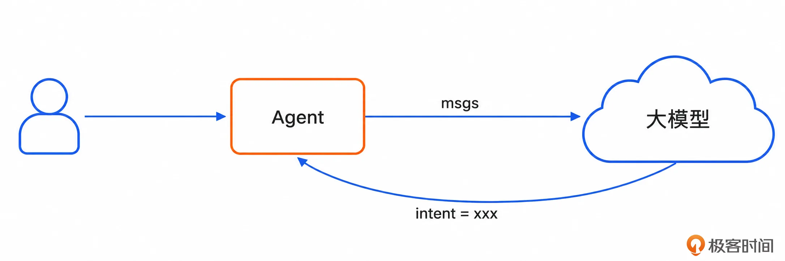
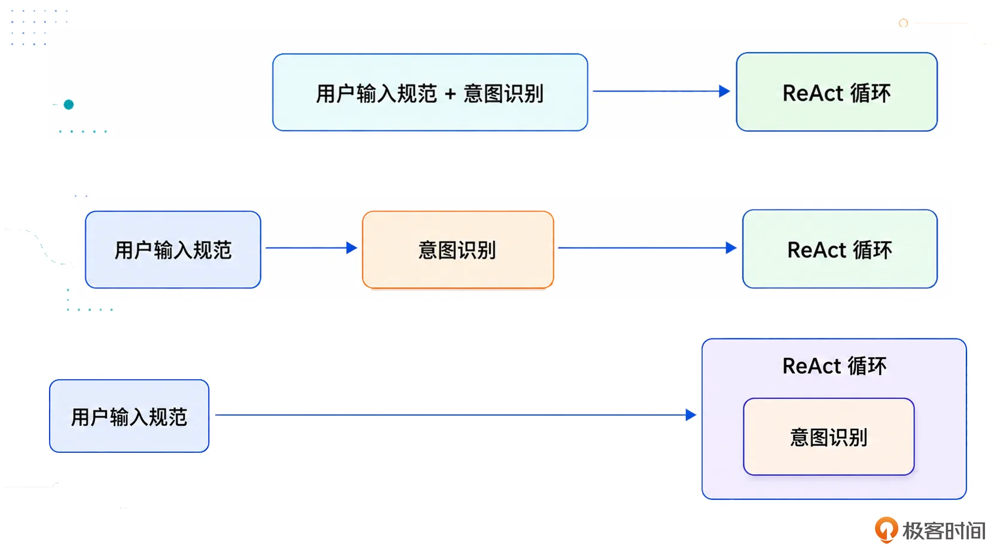
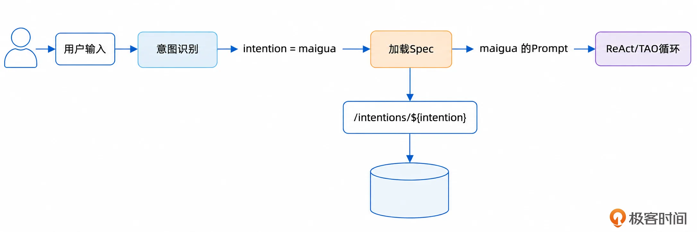
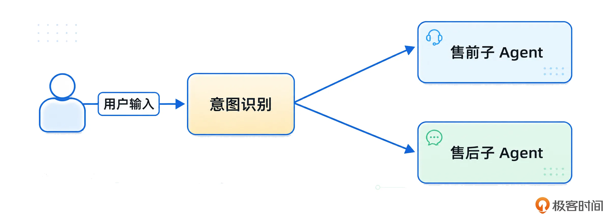
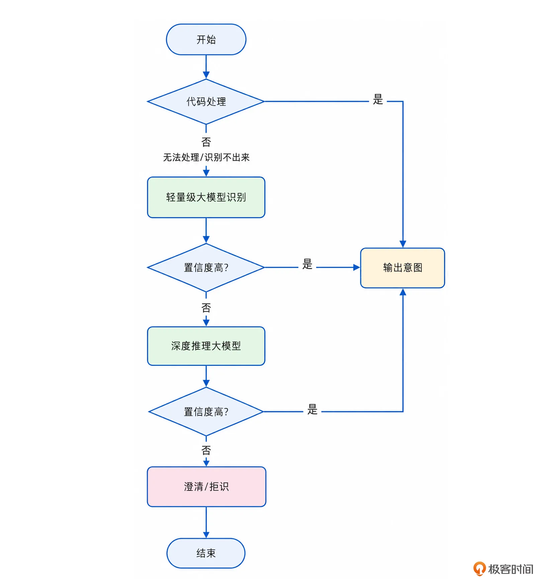
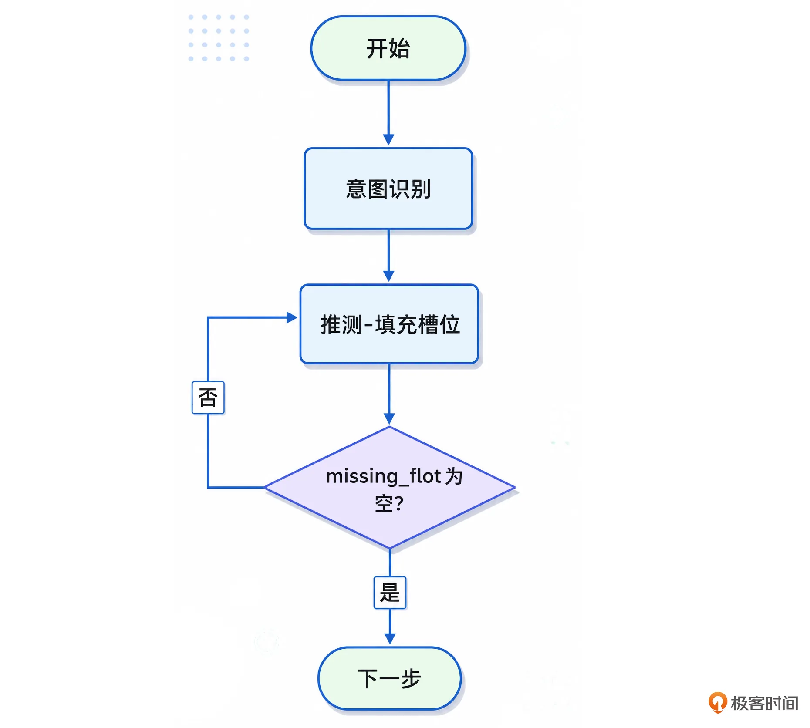
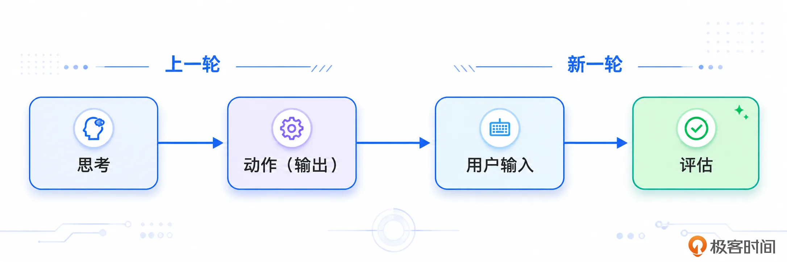
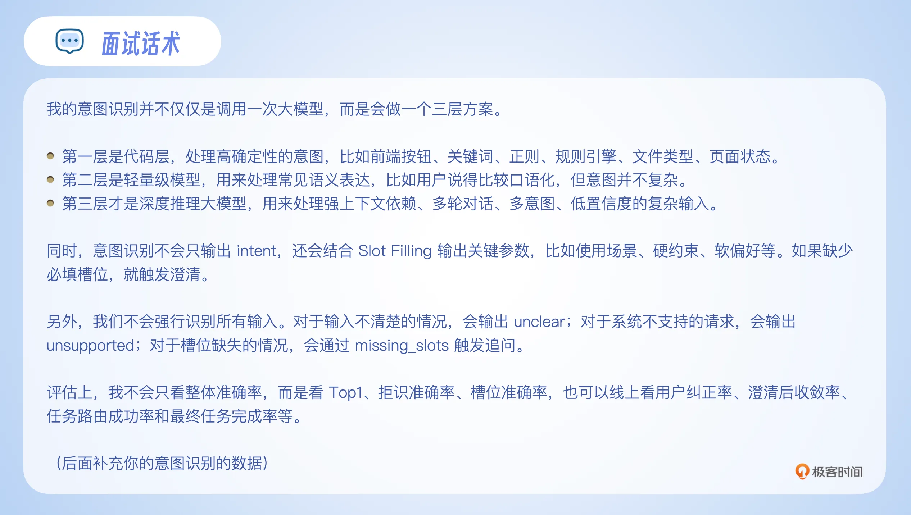

# 02｜三层意图识别机制：别再回答“调大模型判断”了，这才是面试官想听的
你好，我是大明。

意图识别在 Agent 构建中算是一个比较基础的内容，但它在面试中又非常容易被问到。原因也很简单，因为只要你做 Agent，就一定绕不开一个问题： **用户到底想干什么**？

你只有知道用户想干什么，后面才知道应该加载哪个 Prompt，调用哪个工具，组织哪些上下文，进入哪个业务流程。

但是很多人在面试回答意图识别的时候，答案非常简单：“我们就是调用一次大模型，让大模型判断用户意图。”这样的回答毫无特色和新意，也毫无竞争力。

一旦面试官开始追问：

- 大模型判断错了怎么办？

- 候选意图很多怎么办？

- 用户输入很模糊怎么办？

- 用户少说了参数怎么办？

- 你怎么评估意图识别准不准？

- 准确率多少才算好？


这时候你就懵了，从而败下阵来，痛失 Offer。

所以这一篇我们先讨论意图识别的基础做法，以及如何评估意图识别的效果。

## 什么是意图识别？

考虑到部分同学可能确实没做过意图识别，对此非常迷糊。那么我这里直接给出一个最简单的解释： **意图识别就是从一堆枚举里面挑出一个**。举个例子，你现在要开发一个电商 Agent，你怎么确定用户是想要这个 Agent 推荐一些商品，还是想让这个 Agent 协助退款呢？

毕竟推荐商品和售后是很不一样的，前者主要是根据用户的要求找商品，后者则是看订单是否符合退款条件，符合则发起退款。

更加直观的解释就是，不同意图对应的提示词和处理流程不同，后面讨论的 TAO 这种范式下的 Action 会很不一样，上下文管理也会很不一样。

这也就是意图识别要解决的事情： **Agent 得知道用户究竟想要做什么**。

最简单的情况下，所谓的 **意图识别就是调用一次大模型**，让大模型结合上下文返回一个枚举值。如下图：



输出类似于：

```
{ "intent": "product_recommendation" }
```

但是在实际系统里面，仅仅返回一个 intent 往往不够。更完整的意图识别，通常是 **返回一个意图，再加上一组参数**。

举个例子来说，假设用户说我要买一条裤子，那么输出的内容应该类似于：

```
{"intent": "product_recommendation", category: "服装", subcategory: "裤子"}
```

这种也就是所谓的“结构化表达”。因此你可以把意图识别理解成两件事：

- 识别用户要进入哪个业务流程。

- 抽取这个流程需要的关键参数。


前者是 intent classification，后者就是我们后面要讲的 Slot Filling。

### 什么时候做意图识别？

我在上一节课用户输入规范化里面其实已经间接揭示了意图识别的时机，如图：



第一种，和用户输入规范化混在一起。比如系统先对用户输入做规范化，纠正错别字、补全指代、整理成结构化表达，同时顺手识别出用户意图。这种方式在简单系统、小型 Agent、领域专属 Agent 里面比较常见。

第二种，在进入 ReAct 或 TAO 循环（思考 Thought - 行动 Action - 观察 Observation）之前，先做一次独立的意图识别。也就是说，用户输入进来后，系统先判断意图，再根据意图加载对应的 Spec、上下文和工具，最后进入后续 Agent 流程。

第三种，直接在 ReAct 或 TAO 循环里面完成意图识别。这种方式更加灵活，但是也更难控制。因为模型一边思考、一边决定任务方向，调试起来会更复杂。大多数时候这种方式都是和 Slot Filling 结合在一起的。

站在面试的角度，我推荐你优先回答第二种形态，这样做的好处是边界清晰、可评估、可调试，也更符合工程化思路。

### 为什么要有意图识别？

有时候，面试官在听了你这个回答之后就可能会突然来一个提问：既然你后面已经有 ReAct 或者 TAO 循环了，为什么还要单独做意图识别？不能让 Agent 在循环里面自己判断吗？

本质上就是在质疑已经有第三种方式了，为什么还要用第二种方式？这个问题其实问得很好。

从理论上来说，当然可以直接在 ReAct 或 TAO 循环里面完成意图识别。也就是说，Agent 一边思考，一边判断用户要做什么。但是从工程实践上来说，大多数系统还是会在进入主流程之前，先做一次独立的意图识别。

主要原因有三个。

第一个原因是 **意图会影响 Prompt / Spec 加载**。例如说前面电商领域中的 Agent，在售前和售后两大子域中它的思考过程就很不一样：

- 售前：主要考虑用户预算、使用场景、品牌偏好、历史浏览、商品评分、性价比、是否有活动等。

- 售后：订单状态、是否已发货、是否超过退款期限、商品是否支持退货、是否需要人工审核以及退款路径是什么等。


显然这两个流程的 Prompt / Spec 不一样。

所以，意图识别的第一个作用就是决定： **后面应该加载哪一套业务规范**。下图是一个简单的示例，假设意图是“华强买瓜”：



有些时候，在整个 ReAct/TAO 循环中，负责“思考”的那个 Prompt 可能早就换过很多次了。

第二， **意图会影响上下文组织**。

很明显，不同意图需要的上下文是不一样的。例如说电商 Agent：

- 售前：上下文里面应该重点放用户画像、价格偏好、历史购买、浏览行为、商品候选集和推荐策略等。

- 售后：主要放用户订单、物流状态、售后政策、支付记录和退款记录等。


如果你在售后场景里面塞一堆用户画像和商品偏好，那就是浪费上下文窗口。所以，意图识别的第二个作用是决定 **当前上下文窗口里面应该放什么，不应该放什么**。

第三， **意图会影响工具选择**。

Agent 最终是要调用工具的，比如说：

- 商品推荐可能调用商品检索工具；

- 订单查询可能调用订单系统；

- 退款申请可能调用售后系统；

- 内容生成可能调用文档生成工具。


如果意图识别错了，工具调用大概率也会错，或者大模型根本选不出合适的工具，导致 Agent 无法继续处理下去。

最极端的形态是在意图识别之后，根据意图分发到不同的“子 Agent”上。如下图：



显然，子意图内部也可以进一步引入“子意图”识别，而后进一步分发。

所以意图识别本身在 Agent 构建中是一个非常重要的点，借用一句话来说就是“方向错了，知识越多越反动”。

而后你可以在面试中用这一句话来总结你对意图识别必要性的深刻认知：

> 意图识别不是为了给用户输入贴标签，而是为了决定 Agent 后面应该怎么想、加载什么上下文、调用什么工具、进入哪个业务流程。

接下来就是另外一个关键的问题了，提示词怎么写。

### 提示词怎么写？

很多人这一阶段的提示词会写得非常简单，比如说“请判断用户的意图”，而后没了。

这肯定是不够的。因为大模型会按照自己的理解自由发挥，最后输出的 intent 名称、参数字段、置信度、解释逻辑都可能不稳定。

所以意图识别提示词的核心是让模型在一个受控的业务意图空间里完成分类和结构化输出。用人话来说就是给定几个选项让大模型输出。

我可以提供一下我写提示词的心得作为参考，实践中各凭本事“炼丹”。

首先，也是最重要的一点： **定义清楚候选意图**。你要告诉模型，当前系统支持哪些意图。

例如说在电商里面，你的提示词中可能有这样一个片段：

```
# 候选意图
- product_recommendation：用户希望系统推荐商品、帮忙挑选商品，或者根据预算、用途、偏好给出购买建议。
- product_comparison：用户希望比较两个或多个商品、品牌或型号。
- product_query：用户希望查询某个商品、品牌、型号、参数、价格或库存信息。
...（有更多意图）
- unclear：用户输入信息不足，无法判断具体意图。
```

记住关键点是：不要让模型自己发明意图，不允许 **无中生有**。你可以在意图识别之后，结合代码校验来进一步防止大模型无中生有。

第二点是 **定义清楚意图边界**。

只列意图名称是不够的，还要解释边界。尤其是你发现两个意图之间可能在语义上比较接近的时候，一定要澄清这一部分。比如 product\_recommendation、product\_comparison、product\_query 有时候会被混淆。那么你应该在提示词里面明确说清楚三者的边界。

例如说：

- 3000 块以内有什么手机推荐？ => 商品推荐

- iPhone 16 的电池容量是多少？ => 商品查询

- iPhone 16 和小米 15 哪个更适合拍视频？ => 商品比较


在提示词里面可能是这样描述的：

```
当用户希望系统根据预算、用途、偏好推荐一个或多个商品时，选择 product_recommendation。
当用户明确提到两个或多个商品、品牌或型号，并希望比较优劣或做选择时，选择 product_comparison。
当用户只是询问某个商品、品牌、型号、参数、价格、库存等信息时，选择 product_query。
```

第三， **定义清楚意图的参数**，也就是 Slot Filling 里面的 Slot，槽位。

例如说在商品推荐里面，可以要求大模型抽取：

```
category：商品类目，例如手机、笔记本电脑、耳机、跑鞋。
sub_category：更细分类目，例如游戏本、轻薄本、降噪耳机。
budget_min：最低预算。
budget_max：最高预算。
usage_scenario：使用场景，例如办公、游戏、通勤、送礼。
brand_preference：品牌偏好……
```

当然你可以进一步描述这些参数是否必选，以及可选参数的默认值等。

此外还有一些也是你可以考虑的通用的参数：

```
must_have_features：必须满足的特性。
nice_to_have_features：加分项。
hard_constraints：硬约束。
soft_preferences：软偏好。
```

这里我要吐槽，国内的一些大模型的输出表现得非常不贴心，我猜测一部分原因就是这些通用的参数他们根本没考虑过。例如说我明确表达不要推荐某个品牌，结果它还是推荐某个品牌，非常影响用户体验。

最后， **要加入 few-shot**。

```
few-shot 不需要很多，关键是覆盖容易混淆的边界。比如说下面是一个 few-shot 的例子：
用户输入:“3000 以内有什么手机推荐，主要拍照好一点？”
输出：{
  "intent": "product_recommendation",
  "slots": {
    "category": "手机",
    "budget_max": 3000,
    "usage_scenario": "拍照",
    "soft_preferences": ["拍照好一点"]
  },
  "need_clarification": false
}
```

更进一步来说，如果你的意图确实非常容易搞混，那么你可以在 few-shot 里面加入正反两方面的例子，明确界定边界。

这里实际上还有一个问题，如果意图特别多，尤其是有些人喜欢将意图切分得很碎，就会导致一个问题：将全部意图和意图介绍写进提示词，叠加上下文的内容，超过大模型的窗口大小。

这个问题可以通过层次意图、决策树来解决，你可以参考后面的内容。接着我们要讨论一个问题，如果要是真的识别不出来，怎么办？

### 识别不出来怎么办？

很多系统的问题是，不管用户输入什么，都强行识别到某个业务意图上。但真实的用户输入经常是不完整、不清楚，甚至超出系统能力范围的。理论上来说应该提供两个出口：

- unsupported：用户的意图完全不在候选意图中，这时候要考虑的是 **拒识**。

- unclear：意图之间有混淆，又或者参数可能不够，这时候要考虑的是 **澄清**。


先看一个澄清的例子。假设用户输入“帮我推荐一条裤子”，如果你想要 Agent 效果好，其实不要着急立刻推荐，而是可以尝试先收集一些额外的信息，例如说大模型返回：

```
{
  "intent": "product_recommendation",
  "slots": { "category":"衣服"},
  "missing_slots": ["price"], "need_clarification": true,
  "clarification_question": "你想让我推荐多少钱的商品呢？"
}
```

在实践中，有些人秉持的理念是虽然参数不全，但是我先尽量猜测一下，而后尝试给出最终的回答。

我并不赞同这种观点，我更加赞同的是先尽量收集完整的参数、约束，而后再回答用户的问题。这还是我一贯坚持的观点：好的回答比快的回答，用户体验更好。

再看一个拒识的例子，用户输入“帮我生成一个奥特曼动画”，而这个输入完全不符合前面列举的任何意图，超出了当前电商 Agent 支持范围，这时候就要拒绝了。接着我们来看意图识别的一般解决方案。

## 常规的三层意图识别解决方案

现在很流行、很热门，包括在面试中也非常好用的方案是一个三层的意图识别机制。

第一层是 **代码层的意图识别**。它是指通过代码来实现一个简单的意图识别的机制，可以是：

- 页面引导：比如说有一个按钮“下一步”，用户点击之后 Agent 就直接执行下一步，可以跳过意图识别的过程。

- 关键字提取/正则匹配：比如说用户输入了某个特定的关键字，最简单的就是“继续”，这意味着它要延续上一个意图，又或者是要按照计划执行下一个步骤。

- 规则引擎：用户的输入符合某一个规则，又或者上下文中的状态符合某个规则，则被认为是某一个意图，它通常会依赖于用户输入规范化之后的结果。

- 其它你认为可以通过代码识别出来的机制：总之这是一个非常灵活的事情，你可以参考各种传统工程的手段来做这一层的意图识别。


这一层的特点就是：快、准、便宜、稳定。尤其是日常非常喜欢使用的“继续”“下一步”等输入，效果奇好。

第二层是 **调用轻量级大模型进行意图识别**。比如说调用各种 Flash、Mini 模型等，这一类模型讲究的是一个快和省。

这一层适合处理那些不太适合写死规则，但也不需要深度推理的输入。比如说用户输入“帮我推荐一个手机”，这种显然是不需要深度推理就能推断出来的。

最后一层是 **调用深度推理大模型**，这主要是用来支持一些复杂场景，包括：

- 表达非常复杂；

- 强依赖上下文；

- 多轮对话中发生意图切换；

- 用户输入包含多个意图；

- 需要根据上下文补全隐含信息。


比如说用户输入这种：

> 我刚才那个项目还是太普通了，你能不能按照阿里 Java 后端的要求，帮我改成更像核心项目，然后顺便告诉我面试官可能会怎么追问？

这种一般的轻量级大模型搞不好，需要依赖最终的深度推理大模型来支持。从流程上来说，就是第一层没识别出来，则启用第二层；第二层也没识别出来，则启用第三层。

这里有一个常见的面试题就是：为什么不跳过第二层，直接使用深度推理大模型？

答案也很简单：大多数时候用户的输入、意图都是非常明确的，轻量级大模型就有很好的表现， **准确率高的同时，响应速度还很快**。

在实践中很多人会非常纠结于意图识别的性能，但是我认为大可不必。

我是坚定的 **效果 \> 效率** 派，也就是我认为用户能接受多等几秒钟得到一个好结果，但不能接受快了几秒收到了一个坏的结果。

那么关键的问题来了：怎么定义“识别出来”？尤其是第二层怎么才算是“没识别出来”？

第一层代码规则比较简单，比如用户点击了某个按钮，或者命中了某个强规则，那么就可以认为识别成功。

第二层的常规解决方案是在输出意图识别结果的时候，并不仅仅是输出意图，而是额外输出一个置信度。比如：

```
{ "intent": "product_recommendation", "confidence": 0.87 }
```

可以设计成：

- 置信度高于 0.85：直接接受；

- 置信度在 0.6 到 0.85 之间：进入仲裁或澄清；

- 置信度低于 0.6：交给下一层深度推理模型。


当然，这个阈值不是拍脑袋定的，而是要根据测试集和线上效果调出来。

这里也要注意，大模型输出的 confidence 不一定是真正的概率。它更多是一个“自我判断分数”。所以实践中最好结合规则命中、向量相似度、历史准确率等信号一起判断。

整个流程如图：



前面的三层意图识别机制没有解释一个问题，即究竟怎么识别出来完整的参数呢。

### 结合 Slot Filling

在前置知识里面，我说到意图识别的输出可以看做是意图枚举加上该意图的相关参数。那么问题就来了：意图识别的时候我怎么知道我需要哪些参数，怎么知道这些参数我都拿到了？

Slot Filling 就能解决这个问题，它的思路就是仔细告诉大模型需要识别哪些参数，并且要对识别之后的参数进行检查。例如说用户输入“帮我推荐一台笔记本，主要是写代码，最好轻一点”。

系统应该输出的是：

```
{
  "intent": "product_recommendation",
  "slots": {
      "category": "笔记本电脑",
      "usage_scenario": "写代码",
      "soft_preferences": ["轻一点"] },
      "missing_slots": ["budget_max"],
      "need_clarification": false }
}
```

你可以注意到，我在例子中还增加了一个 missing\_slots 字段，也就是描述用户的输入是缺少了有关预算的参数。

missing\_slots 这个字段涉及到了 Slot Filling 的高级做法：结合上下文，在 ReAct/TAO 循环中补全所有的槽位，确保 missing\_slots 为空，如图：



在这种形态下，意图识别不仅仅是找出意图枚举值，而且还要找全所有的参数。

此外还有一个比较重要的点是，意图识别的参数里面可以划分出一个比较重要的“约束”参数，并且可以进一步分为软约束和硬约束。这些约束会持续影响后续大模型的推理过程。

硬约束很简单，就是大模型无论如何都要满足的。比如说你在 AI Coding 的时候明确说不要改动某个文件，它就不应该改动这个文件。

软约束类似，但是它是“努力”满足。也就是大模型要将这些因素考虑在内，但是如果发现没办法满足的情况下，则可以不满足。不过大多数时候我建议你的 Agent 在没有满足部分软约束的情况下，要明确告知用户，以提升用户体验。

举个例子来说，用户输入：“帮我推荐一条裤子，不超过 100 块，最好是牛仔裤”，那么输出的意图类似于：

```
{
intent: "product_recommendation",
category: "服装",
hard_constraints:["price<100"],
soft_constraints:["type=牛仔裤"]
missing_slots: ["subcategory"]
}
```

我相信你在用 Coding 工具的时候，一定会遇到这些工具完全无视你的某些约束，比如说“不要修改 A 接口”，而后它改了，这会让你的怒气值急剧上升，对这个工具的印象大坏。

你在面试中主动提及意图识别中的约束处理，并且强调这些约束要贯穿一轮对话的整个过程，能够为你赢得一些加分。

## 评估意图识别的效果

不管是在面试中，还是在实践中，你都不能只说意图识别而不说评估意图识别的效果。比如说面试官经常喜欢问：“你的意图识别效果怎样？”

你能有数据，能解释清楚就很加分了。

最基础的 **指标是 Top-K Accuracy**。你可以理解为，系统每次返回 K 个候选意图，只要标准答案在这 K 个候选意图里面，就算命中。

比如 K = 3，也就是系统每次返回 3 个意图。测试 100 条样本，其中 85 条的标准答案出现在 Top3 里面，那么 Top3 Accuracy 就是 85%。

但是实践中，更常用的是 Top1 Accuracy。也就是系统输出的第一个意图是否就是标准答案。比如测试 100 条样本，系统有 88 条第一意图识别正确，那么 Top1 Accuracy 就是 88%。

我在实践中基本上就看这个参数，只有在一些比较特殊的业务领域中会进一步考虑其它指标。那么其它需要考虑的指标有哪些呢？

第一个要额外考虑的是 **分意图准确率**。举个例子来说，假设系统 80% 的请求都是商品推荐，那么模型全部猜商品推荐，也可能有不错的整体准确率。但对于退款、投诉、订单查询这些低频但重要的意图，可能识别得很差。

第二个要考虑的则是 **拒识和澄清指标**。常见的指标有很多，包括：

- 拒识准确率：应该拒识的时候，系统是否拒识。

- 误拒率：本来能处理，却被系统错误拒识。

- 漏拒率：本来应该拒识，却被系统强行归类。

- 澄清触发准确率：缺少关键信息时，是否正确追问。

- 澄清后收敛率：追问之后，用户任务是否顺利推进。


有时候，意图识别不是永远追求猜中，拒识或者追问也是可以的。

第三个是 **Slot Filling** 的指标，包括：

- 槽位准确率：抽出来的槽位值是否正确。

- 槽位召回率：用户提供的信息有没有被抽出来。

- 必填槽位完整率：启动流程必须的槽位是否齐备。

- 槽位更新准确率：多轮对话中新信息是否正确覆盖旧信息。

- 约束识别准确率：硬约束和软偏好是否识别正确。


我认为最后一个约束识别准确率是当下所有的 Agent 做得最差的一块，经常给出一些让你气炸的回答。在实践中评估意图识别，我们还可以结合用户当前这一轮的输入来评估上一轮的意图识别准确率。

举个例子，用户输入：“不是，我不是这个意思。”或者“你理解错了。”这些都可以作为上一轮意图识别失败的信号。

一般来说，你可以在下一轮对话开始的时候，先评估上一轮对话的效果，其中一个评估项目就是意图识别是否准确。



此外，你还可以进一步叠加考察整个流程的指标来评价意图识别。比如说整体任务成功率，显然如果意图识别都不准确，那么任务也不可能成功了。

### 意图识别准确率多高才算高？

在面试中，有一个问题是很难回答的：意图识别的准确率究竟多高才算高？或者说，你在面试中回答意图识别效果的时候，应该说准确率有多少？

我这里给出一些我收集的数据，你可以作为参考。

- 专属领域的 Agent：尤其是领域比较小的，用户输入也比较规范的，那么意图识别的准确率做到 99% 以上，建议你在面试中也使用这个数据。

- 通用 Agent：这种其实意图识别准确率很难做到特别高，一般 Top1 在 80%-90% 之间，也不排除有些人声称自己能做到更高。但是我觉得这里面的水分是比较大的，比如说这些 Agent 会假装非常懂你，但是输出的东西驴唇不对马嘴，所以我怀疑这个意图识别准确率水分有点多。


而后，还有一个非常重要的事情：在面试中，不管你说多高，都有面试官吐槽你太高，在吹牛，也会有面试官吐槽你太低，水平太差。所以你的关键点在于为“太高”和“太低”两种情况都提供一个解释。

- 关于太高，最好的说法有两个：

- 你的 Agent 是专属领域的 Agent，总共就只支持那么几个意图。比如，你的 Agent 就两个意图：查询订单、发起退货。那么你就算啥也不干，就简单调用一次大模型，超过 90% 也是轻轻松松。

- 用户脑洞没那么大，输入比较简单。专属领域的 Agent 多半都具备这个特点，而内部 Agent 或者 toB 的 Agent，就更加具备这个特点了。

- 太低的话，你可以说意图识别做得比较简单，正在计划优化。如果你的理论知识很丰富，那么你就可以讲讲你打算怎么优化意图识别，也就是后面我们会讲的内容。


一个万金油回答，你可以参考：


### 如何测算意图识别的准确率？

在实践中，我一般是通过 **组织测试集** 来计算意图识别的准确率、拒识率等数据。正如前面我使用的例子，我准备 100 个测试用例，如果 80 个都输出了我预期中的意图，那么准确率就是 80%。

其它指标也差不多。

在设计测试集的时候，你至少要考虑覆盖以下这些场景：

- **标准表达**：用户明确说出了系统支持的意图，这个用来测试最基础的意图识别能力。

- **口语化表达**：模仿用户随意说话，输入可能是病句，可能有缺省，可能有指代。这种测试一般要结合用户输入规范一起测试。

- **槽位缺失输入**：用户的输入中少了一部分意图所需的参数，例如前面那个缺失价格区间的例子。

- **拒识**：会被意图识别明确拒绝的输入。

- **容易混淆的样本**：也就是要考虑两个相近的输入，但是意图又有很大差别的场景。


下面还有一些场景，虽然不是必需的，但是我一般也建议你覆盖一下，不过你要是临时抱佛脚准备面试，可以忽略下面这些场景。

- 跨轮补充：多轮对话里，用户经常不会一次说完，需要多轮对话合并在一起才能得出所有的参数值。

- 识别约束：用户的输入是带有硬约束或者软约束的，要确保意图识别的时候将这些约束识别出来了。

- 意图切换：用户在多轮对话里面，从一个意图跳转到了另外一个意图。

- 多意图输入：这部分我们会在下一章详细讨论，也就是用户一次性想要做多件事。


如果你的意图识别有一些特殊的机制，那么也要补充相应的测试用例。应当说，你在传统软件工程里面学到的设计测试用例的技巧，其实一样可以用在这里。

结合前面的所有内容，我整理出来了最终的面试中可用的意图识别机制话术，你可以参考。



## 总结

意图识别看起来是一个简单问题，但真正工程化起来，并不是调用一下大模型这么简单。当然了，实践中你要是做一些小 Agent，也确实可以调用一次大模型就算完成。而在面试中，如果你能讲出三层模型、Slot Filling、拒识、澄清、指标和测试集，那么这个答案就已经具备工程化味道了，至少看起来像模像样的。

不过你也可以注意到，我们这一篇讨论的都是比较基础的内容，我们接下来就是要讨论一些意图识别中更加复杂的问题了，比如说“怎么提高意图识别的准确率”。

## 思考题

这节课我提到过意图识别的准确率这个数字，我也不太确定行业内的标准究竟是应该做到什么地步，又或者压根没有数字。所以你可以把你的 Agent 意图识别的相关数据分享到留言区，给其他同学做参考。如果你觉得有所收获，也欢迎你分享给需要的朋友，我们下节课再见！