# 03｜提高准确率：意图识别的五类问题 & 解法
你好，我是大明。

上一讲我们讨论了意图识别的基础做法。简单来说，一个基础但完整的意图识别系统，至少要包含封闭的候选意图集合、清晰的意图边界、结构化输出 Schema、拒识和澄清。

而后在这个基础上还讨论了 Slot Filling 和三层意图识别机制。如果你只是做一个小型 Agent，这套方案基本已经够用了。但是，一旦系统变复杂，意图识别就会遇到很多新的问题。比如说：

- 候选意图太多，Prompt 放不下；

- 意图边界重叠，模型分不清；

- 用户一句话里面包含多个目标；

- 多轮对话中，用户可能延续、修改、切换、取消任务；

- 多个识别器给出了不同结果，不知道该信谁。

- ...


这些问题，单纯靠把 Prompt 写长一点或者换一个更强的大模型，并不能彻底解决。所以这节课我们就来讨论一下如何构建一个更加复杂的意图识别机制，以及如何进一步提高意图识别的准确率。

### 意图识别为什么不准？

在讨论优化方案之前，你先试着回答一个问题：意图识别为什么会不准？

这个问题在面试中属于非常刁钻的一类问题，大部分人要么是答不上来，要么就是只能回答到大模型不够准确。但在实践中，意图识别不准，往往不是单纯因为模型不够强，而是因为意图系统本身设计得不好。换句话来说，你的工程能力太差导致意图识别不准。

总结起来，我认为不准的原因有以下几个。

第一， **意图太多**。比如说在电商 Agent 中，最开始你可能只有三五个意图，如商品推荐、商品比较、商品查询、订单查询和退款申请。而后在演进的过程中，你要支持的意图越来越多，如售后、优惠券查询、会员权益查询等。

而且，实践中有一些人的习惯不太好，每次来了一个新的需求，他就加一个意图。意图越拆越细，候选意图就越来越多。如果你把所有意图的定义、边界、参数、few-shot 全部塞进 Prompt，很快就会遇到两个问题：

- 上下文窗口放不下。

- 大量候选意图会导致大模型选择的准确率下降。


这里就有一个有趣的问题，最多给大模型传递多少个候选意图呢？这个问题目前并没有标准的答案，和你使用的大模型有关，也和你传入的上下文内容有关，不过可以确定的一点就是越少越好。候选集合越大，分类混淆和上下文噪声越高，所以通常先缩小候选集合。

第二， **意图边界重叠**。

很多系统的意图设计并不正交。正交是数学中的概念，不正交就意味着两个意图之间有重叠，这就意味着大模型可能会出现混淆导致选错候选意图。

比如你设计了两个意图：

- product\_recommendation：商品推荐，用户希望系统推荐一个或多个商品。

- product\_comparison：商品比较，用户希望系统比较两个或多个商品的优劣。


乍一看这两个意图都很合理，但实际运行时很容易混淆。比如用户输入：iPhone 16 和小米 15 哪个更值得买？

这句话可以被理解成 product\_comparison，因为用户明确提到了两个商品，要比较它们。但它也可以被理解成 product\_recommendation，因为用户最终其实是想知道“哪个更值得买”，也就是希望系统帮他做出购买决策。

这个问题的本质是“比较”和“推荐”不是完全正交的。很多比较问题的最终目的就是推荐，很多推荐问题也会包含比较的过程。

不过这个例子有一个好处，就是不管你是按照 product\_comparison 处理还是按照 product\_recommendation 处理，大部分用户都能接受处理结果。

第三， **用户表达不标准，口语化严重**。

比如说你设计了一个意图 optimize\_project\_experience，是指优化项目经历。但是用户可能输入：我这个项目太 CRUD 了，怎么讲得像个核心项目？

这句话里面没有出现“优化项目经历”，但在简历优化场景下，它的真实意图就是希望系统帮他包装项目、提升项目含金量。

这类口语化表达、行业黑话、业务暗语，是意图识别最容易出问题的地方。

第四， **用户输入包含多个意图**。

用户经常一句话里面说多个事情，比如说：帮我优化一下这个项目，然后顺便告诉我面试官可能会怎么追问。

这里既有项目经历优化，又有生成面试追问。这时候系统不只是要识别意图，还要判断：

- 有没有依赖关系？

- 哪个先做？

- 哪个可以作为后续子任务？

- 是否需要生成一个 Plan？

- ...


第五， **多轮对话存在时间线问题**。

用户不是每一轮都提出一个完整的新需求。很多时候，用户是在上一轮基础上补充信息、修改参数、取消任务、切换任务、恢复任务。

比如说第一轮先说：帮我推荐一台 5000 以内的笔记本，主要写代码。而后第二轮变成了：预算可以加到 8000，但不要太重。

第二轮单独看并不是一个完整意图，但结合第一轮就能看出来它显然是在修改上一轮的槽位。

所以，意图识别准确率低，很多时候不是模型理解能力不行，而是你的多轮对话状态、上下文管理稀烂。

前面的五类问题分别对应后面的五类提高准确率的解法，你可以参考。

## 提高准确率的方法

稍微提醒一下，你在面试中要讲究取舍，不要全部都回答一遍，挑两三个就可以了。说得太多了面试官会质疑，你的小 Agent 是否真的有必要搞那么复杂。

### 层次意图，降低单次分类难度

层次意图的基本理念是将意图按照菜单那样来组织，分为一级意图、二级意图等。下图是一个示例：

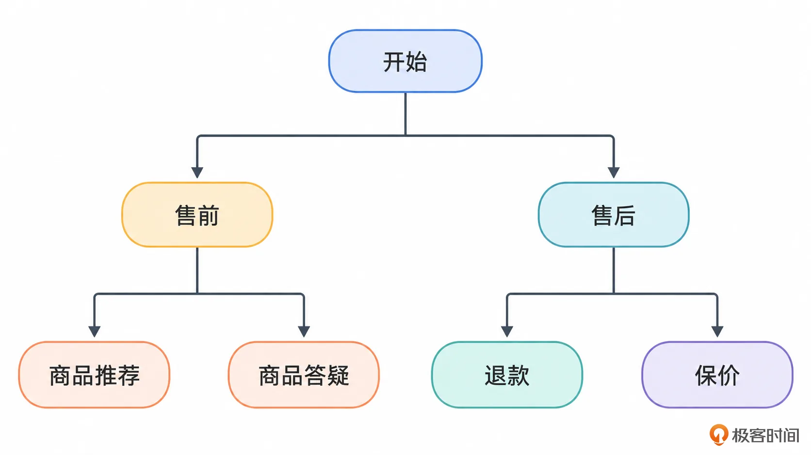

看到这张图，你是否会想到另外一个名词——决策树？有些人会说决策树和层次意图不是一回事，有一些区别，不过我个人认为两者就是一样的。

在实践中你可以组织三层、四层甚至五层意图。这种层次意图一般需要结合迭代式或者说 ReAct 式的意图识别机制，流程如图：

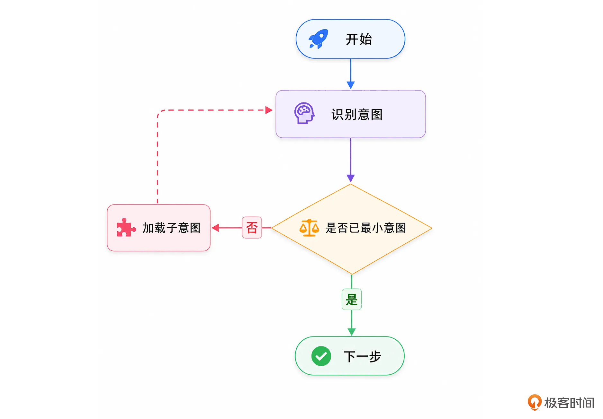

你需要注意的是，这种机制可以和 Slot filling 混合使用，最终达成的效果就非常接近 ReAct/TAO 的范式了，如图：

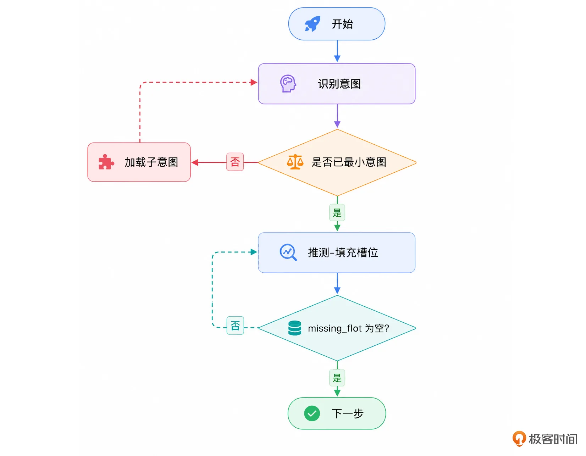

注意一点，你不要被这个图给局限住了，因为即便是在层次意图识别的过程中，你也可以要求大模型填充参数。只不过大多数时候都是只有在确定了最小意图之后，才能确定需要什么参数。但是这种组织方式优缺点都是非常明显的：

- 优点：结构清晰，结合迭代式、多轮大模型对话做意图识别准确率会非常高；

- 缺点：性能很差，毕竟要迭代很多次。


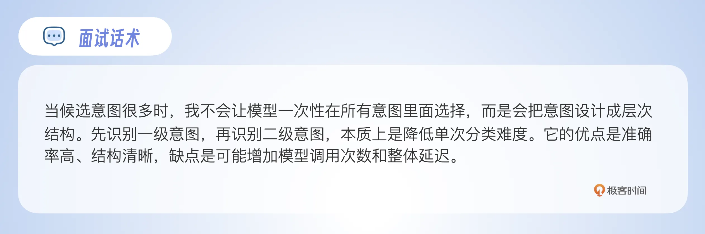

为了规避性能问题，又有另外一种做法：结合检索的意图识别。

### 结合检索，先缩小候选意图集合

这种做法也是为了解决意图很多的问题。它的思路是，既然意图有很多，那么我能不能在意图识别之前先加一个检索的步骤，而后我只把有可能的意图传递给大模型，让它进一步筛选，如图：

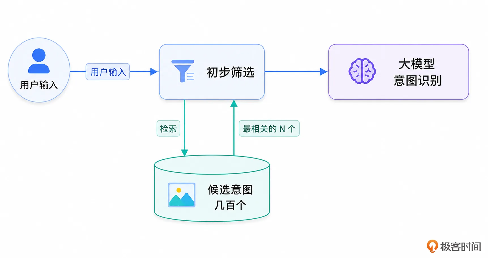

注意，这个 N 可以做成动态的。比如说考虑这些策略：

- 如果当前上下文窗口还比较空闲，那么 N 就大一些。

- 如果第一次识别没识别出来，而后要重试，那么第二次的 N 就可以比第一次的 N 更大。

- ...


不过我也强调一点，工程上要看业务规模，面试中可作为扩展方案。

从这里你还可以进一步想到一个问题，当意图非常多的时候也不一定非得结合检索，而是我还可以先用大模型做一轮筛选，而后再用大模型做最终的识别。一般而言，筛选这一轮会使用一个低延迟、低成本的大模型，只做粗召回，不承担最终裁决。

两者的区别就是第一轮筛选的时候，只携带少量上下文到大模型窗口，从而有足够的空间放下全部候选意图；而第二轮最终识别的时候，就会带上用于最终意图识别的上下文内容到大模型窗口中，如图。

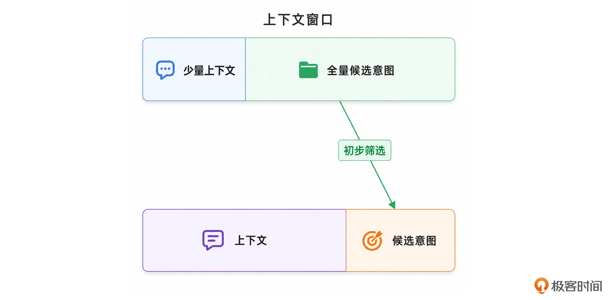

这种就是后面我要重点讲解的“动态上下文”中“动态”一词的体现了。

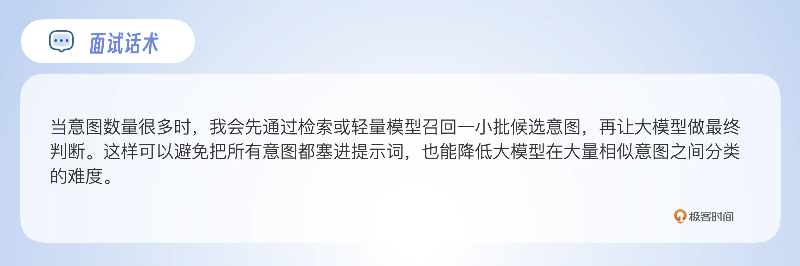

### 动态 few-shot，让模型看到最相关的案例

在意图很多，或者准备的 few-shot 案例很多的时候，会有一个问题：我将哪些 few-shot 案例放入到提示词里面？

举一个例子，售前和售后是两个很不同的问题域，所以 few-shot 例子也会很不同，例如：

> 帮我推荐一条裤子 =\> product\_recommendation
>
> 帮我退了那条裤子 =\> order\_refund

如果全部放进去，Prompt 会变得很长。如果只放几个固定示例，又可能和当前用户输入关系不大。所以在意图很多的时候，就需要考虑把能检索到最相关的 few-shot 的例子注入到提示词中。

相应的解决方案是将 few-shot 案例全部放入到数据库中（可以是普通的数据库，也可以是 Elasticsearc，还可以是向量数据库），在拼接提示词的时候，先去检索一些相关性最强的 few-shot。

从理论上来说，few-shot 应该包含两个部分：不变的部分和可变的部分，不变的部分主要是针对一些特别的场景，要求大模型无论在何种场景下都要考虑进去。如 unclear 怎么处理，unsupported 怎么处理……

可变的部分是跟当前用户的输入、上下文相关性比较强的 few-shot，整个提示词的 few-shot 部分的模板大概长这样：

```
# few-shot
固定的 few-shot 直接在 Prompt 里面写死
## few-shot 1 xxx
--动态的few-shot案例，结合搜索注入--
{{ .DynamicFewShots }}
```

这种方案的意义就在于减少了无关 few-shot 案例对大模型的干扰，这会显著提高意图识别的准确率。

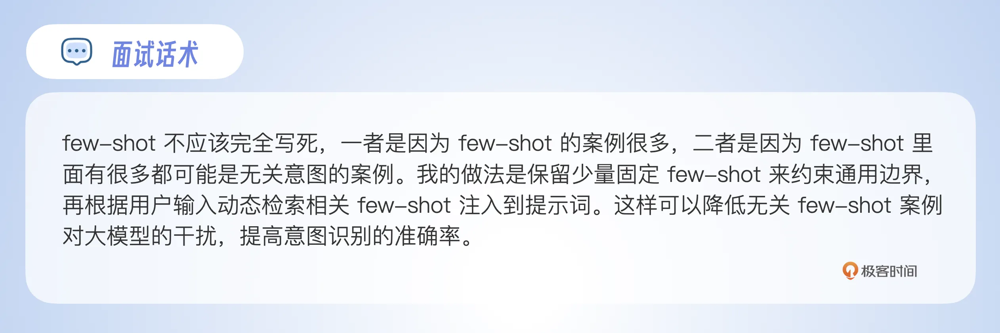

### 保证意图正交，减少边界重叠

在前面你已经看到过一个有关意图并不完全正交的例子，现在则是一旦遇到了这种问题怎么办？

第一个做法，就是先分析这种重叠是否会引发处理失败。比如说在前面的那个我精心准备的例子里面，不管是解释为商品推荐，又或是解释为商品对比，最终应该都能给出一个用户能接受的答案。

第二个是最好的做法，就是让不同的意图之间完全没有重合，确保 Agent 不会出现任何的误解。

我有两个小技巧可以很快解决意图之间不完全正交的问题。第一种技巧就是 **直接拆分一个新意图出来**，如图：

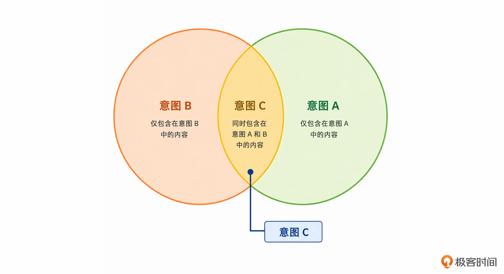

本质上就是如果两个意图之间有重合，那么就拆出来三个意图，确保完全正交。

第二个技巧是 **将相似度高的意图合并为一个**，进一步要求大模型识别出来一些参数，而后自己写一个工具，根据参数识别准确的意图。如图：

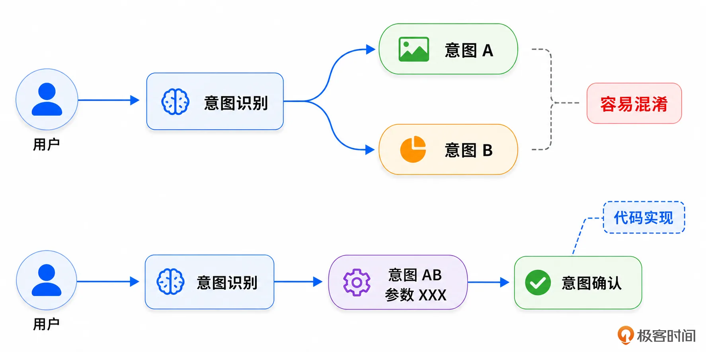

这其实也是一个小技巧：用代码等工具来处理一些大模型容易出错的、不确定性高的问题，效果很好。

这个解决方案其实揭示了一个意图识别的要点： **不要把所有差异都建模成不同的意图。很多差异应该建模成不同的参数或者参数值。**

同样地，你可以参考这个话术：

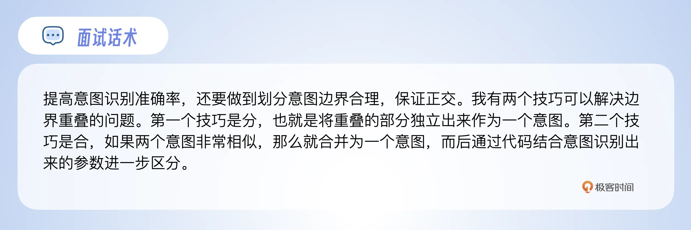

### 多意图得是真的多意图

严格来说，我认为在意图识别这一步，多意图并不难解决。后面如何组织多意图串行、并行执行，以及怎么解决上下文依赖之类的反而更加复杂一些。

多意图和单意图比起来，输出的结构会有很大不同：

```
{intents:[{A},{B}],relations:["A -> B"]}
```

首先，要深入考虑的一个问题就是： **多意图是否真的是多意图**？例如用户输入：“帮我查询上个月的数据，并且导出到 Excel 中”。你很容易就能理解，用户的本质意图是导出数据到 Excel，而前面的“查询上个月的数据”其实是一个过程性、步骤性的描述。

如果你真的要支持多意图，那么你至少要在提示词里面要求大模型能够 **忽略这一类过程性的描述**，只抓住最终的用户意图。

其次要考虑多意图之间的依赖关系。依赖关系是指多个意图之间是否存在前置条件、后置条件的关系。

如果两个意图是完全独立的，那就意味着它们可以并发执行，简单来说就是后面你可以同时启动两个 ReAct/TAO 循环执行。

你可以在意图识别阶段让大模型判定出来多个意图之间的依赖关系，也就是前面例子中的 relations 字段输出的内容。比如说有些用户输入的是：“你先做 B，不过要是你觉得 XX，你也可以先做 A”。那么在这种情况下，B 要先于 A 做，但是是在满足某个条件的情况下。

因此总的 relation 字段的描述类似于：

```
{src:A,dst:B,constraints:["XX"]}
```

如果在意图识别阶段就能判定出已经满足了约束 XX，那么 constraints 这部分是可以省略的。我的建议是只有在步入了深度推理大模型阶段，再要求它分析这种依赖关系，意图识别分析是否满足约束条件，会影响意图识别的效果。

一个更加合适的位置是 **引入显式的 Plan 机制**。也就是一旦发现是多意图就必然会触发 Plan，在生成 Plan 的阶段解析这种依赖关系，并且安排好实现顺序。Plan 的好处是可以妥善处理不同意图的不同步骤之间的依赖关系，如图：

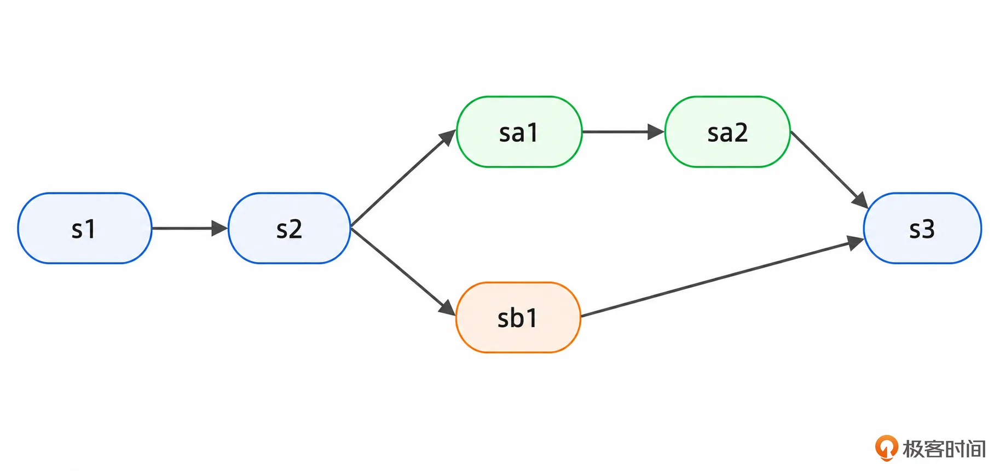

我从实践上来说，支持多意图颇有一些吃力不讨好的感觉。多意图的缺点非常多：

- 它会破坏掉第一层意图识别，以及涉及到检索的相关机制，几乎可以说多意图必然会走到三层模型的第三层。性能和准确率都会受到影响。

- 它让上下文更加难以管理。一方面是上下文 **膨胀更快**，另一方面则是要引入并发控制来管控上下文的更新、读取，避免出现 **并发问题**。


我更加建议的是 **直接不支持多意图**。或者明面上会解析出多个意图，但每次只做一件事，而后询问一下用户要不要做下一件事，比如说输出：

```
…… A 的解决方案
那么下一步我可以帮你继续处理 B，需要吗？
```

我的判定依据是事实上用户真的不在意你是不是一次性解决了多个问题。正常来说，你一次性处理掉用户的多个意图，往往意味着用户要等待更长的时间。而你直接返回一个问题的结果，继续询问要不要继续，交互感更强。

而且还有一个“降本”的好处，就是在你返回第一个答案之后，用户可能就不需要你继续处理后续的问题了。比如说在订阅制里面，一个“微不足道”的赚钱方式就是让你交了订阅费但是少用了 token。

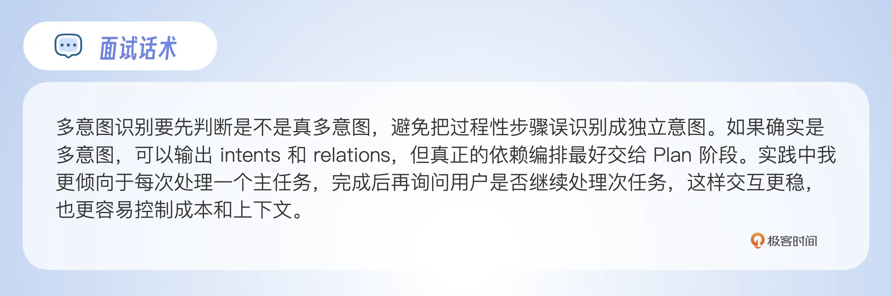

### 向量匹配兜底，沉淀业务经验

向量匹配也可以用来提高意图识别准确率。

落地方案有很多种，这些不同的做法都可以看做是同一层意图识别模型：

- 数据准备过程：提前准备一些用户输入到意图的映射，而后将用户输入转化为一个向量，于是这个向量就绑定到了一个意图上。

- 真实输入匹配：将用户的真实输入转化为一个向量 A，而后执行向量查找，找到最相似的那个向量 B。如果相似度很高，那么就认为用户的真实意图就是向量 B 绑定的意图。


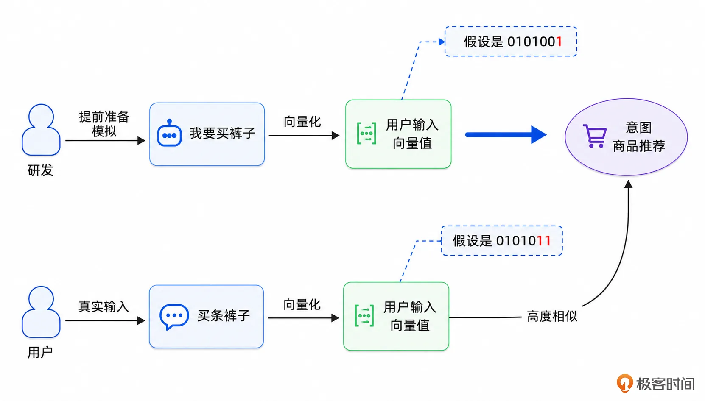

而在实践中，预先准备的向量是可以存储在不同地方的：

- **支持向量检索的第三方中间件**：最简单的就是你直接复用你的向量数据库。

- **内存**：自己写向量匹配的算法。这种思路是比较思路清奇的，它非常适合专属领域 Agent 系统。这一类 Agent 有一个显著的特点，就是大量用户的输入就是那么几种或者几十种，是可以直接枚举出来的。这种机制是纯内存运算，所以性能极好。


从前面的三层模型上来说，向量匹配这种做法是在第一层的。但是有一种特殊的作用，就是 **兜底**，这也是你在面试中可以用来刷亮点的地方。

它的思路是：用户的输入总体上是非常不可控的，部分行业、领域、业务也有一些独特的表达，常规的大模型分析意图的方式准确度堪忧。

因此可以考虑将这种特殊的输入做成向量，直接匹配到某个意图。例如前面提到的例子“我这个项目是不是太 CRUD 了，怎么讲得像个核心项目”。

这种特殊的输入，深度推理模型有时候也能处理。但是常在河边走哪有不湿鞋，长时间运行就有可能遇到识别不了的，或者同样的句子一会能识别一会不能识别。

所以你可以在 Agent 长期运行中不断迭代积累这种兜底的 **「用户输入-向量对」**，如图：

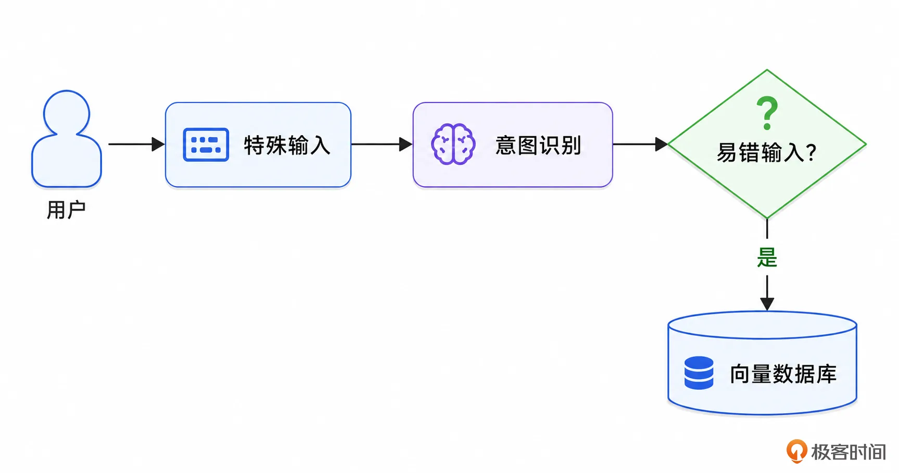

很多时候这种积累都是通过离线分析多轮对话，或者有用户反馈 Agent 有问题之后排查到意图识别出错，逐步积累下来的。当然这些也可以用于微调。

这种迭代式反馈机制你在用户输入规范化里面也见识过了，后面你会经常接触到，记住一句话： **这种机制在面试中很好用**！

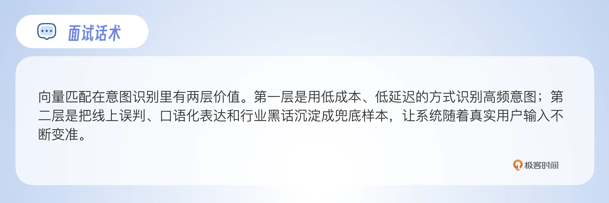

### 不识别，后回滚

严格来说这个措施不是用来提高准确率的，是用来提高识别效率的。它的基本思路是：大部分用户的意图是比较稳固的，也就是在多轮对话之间轻易不会修改。

于是它就直接跳过了意图识别这个阶段，直接复用前一轮对话的意图，继续执行。如果后续步骤发现意图不对，就回退，真的执行一次意图识别。

整个过程如图：

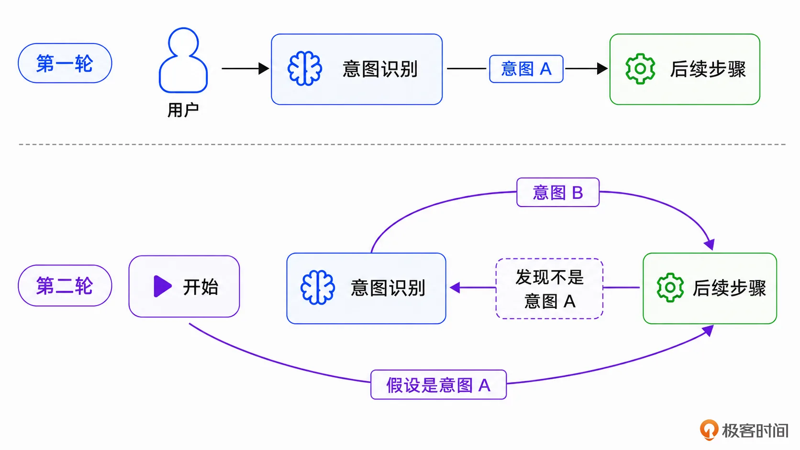

从实现形态上来说，就是在第一个步骤的提示词上设置一个兜底条款，类似于在 TAO 中加上：如果你发现用户并不是要做 XX，那么你选择意图识别工具……

如果你发现你的用户比较喜欢按套路出牌，很少搞意图切换之类的事情，那么可以考虑引入这个举措。而从面试中来说，这个做法算是一种奇诡的做法，很有创意，效果很好。

### 多识别器与意图仲裁

这种机制其实也是理论意义大于实践意义，面试好用，但是实践我觉得性价比比较低。

它的基本思路是引入多个意图识别器，而后每个识别器独立进行意图识别，最多人赞同的结果就是最终结果。简单来说就是少数服从多数。

但是你要注意一点，意图识别器并不一定都是调用大模型的，比如说一个意图识别器是基于向量实现的，一个意图识别器是调用大模型的，另外一个意图识别器是做规则匹配的。三者投票，如果票数相当则考虑澄清。

在少数服从多数的基础上，还有一些更加复杂的玩法，也就是为不同的意图识别器设置可信度，或者说权重，而后基于权重来计算一个分数。

举一个理论上的例子：

- 意图识别器 A 的权重是 0.8，输出意图商品推荐的置信度是 0.9，那么分数就是 0.8 x 0.9 = 0.72。

- 意图识别器 B 的权重是 0.6，输出意图商品推荐的置信度是 0.8，那么分数就是 0.6 x 0.8 = 0.48，此时 A 和 B 加一起的分数是 1.2

- 意图识别器 C 的权重是 1，输出意图商品比较的置信度是 0.9，那么分数就是 1 x 0.9 = 0.9。


最终胜出的意图显然是商品推荐。

之所以说是理论上的例子，是因为这个我只在制定方案的时候讨论过，但是没有在实践中用过。当然你用在面试中是无所谓的，目前能拆穿这个方案破绽的面试官估计没多少个。

### 微调大模型

除了前面提到的内容，还有一个可以用来提高意图识别准确率的，那就是微调。但是微调我一般不太建议在面试中使用，它是一个非常典型的双刃剑：

1. 微调有关的面试题还是比较有难度的，不管是数据准备还是效果评估，亦或是参数调优，面试容易失误。

2. 微调一旦面好了，非常加分。


所以我的建议是你可以考虑在面试之前，先用阿里百炼之类的平台，借助他们提供的工具先试试微调，有些心得体会。

## 总结

提高意图识别准确率，不是简单地把提示词写长一点，也不是无脑换一个更强的大模型，这是一个系统性的工程。

在实践中你可以根据自己的业务来自由选择前面的那些高级策略。如果是在面试中，我比较推荐使用向量化方案。

而后你可以进一步讨论意图正交、不识别-后回滚策略，这两个的核心优势是罕见，你在别的地方估计看不到这么奇诡的做法的介绍，能够突出差异化。

其余内容就没太大特色了，作为可选项，等面试官提到的时候你可以顺便提起。

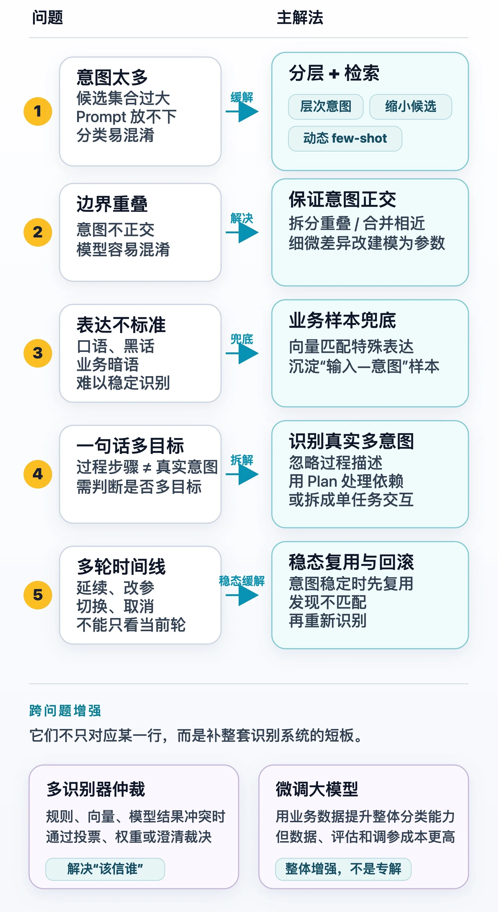

## 思考题

最后也请你来思考一个问题：在前面的内容中提到了一个词“置信度”，那么怎么教大模型计算置信度？或者说大模型的置信度真的值得相信吗？这个问题我也没有很好的解决方案，欢迎大家一起来讨论。如果有好的解决方案，欢迎你分享到留言区，如果你有所收获，也欢迎分享给其他朋友，我们下节课见！