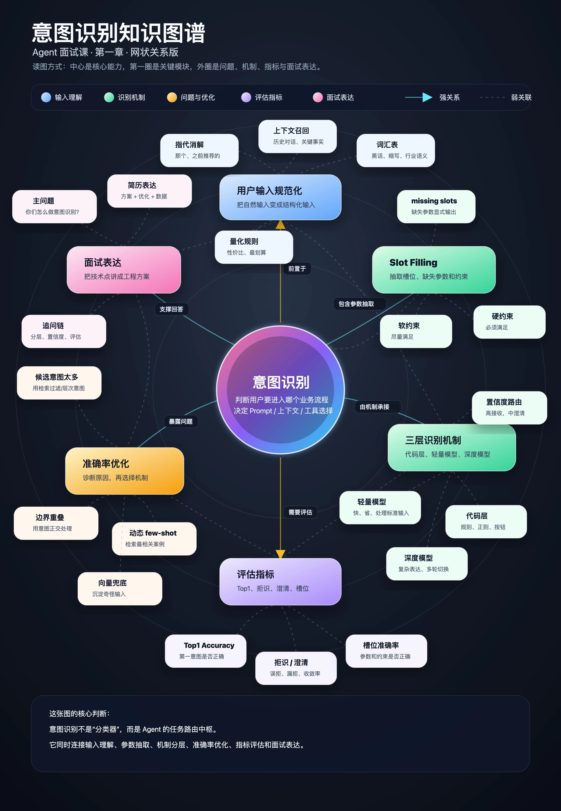

# 04｜意图识别面试攻略：简历和竞争力方案应该这么写
你好，我是大明。

制作有关意图识别的面试方案的时候，要注意做好两方面内容：

- 相关的八股文你得背好，我前面的三篇文章覆盖了很多内容，但是依旧有一些内容没有覆盖到。你可以通过和 AI 交流，又或者收集网上的面经来补充完整。

- 准备一个有特色的意图识别机制，最好是能够结合你的业务特征来设计独有的意图识别方案。

当然，在这之前我会先教你怎么撰写简历。

## 简历如何写？

你需要在两个地方重复提及意图识别：个人技能/优势和项目贡献。当然了，如果你已经是大佬了，那么这个写法是不适合你的。

### 个人技能/优势

第一个地方是在个人技能/优势中提起。我一般建议你将意图识别融入到 Agent 工程这一条能力中，因为意图识别的体量太小，不足以独立成为一个个人技能/优势。如：

- 意图识别：xxx。（不要这么写）

- Agent工程化：……具备从用户输入规范化、分层意图识别、Slot Filling……有优化意图识别准确率的实战经验

上面是一个模板，你可以换不同的写法，核心有两个：点明技术关键字和提及优化。

第一个是 **提到必要的技术关键字**，这会是面试官提问的切入点，一定要用专业的、确保大部分面试官都听过的技术词汇。

注意，也不要选那种非常高端的，比如说微调这种，因为很多面试官没有做过微调，你写了他们也不敢问。

第二个是要 **提到意图识别优化**，基本上就是聚焦在怎么提高意图识别的准确率上。这也是一个引导点，大部分面试官看到你这么写，就会忍不住问你如何优化的。

### 项目贡献

在项目贡献中可以写得更加详细一些，写作的原则是：解决方案的关键技术词汇 \+ 改进优化 \+ 最终数据。

最通用的一个模板是：

> 基于 A，结合 B，并通过 C，提升 / 优化 / 完善了 D、E、F 等效果。

其中 A 是基础，也就是你整个方案的基石，是你方案的核心。A 必须具备三个特征：

- 是技术解决方案

- 该解决方案水平不差

- 面试官大概能看懂。

这里说大概能看懂而不是一定能看懂，是因为一些创新性的方案面试官能望文生义，但是具体内容和细节他大概率是猜不到的，需要你进一步解释。后面的 B 和 C 先后无所谓，都是罗列一些你解决方案里面希望面试官追问的、相对于你求职岗位而言有技术含量的点。

最终数据最好包括绝对值，也包括相对值。前者是凸显你做到了一个什么水平，用来和行业标准进行对比；后者是用来强调你的优化效果，也就是系统在经过你的努力之后，提到了多少。双管齐下就能证明你的能力非常强。

我应用这个模板给你写了个例子：

> 例子1：基于分层意图识别与 Intent + Slot Filling 机制，结合动态 few-shot 和向量兜底，并通过拒识澄清、槽位补全、多识别器仲裁和反馈闭环，将核心意图 Top1 准确率提升至 xx%，较优化前提升 xx%，同时将平均意图识别耗时控制在 xx ms / xx s 以内。

这种写法引导效果非常好，但是难免读起来会有一种词汇堆砌的感觉，并且通常写得会比较长。所以你可以考虑 A、B、C 各用一两个词汇，并且常见的词汇就不用写上去了。

你要小心的是，一旦你写了数字，就要想好怎么解释这个数字。常见的问题是：

- 你这个数字怎么来的：也就是你怎么统计到的。具体到这里就是你怎么知道 Top1 的数据的？你就可以回答使用测试。

- 数字太大/太小/太好/太差：你都要有相应的解释。记住一句话，你千万别觉得自己的数据非常好，所以就没有准备“为啥你的效果那么差的问题”。举个例子，小伙伴出去说自己的稍显规模的分布式服务集群可用性能到 99.99%，但是依旧会有面试官认为 99.99% 太低了。

- 你这个数字好不好：这种一般出现在高级工程师级别以上的面试中，本质上是考察你对业界的水平是否了解。

当你学会了简历怎么写之后，现在需要的就是进一步搞一个有竞争力的解决方案了。

## 有竞争力的意图识别机制

这里我先给出构建一个有竞争力的面试方案的通用思路，分成三个部分：

- 过去是怎样的，这里我称为 v0 版本：用来解释为什么你需要做优化，因为过去做得不太好。

- 现在是怎样的，这里我称为 v1 版本：这就是你优化后的版本。

- 未来是怎样的：这是你打算做成什么样子的。一般来说如果你要是面薪资、职级比较高的岗位，这一块反而应该要有一个比较深入的考虑。

那么回到这里，你在面试中基本上可以用的一个思路就是：

**v0 版本：** 只有一次深度推理大模型调用，没有考虑用户输入规范，也没有考虑意图识别的效率问题。在这个基础上你还以说这个版本的其他缺陷：

- 缺乏数据支撑，连准确率都没有统计。

- 无法处理很多边缘情况，意图识别效果不好。这里你要根据你的业务来准备几个奇怪的用户输入，可以是病句、黑话或者我在前面几篇里面列举过的一些“脑洞大开”的案例。

**v1 版本**：这个版本也可以分阶段说，也就是你的改进不是一次性改好的，而是逐步改好的。

第一阶段：引入了轻量级大模型，用来快速识别一些比较“标准”的用户输入。

第二阶段：在第一阶段的基础上，进一步引入了基于代码层（也就是三层模型中的第一层），这里我建议你用向量。引入向量是为了解决过去的两个问题：快速并且准确判定用户意图，兜底识别一些奇怪的输入。

第三阶段：你需要引入一些高级的机制了，这些机制在前面几章都讨论过。

- 如果你的 Agent 面对的用户非常多，输入五花八门，这个时候你需要引入一个显式的用户输入规范步骤。

- 如果你本身要支持的意图很多，那么可以考虑引入动态 few-shot（也就是先根据用户输入检索到 few-shot），也可以考虑引入层次意图、检索过滤意图的机制。

- 在向量匹配的基础上，引入反馈机制（沉淀机制），收集线上出现的奇怪用户输入，放入到向量数据库中，充实兜底数据库。这个比较通用，几乎任何 Agent 都能用。

- 引入多意图的解决方案。这个要谨慎使用，如果要用记得突出我讨论的“过程性”描述，并不是真的多意图；以及我秉持的多意图支持就是没必要的观点，引导好用户逐步深入就行。

- 引入微调，前提是你能防得住面试官追问。而后你可以强调微调是用于第二层，也就是轻量级大模型调用意图识别的过程中。

**v2 版本**：这里你几乎就可以自由发挥了，可以说说自己打算做的改进。

- 如果 v1 版本你没说多意图、微调两个点，那么你就可以在这个阶段说，也就是提及你准备进一步做这个。

- 解决反话的问题：这个局限性太强，只有部分领域的 Agent 才用得上。

- 引入一些离线分析或者在线分析的机制：在 N + 1 轮的时候根据用户输入判定第 N 轮的效果，可以间接用来评估第 N 轮的意图识别的效果。

## 总结

意图识别在整个 Agent 中是一个非常基础的内容，应该说很多 Agent 效果不好其实就是意图识别这个部分做得很差。

从面试的角度来说，意图识别这一个部分有一个很大的好处：一般面试官都在纠结后面的上下文怎么管，ReAct 怎么实现，所以你说你的意图识别做得很厉害，一般能给他留下一个很不错的印象。

从实践的角度来说，如果你现在已经有一个 Agent 了，那么我建议你先要评估一下意图识别的效果，并且最好建立一个长期的意图识别成败的监控机制。要是发现意图识别效果不好，那么你就可以考虑引入一些优化机制，也算是理论实践结合了。

此外我还有一个建议，目前我发现了很多国内 Agent、AI 助手之类的，在意图识别上真的只能说差强人意。那么我的建议就是，你可以试着用你业务领域的常见场景去试探一下这些 Agent，看看它们能不能正确识别意图。

那么从下一章开始，我将开始跟你讨论 Agent 内部运作的细节了。

下图是汇总了意图识别这一章节重要知识点的知识图谱，供你回顾复习，另外我也在附件里放置了面试题和案例模版，供你学后自检。（注：附件只能在PC端下载，手机端不支持）

