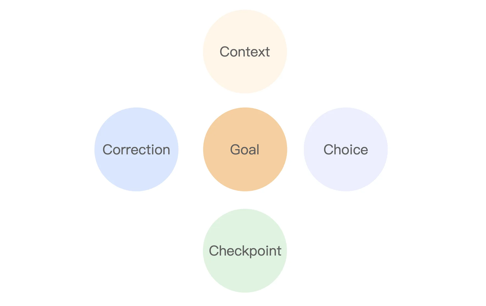
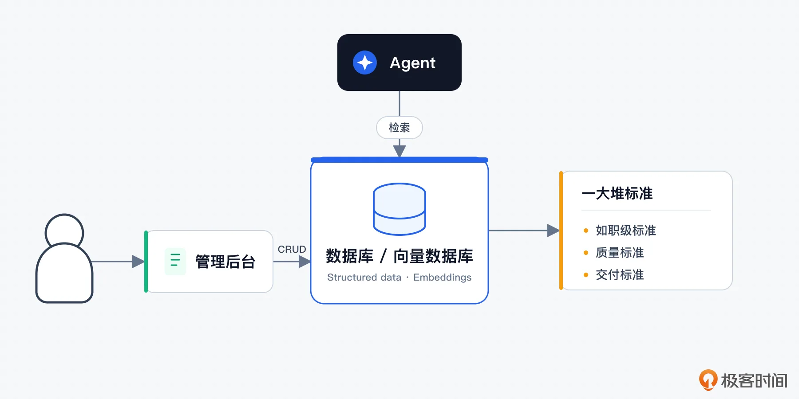

# 05｜Agent 的 Plan 机制：好 Plan 必备的 5 要素（G4C）
你好，我是大明。

从这一讲开始我们要讨论一个新的话题，也就是 Agent 的运行模式。那么首先要讨论的就是一个比较简单的形式： Plan。

相信你在实践中已经接触过很多有Plan功能的 AI 产品了，最典型的就是 AI 编程工具——Codex，Claude Code 之类的。我也喜欢在实施重大变更之前先让 Agent 搞一个Plan出来，经过我的评审、纠正和同意之后才能执行。

同时我也用过一些比较糟糕的 Agent 产品，尤其是作为体验者去体验一些测试 Agent 的时候，它们的Plan功能往往构建得并不是很好。它们给出的Plan看上去合理，但是执行过程、最终结果总是会出现各种意外。

接下来我会先给出我使用的方法论，你不必完全照抄，因为我认为现在 Agent 还是一个百花齐放的状态。而且每一次大模型的进步都有可能导致这些方法论变得不合时宜，所以你要记得取其精华去其糟粕，也要记得适时而用。

## Plan 的基本思路

很多人做 Agent，一提到 Plan，脑子里想的就是让大模型先输出一个步骤列表：

1. 先分析用户需求；

2. 再收集相关信息；

3. 然后执行任务；

4. 最后总结输出。


这种看起来像是一个标准的Plan，它有效果，但也只有一点点。因为它完全没有回答：

- 用户的目标是什么？

- 当前已经知道什么，还缺少什么？

- 有没有约束？哪些约束不能违反（硬性约束），哪些约束只能尽量满足（软性约束）？

- 为什么步骤安排是这样的？比如说为什么第一步就非得是第一步？

- 如果 Plan 执行过程中出问题了，那么应该怎么办？

- ...


所以， **步骤只是其中的一个部分，是表现形态**，也是你最终看到的产物。在这之前，还有很多的步骤，很多的内部信息，是你需要关注的。

现在先来看第一个问题，Plan的本质究竟是什么？如果不是具体步骤，那么又是什么？

我认为，Plan 的本质就是解决执行中的不确定性。又或者说，Plan 不是步骤列表，而是一个可检查、可纠偏、可执行的运行时对象。


如图，没有 Plan 的情况下，你的 Agent 要从 A 达到 B，不知道会搞出什么幺蛾子，如红蓝两条线。而一个 Plan，即便质量再烂，也能在 A 和 B 之间划出一条比较清晰的线，有助于 Agent 输出一个好的结果。

所以问题来了，不确定究竟有哪些不确定？

### 不确定性

不确定性的来源有很多，我这里列举几个关键来源，这也是导致你 Plan 执行失败的根源，也可以说是导致你的 Agent 执行失败的根源。

第一个是 **目标不确定性**。当用户输入“帮我优化一下那个项目”的时候，他到底是要：

- 优化简历项目描述？优化项目架构？

- 朝什么方向优化？

- ……


显然，如果目标没定清楚，后面执行越努力，偏得越远，所谓南辕北辙而已。

第二个是 **上下文不确定性**，这一点我相信你做过 Agent 应该深有体会了。比如说“那个项目”：

- 是指哪个项目？

- 之前已经讨论过这个项目的什么内容了？有哪些达成一致了？

- 跟项目有关的信息，哪些是明确的、用户认可的？哪些是模糊的，还要进一步收集或者澄清的？

- ……


你可以理解为，制定Plan的基石就是理解清楚这些上下文。

第三个不确定性，是 **路径不确定性**。也就是说达成一个目标的方式有多种，你应该用哪一种？哪一种比较好？具体到前面的例子就是：

- 先追问用户补充信息？

- 先基于已有内容生成一版？

- ……


对于Plan来说，为什么选择这条路径要比路径本身更加重要。后续我们在排查问题的时候，也是极度依赖于“为什么”这一点。

第四个是 **过程不确定性**，它是指你的 Agent 运行期间，是否“合法”。比如说在修改润色项目经历的时候，怎么判定：

- 有没有体现技术复杂度？

- 有没有遵守用户的约定？

- 有没有量化结果？

- ……


而过程不确定性这种东西是无解的，只能是通过一些手段来减轻这种不确定性。比如说后续讨论到的 Checkpoint（检查点）机制，也比如说在 Prompt 里面强调遵守各种约束等。

#### 失败的不确定性

最后一个则是 **失败的不确定性**。俗话说成功只有一种，但是失败却有无数种，那么失败的原因也就有无数种了，而针对不同的失败情况要怎么处理呢？

- 重试当前步骤？

- 重新查询上下文？

- 追问用户？

- 还是当前这个步骤已经错得离谱以至于需要从头开始执行？

- ……


这时候你可能会发现，说了这么多不确定，怎么我平时用各种 AI 工具生成的Plan里面完全没有对应的体现呢？

其实道理也很简单，一是因为你的工具不一定遵循这种分析方式，二是刚刚的这些信息多数属于工具内部信息，而你看到的是外部输出。

你回顾一下自己平时制定Plan的时候，难道就是简单写一下步骤？那必然不是。你脑子里面可能已经想过很多东西了，目标想清楚了，条件想清楚了，最后才写下来 Plan。而你最终提交给你老板的，会是包含了那一大堆过程的东西吗？必然只会包含最后的一个步骤列表。

所以我再次强调一下我对Plan的定义： **Plan不是步骤列表，而是一个可检查、可纠偏、可执行的运行时对象**。

那么接下来我就要给出一个具体的方法论，告诉你该如何指导 Agent 制定、生成一个不错的Plan。

### G4C

这个方法论叫做 G4C，是五个单词的首字母的缩写，也是一个好的Plan至少要包含的内容：Goal、Context、Choice、Checkpoint、Correction。



核心问题

缺失后果

Goal

我要达成什么？什么叫成功？

目标漂移

Context

当前知道什么？还缺什么？

凭空Plan，无中生有，幻觉

Choice

为什么这么走？还有哪些路径？

生成机械步骤，无法根据情况实时制定

Checkpoint

怎么知道当前步骤对不对？

无法及时发现问题，发现问题只能重来

Correction

发现偏差后怎么办？

无法恢复，只能重来

从我的经验上来说，很多Plan没有 Correction 也不是不能运行，无非就是没有办法在运行过程中纠错。

一句话来总结，就是： **Goal 解决要去哪，Context 解决现在啥情况，Choice 解决怎么走，Checkpoint 解决怎么知道走偏了，Correction 解决走偏之后怎么拉回来**。

#### Goal：目标与成功标准

第一步是要定义清楚 Goal，也就是目标。

先直观感受一下一个普通的目标，也是我们最开始构建一个 Agent 的时候可能随手写下的：帮用户优化项目。

当然这个目标的描述实在太简单的，所以可以进一步细化：将用户原始 CRUD 项目改造成适合 Java 后端高级工程师面试表达的项目经历，要求体现技术复杂度、业务价值、工程治理能力和可追问性，并且不能虚构用户没有做过的内容。

还可以进一步输出一个结构化的内容：

```
{
    "goal": {
        "user_goal": "优化项目经历，使其适合阿里 Java 后端面试",
        "success_criteria": [
            "体现技术复杂度",
            "体现个人贡献",
            "体现业务价值",
            "能支撑面试官追问",
            "不虚构用户没有做过的内容"
        ]
    }
}
```

那么这就算是一个好的目标了吗？并不是，这个目标同样并不清晰：

- 什么叫做适合 Java 后端高级工程师表达？什么是高级工程师？多高算高级工程师？

- 体现技术复杂度，体现到什么地步？多复杂才算复杂？

- 什么是可追问性？怎样才算可追问？


说到这里你应该领悟到了，要想把这个目标写好，最重要的是 **给出标准**。这里不是说你在写提示词的时候给出标准，比如说在通用 Agent 里面你根本想不到有人会寻求“适合 Java 后端高级工程师的表达”这种事情。 **这种标准是需要大模型自己定义出来的**。

一些专属领域的 Agent 可以做得更好，因为这些 Agent 可以预测到用户会有一些什么需求。比如说有一个专门改简历的 Agent，那么就可以在提示词里面写清一些内容，不同等级的工程师的能力标准。当然，如果各种标准数量多了，就可以引入知识库或者RAG之类的机制了，结合检索来查找对应的标准。



最后我再额外提一点，我在构建 Agent 时一个深刻的感悟，就是： **很多形容词都是不稳定性、幻觉的来源。** 如果你发现你的 Agent 输出不太稳定，那么不妨精确定义这些形容词的内涵。

#### Context：上下文与约束

这一部分我会在后续内容里面详细讨论，这里先将框架讨论清楚。

Plan 阶段的重要目标就是要搞清楚上下文中：当前已经知道什么？还缺什么？哪些信息可信？哪些信息不能乱用？

比如说在前面的例子中，上下文中维护的内容可以是：

```
{
    "context": {
        "known_facts": [
            "用户认为项目偏 CRUD",
            "目标岗位是 Java 后端",
            "目标公司是阿里",
            "用户希望同时生成面试追问"
        ],
        "missing_info": [
            "项目背景",
            "技术栈",
            "业务规模",
            "用户负责模块",
            "性能或稳定性数据",
            "实际做过的优化"
        ]
    }
}
```

并且，在生成Plan和执行Plan的时候， **最重要的就是保证约束的地位**。也就是要让大模型一直把你的约束当回事，而不是过一段时间或者上下文一长就忽略。

我有一个简单的技巧，就是将约束分成硬约束和软约束，在上下文中独立维护。而后每次调用大模型都将这两个约束都放入到系统提示词中。大部分情况下大模型是不会忽略你在系统提示词中强调过的约束的，即便上下文比较长，系统提示词的地位足以保证这些约束的影响力不会被削弱。

举个例子，假设用户还说了一句话“项目经历不能虚构”，那么在对应的上下文里面至少会有这个部分：

```
constraints:["不能虚构项目事实"]
```

这部分就需要你放入到系统提示词中。

#### Choice：关键决策与路径选择

这个部分大概最符合你对Plan的想象了。它本质上就是回答一个问题：有什么路径可选以及为什么选这个路径。

在前面优化项目经历的例子中，至少能够想到四条路。

- 信息不足，先追问。比如说缺乏项目事实、业务规模、技术难点，就先追问用户。

- 先生成粗稿，再迭代。比如说用户明确要求，或者已有信息基本够用，可以先生成一版，再让用户确认。

- 先对标岗位，再反推项目亮点。这又是另外一个思路了，也就是反过来分析目标岗位需要什么能力，再从项目里面挖掘对应亮点。这也是我在分享的时候描述的“先射箭，后画靶子”思维。

- 先生成面试官追问，再倒推项目表达。也是先射箭再画靶子的思路，先生成面试官可能追问的问题，再反推项目应该怎么包装。


那么在这个环节，关键就是要求大模型输出候选路径以及选择理由。下面是一个简单的例子：

```
{
    "choice": {
        "selected_path": "先抽取和补齐项目事实，再生成项目亮点，最后生成面试追问",
        "reason": "如果直接包装，容易违反不能虚构的要求；面试追问应该基于最终项目亮点生成",
        "steps": [
            {
                "id": "extract_project_facts",
                "objective": "抽取已有项目事实"
            },
            {
                "id": "ask_missing_info",
                "objective": "追问缺失的关键信息"
            },
            {
                "id": "generate_project_highlights",
                "objective": "生成项目亮点"
            },
            {
                "id": "rewrite_project_experience",
                "objective": "改写项目经历"
            },
            {
                "id": "generate_interview_questions",
                "objective": "基于项目亮点生成面试追问"
            }
        ]
    }
}
```

实践中输出可能要复杂很多，尤其是 steps 字段。例如说 steps 加一个 reason 字段，也就是要求大模型解释为什么需要这一步。这在实践中还是挺好用的，尤其是在排查问题、优化 Agent 效果的时候。

我还额外看过有些人会要求大模型就步骤的顺序也做出解释，因为他们遇到过步骤顺序安排不合理的情况。随着大模型推理能力进步，我认为已经没有很大的必要去解释步骤顺序了。

#### Checkpoint：检查点和过程校验

我认为这是一个最容易被忽略的东西。Checkpoint 回答的问题是：我怎么知道当前步骤做对了？

它有两个非常强大的作用。第一个作用是在Plan执行过程中， **防止偏离**。没有 Checkpoint，Agent 就只能一路执行到最后，然后输出一个看起来完整但可能完全错误的结果。

比如说在“抽取项目事实”这一步，Checkpoint 可以是：

- 是否抽取出来了项目背景

- 是否抽取出用户负责内容

- 是否识别出缺失信息

- ……


第二个作用是 **为后续的重Plan和根因查找提供依据**。也就是在 Agent 出错了之后，可以通过检查点来快速排查、定位问题根源。它有点像每个岔路口的路标，你通过检查这些岔路口的路标，就能快速知道自己大概是在哪一步出了差错。

类似地，Checkpoint 也是依赖于大模型推导出来的。你只能在提示词中告诉它要设置检查点，一些领域专属的 Agent 里面你还能进一步提供一些更加细致的引导。

下面是一个例子：

```
{
    "checkpoint": [
        {
            "step_id": "extract_project_facts",
            "checks": [
                "是否区分事实和推测",
                "是否识别出缺失信息",
                "是否保留用户硬约束"
            ]
        },
        {
            "step_id": "rewrite_project_experience",
            "checks": [
                "是否存在虚构内容",
                "是否体现技术复杂度",
                "是否有量化结果",
                "是否适配阿里 Java 后端面试"
            ]
        }
    ]
}
```

那么在Plan的执行过程中，每一个检查点，都要求输出明确的检查结果，并且最好带上证据。例如说：

```
check_results: [
    {
        "check_point": "量化结果"，
        "result": "所有都有量化结果",
        "evidences": [...] // 这是每一个贡献点上罗列出来的证据。
    }
]
```

后续纠偏机制就可以通过这些 check\_results 来查找根因。

#### Correction：纠偏机制与失败恢复

Correction 要解决的是一旦出错了，我还能不能挣扎一下，试着拯救一下。常规的手段有几种：

- **重试**：重试还可以进一步细分重试当前步骤、重试局部流程以及从头开始重试。一般工具偶发失败、模型输出格式错误、网络超时等问题只需要重试一下就可以。

- **Replan** ：不同于重试，重试并不修改原Plan，而 Replan 则是认定Plan本身有问题，所以才需要重新生成一个Plan。

- **澄清**：这是我认为大部分 Agent 没做好的地方，它们都倾向于不管三七二十一先给出一个解决方案。而我的看法恰恰相反，一个错误的、不好的回答只是在浪费时间浪费 token，不如尽可能找用户收集了足够的信息而后再执行。

- **回滚**：如果中途发现数据、状态有错误，可以尝试将状态回滚到某一个步骤之前。而这个回滚一般是和 Checkpoint 配合使用的。

- **中断**：确实是错了，而且是不可挽回的错误，这个时候就只能中断并告知用户出错了，由用户来决定后续要做什么。


下面是一个例子：

```
{
    "correction": [
        {
            "condition": "缺少关键项目信息",
            "action": "向用户澄清"
        },
        {
            "condition": "生成内容包含未经确认的事实",
            "action": "回滚到事实抽取阶段"
        },
        {
            "condition": "用户否认某个技术点",
            "action": "删除该技术点并局部 Replan"
        },
        {
            "condition": "面试追问无法从项目经历中推导",
            "action": "重新生成项目亮点或降低表达强度"
        }
    ]
}
```

你可以引入结构化的 action 字段，这样它的扩展性更好，并且能承载一些复杂的参数。这个 action 其实就等同于在 TAO/ReAct 循环中的 action，换句话来说这里其实也已经说明了是用 tool，Skill 来解决问题了。

剩下的问题就是，Prompt 怎么写？

### Prompt 怎么写？

这里我给你一些生成Plan的Prompt建议，你可以参考。

首先是要求大模型 **给出非常明确的目标**，而后要求大模型针对目标中的形容词定义清楚标准。在定义标准的这个过程中，要允许大模型去 RAG 或者知识库里面去检索你预先定义的标准。

例如说你事先在知识库里面定义了不同级别的工程师的能力要求、面试要求，那么大模型检索到之后，它就能明确描述“什么才是符合高级工程师的项目经历”。

其次是在上下文中， **进一步强调约束**。这些约束在多轮对话中一般是通过专门的摘要提取步骤，或者直接就是一个约束提取步骤提取而来。你需要在Prompt里面带入这些约束，生成Plan的时候并不能违反这些约束。下图是一个简单的示意：


你要注意一点的是，在Plan执行的过程中，约束也同样不能违反。但是这些约束可能被更新了。比如说用户提了新的要求，又或者改了已有的要求。同样，你还要强调除非用户输入了新的约束，否则 Agent 自己并不能改约束， **每一个约束的修改都需要有用户输入作为证据**。

第三个是在生成Plan步骤的时候，要 **强调输出路径以及选择路径的理由**。你要提防的是，有些时候大模型可能选了路径之后瞎编一个理由，这种情况很罕见但是并非完全不可能。至于解决方案，也还是那句话，它的理由必须要有根据，也就是 evidence-based。

第四个则是生成检查点的时候， **要注意一个粒度的问题**。你不能要求大模型每一个步骤都检查，也不能要求隔很久都不检查。有几个点可以参考：

- 参考软件工程上提到的里程碑的概念，也就是每次从业务逻辑上达到了一个新的状态了，就要确定一个检查点。

- 关键中间步骤完成，此时也可以设定一个检查点。这种关键步骤一般都出现在它的产物会对后续结果有显著影响的地方。

- 容易出错的步骤，后面设定一个检查点。这个一般源自 Agent 长期运行过程中，每次出问题之后就补一个，比较被动。


这些规则你可以固定到生成Plan的提示词里面。

最后一个则是 **纠偏机制**。你可以在提示词里面列举不同的业务失败场景，以及对应的纠偏做法。同样的，如果业务上有很多失败的可能，那么就可以结合 RAG 或者知识库，根据不同上下文选择性注入到提示词里面。

当然了，常规的定义角色、few-shot、JSON schema 之类的这里就不再赘述了。

### 怎么评估生成的Plan质量？

这算是一个老大难的问题。它不同于意图，意图是枚举，你用字符串比较就可以。而Plan是一个动态的内容，大多数时候是一个 JSON 串，好与坏你基本上无法通过字符串比较之类的操作来确定。

第一种可行的方法是 **用大模型离线分析生成的Plan**。离线分析的时候可以做到比较细致，并且同样可以做到围绕 G4C 来评价。我给出几个我日常比较关注的点：

- 是否违反约束，尤其是硬约束。这种大模型很容易就判断出来，也是比较好收集的信息。

- 是否有足够的检查点。这一个不太容易评估，因为有无检查点容易评估，是否足够就不容易评估，你得明确告诉大模型什么才是足够。比如说最简单的办法就是认为检查点数量应该是步骤数量的 1/N，比如说 1/3，也就是平均三个步骤就要有一个检查点。


要注意在生产环境运行的时候，你可能没有足够的资源来分析全部生成的Plan，这种时候你可以考虑引入抽样机制，只针对部分Plan进行分析。

第二种可行方法则是 **线上评估**。线上评估有很多指标，这些指标可以直接或者间接地评估出你生成的Plan质量，我直接列举成了一个表格，你可以参考。

指标

解释

Plan完成率

按Plan完成任务的比例，你通过 Prometheus 可以监控到

步骤成功率

每个步骤执行成功率，同样可以通过 Prometheus 监控

重Plan触发率

执行中需要重Plan的比例，同样通过 Prometheus 监控

用户纠正率

用户说“不是这个意思”“你理解错了”的比例，这需要在用户输入之后引入一个评估/观察步骤，比较麻烦。

最终任务成功率

用户目标是否达成。这个其实也不太好评估，因为Plan完成并不等于最终任务成功，更加不等于达成用户目标，但是可以认为一般情况下任务完成，Plan质量就挺不错的。

## 高级方案：迭代式Plan生成 + DAG 式Plan生成

前面提到的基本思路，有两个显著的特点：

- 生成Plan的过程简单，调用一次大模型，或者叠加几次工具调用来获得一些外部数据，如评价标准等。

- 产生的Plan比较简单，是一种线性的 Plan，也就是第一步做啥，第二步做啥……。


### 迭代式Plan生成

先来看第一个问题的改进思路。

调用一次或者几次大模型就生成了 Plan，就意味着生成的Plan质量有可能会很差，容错率非常低。所以一种改进的思路就是引入类似于 ReAct 之类的循环，准确说叫做 **生成-评估-修正循环**，如图：


因此关键就在于怎么打通评估到修正的执行线路。

为此首先你要引入一个评估器（Plan Verifier）。这个评估器跟前面的离线分析的评估器其实是一回事，不同之处就在于这个是需要在生成Plan阶段就运行。

这个评估器在发现问题之后，会输出一个类似这样的内容：

```
{
    "score": 0.78, // 这个你需要给出一些评分标准，不然就只能让大模型自由发挥
    "goal_issues": [],
    "context_issues": [
        "没有识别出用户实际负责模块缺失"
    ],
    "choice_issues": [
        "当前Plan直接生成项目描述，存在虚构风险"
    ],
    "checkpoint_issues": [
        "缺少事实一致性检查"
    ],
    "correction_issues": [
        "没有定义用户否认技术点后的回滚策略"
    ],
    "suggestions": [
        "先追问用户实际负责内容",
        "增加事实一致性检查",
        "增加局部 Replan 条件"
    ]
}
```

注意你不需要死板照抄我这个设计，你可以自由定义评估器的输出，评估器的提示词也是可以在运行过程中迭代演进的。

这个改进点的核心是： **Plan生成之后不要马上输出或者执行，而是先做审查**。这相当于给 Agent 的执行Plan增加一次 Code Review。

从效果上来说，这种迭代式的Plan生成大部分可能一次循环就结束，但是少部分会需要多次循环，同时你也要注意控制最大循环次数。

同样你可以监控循环次数。平均循环次数越多，说明你的Plan生成机制越有问题，越需要改进。

### DAG式Plan

接着看第二个问题，也就是线性的Plan。其实不在面试场景的话，我都建议你直接用线性的Plan，因为它简单、可靠，排查问题也容易。

不过面试可以考虑采用这个方案。方案的要点是生成Plan的时候， **要求大模型识别不同步骤之间的依赖关系，进而生成一个 DAG**。

核心是先识别依赖关系，而后再根据依赖关系生成 DAG。DAG 的表达形式，我推荐使用下面这种：

```
{
    "nodes": [
        // ...
        {
            "id": "generate_highlights",
            "depends_on": [
                "extract_project_facts",
                "analyze_target_role"
            ],
        },
        // ...
    ]
}
```

少部分情况下，例如说依赖关系带属性的，可以考虑使用这种结构：

```
"edges": [
   {
       src: "extract_project_facts",
       dst: "generate_highlights",
       attrs: {}
   }
]
```

你注意，Prompt里面要补充下面这些内容：

- 识别依赖关系的规则，最好是越详细越好。

- 一些反常规的例子。比如说可以并行但是在你的业务里面不能并行的，一些不能并行但是在你的业务里面偏偏可以并行的。

- 检查是否存在循环依赖。你可以让大模型初步检查，但是最终还是要自己用代码检查一遍。我试过一些大模型，它们在识别循环依赖上又慢又容易出错。


最后别忘了加一些 few-shot。

此外你还可以叠加的一个机制是微调。也就是用真实的、正确的线上数据，导出到线下去微调你的大模型，提高它生成Plan的能力。

## 总结

你可能会觉得前面的缩写 G4C 非常的高级，但是现在我要告诉你这其实是我编的。当然了这并不影响这一个方法论的实际效果。

我提起这个是指，你其实可以在面试中准备一些这种听起来就很高级的缩写、名词。如果你是大厂员工，那么你就可以说这是你们公司内部总结出来的，借助公司的名望来背书；如果你是小公司的，你就说是某个大公司发出来的，比如说“XXX 是我在 Claude Code 的一个访谈中看到的”。

比如说你可以考虑将 G4C 的这几个词汇换一下，然后就变成了你的独创。举个例子，G改为T（Target），T4C听起来也挺高级的。

这里我可以再讲一个笑话，就是当初在 Skill 这个概念出来的时候，整个世界好像就突然火起来了。而后一些小伙伴就觉得很不公平，因为他们也提出过类似的概念，比如说“场景”、“Tool（更加抽象，从而接近 Skill）”，只不过毫无波澜。即便在公司内部宣讲这种概念，也被嗤之以鼻。

这无非就是一个定义权、话语权的问题罢了。

## 思考题

最后也请你来思考一个问题，Plan这种模式，在大模型能力越来越强的当下，是否还有意义？欢迎你把想法分享到留言区，如果你有所收获，也欢迎分享给其他朋友，我们下节课见！