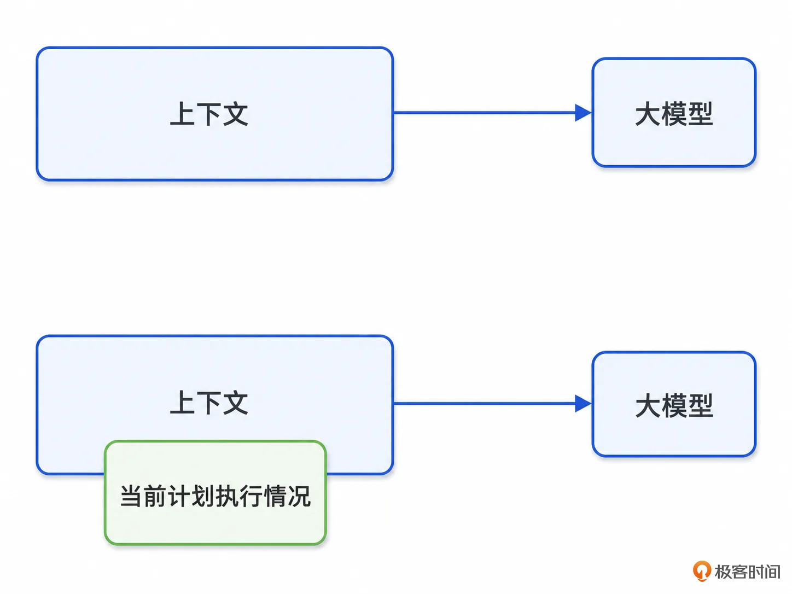
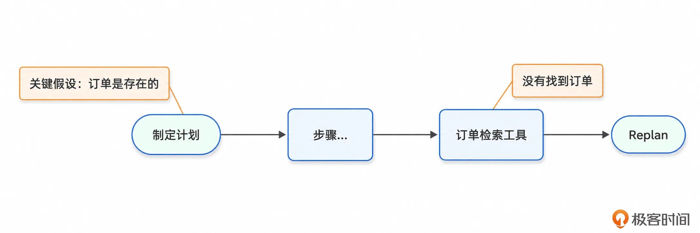
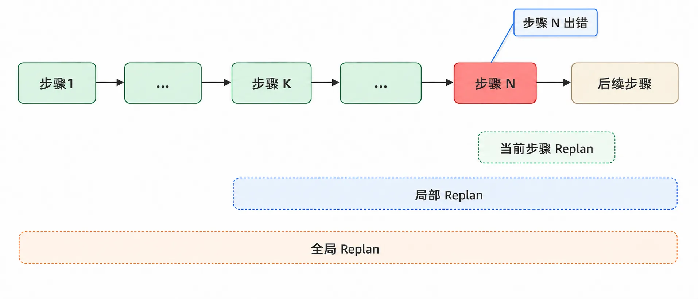
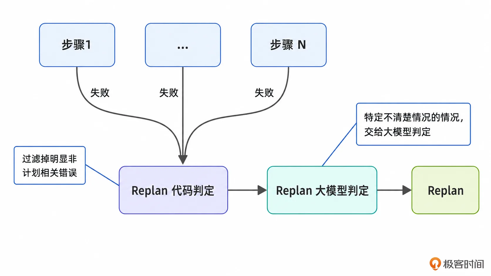
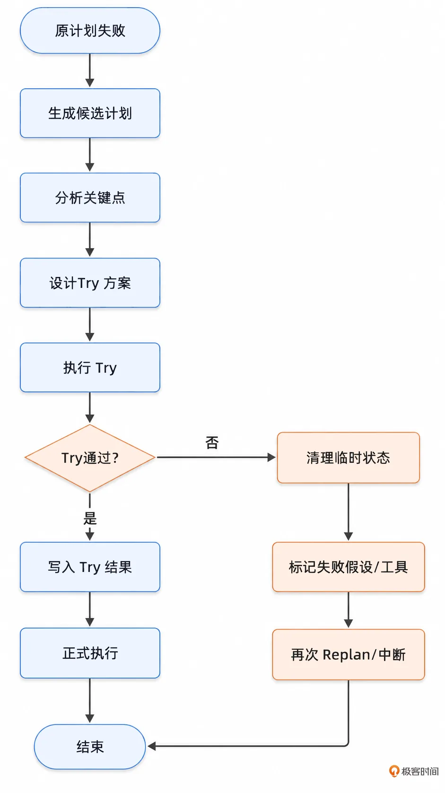
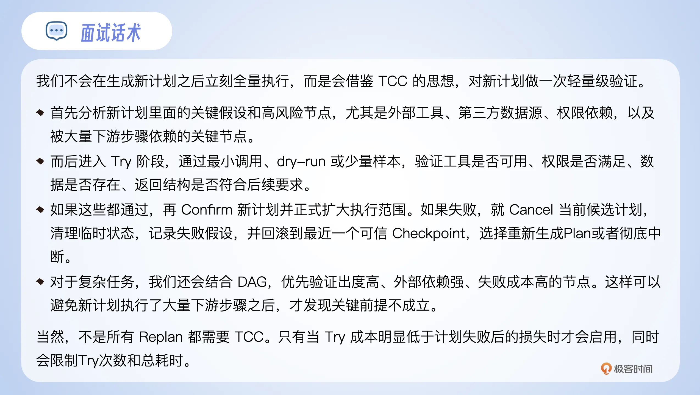

# 06｜Replan（上）：计划赶不上变化？Agent 需要“随机应变”
你好，我是大明。

上一讲我们提到，Plan 不是步骤列表，而是一个可检查、可纠偏、可执行的运行时对象。如果你真的做过 Agent，你就会更加认同我的观点：你把 Plan 理解成一个步骤列表，那么你的 Agent 大概也就是初期能用用，一旦涉及多轮执行、多工具调用、长任务处理的问题，步骤列表大概率就不能用了。

在实践中，经常遇到的问题就是 **计划赶不上变化**。比如说：

- 用户一开始没说清楚，后面补充了信息；

- Agent 一开始理解错了，后面才发现方向偏了；

- 检索结果推翻了原来的判断；

- 工具调用失败了；

- 用户突然新增约束了；

- 中间结果质量不行；

- 甚至有时候上下文没管理好，Agent 执行着执行着就忘了自己要干啥了。


这些问题都可以考虑引入一个 **Replan** 机制来解决。在面试中 Replan 也是一个比较高级的概念。它的高级之处在于你的竞争者多半不了解，不会提及。这种信息差能够帮你在面试中建立竞争优势。

如果你能将 Replan 的触发时机、粒度、Prompt、控制次数、失败兜底都交代清楚，效果就更好了。

## Replan 是什么？

从字面意义上来说，Replan 就是指重新生成计划。这个说法不能说错，但是缺乏细节。最粗粒度的 Replan 差不多就是三个步骤：

1. 原计划执行失败了，判定可以 Replan

2. 将上下文丢给大模型，要求大模型重新生成一个计划

3. 从头开始执行


那这种方案有没有用呢？那自然是有用的，但也只有一点点。它的缺点很明显：

- 浪费资源：前面已经完成的步骤、验证过的事实、产出的中间结果，可能全部被丢掉了。

- 漂移：大模型重新生成计划的时候，很可能引入新的目标、新的表达、新的路径，最后越改越偏。

- 不可控：你原来只是某一步有问题，但你重新生成了一整个计划，相当于用大炮打蚊子，杀鸡用牛刀。


因此Replan本质上是引入一种更加精细的机制。结合上一讲提到的 G4C 的概念，那么 Replan 可以被定义为： **Replan 是在执行过程中，基于新的 Goal、Context、Choice、Checkpoint 结果，对原计划进行受控修正**。

简单来说，就是三个关键词： **执行中、新信息、受控修正**。

### Replan 和 Plan 的关系

两者有一点区别但是不大，甚至在很大程度上你都可以理解为根据上下文制定一个计划。Plan 的上下文就是单纯的上下文，而 Replan 的上下文中包含前面 Plan 的具体内容。

两者的区别如图：



如果从我前面提到的 G4C 出发，那么 Replan 应该是归属于 Correction 这个部分。但是上一讲我也说过，Correction 其实有很多种方式，比如说：Retry（重试）、Clarify（澄清）、Rollback（回滚）、Replan（重计划）、Interrupt（中断）。

Replan 就是 Correction 的一种实现方式而已。

### Replan 触发时机

正确但是无用的说法就是：Plan 执行出了问题，就可以考虑 Replan。可惜这个说了等于没说，因为“什么叫做执行出了问题”还是没有回答。

常见的使用时机有：

- **工具调用失败**：任何工具调用失败都意味着你的 Plan 无法继续下去了，这个时候你显然要考虑怎么容错，那么 Replan 就是其中的一个选项。

- **上下文发生变化**：这种一般是出现在多轮对话里面，而且是那种允许用户多次输入的多轮对话里面。比如说你最开始说“帮我实现 A”，而后你过了一会想到一个关键接口不能修改，于是你补充“B接口一定不能改”。

- **违反了假设**：有些时候，某个 Plan 制定出来是基于某个假设的。那么在执行过程中，检查这些假设是否成立的时候。发现这些假设不成立了，那么显然计划也无法执行下去了。


下面是违反了假设的一个简单图示。它揭示了一种情况：即工具成功、各个步骤都没问题也不意味着 Plan 能够正常执行下去，因为可能获得的数据、状态不对导致 Plan 无法推进。



而后你要注意一点，从发现需要 Replan 到执行 Replan，一般都会设计成至少两个步骤，很少会在一次大模型调用里面同时完成是否需要 Replan 与执行 Replan 两种动作，这两个混在一起会导致大模型表现变差。

### Replan 的粒度

这里我们先做一个简单的分类，下一讲我们深入讨论回溯的时候会再次详细分析。

Replan 的粒度大概就是三种：

- 当前步骤 Replan：也就是从出错的这一步开始重新规划后续的步骤。这其实暗示了一个点，即前面步骤的执行结果是没有问题的；

- 局部 Replan：并不是从出错步骤开始 Replan，而是往前回溯一些步骤，从特定的某个步骤开始 Replan；

- 全局 Replan：完全从头开始 Replan。


三者之间的区别如图。



很显然， **好的实践都是应该追求最小化 Replan 的范围**，尽可能复用已有结果。但是这并不是毫无代价的，因为你过于强调复用已有结果，会让大模型忽略一个错误的中间结果，或者扭曲一个已有结果，以适配它的 Replan 结果。

## 基础思路

前面我们讨论了触发时机，但是没有讨论的一个问题是：这些时机必然触发 Replan 吗？比如说工具调用失败了，一定要触发 Replan 吗？

答案是否定的。举个例子来说，如果你的工具调用是偶发性的超时，那么你直接重试这一次调用就可以了。

因此在触发时机之后，到真正执行 Replan 之前，是可以有多个步骤的，最简单的就是引入一个判定过程：

- 在触发之后，先引入 **代码 \+ 大模型** 的双重判定，确定要不要执行 Replan。

- 执行 Replan。




如上图。你要注意的是，大部分时候你都可以借助代码来过滤很多不需要、不应该执行 Replan 的错误，甚至你可以直接去掉大模型判定这个环节，全部依赖代码对异常（Exception，Error）的分析。

代码判定的好处就是稳定、迅速，省掉大模型调用的时间和 token 开销。

当然这里就会进一步引发一个问题：什么样的错误才算是需要引发 Replan 的错误？

我这里也难以总结出来适合所有 Agent、所有业务场景的原则，不过有两种思路：

- 思考某种错误是否可以通过 Replan 绕开、克服。举个最为典型的场景，某个工具是用不了了，但是有替代工具，这种场景就是可以考虑 Replan 的。类似的，还有多种策略和算法之间可以互相替代。

- 见招拆招。典型的就是默认所有的错误都可以通过 Replan 来解决，而后在测试中、线上运行中补充不同的无法 Replan 的场景，这可以通过修改代码或者修改大模型的提示词来实现。反过来也可以，就是认为所有的错误都无法通过 Replan 来解决，而后在迭代过程中不断补充和完善可以Replan 的场景。


从实现的形态上来说，代码判定这个过程基本上就对错误类型和异常类型常进行分类讨论，差不多就是一大堆的 if-else/switch-case，或者用责任链等设计模式去处理。

### Replan 的 Prompt 撰写

这里我就不细讲 Prompt 的基本的撰写技巧了，只补充在这个场景下，要小心什么问题。

#### 带上 G4C 的内容

你要做的就是保证在 Replan 的时候，要在上下文里面带上 G4C 的内容。最基础的内容是：

- 你要让大模型知道原始目标是什么，当前目标有没有变化。如果目标没变，就不要轻易全局 Replan。

- 你要告诉它当前新增了什么信息，哪些上下文发生了变化，哪些事实已经被用户确认，哪些只是推测。

- 你要告诉它到底是哪一个检查点没通过，以及没通过的证据是什么。如果你不提供，大模型就只能瞎猜，瞎猜就会输出乱七八糟的结果。


#### 再次强调约束

前面我在 G4C 的 Context 里面提到过硬约束和软约束，你在 Replan 的时候要再次强调、重复这个内容，最好就是丢进去 System Prompt 里面，确保它不会被忽略。

类似地，如果你的 Agent 里面除了约束这种内容，还有一些类似 Spec 的内容，都要再次强调。宽泛地说，就是任何信息丢失了会引发严重后果的，你都需要强调一下。

之前我遇到的一个错误就是没有单独强调这些内容，导致 Replan 的时候会出现偶发性的违背、忽略硬约束的情况。

#### 分类输出 \+ 要求所有判断都要带证据

分类输出是指你要求大模型在 Replan 的时候要求大模型输出前后 Plan 的对比情况，包括：

- 什么步骤被保留下来了，理由是什么；

- 什么步骤被保留下来了，但是修改了一些细节，比如说修改了参数，还是修改了工具。同样的，也要输出理由是什么。

- 什么步骤被完全取消了，理由是什么；


这种分类输出的价值在于它能提高大模型 Replan 的准确性，并且对你后续排查问题也有很大的帮助。

其次你应该注意到了，我每一个都强调要输出“理由是什么”，这是为了避免大模型瞎编，也就是你耳熟能详的 evidence-based。

比如说早期我在 Prompt 里面带入过类似这样的一句话，就有了很明显的改进效果：

> 所有 Replan 判断都必须基于 evidence。 如果没有 evidence，不允许声称 Goal 改变、Context 改变或硬约束改变。

后续你可以发现很多 Agent 的问题都可以通过强调用“证据”来解决。正所谓一物降一物， **evidence-based 就是大模型幻觉的最严厉的父亲**。

类似的手段你也可以用在 Plan 阶段，这也能约束住大模型在制定计划阶段产生幻觉。

#### 明确什么时候要问用户

询问用户可以看作是一种兜底手段，相当于大模型已经确认了根据已有的上下文信息它无法继续推进下去，只能通过询问用户来补充信息。

比如说可以在 Prompt 里面补充类似的内容：

> 如果缺少关键信息，且继续执行会违反硬约束或产生高风险结果，那么必须向用户澄清。

这时候，你会遇到另外一个问题，就是怎么教会大模型“判定已有上下文信息不足”，或者说“什么才是关键信息”。从我的实践经验上来说，这也是一个比较棘手的问题，我通常按三类关键信息判断是否追问用户：

- 涉及到强约束的，一定要让大模型询问用户，而不能随意发挥或者假设、忽略这些约束。

- 涉及到参数缺失、不正确会导致计划执行失败的，可以询问如何处理这些缺失参数，比如说要求用户提供一些默认值等。

- 关键工具失败，这一类工具在大模型看来是没有替代方案的，因此 Replan 已经没有意义了，这时候可以询问一下用户有没有替代方案。


此外还有一种需要额外考虑的情况，就是权限和敏感操作问题，也需要再次确定。比如说新的计划里面要使用一个更加敏感的工具，那么在使用这个工具之前要先征得用户同意，提前到计划阶段请求授权可以避免规划了一个无法执行的计划。

#### Replan 控制信息

Replan 的控制信息是指记录 Replan 能执行几次，以及已经执行了几次的信息。

比如说你最多允许 Replan 三次，那么在 Prompt 里面就要带上已经发生的 Replan 的信息，下面是一个例子：

```
{
    "replan_info": {
        "max_replan_total": 3,
        "used_replan_total": 2
    }
}
```

这是一个极简的设计，你可以考虑在这个基础上增加全局 Replan 的控制、当前步骤的重试信息等。

## TCC 高级方案

接下来我要介绍一个我借鉴自 TCC 分布式事务解决方案中的 Replan 设计思路，但是我得先说明，这个方案局限性很强——高失败成本、高外部依赖、高副作用风险。普通 Replan 不必上 TCC，所以你主要就是借鉴一个思路，在面试中展示一下，实践中谨慎使用。

早期我在设计 Plan 和 Replan 机制的时候，我就意识到一个问题：一个看起来合理的 Plan，并不一定能够执行下去。

因此一个自然的想法就是一个新的 Plan 制定出来——不管是源自第一次 Plan 还是后续 Replan——之后，要尝试运行一下。这个想法在经过几次迭代之后，我发现和分布式事务里面讨论的 TCC 还挺接近的，后面我都叫做 TCC Replan 方法论。

### Try：找出新计划最脆弱的地方

Try 不是把新计划完整执行一遍。很显然，如果完整执行一遍，那就不叫试探，那叫正式执行。

Try 的关键是找到新计划里面最重要、最不确定、失败代价最高的部分，然后进行最小化验证。比如说一个新计划是：

- 调用外部商品接口获取库存；

- 根据库存筛选候选商品；

- 对比商品价格；

- 生成推荐结果；

- 创建购买清单。


这个计划严重依赖第一步的外部商品接口。那么 Try 阶段不需要真的查询全部商品，也不需要生成推荐结果。只需要尝试一下外部商品接口，是否能正常运作，就可以了。如果连这一步都过不了，后面的计划就没有必要继续。

所以你可以注意到，TCC 在那种 Plan 执行过程比较脆弱的场景下才有比较高的价值。一般来说，Try 阶段你可以考虑检查：

- 工具可用性：尤其是外部工具，也包括内部一些可用性、性能比较差的接口封装的工具。

- 数据可获得性：工具可用不代表目标数据可获得，特别是那些会影响你计划执行方向的数据，可以提前检查一下。

- 核心假设是否成立：部分情况下，制定的计划会严重依赖某些假设。如果有机会，可以提前验证一下这些假设。

- 关键依赖是否满足：比如说某个步骤依赖前一步产物，那么可以先检查前一步产物是否真的满足要求。


这里就有问题了，什么才算是关键？也就是你得告诉大模型什么才算是关键，大模型才会触发 Try 阶段去检查。这里同样是给出我的一些经验法则，你可以用这些内容去指导大模型：

- 被后续步骤严重依赖的操作；

- 使用外部工具或第三方系统的操作；

- 一旦失败，代价严重的操作；

- 涉及权限、资金、数据写入等高风险操作；

- 历史上经常失败的操作；


除了上面这些，你还要考虑跟你业务特征相关的场景。这种就因业务而异了，可以在长期迭代中完善业务相关的规则。

总的来说，Try 应该优先验证计划里面的“ **单点故障**”。例如在 DAG Plan 里面，一个节点被五个后续节点依赖，那么它就值得去试探一下。

此外我要额外强调一个可能踩坑的点，就是 **你的试探必须是低成本的**，而且是无副作用或者是低副作用的。

部分情况下你可以引入所谓的 dry-run 机制，例如说在 ORM 框架中 dry-run 一般就是输出 SQL，通过检查 SQL 是否符合预期来做检查。

举个例子来说，如果你的关键步骤是修改数据，你就不能真的去修改一下数据，而是应该尝试改为搜索出来，确定这个数据存在或者老数据符合某个特征。

### Confirm：要做一些什么？

听起来好像 Confirm 就是直接执行计划，这句话对了一部分，缺了一部分。缺少的部分就是需要同步将 Try 的结果写入到上下文中，这可以作为后续计划执行时的一个参考。

甚至于，有些时候你在 Try 阶段产生的数据，在 Plan 执行的时候是可以复用的。

### Cancel：回滚，滚什么？

在 Cancel 阶段，至少要处理这几个问题：

- 回滚 Try 阶段产生的临时状态、数据。比如说 Try 阶段产生的测试数据。

- 标记失败的假设、不可用的工具等。这样后续你就可以再次生成一个不一样的 Plan，避开这些失败情况。

- 尝试再次 Replan 或者中断。


我一般是建议你在 Try 阶段产生的数据先放入一个临时空间，而不要和已有的 Context 结构混在一起，方便后续清理。

其实你在这里也可以想到一个点，就是判定是否还能继续 Replan 的时候，只需要看是否还有“替代”的可行解决方案。一旦没有替代的解决方案了，就可以认为再也不可能 Replan 了。相当于，路都被走完了，无路可走了。

### 小节

整个过程如图：



如果你脑洞够大，你会想到这种 Try 其实是可以直接前置到 Replan 之前的。换句话来说，与其生成 Plan 之后再去检查能不能执行，我不如直接先检查，通过了我再生成新的 Plan。

从理论上来说是可以的，但是我并没有实践过这种做法，你可以尝试一下。我没有实践过的原因其实也挺简单的，就是我认为这种做法需要引入额外的大模型调用，并且我猜测效果提升幅度可能并不大。

在面试中你可以参考这个话术：



## 总结

这一讲我们初步讨论了 Replan 的概念，以及如何做 Replan。最后还提到了一个比较有创意的思路 TCC。

记住一个点，在讨论 Plan 的时候，你只要讨论到 Replan 就能加分。如果你能进一步说出怎么 Replan，以及提出类似 TCC 这种有新意能体现你思考的方案，就更加分了。

TCC 这个名字你可以自己换名，防止面试中“撞衫”。名字不重要，关键是讲清 Try/Confirm/Cancel 三步和适用边界。

最后你可能会有一个疑问，在现实中怎么没看到有重计划功能的 Agent？这并不是错觉，你的感觉可能源自：

- 绝大多数你接触到的 Agent 都不具备这种重计划的能力，或者它可能有但是表现出来的不像有。

- Agent 确实有，但是它并没有输出自己的内部状态。所以在你等待最终输出结果的时候，它内部可能已经修改了好几遍计划了，而你毫无感觉。


但是也确实有少数的 Agent 会在计划执行不下去的时候重新规划一个执行路径。比如说我在使用 OpenClaw 之类的工具的时候，如果给它一个复杂的任务，它在执行不下去的时候就会修改计划。最典型的就是我之前有很多任务需要启动浏览器，而后在操作浏览器不成功的时候，它就会尝试其他操控浏览器的方式。

结合前面一讲的内容，我相信你对 Plan 和 Replan 的理解应该深刻了不少。这一讲其实还有一个问题没有讨论，即确定 Replan 粒度的问题。下一讲我会接着讨论这个问题，它涉及到面试中一个好用的概念：“回溯”。

## 思考题

你在实践中有没有使用到具有 Replan 能力的 AI 工具，如果有的话，你可以在留言区分享一下你遇到的 Replan 案例。如果你觉得有所收获，也欢迎你分享给需要的朋友，我们下节课再见！