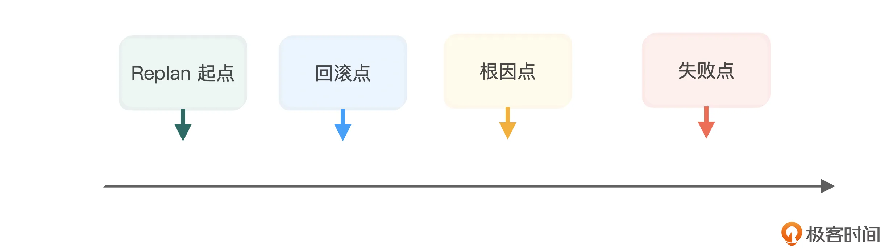
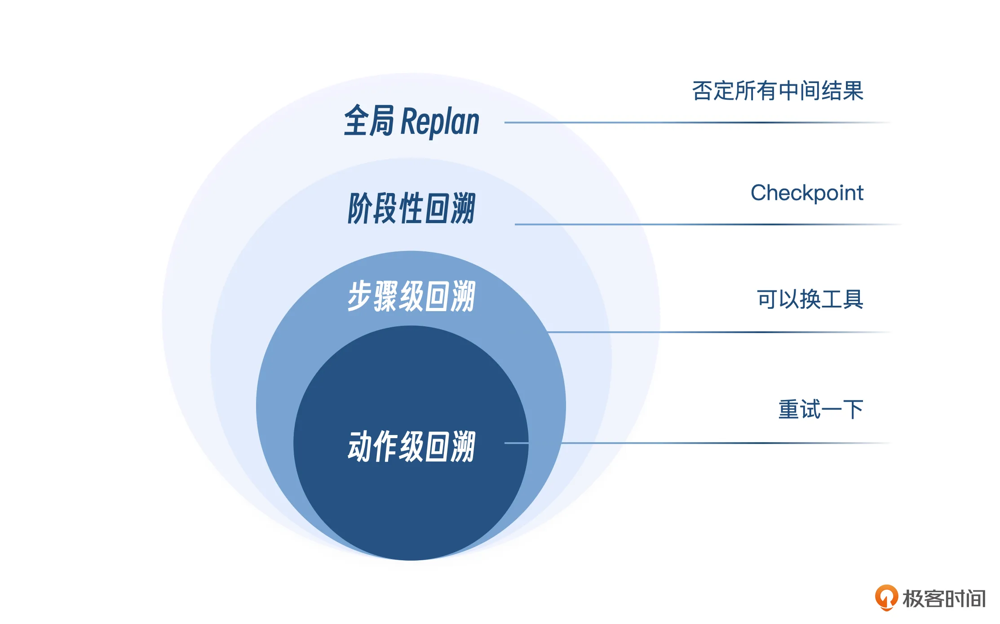
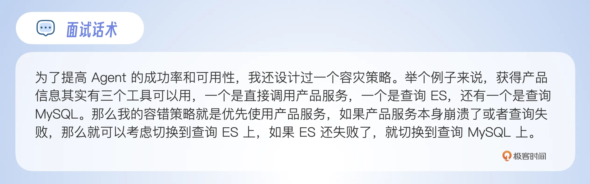
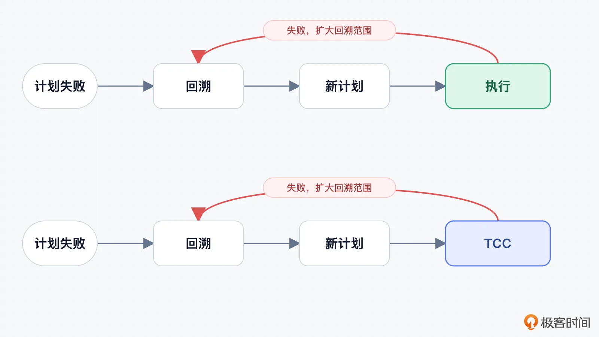
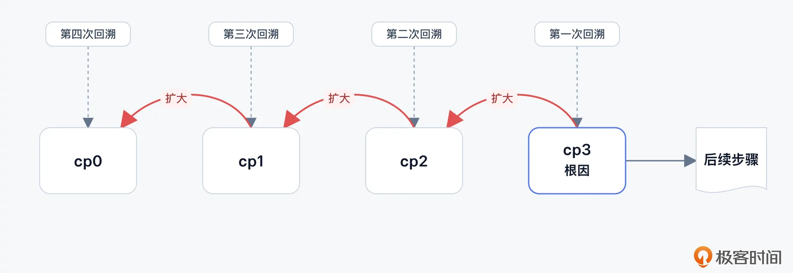
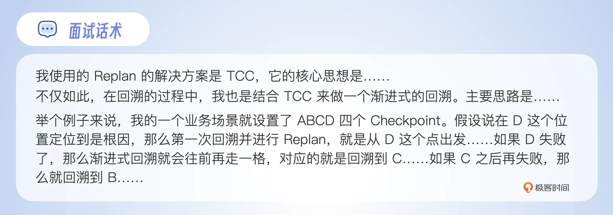
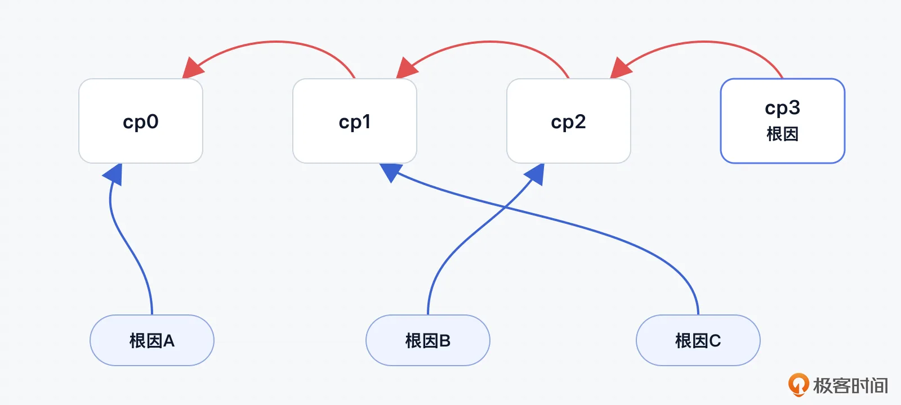
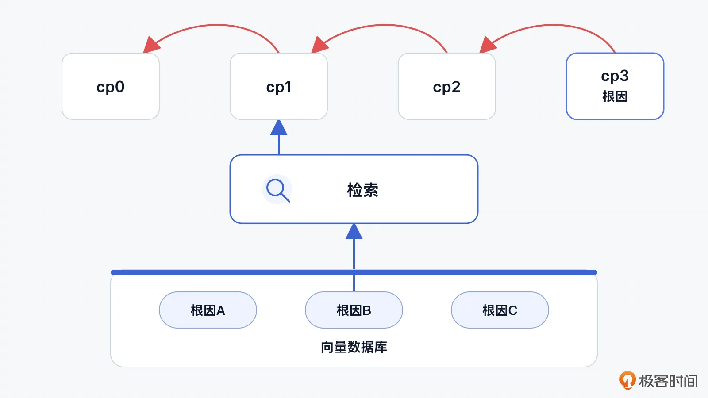
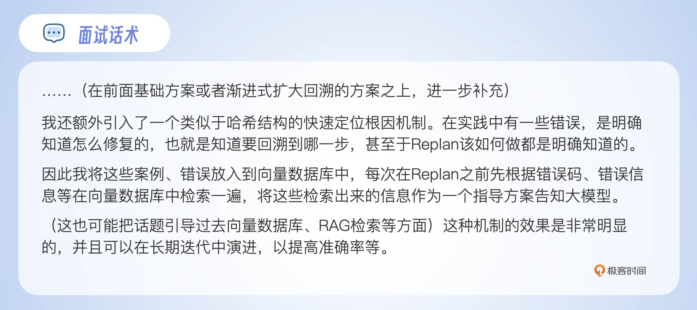
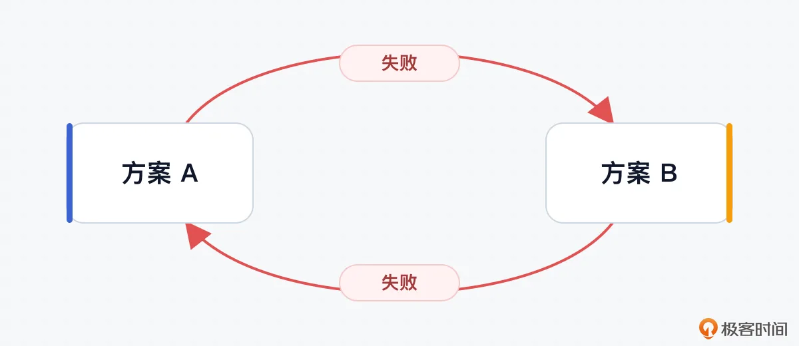

# 07｜Replan（下）：失败点不等于根因点，回溯找对“病根”再下刀
你好，我是大明。

上节课我们讨论了 Replan 的概念，以及如何做 Replan。相信你已经对Replan有了一个初步的了解。这节课我们更进一步，聊聊 Replan 失败回溯的问题。

早期我在研究怎么提高 Replan 效果的时候，曾经找过网上有关回溯的内容，能找到但内容不多，所以这节课的内容算是我自己做 Agent 时的一个比较独特的机制了。

我建议你这会儿学了之后赶紧拿出去面试，就能凭借这个独特性赢得竞争优势，等后续讨论的人多了，这个东西面试中效果就没那么好了。我们还是先从基础知识开始。

## 失败点、根因点、回滚点、Replan 起点

这里我必须先澄清几个概念，确保你在真实设计 Replan 机制的时候，不至于只盯着失败的地方，而忽略了其他关键点。

**第一个是失败点，也就是错误暴露的位置**。比如说工具调用错误、Checkpoint 未通过、中间结果偏差等。

这里注意的是，失败点并不等于根因点。失败点只能告诉你这里出了问题，这是问题出现最直观的表现，它并不能告诉你为什么出问题了。如果将两者等同起来，容易导致你 Replan 持续失败。

**第二个是根因点，指最初引入错误事实、错误假设、错误路径的位置。** 失败点可能距离根因点非常远，甚至于在不仔细分析的情况下，你会觉得失败点跟根因点完全不相关。

**第三个是回滚点，系统状态需要恢复到的位置**，一般来说这个位置就是某个 Checkpoint。回滚点是需要结合根因来判定的，很多时候根因点就是回滚点。少数情况下回滚点在根因点之前，相当于回滚到了一个稳定的、正确的状态。

**第四个是Replan 起点，是指新的 Plan 需要从哪个决策节点或任务节点重新生成。** 类似地，Replan 的起点可以和回滚点重合，从一个稳定的、正确的状态出发 Replan。也可以比回滚点更早，比如说某些时候 Replan 对数据的实时性要求高，就需要回到一个更早的状态重新查询、计算数据。

这些点之间的关系，你可以参考下图。



### 回溯的层级

在往下讨论之前，我们可以对回溯的层级进行分类。

这里假设你的一个步骤可能存在多个动作。比如“获取用户画像”，那么这个步骤可能在执行的过程中需要调用好几个接口，最终拿到完整的用户画像。

第一个是 **动作级回溯**。比如说某一个 HTTP 请求超时了，某一个大模型调用输出的 JSON 格式错误了，某一个工具因为临时网络抖动调用失败。通常来说这一层你连 Replan 都不需要，重试一下就可以。因此，你在 Replan 的提示词里面要约束住它，先尝试重试之类的措施，不行再回溯。

第二个是 **步骤级回溯**。步骤级回溯是指当前步骤的实现路径有问题，但是这个步骤之前的结果仍然可信。

举个例子，当前步骤有两个工具可以达成同样的目标，比如说获得用户的信息。那么一个工具崩溃之后，就可以换另外一个工具。这其实可以 **类比传统工程上的容错机制**。

第三个 **阶段性回溯**，它是指某一整个阶段的输入或者中间结果失效了。你可以把阶段理解成是一种逻辑上的概念，也可以在 Plan 里面显式引入阶段的概念。比如说通常我会认为每经过一个 Checkpoint，就进入了一个新的阶段。

就拿修改简历来说吧，我们一般可以分成三个阶段：收集项目事实、生成项目表达、生成面试准备材料。如果第二阶段一开始使用的项目亮点就是错的，那么第二阶段后面的项目描述、面试话术和追问都会受到影响。这时候就应该回到第二阶段入口，重新规划整个阶段。

这里你也可以感受到 Checkpoint 的意义。在缺乏 Checkpoint 的情况下，你找不到一个确定的正确的节点来纠正执行过程。

第四个是 **全局 Replan**，也就是否定所有已经产出的中间结果，从最原始的状态开始。



除了上面的四个，还有一个不太常见的： **跨轮次 Replan**。比如说用户几轮之前说过项目最高峰值是每秒一万请求，Agent 当时 **错误地记录** 成了每秒十万请求。后续几轮对话都使用了十万请求这个错误数据，直到用户看到最终简历才说：我什么时候说过十万了？

那么你要修复的不仅仅是最终简历，而是要找到这个错误事实最早在哪一轮被写入，哪些中间结果使用了这个事实，以及哪些历史摘要、用户画像、关键事实表也被污染了。

修复起来显然是很要命的，要么是相关的摘要、用户画像、关键事实表都检查一遍，要么就是直接清空上下文，尝试恢复到最开始出错的阶段。

从目前我对不同 Agent 的使用体感来说，我认为目前这些通用型 Agent 在纠错这方面都做得不太好，包括 ChatGPT 也是如此。比如说早期我错误地告诉了 ChatGPT 我买入腾讯股票的价格，它后续一直使用这个价格，每次都给出一个错误的建议。

## 基础方案

最基础的方案就是从失败点开始，沿着依赖关系反向排查，找到最早失去可信度的结果，而后回到它之前最近的可信 Checkpoint。

那么要达成这个目标要做的事情其实比较复杂，具体步骤是：

- 记录每一步的关键信息

- 维护中间状态的可信状态

- 从失败点反向排查

- 找到最近的可信 Checkpoint


我们一步步看。

#### 记录每一步的关键信息

我觉得很多人在设计 Plan，甚至纯 ReAct 结构（没有 Plan）的 Agent 的时候也会尝试记录一下每一步的内容，只不过有些记得详细，有些记得粗糙。

下面我介绍一些我认为会影响到你的 Replan 效果的内容，包括输入、输出、使用的上下文、使用的事实和证据、依赖的假设、工具及工具输入输出、Checkpoint检验结果等。而后你也可以针对自己的业务，考虑保存更多的信息。并且大多数时候你都需要设计一个结构体来存储这些信息。

此外我要另外强调的一个是你在记录步骤信息的时候要小心 **一个快照问题**。

举一个客服 Agent 的例子。用户一开始说：“这个订单我不想要了，帮我退款。”Agent 的 A 步骤查询订单状态，发现订单还没有发货，于是判断可以走“未发货极速退款”流程。结果在后续执行过程中，物流系统状态发生变化，订单已经被仓库打包并出库了。B 步骤虽然重新查询到了“已出库”的状态，但系统没有记录 A 步骤当时看到的订单状态快照，也没有把 A 生成的“可极速退款”这个中间判断标记为失效，于是 C 步骤继续沿用旧判断，直接发起极速退款，最后被售后系统拒绝。

这时候如果你只看当前状态，会发现订单确实已经出库，于是很容易误判为 C 步骤调用售后工具的参数错了，或者售后系统接口规则太复杂。但真正的根因是：A 步骤基于“未发货”状态生成了退款路径，而订单状态后来变成“已出库”之后，这个中间结论已经过期了，却没有被系统识别出来。

所以 **快照的价值就在于，它能告诉我们每一步决策当时看到的状态是什么**，从而在 Replan 时判断到底是当前步骤错了，还是上游步骤基于旧状态产出的结果已经失效。

#### 给中间结果标记可信状态

你可以考虑为每一个中间结果都标记一个可信状态，当然你也可以量化为“置信度”。你可以参考这些状态设计：

- Verified：已经验证，当前仍然可信；

- Available：可以暂时使用，但是没有充分验证；

- Suspicious：可能存在问题，需要重新检查；

- Invalid：已经确认错误；

- Dirty：自身未必错误，但是依赖了 Invalid 的结果。


这倒不是说你需要在自己的项目里面引入所有的状态，你可以结合自己的需要使用其中的两三个状态。

我举一个使用了三个状态典型的用法：

- Verified：真正得到验证的，比如说经过一些交叉查询、检验之后的。

- Available：默认通过工具获得的数据都是这个状态，相当于孤证不立，但是你要用也可以用。

- Invalid：不能使用的数据，但是不区分是什么原因导致不可用。


你可能还困惑怎么使用这个数据，这里同样给出一个简单的设计，源自 evidence-based 思想。

每当 Agent 推理、要做决策的时候，都需要在每一个输出条目下同步输出它的证据。比如说：

```
highest_qps: 10万，Available

项目亮点：
- 高并发：10 万，需要设计符合 10万并发的解决方案。Based：highest_qps
```

你可以想象到，一旦这个 highest\_qps 的状态切换到 Invalid 的时候，大模型就能从类似的结构中找到根因。

#### 从失败点反向排查

在失败点出现之后，你可以沿着依赖关系反向检查，其实也就是挨个回答这一类的问题：

- 当前步骤本身是否执行错误？

- 当前步骤的输入是否正确？

- 上游中间结果是否仍然可信？

- 上游结果依赖的事实是否正确？

- 原计划依赖的假设是否仍然成立？

- 用户目标和约束是否发生了变化？

- ……


这种问题列表是可以在演进过程中补充完善的。简单来说就是 **相当于你提供了一个检查清单，要求大模型挨个核对**。最开始你也不知道你的清单完不完整，但是不要紧，你可以在实践中慢慢丰富。

Agent 工程对迭代的依赖程度非常高。一开始你的 Prompt 写得稀烂不要紧，你可以后面迭代改进；Plan 做得稀烂也不要紧，后面也可以迭代。这样一来，我们可以通过不断迭代，体会到 Agent 的演化过程，更现实一点，我们还可以保住自己的工作，保住自己的 KPI，简直美滋滋。

基本步骤讲完，我再讲一下可能会影响到你最终回溯、Replan 效果的一些额外需要考虑的点。

### Checkpoint 不一定可靠

你可能下意识地认为：找到最近通过的 Checkpoint，从那里开始 Replan 就行。

这并不总是正确的，因为 Checkpoint 是在当时的上下文和证据下通过的。或者用一句时髦的话来说“ **一个 BUG 是 BUG，一堆 BUG 是 Work**”。也就是说，在整个 Agent 执行期间，上下文中的数据就很有问题，但是恰好这些问题组合在一起就欺骗了你的 Checkpoint。

大部分情况下，你可以认为 Checkpoint 是值得信赖的，尤其是你的 Checkpoint 是通过代码形式来实现的，那么可靠程度非常高。但是当你发现某些 BUG 无法解决的时候，可以尝试将 Checkpoint 结果也作为怀疑对象。

### 保留候选路径

前面讨论的方案，是在失败之后重新生成路径。但是你可以进一步想到：为什么一定要等失败之后，才重新想一条路径？我完全可以将候选路径保留下来，在失败之后再次评估这些候选路径。

这个举措有利有弊，整体上是利大于弊的。

最大的好处是如果你只保存最终路径，那么最终路径失败之后，只能重新调用大模型思考规划新的路径。显然，大模型调用有 token 成本，有时间成本。而如果你同时保存了候选路径，那么就可以快速回到这个 Choice 节点，选择下一条尚未尝试的路径。

下面是一个获得产品信息的例子，而里面的 candidates 就是指候选路径。

```
{
    "decision_id": "get_product_data",
    "selected": "product_service",
    "candidates": [
        {
            "path": "product_service", // 直接查询产品服务
            "status": "failed",
            "reason": "接口不可用"
        },
        {
            "path": "elasticsearch", // 直接查询 ES
            "status": "available"
        },
        {
            "path": "database", // 直接查询数据库
            "status": "available"
        }
    ]
}
```

这种机制有点像是探索算法。Plan 不再是一条固定路径，而是一个包含多个决策节点和候选分支的搜索空间。Replan 就是路径走不通之后回到上一个岔路口，换一条路继续走。

又或者用程序员的话来说，看到一个 BUG 你也不知道怎么解决，只能是把所有能想到的方法都试一遍，看看能不能瞎猫撞上死耗子。

在记录了候选路径之后，你还要记录失败路径，或者说已经尝试过的路径。不然你就有可能遇到一个搞笑的情况，如选择路径 A - 失败 - 再次选择路径 A - 失败 - ... 直接无限循环了。

但是这里有一个例外情况，那就是导致这个 Plan 失败的原因已经被修复了，此时你可以重复选择之前的失败路径。这意味这你需要保存每一次失败的原因，并且要在运行中尝试检测它有没有被修复。

相应的你就需要在 Prompt 里面加上这些规则，确保大模型会检查已经尝试的路径，以及导致这些路径失败的原因是否还在。

想必你看到这个“候选”字眼，就会想到我在《后端工程师的高阶面经》里面提到的“容错”问题。类似的思路同样可以用在这里，也就是你完全可以在你的面试方案里面加入一个工具容错或者步骤容错的面试点。

这个面试点的核心是你有一个场景，有多个路径/工具可以达成目标，于是你选了一个路径/工具，在失败了之后换用另外一个路径/工具，提高了 Agent 处理流程的成功率、稳定性。



### 代码和大模型双重根因定位

你可能会问回溯和根因定位是不是全部交给大模型来做？

答案显然是否定的，尤其是 DAG 依赖分析、循环次数控制这些事情，代码做得比大模型稳定得多。甚至，我认为你应该秉持的原则是：如果我能用代码来做，就不要用大模型来做。

那么，什么时候用代码？什么时候用大模型呢？这里给出一些原则：

- 大模型负责语义问题，在 Replan 下：

- 判断错误现象可能对应哪类业务根因；

- 判断用户目标是否发生变化；

- 判断某个新约束会影响哪些业务步骤；

- 分析某个中间结果是否仍然可以复用；

- 生成新的候选路径；

- 解释为什么选择某个 Replan Point。

- 代码负责确定性问题，在 Replan 的场景下可以处理：

- 遍历 DAG；

- 查找上游和下游节点；

- 标记 Invalid 和 Dirty；

- 找到最近 Checkpoint；

- 检查循环依赖；

- 控制 Retry 和 Replan 次数；

- 执行回滚和补偿。


两者的界限并不是泾渭分明的，一般都是综合使用。典型的使用方式就是自己在设计 Agent 的时候，定义清楚哪些用代码处理，哪些用大模型来处理。举个例子，当你现在要分析哪些中间数据有问题的时候，你可以分成两个部分，一部分用代码分析，一部分用大模型分析。

我用一个最简单的伪代码给你演示这种思路：

```
function needReplan() {
    //... 这里有一些其它步骤
    keys := allStepCtxKey() // 拿到所有的中间结果的 key，注意你写的 Agent 你肯定知道有哪些 key 的。
    for key :=range keys {
        validator := getValidator(key)
        val := fromCtx(key)
        validator.validate(val) // validator 可以有不同的实现方式
    }
    // ... 这里有一些其它步骤
}
```

validator 的实现是很自由的，你可以用代码，可以用大模型，甚至你可以在 validator 的维度使用混合解决方案。

当然了，我还有一些只适合在台下说的建议：

- 在面试中，如果某个东西用大模型来处理会显得很高级，你就说你这是大模型做的，甚至可以故意做得花里胡哨。当然，为了 KPI/OKR 也可以用这个思路。

- 在实践中，那就是能用代码就用代码，实在不行就用大模型。我认为在当下，代码不管是稳定性还是性能，都比大模型要好。


## 进阶方案

### 渐进式扩大回溯范围

这个思路和异常处理很像。先尝试最便宜、影响最小的恢复方式。只有当前层级无法恢复，才扩大范围。

正常来说，渐进式扩大回溯范围是真的尝试执行了新的计划，发现还是有问题，而后就进入新一轮的 Replan，并且扩大回溯范围。

如果你还记得上一讲最后提到的 TCC 内容，那么你自然而然就能想到这个渐进式扩大回溯范围完全可以和 TCC 结合在一起。相当于每次通过 TCC 来判断一下新的计划是否具备可行性，如果不可行则扩大回溯范围，重新生成计划。

两者之间的区别如图：



那么扩大回溯范围，具体又应该怎么做呢？我的建议是从根因开始，每次扩大范围就回溯一个 Checkpoint。如图：



所以我一般建议你在面试中，用 TCC 串联起 Replan、回溯，打造一个一致的解决方案。如果你能够结合具体的业务场景，那么面试效果会更好。



这里我用 ABCD 仅作为代指，在面试现场不要直接使用 ABCD 这四个字符。要给 ABCD 加上一点业务含义、业务场景，细化到 ABCD 分别检查什么，从这几个位置出发 Replan 大概要做什么。

我提醒你一点，如果是通用性很强的 Agent，那么有哪些 Checkpoint 你可能不确定，因为 Checkpoint 可能是 Agent 自主决策设置的。但是如果你是领域专属的 Agent，你可以在 Prompt 里面要求它在一些固定的位置设置 Checkpoint。

这也是我说的，越是垂直领域的 Agent，越好做；越是通用的，越是难做到好效果。

### 跳跃式快速回溯

如果说正常的回溯是线性结构，那么跳跃式快速回溯就是哈希结构。下图直接展示了两种方式之间的区别：



这种结构的典型特征就是你知道并且清楚，一旦出现某个问题，就只需要回溯到某个位置。因此“问题”就是哈希结构的 key，回溯的“位置”甚至于新的计划就是哈希结构的 value。

但是正如我前面说的，这也是一个迭代的过程。你在刚开始构建你的 Agent 的时候，是根本看不出来哪些根因必然可以定位到哪个位置的。只能是说后续通过离线分析（LLM as Judge）、人工分析等方式，找出这些规律来加速定位和归因的过程。

而且，这里可以更进一步利用向量数据库等来构建这种哈希结构。如下图：



整个话术你可以参考：



这时候你就会想到，这种结构其实和前面的意图识别等用法没什么区别，都是把一些已知的案例/解决方案放到向量数据库中，后续根据上下文来生成检索语句，检索出这些案例/解决方案放入到窗口内，作为大模型的参考。

### 评估回溯的效果

我把评估回溯效果放到进阶方案中，是因为它本身就很难，能想到这些指标，能想到怎么收集这些指标，本身就是一个有经验的人才能做到的事情。因此，你只要能够讲清楚如何评估就赢得很大的竞争优势了。

#### 根因定位准确率

根因定位准确率是指最终定位的根因是否正确。

如果是专属领域 Agent，那么这个根因定位准确率可以到 80% 以上，准确率高，是因为问题域比较小，加上长期迭代，基本上可以达到的效果。在面试中你可以用前面跳跃式回溯来佐证你在迭代中提高了这个准确率。

这个指标一般需要人工标注测试集，或者在故障注入时提前知道标准根因。例如准备 100 个失败案例，其中 80 个准确定位到了真正的根因，那么准确率就是 80%。

根据之前几讲我讲过的一个反馈机制，你完全可以在系统运行期间不断收集线上案例，用作测试集。毕竟一次准备 100 个失败案例很要命，但是你经过一两个月的迭代搞出来 100 个失败案例，就不要命了。实在不行就还是招实习生干吧，对他们求职也很有帮助。

#### Replan 起点准确率

根因定位正确，不代表 Replan 起点就一定合理。例如根因出现在第三步，但是第二步的输出也需要重新确认，那么可能要从第二步之后开始 Replan。

类似于前面的指标，如果是领域 Agent，那么可以将这个数值说得比较高，比如说 80%、85% 等。

这个指标要从两方面判断：

- 是否回退得太晚，保留了错误结果；

- 是否回退得太早，浪费了大量正确结果。


所以在 Replan 起点上，要追求一种“刚刚好”的效果。如果做不到刚刚好，那么就只能是宁愿回退到很早的位置，浪费正确的中间结果，也不要保留错误结果。我用一句话来帮助你记忆：近之则怨，远之则不逊。

#### 已有结果复用率

已有结果复用率是指 Replan 后复用了多少仍然可信的中间结果。例如原计划产生了十个中间结果，其中六个仍然可信，最终复用了五个，那么复用率就是 5/6。

类似地，指标的数值越高，意味着 Replan 越精细。但是你要注意，不能为了复用而复用。如果复用了错误结果，反而会导致更严重的问题。

这个指标其实挺好测量的，你只要在每次 Replan 的时候计算一下就可以了。毕竟你 Replan 的时候，你当然知道你有多少中间结果，也知道你会复用哪些中间结果，计算一下就可以了。

#### Replan 恢复成功率

这是最直观的指标。触发 Replan 之后，最终有多少任务恢复成功。

如果触发了一百次 Replan，最后只有二十次恢复成功，那么说明你的 Replan 大概率只是在浪费 token。

从我的实践上来说，在专属领域 Replan 中，做到 80% 以上并不会很难。当然我对这个判断也不是很有信心，毕竟我也不了解你的业务有没有什么特别坑人的地方，会导致一直无法成功。

#### Replan 振荡率

这是一个听起来很厉害，其实技术含量很低的指标。所谓振荡，就是 Agent 在几个相似计划之间反复切换。

如下图就是一个典型的震荡例子：



- 先选方案 A，失败

- 切换方案 B，方案 B 失败

- 又切换方案 A，再切换方案 B

- 循环往复


震荡一般都意味着上下文管理不当，具体来说是下面几个方面没做好：

- 没有记录失败路径；

- 没有明确失败原因；

- Replan Prompt 没有带上控制信息。


这也提示你在 Replan 的时候，重试次数一定要控制好，防止流程无法正常结束。

## 总结

我这里还要再叠一个甲，数据究竟多少才算好，我现在也难以给出一个明确的说法，毕竟现在业内的人要么还没讨论类似的机制，要么讨论了但也没说自己做到了啥地步。可能再过两三年就有一个明确的说法了。

此外我在 Replan 方面还有一些其他的实践感受，你可以了解一下。

第一个，我用成功的 Replan 结果拿去微调大模型，体感上来说，有效果但不明显。

第二个，把原始 Plan 和成功的 Replan 放到 Plan 的 Prompt 中，作为 few-shot。这种做法可以显著提高一些特定场景下 Plan 的质量。

最后我还想说一个观点，就是现在还处于野蛮生长阶段，没有什么大一统的最佳实践，所以但凡你能够深入一些，能够有创意一点，甚至能够提出一些指标和收集方式，就能赢得竞争优势。

我判断这个趋势能持续到 2028 年初，用两三年的时间做好这个东西，大家能够达成一致的地方应该就很多了。抓住这个时机，转行为 Agent 工程师，要比以后开始卷茴香的茴字有几种写法，容易多了。

## 思考题

最后请你来思考一个问题，直接放弃 Replan 而后给出一个错误回答或者报系统错误，和尝试 Replan 解决问题，你觉得你的用户会喜欢哪一种方式？欢迎你在留言区分享你的想法，如果你觉得有所收获，也欢迎你分享给其他朋友，我们下节课再见！