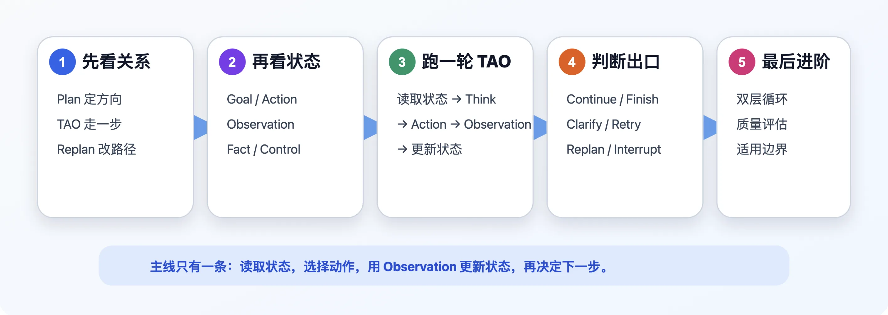
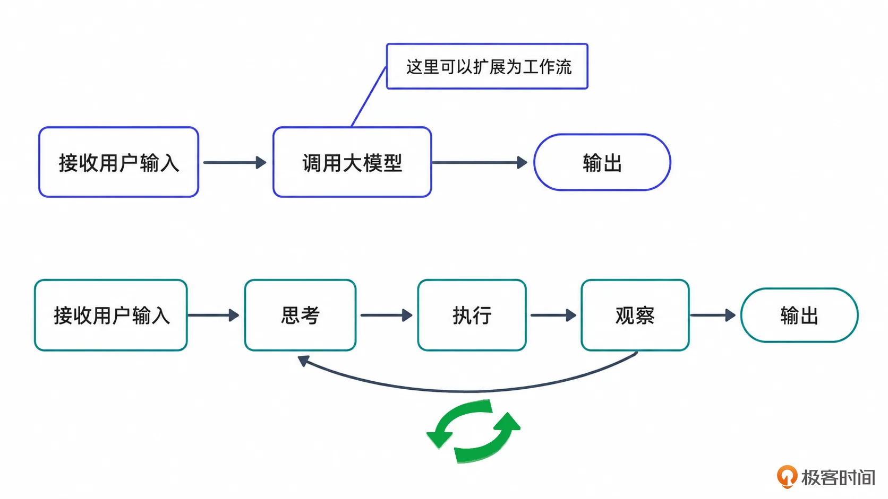
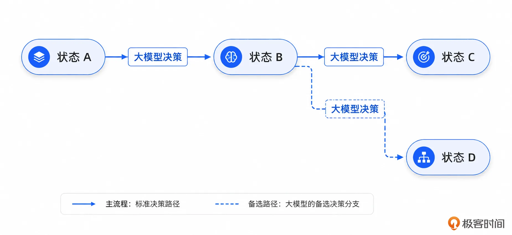
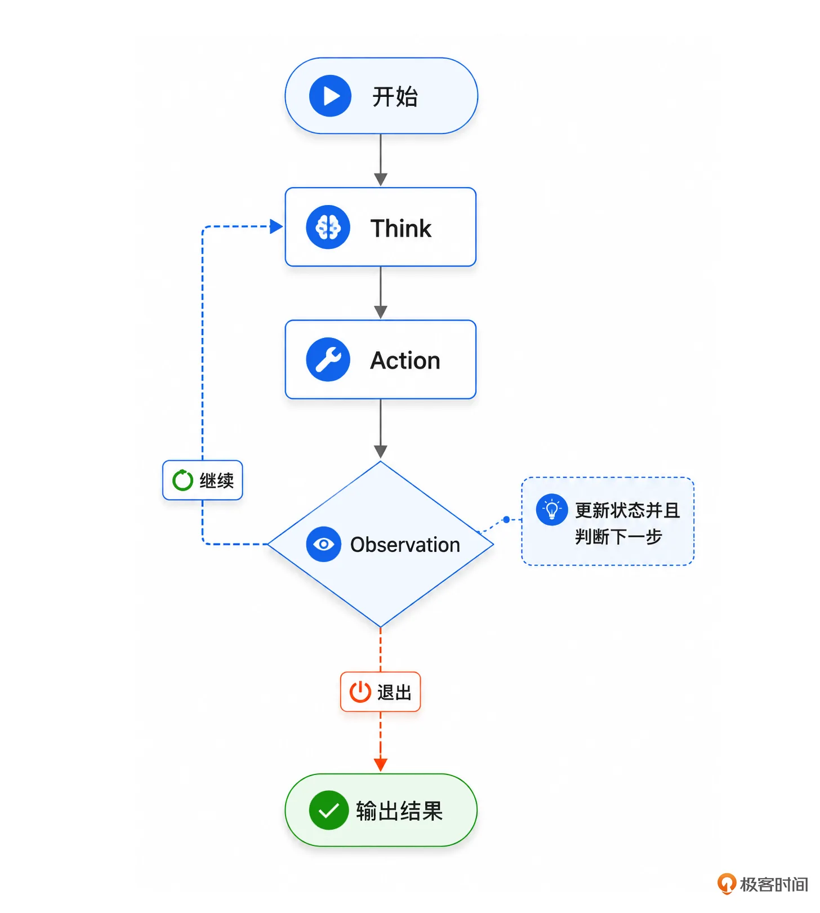
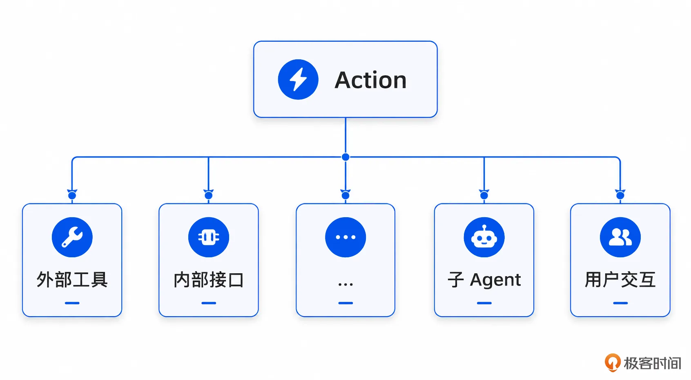
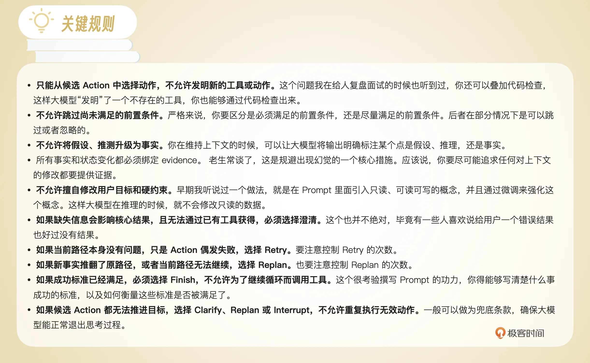
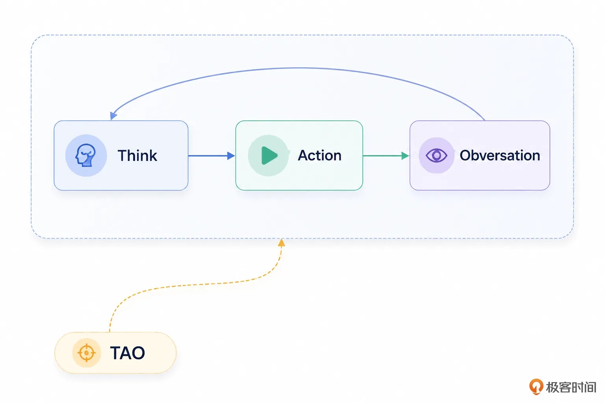
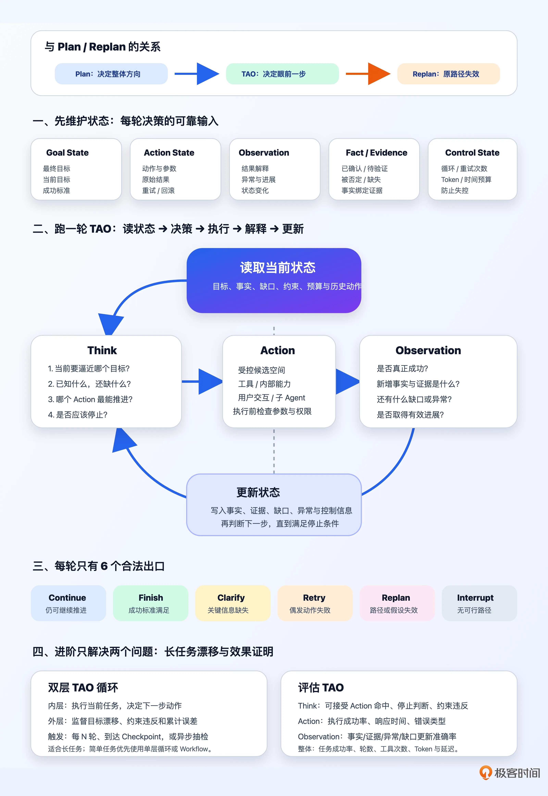

# 08 | TAO & ReAct：走一步看一步，但是怎么走、怎么看？
你好，我是大明。

前面几讲我们一直在讨论 Plan 和 Replan。简单来说，Plan 解决的是整个任务应该怎么走，而 Replan 解决的是原来的路走不通了，接下来应该怎么改。

这节课我们就来讨论另外一个常见的范式：ReAct 或者 TAO。内容比较多，我会拆分成两讲，这一讲主要是讨论最基本的 ReAct 和 TAO 的实现要点，下一讲会重点讨论怎么提高 ReAct 的效果。



先来学习一点基础知识。

## ReAct 和 TAO 是什么？

先简单介绍一下基本概念。ReAct 一般被解释为 Reasoning and Acting，也就是将推理和行动交替进行。

如果你是学生或者是这一年才开始接触 Agent 的，那么你碰到的各种 Agent 差不多都是 ReAct 这种形式。早期的 Agent 通常都是接收用户输入-调用大模型直接生成答案。而 ReAct 的运行过程更接近：输入-思考-执行动作-获取结果-再次思考-再次执行动作-（多次循环）- 最终输出。

你可以通过这张图来看出两者之间的区别。



举例来说，用户输入：“现在广州天气怎么样？适不适合去爬山？”。此时大模型不能只凭自己的知识回答，因为天气是实时变化的。于是它可以先思考：“我需要先查询广州当前的天气。”，而后执行天气查询工具，拿到天气结果，再继续思考：“当前温度是 33℃，有雷阵雨，因此不适合长时间户外爬山。”

从上面的图里，你其实已经可以看出来 TAO 的定义了：Think、Action、Observation。

严格来说，TAO 并不像 ReAct 那样是一个特别统一、特别严格的学术概念。不同人使用 TAO 的时候，具体定义可能也有一点区别。两者的关系有点像是两阶段提交协议和 XA。后面不管我是用 TAO 还是用 ReAct，指的都是一回事。

## TAO 和 Plan、Replan 的关系

看到这里，你可能会有一个问题：既然已经有 Plan 了，为什么还需要 TAO？或者说有时候面试官会问你用了 Plan 还会用 TAO 吗？

两者之间的关系其实很紧密，比如说典型的两种混用形态：

- 第一种：Plan 负责决定大方向，TAO 负责决定眼前这一步。

- 第二种：用 TAO 来推动 Plan 执行。


我比较喜欢用的是第一种形态。举个例子来说，Plan 里面可能有一步：收集用户的项目事实。但是执行的时候，Agent 仍然需要判断究竟怎么收集用户的项目事实，比如说：

- 从当前输入提取；

- 从历史对话召回；

- 从用户简历里面提取；

- 调用知识库；

- 询问用户；

- ……


这些都是 TAO 需要解决的问题。从这你大概也能看出来， **TAO 的关键就是决策**。

反过来说，如果只有 TAO，没有 Plan，有时候也会有问题。因为大模型每次只看眼前一步，就容易出现：

- 做着做着忘了最终目标；

- 一直在局部细节里面打转；

- 选择了短期看起来合理、长期却不合理的动作；

- 重复查询同样的信息；

- 越走越偏，最后南辕北辙。


上面这些问题大部分都跟所谓的长任务有关，也算是 Agent 方面的一个难点了。

所以我更加倾向于将两者结合起来： **Plan 决定整体路径，TAO 推进具体步骤**。当然了，如果你的 Agent 非常简单，或者用户的诉求非常简单，那么就只用其中一个，不管是 Plan 或者 TAO 都是可以的。

就第二种方式来说，最容易想到的就是用 TAO 结合 Replan 来推动、纠正 Plan 的执行过程。比如说：

- Checkpoint 就是 O 的体现，用于判断执行是否偏离；

- Replan 就是 T 的体现，在原路径失效时重新规划。还可以在 DAG 式的 Plan 里面，通过 T 来确定走什么分支。


进一步结合前面提到的 G4C，你会发现它们之间能够形成一个很自然的对应关系：

**G4C**

**在 TAO 中的体现**

Goal

Think 时确认当前要逼近什么目标

Context

Think 时确认当前知道什么、缺什么

Choice

Think 从候选 Action 中选择下一步

Checkpoint

根据 Observation 判断是否符合预期

Correction

Think 决定 Retry、Clarify、Rollback、Replan 或 Interrupt

这也是为什么我前面一直强调： **Plan 不是步骤列表，而是一个可检查、可纠偏、可执行的运行时对象。** TAO 正好和这么一个认知适配上。

## TAO，核心是状态循环

实现 TAO 非常简单，我愿称之为一个 Prompt 打天下。简单来说就是在一个 Prompt 里面包含了 Thinking、Action 和 Observation 三个部分，可能会有一些规则说明之类的。Prompt 可能长成这样：

```
你是一个 TAO 调度器。

# Thinking
思考规则...
# 候选 Action
...
# 结果
aciton x 的结果 : xxx
// 每次执行一个 action 就追加内容到这里
```

你要说这种做法有没有用？那肯定是有用的，但是只能用在非常简单的 Agent 中。

而在实践中，TAO 的核心并不是 T 的 Prompt 怎么写，A 怎么设计，O 是如何实现的， **它的核心是你如何维护一个 TAO 的状态循环。**

你可以这么思考，TAO就是一个不断推进的“状态机”，不同的是，它的引擎是“大模型”。换言之，在普通的状态机里面，是通过代码来推动状态变迁的；而在 TAO 里面，是通过大模型来推动状态变迁的。



举一个通俗的例子，TAO 就好比你有一个领导，TA 时不时来问你一下进度如何，然后根据你的进度给你进一步的指示。所以问题来了 **：一个 TAO 循环里面，究竟要维护哪些状态？** 回答出了这个问题，基本上就回答出了你的 ReAct 要怎么设计。

### 维护 Goal State

首先要考虑的是目标：

- 用户最终想要什么。这是一个标尺，用来校正每一个阶段，防止目标偏移。

- 当前阶段要完成什么。

- 什么条件下可以认为任务成功。


我们看一个例子：

```
{
    "final_goal": "生成适合高级 Java 工程师面试的项目经历",
    "current_goal": "补齐项目的业务规模和量化结果",
    "success_criteria": [
        "体现技术复杂度",
        "体现个人贡献",
        "包含量化结果",
        "不能虚构项目事实"
    ]
}
```

相信你也发现了，我上面判定任务成功的条件其实写得比较含糊，你不要学习，这里只是演示。在实践中我认为成功标准以及如何衡量是比较难的问题。比如说技术复杂度，什么才算是复杂，你怎么衡量复杂度？

这里你可能会想问为什么一定要维护目标状态？并且要同时维持住最终目标和阶段性目标。

因为 **TAO 是局部决策**。每一轮只是在决定下一步做什么。如果没有一个持续存在的目标作为参照，大模型就很容易陷入局部最优。

比如说当前搜索到了很多 Java 性能优化资料，大模型可能会沉迷于继续搜索更多资料，却忘了用户真正要的是改写项目经历。

目标状态就是一个锚点，确保你不会偏航。相应地，你就应该想到每一轮 Think 都应该重新检查：

- 当前 Action 是否能够推进目标；

- 当前状态和目标之间还差什么；

- 成功标准是否已经满足；

- 是否已经可以停止。


除了目标状态之后，显然要考虑的就是 Action 相关的内容了，这里暂且叫做 Action State。

### 维护 Action State

Action State 主要是记录已经做过什么，最主要的是维护每一个 Action 的类型、工具名称、调用参数、执行结果。

除了上面这些，还可以考虑额外维护开始时间、结束时间、时效性、是否可重试、是否可回滚等。可以这样说，你在实践中能想到的任何和 Action 有关的东西，你都可以记下来，放到 MySQL 里面，常用的你就放到 Redis 里面。

这和之前讲的 Plan 有点相似，每个 Action 的执行就像是一个 Plan 中的步骤，所以两者要维护的信息非常接近。

有一个常见的问题，如果我将每一个步骤的详细信息都记录下来了，会不会很浪费存储空间？显然会，但是你只要及时归档，那就问题不大。

接着你就可以考虑维护 Observation State 了。

### 维护 Observation State

Observation State 记录的不是工具原始返回值， **而是对返回值的解释结果**。要注意一点，你的原始返回值是放到了 Action State 里面。

为了方便你理解，我举一个例子：

```
{
    "action_id": "action_28",
    "execution_status": "partial_success",
    "new_facts": [
        "找到了项目峰值订单量"
    ],
    "missing_information": [
        "没有找到优化前后响应时间"
    ],
    "state_changes": [
        "业务规模信息已补齐"
    ],
    "anomalies": [],
    "suggested_next_action": "ask_user"
}
```

它的用途非常简单，就是 **来衡量任务进展**。

举个例子，接口返回 HTTP 200，只能说明接口正常返回。但是真的结果可能是数据为空、权限不足等等。你完全想不到你同事写的接口究竟会给你返回什么内容。

所以必须经过 Observation， **将原始结果转换成 Agent 可以理解的状态变化**，而后进一步判断 Agent 是否真的在前进。

比如说在搜索中，连续多次搜索都没有获得新的内容/事实，那么即便工具全部调用成功，记录的内容应该也是：

```
{
  "progress": false,
  "information_gain": "low"
}
```

这时就应该考虑换路径、询问用户或者 Replan。

而后则是要考虑维护一个比较特殊的东西： **已采集事实/关键事实/已知数据**，洋气点的说法就是 Fact State。面试中用 Fact State，显得你非常专业。

这个东西非常重要，以至于我需要单独拎出来在这里强调。

### 维护 Fact State

最简单的做法就是维护一堆文本，里面记录了各种你采集到的事实，但是这里我可以进一步建议你分类维护：

- 已确认事实；

- 用户明确认可的事实；

- 尚未验证的推测；

- 已经被否定的内容；

- 当前缺失的信息。


这个你看上去应该会有点眼熟，因为我在讨论 Plan（包括 Correction）、Replan 的时候其实已经讨论到了这些内容。

你可以认为 TAO 的核心从“Fact”的角度来说，就是 **根据新证据不断更新对当前世界的认识**。

缺少这种结构化维护的信息，大模型很容易犯一些错误。比如说将推测当成事实，忘记用户强调过的内容等等。你回忆一下你经常被一些 Agent 气炸的过程，是不是很多时候就是这方面做得不好？比如说明确说了不要改某个文件，结果改了；明确说遵守某个规则，它没有遵守。本质上就是这部分没有维护好。

大部分时候，我都建议你单独维护这些事实。尤其是 Agent 运行时间较长时（长任务），事实状态更不能只依赖对话摘要。记住，摘要会压缩，压缩就可能丢失细节，所以关键事实最好单独提取、单独存储，在 Prompt 里面做成单独一块。

你就这么理解，Agent 就像跟你住在一起的健忘的妈，你必须每天耳提面命一些规则，否则她就会忘记。

这里还有一些其它内容，或者是前面已经讨论过了，或者我觉得有点用但并不是特别关键，可以作为参考。

Plan 和 Plan State

如果混合采用了 Plan 方案，那么还要维护 Plan 和执行状态，这部分内容在前面已经讨论过了，这里不再赘述。

证据状态，Evidence State

这个部分在面试中非常有用，你在面试中说出来 Evidence State 的那一刻，基本上就可以宣布你解决了幻觉问题。从本质上来说它其实就是前面讨论的 Action State、Observation State 等内容的一部分，但是它是一种逻辑上的直接针对最终回答的观点的组织方式。简单来说就是一个观点对应多个证据，这些都维持在 Evidence State。一般来说，在涉及政策（政府、企业）解读的地方可以考虑独立引入这个内容。

信息缺失状态，Gap State

也是一个语法糖性质的东西，它就是将前面其它 State 中涉及到“缺少”的内容重新组织在一起。

检查点状态，Checkpoint State

也是一种组织方式不同带来的东西，它的特点是和 G4C 紧密组织在一起了，用在面试中有一种前后呼应的效果。

控制状态，Control State

这个是新东西，主要是用来防止 TAO 无限循环或者失控。例如说记录一下最大循环次数，已执行循环次数等，实践中很重要，实现起来也非常简单。

从实践上来说，我觉得除了 Control State 以外，其他几点重要性都不是很高，但是你在面试中可以斟酌着使用几个，凸显自己的专业性。

前面提到，真正能够落地的 TAO，不能只是三段文字，而应该被设计成一个受控的状态循环。

整个流程是：读取当前状态 → Think → 选择 Action → 执行 Action → 生成 Observation → 更新状态 → 判断下一步，如图：



接下来我们就看看 Think、Action 和 Observation 究竟是如何运作的。

## Think：究竟应该怎么思考？

在写 demo 的时候，你可以直接一句“请你仔细思考下一步做什么”，就算是尽到了写 Prompt 的责任了。

不过在真正生产 Agent 里面，要让大模型认真思考、仔细思考，要做的事情就比较多了，主要包括目标判断、状态判断、路径判断和停止判断等。

先来看目标判断。

### 目标判断

也就是要大模型回答：当前正在逼近哪个目标？目标分成两个：

- 用户最终目标：这个在意图识别之后差不多就是一直写在上下文里面，可以直接传递给大模型；

- 当前目标：如果你混合了 Plan 形态，或者就算没有 Plan 但是你也有明确的步骤、阶段概念，那么还是要大模型推测当前步骤、当前阶段的目标。在步骤切换、阶段切换的时候，才需要重新推断，如果观察阶段发现不合适，也会重新推断。


判断目标在实践中是非常重要的，毕竟有一句古话“方向错了，知识越多越反动”。很多时候你发现 Agent 的输出牛头不对马嘴，多半就是这个地方没搞对。

### 状态判断

当前已经知道什么了，还缺什么。这一部分主要是检查上下文里面的各种 State，并且检查：

- 事实是否足够；

- 是否还有缺失槽位；

- 是否存在未经验证的假设；

- 是否存在事实冲突；

- 其它业务特征相关的状态是否满足条件。


其实你都可以将这一个部分简化为“ **缺啥补啥”**。你结合下面的路径判断就很容易理解大部分时候 ReAct 就是缺啥就找到对应的工具来补啥。

### 路径判断

简单来说就是我有哪些 Action 可用，我应该用哪个 Action。

大部分的小 Agent，都可以在 Prompt 里列出所有的候选 Action，而后直接选择。更复杂的 Action 筛选机制，将在下一讲中讨论。

### 停止判断

核心标准是当前信息是否足够回答用户的问题了，或者当前的信息是否足以解决用户的问题了。

在实践中这个是比较难做的，Agent 很容易在两个极端之间摆动：

- 停止得太早，拿到一点信息就开始回答。这种情况比较容易出现在追求快速返回答案的 Agent 里面，如果判定信息是否收集足够的标准偏低，也会出现类似的问题。

- 停不下来，不断搜索、不断反思，消耗大量 Token，只为了提高一点点输出质量。


为此，每一轮的 Think 都要检查：

- 当前成功标准是否已经满足。这一点其实比较容易做到，因为在设计目标的时候就要求你设计明确的“成功”或者“失败”的标准。

- 关键信息是否已经足够。这一个部分可以通过叠加 Slot Filling 之类的手段来处理。

- 继续执行能否明显提高结果质量。这一个我认为是比较难判定的，大多数时候只能是在 Prompt 里面保留一句话“在无法明显提高结果质量的时候退出思考”，但是正如我之前说过的，什么叫做“明显提高了结果质量”？明显怎么定义，质量提高与否又怎么定义，这只能是依赖于在长期执行过程中不断迭代之后沉淀相关的规则。

- 是否已经超过时间、Token 或工具调用预算；

- 是否应该先返回阶段性结果。这个检查能带来一个好处：更快返回结果给用户。实际上很多时候用户并不是需要一次性拿到最终的结果，而是如果能够提前拿到部分结果，可能用户都不需要你的 Agent 进一步处理了。


除了前面这些判断，根据你的业务特征不同，可能还会有一些额外的判断。比如说风险判断，也就是每一个 Action 执行起来会不会有问题，如果有问题怎么解决。这本质上就还是一个定义规则的问题。

## Action 是调用工具，但也不仅是调用工具

在面试中，Action 这一块是问的比较多的，一般聚焦在：

- 你有多少 Action

- 如果有很多 Action 怎么办

- ...


我一般用一种非常抽象的眼光看待 “Action” 这个名词，有一种万物皆 Action 的感觉。如图：



这里我额外强调一下用户交互，这是指 Agent 尝试从用户处获取更多的信息，或者要求用户去做一些事情。举个例子，在政务类的 Agent 里面，就经常会出现要求用户放好身份证到读卡处等。

而后，注意一点工具不等于 Action，接口更加不等于 Action。实质上你可以认为 Action 本身是一个二次封装的产物。它可以封装外部工具，也可以封装内部接口，还可以聚合多个接口。

## Observation：解释数据比存储数据更加重要

如果用一句话来描述 Observation 的职责，我认为就是存储 + 解读。而从重要性上来说，后者远比前者重要。

Action 执行完成之后，不能直接将原始结果塞回大模型。首先要将工具结果整理成结构化 Observation，比如说：

- Action 是否真正成功？

- 获得了哪些新事实？这些事实的证据是什么？证据的重要性不要低估了，它能有效遏制幻觉的问题。

- 是否符合执行前的预期？

- 哪些信息仍然缺失？

- 是否出现异常？是否违反约束？

- 是否推翻了原有假设？这一个和违反约束有点像，但是并不一致，因为违反约束是一个破坏性很大的事情，但是推翻原有假设往往只需要重试或者 Replan 而已。

- 当前状态发生了什么变化？是否取得了实际进展？


最重要的是判定是否取得了实际进展。这个东西就很难了，难在你要给出明确的衡量标准。举个例子来说，最简单的做法是在 ReAct 里面收集信息的时候引入 Slot Filling，也就是告诉大模型你需要收集这些信息，并且要收集正确。

因此每一个槽位被填充，就代表取得了新的进展。

这里你可能还会有一个疑问，就是这个 Observation 又是要存储数据，又是要解读数据，那么是让大模型做还是让代码来做？

一般有两种形态：代码直接做完，也就是代码来存储数据，比如说将 Action 结果写入到 Redis 里面，代码来解读数据，基本上就是简单判断一下字段全不全，数据对不对。代码很难做复杂的语义解释。第二种形态是代码做存储部分，大模型做解读。也就是 Action 的结果会进一步传递给大模型，大模型会结合上下文来解读这些数据。

那么，能不能只调用大模型呢？这恐怕不能，除非你说让大模型选择工具，比如说一个 Redis Command 的工具，执行 SET 命令之类的来完成调用结果的存储。

## TAO 有哪些下一步？

一轮 TAO 结束之后，通常有六个出口。

- Continue：当前目标还没有完成，并且仍然存在能够推进任务的 Action。

- Finish：成功标准已经满足，可以输出最终结果。还是那句话，你至少要给出明确的成功标准，并且给出衡量方式。类似于“达到你认为好的地步”这种就容易导致输出不稳定。

- Clarify：缺少关键信息，而且继续猜测会违反硬约束或者产生高风险结果。这一般是指询问用户来澄清，部分情况下可能是调用一些工具获取一些信息。所以，你在实践中至少会有一个跟用户交流的 Action。

- Retry：原路径没有问题，只是当前 Action 出现偶发性失败。比如网络超时、接口临时异常或者输出格式错误。这一类的决策是很好做的，只需要你记得在上下文里面维持住重试次数，以及剩余超时时间等。

- Replan：当前路径、前置假设或者工具选择本身有问题。这里就可能会要求 ReAct 进一步审查整个上下文中的内容，而后决定回溯已经 Replan。

- Error/Interrupt：这是最无奈的选择，也就是大模型已经觉得自己做不下去了，比如说关键工具此时不可用。这个兜底是一定要有的，防止你的大模型不知道怎么结束，于是一直思考。


## Prompt 怎么写？

在讨论 Prompt 怎么写之前，得先讨论有多少个 Prompt。这里我简单分一个类：

- 小型 Agent 可以一个 Prompt 打天下，所有的事情都在这个 Prompt 里面完成。

- 同一个 Prompt 同时负责思考和工具选择（Action Selection），而后再交给一个 Observation Prompt 去处理。

- 一个 Prompt 负责思考，一个 Prompt 负责工具选择，再有一个 Prompt 负责 Obversation。


当然还有别的变种，比如说我前面提到 Action 本身都可以引入粗筛和精筛，这就是两个独立的 Prompt 了。这些所有的 Prompt 里面，最重要的就是 Think 的 Prompt 了。

你可以认为，在前面讨论“TAO核心是状态循环”里面罗列的各种 State 就是你需要考虑在 Prompt 中携带的内容，也是你上下文管理中的核心内容。

除了这些内容，我觉得有必要提及的就是约束大模型的思考边界。

### 约束大模型的思考边界

你还需要补充一些关键的规则，防止大模型胡思乱想或者真的自由发挥，给你一个意想不到的结果。

这里我给出一些可以参考的内容：



这么多的规则，根本记不住，面试中怎么办？你可以随便说几条规则作为示例就可以，不需要全部都背出来。如果面试官追问细节，你就可以说 Prompt 是公司的核心资产，你不能泄密，或者直接推脱不记得了。

整个 ReAct 的介绍你可以参考这个话术：

```
我们没有简单地让大模型自由执行 ReAct，而是将它工程化成了一个受控的 TAO 状态循环。

Think 阶段主要完成五类判断：当前目标是什么、已知和缺失信息是什么、有哪些候选动作、每个动作有什么风险，以及当前是否已经满足停止条件。

Action 也不是从系统全部工具里面自由选择，而是会根据意图、当前 Plan 节点、前置条件和业务 Spec，先缩小候选动作集合，再结合目标推进程度、信息增益、成本、风险和可回滚性选择下一步。

工具返回值不会直接作为 Observation。我们会对原始结果做归一化，提取事实、证据、状态变化、异常和剩余信息缺口，再决定继续、Finish、Retry、Clarify 或 Replan。
```

## 高级方案：双层 TAO 循环

所谓的双层是指：

- 内层循环负责执行当前任务

- 外层循环则负责监督整个方向，包括监督 Goal 有没有发生漂移、约束是否被违反等


简单来说，就是内层循环解决的是下一步怎么走，外层循环解决的是我这走得还对不对。如图：



外层循环在落地的时候，也有两种方式：一种是异步执行；还有一种是，每次内存循环执行 N 次之后执行一次外层循环，不过是同步执行。比如说每隔 3 轮就执行一次，又或者在结合了 Plan 的机制中，每次到达 Checkpoint 就执行一次外层循环。

这种机制尤其适合长任务。因为长任务最大的问题不是某一步偶尔出错，而是小错误会不断累积。比如说第一轮只是漏掉一个约束，而后第二轮基于错误状态选择了一个动作，接着第三轮又基于错误结果更新了状态。

最后虽然每一步看上去都挺合理，但是整个任务已经偏到十万八千里之外了。

### 评估 TAO 的质量

既然前面已经讨论了怎么实现，那么自然也不能少了评估。所有 Agent 相关的面试，你能拿出指标，就能和大部分候选人拉开差距。

TAO 的评估可以分成四个部分。首先是 Think 有关的指标：

- **动作选择准确率**。我个人认为是最重要的一个指标，它直接决定了你的 ReAct 的效果。

- 动作参数准确率。大部分的 Action 都是需要一些参数的，Think 过程往往需要准备好这些参数。

- 当前目标判断准确率。

- 信息缺口识别准确率。

- 约束违反率。

- 停止判断准确率。


这几个指标其实都不太好衡量，也不好采集。基本上只能依赖于离线分析 \+ LLM as Judge，也可以自己手工抽样检查来计算对应的值。

接着是 Action 的指标，动作执行成功率和响应时间，这个比较简单，你可以把它看成是一个传统工程的范畴。

而后是Observation 指标，包括：事实提取准确率、证据绑定准确率、工具结果误读率、异常识别准确率、信息缺口更新准确率。

这些同样不好通过代码采集，基本上都是需要通过离线分析 \+ LLM as Judge 的方式来采集。

最后还有整体指标：

- 最终任务成功率。这个指标的难点在于如何定义任务成功，比如说最简单的做法就是认为正常返回了答案就是成功，而不对答案的质量进行评估。

- 平均 TAO 轮数。在同等输出质量下，越少越好。不过很多时候都是 TAO 轮数少了，输出质量也下降了。

- 平均工具调用次数。这个指标有点类似于 TAO 轮数，如果你是严格的一轮只会调用一个工具，那么两者就是完全一样的，

- 平均 Token 消耗。如果你混用了多个大模型，那么可以考虑分大模型统计。毕竟有一些大模型很便宜，你用多少 token 都不心疼。

- 任务平均延迟。类似于首字符延迟等指标，主要是对用户体验有显著影响。


综合来看，衡量 ReAct 效果的指标，大多数都离不开需要借助另外的大模型来评估。只有极少数的指标才是能够直接通过代码采集到的。

## 总结

到这里，你应该已经意识到，TAO 并不是简单地让大模型输出三个字段。

- Think 的本质，是判断当前最重要的问题是什么。

- Action 的本质，是从受控的候选空间里面，选择最值得执行的下一步。

- Observation 的本质，是根据工具返回的证据，更新 Agent 对当前状态的认识。


而整个 TAO 循环的本质，就是不断缩小当前状态和目标状态之间的差距。所以说 ReAct 是“走一步看一步”，但并不是瞎看，也不是瞎走。

就从面试中来说，我认为你可以直接使用双层 TAO 循环方案。它的实现难度并不高，应该说相当简单。但是它又能显著解决长任务漂移的问题，因此面试的效果会很不错。



## 思考题

我在前面提到 TAO 要维持住很多的状态，那么你认为除了我描述的，还有什么状态需要维护？欢迎你把想法分享到留言区，和我一起交流讨论，如果你觉得有所收获，也欢迎你分享给需要的朋友，我们下节课再见！