# 09｜TAO 机制：为什么你的 Agent 总是“选错工具”？
你好，我是大明，今天我们接着学习 TAO，讨论一个更加深入的话题：怎么提高选择工具的准确率。

在 TAO 里面，如果说什么最重要，那么我认为一定是选对 Action 最重要。

而在面试中，这也算是一个热点问题，所以如果你能够提前准备好解决方案，并且在简历中、自我介绍中主动强调自己有优化 Action 选取准确率的经验，引导面试官发问。这样一来，你就能赢得竞争优势。

在这之前，我们先讨论一些有关 Action 设计的问题。

## 基础知识

### Action 的粒度

有些时候，面试官会给你一个下马威，突然问：Action 和工具是一样的吗？这个问题其实就是讨论到了 Action 的粒度问题。我直接给出一个评价标准： **Action 是一个业务上完整的操作**。

换一句话来说，Action 内部可以是只调用一个工具，也可以是调用多个工具，甚至于还可以启动一个子 Agent。但是不管如何，它在业务上就是一个独立的、完整的步骤。

举个例子来说，我们可以将获取用户画像作为一个 Action。而这个 Action 内部是如何获得用户画像的，可以有比较复杂的逻辑。它可以先尝试从缓存中获取，再尝试从 MySQL 中获取，实在拿不到它可以降级到用一些用户标签来替代用户画像。

但是这里也有一个问题，就是你在实践中可能看到一些 Action 的范围好像并不符合我说的这个标准。比如说，有些人会把从缓存中获取、从MySQL 中获取分别做成两个 Action。

我认为有两个可能。第一个可能就是他们的组织方式不对，第二个可能就是他们需要大模型来决策从哪里获取。

在这个标准以外，还有一个你需要注意的点，就是尽量保持 Action 之间是正交的。也就是说，Action 之间的职责边界要保持非常清晰，不存在重合的情况。

但是你可能发现了，如果我又要业务完整性，又要正交，就会冲突。比如说从业务完整性的角度，你有一个 Action 叫做退货并退款，有一个 Action 叫做仅退款。从业务上来说，两者之间区别很大，所以构成两个独立的 Action 也是可以的。

但是这两个 Action 是重合了一部分职责的，也就是退款。所以它们肯定是不符合正交原则的。因此在实践中可能会出现的情况就是，大模型选错了，比如说应该退款并退货的，执行成了仅退款。

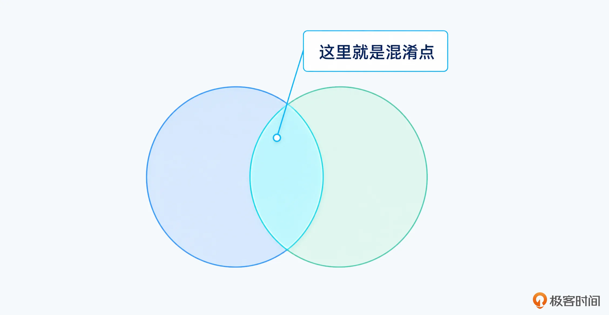

所以我说尽量保证正交，但是在实践中无法做到完全正交，总是有一些 Action 之间会有职责重叠。

#### 子 Agent 作为 Action

将子 Agent 封装为 Action 算是我特别喜欢用的一种方式了。举一个例子来说，在教学类的 Agent 中，对用户的卷子进行评分，那么作文和阅读理解的评判过程就会被拆成两个子 Agent，评分 Agent 就会在决策的时候直接启动子 Agent，子 Agent 内部完成评分之后输出主 Agent 需要的数据。如图：

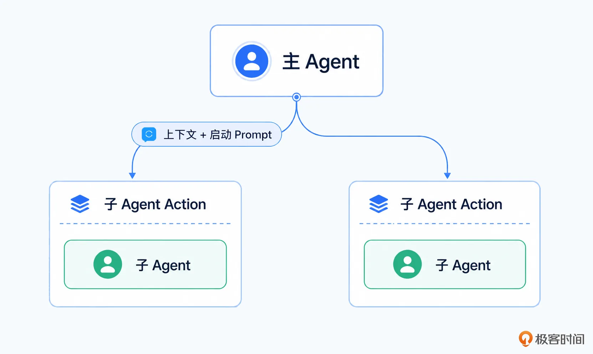

上面是我采用的设计，其中主 Agent 需要使用子 Agent 的时候就会把自己的上下文完整传递过去，子 Agent 自己决策使用上下文的什么部分；其次这个子 Agent 一般是通用的 ReAct/TAO 实现，需要传入一个启动 Prompt 来让它开始运行。

#### 反范式：使用粗粒度 Action 以减少 Action 数量

有一种反范式的用法就是在 Action 很多的时候，会有意识地设计粗粒度的 Action，以减少 Action 数量。而后在 Action 内部根据参数值、上下文来决定真正要执行的 Action。

前面获取用户画像的例子同样可以说明这种情况。如果你拆分的粒度比较细，那么你至少会有“从缓存中获取”和“从MySQL 中获取用户画像”两个 Action。

这种做法可以进一步结合后续我讨论到的多次筛选来提高 Action 选择的正确率。比如说最开始大模型可能只是想要获取订单信息，所以选择了 OrderService 这个粗粒度 Action。而后再一次调用大模型，将 OrderService 下的具体方法、接口都传递给大模型，最终大模型准确挑选出来了根据 Seller ID 来查找订单的接口。

之所以把这种叫做反范式，因为它只能被看作是一种无奈的选择，并且要配套一些额外的机制来实现，所以整体上我还是建议你用我前一个标准，按照业务步骤的完整性来划分 Action。

### Action 的可用性问题

每一个 Action 的实现者、提供者应该负责保证自己的 Action 是高可用的，而不应该寄希望于 Agent 会执行容错。当然，Agent 本身肯定会容错，但是提供者自己应该先保证做到高可用。

这就意味着：Action 内部能够处理的错误应该自己处理掉，降低大模型的负担。

Action 内部的容错机制可以参考传统工程的理论：

- 重试：比如说 Action 内部需要调用 HTTP 接口，那么调用失败的情况下，Action 内部自己尝试重试。但是你可以要求 Action 在重试都失败了的情况下返回重试有关的信息。

- 降级：Action 内部都可以设计降级机制，比如说先尝试获取最新数据，获取不到就用老数据等。熔断、限流这两个理论上也可以使用，你看情况引入。

- 互为替代的工具封装为一个 Action：比如说 A B两个工具都可以查到同样的数据，那么在 A 工具崩溃了之后，使用 B 工具。整个判定、切换、恢复都交给 Action 内部自己去实现。


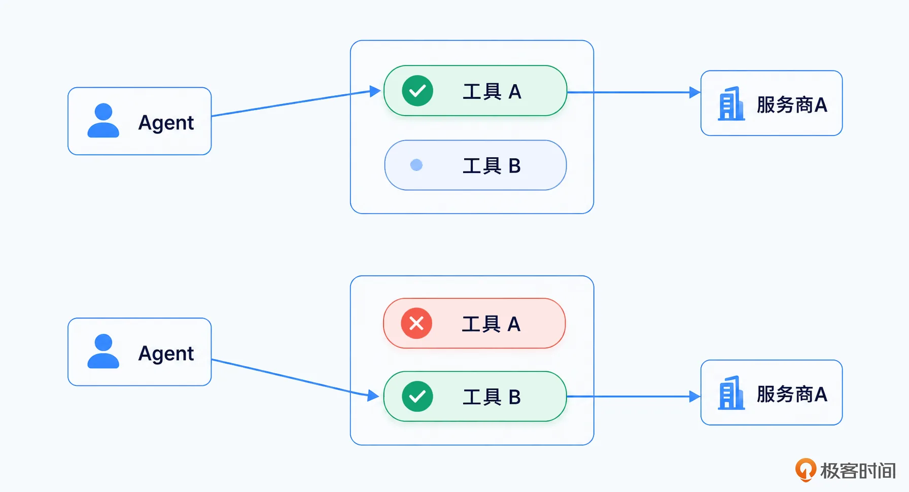

这种理念也可以看做是传统工程中的封装理念在 Action 设计中的应用。

### Action 的权限控制

Action 的权限控制算是面试中一个热点了。举个例子来说，有一些操作是需要用户明确授权的，比如说获取用户的身份信息、读取/操作某些敏感资源。

那么权限控制就要解决两方面的问题，一方面要判断用户是否有权限，一方面要在用户授权之后记录下来用户授权的信息。部分授权是有时限的，还要记录这种时限信息。

除此以外，还要考虑进一步解决审计等问题。

乍一听这个问题感觉挺复杂，但是实际上并不复杂，如果你搞过传统的权限控制，就能意识到这个跟传统的权限控制差不多。

权限控制这方面有两种做法，第一种做法是借助封装，第二种做法则是借助 AOP 之类的手段。

先来看第一种封装。想必你还记得我说过，Action 可以看做是对各种接口的封装。

而一旦你听到封装这两个字，你就知道这里可以做的事情非常多。比如说权限问题，就可以在封装不同的工具、接口为 Action 的时候，顺便做一下。如下图：

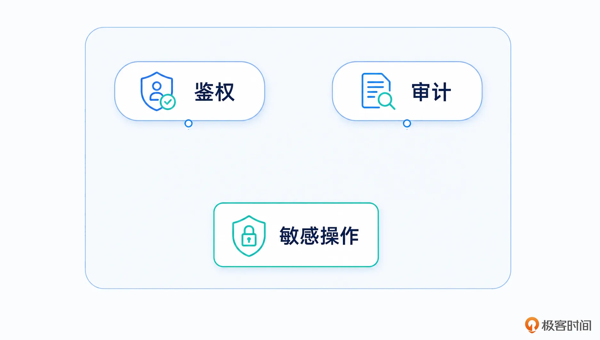

这种做法的优点是 **可控性非常强**，但是缺点就是 **每个 Action 都要独立管理自己的权限、审计等问题**。

第二种做法就是抽取出一个通用的 Action 鉴权、审计等机制，每次调用 Action 之前都要先进行一个鉴权、审计。

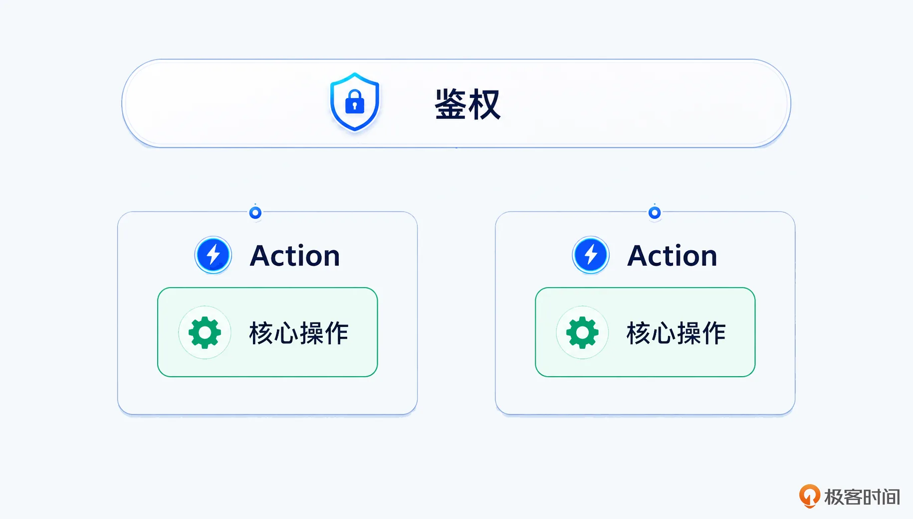

这种做法的好处就是统一管理鉴权，系统稳定性更好。缺点则是扩展性稍差一些，毕竟有一些 Action 它的授权机制非常复杂，难以统一解决。

这里我还可以额外强调一下，即便引入一个通用的机制，依旧可以看作是装饰器模式。也就是在一个没有鉴权机制的 Action 的基础上，进一步封装一个有鉴权，整个伪代码如下：

```
// PermAction 同样实现了 Action 接口
type PermAction struct {
    action Action
    // 这个就是权限服务
    permSvc PermissionService
}

func (a *PermAction) Do(...params) {
    a.permSvc.Check(params)
    return a.action.Do(params)
}
```

你可以将 Action 看做是一种资源，而后执行 Action 就是一种操作，从而纳入到传统的权限控制体系下。不管是 RBAC（基于角色的权限控制） 还是 ABAC（基于属性的权限控制），都是用得上的。如图：

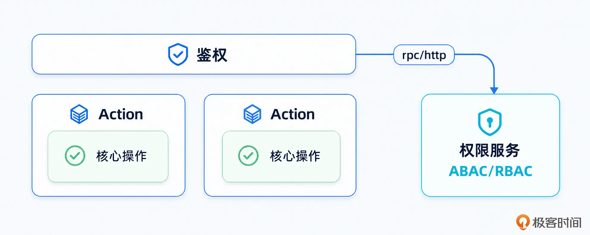

因此，Action 的鉴权，没啥特殊之处，就是传统鉴权在 Agent 上的一个应用。

### 候选 Action 数量

这里有一个非常刁钻难回答的问题，就是究竟传递给大模型多少个候选 Action 才算是合适呢？这个问题如果是在面试中，我就能直接给出一个答案，那就是 3-5 个。这个数字是怎么得出来的呢？这其实是 Anthropic 建议的。

如果所有工具数量小于 10 个，则可以直接放入到上下文中。

前面聊的是面试，实践的话我觉得你可以忽略前面的讨论。在实践中，你只需要坚持一个点：只要我在筛选 Action 上准确度还可以接受，我就随便放，放 20 个、30 个、40 个都无所谓。

从我的实践经验来看，只要你的 Action 是正交的，或者说边界是非常清晰，那么多放几个其实问题也不大。但是如果你的 Action 边界模糊，那么即便只放少量的 Action 也会导致准确率明显下降。

当你要考虑优化、提高准确率的时候，再考虑控制 Action 数量。

## 基础解决方案

这里所谓的解决方案，就是指 Think Prompt 挑选 Action 的片段怎么写。同样的，我这里告诉你一些关键原则和一些经验，具体如何“炼丹”就得靠你自己了。

当然了，上一节课讨论的那几个 State 你别忘了带入到 Prompt 里面。

### Action 如何描述

每个候选的 Action 应该包括以下这些内容：

- name：Action 名称。很多人忽略了名称的重要性，但是所谓名不正则言不顺，一个好名字有助于让大模型精确定位到。

- description：这个 Action 能够完成什么。

- **applicable\_scenarios**：适用场景，准确描述什么样的场景下可以使用这个 Action。

- **inapplicable\_scenarios**：不适用场景，描述在什么样的场景下不能使用这个 Action。它和前面一个字段结合在一起，相当于从正反两方面定义清楚了 Action 的边界。

- required\_params：执行所需参数，你可以进一步叠加必填参数和可选参数，其中可选参数要进一步解决默认值的问题。同样的，我认为默认值最好还是在 Action 实现内部解决，可以进一步减轻推理负担。


我要额外强调一下参数的问题，我的建议是参数越少越好，并且参数越容易拿到越好。如果参数本身需要通过推理才能得到，可以考虑将这个推理内化为代码，作为 Action 逻辑的一部分。

类似地还有返回值，Action 也应该秉持最小返回值的原则，只把外部调用者想要的信息暴露出来，而不是自己能拿到什么数据就暴露什么数据，这样可以 **减少 Observation 的解读负担，以及上下文维护的负担**。

我十分反对那种在返回值里面设计几十种可能的做法，而后还要教 Observation 解读这些输出究竟是什么意思，我只能说真的教不会的。如果你的输出情况实在太多，你的 Observation 是不准的，你不如拆分 Action。

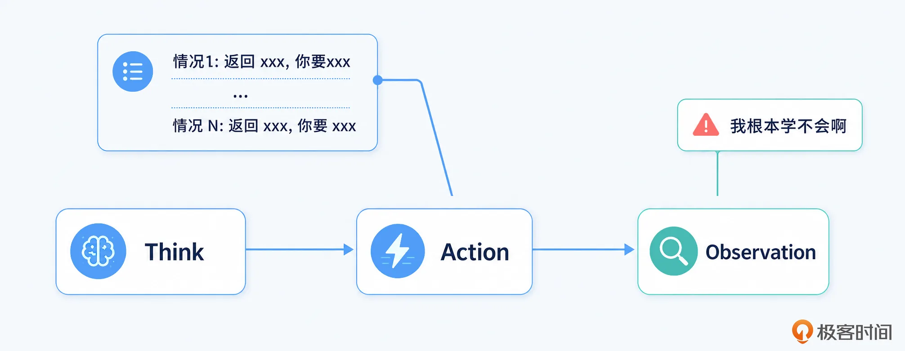

大多数时候，传统工程里面提到的高内聚低耦合、封装之类的概念，在 Agent 这里同样适用。用通俗的话来说，系统模块之间，就要像陌生男女之间，要保持神秘才有吸引力。

剩下还有一些我建议你可以考虑加入进去的，但是我觉得很多时候都意义不大的内容：

- preconditions：执行该 Action 必须满足的前置条件。这个点我要稍微吐槽一下，就是大模型很容易在这一个环节出错。比如说不满足的判定为满足，满足的判定为不满足。因此我其实更加建议你在 Action 的实现内部检查这些前置条件。

- cost：时间、Token、调用次数或其他执行成本。部分 Agent 会在自动模式下，总是选择低代价的 Action。

- risk：失败、误操作或产生副作用的风险。这个有点意义，可以让 Agent 进一步结合风险来判定要不要执行。不过，在实践中，我个人认为很少会因为 risk 的原因而放弃选择一个最合适的 Action，最多就是在两个 Action 都差不多的情况下，才会进一步考虑 risk。

- reversible：执行后是否容易撤销或回滚，你可以看做是 risk 的一个进阶版，一些没有后悔药的操作，大模型应该更加谨慎使用。


### 选择规则

这里我给出撰写规则里面的关键点。

#### 只能选择候选 Action

第一点也是最重要的一点，就是只能从候选 Action 中选择，不能凭空生成 Action。这部分，我其实更加建议在输出规则里面将 Action 的名字定义成枚举，并且只能从候选 Action 中选择。而后进一步结合代码检查，相当于在真正执行 Action 之前，一定要先检查这部分 Action 是不是真的在这一轮候选 Action 里面。

而后我再指出一个容易犯错的点，就是你在当前这一轮没有提供 Action1 作为候选，但是因为大模型从你的上下文里面得知了有 Action1，而后选择了 Action1。

因此你做的检查，不能是检查这个 Action 是否存在，而 **应该检查这个 Action 不仅存在，而且还** **得是** **这一轮的候选 Action**。

#### 前置检查

正如我吐槽的，前置检查很重要，但是大模型做起来不一定靠谱，所以我都是推荐你用代码来做前置检查。结合前面讨论的权限控制、候选 Action 检查，你可以设计一个非常通用的 Action 调度模块，在里面完成各种检查，甚至可以包括参数合法性的检查。

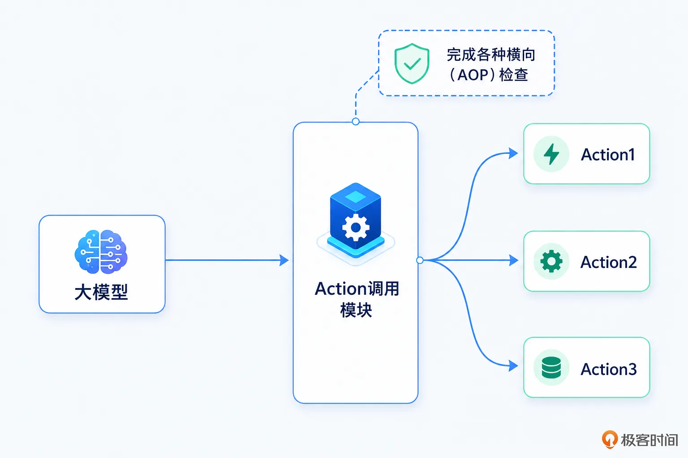

做起来也不是很复杂，最极端的情况下就是引入一个规则引擎而已。而后将前置条件、权限规则以及参数规则等，都写成一条条规则，最终经由规则引擎解析并执行。

#### 结合 Replan，排除错误选项

要注意的是，即便大模型选对了一个 Action，但是最终这个 Action 可能执行出错，或者得到的结果并不理想。所以要集合重试、Replan 等机制。

最简单的做法就是，每一个步骤都要记录已经尝试过的 Action，而后每次重试的过程，就直接排除掉这些已经尝试过，但是结果并不太好的 Action。

但是这种做法有一个问题，就是可能在重试期间，之前不好用的 Action 突然变得好用了，那么这种策略会导致你错过最合适的 Action。典型的就是一些涉及到网络调用、数据同步延迟等的 Action，你就要谨慎考虑了。

#### 输出决策理由，输出证据

这可以看做是 evidence based 的有一个经典应用。你可以在大模型选择 Action 的时候，要求它一定要输出决策的理由、对应的证据，这些东西非常有用。一方面，这可以大幅减少幻觉的产生。另外一方面，它会是你排查 Action 选择方面问题的重要依据。

有些小伙伴甚至会把这些沉淀下来作为竞品案例或者反面案例，拿去做微调。

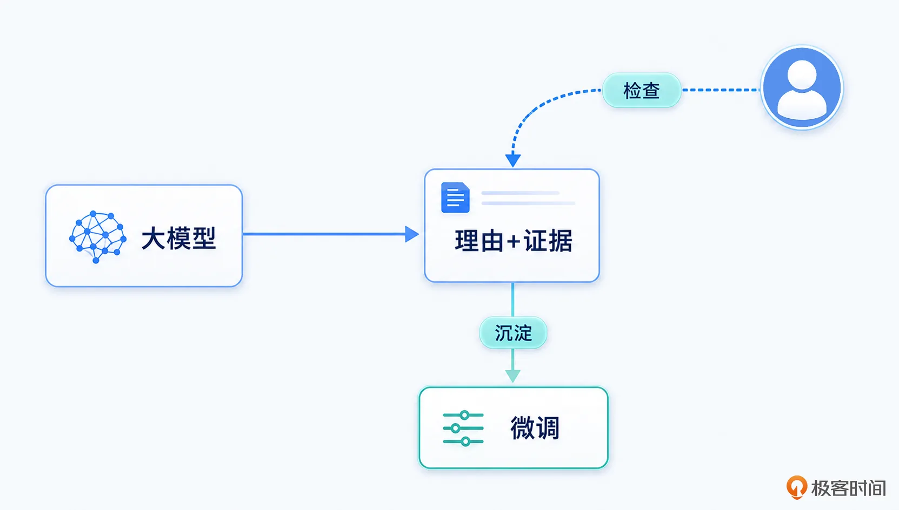

#### 结合 few-shot，正反案例

同样可以结合 few-shot 这种常规但是又很好用的手段，并且可以提供正反两方面的例子。

但是这里还是会有一个问题，就是 Action 有很多，每个 Action 又有很多例子，怎么组织呢？这个也很简单，你可以用 Action 的名字作为 key，而 value 就是这些例子。至于你存 Redis 还是存 MySQL，都是可以的。

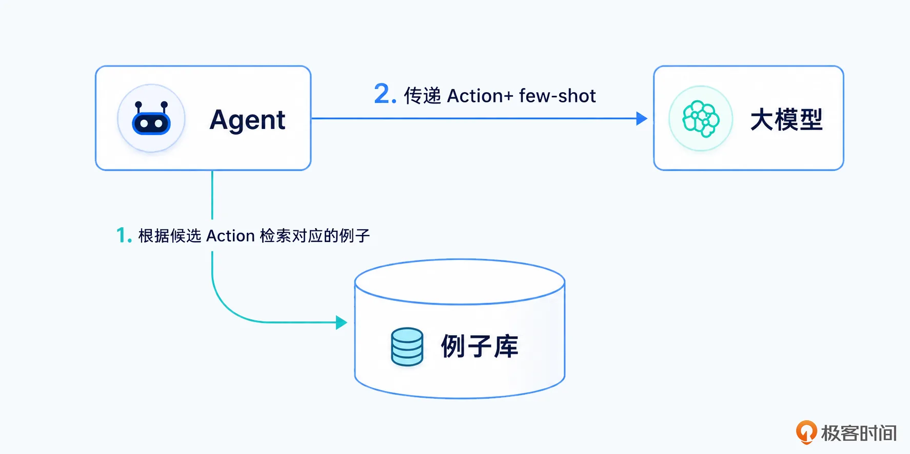

## 高级方案

提高 Action 筛选准确率的方法并没有那么多，主要就是两个思路：

- 减少候选 Action 的数量

- 编写更好的筛选 Prompt


在第一个思路下，还有一个面试热点：如何解决海量 Action 的问题？

### 海量 Action 解决方案

前面提到过候选 Action 的最佳数量，根据 Anthropic 的观点是在个位数。那么问题就来了，如果你的 Action 很多，你怎么挑选出来合适的候选 Action，而后让大模型选出最终的 Action？

这就是一个 Action 组织的问题。这里我先构建一个最抽象的概念，你可以把选出最后要执行的 Action 的过程看做是一个流水线，并且最后一环基本上就是大模型筛选。

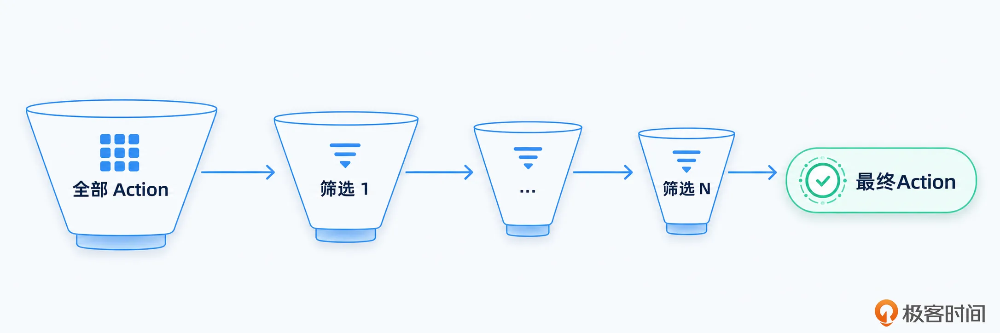

而每一个环节，要么是代码来实现，这属于传统工程范畴；要么就是借助大模型，一般可能会使用一些讲究返回速度的大模型。

我可以提供几个实现方案。

#### 基于意图的 Action 组织方式

很显然，不同意图下能够使用的 Action 是不一样的。举一个例子来说，在售后相关的意图里面，直接发起退款而不需要商家同意应该是一个 Action，但是这个 Action 只会在售后相关的意图中使用。

因此一种最自然的方式，就是为每个 Action 关联上多个意图，只有在这些意图下才可以使用。你用 Map 结构，或者在 MySQL 里面维持一个关联表，都可以。

#### 基于标签的 Action 组织方式

也就是为 Action 打上不同的标签，根据这些标签来筛选。前面基于意图的 Action 组织方式也可以用标签来实现。如图：

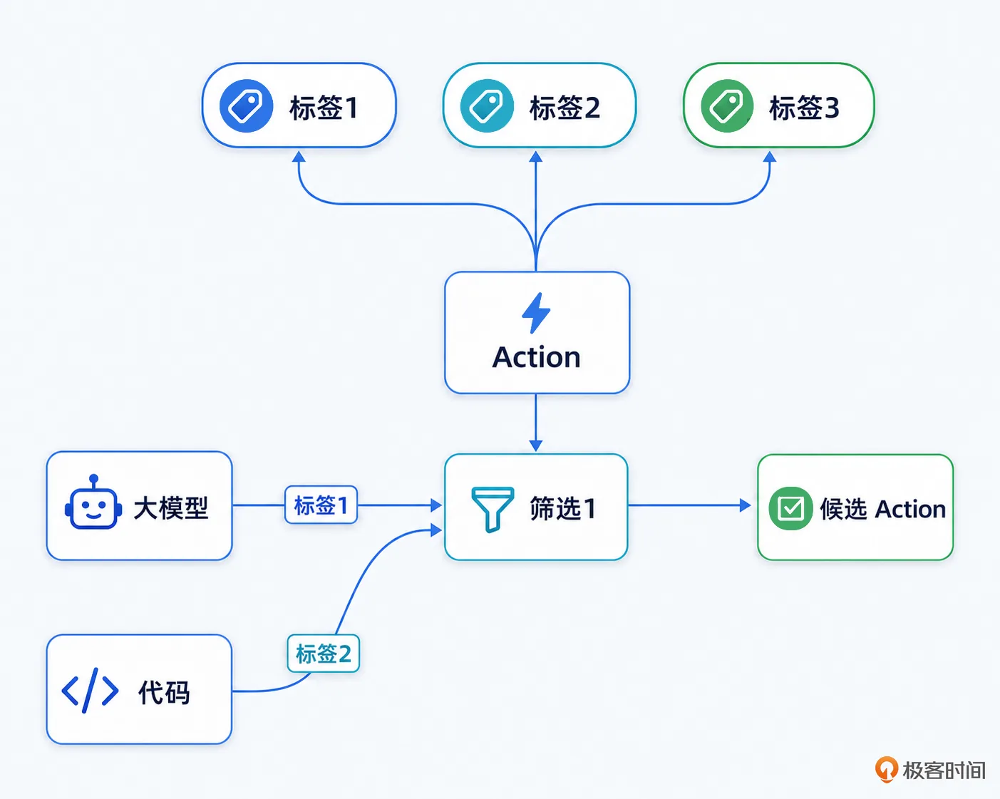

#### 基于规则引擎的筛选方式

你可以进一步借助规则引擎来从海量的 Action 中筛选出候选 Action。

这些规则一般是对上下文的描述。举一个例子来说，当发现上下文没有加载用户画像的时候，就可以将加载用户画像的 Action 放入到 Prompt 里面。

#### 基于大模型的多次筛选

这一种方式我一般不太建议你使用，它的原理也非常简单，将海量 Action + 少量上下文，直接丢给大模型，让大模型挑选出相关的候选 Action。

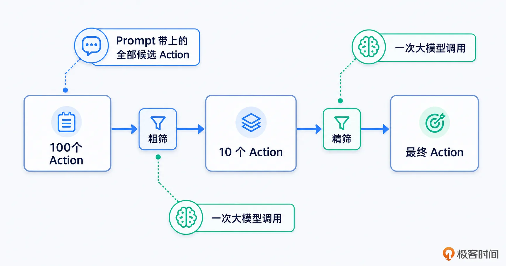

注意这里的要点是少量上下文，因为如果你按照正常的调用来传递比较完整的上下文，那么你的大模型的上下文窗口里面可能放不下那么多 Action。

既然是少量的上下文，那么放什么东西比较好呢？我的建议是将目标、缺失数据这些放上就可以了，因为粗筛的时候大模型可以根据目标和缺失的信息选出能够补全信息的候选 Action。

粗筛不需要特别准确，只要能大概达成目标就可以。

#### 其它方式

我再额外罗列一些可行的筛选方式，你可以自由组合这些手段。

- 基于召回的筛选方式。它的基本思路是将 Action 的相关信息，如描述、使用时机、正反案例等放入到向量数据库中，而后在需要使用 Action 的时候，召回相关性最强的 Action 作为候选的 Action。

- 根据前置条件过滤。比如说查询订单的 Action 要求有一个订单 ID，但是你的上下文压根就没有订单 ID，那么显然不能把查询订单 Action 放入到候选 Action 里面。

- 根据权限过滤。这也是一种筛选方式，如果你明确知道用户对某些操作没有权限，或者他没有授权，那么这些 Action 也不应该成为候选 Action。

- 根据历史成功率过滤。比如说某个 Action 最近经常失败，那么你就可以考虑降低这个 Action 的优先级/权重，或者直接标记为不可用。


这些方式不是互斥的，你可以将多个组合在一起构成一个解决方案，并且听起来还很独特，足够你在面试中赢得竞争优势了。

### 基于信息增益/不确定性下降的筛选方式

这种方式其实虽然听起来很高端，很厉害，其实就是一个改写 Prompt 的事情。

要注意之前我在讲 Plan 的时候我说 Plan 可以降低不确定性，这话有点狭隘，因为实际上我们 Agent 就是在不断和不确定做斗争。

因此在要求大模型筛选候选 Action 的时候也可以从这个角度出发。对于传统的 Action 筛选规则来说，可以简单归类为筛选“最可能完成任务的 Action”。但是从不确定性的角度来说，就是转变为“选一个能最大程度降低不确定性的 Action”。

这两者很像，大多数时候它们甚至是一致的，也就是你选择的最可能完成任务的 Action，也就是能最大程度降低不确定性的 Action。但是在部分情况下并不完全一致。

我举一个例子，比如说前面的多讲里面说到判定缺失信息，那么从不确定性的角度来说，就是总是先优先挑选能够补足信息的 Action。

这可以有效防止大模型在信息缺失的情况下，就直接做出最终的决策。

### 面试话术

在面试的时候我都是建议你混用这些方式，要点就是：

- 你得先证明你有很多 Action，别问，问就是你们的业务特征。举一个例子来说，有一个小伙伴就是在 RPC 框架的基础上，提供了一个暴露为 Action/Skill 的机制。也就是说，在他的这种机制下，每一个接口的每一个方法，就是一个 Action，海量 Action 就直接来了。

- 阐述你如何解决海量 Action 问题，最好是采用演进的话术。也就是说你最开始的时候没有怎么解决，但是发现 Action 的选择正确率很低，于是你定位到是 Action 太多的问题。在这个过程中你还可以顺嘴提一下 Anthropic 的观点，不经意间证明一下自己紧跟时代步伐。

- 最后则是额外提及你做的其它的提高筛选准确率的做法，这个基本上就是一个添头了，能说多少就说多少。小到优化 Action 的描述文本，大到重新设计 Action 筛选的 Prompt 片段，或者用我这里的基于不确定性的筛选方式，都可以。


记得在面试前准备一个这种话术。

## 总结

今天这一讲延续了上一讲的内容，重点讨论了 Action 选择的问题。正如我所说的，我认为这是在 TAO 中最重要的一个点，没有之一。

那么总结这两篇，你差不多能总结出来 ReAct/TAO 要做好，关键就是状态管理 + Action 选择准确。状态管理是 Action 选择的基石，而 Action 选择准确则是推动状态正确前进的抓手。

其实坦白说，在面试中 ReAct 和 TAO 有关的问题并不多，很少有面试官深入追问。因为很多面试官最多也就是借助框架搭了一个具备 TAO 架子的 Agent，缺乏深刻的理解。

所以如果你能够在这方面准备一些比较出彩的面试方案，反而能够赢得竞争优势，不可错过。

# 思考题

最后请你来思考一个问题，如何防止大模型一直选一个 Action，结果陷入到死循环中？你可以把你的想法和思路分享到留言区，和我一起交流讨论，如果你觉得这节课对你有多帮助，也欢迎你分享给其他朋友，我们下节课再见！