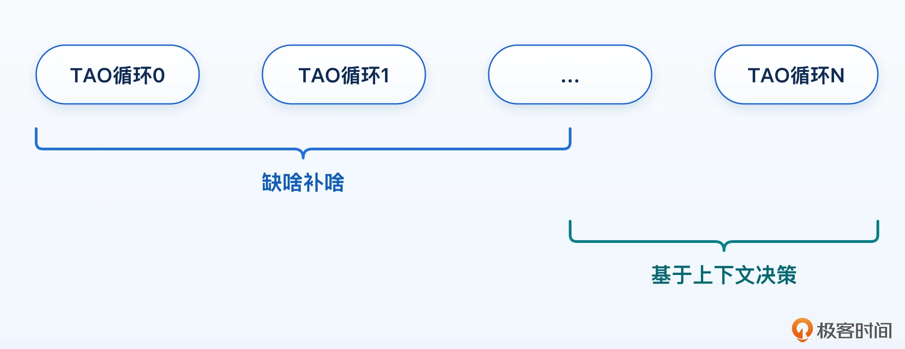
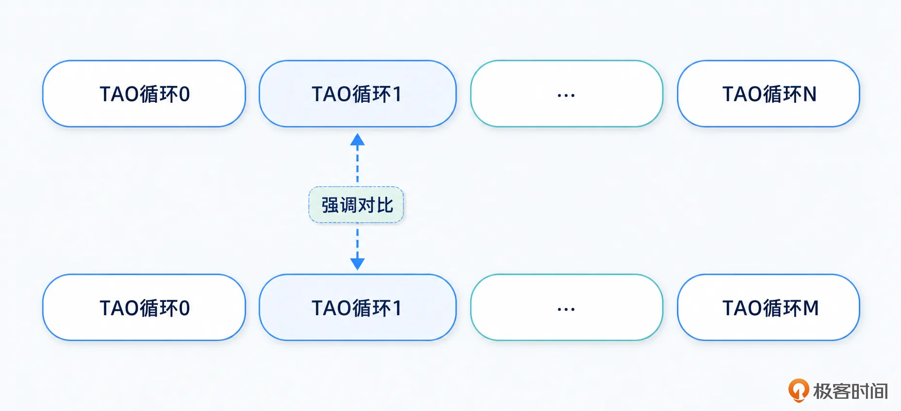
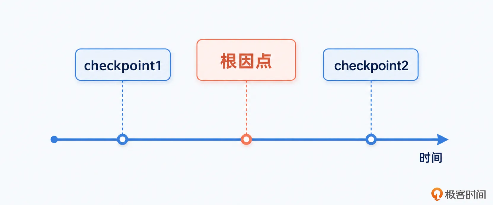
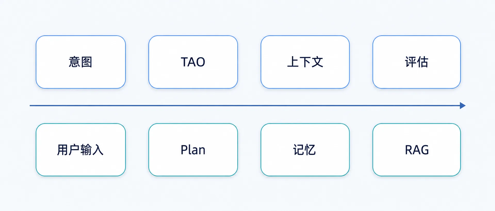
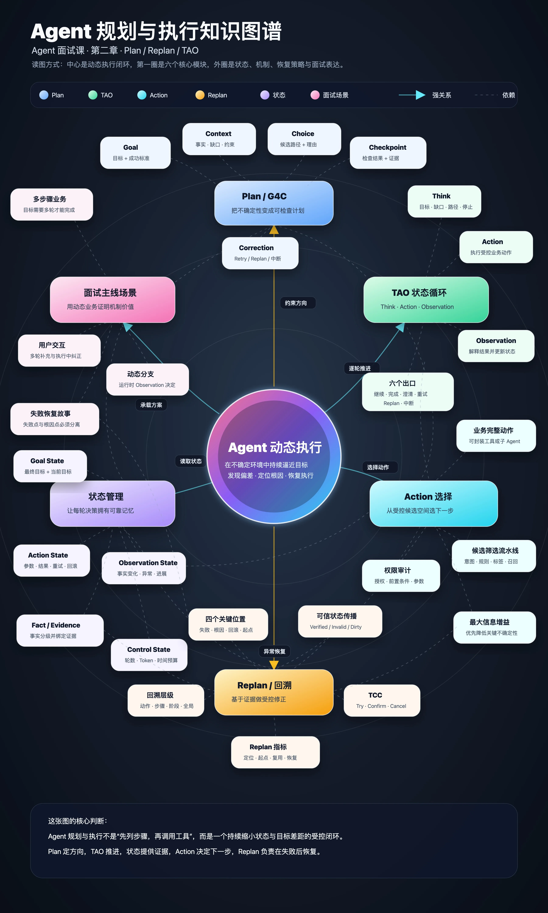

# 10｜面试场景设计：一个复杂的业务场景，就是面试“主线剧情”
你好，我是大明。

今天我们讨论一个非常扎心的话题：你精心准备了一个 Agent 面试项目，为啥看起来总是平平无奇，甚至于很多时候面试官都觉得你的 Agent 项目都不需要什么 ReAct，直接搞一个 workflow 就可以。

在面试中，最好用的一种面试策略，就是你将你想展示、讨论的技术问题都融入到一个非常具体的业务场景里面。那么相应的，这个业务场景就必须是一个足够复杂的业务场景。

下面我就教你怎么设计一个复杂的业务场景，在这个复杂场景中融入 ReAct/Plan 等机制，确保它看起来显得很有挑战性。

## 复杂业务场景

### 多步骤业务场景

首先，这个业务场景必须是经过多个步骤才能解决问题的场景，而且最好是面试官一听到你对场景的整体描述就能想到这里面要分成很多步骤，不然你还需要解释为什么需要多个步骤。

正面例子如商品推荐。目前在电商类的 Agent 里面，商品推荐是一个广泛认同的复杂的业务场景，尤其是在你要深度结合用户画像的情况下。

反面例子如问答。当然你可以说在你的业务场景下，问答要检索非常多的内容，还要结合用户画像、偏好来回答，所以也很复杂。

必须要承认，有你说的这种可能性，不过按照我目前帮人复盘的面试录音来看，一听到问答类的 Agent 功能，大部分面试官会直接带入到 RAG 一次就搞定。

在这个多步骤的基础上，你就可以套入 Plan 或者 TAO。就拿商品推荐来举例，你可以说：

- 第一轮 TAO，发现缺失用户画像，所以先去加载了用户画像

- 第二轮 TAO，发现缺失最近浏览记录、收藏记录等，于是又要去加载这些信息

- ……

- 第 N 轮，发现已经找齐了推荐商品，并且相关性评分不低，于是输出最终结果。

你就按照“缺啥补啥”的话术，构造几个 TAO 循环，而后再引入几个信息补全之后的决策点，比如说在商品推荐里面可以考虑带入一些广告商品等。

### 引入用户交互

缺少用户交互的 Agent 是没有灵魂的，也显示不出你的复杂度。最好用的策略就是引入多轮对话，并且引入用户根据第一轮对话，开启第二轮的细分场景。就前面商品推荐的场景来说，当 Agent 输出第一波推荐的商品之后，可以假设用户回复“我觉得第二条裤子挺好的，但是有点贵，有没有更有性价比的”。

于是你又可以再次讨论 TAO 循环。但是这一轮对话的 TAO 循环会和上一轮对话的 TAO 循环有很大不同，比如说因为第一轮可能已经完成了用户画像的加载，所以这一轮会忽略；又比如这一轮的核心是解析出来目标是围绕第二条裤子推荐更有性价比的产品，这又可以设计性价比的认定规则。

所以要注意侧重描述两轮对话的处理区别，尤其是要突出 Think 决策过程上的差异。这些差异就是体现自主决策中的“自主”两个字，也是你这里能够体现出“用 workflow”解决不了的地方。

这种是每一轮之间的用户交互，还有一些 Agent 是支持在一轮对话还没输出的时候，就允许用户输入一些内容。举个例子来说，你的 Agent 可以先输出一个计划，而后就开始执行计划。在这个过程中用户可能发现你的计划有一些不合理，就会输入纠正指令。此时你的 Agent 应该能够响应这些纠正。

### 补充海量 Action 解决方案

为了让你的 Agent 看起来更加复杂，你还可以增加 Action 的数量。有一个非常简单的话术，保证面试官会追问，那就是你只需要说自己的 Agent 比较复杂，有几百个工具/Action。但是这时候你不要解释怎么解决这么多 Action 带来的问题，你就顺着你的内容继续说。

你提到了这么多工具，他们一定会问：这么多工具，你怎么保证大模型选得对？这时候你就可以用上一讲的内容来解答了。这其实也是我一直强调的，挖坑-反转能够给面试官带来极深的印象，刷一大波分。甚至，你可以说你在这个项目里面，一个比较大的难点就是管理好这些 Action，提高筛选的准确度。

### 补充 Action 权限控制

这主要是为了解决面试热点，因为正如我前面说的，其实落地权限控制并不难，它是一个传统工程的范畴。举个例子，假设现在你有一个敏感操作叫做发起退货退款，但是这个时候你的 Agent 不能直接就发起，而是要引入一个明确的授权、确认过程。

所以你可以说你的 Agent 决定执行退货退款 Action。但是这个 Action 的内部细节，要求用户明确授权、确认，所以这个 Action 会给前端返回一个确认话术，用户确认了才会真的执行这个 Action。我这个例子用的是 Action 内部自己控制权限、审计问题的设计范式， 你也可以改为使用统一的权限控制模块等。

### 补充 Action 执行失败的处理案例

这个作为可选机制，但是我一般建议你加上它，能够体现你是如何处理容错之类的问题。举个例子来说，在商品推荐里面，一个很重要的目标就是获得用户画像中的价格偏好，而且是类目相关的价格偏好。那么你就可以假设这是一个新用户，还没有任何价格偏好。或者虽然有价格偏好，但是是其他类目的价格偏好，比如说电子产品的价格偏好。

于是你就可以补充，在这种场景下，Action 会选择使用兜底的价格策略。还有一些也很好用：

- Action 要调用接口，不管是内部还是外部，你就补充说这个 Action 如果调不通了，你的 Agent 会怎样运作。这本质上可以看做是一种 Agent 降级。

- Action 获得的数据不全，比如部分字段缺失，而后你的 Action 会如何处理。你如果想进一步提高复杂度，你就可以考虑用 TAO 循环来处理这种数据不全的问题。

而且，如果你想进一步提高你的业务场景的复杂度，你可以在这种情况下引入 Replan 和回溯的机制。也就是你的 Agent 会在这种情况下，执行回溯，找到根因，而后 Replan 并执行。

### 准备回溯和 Replan 的内容

这个是可选中的可选，但是如果你能准备好，我觉得能证明你在调教大模型思考方面，有非常强的能力。

准备这方面的内容，你只需要构造好几个点：失败点、根因点、回滚点和Replan起点。我的建议是，失败点和根因点一定要是两个不同的点。也就是说 Agent 看到的错误信息，其实并不是真的根因。从面试效果上来说，这往往能让面试官觉得很“新颖”。

而后你可以再进一步，将根因点和回滚点也设置为不同的点。比如说，你的根因是在 Checkpoint1 之后，但是又不到 Checkpoit 2 的地方，而后你的回滚点就是只能回滚到 Checkpoint1。这样可以进一步强化 Checkpoint 的概念，并且两个点分离听起来同样有新颖的感觉。

举个例子来说，在前面的商品推荐场景里面，Agent 最终推荐了一批商品，但是用户反馈这些商品都不符合自己的预算。

表面上的失败点是：推荐结果不符合预算。但是你经过回溯之后发现，真正的根因不是商品检索 Action 查错了，也不是排序算法有问题，而是更早之前提取用户价格偏好的时候，错误使用了用户购买电子产品的价格偏好，作为服装类目的价格偏好。

那么在这种情况下：

- 失败点：最终推荐结果不符合用户预算；

- 根因点：错误复用了其他类目的价格偏好；

- 回滚点：上一个已经确认用户画像基本信息的 Checkpoint；

- Replan 起点：重新确定服装类目的价格区间；

- 可以复用的结果：用户的品牌偏好、尺码、颜色偏好；

- 需要失效的结果：候选商品、商品排序和最终推荐结果。

你在面试中将这几个点一一讲清楚，效果会非常好。因为这意味着你的 Replan 不是粗暴地将原来的计划丢掉，重新让大模型生成一遍，而是先找出被错误信息污染的状态，再确定哪些结果还能复用，哪些结果需要失效，最后只重新执行受影响的部分。这就叫做受控的 Replan。

你还可以进一步补充，为了避免 Agent 回溯错误，每一个关键中间结果都会记录自己的依赖信息。比如说候选商品依赖于价格偏好、商品类目和品牌偏好，那么价格偏好失效之后，所有依赖于它的结果都会被标记为失效。

### 准备动态路径，而不是固定流程

到这里，你应该已经能够看出来，我前面设计的场景不是一个固定的工作流。当然了，面试官依旧可能会质疑你：你这个不就是几个 if-else，再加一个 workflow 吗？为什么一定要用 ReAct？

这个问题你一定要提前准备。

你真正应该强调的是：你的业务里面存在大量运行时才能确定的决策。还是以商品推荐为例，同样是推荐一条裤子，实际执行路径可能完全不同。

- 如果用户画像完整，并且近期浏览记录非常丰富，那么 Agent 可以直接根据已有信息检索商品。

- 如果用户画像不完整，但是用户愿意交互，那么 Agent 可以先询问预算、场景和品牌偏好。

- 如果用户不愿意继续补充信息，那么 Agent 可以结合历史购买、浏览记录以及同类用户偏好，生成一个保守的候选集。

- 如果商品接口不可用，那么 Agent 可能切换到缓存、备用数据源或者通用搜索工具。

- 如果候选商品都不满足硬约束，那么 Agent 可能需要重新检索，而不是进入排序阶段。

- 如果用户在执行中突然补充“不要某个品牌”，那么 Agent 还要更新约束，并让已经生成的候选商品失效。

你可以注意到，这些分支并不是在任务开始的时候就能完全确定的。Agent 只有执行到某一步，获得新的 Observation 之后，才能决定接下来应该怎么走。这才是使用 TAO/ReAct 的真正理由。

但是你千万记得，身段要软。最后还是可以找补一下“赶着上线，或者初期的时候，用 workflow 落地会很快，也可以考虑”。这就叫进可攻退可守。

## 总结

应当说，这是你 Agent 面试中最重要的一环： **准备好你的复杂业务场景**。

它会是一个基石，你围绕这个复杂业务场景，拼进去你的用户输入规范、意图识别，以及后续我们会说到的上下文管理、记忆管理等内容。就好比，你的复杂业务场景就是主线剧情，你通过这个主线来带出来其它支线。

一方面你准备面试的时候思路会很清晰，另外一方面你面试的时候逻辑性也会显得极佳，特别是如果你表达能力不行，或者容易紧张，那么这个方法更加不容错过。

## 附录

下图是汇总了规划执行这一章节重要知识点的知识图谱，供你回顾复习，另外我也在附件里放置了面试题和案例模版，供你学后自检。（注：附件只能在PC端下载，手机端不支持）

