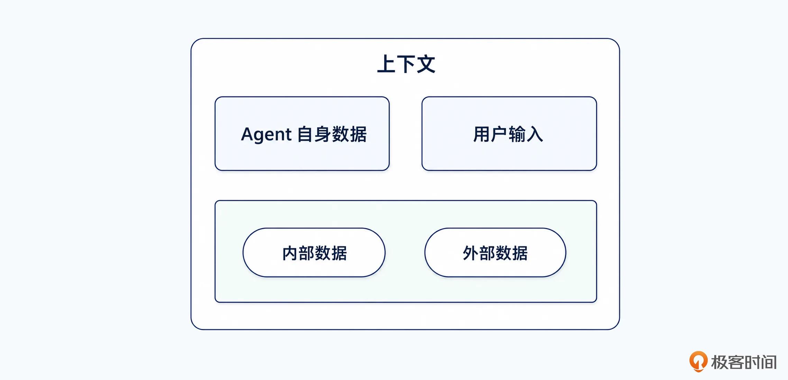
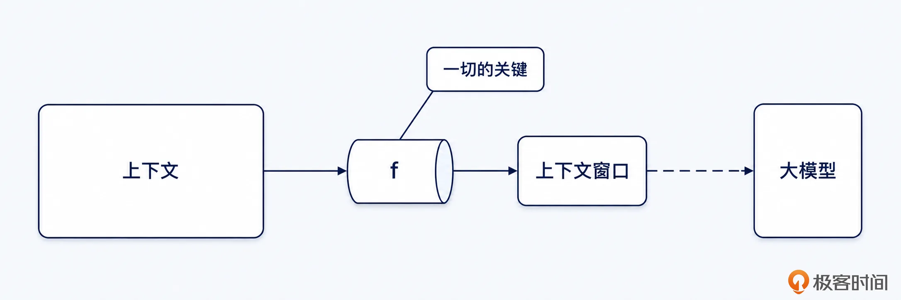
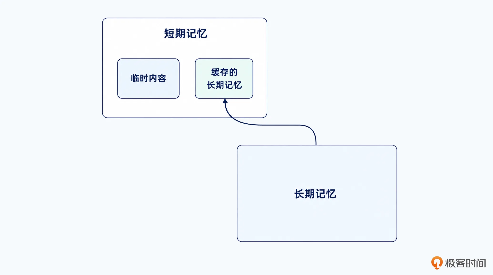
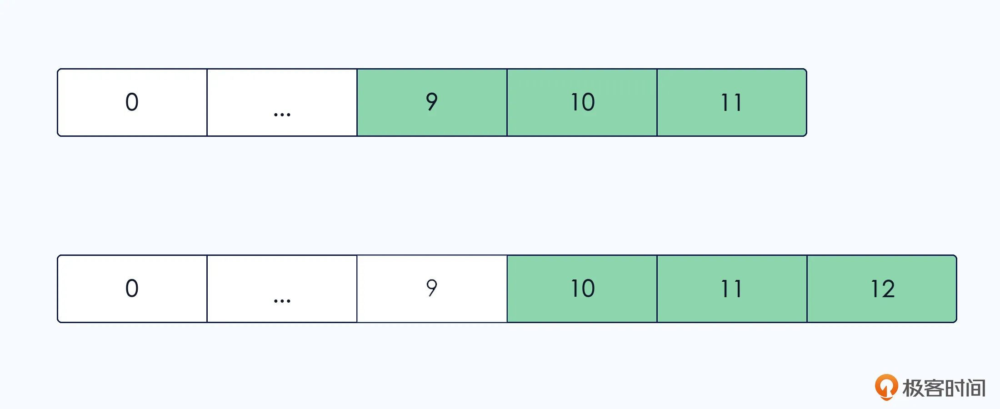
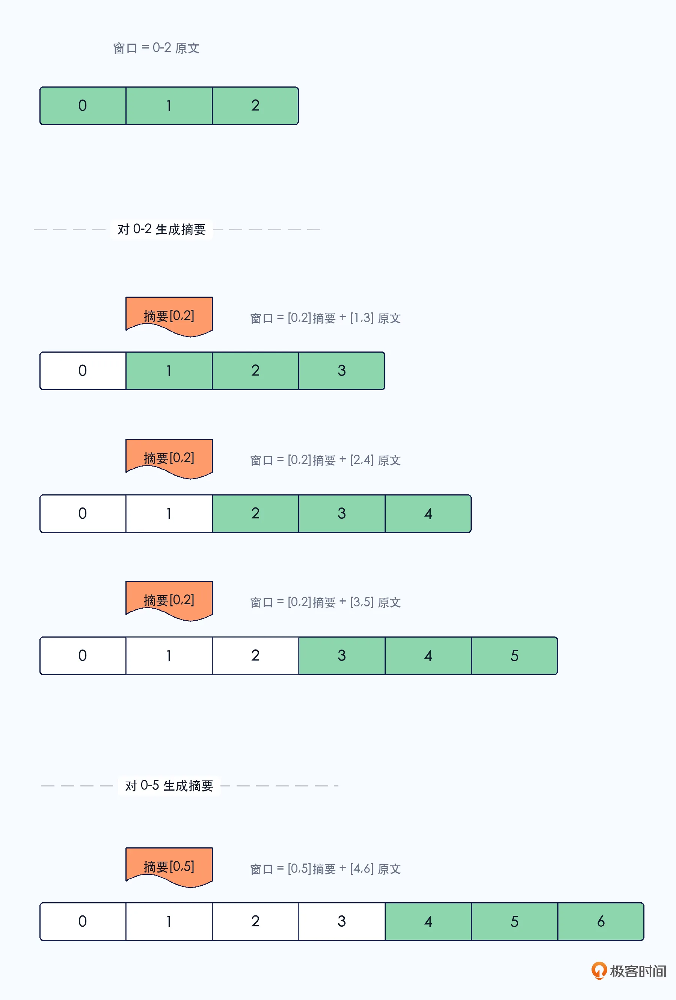
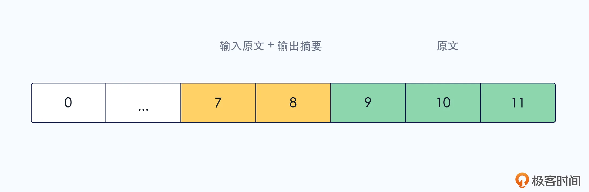
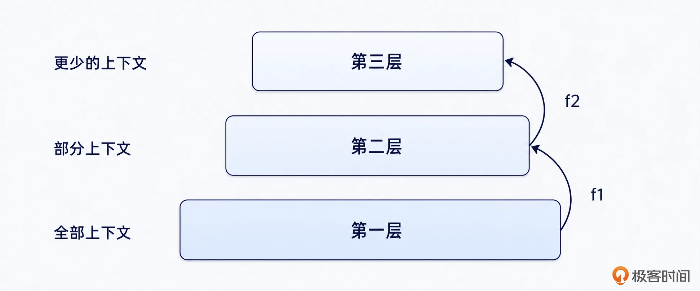

# 11｜Context Window = f(Context) Is All You Need！
你好，我是大明。今天我们开始讨论 Context 这个大主题。

我相信你不管做没做过 Agent 都一定听过记忆管理、用户画像之类的词语，对它们的含义也有一些了解。

所谓记忆管理、用户画像、历史对话、工具结果和任务状态，本质上都只是 Context 从不同来源、不同形态和不同生命周期上进行描述。

而这些复杂的、容易混淆的概念就会让你觉得很困惑，怎么一会有这个一会有那个，而且在不同的 Agent 里面看起来又有一些不同。

那么今天我就要尝试给你建立一个统一的抽象，让你摒弃那些乱七八糟的概念，只留下最为纯粹的 Context 概念。

下一讲我们会深入讨论 Context 的管理。

## 前置知识

#### Context：Agent 当前可获得的全部信息空间

记住，我说上下文的时候，就是指围绕 Agent 的整个信息空间。或者说， **Context 是指 Agent 当前可获得的全部信息空间**。



如图，在这里Context 不等于已经塞进 Prompt 的内容，总的来说它的数据来源可以分成四块：

- **用户输入数据**：比如说用户提供的各种 Excel 数据，PDF 文档等。

- **Agent 本身产生的**：包括各种提示词，以及大模型的输入输出，针对这些输入输出的解读、处理产生的中间结果等。

- **内部数据**：重点是各种来自别的业务系统产生的数据，可以是通过接口调用获得数据，也可以是直接绕开业务系统直接访问 MySQL、ES 等获得的数据。

- **外部数据**：主要是指和公司外的系统打交道获得数据，比如说调用外部接口、工具、MCP 之类获得数据。


我们还可以从存储和时效的角度讨论 Context。

从存储的角度来说，一份数据可以存储在内存、缓存、数据库等任何存储介质中，甚至会存储多份。比如说用户画像这种东西，多半在 MySQL 中有一份，Redis 中还缓存着一份（这一份也被看做是所谓的 Session Memory 的一部分）。

从时效的角度来说，有只作用于这一轮对话的 Context，也有只作用于这一个多轮对话的 Context，还有一些像缓存一样可能是一周有效也可能是一个月有效的 Context。

简单来说，就是 **万物皆 Context。**

#### Context Window：当前调用真正交给模型的工作集

Context Window（上下文窗口）是从全部 Context 中 **筛选、压缩、排序** 后得到的模型可见内容。可以将它类比为运行时工作集：Context 是仓库，Context Window 是当前工作台，仓库里面有很多东西，但当前工作台只应该放现在用得上的东西。

由此得到标题中的表达：Context Window = f(Context)。实际上这就揭示了 Agent 工程的核心：找准内容，放进Context Window，传递给大模型。



#### Memory：部分 Context 的别名

那么在前面两个概念的基础上，怎么理解记忆这个概念呢？我认为就是一部分 Context 的别名而已。它是一种拟人化描述，针对的是大模型没有状态这个问题。

以多轮对话为例，和 Memory 有关的高频话题有：

- 短期记忆/Session Memory：也就是和发起的这个多轮对话有关的记忆

- 长期记忆/Persist Memory：在多轮对话进行中需要保存下来、持久化的记忆


所以你可以将 Memory 看做是多轮对话/Agent 本身产生的数据。而所谓的短期记忆和长期记忆，无非就是短时间内要用的记忆，和长期保存的记忆。

注意的是，短期记忆分成两个部分：一个是临时数据，用完就丢，完全不需要保存的；另外一个部分可以看做是长期记忆的缓存。如图：



所以，我的观点就是：从 Agent 运行时的视角来看，Memory 是一个没有必要被过度神化的概念。

Memory 在面试中是一个不占优势的概念。一旦你思考怎么做好 Memory，就意味着你放弃了更加底层更加抽象的 Context 概念，从而陷入一种一叶障目不见泰山的境地。

举一个例子，我在给小伙伴讲用户画像的时候，经常说用户画像会被持久化在 MySQL 中，有时候又会说把 Redis 里面的用户画像塞进 Prompt 里面。那么小伙伴就会很困惑，这个用户画像究竟存在哪里？

那么实际上就是放在 MySQL，但是在 Agent 运行的时候会被缓存到 Redis，构成它的 Session Memory。每次我换到缓存这种描述方式，小伙伴就能立刻理解。

当然你还是可以继续使用 Memory 这个概念，毫无问题，但是你要知道 Memory 并不是本质，本质就只有 Context。

### Context 分类

你在面试中可能会碰到 Context 分类的问题，所以这里我给你分一分，怕后面你遇到了面试题不知道说的是什么。原本这些分类只是我们在交流的过程中为了方便，而后根据用途、作用范围而划分出来的。后续慢慢就有面试官用来面试了。正所谓，实际上本来没有八股文，面试多了就有了八股文。

- **Instruction Context：指令上下文**，包含了 System Prompt、业务 Spec、行业标准等内容，核心是用来限定 Agent 应该怎么思考、能做什么、不能做什么。

- **Goal Context：目标上下文**，包含了用户最终目标、当前子目标等，它是一把标尺，用来衡量你后续的所有步骤。

- **User Context：用户上下文**，包含了用户画像、历史决策等，它是你的 Agent 是否“懂我”的关键点。

- **Task Context：任务上下文**，包含了当前任务、执行步骤等，它用来记录你的 Agent 曾经、现在、未来做了什么。

- **Tool Context：工具上下文**，包含了工具输入、输出等，它记录了工具调用的相关信息，一般历史工具调用也出现在这里。

- **Constraint Context：约束上下文**，包含了硬约束、软约束等，它清晰定义了 Agent 的运行边界。

- ...


很显然，我没有办法列出来所有的不同的分类，这些所有的分类其实就是一种组织方式而已。

### Context 解释万物

这时候你可以统一看待前面已经讲过的内容：

- 第一讲里，用户输入规范：需要结合 Context，比如说典型的代词消解的问题，就是需要分析上下文的内容才可以判断出来。或者描述为 **基于 Context 重建用户当前真正表达的完整语义**。

- 第二讲和第三讲里意图识别：很显然，意图识别是分类，但是也不仅仅是分类，它直接决定了 Agent 后面会如何使用这些繁杂的上下文，或者说 **意图识别的产物，不应该只有 intent，还应该包含一份 Context Requirement**。

- 第二章里，Plan 和 Replan：Replan 之所以发生，基本上都是因为 Context 的变化超出了 Plan 的预期。所以本质上 Replan 就是 **对** **Context 发生变化后的受控修正**。


如果粗暴地归纳为：一切问题的根源都在 Context，那么 **Agent 就可以描述为一个在 Context 中变化的状态机**。

## 基础方案

### Context Item：一种统一抽象

这里我提供一个我日常使用的一种比较好的抽象，你可以在这个基础上进行修改、扩展字段、减少字段等，以适配自己的 Agent。先给出基础的 Context Item 的定义：

```
{
  "id": "ctx_001",
  "type": "constraint",
  "content": "不能修改 A 接口",
  "source": "user",
  "scope": "current_task",
  "authority": "high",
  "confidence": 1.0,
  "created_at": "...",
  "expires_at": null,
  "priority": 100,
  "token_cost": 8,
  "version": 2
}
```

- source：信息从哪里来，比如说在上面是 source='user'，也就是这个是源自用户表达的一种约束。大部分时候，简单的做法就是让 source 复用 role 的枚举值。

- scope：它在哪个范围内有效，常见的范围包括当前步骤、当前任务、当前会话、当前项目、当前用户、全局等。你完全可以根据自己的业务来设计不同的范围，比如说在 toB 的产品里面会额外引入所在部门、所在公司等，在 toC 的情感社交类会引入当前家庭、当前聊天等（想象一下如果你是时间管理大师，你会非常需要的）。

- authority：权威程度，这个其实是稍微有点冗余的字段，它看上去和 confidence 有一些重合，主要用在冲突仲裁中。你可以参考这个定义：系统规则 > 用户明确输入 > 工具事实 > 已确认摘要 > 模型推测。

- confidence：可信度，我觉得在小型 Agent 里面，confidence 和 authority 可以只使用一个。比如说你可以将系统规则定义为可信度 1，用户明确输入定义到 0.99，这么一来你就只需要 authoriry 了。

- ttl / expires\_at：什么时候过期。这是很多人设计的时候会忽略的一个问题，不同的内容有效期是不同的，比如说用户偏好有效期是很久的，而你查询到的天气等信息有效期就明显短很多。

- token\_cost：注入成本，一般没啥大用，但是如果你后续要使用动态组装上下文窗口之类的机制的时候，这个就很有用了，可以借助来评估窗口已经用了多少，还剩下多少可用，进一步决策你还能把什么东西放入到窗口中，压缩的算法选择等。


关于 authority 我额外提及一点，就是某些时候你也并不能完全相信用户的说辞，因为他可能说错了。因此在 authority 上可能要进一步区分观点和事实。当用户描述的是观点的时候，尊重并且给予很重要的权重，无须分辨他的观点的对错。

而如果是事实，你在 Replan 阶段或者执行不下去的时候可以尝试检查一下用户描述的事实是否正确。

### Context Item 要考虑的问题

这既是一个实践中的指导，也是一个面试中的指导。针对每一个 Context Item，你都要考虑：

- **怎么获得它**：比如说用户画像，你怎么获得？又比如说我天天强调的硬约束，你怎么获得？

- **怎么存储它**：第一个问题是要不要持久化，第二个问题则是考虑要不要缓存到 Redis 中。如果这个 Item 数据比较特殊，你还要考虑用什么数据类型、数据结构来存储。

- **怎么查询它** **：** 注意和获得它做区分，这一步强调的是怎么从存储的地方检索出来，和这个概念强相关的就是细节召回，这部分我们后面会讨论。


### Context Window = f(Context)，f 是什么

看到标题 Context Window = f(Context) 的时候你是不是还在纳闷，f 是什么，以及在 Agent 构建过程中怎么定义 f。

这里我可以直接给出最复杂的流水线的描述：

```
Window=Inject(Order(Compress(Select(Retrieve(Context)))))
```

- Retrieve：找出可能相关的 Context；

- Select：选择当前真正需要的内容；

- Compress：压缩到合适的粒度；

- Order：决定内容的排列顺序；

- Inject：以合适的结构注入大模型。


其实 Retrieve 和 Select 从语义上来说有一点重叠。不过也可以认为 Retrieve 更加强调的是检索出来的可能的 Context 内容，而 Select 则是找出真正相关的内容。

当然，你在面试中可以直接将两个合并在一起，相当于表达一个从一大堆的 Context 里面挑出精确的需要的内容，而后经过压缩、排序，最终注入到 Prompt 里面，传递给大模型。

### 滑动窗口算法

现在我来给你讲讲最基础的函数 f 的设计方案，也是一个面试热点：滑动窗口算法。你可能会觉得有点奇怪：滑动窗口算法不是用来做限流的吗？怎么 Agent 的上下文管理里面也有了呢？

其实滑动窗口算法是一种思想，它可以用在很多地方。当用在管理上下文内容的时候，是指窗口只保留最近一段上下文，旧的上下文随着对话推进逐渐被挤出去。比如说用户和 Agent 已经聊了 100 轮，但是当前模型窗口只能放 20 轮，那么系统就只保留最近 20 轮对话。

这就是最朴素的滑动窗口，优点简直太多了：

- 实现简单；

- 性能稳定；

- 不需要复杂检索；

- 近期上下文通常最相关；

- 对多轮对话有基础支持；

- 容易控制 Token 成本。


如果是在实践中，直接无脑用滑动窗口算法就可以。通常来说，滑动窗口实现起来有两种方式，都是跟窗口大小的计量单位有关：一是按照轮次来计算，比如前面说的窗口放 20 轮对话；二是按照 Token 来计算，比如说 64K 窗口。

下面我用按照轮次来计算，讲解这个算法。假设现在保留 3 轮，那么窗口内放置的就是 3 轮对话内容，随着轮次进行，窗口也不断向前滑动。如图：



那么问题来了，不在窗口内的对话内容怎么办？

靠摘要和细节召回。在上面的例子里面，如果要生成摘要，就会有一个问题：什么时候以及如何生成摘要？你可以看这个更加复杂的例子：



上面的图回答了几个问题：

- 每隔 N 轮生成一次摘要，N = 窗口大小。

- 有两个生成时机可选：即时生成——在第 `K*N` 轮（即本轮最后一批）结束时立刻生成；延迟生成——等到下一轮（即第 `K*N+1` 轮）开始时，再回过头来生成。


那么摘要如何生成呢？这个比较复杂，现在你可以先理解为调用大模型，让大模型帮你生成摘要，你要做的、能做的就是提供一些摘要的规则，也就是描述什么保留什么不保留。后面会有专门的一讲讨论摘要和细节召回。

这种按照轮次的计算方式，面试官很有可能追问的就是，你的窗口可能连 3 轮都放不下。所以每一轮你都要加一个约束：

- 限制用户的最大输入，假设是 X

- 限制大模型的最大输出，假设是 Y


那么每一轮最多就是 X + Y 个 token，N 轮就是 N \* (X+Y)。而且在实践中，最大输入和最大输出都是要限制的，你不需要做什么额外的事情。

接下来我再介绍一个变种算法，这个变种算法你同样可以用作高级方案。

#### 变种滑动窗口算法

这个变种算法非常简单，就是我们窗口里面放两大块内容：

- 近 N 轮对话，直接放原文；

- 近 \[N+1, N + M\] 轮对话，用户输入放原文，但是模型输出放摘要。




上图的 N = 3，M = 2。

这种思路的核心就在于：用户输入很多时候都很短，但是模型输出一般都很长，所以用户输入可以保持原文，模型输出要做摘要。

那么面试官就有可能从两个角度提出质疑：

- 用户输入很长，比如说粘贴了一大堆的堆栈。你就不能继续保持原文，而是同样可以考虑引入摘要机制。

- 大模型输出很短，显然这种情况你完全可以直接放原文。


你要放开脑洞，我说模型输出放摘要，并不意味着只能放摘要。你可以考虑在这里结合后面要讲的分层上下文，或者结合我后面章节提到的大模型可读摘要算法，这样面试中就会取得 1+1 > 2 的效果。

还有一个更加复杂的设计，就是 N 和 M 都动态调整，也就是如果剩余窗口大，你就让 N 和 M 大一点；如果剩余窗口比较小，那么你就让 N 和 M 小一点。

这里也有一些注意事项有助于你构建一个更加优质的滑动窗口算法：

- 滑动窗口并不是让你占满整个窗口，你要给其它内容留出窗口。比如说 128K 的总窗口，你的滑动窗口可能要被限制在 32K，而后剩余的留出来给摘要、提示词、输出等。

- 前面都说窗口内放的是对话内容，也就是用户直接输入的和直接看到的内容。但是你不必墨守成规，你完全可以把对话内的一些关键点、中间产物也放进去。

- 滑动窗口有一个致命的问题：最近的上下文，不一定是最重要的上下文，也不一定是最相关的上下文。如果你在实践中遇到了滑动窗口效果不好的问题，那么记得排查这个问题。


## 高级方案：分层上下文

不管是在面试中，还是在公司技术交流中，你一定会听到过“分层上下文”或者“分层记忆系统”之类的说法。那当然了，很多著名的 Agent 都有各种各样的分层设计，听起来花里胡哨的。

但是其实你可以站在一个非常统一的角度去看待这些分层，如图：



上图就是一个统一的抽象，你可以往上加更多的层次。而后，里面最关键的就是 f1 和 f2。它们可以看做是一种映射关系，也就是说你只要按照一定的规律、规则、偏好，从下一层的上下文里面挑选出上一层上下文的内容。你多准备几个 f，就组成了独属于你的分层上下文。你也可以称之为分层记忆，本质没有区别。

不同层次之间的映射也可以表达为：


先来看一些不同的分层方式，需要注意的是你可以混用。此外，我希望你在实践中有困惑的时候可以再回来看这些表格，它们从不同的角度描述了数据的组织方式。

#### 按照生命周期分层

层级

主要内容（举例）

生命周期

工作上下文

当前输入、当前步骤、刚刚获得的工具结果

一次或几次模型调用

会话上下文

当前对话目标、最近历史、当前约束

当前会话

长期上下文

稳定用户画像、长期偏好、已确认事实

跨会话

归档上下文

完整历史、原始记录、低频证据

长期保存，按需召回

这种设计比较普通，不过面试的时候面试官比较容易理解。

#### 按照作用范围分层

层级

主要内容（举例）

作用范围

步骤级 Context

当前工具调用参数、当前搜索 Query

只对当前步骤有效。

阶段级 Context

信息收集阶段收集到的内容

在一组相关步骤内有效。

任务级 Context

任务目标、成功标准、任务约束

在整个任务执行期间有效

会话级 Context

最近讨论的话题、当前语言和表达风格

在当前对话中有效

用户级 Context

用户长期画像、用户稳定偏好

跨多个任务、多个会话复用

系统级 Context

业务规范、全局工具说明、权限策略

对所有用户、所有任务有效

#### 按照信息形态分层

层级

主要内容（举例）

信息形态

原始层

完整用户输入、完整对话消息

保存完整原始内容

结构化事实层

取决于你的结构设计

从原始内容中抽取稳定事实

摘要层

取决于你如何生成摘要

摘要用于保留整体语义和过程

索引层

取决于你如何设计索引，比如哈希结构

索引层不保存具体内容，只保存“去哪里找”，它的意义是降低常驻 Context 的体积

#### 按照权威性分层

层级

主要内容（举例）

使用策略

强规则层

系统规则、安全规则、权限限制

不允许被低层覆盖

已确认事实层

用户确认、权威系统查询结果

可作为决策依据

有证据推断层

基于多个证据推导的结论

可使用，但需保留证据

待确认假设层

模型推测、临时假设

不得当成事实

已否定层

用户否认、验证失败的信息

禁止继续使用

#### 按照冷热程度分层

层级

主要内容（举例）

描述

热 Context

当前任务状态、当前 Goal

频繁使用，通常直接放在内存或者 Redis 中

温 Context

当前会话早期内容、用户历史任务

偶尔使用，需要检索

冷 Context

完整历史消息、过期工具结果

低频使用，主要用于归档、追溯和重新分析

前面的这些分层方式，其实通用性非常强，你在面试中直接用完全没有问题。或者你也可以认为说，它们其实就是换了一个角度来描述已有的 Context 内容。

你还可以把这些分层方式排列组合一下。比如说你说先按冷热程度分，而后在热 Context 里面进一步按照权威性的分。另外，你也找找自己的业务上的 Context 有没有什么有特色的点，而后按照这些有特色的点来设计层次，比如说按照权限来分，分为普通员工能看到的，管理层能看到的，超级管理层能看到的这种。总之就是结合业务特点找一个，面试就够用了。

## 总结

这节课的核心就是：Context Window = f(Context) ，除此以外的其它概念都是建立在 Context 上的。后半段，我提出了各种分层的方式，其实主要是因为现在很多有名气的 Agent 都是采用类似的设计。而思想的本质是不变，所有的分层都是分而治之思想的体现。

最后我给你讲一个笑话，放松一下。如果你要是炒股的话就能听懂我的话。当下既是 CWW（存为王，存储为王）的时代，也是 CWW（Context 为王）的时代。正如所有股票都会跌，那么将来 Context 会不会被抛弃呢？我觉得也是有可能的，那会儿记得来找我学下一个时代热点的面试专栏（😬）。

## 思考题

最后有一个思考题，我提到分层是分而治之，这种方法主要是为了解决复杂度太大的问题。那么你将 Context 看做一个复杂无比的系统，那么除了分层思想，还有哪些传统工程思想也可以用在治理 Context 上？欢迎你把自己的思考分享到留言区，和我一起交流讨论，也欢迎你把这节课的内容分享给需要的朋友，我们下节课再见！