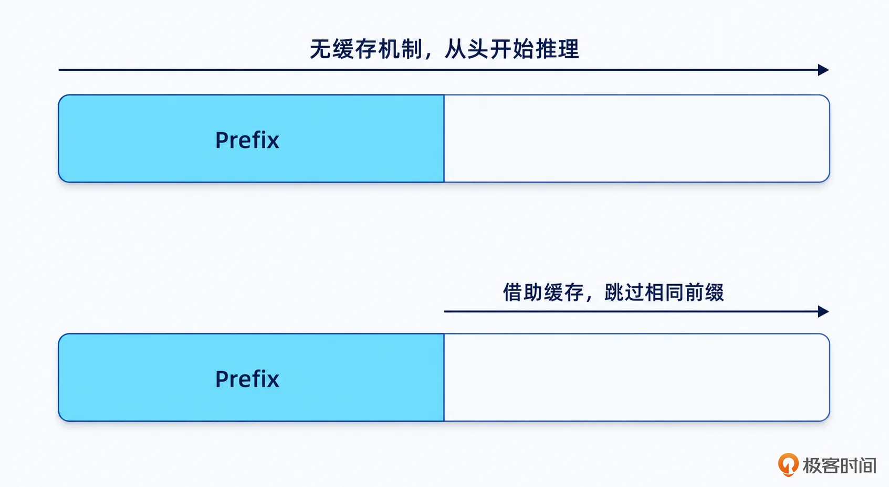
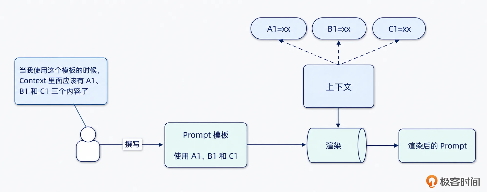
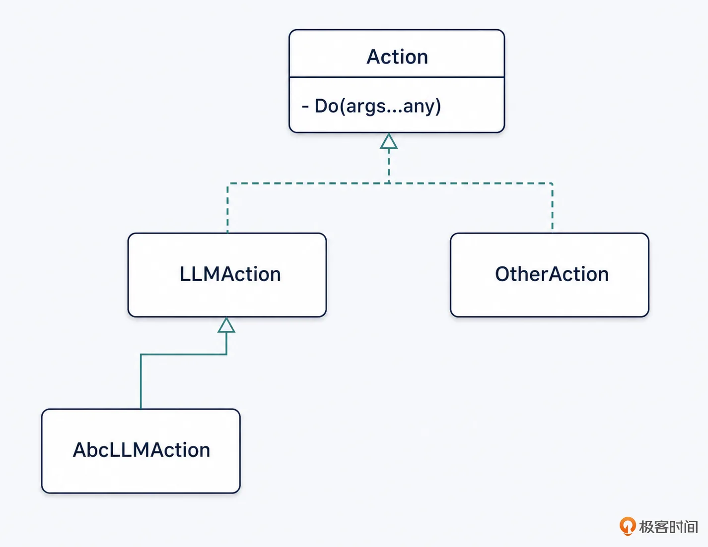
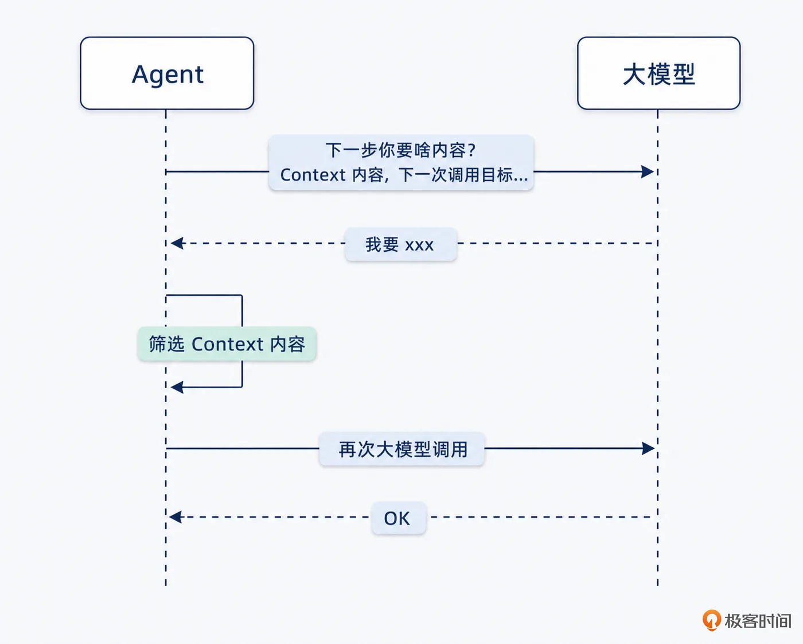
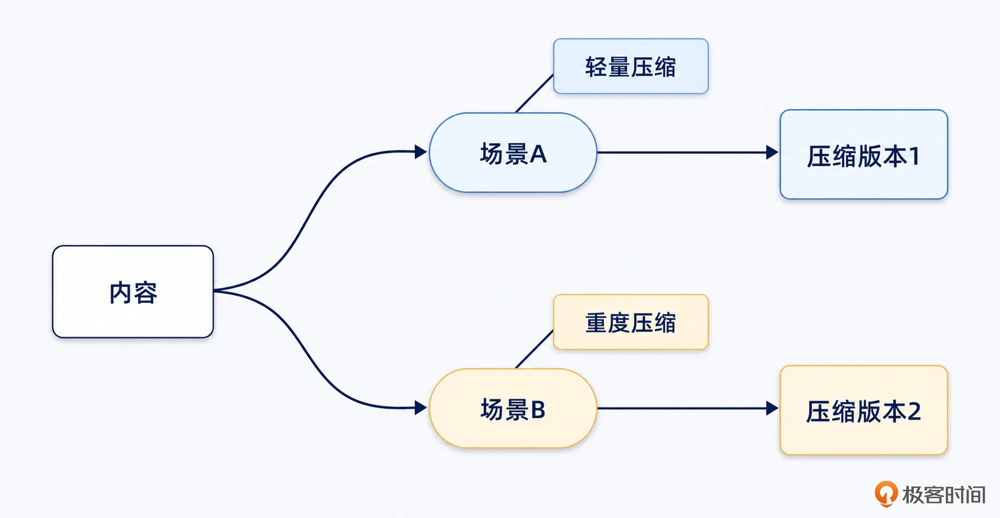

# 12｜上下文窗口：怎么设计一个动态编排的 Context 策略？
你好，我是大明，今天我们继续讨论 Context 和 Context Window。

上一讲我们只是构建了一个基本的 Context 的抽象，讨论了滑动窗口算法，并且进一步讨论了怎么对 Context 进行分层。

这一讲我们要进一步深入讨论 f 的具体算法，也就是讨论什么东西应该放进大模型窗口，传递给大模型；哪些不需要。

在这些内容的基础上，我会引入一个动态编排的机制，它会给你塑造一个基本的框架，允许你参考这个框架设计不同的窗口编排算法。面试中用起来效果极佳，不可错过。下面我们先来学习一点基础知识。

## Prompt Prefix Cache

这是大模型里面的一个赫赫有名的机制，叫做 Prefix Cache。

你可以直接类比到 SQL 层面上的前缀索引。也就是说，如果你的 Prompt 的前缀部分是一样的，那么它就可以利用之前推理的缓存，快速推理下去。相当于这部分相同的内容就不需要从 0 开始推理了。

下图是一个不太严谨的示例，但是能够帮助你理解。



## 基础方案

这个基础方案，有一个很不错的名字，叫做 Context Compiler。这个方案不是单纯拼 Prompt，而是带有明显的工程化意味，而且 Compiler 这个词一听就非常高级。

整体抽象可以看作是这样：

```
Window_t =
Inject(
  Order(
    Compress(
      Select(AllContext_t),
    )
  )
)
```

而后，你可以将 AllContext\_t 扩展一下，也就是引入额外两个参数，看起来会更加清晰：

```
Window_t =
Inject(
  Order(
    Compress(
      Select(AllContext_t, TaskState_t),
      TokenBudget_t
    )
  )
)
```

- AllContext\_t 是当前系统里所有可用的 Context，包括用户输入、历史对话、用户画像、工具结果、检索结果、任务状态、Plan 状态、约束等等。

- TaskState\_t 是当前任务状态，也就是当前 Agent 正在做什么，处于哪一个步骤，目标是什么，已经执行到哪里，还缺什么。

- TokenBudget\_t 是当前可用的 Token 预算。


最终得到的 Window\_t，才是真正传给大模型的上下文窗口。

换句话来说，上下文窗口是上下文经过选择（Select）、压缩（Compress）、排序（Order）、注入（Inject）得到的产物。

### 筛选 Select：当前步骤到底需要什么 Context

筛选也是讲究技巧的，最直接的想法就是站在整个任务的角度来选上下文。

比如说在商品推荐的时候，用户说“帮我推荐一个 8000 块的电脑”。那么很自然的想法就是将用户画像、预算、商品库、笔记本参数、品牌偏好、历史购买记录、评价数据等一股脑放入窗口里面，传递给大模型。

这种想法有没有效果呢？那肯定是有效果的，但是只有一点点。

一方面是大模型得自己去决定哪些信息能用、哪些信息不能用；另外一方面，不同的步骤需要的内容其实是不同的，全部丢过去也浪费 token，还影响大模型效果。

核心在于，每个阶段、每个步骤需要的内容不同。因此筛选的关键就是在 **一大堆的上下文里面找出当前这一次调用大模型真正需要的内容**，所谓“弱水三千，只取一瓢”。

主流的筛选机制有三种，强规则筛选、检索召回和模型筛选，你可以独立使用也可以混合使用。

#### 强规则筛选

也就是 **在 Prompt 模板、代码层面上就直接能决定放入什么不放入什么**。当然，你也可以考虑使用一些规则引擎之类的机制，比如说符合某个条件的大模型调用就需要带上什么内容，又或者借助标签之类的机制。

这里我简单解释一下 Prompt 模板是怎么运作的。它的原理非常简单，就是在写 Prompt 的时候，里面留下一些占位符，这些占位符就对应了 Context 里面的一些内容。过程类似于：



比如说我以前用 Go 来渲染 Prompt 的时候，写出来的模板就类似这样：

```
# 用户画像
{{ .UserProfile}}

# 用户输入
{{ .Input }}
```

它有一个隐含的前提，就是当 **真正发起调用的时候，Context 里面一定有 UserProfile 和 Input 两个字段**。至于Context 是怎么获得这些字段的，它可以是前面步骤工具调用之后被放入到 Context 里面的，也可以完全不关心是哪里来的。

另外一个需要解释的就是代码直接写死大模型调用需要的各种上下文内容。这也是我非常喜欢的一种做法，它在处理复杂的大模型调用上有非常大的优势。



如上图的 AbcLLMAction 就是对 LLMAction 的二次封装，在 Java 里面可以表现为继承，在 Go 里面可以表现为组合，也可以用装饰器这个设计模式来实现。

AbcLLMAction 它的内部代码会自己决定从 Context 里面获取哪些字段，而且怎么放进 Prompt 里面，伪代码：

```
func(a AbcLLMAction) buildPrompt(ctx agent.Context, args...any) {
    res := "我要开始拼接 Prompt 了"
    val1 := ctx.Get("key1")
    res += "xxx" + val1
    // ...
    return res
}
```

这种做法在实践中很好用，唯独在面试中不太好用。

#### 检索召回

检索召回非常好理解，就是根据当前要发起大模型调用的目标，去向量数据库、ES、甚至于数据库等存储里面找到相关的内容，放入到 Prompt 中。

检索召回可以参考 RAG 机制，也同样有查找、过滤、重排序等问题。

#### 大模型筛选

它的基本思路就是在真的发起调用之前，先调用一次大模型，看看需要什么 Context 的内容。而后再发起真正的大模型调用。这两次之间的大模型可以是同一个，也可以是不同的大模型。比如说第一次大模型调用我倾向于使用 flash、mini 之类的大模型，快速返回结果。

整个过程如图：



总的来说，这种做法不太常见，因为两次大模型调用成本高、性能差。

### 压缩 Cmpress

有些时候，如果你筛选的内容比较少，那么可以全部放入到窗口内。但是大部分时候，你的窗口总是不够用的。所以你需要考虑的就是压缩，将一段长的内容压缩成一段短的内容。

这个过程中要考虑的问题是：

- 选出来的这些内容，哪些需要压缩？

- 压缩的时候，压缩到什么地步？


我认为是否压缩取决于 Context 内容的重要性和剩余窗口大小。整体原则就是：越重要的内容越不能压缩，即便真要压缩，那么压缩程度也应该尽可能低；剩余窗口越大，越不需要压缩。当剩余窗口变小之后，压缩的程度可以升高。

如图：


也就是说，压缩它不是一个静态、固定的机制，每次需要压缩的时候就调用一下。而是说， **要根据实时情况来决定压缩策略**。

更进一步，即便是同一个内容，同样的重要程度和同样的剩余窗口大小，但是因为调用大模型的目标有差异，也可以采用不同的压缩策略。

比如在决定压缩用户画像的时候，如果此时是在商品推荐任务中，那么只能简单压缩一下；而如果是在售后服务中，就可以极度压缩一下，毕竟你退款退货跟你的用户画像就没啥关系了。



另外一种做法是在 Context 里面直接保留多个不同的压缩版本，在不同的场景下直接使用，而不是每次要用的时候再去压缩。下面是一个例子：

- L0：一句话摘要

- L1：关键结论摘要

- L2：结构化事实

- L3：详细摘要

- L4：完整原文


这种动态压缩策略的关键点在于为同一份信息 **准备多个精度版本，按需加载**。而且因为提前压缩好了，所以在运行过程中没有任何的额外压缩的开销。

当然在面试中你可以随便搞几个层级，讲述你的压缩策略、压缩层级。

### 排序

首先要明确一点，大模型现在还处于一种“炼丹”状态。也就是同样的内容，排序不同，大模型回复的内容也会不同。

通常来说，越是重要的内容越是要靠前。比如一种常见的错误就是没有从用户输入中提取出硬约束，结合用户输入在整体输入中的排序比较靠后，导致用户输入中的约束被淹没在别的内容中。

这里我给出一个参考排序，针对的是之前的内容里面讨论过的各种 Context 内容。仅作为参考，出问题了记得调整顺序。

```
1. System / Spec
2. 当前 Goal
3. 硬约束
4. 当前任务状态 / Plan 节点
5. 已确认关键事实
6. 当前步骤需要的 Evidence
7. 工具 Observation
8. 候选 Action / Tool
9. 动态 few-shot
10. 历史摘要
11. 补充背景
```

这个顺序的设计原则是，越重要的内容越往前放。如果你对这些内容的重要性认知和我不同，那么可以考虑调整顺序。

此外上面的这个顺序对缓存不是很友好。比如说已确认的关键事实其实修改的时候并不多，所以可以考虑放到 3 后面，这样可以更好地命中缓存。

这也是在考虑顺序的另外一个关键因素：缓存，或者说 Prompt Cache/Prefix Cache，你已经在前面的基础知识里面看过了。

## 高级方案：基于剩余窗口大小调整 Context 内容

刚刚我们讨论了上下文的筛选、压缩和排序了。但如果你真的做过复杂 Agent，你会发现有一个问题更加棘手： **窗口永远不够用**。

这时候你可能会疑问，百万窗口都不够用吗？

在复杂 Agent 里面，还真不够用。而且你忽略了一点，你不是每时每刻用的都是百万窗口的大模型。

所以你会面临窗口不够用的问题，这个时候你的窗口大小管理就不能太死板了。我更加推荐一种高端的管理方式： **根据剩余上下文窗口大小，动态决定哪些 Context 原样放入，哪些 Context 压缩后放入，哪些 Context 只放索引，哪些 Context 暂时不放，等需要的时候再召回**。

### 本质：预算分配问题

你可以把上下文窗口看成一个预算池。假设当前模型最多支持 32K Token，系统提示词、输出预留、工具参数等已经占了一部分，那么真正能用于放 Context 的空间可能只有 20K。

你现在就不能把所有相关的内容都放进去，因为塞不下，所以这里你要问自己一个问题：

- 哪些内容必须原样放？

- 哪些内容可以结构化压缩？

- 哪些内容只放摘要？

- 哪些内容只放索引？

- 哪些内容完全不放？

- 哪些内容要等模型发现缺失后再检索？


### 第一层：必须原样放入的内容

不管剩余窗口有多小，有些内容都应该尽量原样保留。这一类 Context 内容的特点是：一旦被压缩、改写、遗漏，就可能导致严重错误。

比如说最典型的最新用户输入。当然在上下文空间足够的时候，不管是不是最新的用户输入，我都建议你原样保留。只有窗口不够，或者用户输入的内容太长，才需要考虑压缩等。

除此以外，还有硬约束、已确定关键事实、Plan 和 Plan 执行状态这些都要原样放。你在实践中可以根据自己 Agent 相对应的业务特点来进一步决定什么东西一定要原样放。

注意，你不需要在 Agent 设计之初就明确什么必须原样不懂，而是可以在迭代的过程中动态决定。

### 第二层：根据窗口大小决定是否压缩的 Context

有些 Context 内容是可以压缩的，你可以根据剩余窗口大小决定如何压缩。

上一讲我讲过一种分层策略，你可以看一下我列出的表格：

层级

主要内容（举例）

信息形态

原始层

完整用户输入、完整对话消息

保存完整原始内容

结构化事实层

取决于你的结构设计

从原始内容中抽取稳定事实

摘要层

取决于你如何生成摘要

摘要用于保留整体语义和过程

索引层

取决于你如何设计索引，比如哈希结构

索引层不保存具体内容，只保存“去哪里找”，它的意义是降低常驻 Context 的体积

对于同一个 Context Item 来说，你可以考虑根据剩余窗口大小来决定放它的什么内容，下面是一个例子：

- L0：不放，一般是窗口几乎都放满了，只能是不放了。

- L1：只放一句话摘要，窗口差不多满了，还能放一点点内容。比如说你可以在剩余窗口大小在 (0%, 10%) 的时候使用这个策略。

- L2：放结构化摘要，窗口也是比较满了，比如说剩余窗口大小 \[10%, 30%)。

- L3：放详细摘要，窗口放了一些内容，但是剩余窗口还挺大的，比如说 \[30%, 50%)

- L4：放原文 / 完整结果，剩余窗口还剩下非常多，比如说\[50%, 100%\]


我在这里给出的这种百分比是一种非常简单的策略，你在实践中可以灵活使用。

我举一些比较复杂的级联的例子，也就是 Context Item 之间是有关系的，并不完全独立。

- 有两个 Context Item 是强相关的，信息有很强的互补性，那么两者最好保持在同一个压缩级别。

- 有两个 Context Item 的信息有一定的重合，或者说大模型用了 A 就可以不用 B 的信息，那么你可以考虑一个极度压缩，但是另外一个则尽量保持原文。


此外还有一个兜底的机制，就是在你的大模型调用的 Prompt 里面针对压缩内容增加一个兜底条款，下面是一个示例：

```
... Prompt 的一部分

xxx（L2）

... Prompt 的其它部分

如果你发现某个内容的压缩程度太高，可以召回更加详细的内容

... Prompt 的另外一部分
```

对应的你就要提供一个召回细节的 Action。并且你要注意，如果你的窗口真的已经满了，那么召回细节也没用，因为放不进去了。

你可以在前面的 L0-L4 的基础上，引出一个更加通用的设计，可以称之为 **动态压缩的档位设计**。下面的百分数是指剩余窗口大小：

- 窗口非常充足：Full Mode，比如说剩余窗口大小 \[80%, 100%\]。

- 窗口中等：Balanced Mode，大部分情况下你应该控制你的 Agent 在这个阶段运行。这个阶段可以控制在 \[20%, 80%) 之间。

- 窗口紧张：Compact Mode，Agent 可以短时间进入这个状态，但是应该尽可能退出，比如说对 Context Item 之类的进行一些淘汰、压缩等。这个阶段可以控制在 \[5%, 20%)。

- 窗口极度紧张：Minimal Mode，基本上你可以认为窗口即将占满，此时你的 Agent 只能勉强维持运行，应该尽快考虑解决窗口紧张的问题。这个阶段基本上就是 \[0, 5%）了。


我这个设计你可以作为参考，而后各个阶段的英文名也可以用在面试中，会显得非常高级。

而如果你胆大心细，那么你可以设计自己的档位，比如说增加、减少档位，或者调整每个档位的阈值。面试话术参考：

```
我设计了一个基于剩余窗口大小动态算法。在这个算法里面，我根据剩余窗口的大小分成了 N 档。
第一档是 Full Mode，窗口非常充足。在这个状态下，基本不需要压缩，都是原文直接放置。
...
第 X 档是 Partial Compact Mode（这是我随便编的），顾名思义在这个阶段部分 Context Item 会被压缩。但是压缩的程度比较低。
...
第 Y 档是 Minimal Mode，除了必须要保持原文的 A、B、C 这些字段，其余全部都被压缩，并且压缩的程度也很高。比如说 D 就会被压缩为一个索引，后续大模型有兴趣再召回细节。
...

整个算法，就我观察来说，大于 80% 的时间是运行在 Balanced Mode（最好选这个作为长时间运行的 mode），少数情况会进入到 XXX Mode。

而且我们对 Minimal Mode 有一个额外的监控，进入这个状态被认为是一种不健康的状态。
```

当你制定面试方案的时候，还可以考虑为 Context Item 在不同的 Mode 下，设计压缩算法。实践中我就不太建议专门为一些特殊的 Context Item 设计压缩算法，但是面试用起来效果很好。

### 可以放入动态策略的更多因素

前面讨论的都是剩余窗口大小，但是你可以进一步结合其余因素，其中有一部分因素之前我们已经讨论过了。

- 当前步骤：不同步骤所需的 Context Item 是不同的，需要的程度也是不同的；

- 任务风险等级：高风险任务和低风险任务的上下文策略显然不一样，甚至高风险任务就应该尽量使用大窗口的模型，避免压缩之类的信息损耗引发问题。

- 信息可恢复性：有些信息现在不放，后面还能找回来；有些信息一旦不放，后面就很难恢复。你可以理解为，有些东西可以只放一个索引，后续可以利用索引召回细节。有一些是你不放原文，后面不好召回细节。比如说部分工具的输出结果并没有同步到数据库中，你想召回都没法召回。

- 信息可信度：比如说用户明确确认 > 权威工具结果 > 原始文档 > 历史摘要 \> 模型推测，那么在窗口不够的时候，就应该优先保留高可信信息，压缩或丢弃低可信信息。

- 信息新鲜度：新旧信息冲突时，新信息通常更重要，也就是你可以优先考虑压缩、丢弃一些旧信息。但是有一些例外，比如说用户画像这种，它虽然是一个老信息，但是它重要性非常高，你可千万别一冲动压缩或者丢弃了。

- 工具调用需求：如果当前步骤要选工具，就要放工具描述，但是工具描述本身是可以考虑压缩的。但我从体感上来说，一般压缩都会严重影响工具选择的准确率，慎用。

- 窗口充足：工具名、适用场景、不适用场景、参数说明、失败处理、few-shot

- 窗口中等：工具名、适用场景、核心参数

- 窗口紧张：工具名、一句话用途、关键禁用条件

- few-shot 的动态策略：few-shot 很有用，但也很占 Token，所以也可以考虑动态放。

- 失败历史：如果某类任务过去经常因为某类 Context 缺失而失败，那么以后就应该提高这类 Context 的优先级。


### 动态编排决策表（供参考）

Context 类型

窗口充足

窗口中等

窗口紧张

极度紧张

当前用户输入

原文

原文

原文

原文

Goal

完整结构化

完整结构化

简化结构化

一句话

硬约束

完整原样

完整原样

完整原样

完整原样

当前 Plan

完整 Plan

当前节点 \+ 依赖

当前节点

当前节点一句话

关键事实

完整

完整

Top-K

Top-3

历史对话

详细摘要

结构化摘要

一句话 \+ 索引

只放索引

用户画像

相关画像完整

任务相关画像

关键画像

默认不放

工具结果

结构化 \+ 原文片段

核心字段

必要字段

最小字段

检索结果

Top-K 片段

Top-3

Top-1

只放证据索引

few-shot

3-5 个

1-2 个

默认不放

不放

工具描述

完整描述

核心描述

名称 \+ 边界

名称 \+ 一句话

你可以引入更加多的级别，也可以设计自己的不同策略。

## 总结

想必到现在，不管内容有没有彻底理解，但是你至少知道了一件事：传给大模型的内容是一个非常动态的东西。而且面试要想脱颖而出，最简单的办法就是设计一个自己的动态策略，然后用一个完整的故事，解释在不同的情况下，你这个动态策略是如何运作的。

前面我们聊的是在面试中比较能赢得亮点的方案。而在实践中，这种非常动态的策略性价比就不那么高了，实现起来比较费劲，最终效果提升也不是非常显著。而解决窗口大小不足的最佳办法，就是换一个窗口更大的大模型。

## 思考题

假设你正在设计一个 **面试项目包装 Agent**。用户已经和 Agent 连续对话了 30 轮，现在用户输入：

> “就按刚才那个 IM 中台方案继续写，但要更像高级后端项目，别太假，尤其不要编我没做过的数据。最后顺便给我生成 5 个面试官可能追问的问题。”

当前任务阶段是： **生成最终项目经历 \+ 面试追问**。

模型最大上下文窗口是 32K Token，但是已经用了：

```
System Prompt / Agent Spec：4K
安全规则与输出格式要求：2K
预计最终输出：8K
运行时 buffer：1K
```

所以真正留给业务 Context 的空间只有 17K。而后你还有这些内容要考虑放进去：

Context

说明

Token

特征

C1 当前用户输入原文

用户最新这句话

80

当前轮、不可恢复

C2 当前 Goal

包装 IM 中台项目，适配高级后端面试

500

高优先级

C3 硬约束

不能虚构事实、不能编数据、不能说没做过的模块

700

必须保留

C4 当前 Plan

生成项目亮点 → 改写经历 → 生成追问 → 校验事实

1200

可压缩

C5 用户已确认事实

用户负责 WebSocket 网关、消息链路、Kafka 削峰

2500

高可信

C6 用户未确认事实

峰值在线 100 万、QPS 10 万、P99 50ms

900

低可信、有风险

C7 历史对话摘要

前 30 轮整体摘要

5000

可压缩

C8 历史对话原文

与 IM 项目相关的 12 轮原文

18000

可检索恢复

C9 用户画像

用户偏好高级、工程化、面试导向表达

1200

中高价值

C10 岗位要求知识

高级后端项目应该体现的能力模型

4500

可压缩

C11 few-shot

3 个优秀项目包装案例

6000

有用但占空间

C12 上一版项目方案

用户说的“刚才那个方案”

3500

强相关

C13 被用户否定的旧方案

太夸张、太像编的，用户否定过

2200

负向 Context

C14 工具返回结果

从知识库检索出的 IM 架构表达参考

7000

可压缩

C15 输出格式模板

简历项目经历 \+ 面试追问格式

1000

必须保留

问题：你传递给大模型的窗口内包含什么内容？你需要从两个角度回答：

- 你会怎么决定哪些 Context 原样放入、哪些压缩、哪些只放索引、哪些不放？

- 顺序如何？谁在前谁在后，为什么？在这个顺序之下，你觉得缓存命中占比（缓存命中前缀长度/总长度）大概是多少？


欢迎你把你的思路分享到留言区和我一起交流讨论，如果你觉得这节课的内容对你有所帮助，也欢迎你分享给需要的朋友，我们下节课再见！