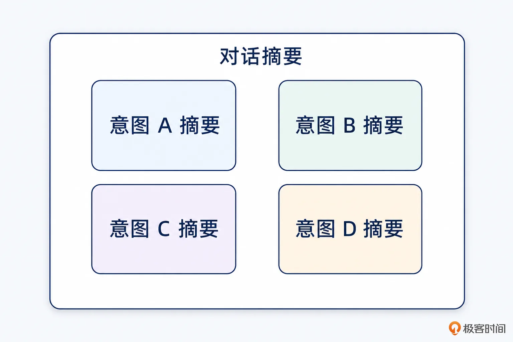
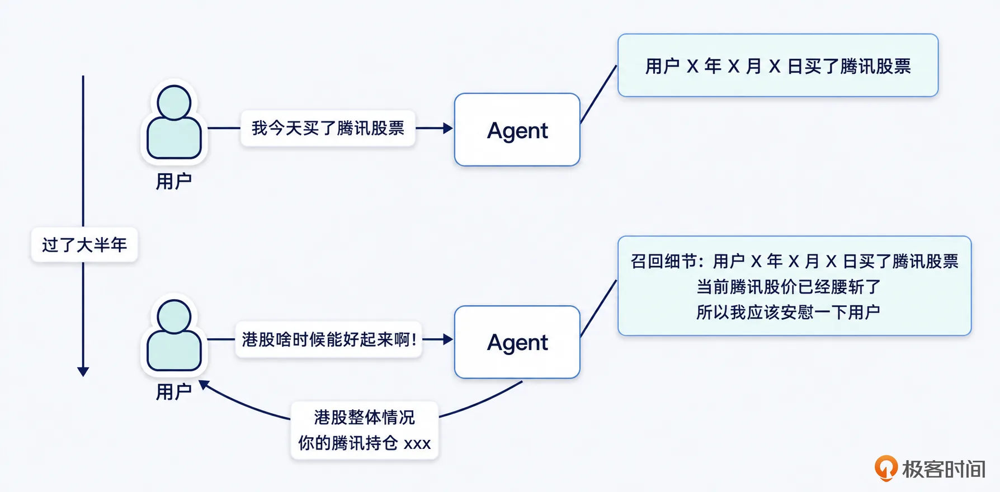
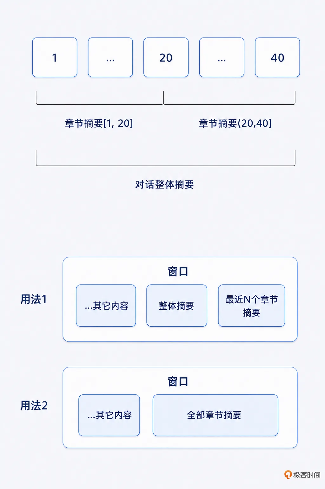
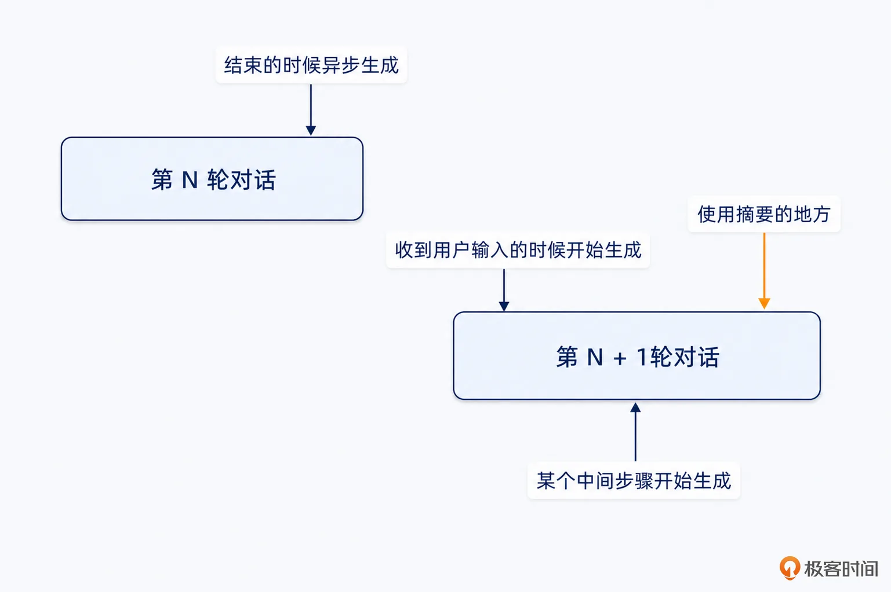
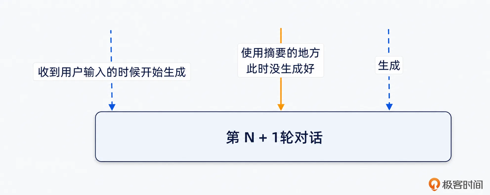
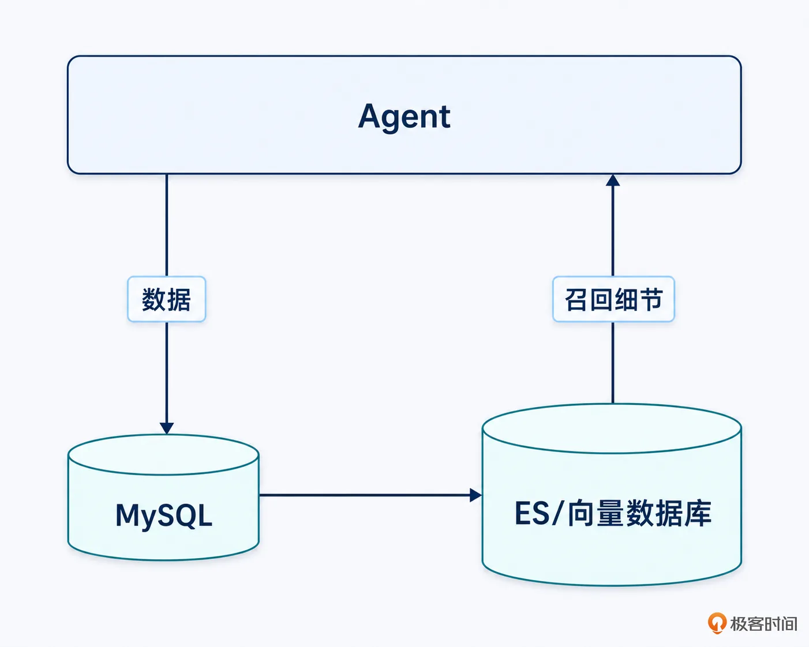
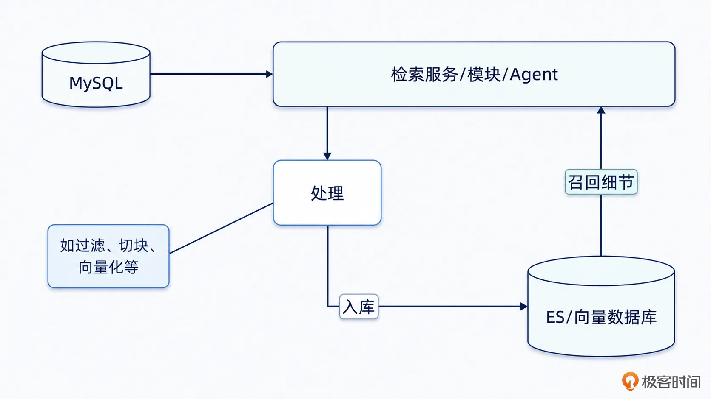
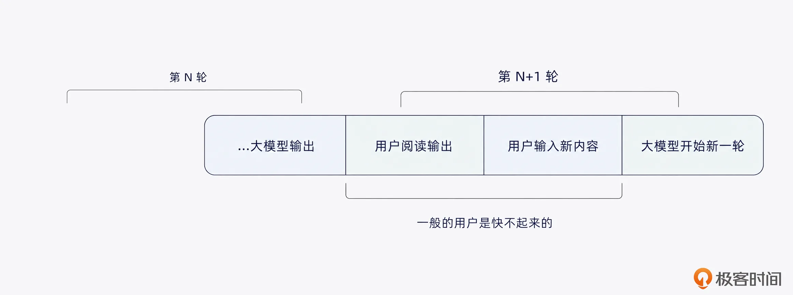
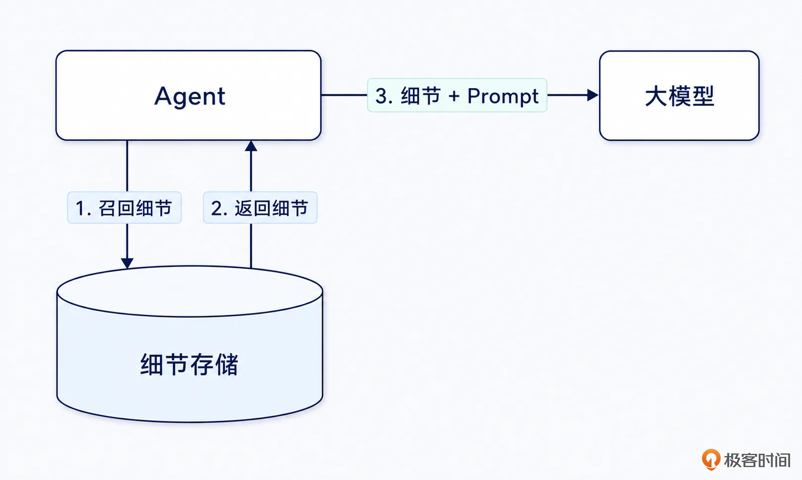
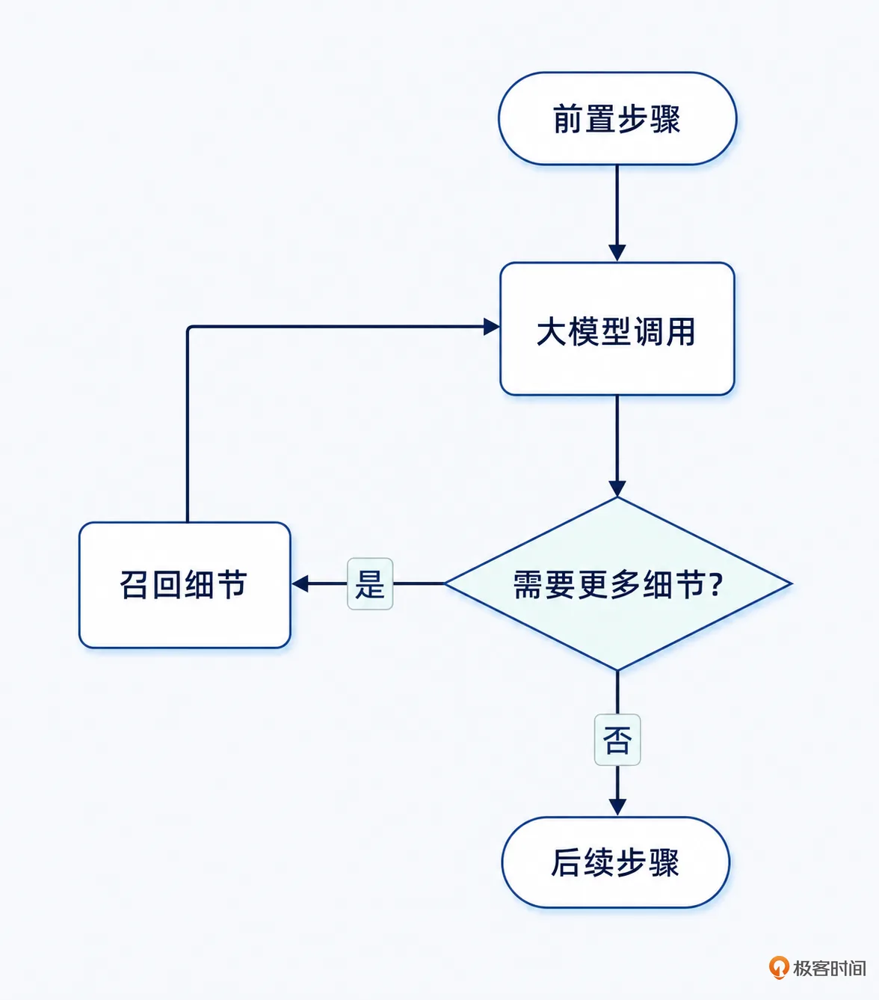

# 13｜摘要/压缩之后，你怎么把细节找回来？
你好，我是大明。

上一讲我们其实已经讨论到了摘要/压缩的问题了，这一讲我们继续深入讨论。为了方便讨论，我后面会统一使用摘要这个词，你也可以将它替换为压缩，没什么区别。

你可以把摘要和细节召回看作一对双生子。也就是说，在面试中一旦你提及了摘要，面试官一定会问这几个问题：

- 你的摘要怎么生成的？什么时候生成？

- 摘要丢失了细节怎么办？

- 怎么召回细节？

- 怎么评估你召回细节的效果？


因此你在准备 Agent 面试的时候一定要回答你的 Agent 是怎么提取摘要的，以及怎么召回细节。今天我就准备了两个面试中很好用的方案，你可以在面试中酌情使用。

## 前置知识

### 摘要

从理论上来说，任何数据都可以有原文-摘要-索引之类的机制。但是在实践上，不会真的给所有数据都做摘要，毕竟摘要生成、细节召回都是有成本的。所以这里我列出一些我经常用的摘要，主要针对的是在多轮对话中使用的摘要。一次性的 workflow，或者非多轮对话 Agent，也可以参考。

#### 对话整体摘要

针对整个多轮对话的内容生成一个摘要，一般会把它持久化地存储下来，并且也会在 Redis 中进一步缓存。对话整体摘要主要是总结对话的内容，那么在不同的领域里面，就有不同的总结方式。常见的应该总结的内容包括：

- 大模型和用户已经达成一致的内容，这部分也可以考虑放入到关键事实里。

- 大模型和用户讨论问题的进度、里程碑。

- 用户相关信息。这一部分往往被看作是用户画像的一部分，我们会在下节课进一步讨论。


千万要避开的一个错觉，就是认为摘要就是一段话，实践中的摘要会有很多字段。

而且，如果一个多轮对话里用户切换过很多意图，并且这些意图之间相关性并不是很强，那么会在对话摘要里面分意图存储。如图：



我建议这种对话的整体摘要要长期保存，并且从里面提取出的关键事实也要长期保存。你在设计历史对话归档的时候，历史对话本身可以归档，但是这种摘要最好不要归档。为什么呢？你可以通过我给出的图示来感受一下这种信息的价值。



不得不吐槽，目前国内的智能体在这方面做得不太好，用的时候有点糟心，所以国内智能体这方面的能力还有待继续提高，任重而道远。

#### 对话章节摘要

有时候，你直接用摘要会嫌弃丢失的细节太多了，那么你可以考虑在特别长的多轮对话里面，引入章节的概念。比如说每 20 轮一个章节，每个章节会独立生成一个摘要。当然了，更好的做法是大模型根据对话内容的语义来划分章节，但是这需要引入额外的大模型调用。

这种章节摘要机制主要是为了解决一个问题：在长对话里面，整体摘要过于精简，经常触发细节召回。但是窗口又放不下原文，于是就可以考虑在上下文里面放入一些章节对话摘要。

这种章节摘要拥有更多的细节，但是又不会像完整对话那么多，在细节和窗口有限之间取得了很好的平衡。



这里有两种做法，一种是整体摘要 \+ 最近 N 个章节摘要，一般 N = 2,3 就足够了。第二种用法则是完全抛弃整体摘要，而是放入全部章节摘要。这种用法的好处是细节比较丰富，但缺点是占据了比较多的上下文窗口。

#### 大模型输出摘要

这是一个比较好用的东西，能够有效节省 token 的用量。正常来说，人喜欢读的是语句通顺、情感充沛的内容。但是这些内容里充满了对于大模型来说“无意义”的内容。所以如果后续在窗口内携带大模型回复的时候，每次都带上原文，就会严重挤占宝贵的窗口空间。

所以一种简单的做法是在调用大模型的时候，不传入大模型输出的原文，而是传入大模型输出的摘要。你可以进一步结合我后面谈到的模型可读摘要来使用，做到摘要几乎不损失信息，同时 token 消耗量又大幅度减少。

#### 关键事实

这是之前我们一再强调的东西。那么什么才算是关键事实呢？从定义上来说，关键事实是 **会影响后续决策、工具调用、上下文组织、最终输出、约束校验的信息**。换句话说，一个信息是不是关键事实，核心看它后面会不会影响 Agent 做事。如果不会影响，那就不要存。如果会影响，那就应该结构化保存，并且最好能回溯到原始来源。

这里我提供一些更加详细的关键事实描述，你在实践中要注意提取。

第一类是 **目标类事实**，它本质上可以看作是 Goal 的内容，正常出现于用户在多轮对话期间修改自己的意图。比如说用户输入“这个项目要突出技术复杂度”“我需要更加便宜的”等。目标事实会影响后续整个流程，包括 Plan、Prompt、工具选择和上下文注入等。

第二类是 **硬约束**。这个东西你见得多了，这一类事实一旦丢失，Agent 很容易输出让用户情绪爆炸的内容。

第三类是 **软偏好**，软偏好不是必须满足，但会影响用户体验。如果你的 Agent 屡次三番忽略软偏好，也会让用户情绪爆炸。所以软偏好应该是尽量满足，并且不能长期多次违反。

第四类是 **用户确认过的事实**。用户确认的事情分成正面肯定和反面否定的事实，不管如何你都要保存起来，这类事实后续可以放心使用，并且一定要用上。

第五类是 **决策类事实**。你可能对这个不太熟悉，它包括做了什么决策以及为什么做决策，其实和 Plan、ReAct 里面讲的差不多。

第六类是 **实体信息**。实体包括项目、商品、方案、人、公司、接口、文档、版本等，和你具体的 Agent 业务有关。一般都建议你组织成实体表，在实体数量特别多的情况下，可能需要引入 Redis 或者 MySQL 来存储，必要的时候还可以结合 RAG 来处理，召回实体的细节信息。

#### 中间结果保存和检索

部分工具的输出结果，在后续的步骤或者后续多轮对话中是会反复用到的。这一类的输出结果，你同样要考虑准备摘要，以及细节召回。但是保存中间结果，要更加讲究时效性，大部分实时查询的结果只能用于当轮对话，下一轮对话又要再次查询了。

### 什么细节才值得召回？

很多人一听到“细节找回来”，第一反应是把历史对话全部塞回来。这肯定不行的，毕竟如果能全部塞回来，就不需要摘要和压缩了。所以问题不是怎么把所有细节找回来，而是判定当前究竟需要什么细节。而且你在上一讲里面应该也看到过，不同步骤需要的细节是不一样的，你不能无脑召回。

那么什么样的细节才值得召回？有一个简单的判定标准： **细节是否会影响当前决策**。我这里列举一些情况，你可以作为参考。

- 影响目标的细节。比如说你需要判定用户究竟是要优化项目简历，还是要优化项目架构。你看到这两种说法的差异就是“简历”VS“架构”，但是这个差异影响又很大。

- 影响约束的细节。比如说在购买之类的任务里面，不能超出用户的预算。但是正常来说，如果你的关键事实和硬约束之类的保存得很好的话，你是不需要召回这一类细节的。

- 影响路径选择的细节，也就是会影响你的 Action 选择的。比如说之前方案 A 已经失败了，Replan 的时候也就不能再用方案 A 了。

- 影响工具调用的细节。比如说之前某个工具调用失败了，如网络不通等，那么后续这个工具就不能用了，除非工具又恢复了正常。

- 影响最终表达的细节。这一类比较常见，因为用户经常会对大模型的输出感到厌烦，或者是太长、缺乏重点等。在这种情况下，用户会输入类似于“简单点，说话的方式简单点”这种提示，那么这种细节也是很有价值的。


这里我说一个猜想，在关键事实提取做得好的情况下，你应该不需要召回细节。保守点的说法是，至少关键的细节都在你提取出来的内容里面。你在实践中也可以验证一下我的这个猜想。

## 基础方案

### 摘要生成的方案

摘要生成主要是讨论两个事情：

- 什么时候生成摘要，也就是时机问题。

- 如何生成摘要，最核心的就是摘要需要保留什么内容，忽略、压缩什么内容，以及对应的 Prompt 应该怎么写。


时机问题比较棘手，因为不同的 Agent 面对不同的任务的时候，它能选择的时机是不同的。但是整体上可以分成两种方式： **同步、异步**。

同步的提取方式一般发生在使用前，或者说我建议你都推迟到要使用的时候再去提取。比如说常见的滑动窗口算法，假设你的窗口是 10 轮对话，那么你就需要在 N% 10 = 0 的时候提取摘要。还有一种典型场景，是在组装窗口内容的时候，发现窗口放不下那么多内容，于是就被迫触发一个压缩过程。

异步的方式就有很多种方案了。举个例子来说，假设你现在要生成一个整体摘要，那么你在异步的时候有几个选择：



这是三个常见的时间点。

- 第一个是在第 N 轮对话结束的时候，立刻生成摘要，生成整体摘要或者章节摘要都可以。

- 第二个是在第 N + 1 轮对话开始的时候，针对前面的 N 轮生成摘要。因为此时 N + 1轮才刚开始，所以没什么内容要摘要的。

- 第三个是在第 N + 1 轮对话正在进行中的时候。有类似“看门狗”的机制，或者说有一些定时扫描机制，会在觉得有必要的时候触发一个摘要。


不过如果你仔细看你就会发现一个小问题，就是异步生成摘要的时候，可能在你需要摘要的时候它都还没生成。下图是一个示例：



而这个问题要解决也很容易，就是停下来等待。这种等待实现起来可以是轮询，也可以是并发机制控制，比如说 WaitGroup、Semaphore 等。

而在引入了异步之后，你可以在 Agent 里面引入多个异步任务去生成摘要。这些异步任务使用不同的 Prompt，触发时机、间隔频率都不同。

所有的摘要生成时机都可以归到我前面描述的这几种中。从面试的角度来说，我非常建议你使用异步生成的策略。

### 细节召回简单方案

最简单的细节召回方案就是利用 ES 或者向量数据库。下面我以对话细节召回为例，展示这个架构是如何运作的。你的整个系统可以分成两部分：数据同步和数据检索。如图：



我还建议你最好把检索相关的功能做成一个独立的服务/模块，或者做成一个独立的子 Agent。那么整个架构就可以变成：



而在召回细节上，具体的算法可以参考后续内容。早期，你不管是直接用关键字检索还是向量检索，又或者关键字和向量检索混合检索都可以。

举例来说，在面试中有一个经典问题是：“如何召回历史对话的细节？”。这里说的历史对话细节，可以是当前多轮对话之前的对话内容，也可以是你好多天之前的。

但这种架构有一个问题，就是数据同步是有延迟的。因此很自然地就会被面试官追问“数据延迟怎么解决？”。这个问题其实非常简单，你只要坚持一个原则就可以：当轮对话的细节不走召回，当轮对话之前，数据就已经完成同步了。

这个思路有一个前提，就是你每一轮的对话间隔是比较长的，足够你完成数据同步。下图解释了一般情况下这个间隔都比较久：



所以，大多数时候在用户阅读输出内容、准备输入的时候，其实你的数据早就完成了同步。

而且，我前面说“当轮对话的细节不走召回”，你可以扩展到“当前 K 轮对话的细节不走召回，直接原文传送给大模型”。这样一来，即便你的数据同步过程非常慢，但是 K 轮对话的间隔也足够你完成数据同步了。

举个例子，你将 K 设置为 10 轮。那么你最近 10 轮的对话细节是不需要召回的， 因为本来你都是原文传递的。而 10 轮之前的内容，即便每轮花 10 秒，你在查询的时候都已经过去 100 秒了。此时要是还没完成入库流程，你需要优化你的落库逻辑了。

### 细节冲突的裁决

应该说所有冲突的裁决，都是那么几个固定的套路。

第一个套路就是以 **最新** 的为主，用时髦的话来说就是 last win 策略。比如说在召回你的购物预算的时候，召回了 500 块和 300 块两条，那么因为 500 块比较新，就可以认为你的预算就是 500 块。

第二个套路就是 **权威** 优先。权威是一个模糊的说法，你可以理解为优先级更高、更有效力、更值得信赖之类的。比如说在政策类里面，有一个基本原则就是下位政策要让步于上位政策，最典型的就是政府发文下级不能违反上级，因此两者冲突必然是以上级为准。

但是这个套路有一个含糊的地方，我称之为“细化”“强化”。举个例子来说，如果部门的规章制度是每周开一次周会。如果你们小组是每周开两个周会，大多数情况下这不会被认为是冲突，而是强化。大部分的大模型都难以处理好这个问题，你只能是在 Prompt 里面尽可能给出一些区别“冲突”还是“强化”的规则。

### 窗口有限 \+ 摘要 = 细节丢失

很多面试官喜欢问：“我既要摘要/压缩，又要完整细节召回，怎么办？”

我这里可以下一个暴论：只要上下文窗口有限，细节就不可能做到 100% 不丢。

首先，窗口有限就意味着你的原文可能装不进去。比如说你总共才 128K 的窗口，现在我原文加一起有 256K，是必然放不进去了。

接着，放不进去就会想到用摘要。但是你别忘了一点，摘要的本质是决策：

- 哪些信息保留，哪些信息丢弃？

- 哪些信息弱化，哪些信息抽象？


只要你做了摘要，就一定有信息损失。区别只在于你丢的信息是否关键。你就会想到，摘要之后我可以召回细节。那你就会面临双重问题：

- 召回的细节不一定准，也就是你的召回算法可能没能召回一些关键细节。

- 召回的细节太多，你的窗口一样放不下。


如果进一步考虑成本问题，那么你就需要引入归档之类的机制。比如说将 3 个月前的对话归档，这就意味着你丢失了 3 个月前的对话细节。

因此，一个成熟 Agent 的目标不是摘要后还能 100% 找回所有细节，而是承认摘要必然丢细节，然后设计关键事实提取、细节召回、冲突裁决这些机制，确保真正影响决策的细节不要丢。又或者说，即便是部分细节丢失，也不影响你的 Agent 最终效果。

## 高级方案

### 模型可读摘要

还有一种非常有意思的摘要生成算法，就是结合大模型的特性，将一段内容里面无意义的词汇全部去掉。什么叫做无意义的词汇呢？这就好比人说话的时候，总是带着大量口语化的填充词汇，比如说嗯、啊、这个、那个、其实、然后、就是说、怎么讲呢、我觉得吧、差不多、大概、可能、反正……

但是对大模型来说，这些词、句很多时候都没有太大的信息价值。

不仅仅是用户输入，即便是大模型输出也会有类似的问题。大模型在面向用户输出的时候，天然会照顾人的理解能力和情绪体验。比如它会写很多铺垫：

- 这是一个很好的问题。

- 我理解你的意思。

- 下面我从三个方面来分析。

- ...


这些话对用户体验是有价值的，因为它让回答显得自然、友好、有层次。但是如果这些内容要进入后续上下文窗口，那么它们的信息密度就非常低了。

举一个例子来说，假设大模型原始输出是：

```
这是一个很好的问题。你其实已经意识到了上下文压缩里面最关键的一点：摘要不是简单地把内容变短，而是在保留关键事实的基础上，尽可能降低 token 消耗。所以这里面最重要的是不要丢掉目标、约束、用户确认过的事实，以及后续执行可能会用到的中间产物。
```

那么实际上可以压缩为：

```
上下文压缩目标：降 token + 保留关键事实；必须保留：目标/约束/用户确认事实/中间产物。
```

你会发现，压缩后的内容不像正常人说话，但是大模型完全能理解。原因也很简单，大模型本身具备很强的语义补全能力。你不需要把每一句话都写得非常完整，只要保留实体、目标、约束、事实、关系和状态，它就能继续推理。

我可以用一个类比来方便你记忆。这就好比一些老外说中文颠三倒四，但是只要关键字在，你就能在脑子里自动补全。这种摘要不是给人看的，而是给模型看的，它寻求的就是极致的高信息密度。

目前来说，这种摘要还是借助大模型来生成，并且可以使用 flash 或者 mini 之类的轻量大模型。因为它不涉及复杂推理任务，而是信息抽取、去冗余和结构化压缩。

但是要注意，这种压缩不是简单删除停用词。比如“不能”“不要”“必须”“不超过”“大概”“可能”这些词看起来很短，却可能承载约束或不确定性，绝对不能随便删。

下面是一个 Prompt 的参考例子，注意其中的要求设定：

```
你是 Agent 上下文压缩器。

请将输入内容压缩成给后续大模型使用的高密度上下文，而不是给用户看的自然语言摘要。

要求：
1. 删除礼貌表达、转场句、口语填充词、重复解释、情绪价值表达。
2. 保留目标、实体、关键事实、硬约束、软偏好、用户确认、用户否认、数字、时间、决策、理由、风险、缺失信息、证据来源。
3. 可以使用短句、列表、键值对，不要求自然语言流畅。
4. 不得改变原意。
5. 不得把不确定信息改成确定事实。
6. 不得把建议改成已执行决策。
7. 不得把 Assistant 推测改成用户确认事实。
8. 硬约束和用户否认内容必须显式保留。

...// 后续内容
```

这个策略虽然看起来很简单，但是在面试中非常好用。你可以进一步结合前面我提到的大模型输出摘要来准备面试，参考下面这个话术：

```
我还引入了一种模型可读摘要的压缩方式，它的基本原理是……
这种压缩方式被我广泛用在大模型输出摘要里面，并且进一步结合滑动窗口算法使用。也就是说，我在滑动窗口算法里面，我不是简单的传入大模型输出的摘要，而是传入模型可读摘要。这样一来，有效减少了 token 消耗，并且腾出了宝贵的窗口空间。
```

### 迭代式细节召回

实践中细节召回一般发生在调用大模型之前，如图：



不过这种机制其实不太好，因为这里召回细节只能是大概猜测一下需要召回什么细节。比较好的机制，或者说一种增强版的机制是迭代式的召回细节。整个过程如图：



1. 先发起大模型调用，里面会携带一些可能要用到的细节的索引、目录。在大模型调用里面，会要求大模型判定一下上下文内容是否已经足够，是否缺少细节。

2. 大模型确认缺少细节，于是执行细节召回 Action，参数一般是索引条目或者目录条目。但是你可以设计多个不同的 Action，这些 Action 用于召回不同的细节。

3. 召回更多的细节之后，再次调用大模型。如果大模型认为细节还不足，则重复前面的步骤。如果大模型认为细节已经足够了，那么就进入到后续步骤中。


这种迭代式的方案有一个问题：如果此时细节已经很多了，窗口已经放不下去了，怎么办？你有两个选择:

- 执行压缩或者要求大模型告诉你可以忽略什么细节。举个例子来说，你本来携带了 ABC 三个细节给大模型，但是大模型确认它不需要 BC 两个细节。那么后续你召回细节 D 之后，就可以和 A 一起传递过去，但是BC就不会再传递了。

- 报错。大模型需要那么多细节，但是你的窗口不够大。就有点像是信用卡拆东墙补西墙，终于有一天撑不住了。这个时候你只能报错了。


此外，为了控制迭代的次数，你需要考虑引入最大迭代次数控制，防止大模型没完没了地召回细节。这个方案其实很简单，它可以看作其它迭代式方案的同类思路在细节召回上的应用。你在面试中可以参考这种话术：

```
在 XX 场景下我还使用过一个独特的迭代式的细节召回方案。
这个方案的基础思路是，我有很多细节内容想要传递给大模型，但是不确定哪些是大模型需要的，全部传过去上下文窗口又放不下。
所以我是直接传递了这些内容的索引给大模型，而后大模型判断它需要哪些细节，使用对应的 Action 来召回细节。在召回细节之后，再次调用大模型，大模型根据已有的细节和索引，进一步判定是否需要补充更多的细节。
通过这种迭代方式，可以精确传递给大模型需要的内容，解决了窗口不够大的问题，也避免了人手工选择细节的误差问题。
```

注意，这个方案实践慎用，面试大胆用。

## 总结

这一讲我们讨论的是摘要和细节召回。

你需要记住一个核心判断： **摘要和细节召回是一对双生子**。只要你在面试中提到了摘要，面试官就很可能追问：摘要怎么生成？细节丢了怎么办？怎么召回？怎么评估召回效果？

从工程上来说，摘要不是简单写一段总结，而是一套上下文压缩机制。它可以包括对话整体摘要、章节摘要、大模型输出摘要、关键事实、中间结果摘要等。不同摘要解决的问题不同：整体摘要解决全局理解，章节摘要解决长对话细节保留，大模型输出摘要解决 token 浪费，关键事实解决后续决策不能丢的问题。

但你一定要承认一个事实： **只要上下文窗口有限，细节就不可能做到 100% 不丢**。因为摘要的本质就是筛选，筛选就意味着信息损失。成熟的 Agent 不是幻想把所有细节都记住，而是通过关键事实提取、细节召回、冲突裁决、模型可读摘要等机制，保证真正影响决策的细节尽量不丢。

基础方案上，你可以用 ES、向量库或者混合检索来召回历史细节，并且遵循“当前 K 轮原文保留，K 轮之前走检索”的策略，规避数据同步延迟问题。

高级方案上，有两个面试中很好用的点。第一个是模型可读摘要，也就是把用户输入和大模型输出中低信息密度的表达去掉，只保留目标、实体、事实、约束、决策和状态。第二个是迭代式细节召回，先给大模型目录和索引，让它判断自己缺什么，再通过 Action 精准召回细节。

总而言之，上下文压缩解决的是“放不下”的问题，细节召回解决的是“不能忘”的问题。真正高级的 Agent，不是记住一切，而是在有限窗口里记住真正会影响决策的东西。

## 思考题

在生成摘要的时候，一般会额外考虑限制摘要的最大长度，你觉得这个最大长度应该根据什么来确定？或者在你的公司里面，这个长度设置为多少，为什么这样设置？欢迎你在留言区分享你的想法，如果这节课对你有帮助，也欢迎你分享给需要的朋友，我们下节课见！