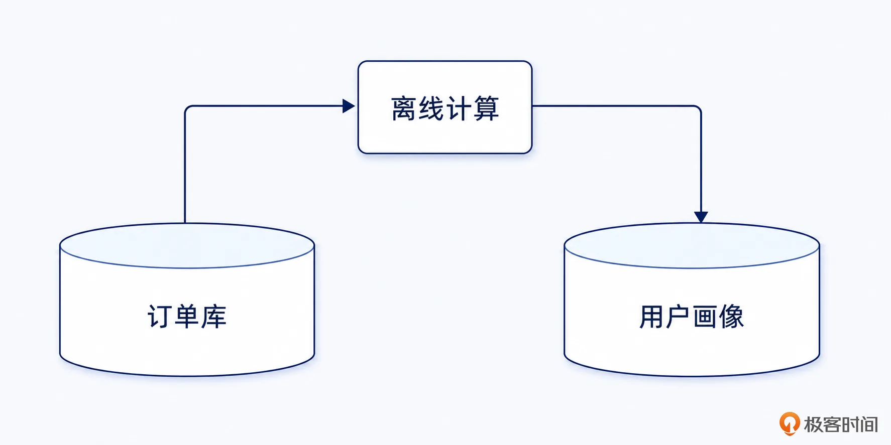
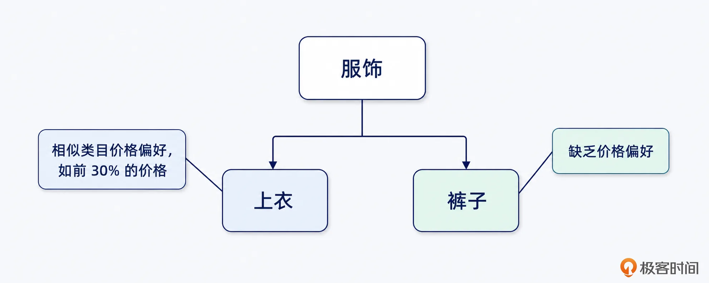
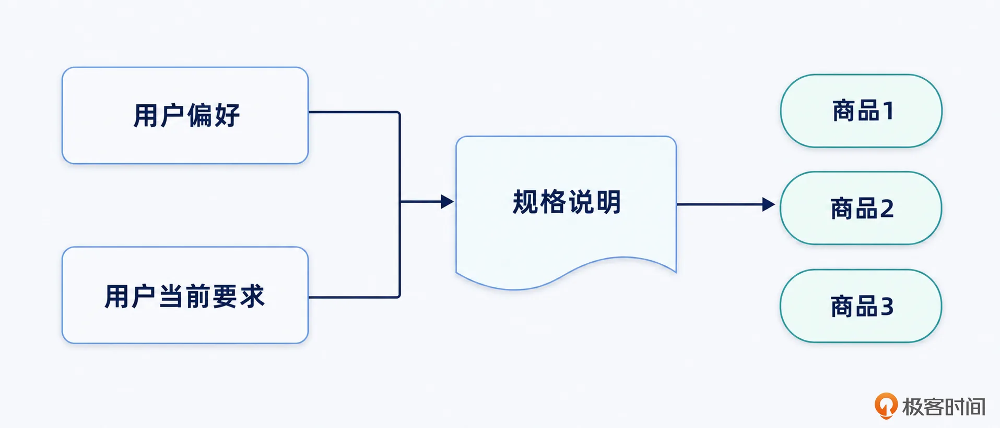
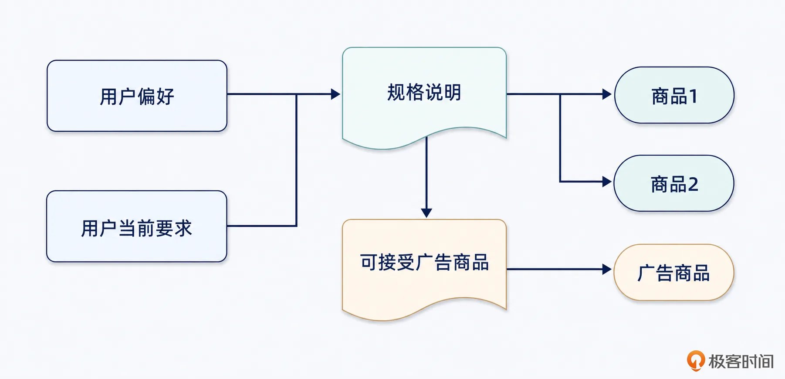

# 14｜用户画像（上）：你的 Agent 的杀手锏
你好，我是大明。

前面我们已经讨论了上下文管理、上下文窗口编排，以及摘要之后怎么把细节找回来。这一讲，我们继续讨论上下文管理里面一个非常重要，但是偏偏大家都做得不好的内容： **用户画像**。

很多人提到用户画像，脑子里面想到的还是传统互联网里面那一套：

- 男，28 岁；

- 居住在一线城市；

- 互联网从业者；

- 消费能力中高；

- 喜欢数码产品；

- 最近浏览过手机。


然后没了。这种用户画像不能说完全没用，至少投广告、做推荐的时候还能凑合用一下。但是在 Agent 里面，这种画像显然远远不够。因为用户对 Agent 的期望是“像真人”，而对互联网业务的期望是“不要太傻”。

如果你的 Agent 用户建模很差，那么无论底层模型有多强、RAG 做得多好、接入了多少工具，最后输出的东西都有可能让用户血压飙升。

大模型只要你付费就可以调用它的 API，能力上没有啥区别。但是只有你的 Agent，知道这个用户究竟想要什么、讨厌什么、能理解什么，以及他通常是怎么做决定的。

因此这一讲我首先要给出一个暴论： **模型能力大家都能用** **，** **拉不开差距，用户画像才是你的私有资产** **，** **才是你胜出的杀手锏。**

## 基础知识

### Agent 下的用户画像

先来看一个“性价比”例子。在前面的内容中我已经谈过性价比了，那时候我是站在 Agent 设计者的角度，讨论“性价比”应该如何解释。那么在这里则是进一步结合用户画像，讨论不同用户眼中的“性价比”含义。

用户对一个电商 Agent 说：帮我推荐一个最有性价比的手机。

你觉得这句话好回答吗？看起来非常好回答，无非就是检索一批手机，再根据价格、配置、销量和评价排序。如果按照互联网的思路，差不多就是这么做了。

但实际上，“最有性价比”这几个字，几乎没有任何固定含义。你要充分考虑不同人对“性价比”的理解：

- 对于一个大学生来说，性价比可能就是价格越低越好，能用四年、不打大型游戏就可以。

- 对于一个商务人士来说，他更加关注稳定性、续航、信号、售后和数据迁移。手机便宜五百块，但是频繁死机，那就毫无性价比。

- 对于一个摄影爱好者来说，影像能力可能占了整个评价标准的 60%。即便手机贵两千，只要拍照效果明显更好，他也会认为更有性价比。

- 对于一个苹果生态用户来说，如果你给他推荐一台参数特别强的安卓手机，他可能完全不感兴趣。因为更换生态所带来的学习成本、数据迁移成本和配件替换成本，远远超过了那一点硬件优势。


甚至于同一个用户，在不同场景下对“性价比”的理解也不一样。

所以问题并不是你的大模型知不知道哪些手机好，而是 **你的 Agent 知不知道，什么才叫做“对这个用户好”**。这就是用户画像最核心的价值。

我常说，一个好的 Agent 就必须是一个太监，而且必须是一个好太监，我愿称之为“司礼监掌印”。

### 治好你“低血压”的用户画像

我来举几个反例，都来自我日常接触到的那些做得很不好的用户画像。

- **永远在重复询问用户**：举个例子，你今天告诉了 Agent 你的理财持仓是在港股，第二天你再次和 Agent 聊天的时候它又忘了，你还得再次输入你的理财持仓。如此反复，你觉得这个 Agent 像个傻瓜。

- **明知道用户不喜欢，还是反复推荐**。比如某个用户非常明确不要推荐某个品牌，但是不管是为了广告，还是就是没记住用户的喜好，后续还是反反复复推荐这个品牌的东西。这样会让用户觉得你就是故意为难他。

- **看起来回答正确，实际上牛头不对马嘴**。比如用户明明是一个实习生，你在修改简历的时候还是把人家的简历改成了高级工程师的样子，简历看起来很厉害，但是完全用不上。

- **输出风格和用户完全不匹配**。比如说用户明明是一个讲究逻辑、理性、情感低波动的人，让你写一篇文章，你写得非常幽默，又或者使用一些花里胡哨的比喻、排比，都会显得你的 Agent 不通人性。

- **错误画像瞎指导**。比如说用户某一天突发奇想，询问了一些有关摄影的东西，而后你的 Agent 就把他标记为摄影大师。后续推荐手机、电脑、旅游路线的时候，都强行强调摄影相关能力，让用户摸不着头脑。


这些错误会让使用Agent的人血压升高，气急败坏。那么为什么会产生这些问题呢？

核心就是没搞明白用户画像究竟怎么做才好。这里你可以做两方面的尝试，一是找一些洞穿人心的顾问，让他们来设计用户画像。二是优化你的Agent的用户画像。因为很多 Agent 用户画像建模做得实在太粗糙了，让我无法直视。接下来我就带你来看看应该怎么优化用户画像的建模，达到好效果。

## 基础方案

### Agent 用户画像应该包含什么？

首先应该肯定的是，用户画像必然包含用户的一些基本信息，如年龄、性别等。

接下来我们讨论一下用户画像应该包含什么维度，这些知识有助于你在实践中对用户画像建模。但是你要注意，并不是说任何 Agent 都要具备下面所有维度的用户画像，你可以根据你的 Agent 面对的业务自由决策。

#### 目标画像：用户究竟想达成什么？

这个维度在教育领域中最为常见。比如说一些语言学习类的 Agent，它在用户画像里面就会描述用户使用这个 Agent 的最终目标，比如说雅思 7.5，高考作文得到 50 分（满分 60 分）等。

你几乎可以想象到，记录这些是为了更好地协助用户达成他的最终目标。比如说，对于一个想要高考作文突破 30 分的用户和一个想要突破 60 分的用户，其训练计划、改进方案很显然会不同。

即便是一般的 Agent，也可以总结一个用户使用这个 Agent 的目标，这可以用来指导你的 Agent 生成内容。

#### 能力画像：用户的理解能力如何？用户能做到什么程度的事情？

对于你的 Agent 来说，能力画像决定了 Agent 应该讲多深、讲多快，以及使用什么样的语言。

这方面说起来有点带着歧视的意思，比如说当你发现你的用户理解能力并不高的时候，你的输出内容就应该平易近人。这可以进一步拓展到用户的不同方面，比如说用户在计算机上是一个大师，那么 Agent 输出的内容可以更加有深度；而如果用户在金融理财上是一个小白，那么有关金融的内容输出就要以简单入门为主。

当然这也包括给你的用户提供的解决方案应该基于什么假设。比如说如果用户的专业素养非常高，那么你的解决方案、建议也应该非常专业。而如果用户的专业程度并不高，那么应该尽可能提供简单的解决方案，或者说给出更加详细的步骤。

#### 偏好画像：用户喜欢什么？用户不喜欢什么？

偏好画像的范围非常广，例如品牌、价格、颜色等，这些在电商类的 Agent 里面非常常见，不再赘言。

我要额外强调的是用户不喜欢什么，这是一个经常被忽视的内容。相比喜欢什么但你没有推荐什么，用户可能不会特别反感；但是如果用户不喜欢什么，结果你还是推荐了什么，那么很容易让用户厌烦。

进一步来说，用户不喜欢什么和前面一再讨论的硬约束有极强的相关性。比如说，用户多次表达自己不喜欢某个品牌，其实就隐含了一个硬约束，即你不要推荐某品牌。有些时候你需要在你的 Prompt 里面进一步强调这种不喜欢什么和硬约束的相关的点，否则一些推理能力比较弱的大模型不能正确处理这个问题。又或者上下文比较长的情况下，大模型也会忘记将这种“不喜欢”转化为一种硬约束。

#### 决策画像：用户通常怎么做选择？

我个人认为这是最不容易评估的一个内容，不同用户做决策的方式差异非常大。比如说有些用户首先看价格，价格超出预算，后面不用再看；有些用户首先看品牌，不熟悉的品牌直接排除；有些用户非常保守，宁愿效果差一点，也不能接受不确定性……

如果 Agent 只会机械罗列优缺点，而不知道用户通常怎么做权衡，那么它仍然无法帮用户完成真正的决策。决策画像的价值就在于它指定了候选方案的排序和解释方式。

一种典型的方式就是将影响决策的因子排序：

```
用户决策因子：性价比、外观
```

但是这种排序有一个问题，就是用户的决策并非都是静态的，永远遵循同一个顺序。举个例子来说，如果是买电子产品，那么性价比优先是合适的；但是如果是买衣服、摆件、装饰品，那么就是外观优先。

所以决策画像的问题在于必须仔细考虑不同场景下用户的决策偏好，进行细致的建模。

#### 关系画像：用户讨论的人之间是什么关系？

这一类画像在社交、客服、招聘、企业协作和教育 Agent 里面尤其重要。举一个例子，现在用户要求你撰写一封邮件给 A，如果 A 是用户的上司，那么邮件应该更加尊敬和慎重；而如果是用户的同事，那么就只需要平铺直叙就可以。

通俗地来说，Agent 要考虑描述：

- 这个人和用户是什么关系；

- 应该采用什么语气；

- 能不能透露某些信息；

- 需不需要更加正式；

- 是否涉及权限问题；

- ……


而在社交情感类的 Agent 里面，问题会更加复杂，尤其是当你的 Agent 需要装作是一个正常人的时候：

- 谁喜欢谁；

- 谁反对谁；

- 谁和谁存在利益冲突；

- 用户信任谁；

- 哪些话不能对某个人说。


当前市面上无数人想要借助 Agent 来侵入社交，成为下一个腾讯帝国，然而他们连一个小小的用户画像都做不好，也就只能通过其他途径赚点钱了。

### 用户画像的影响范围

用户画像几乎可以影响 Agent 的任何环节。

- **影响用户输入理解**：比如说前面多次提到的，用户说自己需要一个性价比更高的东西，那么就需要结合用户的认知来定义“性价比”。

- **影响意图识别和 Slot Filling**：比如说用户提到“帮我再优化一下”，那么优化的方向是什么，这一点就可以从用户画像里面推断出来。比如说用户当前正在冲击 p7，那么对应的优化就是要朝着 p7 前进。

- **影响上下文选择**：应当说在不同的步骤下，需要的用户画像是不同的。换句话来说，你其实不需要将完整的用户画像都放到上下文中，而是可以考虑使用用户画像的一部分。

- **影响 Plan 和路径选择**：用户画像是一个关键的路径决策因子，比如说用户喜欢快速看到结果，可以先生成一个低风险粗稿，再逐步确认。

- **影响最终输出**：最直观的就是在写作领域，一定要模仿用户的写作风格，不然大家写出来的都是“豆包”风味了。


几乎可以认为，你应该在每一次大模型调用里面都带上用户画像，要考虑的无非就是带上全量画像还是带上部分画像。

## 复杂建模的例子

我觉得有关用户画像最难的一个问题是，我虽然给出了从不同维度建模的要点，但是这可能对你的帮助并不大。因为你只能知道要考虑这些维度，但是究竟如何建模、需要什么字段可能还是一头雾水。偏偏这个东西又跟具体领域有关，即便是同一个领域的 Agent，侧重点不同都会导致效果不同。

所以这里我给出一些建模的例子，你后续可以在实践中参考，也可以用于面试。

### 用户关系画像建模例子

这一类的建模通常用在情感类 App，比如说模拟对象 App 中，也可以用在陪聊类的 App 中。这种用户关系画像的核心是要描述清楚人物、人物之间的关系以及发生在人物之间的事情。

#### 人物建模

首先来看人物。你首先要考虑的就是为人物单独记录一张表，这张表的核心不是记录这个人叫什么，而是记录这个人在用户的世界里面是谁。你可以参考这个表结构的定义：

字段

说明

person\_id

人物唯一标识，避免重名导致混淆

name

姓名或者用户最常使用的称呼

aliases

绰号、昵称、代称，例如“老王”“前任”“那个产品经理”

identity

人物身份，例如同事、朋友、家人、前任

attributes

人物相对稳定的属性

user\_attitude

用户对这个人的态度

evidence

得出这些判断的依据

confidence

当前判断的置信度

updated\_at

最近更新时间

这里的 evidence 更多被看做是一个 DEBUG 用的信息。也就是当你怀疑对该人物的描述不准确的时候，可以通过这里来寻求证据。

在更新人物数据的时候，要注意区分事实和观点。比如说用户说老王今天又在群里阴阳怪气，你可以记录老王是用户的同事，用户当前对老王有明显不满，但是不要直接推断老王是一个性格阴险、喜欢打压同事的人。更进一步来说，即便用户直接说老王是一个阴险狡诈的人，也应该将这个记录为用户对老王的态度，而不是说老王在客观上就真的是一个阴险狡诈的人。

到这里，你可能可以想到还可以额外增加一些列，比如说存储 Agent 对老王性格、人品的推断。

而后你还可以看出一件事，就是并不能使用简单的标签来记录人物，比如说你给老王打一个同事标签，但是你也知道的，同事也分很多种，同事与同事之间的区别比人和草履虫之间的区别还大。

你也可以根据业务来额外增加不同的维度来描述用户和其他人物之间的关系：好感程度、依赖程度、嫉妒程度、信任程度……还有一些更加特殊的维度：权力关系、汇报关系、合作频率……

最后，你要记住一个点：关系是有方向的。用户对老王的态度和老王对用户的态度，是要分开记录的，而且你还要提防大模型搞错方向。

#### 事件建模

只记录人物和关系还不够，因为关系并不是凭空产生的，而是由一系列事件塑造出来的。比如用户说：

> 上周我做了一个方案，老王在会议上当着所有人的面否定了我。但是会后小李告诉我，其实老王私下觉得方案没问题，只是不想让我在领导面前表现得太好。

这里涉及的人物就是三个，此外还可以推断出一些事情，比如说用户和老王之间的冲突增加、用户对小李的信任可能上升。

这种信息同样需要一张表来记录，下面是一个参考：

列名

含义

event\_id

事件唯一标识。

occurred\_at

事件发生时间，可以是精确时间，也可以保留“昨天”“上周”等模糊表达。

participants

事件涉及的人物及其角色，例如发起者、承受者、观察者。

objective\_fact

当前能够确认的客观事实，即实际发生了什么。

user\_interpretation

用户对这件事的理解，例如“用户认为对方在故意针对自己”。

user\_emotion

用户因事件产生的情绪及强度。

relation\_effects

事件对人物关系造成的影响，例如信任下降、冲突增加、亲密度提升。

source

信息来源，例如用户亲历、第三方转述、聊天记录。

confidence

事件内容及结构化结果的可信程度。

status

事件状态，例如待确认、已确认、存在争议、已被推翻。

created\_at

事件被记录进系统的时间。

你不一定真的要按照这个结构一模一样地存储，但至少要知道人物关系不是静态标签，而是事件不断作用之后形成的动态状态。

人物关系建模还有一个特别容易踩坑的地方：把用户的描述直接当成了完整事实。这和前面提到的“观点 VS 事实”是一样的。也就是事件同样要考虑区分：

- 客观发生了什么；

- 用户如何理解这件事；

- 其他人物如何解释；

- Agent 当前有哪些候选推断。


这种设计的价值在于避免 Agent 被单一视角带偏。尤其是情感陪伴类 Agent，很容易为了提供情绪价值，一味认同用户的判断。

#### 注意事项

在建模之后，还有一些注意事项。

第一个是要 **考虑时效性问题**，很显然用户关系就具备明显的时效性，所以要尝试记录人物关系的变化历史。我用一个场景来帮助你理解：

- 用户最开始说：小李是我最信任的朋友。

- 过了几天又说：小李把我告诉他的事情泄露出去了，我现在不太敢相信他。


如果你用第二条覆盖了第一条信息，那么你的Agent就丢失了一个非常重要的事实：用户和小李曾经非常亲密，当前的不信任是由一次背叛事件造成的。这和“用户与小李”的关系一直不好，是明显不同的。

第二个是要 **考虑结合场景来加载关系信息**，而不是每次都全部加载，一般只需要加载和用户当前讨论的人、事件就可以了。比如说用户在讨论老王，那么就加载老王本身的信息，以及和老王发生过的事情。

第三个是 **注意控制复杂度**。很多 Agent 根本不需要建立完整的人物关系图谱，只需要描述用户本身就够了，最典型的就是我接下来要讨论的电商下的用户建模。

### 电商用户建模

电商应该是最适合使用用户画像的场景之一。毕竟用户买过什么、看过什么、收藏过什么、愿意花多少钱，平台基本上都有记录。以买手机为例，你几乎瞬间可以想到：

- 用户最近浏览过手机；

- 用户购买过苹果产品；

- 用户的购物车里面放着最新款的苹果手机；


然后将这些标签丢给大模型，让大模型“结合用户画像推荐商品”。这种做法不能说没用，但是效果往往非常一般。

我建议将电商用户画像至少分成三个层次。

- 全局画像：也就是跨商品品类依旧可能成立的用户特征。

- 品类画像：这是电商用户画像里面最重要的一层，因为一个用户在不同品类下的购物偏好可能完全不同。

- 当前购物画像：这部分内容将在下一讲讨论。


下面是一个可以参考的品类画像的定义：

字段

含义

id

偏好记录的唯一标识。

user\_id

用户唯一标识。

category\_id

商品品类，例如手机、裤子、笔记本电脑。最好使用品类 ID，而不是直接使用名称。

preference\_type

偏好类型，例如价格、品牌、商品属性、购买决策权重。

attribute\_key

具体偏好维度，例如 price\_percentile、brand、screen\_type、storage、material。

preference\_value

偏好的具体值，可以使用 JSON 保存单值、范围或列表。

preference\_mode

偏好性质，例如喜欢、排斥、硬性要求。

strength

偏好强度，用于排序和冲突处理，例如取值 0～1。

source

偏好的来源，例如用户明确表达、历史订单推断、退货记录推断。

confidence

系统对这条偏好判断的置信度。

updated\_at

最近更新时间，用于判断偏好是否过期。

你可以在表结构中加入更多的字段，适合于你的业务的字段。

这里我特别讨论一个高级的价格偏好设计，你可以参考。

#### 价格偏好的高级设计

这里我给你一个比较有意思的价格偏好设计。很多电商类的 Agent 确实会研究用户的价格偏好，但是一般就是给用户打上“喜欢性价比”之类的标签，而缺乏一个更加细致的划分。

举例来说，不同的用户在不同的品类下，他的价格偏好是完全不一样的。就我个人而言，如果是买衣服的话，就是随便买，但如果是电子产品则是尽可能拉到顶配。

所以这里的思路就是建立一个品类级别的价格偏好。相当于，用户有一个默认偏好，而后在具体的品类下还有一个价格偏好。

这种价格偏好可以通过离线计算获得。基本思路是，遍历用户的订单，而后针对每一个商品项，计算用户购买的时候其价格的百分位数。所谓的百分位数，就是你熟悉的 99 线和 999 线这种描述。百分位数相比“便宜”“合适”“昂贵”要精准得多。



如果仅仅是这样，也还不够高级，这会儿你可以进一步叠加另外一个机制： **相似类目价格参考**。举例来说，当用户想要买裤子，但是用户并没有在你的平台上买过任何裤子，那么可以找到裤子的兄弟类目，参考它的价格偏好，比如上衣的价格偏好。



此外，还有一些注意事项，你可以关注。

第一个注意事项是， **你在电商里面还要考虑购买者和使用者可能不是同一个人**。比如说在情人节给对象买礼物，那么就不能按照购买者的喜好来推荐，而应该考虑要按照 TA 的对象的喜好来推荐。换一句话来说，你的电商 Agent 可能还要为用户相关的人独立建模，比如说为 TA 的对象建模。

第二个注意事项是， **浏览记录和购物车的东西可以被看做推荐的参考，但是不能完全参考**。比如说一种很傻的设计就是直接推荐购物车内的东西。这时候我就有一个问题了，如果用户对购物车的东西感到满意，那么他为什么不直接下单，反而要你的 Agent 推荐呢？浏览记录也有同样的问题，如果用户对他浏览过的东西觉得满意，那么为什么他不直接下单呢？

实际上这两个东西可以被看作是重要参考，但是要考虑让 Agent 分析出为何用户对这些东西不满意，以至于最终没有下单。而后你的 Agent 才能更有针对性地推荐商品。

第三个注意事项是 **广告问题**。

我通常建议在电商 Agent 里面增加一个额外的步骤，也就是根据用户偏好来生成一个推荐商品的“规格说明”，或者需求说明。后续用户的不同需求、系统的不同额外约束发生变更之后，都可以修改规格说明之后，再次实现商品推荐。同样，这个规格说明也可以用于排查问题。



广告商品可以轻微违反用户对商品的需求说明，但是不能太过。比如说用户的心理价位是 300-500 元，你夹带一个 250 元或 600 元的广告商品，都是可以的。本质上可以通过需求说明生成另外一个广告商品约束，如下图：



## 总结

今天这一讲算是初步带你认识一下用户画像这个主题，讨论了一下如何建模。

我这里可以教你一个在面试中刷亮点的小技巧，就是设计一个看起来很不错的用户画像。这个用户画像你可以考虑选用我前面提到的目标、能力、偏好、决策和关系中任何一个维度来作为突破口。在这方面我建议你可以找 AI 来设计，让 AI 从这几个角度出发，针对你的当前业务，设计一个合适的用户画像。

当然仅仅这些内容还不够，你还要结合我下一讲中要讲的提取、使用方面的技巧，刷一个完整的亮点。

## 思考题

我在这一讲中系统性地讲了如何建模的问题，现在假设我要你设计一个针对教育领域的用户画像，你会如何设计？你可以假设这是一个业务范围广泛的 Agent，覆盖了小学到大学，也包括各种非职业教育、考证等方面的内容。欢迎你把你的设计分享到留言区，如果你觉得有收获，也欢迎你分享给需要的朋友，我们下节课再见！