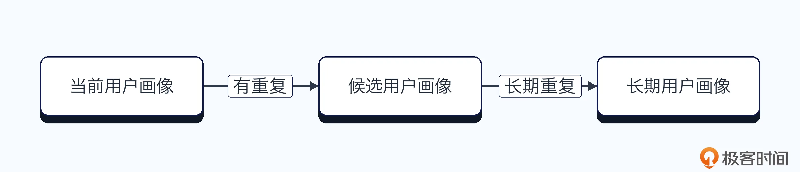
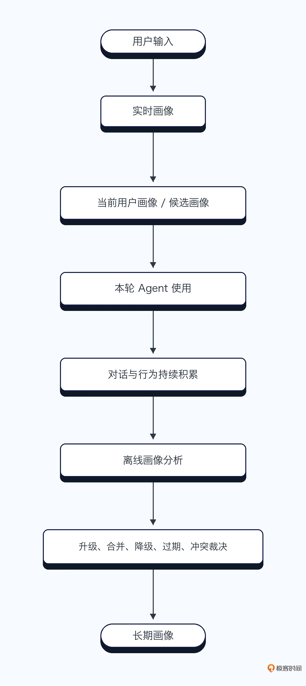
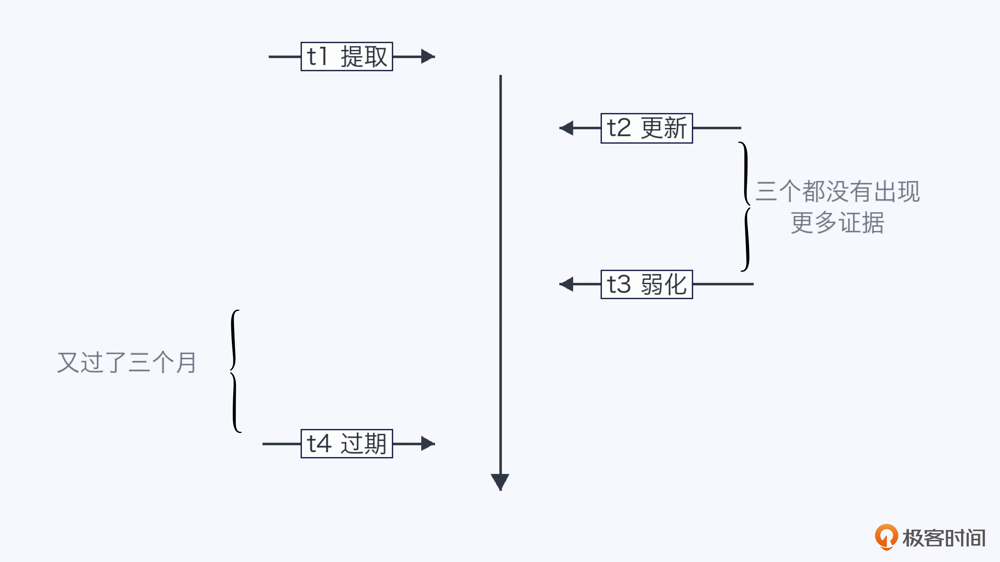

# 15｜用户画像（下）：用户画像怎么来的，你怎么知道不是一时兴起呢？
你好，我是大明。

上一讲我们讨论了一个很重要的问题：为什么说用户画像可能是你的 Agent 胜出的杀手锏？

一个没有用户画像的 Agent，每一轮对话都像是第一次认识用户。用户已经说过自己不喜欢什么、能接受多少钱、习惯怎么做决策，Agent 下一轮还要重新问一遍。这种 Agent 用久了之后，用户很容易产生一种感觉：你一点都不爱我！

但是用户画像做得太积极也不行。用户今天看了一次折叠屏手机，你就认为用户喜欢折叠屏；用户今天买了一件便宜衣服，你就认为用户是价格敏感型用户。就仿佛你刚认识一个帅哥美女，就把孩子的名字都想好了，也有点过分。

所以在用户画像中，难点还有：

- 用户画像从哪里来？

- 什么信息应该被提取成画像？

- 这个画像只在当前对话有效，还是长期有效？

- 用户的一次行为，究竟是稳定偏好，还是一时兴起？

- 新画像和旧画像冲突了，应该相信哪一个？

- 画像什么时候应该过期？


这一讲我们就来解决这些问题，不过在这之前我们得先讨论一个“层级用户画像”设计。

## 层级用户画像

在实践中，很多人构建用户画像的时候，只有一张长期画像表。比如说：

```
喜欢苹果
价格敏感
偏好简洁回答
Java 工程师
```

当然上面只是一个示例，实际可能会有更多信息，并且结构化程度会更高。

这种设计的问题是，无法表达用户当前的状态。比如说我长期都是喜欢喝拿铁的，但是我最近突然就开始研究美式了。应当说，善变是人类的天性。

所以我建议你 **维** **护** **一个当前用户画像**，它描述的是用户在当前对话、当前任务、当前阶段下的状态，简单来说就是用户现在的喜好覆盖了原本的喜好。比如说长期用户画像显示用户是喜欢苹果手机的，但是这一次用户在对话中明确表达喜欢小米手机。

如果将思路拓宽，你就会想到一个问题：既然有一个长期用户画像，又有一个当前用户画像，那么当前用户画像什么情况下会被转化为长期用户画像？显然，不管是太早还是太晚都会有问题。

这里可以引入一个额外的候选用户画像，有些人也叫做中期用户画像/不稳定用户画像/待确定用户画像。表达的是用户表现出了某种偏好，但是暂时还需要更多证据支撑。于是有：

- **长期画像**：用户长期表现出来的某种偏好

- **候选用户画像**：用户表现出来了一种偏好，但是此时还不是很确定

- **当前用户画像**：用户在当前多轮对话中表现出来的偏好


三者之间一般是覆盖关系，后者可以覆盖前者。而一个长期用户偏好一般是候选用户偏好慢慢升级上来的，如图：



好，在学习了基本的用户画像的层次之后，现在要你设计一个提取用户画像方案，要解决哪些问题？我们一起看一下。

## 第一个问题：用户画像从哪里来？

用户画像的来源很多，大体上可以分成四类。

### 用户明确表达

这是最直接的来源，比如用户说我不喜欢吃牛肉，这种明确表达的置信度很高。但是置信度高，不代表它一定长期有效。比如用户说“回答简单一点”，可能只是当前比较着急，而不是一直都喜欢简单回答。

因此，即便用户明确说出来了，你依然要判断它的作用域和生命周期。而且，你可能小概率会遇到用户跟你的 Agent 撒谎的情况，比如说你做心理咨询类的、模拟对象类的。还有一种情况，则是用户不好意思承认是自己，会推脱是帮朋友问的。

### 从用户行为中推断

第二类来源是用户行为。比如说在电商里面，行为数据非常丰富，包括浏览、搜索、点击、收藏、加入购物车、下单等等。

例如，一个用户连续浏览了十几款小屏手机，最终也购买了一款小屏手机，那么你可以推断用户可能偏好小屏手机。但是行为推断有一个巨大的坑： **用户做了这件事，不等于用户喜欢这件事**。

用户购买低价手机，可能是买给父母的；用户搜索奶粉，可能是在帮朋友查询；用户退掉一件黑色衣服，可能是尺寸不合适，而不是不喜欢黑色。不过这不意味着用户行为中推断出来的不可信，而是说在必要时刻你需要重新审视你从行为中推断出来的用户画像。

### 从多轮对话中提取

用户的偏好和决策方式，往往不是通过某一句话表达出来的，而是隐藏在整个对话过程中。例如电商 Agent 推荐了三款手机：

- 手机 A 拍照好，但是贵；

- 手机 B 性能强，但是重；

- 手机 C 配置一般，但是轻便。


用户最终选择了手机 C，并且说他平时也不玩游戏，轻一点更重要。那么你可以提取出几个不同层次的信息：

```
当前任务偏好：轻便优先于性能
使用场景：不玩大型游戏
候选长期画像：用户在移动设备中可能重视便携性
```

这里要重点区分用户说了什么、用户拒绝了什么、用户最终选择了什么，以及用户为什么做这个选择。相对来说，最后一点 **“为什么”** 才更加重要，因为做了什么不足以说明他的偏好，但是为什么做往往会有更强的偏好意味。

### 来自外部业务系统

很多 Agent 本身并不掌握完整的用户信息，而是从外部业务系统中获取。最明显的就是有些公司本身在 **推荐系统** 里就已经有了用户画像这种东西，在开发 Agent 的时候自然就可以接入这些已有的用户画像。但要注意的是，这些源自外部的用户画像不一定能够直接使用，可能需要引入一个中间转换过程。

总的来说，不管什么来源的用户画像，你都需要考虑一个关键点： **事实 VS 推断**。或者说得更加直白一点，所有的用户画像都只是在一定程度上可信，并不是完全可信。

当然了，现实中又究竟有多少人能真的认清自己喜欢谁不喜欢谁呢？

## 第二个问题：用户画像应该什么时候提取？

画像提取大体上有三种时机。

### 实时提取

实时提取是指每一轮用户对话结束之后，立即判断是否产生了新的画像。比如说用户输入：不要推荐苹果，最近实在不想用 iOS 了。系统在这一轮结束后，可以实时提取出一些用户画像，下面是一个例子：

```
{
  "profile_type": "brand_preference",
  "profile_value": "当前不考虑苹果",
  "scope": "本次手机购买任务",
  "time_level": "current_task",
  "source": "explicit_statement"
}
```

**实时提取最大的优势是及时**。这一轮提取出来，下一轮就可以立刻使用。但是它的问题也非常明显：容易把用户的一时表达当成长期画像。

因此，实时链路更适合生成当前用户画像，它不适合随便修改稳定的长期画像。

### 对话结束后提取

第二种是在一次对话或一个任务结束之后统一提取，通常表现为一轮对话后提取。当然，你也可以用任务来作为维度，在 N 个轮次之后任务结束，再提取用户画像。

相比实时提取，这种方式可以看到完整的对话过程。例如用户一开始说“我想买一个性能强的笔记本”，中间看了几款之后又说“这些都太重了，我还是更在意便携”，最后购买了一台轻薄本。

如果你只分析第一句话，就会认为用户性能优先；如果你分析整段对话，就会发现用户最终是便携优先。

因此，对话结束后的画像提取，重点应该分析：

- 用户最初表达了什么

- 中途修改了什么

- 最终选择了什么


那你可能会觉得奇怪，就是为什么还要分析最初表达和中间表达，直接用最终表达不就可以吗？这就是关键点了，因为用户的最终选择可能是“无奈的折中”，而不是真的喜欢。理论上来说你的 Agent 还要区别“折中、妥协”和真的喜爱之间的区别。

这种提取出来的画像可以用来更新短期画像，也可以作为升级长期画像的证据。

### 离线提取

离线提取是指定期分析用户最近一段时间内的行为和对话，最常见的就是每天分析一下当天产生的对话。

但是分析并不意味着必然更新长期用户画像，可能只是提取到一些短期画像和候选画像。 **它最大的价值是发现趋势。** 用户一次说喜欢小屏手机，可能是一时兴起；用户跨越半年、三次购机讨论都优先考虑小屏，那么这个偏好就比较稳定。

因此正常来说离线链路更加适合做这些事情：

- **合并重复画像**：比如说在多个、多日提取的内容里面，发现有一些偏好类似的或者是相同的，那么就可以考虑合并。

- **判断画像稳定性**：比如说用户画像有没有在多个时间内反复横跳，并且互相冲突。

- **降低长期未出现** **的** **画像的置信度**：比如说用户早期表达了某个品牌的喜爱，但是后续买东西一直没买过该品牌的产品，那么可以认为这个用户已经不再喜欢这个品牌了。

- **识别冲突并裁决**：用户可能在不同的时间内有一些互相冲突的表达，那么离线分析可以找到这些冲突的描述，而后根据一定的规则进行裁决。

- **淘汰过期画像**：这个可以看做是降低长期未出现画像置信度的极端案例，当用户的画像长期没有被使用过之后，就可以考虑淘汰了，或者说置信度降低到 0。要注意的是，淘汰并不是一定要淘汰整个用户画像，可以挑出来里面没有被使用的内容淘汰掉。例如用户画像分成两个大部分，一部分是理财，一部分是写代码，那么如果用户已经很长时间没有再咨询有关理财的问题，这部分的画像就可以被淘汰掉了。


### 实时加离线的混合方式

这也是最常见的解决方案，它的完整形态如图：



总的来说：

- 实时链路：先记录下来，并且一般只影响当前对话；

- 离线链路：事后复盘，并且总结规律，最终沉淀下来。


这种设计和很多数据系统的思路是类似的， **实时保证及时性，离线保证准确性**。

## 第三个问题：用户画像的生命周期控制

这也是你在实践中、面试中都容易忽略的问题。用户画像并不是提取了之后就一成不变的，它也是会随着时间变化的。你可以考虑引入一个生命周期控制机制，这里我给出一个简化版的设计：

- **激活**：此时这个用户画像是活跃的，经过多次验证，可以作为默认偏好。

- **弱化**：长期没有新的证据，或者最近出现了一些相反行为。比如说用户原本喜欢苹果手机，但是最近开始看小米手机。此时用户画像可以用在一些不太敏感的地方，比如说 RAG 排序过程中。

- **过期**：超过有效期，默认不再使用。


为了控制这种生命周期，你需要在提取用户画像的时候，看看有没有新证据，如果长时间没有新的证据，则降低其效力。如下图，这里假设每三个月没有出现新证据就会降级用户画像的可信度。



- t1 的时候算出了用户画像，此时应该默认是激活状态的。

- t2 的时候，假设出现了新证据，那么就更新一下该用户画像的更新时间戳，代表该用户画像得到了新的证据支持。

- t3 是弱化的时间点，因为过去的三个月都没有再出现新的证据。

- t4 是过期的时间点，因为已经连续两个季度（三个月）没有出现新的证据了。


在面试中，我建议你可以参考这里的简化设计，引入一些比较复杂的生命周期控制机制：

- 可以在激活-弱化-过期的基础上引入额外的状态。

- 可以引入更加复杂的时间控制机制。比如说激活到弱化可以是三个月，但是弱化到过期可以是半年。这其实也符合人的偏好变化的心理曲线。


## 第四个问题：画像冲突了怎么办？

在实践中还有一个难以避免的问题，就是画像可能有冲突。比如说用户一直以来都是喜欢简练的回答，但是这一次说详细解释一下，这时候就应该尊重用户的最新意愿。

综合来说，可以让大模型按照下面几个原则来裁定用户画像：

- **当前明确表达优先于历史推断**：这个很容易理解，用户的最新表达总是更能体现他当前的状态。

- **用户明确表达优先于行为推断**：比如说用户买了三个苹果产品之后，突然说现在不再喜欢苹果品牌了。除非你有充分理由认为用户表达和真实行为不一致，否则应该相信用户当前表达。

- **用户纠正优先**：比如用户说“你理解错了，我不是价格敏感，只是这次预算比较低”，这时候你要考虑修改用户画像，即删除或者降级用户价格敏感，但是保留“当前任务预算较低”这个点。这种其实也符合我前面提到的，用户并不是真的价格敏感，只是钱包不丰厚没得办法只能妥协而已。

- **领域画像优先于全局画像**：用户可能在不同领域内的偏好是很不一样的。比如有些人看起来勤俭节约，但是买电子产品都是只看大牌，并且配置拉满。


## 进阶方案

现在我们来回答一个关键问题，你怎么知道用户不是一时兴起？比如用户说“我最近挺喜欢折叠屏手机的”，你能不能将“喜欢折叠屏”写入长期画像？显然不能。如果用户说了3次喜欢折叠屏手机，那么能不能写入长期画像？10次、20 次呢？

这个问题的本质就是， **我们其实不知道用户真的喜欢还是不喜欢一个东西，只能通过他的“表现”来推测**。而如果要推测你就得有一个非常具体的标准。

那么这个标准，我总结为 4C，注意和 Plan 中的 G4C 做区分。它代表的是Count（出现次数）、Continuity（持续时间）、Cross-context（跨场景一致性）、Confirmation（用户确认）。

这些因素可以合并在一起为用户画像计算一个稳定性分数。整体就是：

```
stability_score = w0 * 出现次数得分 + w1 * 持续时间得分 + w2 * 跨场景得分 + w3 * 用户确认得分
```

里面的 w 代表的是权重，最简单的情况下可以将w0、w1、w2、w3这些都设置为1。

这个得分越高，那么就说明它越稳定，也就是更有可能成为一个长期用户画像。那么现在的问题就是每一个维度的分数怎么算，比如说出现次数得分。

这里我用我之前尝试过的一个算法来讲解，这个算法源自推荐系统。下面我会详细讨论每一个维度，并且给出计算方法。总共有四个维度，假设总分是 100 分，那么每一项的最高分是 25 分。

### Count：出现次数

这个偏好出现了多少次？比如说用户只说过一次喜欢折叠屏，你肯定不能就此认为用户喜欢折叠屏。但是如果用户在多次独立的购机讨论中都主动询问折叠屏，则可信度更高。

这里要强调“独立”，是因为用户在同一轮对话里面连续说了五次喜欢折叠屏，不等同于在五次不同对话中分别表达，是跨场景的反复验证，而连续出现只是同场景的重复回声。

这里可以引入一个幂的逐渐饱和公式： `count_score = 25 × (1 - e^(-n / 3))`。后续 e 的指数幂本质上是为了解决连续出现次数引起的价值递减。

下面的表格展示了 N 的取值对应的分数：

N

结果

1

7.087

2

12.165

3

15.803

4

18.41

5

20.278

简单来说，就是用户第一次表达很重要，第二次、第三次也很重要；但是第十五次表达并不会比第十四次增加多少信息。有点像是你对你对象说“我爱你”，前几次还会面红心跳，后几次你就已经波澜不惊随口而出了。

你在实践中可以进一步考虑将 -(n/3) 的分母项调大，越大就代表分数增长越慢。

### Continuity：持续时间

这个偏好持续了多久？持续时间是区分一时兴起和稳定偏好的关键。举个例子，同一天出现 5 次喜欢喝拿铁可能是当前兴趣，但是如果跨 3 个月出现 3 次喜欢喝拿铁，则更可能是稳定偏好。

它的分数可以用这个公式来计算： `continuity_score =25 × min(1, ln(1 + d) / ln(1 + H))`。其中：

- d：第一次证据和最近一次证据之间相隔的天数；

- H：这个画像类型被认为足够稳定所需的时间。


这个公式可以用来应对一个典型场景：如果一个用户本来完全不喜欢一个东西，但是最近一个月频繁提起，那么这个就要重视。但是如果用户已经念叨了一年两年了，那么他每次新增念叨的价值就不大了，因为分数早就达到满分，是稳定状态了。这就是所谓的得不到的在骚动，被偏爱的有恃无恐。

其实你可以根据自己的经验给 H 取一个值，比如说 180 天。我以前读心理学，看到的一个理论，认为人的激情就只能保持三个月（约90 天），也就是如果是一时兴起，那么差不多就是保持三个月。

那么超过 90 天都还喜欢，那就是真喜欢，所以我用 180 来奖励那种持续时间更长的偏好。

### Cross-context：跨场景一致性

这个偏好是否在不同场景中表现一致？

例如用户买手机时喜欢轻便，买电脑时喜欢轻便，买平板时仍然喜欢轻便，那么就说明用户是真的喜欢轻便。但是如果用户只是买手机时看重轻便，买电脑时更看重性能，那么画像应该限定在手机领域。

它的分数也可以用一个简单的公式来计算： `cross_score =` `25 ` `× min(1, max(0, s - 1) / 4),` s 是独立会话数，这里可以直接用会话数来替代。后面的这个 4 你可以调整为其它数值，它是我用的一个经验值，可以理解为 s=5 次（此时 s-1 = 4）的情况下分数就取了最大值。

这种算法有一个缺点，即我用跨对话来近似替代跨场景，如果用户在不同的对话里面讨论的是同一件事，那么这种算法就不太对了。

### Confirmation：用户确认

最可靠的一种方式就是问用户。用户确认的分数计算依赖于经验，首先要给用户不同的态度设置一个权重：

确认方式

得分

没有确认

0

用户没有反对，但也没有明确承认

0～5

用户表示“对，差不多”（有所怀疑）

10

用户明确确认某一场景下成立

20

用户明确确认长期成立

25

比如说你可以直接问用户“我注意到你最近几次选择设备时，都比较重视重量和便携性。以后推荐数码产品时，要不要默认优先考虑轻便？”，用户确认后，就可以给它 25 分。

这里你可能会发现，判定得分这个事情还是得大模型来，只有大模型才能分辨出用户的确认方式。而你也知道，调用大模型总是很慢的，所以这一个分数计算起来比较慢。

### 小节

在计算出来总分之后，你还可以划定一个使用这个画像的标准，可以参考下面这个表：

最终分数

状态

使用方式

0～29

candidate

仅保留，不影响结果

30～49

weak / short-term

只能用于排序参考

50～69

active

可以影响推荐，但不能作为硬过滤

70～84

stable

可以作为该作用域内的默认偏好

85～100

confirmed stable

可以稳定使用，但仍服从用户当前输入

在我们的公式里面，每一个项都有一个权重因子，这个就是用来调整公式的，在迭代中调整权重，使它描述用户的喜好更加精准。举个例子来说，你可以调整用户确认的权重，调高到 1.2 或者 1.5。这也是合理的，因为用户确认就是属于最直接最可信的证据。

因此你在面试中可以使用一个优化话术，介绍你调整了这个权重，取得了不错的效果，如：

```
我也深度参与了用户画像建模。
我们设计了一种算法，它的核心是根据 4C 计算一个稳定分数。……（介绍前面的内容）
在上线之后，我们发现用户画像构建得还不是很好，而后我就去研究调整 4C 的权重。我发现用户如果明确表达了自己的喜好，那么相应的用户画像是更加可信的，所以我增加了权重，从 1 调整为 1.5，后续我用 AB 测试验证了我这个猜想……
```

当然了，如果你是做搜推广的，尤其是做用户画像有关的业务，那么你可能会觉得这个做法有点弱，毕竟在大数据方面还有更多算法、技巧可以推断出来准确、详细的用户画像。

这个算法不算太复杂，所以你在面试的时候是能够解释清楚的。这个算法在实践中的效果可能一般，主要是我脱离大厂之后，一直缺乏大规模数据验证算法的机会，所以后续没有继续“炼丹”——优化这个算法了，如果你有机会可以自己在实践中尝试一下。

## 总结

这一讲我们围绕“用户画像从哪里来、怎么判断它不是一时兴起”这个核心问题，展开了四个层面的讨论。

**第一，画像的层级设计**：当前画像描述本次对话中的即时偏好，候选画像记录有待验证的新信号，长期画像沉淀稳定的用户特征。

**第二，画像的来源与提取时机**：画像来源有四类：用户明确表达、行为推断、多轮对话提取、外部业务系统接入。提取时机则有三种节奏：实时提取、对话结束后提取、离线提取。

**第三，画像的生命周期与冲突处理**：画像不是一锤子买卖，它有自己的生命周期：激活、弱化、过期。长期没有新证据支撑的画像应当逐步降级，而不是永远有效。

**第四，4C 稳定性评分模型**：出现次数、持续时间、跨场景一致性、用户确认。四个维度加权求和，得分越高，画像越稳定，越有资格升级为长期画像。

这一讲结束之后，相信你应该彻底感受到了用户画像的复杂度。每次我被别的 Agent 气到的时候，我都会想用户画像那么复杂，做Agent的人一时半会搞不定是情有可原的。

用户画像构建得好，能够给用户一种极大的亲切感，这种亲切感会让用户沉迷于其中。这也是我一直说的，用户画像是你的 Agent 胜出的杀手锏。

## 思考题

1. 我提出的进阶方案是综合考虑 4 个因素，或者说 4 个维度，那么你觉得除了这 4 个以外，还可以考虑什么因素？

2. 在 4C 模型中，Count 维度的计算我们区分了“独立对话”和“连续对话”。但在真实业务中，你怎么定义一次“独立对话”？是按时间间隔、按会话 ID，还是按任务主题？不同的定义会对画像的准确性产生什么影响？


欢迎你在留言区分享你的思考，如果你觉得这节课对你有帮助，也欢迎你分享给其他朋友，我们下节课再见！