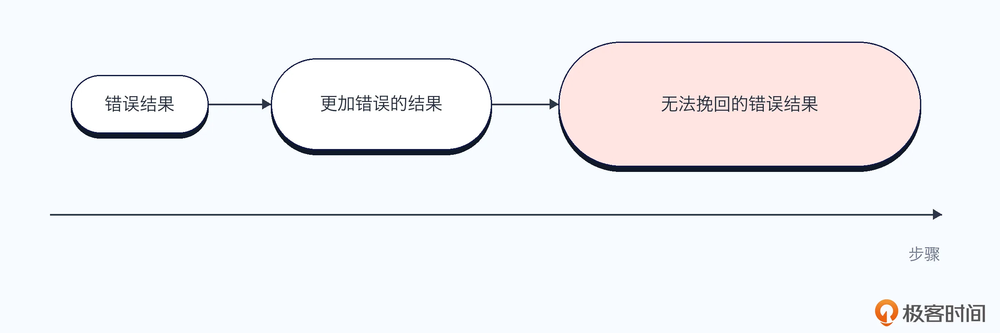
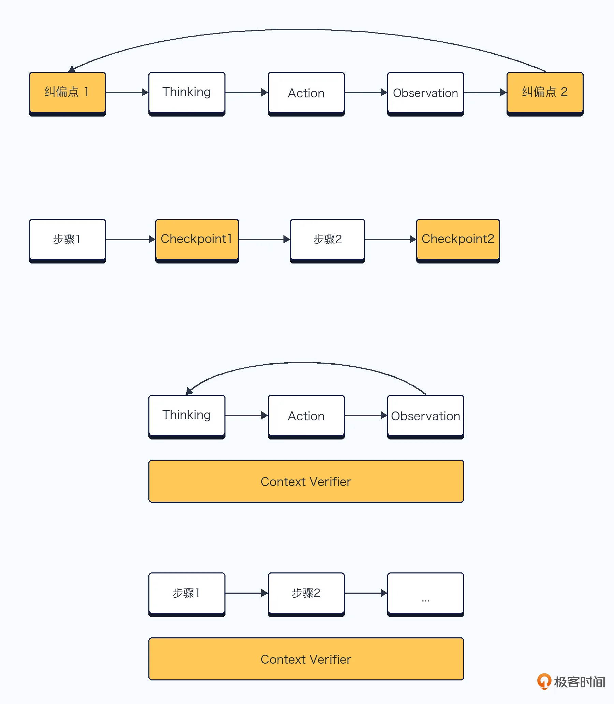
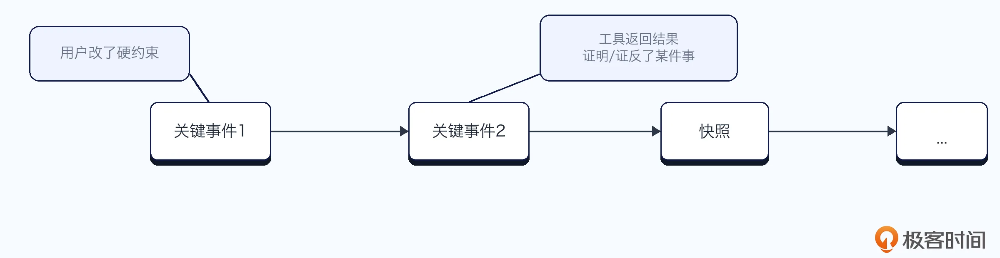

# 16｜对话/任务特别长长长……怎么办？
你好，我是大明。

前面我们已经讨论了上下文窗口里面应该放什么、怎么筛选、怎么压缩，也讨论了摘要之后如何把细节找回来，以及用户画像应该怎样长期维护。看到这里，你可能会觉得上下文管理已经讲得差不多了。但只要面试官继续追问一句：“如果这个任务要连续执行几个小时，甚至跨越几十轮对话，你的 Agent 怎么保证不跑偏？”很多人就会立刻卡住。

长任务是现在 Agent 面试里面非常高频的考点，因为它是一个真正的难点，也确实包括我在内的很多人都会在实践中受困于这个问题。但这个问题在面试中有一个好处，就是它能够一次性把 Plan、Replan、Checkpoint、上下文压缩、细节召回等全部串起来。有时候面试官也会用这个问题来试探你到底是真的做过 Agent，还是只会调用几次大模型，所以你要对这个问题保持警惕。

而在实践中，长任务同样极有意义。任务越长，产生的对话、工具结果、中间产物和执行状态就越多，Agent 也越容易忘记目标、忽略约束、混淆状态，最终一本正经地把任务做错。所以这一讲我们就来讨论：对话和任务特别长的时候，Agent 到底应该怎么办。

## 长任务到底难在哪里？

你最容易想到的答案，大概是步骤太多、工具调用太多、执行时间太长。比如说一个任务要连续调用十几个工具，中间还要经过多次检索、分析、生成和校验，那么任何一个步骤出错，都可能导致后面的步骤跟着出错。

这个回答其实也可以，不过过于聚焦在工具调用上了，而事实上长任务真正麻烦的地方，是 **它会不断产生新的信息**，工具调用只是表象。例如：

- 用户最开始提出的目标和约束，后面可能改了；

- Agent 生成的 Plan，后面可能用不了；

- 每一个步骤的输入、输出和执行状态，这些内容多而杂，搞不懂哪些要，哪些不要；

- 检索得到的证据，更是良莠不齐，信息驳杂，甚至于里面还有一些有害信息；

- 中间生成的文件、代码和结论；

- 执行过程中新增的要求、异常和修正信息。

上面仅仅是从信息本身描述，实际上还有一个复杂之处：信息之间的依赖关系。比如说前面某个不起眼的判断，可能会成为后面十几个步骤的前提；早期用户的某一句要求，也可能在任务末尾突然变成决定成败的关键约束。

因此， **信息多且依赖复杂是长任务出错的关键原因**。

当然，大模型自身的能力不足也会影响长任务执行。大模型可能推理错了、理解错了工具返回、错误地总结了中间结果，或者在十几个候选路径里面选了一条不好的路径。即便你将所有上下文都准确交给它，大模型也不一定能够稳定完成一个特别复杂的长任务。但是这个问题对于绝大多数 Agent 开发者来说，没有太大的讨论价值。

因为模型的推理能力不是你能够直接改变的。你最多换一个更强的模型，但不能要求自己把模型重新训练一遍。更何况，模型能力再强，也无法解决上下文窗口有限的问题。也就是说任务运行过程中产生的信息可以不断增加，但是大模型单次能够看到的内容始终存在上限。

当信息超过窗口之后，你就必须做出选择，哪些内容继续保留、哪些内容进行压缩、哪些内容存到外部、哪些内容暂时丢弃，以及后续需要的时候，怎样重新找回来。

这些都是我们前面讨论的内容，那么你显然也知道一旦选错了，Agent 就可能忘记原始目标、忽略用户约束、混淆执行状态、丢失判断证据，或者继续沿着一个错误的中间结果执行。任务越长，这些小问题越容易累积，最终从一个小偏差演变成整个任务彻底跑偏。

这就是所谓的千里之堤毁于蚁穴。

因此，长任务表面上是在考验 Plan、Replan、工具调用和大模型推理，实际上考验的是你能不能长期维护任务运行所需的上下文。所以我给出一个结论： **长任务问题，本质上就是上下文管理问题。**

只要上下文窗口有限，长任务 Agent 就一定会面临信息取舍。真正的区别只是：问题出现得早还是晚，严重还是轻微，能不能被发现，以及出错之后能不能恢复。

## 长任务中的各种“漂移”

从我听过的面试录音中，在面试中面试官一般只会问你如何解决“漂移”，而不会问你有哪些漂移。但是了解一下有哪些漂移会有助于理解最终的解决方案，下面我们具体看一下。

- **目标漂移：Goal Context 管理不善。** 比如用户让 Agent 修复一个空指针，并要求尽量少改代码。Agent 最后重构了几十个文件，还把接口改了，空指针反而没修好。

- **约束漂移：Constraint Context 管理不善。** 比如用户要求优化简历，但不能虚构。Agent 写着写着，擅自补上“千万级用户”和“十万 TPS”，还说这是合理推测。

- **状态漂移：Task State Context 管理不善。** 比如数据库迁移工具明确返回失败，Agent 却把步骤标记为成功，最后告诉用户：“迁移已经完成。”

- **证据漂移：Evidence Context 管理不善。** 比如 Agent 根据两年前的文档得出“SDK 不支持该功能”。后续原文被丢弃，它却坚称最新版同样不支持。

- **细节丢失：上下文压缩不当。** 比如用户原本说“A 接口绝对不能修改”，摘要之后却变成“尽量少修改”，Agent 于是直接改了接口。

- **错误累积：Observation Context 管理不善。** 比如 Agent 一开始把“累计用户数”看成“日活用户数”，后续缓存、Kafka、服务器配置全部基于这个错误数据计算，最终得到一份非常完整的错误方案。

这些问题表面上各不相同，但本质上都是同一件事： **Agent 没有持续、准确地维护长任务执行所需的上下文。** 这个论断和我之前说的“万物皆上下文”可谓是前后照应了。

其实就目前趋势来说，大模型即便能力越来越强，但如果上下文还是有限的，那么很多问题都可以归结为上下文管理不善。

## 基础解决方案

前面提到的各种漂移看起来很多，但是基础解决思路并不复杂： **不要让 Agent 一口气跑到最后，而是在执行过程中不断停下来，重新确认自己有没有走偏。** 也就是走一步看一步，还得检查一步。你可以理解为你有一个坑货同事，他做事情非常不靠谱，以至于你需要检查他的每一步产出。

具体怎么做，要看你的 Agent 使用的是 Plan 机制，还是 ReAct/TAO 这种循环式执行机制。当然，你要是使用混合形态，那么长任务的解决方案你也可以混合下面两个基础解决方案。

### Plan：通过 Checkpoint 定期校准方向

在 Plan 模式中，解决长任务漂移最基础的方式，就是设置 **Checkpoint**。

因为长任务不能在生成计划之后，就从第一步一路执行到最后。前面任何一个错误，都可能被后续步骤当成正确结果不断放大。

因此，在关键节点完成后，要暂停执行并检查：

- 原始目标有没有发生漂移；

- 用户的硬约束有没有被违反；

- 当前任务状态是否准确；

- 中间结果和证据是否可信；

- 原计划是否仍然适用；

- 是否需要 Retry、Rollback 或 Replan。

Checkpoint 不需要每一步都设置，否则会带来大量模型调用和 Token 开销。一般放在业务阶段结束、关键中间产物生成、高风险工具调用，以及被大量后续步骤依赖的节点之后。

这部分在前面的 Plan 章节已经详细讨论过。你只需要记住它在长任务中的核心价值： **Checkpoint 不能保证 Agent 永远不出错，但可以阻止一个小错误被后续几十个步骤不断放大。**

### ReAct Loop：每一轮都重新回答“我还差什么？”

Plan 的处理思路是提前规划，再通过 Checkpoint 定期校准。而 ReAct/TAO 的特点是走一步看一步，所以看起来两者差异还挺大的。

一个基础的 ReAct Loop 通常包含：Thought、Action、Observation。从循环的角度来说，你有两个点可以执行检查：

- 一轮循环开始的地方

- 一轮循环结束的地方：这里往往也就是 Observation 的地方。

检查的内容其实很有限，只查关键的几个维度：

- 目标判断：我当前要逼近的最终目标是什么？

- 状态判断：哪些事情已经完成，哪些还没有完成？

- 约束判断：当前 Action 是否违反用户的硬约束？

- 差距判断：我现在距离目标还缺少什么？

- 证据判断：上一轮 Observation 能否支持当前结论？

尤其要强调“还差什么”。很多 Agent 在拿到 Observation 之后，只会总结“我得到了什么”。但在 ReAct 循环里面，更重要的问题其实是这个 Observation 之后，还缺什么，后续要怎么获得。

例如Agent 要分析某家公司营收下滑的原因。第一轮调用工具查到营收下降了 20%。一个比较差的 ReAct 会思考：我已经获取到营收数据，接下来分析营收下降原因。

一个更加合理的 ReAct 应该思考：当前只确认了营收确实下降，但还无法确定原因。还需要查看销量、价格、成本、地区和产品线等数据，判断下降来自销量变化还是单价变化。

前者只是在跟随 Observation，后者则始终围绕 Goal 检查信息缺口。

我个人理解，ReAct 的本质就是不断补充信息，所谓的思考就是找数据缺口而已，所以长任务里面就是确保ReAct始终在补充有意义的数据。

Plan 依靠 Checkpoint 做阶段性校准，ReAct 则依靠每一轮循环持续校准。两者的形态不同，但核心思想是一样的： **长任务不能只向前执行，还必须在执行过程中反复确认目标、状态、约束和证据。**

## 高级解决方案

基础方案能够降低长任务跑偏的概率，但它依然偏被动，完全是等任务执行到 Checkpoint，或者 ReAct Loop 主动检查时，才发现上下文已经出了问题。从实践中来看其实也够用了，但是在面试中就显得有点弱了。所以对于更复杂的长任务，我们还可以进一步引入以下三种机制。

### 上下文健康检查与漂移检测

第一种思路，是引入一个独立的 **Context Verifier**，定期检查当前上下文是否已经发生漂移。你可以理解为它就是前面 Plan 固定位置 Checkpoint、ReAct 每个循环执行检查的异步化而已。对照着图示来看，你就能瞬间理解三者之间的异同点了。

检查的内容和前面也差不多，包括：

- 当前 Goal 是否偏离原始目标；

- 硬约束是否丢失或被弱化；

- Task State 是否与真实执行情况一致；

- 关键结论是否仍然有 Evidence 支撑；

- 当前窗口是否混入过期、重复或冲突的信息；

- Observation 是否被错误地当成确定事实。

- 其他任何你觉得有可能引起漂移的内容。

那么检测到问题之后怎么办？

检测到问题后，不要直接重新执行整个任务，而是输出漂移类型、影响范围和修复建议，例如重新召回上下文、修正状态、回滚或者局部 Replan。具体类型可以参考我前面列举出来的各种漂移情况。这些修复可以交给大模型，让大模型决定怎么做。

你可以把它理解成 Agent 的上下文“体检机制”。主 Agent 负责推进任务，Context Verifier 负责检查它有没有在不知不觉中跑偏。这种机制的关键问题是检查时机。检查太频繁，Token 和延迟会明显增加；检查太少，又可能等到错误已经扩散之后才发现。因此一般可以在阶段结束、上下文占用达到阈值、Replan 前后或者出现异常信号时触发。

这里我可以补充一下这种 Verifier 思路的通用性。单纯从面试的角度来说，你可以说你引入了各种 Verifier，比如说 Plan Verifier，用来检查Plan。我再次提醒你一下，很多著名的开源 Agent 里面充斥着这种异步执行的“任务”，包括但不限于上下文压缩、细节召回、上下文检查、任务纠偏、证据保存与检查等。

### 事件溯源与可信快照

第二种思路，是不要只维护一份不断被覆盖的当前状态，而是记录长任务执行过程中发生的关键事件。例如：

- 用户新增或修改了一条约束；

- Agent 完成了某个步骤；

- 工具返回了一份 Observation；

- 某个事实被确认；

- 某个旧结论被推翻；

- Replan 修改了哪些步骤；

- ……

举个例子，如果你当前的硬约束中有一条“用户预算 5000 块”，那么你应该能够在长任务执行过程中的关键事件里面找到类似用户输入“我的预算是 5000块”这种内容。

这些事件按照时间顺序保存，并且可以在关键节点生成一份可信快照。当前任务状态可以通过“最近一次快照 \+ 后续事件”重新构建。这样做的最大价值是可追溯。关键点你可以参考前面讨论的内容，将阶段的结束、里程碑达成之后、关键 Action 执行之后等认定为关键节点。

一旦发现 Agent 跑偏，就可以定位究竟是哪一次状态更新、摘要压缩或 Observation 解释引入了错误，而不是只能面对一份已经被污染的当前上下文猜测原因。

恢复时则回到最近一个可信快照，丢弃后续被污染的状态，再重新执行受影响的步骤。

这种机制特别适合解决状态漂移、证据漂移和错误累积，但工程成本也更高。你需要设计事件结构、快照生成时机、状态重建方式，以及哪些旧事件可以过期或归档。但是它不仅可以用在这里纠偏，也可以用在 Replan 等地方，还是挺有价值的。

反正都是 AI 写代码，何妨一试呢？

### 分阶段执行与上下文交接

第三种思路，是避免让同一个 Agent 携带全部历史执行完全部任务。这种思路违背了“优先使用单 Agent 原则”，所以慎用。这个思路是将长任务拆成多个阶段，例如需求分析、信息收集、方案生成、执行、验证。

每个阶段只使用与自己相关的局部上下文。阶段结束之后，不直接把全部历史对话和工具结果交给下一阶段，而是 **生成一份结构化的上下文交接信息**，主要包括：

- 当前总目标；

- 已完成的工作；

- 已确认的事实；

- 仍然有效的硬约束；

- 关键证据及其索引；

- 未解决的问题；

- 下一阶段需要的输入。

大量临时 Observation、失败尝试和局部推理过程可以留在原阶段，需要时再检索召回。

这种设计的本质，是将一个不断膨胀的大上下文，拆成多个边界清晰的小上下文，同时通过交接协议保持任务连续性。它很适合和 Plan、DAG 以及多 Agent 协作结合。

真正的难点是交接粒度：交接内容太少会丢失关键细节，太多又会重新退化成把所有内容塞进上下文窗口。所以这时候你可以考虑引入另外一个兜底机制，就是在下一阶段发现内容不足的时候，重新从上一阶段里面召回细节。

这三个方案并不冲突。实践中完全可以组合使用：

1. 分阶段控制上下文规模；

2. 事件溯源保存完整执行历史；

3. Context Verifier 定期检查当前上下文是否发生漂移。

这也就是一个综合的最终的混合方案。这样一来，即使长任务仍然会出错，系统也能够更早发现、更准确定位，并从最近的可信状态恢复。

## 总结

这节课针对长任务漂移，我给出了两层解决方案，无论你采用哪种方案，长任务管理的目标都不是追求“永远不出错”——这不现实。真正有价值的是： **更早发现漂移、更准确定位原因、更快从可信状态恢复。** 做到这三点，长任务的可靠性就有了基本保障。

最后，我再给你讲一个真事儿：一个小伙伴拿着我教的话术和方案去面试，面试过程中，这个面试官不按套路出牌，说“长任务漂移的解决，关键是恢复”，他一时也不知道说什么好。所以你在最终面试的时候，遇到这种长任务问题的时候，要记得提起可恢复，而且最好是从中间的某个可信状态恢复，说他们想说的话，让他们无话可说。

在面试过程中，你可以酌情在自我介绍、项目介绍的时候强调一下自己解决过长任务漂移的问题。大多数时候面试官在听到你这么说的情况下，都会问问你解决方案，这时候就可以展示我刚刚说的两个方案了。

## 思考题

这节课我们提到长任务的本质是上下文管理问题。如果未来大模型的上下文窗口扩展到了 1000 万 token 甚至无限长，长任务的漂移问题是否就自动解决了？为什么？请从信息质量、依赖关系和推理能力三个角度分析。欢迎你把你的想法分享到留言区，如果你有所收获，也欢迎你分享给需要的朋友，我们下节课再见！