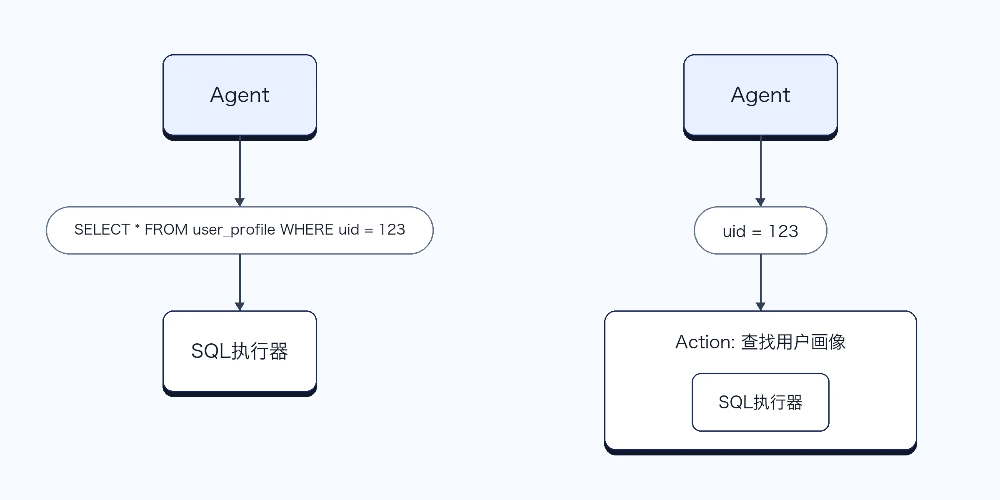
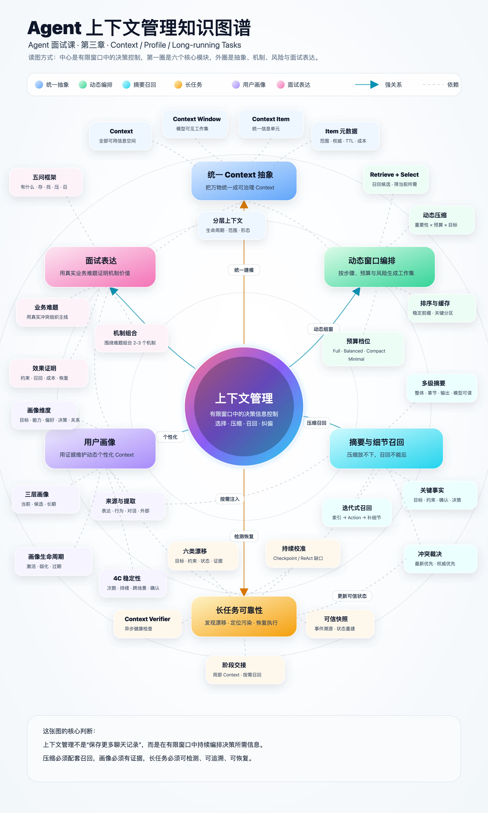

# 17｜如何设计一个面试中富有竞争力的上下文管理机制？
你好，我是大明。

前面几讲，我们陆续讨论了分层上下文、上下文窗口编排、摘要压缩、细节召回、用户画像以及长任务处理。

那么现在问题来了：这些东西怎么组合起来，形成一套面试中富有竞争力的上下文管理机制？

一般来说，很多人在面试中聊到上下文管理，只能提到短期记忆、长期记忆和滑动窗口算法，比如说常见的套路就是：

- 最近几轮对话直接放进 Prompt；

- 更早的对话做摘要；

- 长期记忆放进向量数据库；

- 用户再次提问的时候，从向量数据库里面检索几条；

- 如果上下文太长，就截断前面的内容。


但是如果只有这些，无法在面试中赢得竞争优势。它的问题是，这套回答只能证明你知道上下文窗口有限，也知道向量数据库，但是无法证明你真的构建过复杂 Agent。

如果你求职的薪资比较高，那么你就更加要小心面试官的夺命连环问：

- 为什么这些内容要放进窗口？

- 为什么另外一些内容不放？

- 用户的硬约束怎么保证不丢？

- 摘要丢掉了细节怎么办？

- 检索出多条互相冲突的内容怎么办？

- 用户今天说喜欢苹果，明天又说不喜欢苹果，你的画像怎么更新？

- 你怎么知道自己的上下文管理策略有效？


所以，一套有竞争力的上下文管理机制，不能只回答“上下文存在哪里”，而要回答一个更加完整的问题，即： **什么内容，应该在什么时间，以什么形式、什么粒度和什么顺序，进入当前的大模型窗口？**

这才是上下文管理真正要解决的问题，也是你在面试中赢得竞争优势的关键点。

我们先来看最基础的面试策略。

## 基础面试策略

基础方案不需要讲得特别花哨。你只需要围绕五个问题展开：有什么、怎么存、怎么找、怎么压缩、怎么召回。

很多人在面试上下文管理的时候，上来就说：我们短期记忆放 Redis，长期记忆放向量数据库。你这样就过于简略了，毕竟一般的人就算没有做过 Agent 也能说上几句。

你的重点是围绕下面几个问题来整理你的面试方案，千万不要糊弄，不然面试官一旦问细节你的面试就挂了。

### 第一个问题：你的 Agent 里面有什么上下文？

你不需要像前面的章节一样，把所有 Context 分类重新介绍一遍。面试的时候，结合自己的业务，挑出最核心的几类就可以了。比如说如果你是电商 Agent，那么你可以介绍：

- 当前会话和历史对话；

- 用户画像和商品偏好；

- 当前用户目标和预算约束；

- 商品候选集和商品知识；

- 当前 Plan、执行步骤和中间结果；

- Action 执行结果；

- 用户已经确认或者否定过的关键事实。


这里最重要的不是分类有多么专业，而是让面试官意识到你的上下文不只是聊天记录，还包括用户、任务、约束、知识、工具结果和运行状态。

有些人出去面试说到上下文，只会说有历史聊天记录，这就显得不够深入了。如果你能精心设计一个比较特殊的上下文内容，例如在社交情感类的 Agent 里面引入有关情绪相关的描述，就显得你很懂业务了。

### 第二个问题：这些内容分别怎么存？

其实说白了，怎么存就是在内存、Redis 和持久化数据库中选两三个而已。正如之前我提到的，你大多数时候可以将短期记忆看做是长期记忆在 Redis 中的缓存，所以本质上就是你的 Agent 只有上下文，没有记忆这种东西。

不过你在回答的时候可以说得高级一点，比如说回答根据内容的结构和生命周期，使用不同的存储方式。而后你再举一些例子：

- 当前会话、当前任务状态放在 Redis 或运行时状态中，也会被持久化。

- 用户画像、关键事实、约束和任务状态放在 MySQL，也会被缓存到 Redis 中。

- 历史对话、Agent 输出和大型工具结果放在 ES 或向量数据库……


你可以稍微拔高一下，即强调存储层和上下文窗口不是一回事。数据库里面可以存很多东西，但是每次调用大模型的时候，只会从里面选择一小部分内容。

### 第三个问题：这些上下文怎么找出来？

基础回答也不需要搞得特别复杂，你只需要说自己根据不同内容使用不同的查询方式：

- 存内存，必然是本地缓存那种 GET 接口。

- 存 Redis，那差不多就是适用 Redis 的命令。

- 存 MySQL，基本上就是 SQL 了。例如在找用户画像的时候，大概率就是 WHERE uid = xxx 这种查询。

- 存 ES，要注意撰写 ES 的查询语句。在细节召回这种场景下，可能需要大模型来帮你撰写 ES 查询语句，至少也要大模型来撰写召回细节的关键字。

- 向量数据库，类似查询 ES，都要考虑借助大模型的力量来撰写查询语句。


但是我一般也不建议你借助通用的如SQL 执行器之类的工具来查找，而是建议你额外进行一个封装，如图：



最为关键的就是，你得证明你的检索不是简单的“用户输入向量化后 Top-K”。

### 第四个问题：上下文太长了怎么办？

基础方案里面，不需要详细讨论多级压缩算法。你只需要讲清楚两个原则。

第一个原则是，不同内容采用不同的处理方式。你可以举例子，比如说硬约束这种东西是不管你的上下文多长，都是要保留的。

第二个原则是，压缩不能一刀切。毕竟有些内容丢失只是让回答差一点，有些内容丢失则会直接导致任务失败。

你可以在面试中强调你会区分普通上下文和关键上下文。目标、硬约束、任务状态和关键证据会独立维护，不会完全依赖对话摘要。而后你在这个过程补充一下最普通的滑动窗口算法就足够了。

### 第五个问题：压缩之后怎么找回细节？

这一点是基础方案里面最容易体现竞争力的地方。很多人做到摘要就结束了，你需要再往前走一步，阐明所有被压缩的内容都保留原始数据和索引。当摘要不足以支持当前推理时，可以重新召回原始细节。

而后你可以举例子说明这个点，比如说最典型的就是召回对话内容中用户提到的预算上限。当然理论上你应该在关键事实中有保留的，你还记得我说过，如果你关键事实做得好的话，大部分时候你都没啥细节要召回的。

### 小节

整个基础方案你可以参考这个话术来做基本介绍，后续就可以等面试官问细节了。

```
我们不会简单地把所有历史对话都放进 Prompt，而是会先将上下文拆成用户信息、目标和约束、任务状态、历史对话、知识内容以及工具结果等几类。根据数据结构和生命周期，分别存放在运行时状态、Redis、MySQL、ES、向量数据库和对象存储中。
每次调用大模型之前，会根据当前意图和执行步骤，通过结构化查询、关键词检索和向量检索找出候选上下文，只选择当前任务真正需要的内容进入窗口。窗口不足时，普通历史对话会摘要，工具结果会抽取关键字段，但是目标、硬约束和关键任务状态会独立保留。
同时，摘要和压缩不会删除原始数据。当当前摘要不足以完成指代消解、事实判断或者错误定位时，会重新召回原始对话、工具结果和中间产物。
```

## 高级面试策略：围绕一个业务问题，设计独特机制

记住你的面试只需要有一两个高级策略就够用了。当然你要是工作年限很高，或者带了团队，那么多用两三个也无妨。例如，你在面试中说：“我们有用户画像、分层上下文、动态筛选、动态排序、动态压缩、细节召回、RAG、多臂老虎机”，就有点像是背技术名词。

更加合适的是找到一个具体的业务难题，再围绕这个难题，把两到三个上下文机制组合起来。

- 窗口动态编排：根据实时运行的情况来决定放什么以及放到什么为止

- 用户画像提取、适用，重点在两个地方，建模以及识别偶然的偏好变化。

- 长任务的解决方案，尤其是重点讨论漂移问题。在这个过程你可以混入 Plan 和 ReAct 的混合形态，再引入几个异步运行的东西，比如说摘要提取、漂移检查等。

- 摘要和细节召回的特殊机制：可以重点讨论你的分层摘要机制，以及配合这个机制的细节召回算法。


我最推荐的就是这个问题： **在有限上下文窗口中，如何既保留稳定的用户偏好，又适应用户临时变化，同时避免压缩后丢失关键细节？**

这个问题可以自然串联起用户画像、动态上下文编排、多级压缩、细节召回这些内容。或者说，用户画像提供个性化信息，分层上下文负责组织全部信息，动态编排决定本轮放什么，差异化压缩解决窗口不足，细节召回负责找回压缩过程中丢失的内容。

这是一个可以参考的例子：

```
在我们的电商 Agent 里面，用户画像不是一个简单的静态标签，而是分成当前会话、中期和长期。用户新表达的偏好先进入短期层，我们会根据出现频率、持续时间、跨场景一致性以及点击、收藏、购买等行为证据，判断它是否应该升级为长期画像，避免将用户的一时兴起误判成稳定偏好。
每次推荐之前，系统会根据当前商品品类、用户意图、Plan 步骤和剩余 Token，从不同层级画像、历史对话、行为记录和商品知识中生成候选上下文，再按照相关性、重要性、新鲜度、证据强度和 Token 成本进行筛选。
如果上下文窗口比较紧张，会对不同内容采用不同压缩粒度。当前预算、硬约束和用户明确确认的偏好保留原文；长期画像保留结构化结论；普通历史行为只保留统计摘要；低相关内容则只保留召回索引。
当短期画像和长期画像冲突，或者摘要不足以解释用户当前选择时，Agent 会主动触发细节召回，从历史对话、行为记录和画像证据中重新查找原始内容，再判断这是长期偏好变化、场景差异，还是一次性的临时兴趣。如果仍然无法确定，就向用户澄清，而不是直接覆盖画像。
```

仅供参考，你要准备自己的故事。

## 总结

上下文有关的面试，你千万不要只谈长期记忆、短期记忆，这个东西已经没有太多竞争力了。你要做的就是在这个基础上进一步深入讨论你的上下文，要先从最基础的问题有什么、怎么存、怎么取讨论起，进而讨论怎么压缩，怎么做细节召回。

而后这些还不足，你就要考虑设计一些独特的机制，本模块讨论的比较深入的话题比如说动态编排、用户画像、长任务、分级压缩和细节召回都可以用来刷亮点。

最后，别忘了准备好话术、故事来介绍你的机制。

## 附录

下图是汇总了上下文管理这一章节重要知识点的知识图谱，供你回顾复习，另外我也在附件里放置了面试题和案例模版，供你学后自检。（注：附件只能在PC端下载，手机端不支持）

