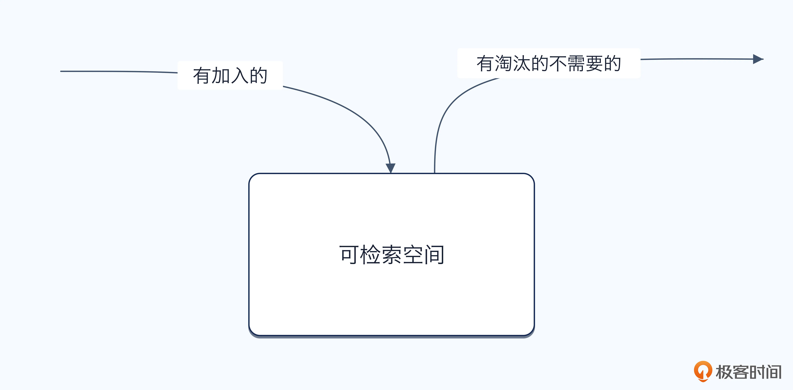
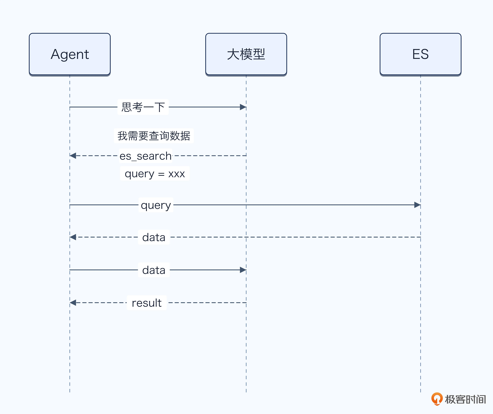
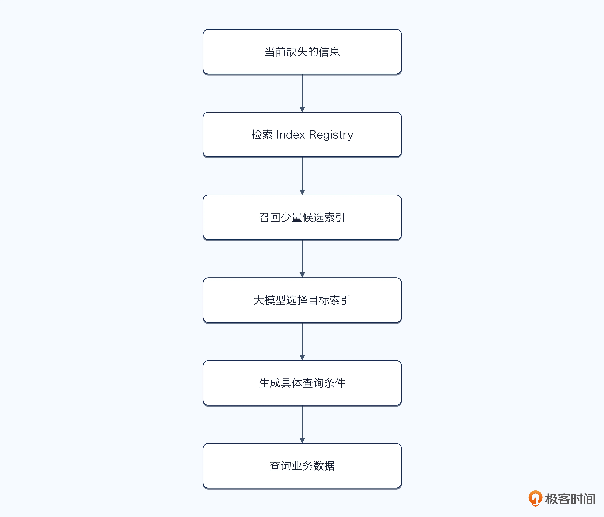
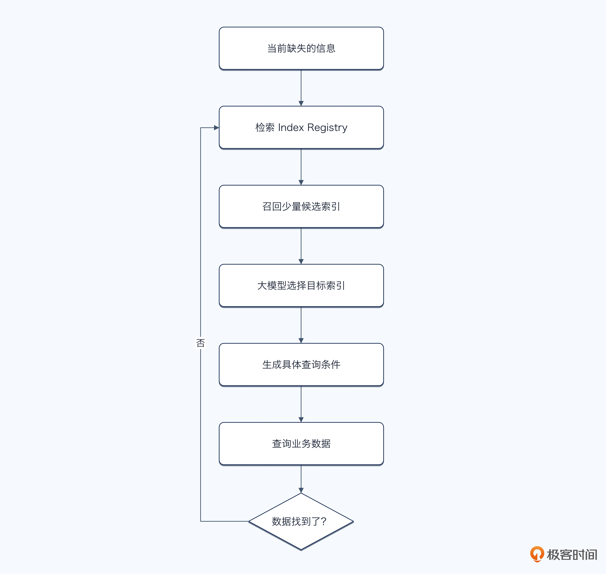
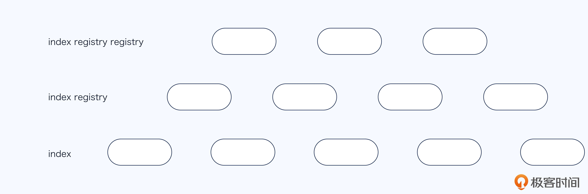
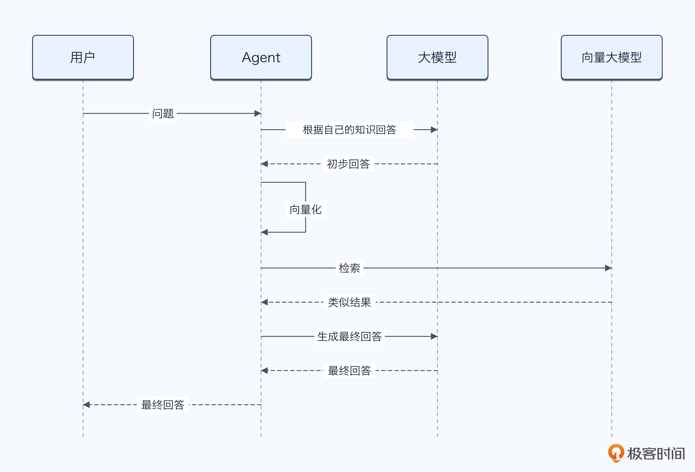
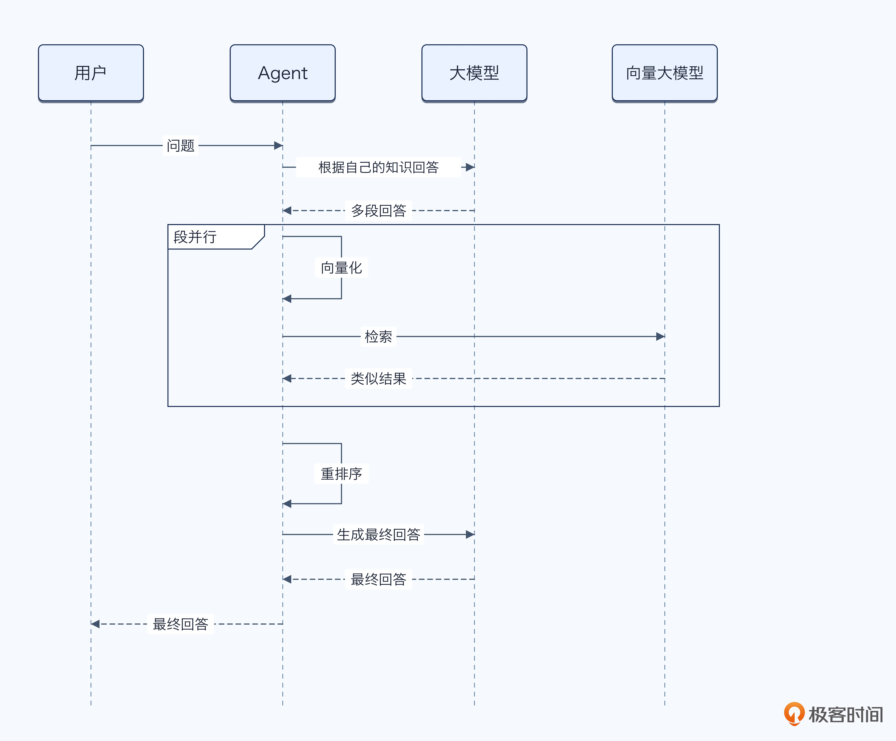
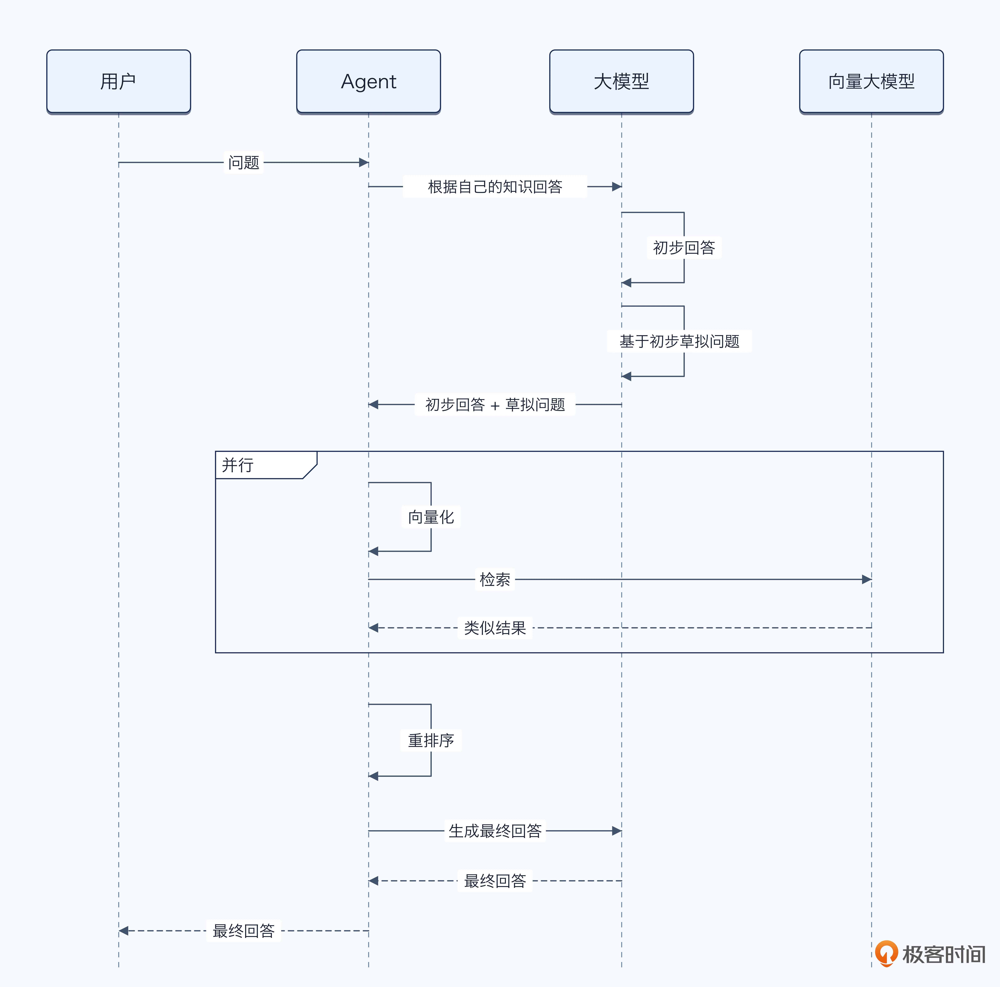

# 18｜别只答 RAG：教你设计 Agent 的信息检索机制
你好，我是大明。

从这一讲开始，我们正式进入 Agent 面试里面一个非常重要的话题： **检索**。

一提到检索，很多人的第一反应就是 RAG；一提到 RAG，又立刻想到 Chunk、Embedding、向量数据库、Top-K、BM25、Rerank。

但事实上， **RAG 只是 Agent 检索中的一部分。**

只要 Agent 稍微复杂一点，就会遇到大量“需要去找东西”的场景：知识库问答需要 RAG，摘要压缩之后需要召回历史细节，用户说“刚才那个方案”可能需要检索之前的对话，长任务执行过程中还可能需要重新查找工具结果、中间产物、Checkpoint，甚至查询外部实时数据。

所以面试官问“你们的检索怎么做”，如果你只回答：

> 文档切片之后生成 Embedding，存到 Milvus，查询时向量召回 + BM25，再用 Reranker 排序。

这个答案当然没错，但实在太标准了。现在随便找一篇 RAG 教程，基本上都有这一套流程，很难体现你真正解决过复杂的 Agent 检索问题。

真正值得讨论的问题其实是：

- 什么时候需要检索？

- 到底要查询什么？

- 应该去哪里查询？

- 一次没查到怎么办？

- 查出来太多又该怎么办？


所以这一部分我们讨论的不是“怎么做一个 RAG”，而是 **怎么设计 Agent 的整个信息检索机制**。

这一讲，我们先从最基础的问题开始：

- **查询什么？**

- **去哪里查询？**


## Agent 怎么知道应该查询什么？

我们先来看第一个问题：Agent 怎么知道自己应该查询什么？

这个问题其实包含两个层次。

- 第一个层次，是你作为开发者，在设计 Agent、Action 或者具体业务流程的时候，要决定某一个环节 **需不需要查询**。

- 第二个层次，是 Agent 在运行过程中自己思考：当前信息够不够？要不要发起查询？如果要查，具体应该查什么？


第一个层次的问题很好解决，作为一个 Agent 开发者，你可以自己思考业务场景，也可以跟产品、甲方沟通，确定他们需要 Agent 解决的问题在当前步骤下应该考虑什么因素，进而决定应该查询什么。

关键就在于第二个层次，你得教会 Agent 思考需要查询什么内容。而问题的答案，说起来就是一句话：让 Agent 缺什么就去查什么。所以问题就变成了， **Agent 怎么知道自己缺什么呢？**

最简单粗暴的做法是直接拿用户输入去检索。比如说用户问：“这个框架适合生产环境吗”。但是如果你真的直接拿着这个语句去检索，几乎不会得到任何有效信息，毕竟连“这个”代词消解都没做。

因此一种比较好的做法是，让 Agent 问自己一个问题：“为了完成这个目标，我还缺乏什么信息？”。当然了，问这句话的前提是，先识别出了用户的目标，也就是我们 [第 11 讲](https://time.geekbang.org/column/article/1002724?utm_campaign=geektime_search&utm_content=geektime_search&utm_medium=geektime_search&utm_source=geektime_search&utm_term=geektime_search "") 提到的 Goal Context。

这里可以给出一个基本的步骤模板，后续你的 Agent 都可以参考这个步骤来思考。

- **第一步：明确当前要做出的判断**。查询是手段而不是目的，查询是为了支持后面的某个判断或者动作。例如用户问：“LangGraph 适不适合我们的客服 Agent？”，对应的目标你至少应该解析为“LangGraph 是否满足该客服 Agent 的生产要求”。也就是 Agent 明确了一个适不适合的标准 —— 符合生产要求。

- **第二步：推导完成判断所需要的证据**。从前面的例子来看，也就是要细化符合生产要求的细则，比如说生产环境需要支持任务中断和恢复，那么就意味着 Agent 需要从 LangGraph 里面找到有关任务中断和恢复的功能点。

- **第三步：区分已知和未知**。假设现在 Agent 已经知道用户公司的技术栈是 Python，就不必再问用户是不是用 Python 了。那么缺少的信息可能就是 LangGraph 是否真的支持任务中断和恢复。

- **第四步：判断这个缺口是否值得查询**。这也是一个误区，总有人认为数据缺少了我就一定要去查询，其实也不一定，有些信息根本不重要，或者不影响后续流程。大多数时候你都可以默认值得查询，只有在资源不足、快要超时的情况下，可以考虑不去查询。不查询的机制也可以看做是一种降级机制。


整个流程可以简化为：


## 怎么知道去哪里检索？

前面我们解决了“要不要查询”和“应该查询什么”的问题，接下来还有一个同样关键的问题： **我知道自己缺少什么信息，但是我怎么知道应该去哪里找**？

举个例子，用户说：“我的退款为什么还没到账？”，如果这时候 Agent 跑去企业知识库里面检索《退款到账时间说明》，当然能召回一大堆相关内容。但是用户真正需要的是这一笔退款的实时状态，这个信息在退款系统或者支付系统里面。

这就是所谓的查询空间，也就是当前 Agent 理论上能够从哪些地方获得信息。不只是向量数据库，还可能包括特定 Action、ES 索引、业务数据库、历史对话、用户画像、代码仓库、日志、Trace、外部搜索，以及 Agent 自己产生的中间结果。

这里还有一个更加重要的问题： **可查询空间不是固定的，而是会随着任务执行不断变化**。比如说第一轮查询退款记录之后，Agent 发现退款服务已经处理成功，但支付渠道仍在处理中，那么下一轮的可查询空间就应该从退款系统扩展到支付系统。如果又发现支付渠道返回了银行错误码，那么还需要加入错误码文档、账户信息和渠道规则。

同样，Agent 在执行过程中产生的可信中间产物，也可以重新进入可查询空间。例如已经确认的事实、检查点结果、失败原因、用户认可的结论，都可以保存下来，供后续任务继续查询。

因此，更准确的说法不是“Agent 有哪些知识库”，而是 **Agent 会根据当前目标、已有证据和最新 Observation，动态收缩、扩展或者切换可查询空间**。



不过你也不要被可查询空间给吓住了，因为这些数据说到底就是要放到内存、Redis、持久化存储中的，所以绝大多数时候“去哪里检索”都有几种固定的套路，下面来看看。

### 有些 Action 天生就提供特定信息

这也是我在设计 Action 的时候强调的，Action 本身应该被看做一个业务的完整操作。换到这里，就是说 Action 应该是返回特定信息的。比如说，绝大多数 Agent 都有的用户画像 Action，它就是负责加载用户画像。至于你是要全量用户画像，还是只要部分用户画像；你是去 Redis 加载，还是去 MySQL 查询，都是这个 Action 自己解决的。

所以这种情况下，基本上就是将候选 Action 传递给大模型，而后大模型选择特定的 Action。

这里我推荐一个比较好的实践：如果某一种信息只能由特定 Action 提供，那么应该优先通过规则或者业务流程直接绑定，而不是让大模型在几十个工具里自由猜测。

只有在“这个信息可能存在于多个地方”的时候，才需要 Agent 进一步判断。比如说“某个接口为什么报错”，它可能要查询代码、日志、Trace、配置或者历史变更。此时才适合让 Agent根据当前状态动态选择查询路径。

### 使用 ES，首先要知道索引里面有什么

你可能觉得正经人谁用 ES 来做检索，但其实很多人因为技术栈或者人才培养，真的在用 ES 做关键字检索和向量检索。所以我这里单独把它拎出来讲。

现在假设 Agent 不是调用一个边界明确的业务 Action，而是要在 ES 里面查询。很多人会给 Agent 提供一个工具：search(query)，大模型在使用这个工具的时候，就需要生成 ES 的查询语句，而后调用这个工具获得所需的信息。

整个过程如图：



但这里有一个非常明显的问题：ES 里面可能有几十个甚至几百个索引，Agent 怎么知道应该查哪个？

有一个办法：在让 Agent 查询 ES 之前，需要先建立一份 **索引说明**，也可以叫做 Index Profile 或 Index Registry。这里我给出一个参考设计：

字段

说明

index\_name

索引名称

description

索引存储了什么

suitable\_for

适合解决什么问题

not\_suitable\_for

不适合解决什么问题

fields

关键字段

query\_modes

支持的查询方式

freshness

数据时效性

authority

数据权威性

permissions

所需权限

update\_frequency

更新频率

下面是一个具体的例子，有关退款的索引：

```
{
  "index_name": "refund_records",
  "description": "存储用户退款申请及支付渠道处理状态",
  "suitable_for": [
    "查询退款是否成功",
    "查询退款为什么没有到账",
    "查询退款失败原因"
  ],
  "not_suitable_for": [
    "查询商品是否允许退款",
    "查询公司的通用退款政策"
  ],
  "fields": [
    "order_id",
    "user_id",
    "refund_status",
    "refund_amount",
    "channel_status",
    "failure_code",
    "created_at",
    "updated_at"
  ],
  "freshness": "near_real_time",
  "authority": "refund_service",
  "permissions": ["refund_read"]
}
```

这个例子不是很恰当，因为它可能更加适合封装成特定的 Action，不过你可以参考里面的 JSON 设计。

这个问题并不只存在于 ES，换成 Milvus、Pinecone、Weaviate、Qdrant 或者其他向量数据库，本质上是一样的。只不过在向量数据库里面，索引可能被称为 Namespace、Collection、Dataset、Knowledge Base。

还有一种罕见的做法是将所有的数据都塞进向量数据库的一个索引里面，而后通过 Metadata 之类的区分，不过我不太建议这么做，只是提供这样一种思路。

紧接着你就应该能想到一个问题，如果我索引非常多，几百个几千个，该不会上下文也放不下吧？

## 索引说明也放不进上下文怎么办？

如果整个系统只有三五个索引，那么处理起来非常简单。你可以把所有索引的介绍直接放进 System Prompt，比如说：

```
当前可以查询：
1. product_docs：商品文档...
2. order_records：订单信息...
3. refund_records：退款记录...
```

大模型看完之后，选择一个索引就可以了。但随着 Agent 能力不断扩展，你可能会遇到几十个甚至几百个索引，而且索引的字段也会膨胀。如果将这些内容全部塞进 Prompt，很快就会遇到两个问题：

- 上下文窗口放不下；

- 即使放得下，大量相似索引也会干扰大模型判断。


这时候就需要引入一个非常有意思的机制： **先检索索引，再检索数据**。也就是说，在真正查询业务数据之前，先从所有索引中找出最可能包含答案的候选索引。



这里第一次检索查的不是业务数据，而是 **索引的说明**。这个过程可以进一步演化为循环式的：



这种循环式的检索能够有效应对召回候选索引不准确的问题，但是要注意控制最大循环次数，以及在每一次召回候选索引的时候，都要召回不同的候选索引。

召回候选索引这个步骤，有很多实现方式：

- 索引说明本身直接存入到 ES，通过关键字检索召回；

- 索引说明本身也可以向量化，通过向量检索召回；

- 索引本身可以打上标签，例如 order\_idx 被打上订单标签，后续如果需要订单有关的数据，就会召回 order\_idx 作为候选索引。

- 还可以通过业务域划分、意图划分、权限等信息对索引进行划分，在不同的情况下召回不同的索引。


在特别复杂的情况下，你还可以考虑将索引做成一棵索引树，层层筛选，下面是一个示例。



我觉得这个设计过于夸张了，可能你有几千几万个索引的时候才用得上。

我们在前面讲上下文的章节提到过动态编排机制，如果你会举一反三，就很容易得出结论：候选索引数量本身也可以是动态调整的。比如在剩余窗口还很大的时候，就传入 10 - 15 个候选索引；而在剩余窗口比较小的时候，就只传入 3-5 个候选索引。你可以把这个做成你面试方案亮点之一，毕竟数据稍微多一些的公司就要开始考虑解决这个问题了。

## 查询改写的复杂方案

查询改写的基本解决方案就是调用一下大模型，而后要求大模型输出改写后的查询。因此关键就在于撰写 Prompt 并且提供详细的改写规则。

这个问题其实很像用户输入规范，因此在用户输入规范里面讲的代词消解、句子补全、病句修改之类的内容在这里都是适用的。

然后我们要进一步结合查询改写这个特殊的场景来撰写规则，这里是一些可参考的规则：

**规则**

**描述**

保留硬约束

不得在改写过程中遗漏用户明确提出的限制，例如预算上限、排除品牌、不能修改接口、只能查询当前租户数据

提取软偏好

保留“更便宜、稳定一点、适合生产、更加高级”等偏好，并尽可能转换为可查询、可比较的指标

消除歧义

对于多义词、缩写、内部黑话和同名实体，要结合当前领域、历史对话和用户画像确定具体含义

统一术语表达

将用户口语、别名和非标准说法，转换为数据源中常见的标准术语、字段名称或者领域关键词

删除无关信息

去掉情绪表达、重复描述、寒暄和与当前检索目标无关的背景，避免这些内容干扰召回

从问题转向信息缺口

不要只是复述用户原话，而要根据当前已知信息，改写成真正需要补齐的证据。例如从“这个框架怎么样”改为查询稳定性、恢复能力和生产案例

增加过滤条件

根据当前上下文补充用户 ID、租户 ID、订单号、项目 ID、环境、时间范围和数据类型等 Metadata，缩小查询范围

禁止擅自补充事实

可以补全上下文中已经确认的信息，但不能为了让 Query 看起来完整，就加入没有证据支持的实体、时间和结论

检查查询可执行性

改写之后要确认目标索引或 Action 是否存在，字段是否支持查询，过滤条件是否合法，权限是否满足

控制查询粒度

Query 不能过于宽泛，也不能加入太多无关条件。一次查询最好围绕一个明确的信息缺口展开

设置停止条件

明确查询到什么程度就算足够，避免已经获得关键证据之后仍然继续无意义地扩大检索。这个在迭代式检索中才需要使用，一次性查询用不到

当然，在一些复杂的场景下，你需要一些更加复杂的查询改写机制。

### HyDE：先生成一份“可能的答案”，再拿它去检索

这里所说的 **HyDE**，全称是 **Hypothetical Document Embeddings，假设文档嵌入**。有些人也会把它叫做自问自答。它的核心思路不是直接拿用户原始问题去做向量检索，而是先让大模型根据问题生成一份“假想的答案文档”，再将这份文档向量化，用它去召回真实文档。

HyDE 将查询拆成了生成假设文档和基于文档向量进行相似度检索两个阶段。例如用户问：LangGraph 适不适合生产环境？

直接将这句话向量化，能够表达的信息非常有限。因为它只有“LangGraph”“生产环境”几个关键词，没有描述什么才叫适合生产。HyDE 让大模型根据自身已有的知识生成一份假想答案，比如说：

```
LangGraph 适合需要维护长期状态的复杂 Agent，
通常需要考察状态持久化、Checkpoint、中断恢复、
人工介入、并发执行和可观测性等能力……
```

而后将这段假想文档向量化，再去检索知识库中的官方文档、框架说明和技术资料。

这里的关键点是：真实文档通常以“陈述答案”的方式写作，而用户 Query 通常以“提出问题”的方式表达。HyDE 生成一份接近答案形态的文档，可以缩小问题表达与目标文档表达之间的语义差距。

整个流程如图：



你要注意，HyDE 生成的假想文档不是真实答案，其中可能包含错误甚至虚构的细节。它的作用只是帮助 Agent 定位语义相近的文档，不能直接作为最终证据。因此在实现时，可以要求大模型重点生成：

- 目标文档中可能出现的核心概念；

- 标准术语和相关实体；

- 可能涉及的属性、过程和判断维度；

- 与当前信息缺口相关的答案结构。

- 避免生成过多具体数字、版本号和确定性事实，防止错误细节反过来干扰召回。


在 HyDE 上，还有一些变种。第一种是HyDE 不是生成一个简单的回答，而是生成多段回答，每一段都可以用于检索，而后最终重排序所有检索到的文档，找出相关性最强的文档。如图：



第二种是 HyDE 可以在初步回答之后，针对这个初步回答草拟一系列问题、查询语句。比如说典型的就是先生成一个简单的回答，而后针对这个回答里面提到的各种名词，进一步提问。这个做起来不难，就是 Prompt 里面额外要求大模型针对初步回答进一步提问而已。如图：



所以，HyDE 本质上也是一种查询改写，只不过它不是将一个问题改写成另一个问题，而是 **先假设理想答案大概长什么样，再拿着这份假想答案去寻找真实证据。**

它非常适合于两种场景：

- 用户输入含糊，信息量太少；

- 用户表达和存储的数据差异明显。


### 5W1H：将模糊问题拆成可查询的问题

对于一些复杂问题，单纯做查询改写还不够。例如用户问：为什么我的退款还没有到账？你当然可以将它改写成“查询指定订单退款未到账的原因”，但是这个 Query 依旧比较宽泛。它没有告诉 Agent 应该查询哪些事实，也没有指出问题可能发生在哪一个环节。

这时候可以借鉴一个非常经典的问题分析方法： **5W1H**。

所谓 5W1H，就是从 What、Who、When、Where、Why 和 How 六个维度分析问题。在检索场景中，它的价值在于帮助 Agent 发现当前缺少哪些信息，并将一个模糊问题拆成多个能够独立查询的子问题。

具体来说：

- **What：发生了什么？** 明确要查询的对象、事件和状态。例如退款当前是申请成功、审核中、支付处理中，还是已经失败。

- **Who：涉及谁？** 确定相关用户、订单、商品、服务、系统或责任主体。例如是哪一个用户、哪一笔订单、哪一个支付渠道。

- **When：什么时候发生？** 补全事件的时间线。例如用户什么时候申请退款、退款系统什么时候处理、支付渠道最后一次更新时间是什么。

- **Where：发生在哪里？** 定位问题所在的数据源、业务系统、运行环境或者处理环节。例如问题发生在退款服务、支付渠道、银行系统，还是客户端展示环节。

- **Why：为什么会发生？** 查询导致当前结果的原因。例如是否存在审核失败、账户异常、支付渠道超时、回调丢失或者状态同步延迟。

- **How：事情是怎样执行的？** 查询整个处理过程已经进行到哪一步，各个系统分别返回了什么结果，以及后续应该如何处理。


按照这个思路，“退款为什么没有到账”就可以拆成：

```
What：退款当前处于什么状态？
Who：涉及哪一个用户、订单和支付渠道？
When：退款何时发起，最后一次状态更新是什么时候？
Where：退款卡在哪一个系统或者处理环节？
Why：是否存在失败码、审核等待或回调异常？
How：退款链路已经执行了哪些步骤，接下来应该如何处理？
```

这些子问题又可以进一步路由到不同的数据源：

- 订单号和用户信息查询订单系统；

- 退款状态查询退款记录；

- 支付渠道状态查询支付系统；

- 失败码查询错误码文档；

- 调用过程查询日志和 Trace。


这就是 5W1H 在检索中的另外一个关键价值： **它不仅拆解问题，还能帮助 Agent 建立子问题与数据源之间的映射关系。** 不过你也不要机械地要求所有问题都完整拆成六个维度。例如用户问“订单现在是什么状态”，通常只需要 What、Who 两个维度；用户问“昨天生产环境的退款接口为什么变慢了”，则需要重点分析 When、Where、Why 和 How。

所以更加合理的做法是将 5W1H 作为问题拆解的候选维度，由 Agent 根据当前信息缺口选择其中必要的部分，而不是每次都强行生成六个子问题。在实现时，你可以要求大模型输出类似于下面这种结构：

```
{
  "original_question": "为什么退款还没有到账",
  "sub_questions": [
    {
      "dimension": "what",
      "question": "当前退款状态是什么",
      "source": "refund_records"
    },
    {
      "dimension": "where",
      "question": "退款当前卡在哪一个处理环节",
      "source": "refund_records, payment_records"
    },
    {
      "dimension": "why",
      "question": "是否存在退款失败码或支付渠道异常",
      "source": "payment_records, application_logs"
    }
  ]
}
```

这样可以清楚地记录：为什么要生成这一条子查询、它要补齐什么信息，以及应该去哪里找答案。

当然，5W1H 只是问题拆解的一种方式。实践中还可以根据业务自由选择：

- **MECE**：将问题拆成相互独立、整体完整的几个部分，减少重复和遗漏。

- **因果链拆解**：按照原因、过程、结果拆解，适合故障定位和根因分析。

- **时间线拆解**：按照事件发生顺序查询，适合订单、审批和任务执行问题。

- **实体关系拆解**：围绕人物、商品、公司、系统及其关系查询，适合复杂关联问题。

- ……


有非常多的方法论，你如果是准备面试的话，学一两个就够用了，在实践中，有条件的话你都可以试试效果。

## 总结

这一讲我们讨论的，其实不是“怎么把文档从向量数据库里面捞出来”，而是检索之前更重要的几个问题：Agent 怎么判断当前是否需要查询，怎么从目标与已有信息之间的缺口推导出应该查什么，又怎么在 Action、ES 索引、向量集合、历史对话和业务系统之间确定去哪里查。

在这里我引出了三个你可以在面试中深入讨论的内容：

- 索引说明本身太多，或者说数据源太多，你上下文里面放不下，怎么办？

- HyDE 的查询改写方案。这里你可以用一个简单的小技巧——参考我讨论的两种变种，在 HyDE 生成简单回答的基础上自己设计一个小变种。

- 5W1H 拆解：这个东西原创性还是比较强的，在大家都还没讨论怎么拆解的时候，我就已经开始使用了，效果还挺不错的。


以上这几点，在面试中很好用，很容易和普通的“向量召回加重排”方案拉开差距。

但是新的问题又来了：一个问题被拆成五六个子问题，每个子问题又能召回十几篇文档，最终几十篇文档怎么放入上下文？不同查询结果重复、冲突又该怎么办？下一讲我们会讨论如何解决这些问题。

## 思考题

查询改写是一个很有意思的问题，它对查询的最终效果影响还是很大的。你有没有一些独特的查询改写技巧呢？可以举一些业务场景的例子来说明。欢迎你在留言区分享你的技巧和案例，如果这节课对你有帮助，也欢迎你分享给需要的朋友，我们下节课再见！