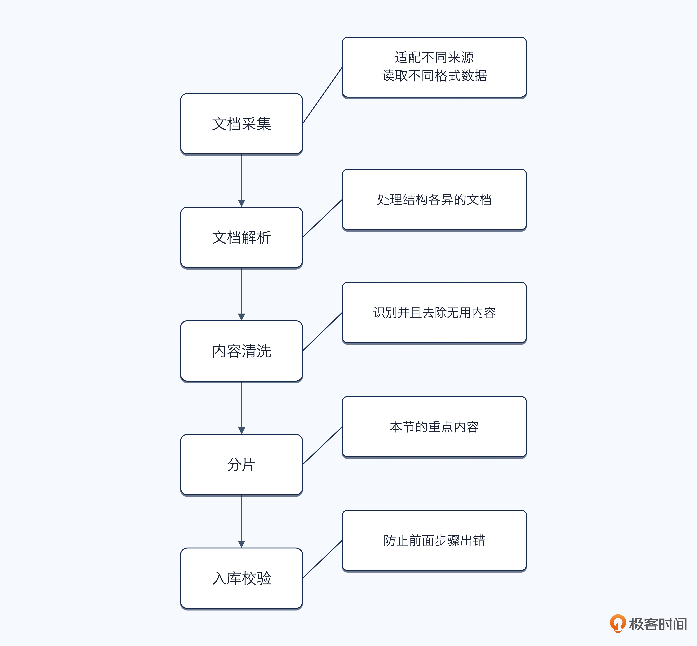
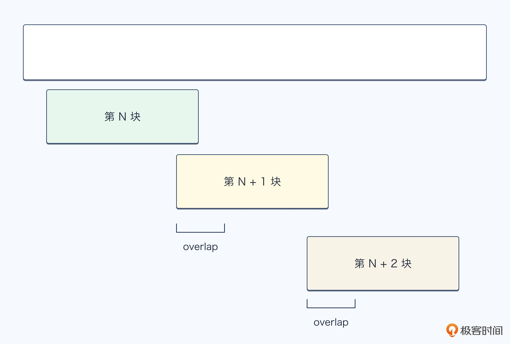
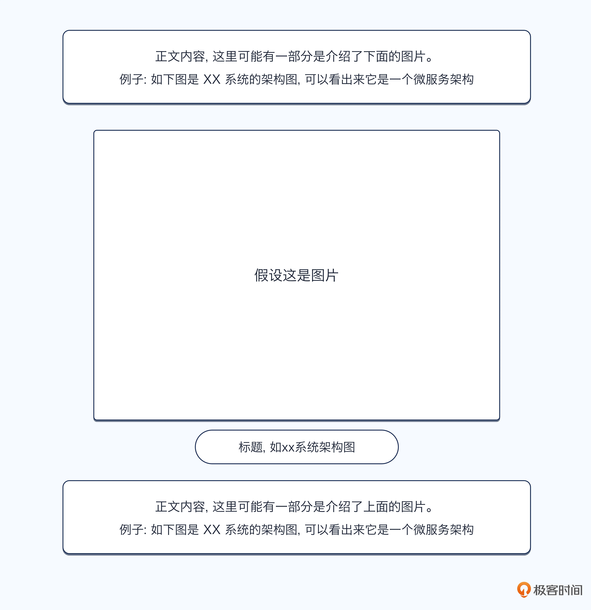
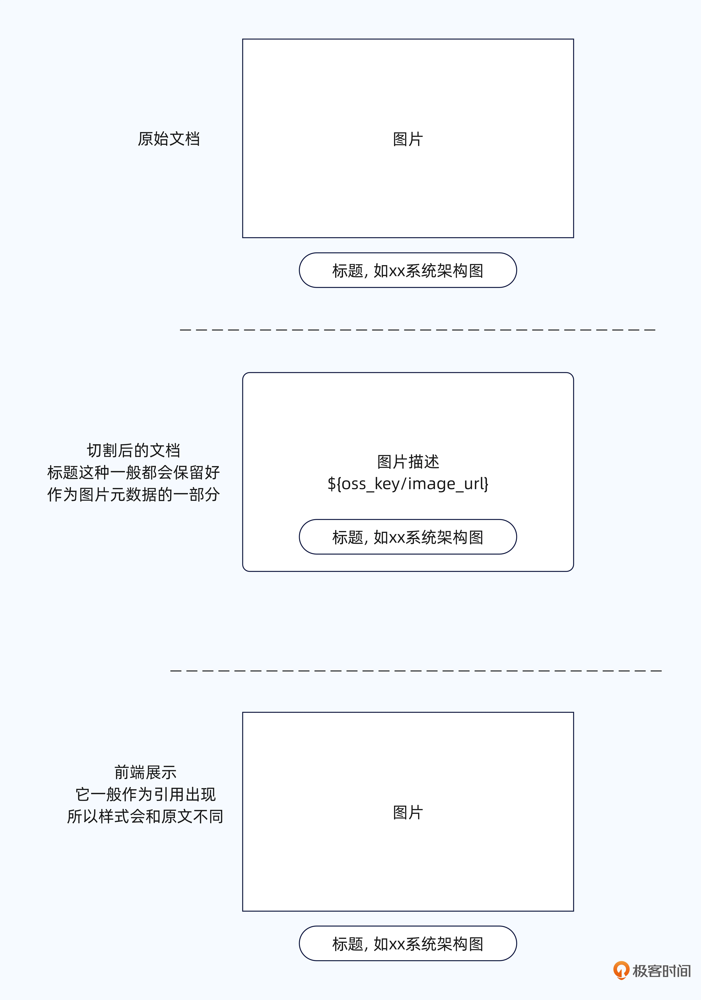
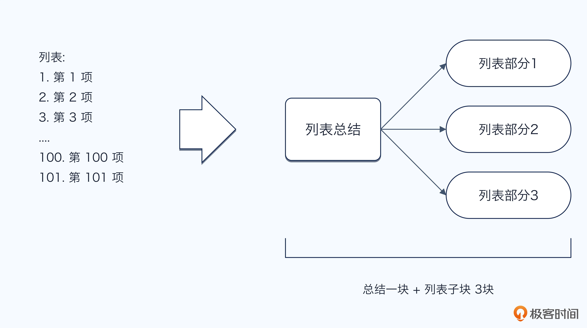
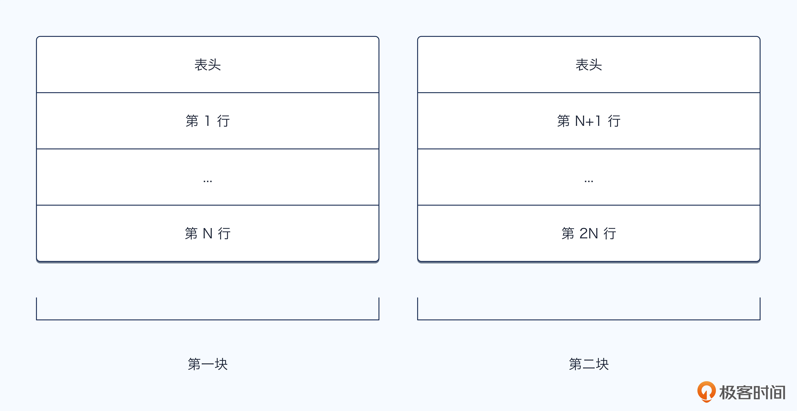
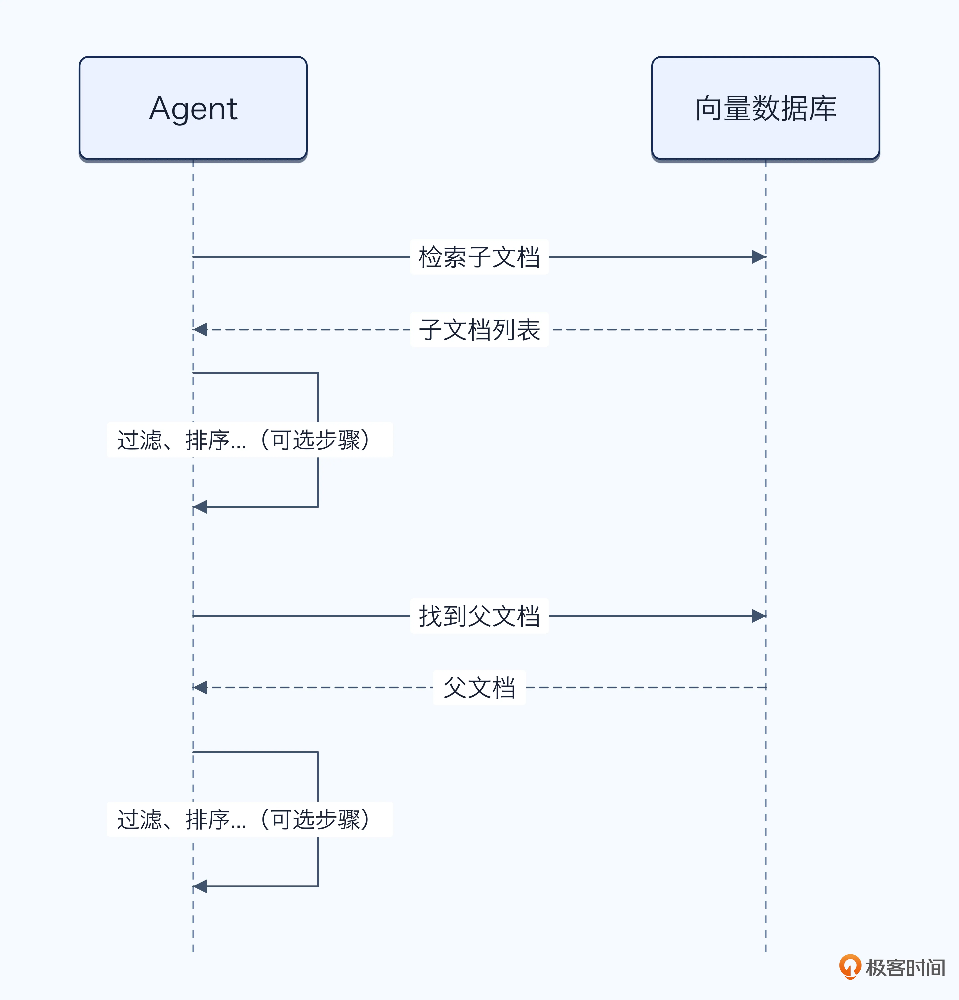
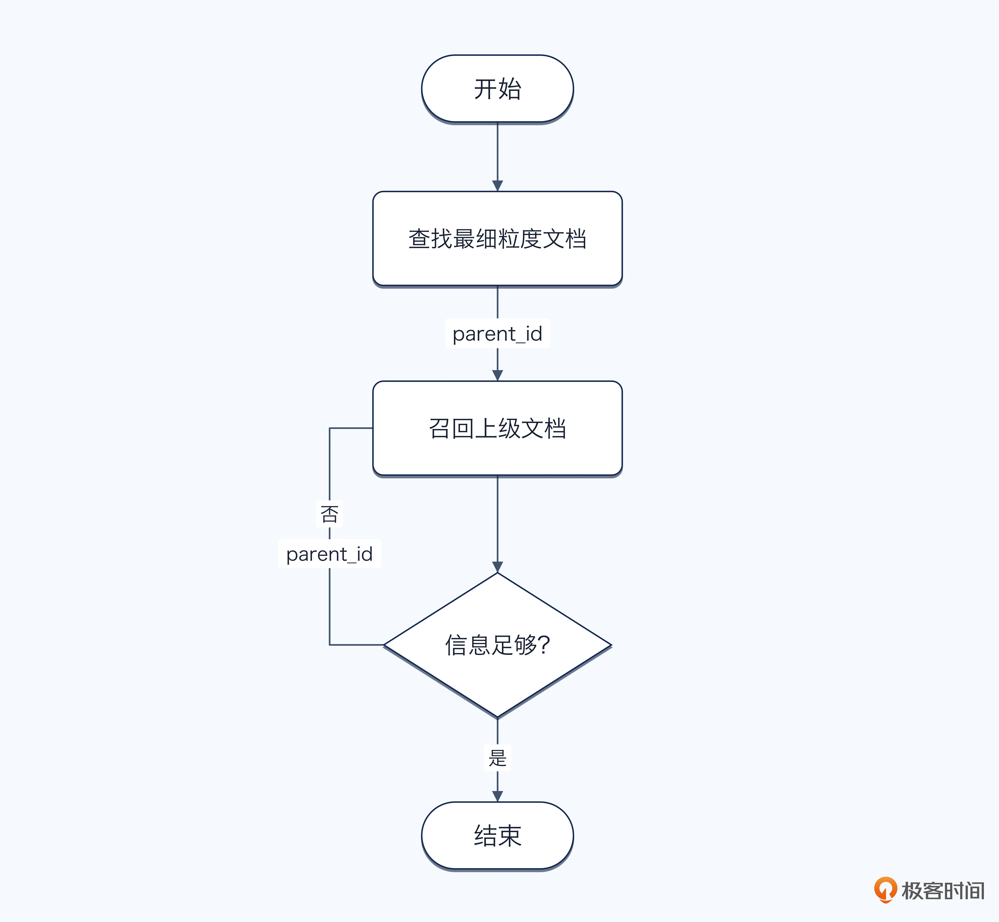
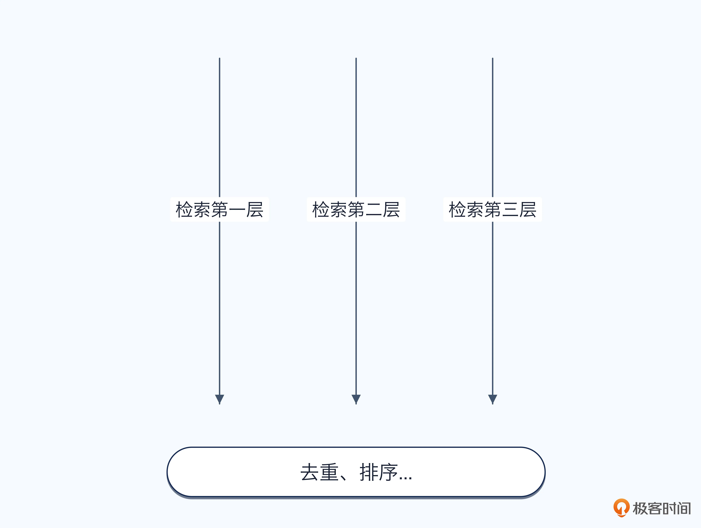

# 19｜Chunk 的召回精度和粒度，你怎么平衡？
你好，我是大明。

我在给人复盘面试录音的时候，发现一个规律。如果你在面试中提到了 RAG 并且提到了文档入库切块，那么面试官几乎一定会问一个问题： **你们的 Chunk Size 设置成多少？**

这个问题看起来很好回答，比如说回答 500、800，或者 1000 个 token。这时候面试官就开始夺命连环问了：为什么是这个数字？为什么不是 300，也不是 1500？

很多候选人到了这里就开始乱答，说是参考了网上的经验，或者测试之后感觉这个数字效果比较好。而这样的回答完全体现不出你的工程思考。

因为 Chunk Size 从来不是一个孤立的配置。切得太小，检索结果虽然精准，却可能只有结论，没有前提和上下文；切得太大，信息虽然完整，却会引入大量噪声，降低召回和排序效果，还会白白占用上下文窗口。

所以，真正需要回答的并不是“Chunk Size 应该设置成多少”，而是你 **如何在召回精度、信息完整性和上下文成本之间做出平衡。**

这一讲，我们就来把这个面试必问的 RAG 问题讲清楚。

## 文档入库基本流程

在讨论 Chunk 怎么切之前，我们先简单了解一下文档的入库流程。否则你只盯着 Chunk Size，很容易忽略切割前后的其它环节。

一个基础的文档入库流程，大致可以分成下面几个步骤：



首先是文档采集。系统从文件上传、数据库、网页、对象存储或者第三方知识平台中获取原始文档。文档格式可能包括 PDF、Word、Markdown、HTML、Excel 等。

接着是文档解析。解析器需要从原始文件中提取正文，同时尽量还原标题、段落、列表、表格、图片、页码等结构信息。这个阶段如果解析错了，后面无论怎么切割和检索都很难补救。

而后是内容清洗。例如删除页眉页脚、广告、重复段落、乱码和无意义空白，同时统一编码、换行和标点。对于扫描版 PDF，还可能需要 OCR；对于表格和图片，则需要额外的解析方式。

清洗完成之后，才进入本文重点讨论的Chunk 分片。系统按照长度、语义、文档结构或者混合规则，将完整文档切分成适合检索的知识单元。

分片之后，还需要为每个 Chunk 补充元数据，例如文档 ID、标题路径、页码、更新时间、权限、父节点和前后相邻关系。随后将 Chunk 转换为向量，并分别写入向量数据库、全文检索引擎或者结构化数据库。

最后还要做一次入库校验，检查文档是否解析完整、Chunk 是否异常、向量是否生成成功以及索引是否可用。至此，一份文档才算真正进入了知识库。

## Chunking 的基本方式

文档切割的方式很多，在实践中和面试中都常见的主要就是三种： **基于长度、基于语义和基于文档结构切割**。

第一种是 **基于长度切割**。它的做法最简单，就是按照固定的字符数、Token 数或者句子数量，将文档切成多个 Chunk。例如每 500 个 Token 切一段，相邻 Chunk 之间保留 50 个 Token 的重叠内容，这部分也叫做 Overlap。这种方式实现简单、性能稳定，也方便控制每个 Chunk 的大小，因此是很多 RAG 系统的基础方案。不过它完全不理解文档内容，可能恰好将一个完整的定义、条件或者案例从中间切开。Overlap 可以缓解边界断裂的问题，但也会带来内容重复。



第二种是 **基于语义切割**。它通常会先将文档拆成句子或者段落，再计算相邻内容之间的语义相似度。当语义变化超过某个阈值时，就认为这里出现了新的主题，可以从这里切开。它的优势是一个 Chunk 内部的内容通常更加集中，比较适合向量检索；缺点则是成本更高，而且相似度阈值很难统一。语义相近的内容，也不一定就是业务上应该放在一起的内容。最简单的办法就是 **调用大模型来做语义切割**，让大模型真正从语义上分辨是否应该切割。

第三种是 **基于文档结构切割**。这种方式会利用文档本身的标题、章节、段落、列表、表格和代码块等结构来划分 Chunk。例如先按照一级标题和二级标题切割，如果某个章节仍然过长，再在章节内部继续切割。它能够较好地保留文档原本的逻辑关系，也是我更加推荐的一种方式。不过它依赖文档解析质量，尤其是 PDF 解析之后，标题层级和表格结构经常会丢失。

除了这三种主要方式，实践中还有别的做法。很多公司在切割的时候，并不是使用单一的一种切割方式，而是可能采用混合方式。比如说先按照文档结构切割，而后在文档结构内部按照固定大小或者按照语义切割。就如同你去切割一本书的内容，那么切到最小章节的时候，这个章节可能还很长，那么你就可以针对这个章节进一步用语义切割。

这也是我推荐的混合方案： **文档结构确定大边界，语义判断内部边界，长度限制负责最后兜底。**

## Chunk Size 到底怎么确定？

很多面试官追问 Chunk Size，并不是想听到一个标准答案，而是想知道这个数字究竟是怎么来的。因为 Chunk Size 没有放之四海而皆准的最优值，它必须结合文档、问题和检索链路共同确定。

第一步是分析业务中的 **最小完整知识单元**。例如客服制度中的“适用条件 \+ 处理规则 \+ 例外情况”通常不能被拆开；API 文档中的方法说明、参数和返回值也最好放在一起。你可以先统计这些知识单元通常有多长，以此确定一个初始范围，而不是直接照抄网上常见的 500 或 1000 Token。

第二步是 **结合用户问题的粒度**。用户经常查询具体参数、错误码或者单条规则，就应该倾向于较小的 Chunk；用户经常要求解释方案、总结章节或者综合多个条件，就需要稍大的 Chunk，或者引入父子文档来补充上下文。

第三步是 **通过测试集调参**。可以准备几组候选值，例如 256、512、800 和 1200 Token，在相同的 Embedding、Top-K 和 Rerank 条件下对比。重点观察的不是向量相似度，而是正确证据是否被召回、证据是否完整、重复内容有多少、最终回答是否正确，以及平均消耗了多少 Token。

此外， **Chunk Size 还必须和 Overlap、Top-K、父子文档及上下文窗口一起考虑**。Chunk 越小，通常需要更大的 Top-K；Chunk 越大，Top-K 应适当降低。最终选择的并不是某个指标最高的配置，而是在召回准确率、证据完整性、响应成本和延迟之间表现最均衡的一组配置。

一个可供参考的话术是：

```
我们先根据业务知识单元确定初始范围，再通过真实问题测试集，对不同 Chunk Size 的召回质量、答案准确率和 Token 成本进行对照实验，最终选出当前业务下的最优折中值。
```

而后还有一个面试中刷亮点的小技巧：讨论你是如何通过测试集来找出最佳的粒度大小。

```
我之前优化过我们的文档分块的大小。
首先我设计了一系列的测试集，而后使用不同的分块大小来测试……
最终我发现分块大小在 600 token 左右最好。调整之后，线上召回的整体准确率提高了 x%……
```

## 特殊内容的处理方式

前面讨论的切割方式，大多默认文档是普通文本。但是在真实知识库中，你很快就会遇到图片、长列表、代码片段和表格。这些内容不能简单套用固定 Token 切割，否则很容易把一个完整的知识单元拆得七零八落。当然了，这也是面试的一个热点，只是一般面试官也不擅长，所以不会问得很深入，你掌握了基本的解决方案就可以了。

### 图片的处理方式

先来看图片。第一种做法是提取图片附近的标题、图注和正文，将这些文本作为图片的描述。比如一张系统架构图，上方标题是“订单系统整体架构”，下方正文解释了各个模块，那么可以将标题、图注和周围正文与图片绑定在一起，形成一个独立 Chunk。这种方式简单，适合图片只是正文补充材料的场景。



第二种做法是借助视觉模型生成图片摘要。对于流程图、架构图、统计图等， **仅靠 OCR 往往不够**，因为 OCR 只能识别文字，无法完整理解节点关系、箭头方向和趋势变化。这时可以让视觉模型输出结构化描述，例如识别流程节点、上下游关系、关键指标和图表结论，再将这份描述用于检索。

这在面试中是一个能够小刷亮点的地方，因为很多面试官可能知道 OCR 能够用来处理图片，但是意识不到 OCR 的结果其实只是识别出来了文字，并 **没有解读这个图片**。

第三种做法是同时保存原图和文本描述。文本负责向量检索，图片则在召回后作为原始证据提供给多模态模型。这样既能检索，又不会因为文本转换丢失太多视觉信息。

这里我要额外补充一个内容，因为涉及图片访问之类的问题，所以有一些人会把图片上传到对象存储，而后在原本图片的位置留下一个占位符或者 URL，以及图片描述。这个图片描述就是源自前面三种方案提取、识别出来的内容。如果是留下占位符，那么等到图片要在前端展示的时候，要将占位符替换为 URL。



### 长列表

列表虽然分成无序列表和有序列表，但是在切割上没有多少区别。

短列表其实很好处理，比如说一个列表只有三五个项目，那么直接切割出来作为独立的一块就可以了。但是长列表就比较麻烦，比如说一个列表几十项，一块完全放不下。这时候你就要考虑将一个长列表切割为很多块了。

最简单的做法是 **保留共同标题，并按照列表项分组切割**。例如“提高检索准确率的方法”下面有二十个列表项，可以每五项切成一个 Chunk，但是每个 Chunk 都要重复携带标题。否则单独召回“增加动态 Few-shot”这一项时，大模型可能不知道它是在解决什么问题。

第二种做法是 **按照列表项的语义分类**。比如一个长列表中既有性能优化，也有准确率优化和成本优化，那么可以先把同类列表项聚合到一起，再分别切割。相比机械地每五项切一次，这种方式的语义完整性更好。

第三种做法是 **建立父子关系**。整个列表作为父节点，每个列表项或者一组列表项作为子节点。检索时使用小粒度的子节点匹配，命中之后再根据需要补充父标题、相邻列表项或者完整列表。

最极端的情况下，如果列表的每一项都很长，那么就可以考虑每一项都切成一块。

此外还有一个可以考虑采用的机制：让大模型针对列表进行解读、总结，将输出结果也做成独立的一块。而后在召回的时候会检索这个输出内容，并且会进一步召回这个总结对应的列表。如图：



### 表格

对于比较小的表格，最简单的方案是整张表作为一个 Chunk，同时带上表名、表头、单位和说明。这样可以完整保留行列之间的关系，适合参数对比、配置说明等小型表格。

对于很长的表格，可以将表头与每一行组合起来。比如表头是“产品、价格、库存”，切割后不能只保存“手机 A、3999、有货”，而应该转换为“产品：手机 A；价格：3999；库存：有货”。这样每一行脱离原表格后仍然具备完整含义。

如果你觉得一行切割成一块的粒度实在太细了，那么可以使用表头 \+ N 行为一块的形式。如下图：



第三种做法是按照业务实体或者区域切割。例如员工表按部门切割，商品参数表按产品切割，年度数据表按年份切割。对于需要聚合、筛选、排序的大型表格，则不一定要放进向量数据库，直接存入结构化数据库，通过 SQL 或专门工具查询通常更加合适。

第四种做法是按照列来切割。不过这种切法一般适用于列之间关联度不高、主要解读同一列内数据的场景。

对于表格切割，你同样可以参考列表的做法，生成一个总结。这个总结侧重于解读表格内的数据，发现数据的规律。

### 小结

总的来说，处理这些特殊内容的关键只有一句话： **不要按照外观切割，而要按照它所表达的完整知识单元来切割。**

在面试中，有一个非常简单的刷亮点的策略，就是在你的简历里面提到你在文档入库的过程中处理过图片、列表和表格等内容。我可以向你保证，面试官一定会问，而后你就可以用前面的内容来回答。尤其是我提到的针对列表和表格生成一个总结，我在实践中发现很多人会忽略这种措施，所以在面试中也算是一个小小的创新点。应届生、实习生使用效果极佳。

## 层次文档：小粒度负责找，大粒度负责回答

前面我们一直在讨论一个矛盾：Chunk 切得小，召回更加精准，但是上下文可能不完整；Chunk 切得大，信息更加完整，但是召回结果里面的噪声又会变多。

有没有一种办法，同时利用小 Chunk 的召回精度和大 Chunk 的信息完整性？我猜你可能听到过一个名词： **父子文档**。

### 父子文档

父子文档的基本思想非常简单：将同一份内容切成大小不同的两种 Chunk。其中，小 Chunk 作为子文档，负责检索；大 Chunk 作为父文档，负责提供给大模型阅读。整个流程可以概括为：

1. 将原始文档切成较大的父 Chunk；

2. 再将每个父 Chunk 切成多个较小的子 Chunk；

3. 对子 Chunk 生成向量并建立索引；

4. 用户查询时，先召回最相关的子 Chunk；

5. 根据子 Chunk 上记录的 `parent_id` 找到父 Chunk；

6. 将父 Chunk放入上下文窗口，交给大模型回答。




上图是检索的过程。这是一种很典型的“小粒度召回，大粒度阅读”解决方案。举个例子，一份公司的退款制度中有一个完整小节：

> 商品签收后七天内，在不影响二次销售的情况下可以申请无理由退货。定制商品、虚拟商品和已经激活的软件产品不支持无理由退货。退款到账时间根据支付渠道有所不同。

假设用户问：“定制商品能不能七天无理由退货？”

一方面，如果整个小节被切成一个大 Chunk，那么它的向量可能同时包含退货期限、商品类型、退款到账时间等多个主题，检索精度未必很好。

另一方面，如果将它切成多个小 Chunk，那么“定制商品不支持无理由退货”这一句话很容易被准确召回。但是只把这一句话交给大模型，又可能缺少它所在的制度背景、适用范围和相邻解释。

父子文档的做法就是使用这句话作为子 Chunk 完成召回，命中之后再找到它所属的完整退款规则，将整个父 Chunk 交给大模型。

这样一来，子 Chunk 解决了“找得准”的问题，父 Chunk 解决了“看得全”的问题。

不过父子文档也不是毫无代价：

- 父 Chunk 仍然可能太大。假设一个父 Chunk 是一整个章节，里面有几千个 Token，那么即便子 Chunk 命中了其中一句话，最终还是会将大量无关内容放入上下文窗口。

- 父 Chunk 重复。多个子 Chunk 可能属于同一个父 Chunk。如果 Top-K 召回的五个子 Chunk 都指向同一个父节点，那么最终应该对父节点去重，而不是重复注入五次。

- 父子 Chunk Size 怎么确定。子 Chunk 太小，会丢失基本语义；父 Chunk 太大，又会重新引入噪声。因此所谓父子文档，并没有真正消灭 Chunk 粒度问题，只是将一个粒度问题拆成了两个粒度问题。


所以其实你最终在面试中还是会遇到面试管的灵魂一击：你的父子文档的块大小是如何确定的。那么你可以参考前面小结的话术来回答。我接下来要给你讲一个很好用的解决方案：基于 RRF 的父 Chunk 排序算法。

### 基于 RRF 的父 Chunk 排序算法

父子文档还有一个容易被忽略的问题：检索阶段召回的是子 Chunk，但最终交给大模型的是父 Chunk，那么父 Chunk 应该怎么排序？最直接的做法，是直接使用排名最高的那个子 Chunk 的分数作为父 Chunk 的分数。

但这种做法会丢失一个重要信号： **同一个父 Chunk 下面可能有多个子 Chunk 都与用户问题相关**。相比只命中一个子 Chunk 的父节点，这种父节点通常包含更加完整、更加集中的证据，理应获得更高的排名。

这里可以借鉴 RRF 的思想（Reciprocal Rank Fusion），中文一般翻译为 **倒数排名融合** 或 **倒数排序融合**。它的核心思想是：不直接比较不同检索方式输出的原始分数，而是根据结果的排名位置进行融合。排名越靠前，贡献的分数越高。常见公式是：


其中，d 是候选文档，R 是不同的召回结果列表，k 是平滑常数，用来控制不同排名位置之间的分数差距。基于这个思想，假设父 Chunk (P) 有若干个子 Chunk 出现在召回结果中，那么父 Chunk 的总分可以定义为：


其中， `rank(c)` 是子 Chunk 在召回结果中的排序位置， `k` 是一个用于平滑排名差异的常数。假设某个父 Chunk 命中了排名第 2 和第 6 的两个子 Chunk，那么它的得分就是：


另外一个父 Chunk 即便有一个子 Chunk 排在第 1，如果没有其它子 Chunk 命中，它的分数也只有：


这种计算方式同时考虑了两个信号：一是子 Chunk 的排名越靠前，贡献越大；二是同一个父 Chunk 命中的相关子 Chunk 越多，累计得分越高。它尤其适合用户问题涉及多个条件、多个事实，需要一个父 Chunk 提供完整上下文的场景。

不过，简单求和也可能偏向子 Chunk 数量特别多的大型父节点。为了避免“父 Chunk 越大越占便宜”，可以限制每个父节点最多取排名最高的三个子 Chunk，或者为后续子 Chunk 增加额外衰减。还可以加入父 Chunk 自身的相关性分数、内容长度惩罚和重复度惩罚。

所以，最终排序不应该只是“找到子 Chunk，然后机械地替换成父 Chunk”，而应该将子 Chunk 的 **排名、命中数量和证据集中程度** 聚合成父 Chunk 的分数，再决定哪些父节点值得进入上下文窗口。

我非常建议你在面试中使用这个算法。因为一般的父子文档已经很难让你拉开差距了，但是这个关联了 RRF 算法的父文档排序，我觉得还是比较有竞争力的。

### 从父子文档升级到层次文档

父子文档只有两层，而真实文档通常不止两层。

一本技术手册可能包含文档、章节、小节、段落、代码片段和单个配置项；一份公司制度可能包含制度、业务模块、具体规则、适用条件和例外条款；一份商品说明书可能包含商品、功能模块、参数分类和单个参数。

因此，我们完全可以按照文档本身的结构，将它组织成多层关系。例如：

- 第一层：整份文档

- 第二层：章节

- 第三层：小节

- 第四层：段落

- 第五层：句子或者独立事实


每一个节点都可以记录自己的正文、摘要、标题路径、向量、父节点、子节点和相邻节点。例如一个最底层的事实节点是：定制商品不支持七天无理由退货。它的父节点可能是“无理由退货的例外商品”，再往上一层是“退款条件”，更上面则是“售后制度”，最顶层是整份《电商平台交易规则》。

于是，一条最底层的知识就不再是一个孤立的 Chunk，而是拥有一条完整的路径。这条路径本身就能够补充很多语义。即便最底层节点只有一句话，大模型也能够通过标题路径知道它讨论的是售后、退款和无理由退货，而不是其它场景。

更进一步来说，层次文档中的每一层都 **不一定只保存原文，可以额外保存一个摘要**。并且在检索的时候也可以同步检索摘要和原文。

这样做以后，同一份知识就拥有不同粒度的表达。用户问得宽泛时，可以召回高层摘要；用户问得具体时，可以召回底层事实；用户需要解释时，再从事实节点向上补充小节或者章节内容。

### 层次文档是逻辑上的层次

这里还要区分两个概念： **文档的物理结构** 和 **检索系统的逻辑结构**。

物理结构就是原始文档里面的目录、标题、段落和页码。逻辑结构则是为了检索重新构造出来的知识关系。两者可能一致，也可能完全不同。

例如一份产品手册按照“第一章、第二章、第三章”编排，但是用户实际上更加关心“安装、配置、故障、性能”四类问题。这时候你完全可以在保留原始章节结构的同时，再构建一套面向检索的逻辑层次。

所以，层次文档并不只是把原始目录树存下来，而是根据业务查询方式，重新组织知识之间的上下级关系。

这也是一个很适合在面试中讨论的点： **文档怎么写，是作者视角；文档怎么被检索，应该是用户视角。** 它的特殊之处在于你已经意识到了写文档的人的思路，和你这边用文档的思路是完全不同的。

### 基于问题特征决定召回层次

构建出多层文档之后，新的问题马上就来了：用户发起一次查询，我到底应该召回哪一层？最简单的方案是永远检索最底层。比如说始终使用段落级或者事实级 Chunk 做向量检索，命中之后再向上找到父节点。这就是父子文档的自然扩展，实现简单，也比较稳定。

但是它的问题也很明显： **不是所有问题都适合从最底层开始找**。例如用户问：这份退款制度主要讲了什么？

这显然是一个总结型问题。你用大量事实级 Chunk 去检索，再试图拼成整份制度的总结，效果往往不如直接召回文档级或者章节级摘要。

再比如用户问：定制商品能不能七天无理由退货？这又是一个明确的事实型问题，直接召回底层规则最合适。如果一开始就召回整章售后制度，反而会引入大量无关内容。

因此，更合理的做法是 **根据问题的粒度来选择召回层次**。

大体上可以分为：

- 事实型、参数型问题，优先召回段落级或事实级内容

- 解释型、原因型问题，优先召回小节级内容

- 总结型、概览型问题，优先召回章节级或文档级摘要

- 对比型、综合型问题，可以同时召回多个层次的内容


这个判断可以通过规则实现，也可以让大模型完成。比如用户输入里面出现“整体介绍”“总结一下”“主要讲了什么”，就可以倾向于高层节点；出现具体的商品名、参数名、规则名或者错误码，就倾向于低层节点。

### 逐步扩大检索层次

只根据 Query 一次性决定层级，依旧不够灵活。更加靠谱的做法是 **先小后大，逐步向上扩展**。基本流程是：

1. 先召回最相关的底层 Chunk

2. 判断当前证据是否足够回答用户问题

3. 如果信息不完整，就找到它的父节点

4. 如果父节点仍然不够，再继续向上扩展

5. 信息充分或者达到上下文预算上限后停止




整个过程如上图。而判定信息是否充分，基本上都依赖于大模型，而调用大模型则有性能损耗，这也是这个方案最大的缺点。例如用户问“定制商品为什么不能七天无理由退货”，最底层节点可能只告诉你“不支持”，却没有解释原因。这时系统就可以向上找到包含规则解释的小节。如果小节里面仍然没有解释，再扩展到章节或者关联规则。

这种方式的优点是按需扩展，不会一开始就将大段内容放进上下文窗口。它和 ReAct 的思路也比较接近：先检索，观察信息是否充分，不充分再继续行动。

### 多层并行召回

还有一种更加激进的做法是 **多层并行召回**。

系统分别在事实层、小节层和章节层进行检索，而后将结果统一 Rerank。底层节点负责提供准确事实，高层节点负责补充整体背景，最终根据相关性、完整性和 Token 成本选择要注入的内容。

这种方式适合复杂问题，但成本也会明显更高，因为你要维护多套索引、执行多次检索，还要处理不同层次结果之间的重复和冲突。



在实践中，我更加推荐一种折中方案：首先使用底层节点进行检索，因为小粒度 Chunk 通常更容易准确命中；而后根据问题类型、召回结果的充分性和剩余上下文窗口，决定是否向上扩展。对于明显的总结型问题，则可以直接从高层摘要开始检索。

### 小结

从实践上来说，召回哪一层通常取决于几个信号：

- 用户问题本身的粒度

- 当前召回内容是否足以回答

- 问题需要事实，还是需要背景和解释

- 剩余上下文窗口有多大

- 当前允许的检索时间和模型调用成本

- 当前任务处于查询、解释、总结还是验证阶段


你可以注意到，这里面并不存在一个固定的答案。层次文档真正高级的地方，也不在于你把文档切成了三层、五层还是八层， **而在于你的 Agent 能否根据当前问题，选择合适的知识粒度**。

所以你在面试中可以用一句话总结这个方案：

> 我的知识库不是将所有 Chunk 平铺存储，而是保留了文档、章节、小节和事实之间的层次关系。检索时优先使用小粒度节点提高召回精度，再根据问题类型、证据充分性和上下文预算，动态向父层扩展，从而在召回精度、信息完整性和 Token 成本之间取得平衡。

这才是层次文档真正解决的问题： **不是把文档切得更复杂，而是让检索系统能够按需选择知识的粒度。**

## 总结

从这一讲你可以学到一个关键点：Chunk 切割并不是简单地设置一个固定大小，而是在召回精度、信息完整性和 Token 成本之间做工程权衡。

基础方案可以结合长度、语义和文档结构切割，而后图片、表格、代码和长列表则要按照完整知识单元单独处理。

进一步可以通过父子文档和层次文档，实现“小粒度召回、大粒度阅读”，再根据问题类型、证据充分性和上下文预算，动态决定召回哪一层。

父 Chunk 的排序也不能机械继承单个子 Chunk 分数，而应结合多个子 Chunk 的排名和命中数量进行聚合。

最终我只能说 Chunk Size 没有标准答案，必须通过真实业务问题和测试集不断调优。

## 思考题

如果召回准确率提高了，但最终回答准确率反而下降，你会如何判断问题来源？是来自 Chunk 切割、父节点扩展、排序机制，还是上下文中的信息冗余？欢迎你在留言区分享你的思考，如果这节课对你有帮助，也欢迎你分享给需要的朋友，我们下节课再见！