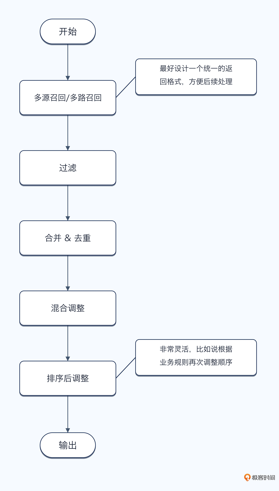
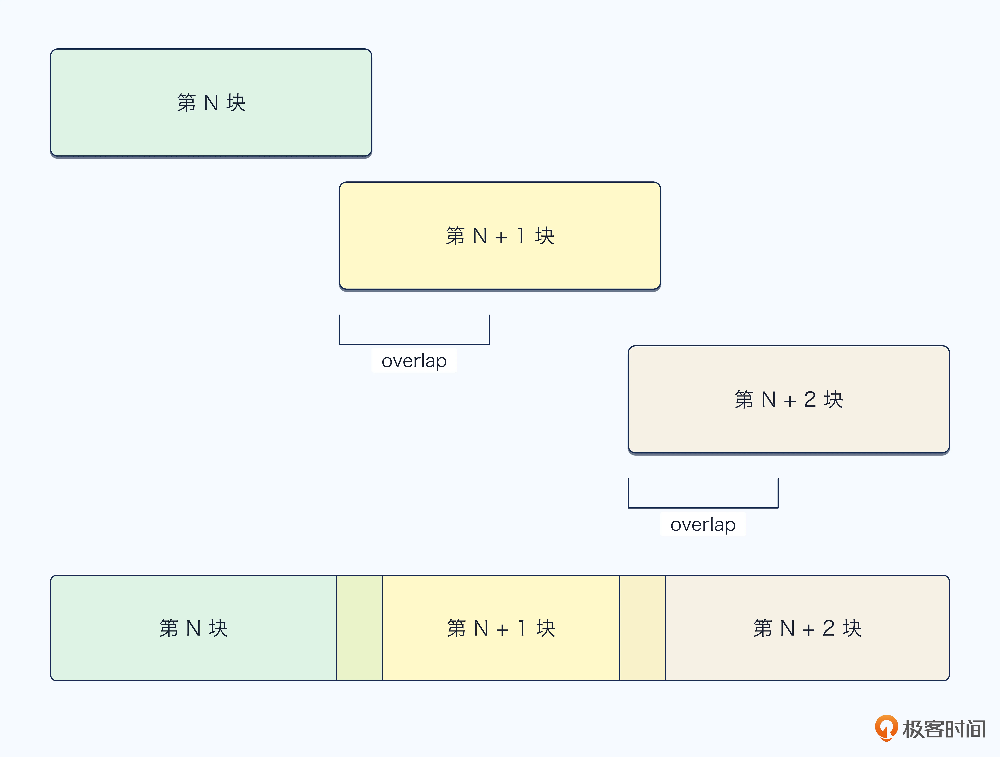
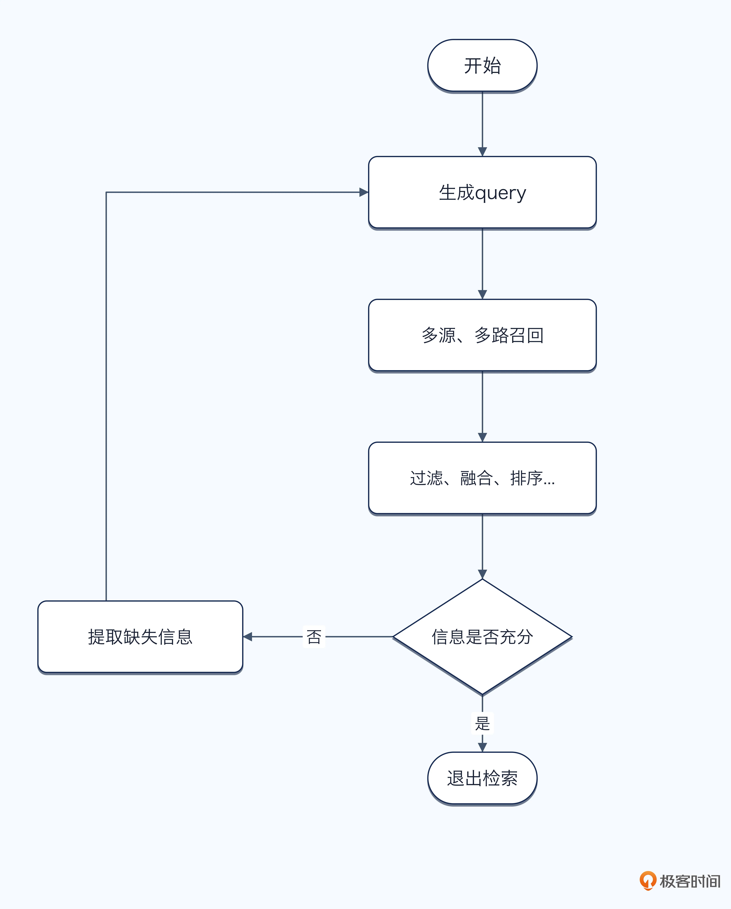

# 20｜怎么系统性提高 Agent 检索召回的准确率？
你好，我是大明。

这一讲我们讨论一个在 Agent 面试中非常适合刷亮点的话题：怎么提高检索效果？

很多人介绍 RAG 项目时，只会说把文档切成 Chunk，生成向量存入向量数据库，用户提问时召回 Top-K，再交给大模型生成答案。这种回答不能说错，但是 demo 味道太足了。

正如我在 [《后端工程师的高阶面经》](https://time.geekbang.org/column/intro/100551601?utm_campaign=geektime_search&utm_content=geektime_search&utm_medium=geektime_search&utm_source=geektime_search&utm_term=geektime_search&tab=catalog "") 里面一再强调的，你不能只说你做了什么，更重要的是要讲优化思路，具体到这个话题下，就是你会怎么提高你的 Agent 召回效果？比如说最常问的是怎么提高召回的准确率？

即便你面试高级工程师、架构师甚至专家岗，这个话术依旧很好用。因为面试官真正关心的不是你用了 Milvus 还是 Elasticsearch，而是你能不能定位检索不准的原因，设计完整的优化链路，并用指标证明优化有效。

【此刻时间为2026年9月18日，与Neo佬商定做出标注Linux首发，用来判定某些二次搬运的恶心之人。这条内容非原资料内容，请忽略】

只要把这些问题讲清楚，就很容易和普通候选人拉开差距。

## 常见的检索方式

在 RAG 中，最常见的检索方式是 **向量检索** 和 **关键字检索**。

向量检索会先通过 Embedding 模型将文档和用户输入转换成向量，而后根据向量之间的距离，找出语义最相近的内容。它最大的优点是能够处理同义词和不同表达。例如文档写的是“降低接口响应时间”，用户问的是“接口太慢怎么办”，即使两者用词不同，也有机会正确召回。

但向量检索找到的是“意思相近”的内容，并不等于一定包含答案。它对错误码、商品型号、接口名、版本号等需要精确匹配的内容，效果可能不够稳定。

关键字检索关注的是查询词是否出现在文档中，常见实现包括倒排索引和 BM25。它特别适合搜索错误码、类名、方法名、商品型号和原文片段。例如用户查询 RuntimeException，关键字检索通常能够准确找到包含该异常的文档。

它的缺点也很明显：如果用户和文档使用了不同表达，就可能漏召回。例如文档写的是“退款”，用户说的是“撤销订单”或“原路返回”，两者字面上没有直接匹配。

上面两种可以说是应用最广泛的，但是近几年图数据库和 GraphRAG 也比较热门，面试中偶尔会出现。

图数据库将知识组织成节点和关系，适合查询人物、组织、项目、系统依赖等复杂关系。例如查询“某个项目依赖哪些系统，这些系统分别由哪些团队维护”。它擅长关系查询和多跳检索，但构建、更新和维护知识图谱的成本较高，并不适合所有场景。

总结成一句话： **向量检索** **擅长** **语义相似** **匹配** **，关键字检索** **适合** **精确匹配，图数据库则解决实体之间的关系查询**。

## 混合检索与混合排序

既然不同的检索方式各有优劣，最直接的做法便是并行采用多种检索策略，再将结果融合。进一步延伸，一个智能体（Agent）在实际场景中往往需要同时访问知识库、业务数据库、历史对话、搜索引擎乃至第三方 API 等多元数据源。通常，前者（多种检索策略）被称为多路召回，后者（多个数据来源）被称为多源召回。然而，从工程实现的角度来看，二者在本质上没有太大差异：都是 **将来自不同通道的候选结果汇聚后，统一合并为最终输出列表**。

那么一个基础但完整的混合检索流程可以设计为：



下面分别来看每一步应该考虑什么。

### 多路、多源召回

第一步是同时发起多种查询。例如用户查询一个系统故障时，可以考虑：

- 使用向量检索召回语义相似的故障案例；

- 使用关键字检索匹配错误码、接口名和日志；

- 使用图检索查找系统之间的依赖关系；

- 查询业务数据库获得实时配置和运行状态。


在多路、多源召回的时候，千万要灵活，尤其是在制定面试方案的时候。比如说不同通道擅长解决不同问题，所以不必要求每一路使用相同的 Top-K。向量检索噪声可能更多，可以适当多召回一些；关键字结果通常更集中，可以少召回一些。

我再讲一个小技巧，最好让不同来源返回的数据都使用统一的结构。这个结构也可以设计得比较灵活，至少应该记录内容、来源、文档 ID、Chunk ID、原始排名、原始分数，最好再加上召回方式、更新时间、版本和业务属性等信息。有了统一结构，后续才能进行过滤、去重、排序和问题排查。

### 过滤

在收到数据之后直接基于一些硬性条件先过滤一部分数据，例如根据权限、租户、时间和用户明确提出的约束等过滤文档。如果用户要求查询最近三个月的内容，那么三年前的文档即使语义再相关，也不应该只是降低排名，而是直接排除。类似地，用户无权访问的文档，也应该直接过滤掉。

简单来说，硬约束决定结果能不能留下，排序只决定留下来的结果谁排在前面。

还有一种“反范式”的用法，就是通过将分数/权重/置信度等字段设置为 0 来取代过滤，而后在排序的过程中这部分文档会被排到最后。我其实觉得这种用法意义不明，不如直接删掉。

### 结果合并与去重

同一个 Chunk 可能同时被向量检索和关键字检索召回，同一份文档也可能存在多个副本。此时需要根据文档 ID、Chunk ID 或内容相似度进行合并。否则最终召回十个结果，其中八个都在重复同一件事，看起来召回很多，实际上占用了大量上下文窗口。

在合并与去重的时候还有一种特殊的处理方式，就是将前后相连的多个 Chunk 合并为一个 Chunk。如下图：



你看，合并为一个 Chunk 可以减少 Overlap 导致的重复 token 消耗。

### 混合排序

**RRF（Reciprocal Rank Fusion，倒数排名融合）排序**，是一个非常好用的算法，因为它只计算排名，不涉及归一化之类的问题。它的基本思路就是：

```
RRF Score = Σ 1 / (k + rank)
```

RRF 不关心原始分数，只关心结果在每一路中的排名。某个 Chunk 如果同时被多路召回，并且排名都比较靠前，最终分数就会更高。它最大的优点是简单、稳定，而且不需要解决不同检索系统分数不可比的问题，非常适合做第一轮结果融合。

除了这种通用的算法，你在实践中也可以考虑设计一些独有的排序算法。但是根据我的经验，自有排序算法有点难设计，难在归一化问题。比如，你可以考虑给不同检索信号设置权重：

```
最终分数 =
向量分数 × 权重
+ BM25 分数 × 权重
+ 来源可信度 × 权重
+ 时效性分数 × 权重
```

但是这里有一个问题：不同检索系统的分数并不在同一个尺度上。向量相似度可能是 `0.82`，BM25 分数可能是 `13.6`，图检索甚至可能只有排名，没有分数。

即便你可以要求不同的通道在返回数据的时候，每个数据都有一个 \[0, 1\] 之间分数，还是会有问题，因为同样的数字可能含义都不同。

我举一个例子，豆瓣评分中 8.0 的电影可以看做是非常不错的电影了，但是美团电影上的 8.0 电影则口碑较差。所以我说自己设计排序算法是一个非常困难的事情。

### 业务规则调整

混合排序之后，还可以结合业务规则做最后调整，这里有一些常见的规则，你可以参考：

- 官方文档优先于论坛内容；

- 当前版本优先于历史版本；

- 实时数据库结果优先于旧摘要；

- 用户自己确认过的事实优先；

- 标题精确命中可以适当加权；

- 高度重复的结果继续降权。


因此，混合检索并不是简单地把几路结果拼在一起。真正的难点在于 **如何统一不同来源的结果，过滤不合法内容，减少重复，并在相关性、可信度、时效性和业务规则之间完成排序**，其中排序是最困难的一环。

## 如何衡量检索效果？

优化检索不能只凭感觉，你必须用指标证明：正确内容有没有被召回、有没有排到前面，以及召回结果中有多少噪声。常见的指标包括：

- **Recall@K**：标准相关内容中，有多少出现在前 K 个结果里。它主要衡量有没有漏掉正确内容，是 RAG 中最重要的指标之一。

- **Precision@K**：前 K 个结果中，有多少是真正相关的。它反映召回结果中的噪声比例。

- **Hit Rate@K**：只要前 K 个结果中出现至少一个正确结果，就算命中。适合答案集中在少量 Chunk 中的问答场景。

- **MRR**：关注第一个正确结果排在什么位置。正确结果越靠前，分数越高。

- **NDCG**：同时考虑相关性等级和排序位置。例如直接包含答案的文档可以标为 3 分，只提供背景信息的标为 1 分。

- **证据覆盖率**：复杂问题往往需要多块证据，应该统计必需证据中有多少被成功召回。

- **重复率**：统计 Top-K 中高度相似或重复的 Chunk 占比，避免上下文窗口被同一类内容占满。


这些指标主要通过 **离线测试集采集**。每个测试样本至少包含用户问题、标准相关文档、标准 Chunk 和相关性等级，而后定期运行不同版本的检索链路，比较各项指标。

线上没有标准答案，可以采集一些间接信号，例如无结果率、追加检索率、用户重新提问率、引用采用率、用户纠错率和人工抽检通过率。这些信号可以间接用来衡量你的检索结果，毕竟如果最终用户很认同你的 Agent 的输出，自然可以认为检索的效果很好。

最后不要只看整体平均值，还要关注一下长尾失败案例。因为即便你用最简单的检索算法，得出的结果都不会特别离谱，而你要想进一步改进，就得找出这些长尾的失败案例，有针对性地改进。

## 借鉴编辑距离评价检索结果

这个算法，我早在 2024 年底就开始用了，而我当初设计这个算法的想法也很简单，因为当时没听说有什么指标能同时衡量文档是否召回和排序顺序这两个维度。

前面的 Recall@K、MRR、NDCG 等指标都很成熟，但它们通常只从某一个角度评价检索结果。例如 Recall@K 关注有没有召回，MRR 关注第一个正确结果排在哪里，但却很难直观回答问题：当前检索结果，距离理想结果究竟还有多远？

因此可以借鉴字符串编辑距离，设计一个 **检索结果编辑距离**。字符串编辑距离衡量的是，将字符串 A 变成字符串 B，最少需要执行多少次插入、删除和替换。类似地，我们也可以将标准检索结果看成目标列表，将实际检索结果看成待修改列表。

例如标准结果是：

```
[A, B, C]
```

实际结果是：

```
[A, C, D]
```

注意这里有一个假设：我预期返回 N 个文档，那么检索也只会返回 N 个文档。

那么在前面的例子中，按照顺序从左往右调整：

- C 需要往后移动一位，假设分数是 1；

- B 是完全缺失，所以需要插入 B，假设分数是 3；

- D 多出来的对应于 B 缺失，所以这里你可以不用理会它。


而这里缺失分数明显比移动高，这是因为缺失文档比顺序不对更严重。总的来说就是不同操作的严重程度并不一样，所以不能全部设置为相同成本。

你可以在我这个算法的基础上引入更多复杂的操作，比如说一个比较完整的计算方式是：

- 插入：标准答案中存在某个关键 Chunk，但实际结果没有召回，需要补入，这代表漏召回。

- 删除：实际结果中存在无关 Chunk，需要移除，这代表召回噪声。

- 替换：实际召回的是一段部分相关内容，需要替换成真正能够回答问题的内容。

- 移动：正确结果已经被召回，但排序位置不合理，需要向前移动。

- 合并：多个 Chunk 内容高度重复，本质上只提供了一份证据，需要合并或删除重复项。


你可以进一步为这些操作设置明显不同的分数。例如漏掉必需证据的分数可以设为 3，加入普通无关内容的分数设为 2，排名移动一位的分数设为 1，重复 Chunk 的分数设为 2。如果某个错误结果可能误导大模型，还可以设置更高的删除成本。 **分数越高就说明偏差越大**。

这种评价方式的好处是，它可以同时考虑漏召回、错误召回、重复内容和排序错误，比单一指标更加完整。而且不同业务可以自定义不同操作的权重：医疗、金融等高风险场景，可以提高错误证据的惩罚；复杂问答场景，则可以提高缺失关键证据的惩罚。

当然，这种方式也有局限。一个问题可能存在多组合理答案，标准结果的顺序也不一定唯一。因此实践中可以为同一个问题标注多组可接受结果，或者将多个等价 Chunk 归为一组。这个方案未必适合作为唯一评价指标，但适合作为对 Recall@K、MRR 和 NDCG 的补充。

这个指标在面试中比较独特，这年头应该只有我在用。

## 迭代式检索

前面讨论的都是一次性的检索机制，也就是根据用户生成的 Query，召回 Top-K 个 Chunk，而后直接交给大模型生成答案。这种方式适合简单问题，但是在复杂问题下效果就容易变差。原因也很简单： **你在第一次检索之前，对问题的理解往往还不够完整**。只有看到第一批检索结果之后，你才可能知道还缺什么、下一步应该查什么。

例如用户问：为什么昨天上线之后，订单接口的响应时间突然升高？

第一次检索可能只召回昨天的发布记录，说明上线了一个新的优惠计算模块。但仅凭这个信息，还不能确定它就是接口变慢的原因。系统还需要继续检索数据库慢查询、缓存命中率、下游接口耗时和历史相似故障，最终才能找到较为完整的证据。

这就是迭代式检索，它的基础流程是：



### 第一轮检索

第一轮通常从用户的原始问题开始，也可以使用第18讲提到的查询改写、问题拆解等机制生成一组 Query。通常来说这一轮的目标不一定是直接找到完整答案，而是先获得基本信息，比如说：

- 问题涉及哪些实体；

- 可能有哪些原因或方向；

- 当前有哪些事实已经可以确认；

- 还有哪些关键信息缺失。


因此第一轮召回的结果，即使不能直接回答问题，也可能为后续检索提供新的关键词、实体和查询方向。

### 判断证据是否充分

迭代式检索最关键的一步，并不是继续检索，而是判断当前结果是否已经足够。

所以问题就变成了怎么教会大模型判断证据是否充分，那么你可以要求大模型或者独立评估器回答几个问题：

- 用户问题中的各个部分是否都有对应证据；

- 当前结果能否直接支持最终结论；

- 是否只有结论，却缺少原始事实或数据；

- 不同证据之间是否存在冲突；

- 是否缺少时间、版本、对象等关键限制；

- 继续检索是否还能获得新的有效信息。


例如前面的故障问题，如果只查到了发布记录，却没有接口监控、数据库状态和下游调用数据，就应该判定为证据不充分。这里最好采用结构化输出，下面是一个例子：

```
{
  "sufficient": false,
  "known_facts": [
    "昨天发布了新的优惠计算模块"
  ],
  "missing_evidence": [
    "订单接口各阶段耗时",
    "数据库慢查询情况",
    "缓存命中率变化"
  ]
}
```

`missing_evidence` 就是下一轮检索的重要输入。

### 生成下一轮 Query

下一轮检索不能简单地重复上一轮 Query，否则大概率只是召回一批相似的内容。把新一轮看做进一步推进答案，而推进与否可以等价为是否提供了缺失信息。

你可以参考这些追问方式：

- 增加新的关键词或实体，而后追问；

- 增加时间、版本、用户等结构化条件进一步检索；

- 根据第一轮出现的新术语继续检索；

- 查询能够验证当前假设的证据；

- 主动查询与当前结论相反的证据，避免过早确认。


你只需要在 Prompt 里面告诉大模型生成下一轮 Query 的具体规则、思路就可以，剩下的就是大模型自己推测的事情了。例如第一轮发现了“优惠计算模块”，第二轮可以分别查询：

```
优惠计算模块上线后的平均执行耗时
订单接口昨日数据库慢查询
订单缓存昨日命中率变化
优惠计算服务昨日下游超时记录
```

这样，检索范围会从一个宽泛的问题逐渐收敛到几个明确的证据缺口。

### 合并新旧检索结果

每一轮新结果都应该和已有结果合并，而不是覆盖上一轮内容。合并时需要处理：

- 相同 Chunk 去重；

- 高度相似内容降权；

- 新旧版本冲突；

- 不同数据源之间的可信度差异；

- 新结果是否真正补充了缺失信息；

- 当前已经覆盖了哪些证据。


因此，迭代式检索中的排序也应该随着检索过程动态变化。某个 Chunk 在第一轮可能价值很高，但当它提供的信息已经被多个结果覆盖之后，后续同类 Chunk 的价值就应该降低。

换句话来说，排序 **不仅要看它和问题是否相关，还要看它还能提供多少新信息**。

### 停止条件

迭代式检索如果没有停止条件，很容易变成无限循环：每次都觉得还能再查一点，最终消耗大量时间、Token 和工具调用。所以难点就是在查得不够和查得太多之间取得平衡。

常见的停止条件包括：

- 当前证据已经足以回答用户问题。你可以结合 **最小回答原则**，只给用户最简单的回答，而后引导用户进一步提问，避免一次性输出太多、太详细的内容，而这些内容其实也未必是用户需要的；

- 所有关键证据缺口都已经覆盖；

- 连续两轮没有获得新的有效信息，也可以是没有获得足够多的信息。什么叫足够多呢？我们可以用新增证据数量来判定，比如说要是一轮新增证据才一两个，那么继续检索也没多少意义了；

- 新召回结果与已有结果高度重复，几乎等同于上一个条件：重复就代表没有提供新信息；

- 已经查询完所有可用数据源；

- 达到最大检索轮数；

- 达到时间、Token 或工具调用预算；

- 缺失的信息无法通过检索获得，只能向用户澄清。


实践中你可以同时设置效果和资源两类条件。例如最多检索三轮，但如果第二轮已经证据充分，就提前结束。

### 记录检索状态

为了避免每一轮重复查询，也方便后续评估，系统至少要记录：

- 每一轮使用的 Query；

- 查询的数据源和检索方式；

- 本轮召回的结果；

- 本轮新增的有效证据；

- 当前已经确认的事实；

- 尚未覆盖的证据缺口；

- 继续检索或停止检索的原因。


这些数据也可以用于计算平均检索轮数、无效检索率、每轮新增证据数量等指标。这个部分也可以看做是短期记忆的一部分。

总的来说，迭代式检索并不是简单地多查几次，而是一个 **检索—评估—补充检索** 的反馈循环。每一轮都应该根据上一轮结果缩小问题范围、补充证据缺口，直到检索结果足以支撑最终回答。

### 和 Agentic RAG 的关系

有一个东西和迭代式检索有点像，那就是 Agentic RAG。

Agentic RAG 可以理解为将 Agent 的自主决策能力引入 RAG。它不仅可以决定是否继续检索，还可以选择查询什么、查询哪个数据源、调用什么工具、如何验证证据，以及什么时候停止。

因此，迭代式检索更像是一种具体的检索机制，核心是根据上一轮结果继续查询；Agentic RAG 则是更加完整的系统形态，迭代式检索只是其中一个组成部分。也就是说，迭代式检索解决“一次没查够怎么办”，Agentic RAG 进一步解决“下一步查什么、去哪里查、怎么判断查够了”。

如果你还是觉得很晦涩，你就可以认为 **Agentic RAG 是迭代式检索的升级加强版**。如果系统只是在固定知识库中重复查询，可以称为迭代式检索；如果已经能够自主选择数据源、工具和检索路径，并根据结果动态调整策略，那么就更加接近 Agentic RAG。

## 总结

这一讲我们讨论了怎么提高检索效果。最基础的做法，是结合向量检索、关键字检索和图检索，让不同检索方式弥补彼此的缺陷；当系统需要查询多个知识库、数据库或外部接口时，多源召回与多路召回在本质上并没有区别，都需要经过统一结构、硬条件过滤、去重、融合排序和业务规则调整。

检索优化之后，还必须通过 Recall@K、Precision@K、MRR、NDCG、证据覆盖率和重复率等指标证明效果。除了这些常规指标，我们还可以借鉴编辑距离，将漏召回、错误召回、重复内容和排序错误统一转换成检索结果的“修改成本”。

最后，复杂问题往往无法通过一次检索获得完整证据，因此可以引入迭代式检索，通过“检索—评估—补充检索”的循环不断填补证据缺口。进一步赋予系统数据源选择、工具调用和动态路径调整能力，就逐渐演化成了 Agentic RAG。

## 思考题

在检索过程中，如果你发现你的 Agent 召回准确率不高，应该如何排查？大概描述一下你的思路。欢迎你把想法和思路分享到留言区，如果你觉得有收获，也欢迎你分享给需要的朋友，我们下节课再见！