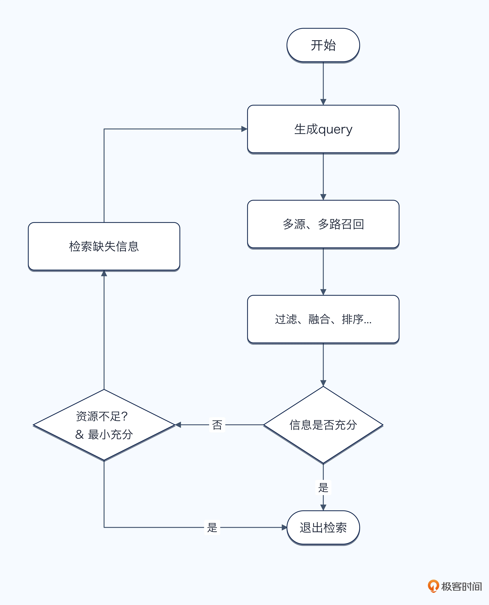
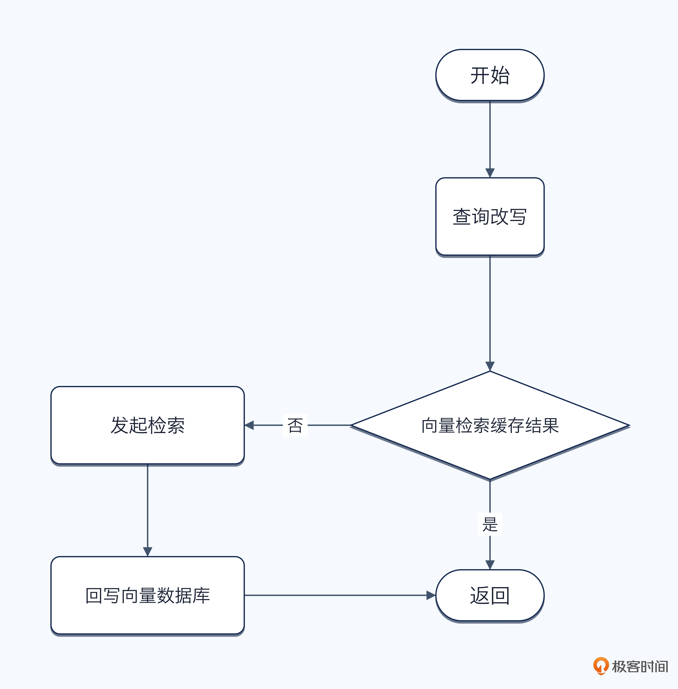

# 21｜Agent 检索性能优化：最小充分检索、动态预算与缓存
你好，我是大明。

前面我们讨论了查询改写、问题拆解、多路召回、混合检索、重排序和迭代式检索。这些方案确实能提高准确率，也很适合在面试中刷亮点。但你一旦讲得太复杂，面试官很可能马上追问：

> 你又改写 Query，又查多个数据源，还要重排序和追加检索，那性能怎么办？用户要等多久？

这个问题很现实。检索链路越复杂，模型调用次数、Token 成本和整体延迟都会上升。最后用户问一个问题，要等十几秒才能拿到结果，结果再准确，体验也不会太好。

当然你可以狡辩说“我对性能的要求并不是很高，差不多能用就行”，但是这样回答终究是落入了下乘。

所以这一讲我们就讨论怎么提高检索性能，确保在面试官追问的时候可以再加点分。不过，性能优化不只是把一次向量查询从 200ms 优化到 100ms。对 Agent 来说，更重要的是： **能少查就少查，能并行就并行，查够了就停止，不够再逐步升级。**

## 检索性能到底指什么？

在讨论怎么优化性能之前，我们先把一个问题说清楚： **检索性能究竟是什么？**

很多人一提到检索性能，第一反应就是 Elasticsearch 查询用了多少毫秒，Milvus 的向量检索能做到多少 QPS，或者把一次查询从 200ms 优化到了 100ms。这些当然属于检索性能，不过稍微有点传统了。对于 Agent 来说，视野要放宽一点。

因为用户真正感知到的，并不是你的向量数据库查了多久，而是： **我问完这个问题之后，多久能够拿到一个靠谱的答案？** 所以在 Agent 里面，我更加推荐你从 **端到端链路** 来看待检索性能。

### 端到端延迟

一个稍微复杂一点的检索流程，可能是这样的：

```
用户输入 → 查询改写 → Query Embedding → 多路召回 → 结果融合 → Rerank → 充分性判断 → 上下文组织 → 大模型生成答案。
```

假设其中耗时分别是：

- 查询改写：500ms；

- Embedding：100ms；

- Elasticsearch：200ms；

- 向量检索：300ms；

- Rerank：600ms；

- 充分性判断：500ms。


你就算把向量检索从 300ms 优化到了 150ms，对整个请求的帮助其实也没有想象中那么大。

更糟糕的是在迭代式检索这种机制下，如果充分性判断认为证据不足，又触发了一轮查询改写和追加检索，那么整个链路可能直接翻倍。

因此不管是在面试中还是在实践中，要说优化性能，你都得讨论 **端到端的延迟**，而不是单一一次检索的性能。

### 不要只看平均耗时

第二个比较重要的是 P50、P95、P99。例如你的平均检索耗时只有 800ms，看起来非常不错。但是实际上长尾请求可能性能很差，比如说 P99 超过 3s。越是大公司，越是用户量大，请求量大，越是要小心长尾请求。

用户都是记打不记吃的，他们不会因为某一次响应特别快而夸你，但是非常容易因为偶尔卡十几秒就觉得你的 Agent 不行。

因此性能优化不能只看“平均有多快”，还要关注 **长尾请求到底有多慢**。

尤其是多数据源检索非常容易产生这种问题。你同时查询五个数据源，其中四个都在 300ms 内返回，结果第五个接口偶尔需要 5 秒。如果你的程序傻乎乎地等待所有请求完成，那么整个 Agent 就被最慢的那个数据源拖住了。

### 吞吐量与并发能力

第三个指标是吞吐量。一个请求 500ms 返回，并不代表系统性能就一定很好。如果你的检索服务一次只能处理十个请求，那么用户一多，后面的请求还是得排队。所以还需要关注和吞吐量、并发能力有关的指标，包括：

- QPS；

- 最大并发数；

- 连接池使用情况；

- 第三方中间件负载等指标；


尤其是大模型 Rerank、Cross-Encoder 这一类操作，单次看起来不一定特别慢，但是并发一上来就很容易成为瓶颈。

### 成本也是性能的一部分

在 Agent 里面，还有一个传统检索系统不太强调的指标： **调用成本**。在 Agent 里面如果不注意控制成本，很容易让你的老板心态炸裂。

但我一般也不建议在最开始构建 Agent 的时候就开始考虑成本问题，你先把 Agent 效果做到最好，再考虑控制成本。等到你的 Agent 活下来了，并且随着用户规模上升，模型调用次数、Token、GPU 和第三方 API 的成本都被放大了，此时你就可以考虑优化了。比如说如果效果差 10%，但是成本能减少一半，这种就是值得优化的。

你也可以将它理解成一种 **单位答案成本**：为了正确回答一个问题，到底付出了多少计算资源。

### 性能不能脱离准确率讨论

最后，也是最重要的一点： **检索性能和检索准确率一定要放在一起看。**

如果你为了提高性能，把 TopK 从 50 调成 3，把查询改写删掉，把 Rerank 也跳过，最后延迟确实从 3 秒下降到了 500ms，但是 Recall@K 和最终答案正确率大幅下降，那不叫性能优化，那叫功能缩水。

反过来也一样。为了追求极致准确率，每次都生成十条 Query、搜索五个数据源、循环三轮，也未必合理。

其实真正要考虑的是在成本（资金 \+ 时间）和检索效果之间取得平衡，你可以考虑换一种方式来衡量这些问题：

- 1 秒内 Recall@10 能做到多少；

- 2 秒预算下任务成功率是多少；

- 准确率下降不超过 1% 的情况下，延迟能降低多少；

- 相同准确率下，模型调用次数能不能减少一半。


这才是这一讲真正要讨论的“检索性能”。接下来我会从下面几个角度分别讨论怎样提升检索性能。

## 基础优化

在讨论动态检索、预算控制这些高级方案之前，我建议你先把最基础的性能问题解决掉。很多 Agent 检索慢，并不是因为架构不够高级，而是底层查询和中间件本身就没有优化好。

第一类是 **中间件和索引优化**。例如 ES 里面要根据实际查询条件设计索引和 Mapping，避免大量无效扫描；向量数据库则要根据数据规模和准确率要求调整 ANN 索引及相关参数。对于租户、权限、时间、文档类型这些高频过滤条件，也应该提前设计好索引。能通过结构化条件先把一百万条数据缩小到一万条，就不要直接在一百万条数据上做向量检索。

第二类是 **查询本身的优化**。这个和传统数据库优化是一个思路：不要生成一个又宽泛、又昂贵的 Query。例如用户只需要某个部门最近一个月的文档，那么查询里面就应该尽量带上部门和时间范围；只需要十条结果，就不要一次召回一百条。类似地，多条查询之间如果高度相似，也应该合并或者去重，避免做大量重复检索。

我有一个面试小技巧，如果你是在中小型公司工作，那么你可以说你们的向量数据库就是用 ES 的，而后你从 ES 的角度出发阐述你是如何优化一个向量检索的，可以是优化 ES 本体、优化索引以及优化你的查询语句。这个面试策略能够同时展示你在 ES 本身和向量检索上都很擅长。

第三类才是 **消除检索链路中的明显浪费**。例如同一个 Query 在一次任务里面重复生成 Embedding、重复查询；一次召回 Top100，最后只有 Top10 参与回答；五条查询召回出来的文档高度重合，却全部进入 Rerank。这些都应该直接处理掉。

此外还有一个很好用的原则： **能提前算好的，就不要放到在线请求链路里面计算。** 例如文档切割、Embedding、关键词、实体、标签和摘要，都可以在数据入库阶段提前完成。

这些优化没什么花哨的地方，但是它们应该是性能优化的第一步。先把中间件调好、Query 写好、明显的浪费去掉，再去讨论后面的高级方案。

坦白来说，这种基础的优化其实在实践中效果很好，只是在面试中效果差一些。我的建议是你准备两三个这种基础案例，然后叠加下面任何一个高级方案，在面试中是够用了。

## 最小充分检索：不要一次性解决所有事情

除了优化查询和中间件之外，还有一种我认为非常有意思的性能优化思路，就是 **最小充分检索**。

它的核心思想非常简单：不要试图一次性解决用户提出的所有问题，而是找出当前最小的、可以独立完成的目标，只检索解决这个目标需要的信息。

这里的“最小”和“充分”其实是一回事。所谓最小，就是这个目标已经不能继续拆了；所谓充分，则意味着它虽然小，但是解决之后能够独立给用户产生价值。

举个简单的例子，用户问：帮我看看这台电脑适不适合写代码，如果适合，再看看现在在哪里买最便宜。

你当然可以一上来同时查询电脑参数、用户需求、不同电商平台的价格、优惠券、库存、售后政策，然后全部处理完再告诉用户答案。但是仔细分析之后你会发现，这里面真正的第一个最小目标其实是： **判断这台电脑是否适合用户写代码。**

因此第一阶段只需要查询电脑配置、用户需求以及相关评价。如果最后得到的结论是“不适合”，那么后面的价格、优惠券和库存都不需要查了。即便结论是适合，也完全可以先把结果告诉用户，再决定是否继续查询购买渠道。

这个思路其实和我之前讲的多意图处理机制是很接近的，当用户输入多个意图的时候，先找出一个意图，处理完毕之后再问用户要不要处理下一个意图。

所以问题来了，怎么找到这个最小目标。

### 怎么找到这个“最小目标”？

如果说得抽象一些，那么这个最小目标就是“你回答之后用户就不会觉得你的Agent是一个小可爱”的目标。但是显然这个没有办法给你提供指导。所以我换一种说法。我认为最关键的是判断一个子目标是否具备 **独立价值**。

你可以不断问自己：如果我只完成这一件事，现在能不能给用户一个有意义的结果？如果答案是可以，那么它就可能是一个最小目标。例如用户说：帮我分析这三个项目哪个最适合放简历，然后帮我优化一下，再生成一些面试题。

这里至少可以拆成三个任务：

1. 选出最适合放简历的项目；

2. 优化这个项目；

3. 根据最终项目生成面试题。


第一个任务完成之后，用户已经获得了一个完整、有意义的结果，因此它就是一个非常合适的最小目标。相反，如果用户说：

> 查询上个月订单，然后计算退款率。

你就不能把“查询订单”当成一个最小充分目标，因为用户真正想要的是退款率，查询订单只是实现这个目标的中间步骤。你查完订单就返回给用户，并没有真正解决任何问题。

所以判断最小目标还有另外一个非常重要的原则： **不要把过程步骤误认为用户目标。**

这个思路其实和前面我们讨论多意图的时候非常接近。有些输入看起来包含很多任务，实际上只是为了完成同一个最终目标而描述了多个步骤。

### 适用场景

最小充分检索比较适合 **探索式、多步骤、弱依赖** 的任务。例如商品推荐、旅行规划、简历优化、数据分析、知识问答等。用户经常会提出一个比较大的需求，但是里面可以拆出几个有独立价值的小目标。

这种情况下，每完成一个最小目标，就可以把结果先交给用户。这样做有两个好处：

- **性能好**。很多后续检索最终可能根本不需要发生。

- **交互体验好**。用户能够更快拿到第一批有效结果，并且可以根据结果改变后续需求，而不是等待 Agent 自己闷头干完所有事情。


那么哪些场景不适合？

- 不可以拆出独立目标的任务。例如：根据过去三年的财报判断这家公司是否值得投资。查询收入、利润、现金流都只是过程，你不能查询完收入就认为完成了一个“最小目标”。

- 用户明确要求一次性得到完整结果。例如：帮我生成一份完整的竞品分析报告。这种时候你每分析一个模块都停下来询问“是否继续”，反而会严重影响体验。

- 各部分之间存在强依赖。例如合同审查、故障根因分析、完整的数据统计等。缺少任何关键部分，都可能让最终结论发生变化，因此不应该为了性能强行拆开。


所以最小充分检索并不是“少查一点”，而是缩小当前要解决的问题。

我认为可以用一句话概括这个方案：先找到当前能够独立产生价值的最小目标，只为这个目标检索；完成之后，再决定要不要进入下一个目标。

这有点像是一种职场生存指南：不要做太多，只做一点点，但是领导又无话可说。

### 迭代式检索也可以最小充分

前面讲迭代式检索的时候，我们的思路通常是：先检索一次，根据结果判断“还缺什么”，然后不断生成新的 Query，直到能够回答用户的问题。

这里同样可以引入最小充分原则，或者说“差不多”原则。一般来说是在发现资源不足、即将超时的情况下，判定当前的检索结果已经足够回答用户的首要问题了，就立刻中断迭代，返回答案。如图：



简单来说，就是资源不足的时候降级为最小充分检索。

## 基于预算的动态检索

前面讨论的最小充分检索，本质上是在控制“要解决多少问题”。另外一种思路则是进一步控制：为了这个问题，我愿意花多少检索资源。也就是给每一次检索设置一个 **Retrieval Budget（检索预算）**。这个 Budget 不一定非得非常精确，实践中可以包含几个最核心的维度：

- 剩余时间，例如最多允许检索 3 秒；

- 最大检索轮次，例如最多迭代 3 轮；

- 最大 Query 数量；

- 最大数据源数量；

- 最大召回 / Rerank 文档数量；

- 剩余 Token 或上下文窗口。


而后根据当前问题和剩余 Budget，动态决定检索策略。

例如一个简单的问题，可以直接使用关键字或者向量检索；复杂一点的，再增加混合召回和 Rerank；如果第一轮结果不够，再触发查询改写、多路检索乃至迭代式检索。所以整个过程不是一开始就火力全开，而是： **先使用成本最低的检索方案，不够再逐渐升级，同时不断检查剩余预算。**

相应地，预算减少之后，也要动态缩减检索范围。例如剩余时间已经不多了，就减少 Query 数量、降低 Top-K、减少数据源，甚至跳过昂贵的 LLM Rerank，使用当前已有的最好结果完成回答。

这个思路和上下文管理章节里讨论过的动态编排其实非常像：不是预先规定一条固定策略，而是根据当前状态动态决定下一步怎么做。

因此你在面试中不需要把它描述得特别复杂，只需要讲清楚：

> 我的检索链路不是固定的，而是有一个时间、调用次数和 Token 组成的 Budget。简单问题走轻量路径，证据不足再逐步升级；预算不足则主动降级，避免为了提高一点召回率，把整个 Agent 的响应时间拖垮。

这样就已经足够体现动态检索的思路了。

## 缓存：能不查，就不要再查

最后还有一个非常直接的优化手段，就是缓存。最简单的是 **缓存检索结果**。例如同一个 Query、同一组过滤条件，在短时间内再次出现时，可以直接复用上一次召回的文档 ID、分数甚至融合排序结果，而不是重新走一遍向量检索、关键字检索和 Rerank。它的基本思路如下图：



它有几个关键点：

- 原始查询要先经过查询改写，再去找缓存。这主要是因为原始查询差异太大了，毕竟你完全无法预料不同的用户会怎么表达同一个东西。

- 将向量数据库用作缓存，组织成 key-value 的形式，其中向量检索的是 key。不过这个 key 其实是改写后查询对应的向量，而不是改写后的文本本身。之所以不用 Redis 这种缓存，是因为即便是改写后的查询也会有一些细微差别，例如说用户问“怎么解决 A”，那么改写后的可能是“A的解决方案”，也可能是“A 的解决思路”。

- 最后别忘了回写向量数据库，并且考虑控制过期时间。


更激进一点，可以直接 **缓存最终答案**。这种方案特别适合 FAQ、制度查询、产品说明这类答案相对稳定的问题。命中之后，甚至连检索和大模型生成都可以跳过。

不过答案缓存要比文档缓存谨慎得多。只要问题依赖实时数据、用户画像、权限、当前上下文或者最新状态，就很容易返回过期甚至错误的答案。

因此实践中我更推荐一种折中的方案： **优先缓存检索结果，谨慎缓存最终答案**。这也就是一句正确但是大多数时候都无用的废话：最好的检索性能优化之一，就是这一次根本不检索 **。**

## 总结

这一讲我们讨论了怎么提高检索性能。

首先要注意，检索性能不能只盯着 Elasticsearch、向量数据库的一次查询耗时，而应该站在整个 Agent 链路上看，包括查询改写、Embedding、多路召回、融合排序、Rerank、追加检索以及最终生成。真正值得关注的是： **在保证检索效果的前提下，用户多久能够拿到答案，以及为这个答案付出了多少计算成本。**

因此性能优化的第一步，不是什么高级算法，而是先把明显的浪费消除掉：优化中间件和索引、优化 Query、减少无效召回、重复检索和不必要的在线计算。

而更加值得在面试中讲的，则是两个思路。

第一个是 **最小充分检索**：从用户完整需求中找到当前能够独立产生价值的最小目标，只检索完成这个目标需要的信息。即便是迭代式检索，也应该围绕这个最小目标运行，完成之后再通过引导问题决定是否继续。

第二个是 **基于预算的动态检索**：根据剩余时间、Query 数量、检索轮次、数据源数量和 Token 等预算动态调整检索策略。简单问题走轻量路径，证据不足再逐步升级；预算不足则主动降级。

最后还有缓存。能复用上一次检索到的文档，就不要重新检索；对于足够稳定的问题，甚至可以直接缓存答案。

归根结底，检索性能优化可以概括成一句话：能不查就不查，能少查就少查，能复用就复用；不够再逐步扩大检索范围。

## 思考题

最小充分检索强调先解决最小目标，那么你怎么判断一个子任务是独立目标，而不是完成最终目标必须经过的中间步骤？欢迎你在留言区分享你的思路，如果你有所收获，也欢迎你分享给需要的朋友，我们下节课再见！