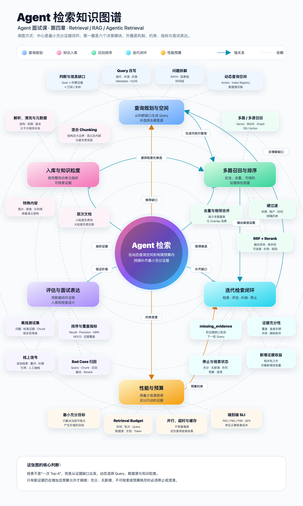

# 22｜如何设计一个有竞争力的检索（RAG）面试方案？
你好，我是大明。

前面几讲，我们分别讨论了怎么确定检索什么、Chunk 怎么切、怎么提高召回准确率，以及怎么优化检索性能。到这里，检索这一章其实已经差不多讲完了。所以这一讲我不准备再塞新的技术细节，而是做一个总结： **如果你准备拿 RAG 去面试，究竟应该怎么组织自己的方案，才能显得有竞争力？**

这是一个非常现实的问题。因为很多候选人介绍 RAG 的时候，基本上都是同一套话术：文档切 Chunk，Embedding 之后存进向量数据库，用户提问的时候做一次 TopK 检索，再把结果交给大模型。

不能说错，但是也确实没什么竞争力。毕竟 Chunk、Embedding、Milvus 这些都是现成的东西。这样容易让面试官认为你只是调用一下中间件 API 而已，而调用 API 的事情，就算是一个实习生也能做好，为什么要招你呢？

所以要想真正赢得竞争优势，就必须设计一个有关 RAG 的面试方案，体现你在 RAG 设计上面的积累和思考。

所以这一讲我们就从面试的角度，把前面的内容重新串起来，整理成一套看起来真正经过设计、评估和持续优化的检索系统。

## 入库：别上来就是切 Chunk

如果你不打算在入库这个方面刷亮点，你可以说你没有参与入库过程，但是你还要补充“你知道理论上/你们公司是怎么做的”，而后如果面试官问到细节，你答不上来也很正常，毕竟你只是旁观了一下而已。这也可以避免让面试官认为你完全不了解入库阶段的处理流程。

我其实比较建议你在入库上设计一个面试方案。最基础的回答就是：文档切 Chunk，做 Embedding，然后存到向量数据库。但是根据我复盘面试录音总结的规律，要拉开差距，主要是两个问题： **复杂文档怎么处理，以及 Chunk 怎么切。**

### 复杂文档不要一刀切

实践中很容易遇到表格、图片、Excel、多级标题文档、FAQ、代码等内容。如果全部转成纯文本，再按照固定字符数切割，效果往往很差。

比如表格，如果从中间切开，后半部分可能连表头都没有。这种情况下可以保留表头，在切割行数据时重复附带；也可以额外生成一份自然语言摘要用于检索，真正回答时再返回原始表格。

图片也是类似，可以生成图片描述，并保存图片所在章节、前后正文等关联信息。检索时搜索描述，命中之后再把相关图片或正文一起带回来。

也因此，很多面试官会喜欢问这方面的问题。面试中不需要把所有复杂类型都讲一遍， **挑一个和自己业务最相关的类型讲清楚即可。**

有一个老大难的问题就是视频处理，如果你推测目标岗位会涉及视频处理，你可以提前准备一个视频入库过程的面试话术，会显著增强你的竞争力。

### Chunk 也不要只会固定长度

Chunk 的核心目标，是平衡 **召回精度和上下文完整性**。这也是一个面试热点问题，通常切入点是询问你的 Chunk 大小，而后进一步询问你是如何确定这个 Chunk 大小的。

你可以按固定长度切割、按照结构切割等，但是这些回答都比较基础，不太能够赢得竞争优势。我比较推荐面试中讲 **父子文档**。父子文档解决的是一个经典矛盾：Chunk 太小，召回精准但上下文不完整；Chunk 太大，上下文完整但检索噪音又多。

而后你要进一步考虑一个问题，就是父文档大小怎么确定以及子文档大小怎么确定。这里有一个小创新点，就是不同的文档你可以设置不同的大小，这就是一个简单的“动态Chunk大小”思路的应用。

最后，最好再准备一个属于自己的小改进，比如表格单独建索引、FAQ 直接按 Question-Answer 组织、父子层级根据文档结构动态确定等。这样就显得你确实在 RAG 入库上有经验，有自己的想法。

## 多路召回

应当说，多路召回在 Agent 架构里面也是常规举措了。所以如果你只是谈到多路召回，那么竞争力还是差点，你需要在多路召回上加一点料。多路召回的亮点还是落在“动态”两个字上。本质上就是不同路的数据特征、检索方式有区别，所以在不同场景下，就应该给不同路不同的“权重”。

权重这个词在这里有两方面的含义：

- **控制召回的数量**。比如说业务主要是自然语言知识问答，那么向量检索往往承担主要的语义召回任务，就可以给它更大的候选集；而结构化检索可能只是补充一些精确字段，就没有必要拿回来几十条结果。

- **控制排序影响力**：比如说在 RRF 中，完全可以在每一路前面加入一个权重。

而后你可以再进一步，即权重这个东西也不是完全静态的，而是动态的，可以根据当前步骤、剩余窗口大小来动态调整权重。

### RRF 在父子文档中的应用

我强烈推荐前面给你讲过的一个 RRF 用在父文档排序上的算法：

其中 `rank_i` 是该父 Chunk 下第 i 个被召回子 Chunk 的排名。也就是说， **一个父 Chunk 下面被召回的子 Chunk 越多，而且这些子 Chunk 排名越靠前，那么这个父 Chunk 的最终得分就越高。**

推荐这个算法有一个很核心的原因，就是你可以结合前面父子文档入库过程一起用，在面试中能起到 1+1 > 2 的效果。或者说，你可以将你的整个 RAG 核心卖点就设计成父子文档。或者你可以从这里得到启发，在父子文档这个解决方案下，亮点在于你要主动控制父文档的排序。

## 迭代式检索

一般的 Agent 项目我都不建议引入这个机制，但是如果你的项目经历的核心卖点就是 RAG，那么我建议你使用这个措施，不然会显得你的项目贡献很单薄。迭代式检索本身就构成了一个面试亮点。而如果你面试的岗位比较高端，那么你可以考虑进一步呈现这方面的设计细节。

### 动态控制迭代式检索的退出条件

第一个方式就是你要强调你的迭代式检索并不是固定迭代几次，而是根据步骤、检索出来的内容等综合判定是否需要继续迭代。

比如说有一种思路就是根据“是否提供新信息”来确定要不要继续迭代。如果提供了新信息但是提供的信息很少，也可以考虑中断迭代。但是你要小心面试官追问你如何判定“是否提供了新信息”，此时你可以结合 Slot Filling 等机制来讨论。例如，当前检索任务需要确认 A、B、C 三个关键事实，那么每一轮检索结束之后，就检查已经填充了哪些信息：

- 第一轮拿到了 A；

- 第二轮补充了 B；

- 第三轮依旧只有 A、B，没有获得关于 C 的新证据。

那么第三轮的边际收益已经非常低，就可以考虑停止继续使用相同方式检索，或者切换 Query、Retriever，再尝试最后一次。

这里的核心思想是： **迭代次数不是目标，持续获得有效的新信息才是目标。**

### 最小充分检索

最小充分检索和迭代式检索可以说是配合得天衣无缝，而且在面试中属于大杀器。你要在每一次检索之前先回答一个问题：

> **为了推进当前任务，我现在最少还需要知道什么？**

注意，这里的“最小”和“充分”是一体两面，在满足充分性的前提下追求最小范围。既然已经确定了当前步骤最小的目标，那么只要获得足以满足这个目标的证据，就应该停止继续扩张检索范围。

举个例子，用户要求判断某个商品是否适合生产环境使用。你已经知道了它的性能、稳定性，现在唯一缺失的是官方是否提供长期维护。那么当前这一轮检索的目标就应该收缩为“确认长期维护政策”，而不是重新检索这个商品的全部资料。

这样每一轮迭代实际上都会经历：

> **确定当前最小目标 → 检索证据 → 判断是否充分 → 产生下一个最小目标。**

这也是为什么我认为这种检索已经开始有一点 Agentic 的味道了。它不是执行固定的 `search(query, topK)`，而是在已有信息的基础上不断决定下一步究竟查什么。

### 根据结果动态调整检索策略

更加高级一点，你还可以让下一轮检索不再简单重复上一轮。比如说第一轮向量检索效果不好，那么第二轮可以：

- 修改 Query；

- 拆分问题；

- 增加关键字检索的权重；

- 扩大某一路 TopK；

- 查询新的数据源；

- 针对缺失信息构造新的 Query。

例如第一轮检索“Redis 性能问题”之后，Agent 发现已经确认问题来自 BigKey，但是还不知道具体是哪一种数据结构。那么第二轮就不应该继续搜索宽泛的“Redis 性能问题”，而是缩小到：

> Redis BigKey + Hash / ZSet + 排查方式。

你可以把它理解为： **Observation 不只是告诉 Agent“搜到了什么”，更加重要的是告诉它“现在还缺什么”。**

### 最后一定要有 Budget

当然，迭代式检索不能无限运行，不然效果可能提升了一点，延迟和 Token 成本却原地爆炸。因此你最好再给整个过程增加 Budget，例如：

- 最大迭代次数；

- 最大检索耗时；

- 最大召回文档数；

- 最大 Rerank 次数；

- Token Budget。

这样退出条件实际上就变成了两类：

> **效果条件：已经获得最小充分证据。**
>
> **成本条件：继续检索已经不值得了。**

所以你在面试中真正应该强调的并不是“我们会检索三次”，而是设计出一套完善的退出机制、检索循环机制。

这样一讲，你的检索就已经明显不是普通的 RAG Pipeline，而开始接近一个真正能够自主决策的 Agentic Retrieval 系统了。

## 评估：重点不是指标，而是数据驱动迭代

最后不要忘了准备检索效果评估。这个问题在面试里面非常常见，但是说实话， **很难单纯靠评估指标刷出特别大的亮点**。你无非就是 Recall@K、Precision@K、MRR、NDCG，再加测试集、人工抽检、LLM-as-a-Judge，大家讲出来都差不多。

所以我的建议是不要把卖点放在“我用了什么指标”，而是强调 **整个检索系统的优化都是数据驱动的**。

比如说建立固定测试集，每次调整 Chunk Size、召回路数、TopK、RRF 权重、Rerank 或者迭代式检索策略之后，都重新跑一次测试集，对比新旧版本结果。如果指标下降，再进一步把 Bad Case 归因到查询改写、Chunk、召回、融合排序、Rerank 等具体环节。这样你讲的就不是一次性的“做过评估”，而是一套 **测试 → 发现问题 → 修改策略 → 回归测试 → 对比指标 → 继续迭代** 的闭环。

这里你还可以准备一个稍微有点创新的指标，也就是我前面提到过的 **编辑距离变种**。这个算法在面试中比较好用，毕竟它看起来非常与众不同。

## 总结

到这里，整个检索章节就差不多结束了。

如果你打算把 RAG 作为 Agent 项目里面的核心卖点，那么我建议你不要只准备“怎么检索”，而是至少准备完整的三部分：入库、检索、评估 **。**

第一， **入库要有一点创新**。不要只说切 Chunk、做 Embedding、存向量数据库。你至少要准备一个能够体现自己思考的点，比如复杂文档处理、父子文档、层次文档、动态 Chunk，或者针对业务数据设计特殊的切割和索引方式。目的只有一个：证明你不是在机械调用现成组件。

第二， **检索过程也要有自己的设计**。不要停留在一次 Vector TopK。至少可以准备多路召回、Weighted RRF、Rerank，再往上叠加动态权重、动态 TopK、迭代式检索和最小充分检索。这样你的检索就不再是一条固定流水线，而开始具备根据当前证据决定“下一步查什么、怎么查、什么时候停止”的 Agentic 特征。

第三， **评估也不能放过**。评估本身不太容易刷出亮点，但是你一定要强调：整个检索系统的演进都是数据驱动的。每一次修改 Chunk、召回策略、排序方式和迭代策略，都通过测试集和线上数据重新验证。你甚至可以再准备一个类似前面编辑距离变种这样的自定义评价方法，证明你不仅会使用指标，还会根据自己的业务问题设计指标。

所以我认为，一个真正有竞争力的 RAG 面试方案应该是： **入库有创新，检索有创意，评估有闭环。** 三合一，才算是一套近乎完美的 RAG 面试方案。

## 附录：Agent 检索知识图谱

📎 附件里是第四章的面试题和案例模版，在 PC 端下载。