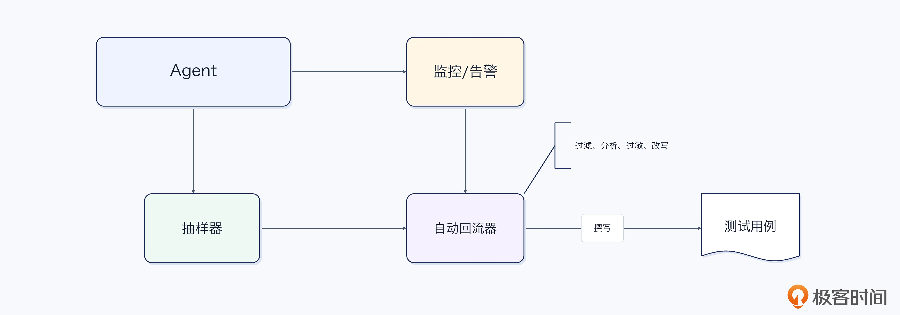
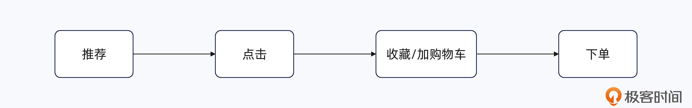
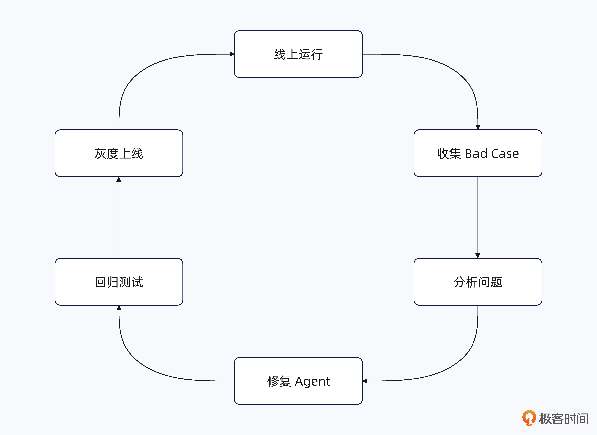
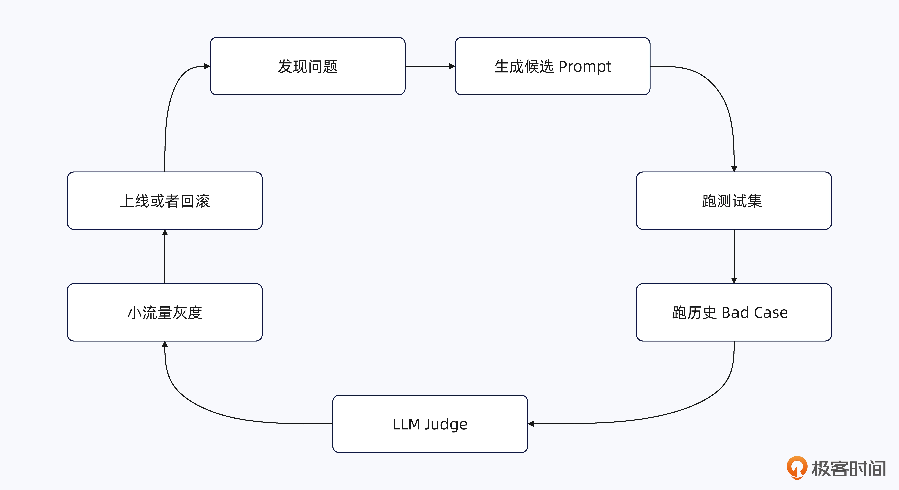
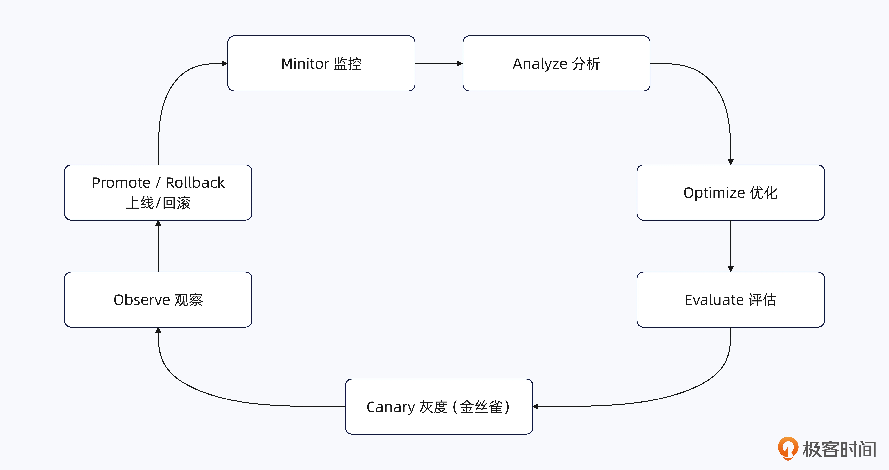

# 23｜你怎么知道用户喜不喜欢你的 Agent？
你好，我是大明。

前面我们已经讨论了意图识别、Plan、Replan、上下文管理、RAG 等一大堆 Agent 机制。到这里，有一个问题无论如何都绕不过去：你做了这么多优化，怎么知道 Agent 真的变好了？

比如说你把意图识别改成三层机制，怎么证明准确率提高了？给 RAG 加了混合检索、Rerank、迭代式检索，怎么知道用户体验更好了？又或者你做了用户画像、动态上下文，用户真的买账吗？

如果回答不了这些问题，那么面试官就会觉得你这个人就只会做表面功夫。

如果你能进一步讲清楚怎么定义好坏、怎么构造测试集、怎么自动评估、怎么线上验证、怎么根据反馈继续迭代，你的项目听起来就不再像 Demo，而更像一个真正长期运行的生产系统。

所以这一讲，我们就专门讨论一个看起来很简单、实际上很麻烦的问题： **你怎么知道用户喜不喜欢你的 Agent？**

我们先来看看最基础的一些评估和反馈机制。

# 基础机制

## 测评集

最基础的方式就是准备一批测试用例，每次修改 Prompt、模型、RAG 或者 Agent 流程之后重新运行，观察指标是否变化。例如前面意图识别里面，我就提到过准备各种标准表达、口语化表达、拒识、多轮对话等测试用例，再计算 Top1、拒识准确率等指标。

这种方式最大的优势就是 **稳定、可重复、适合做版本对比**。缺点同样明显：测试集毕竟是你自己准备的，很难完全模拟真实用户千奇百怪的输入。

测试用例有三个来源：

- 手写。早期阶段都是自己手写一批，效率比较低。

- AI 生成。在手工撰写的用例得到验证之后，后续可以让 AI 参考已有的测试用例生成一批。如果不放心，你可以再加上一些人工监督的步骤。

- 线上案例回流。在面试中比较好用，它又分成自动回流和手工回流。前者是指你设计一个全自动的线上案例回流流程，后者则是你抽样检查线上案例或者收到告警之后将线上案例整理到测试用例中。

下图展示了线上回流的自动模式：

而手工回流模式，则是用人力取代了自动回流器，但是其它部分是不变的。

## LLM as Judge

对于很多 Agent 输出，我们其实没有标准答案。比如说帮我改写一个适合高级程序员的简历，这种问题你很难通过字符串比较来判断回答好不好。

这时候就可以再调用一个大模型充当 Judge，根据正确性、完整性、约束满足程度等标准对结果进行评价。

它最大的优势是 **便宜，而且可以大规模自动评估**。注意，这里说的便宜，一般是指你用大模型批量接口、业务低峰调用、使用 mini/flash 等模型。相比测试用例来说，这个还是要花钱的，只是说花得不多而已。

因此现在很多 Agent 的离线评估都会大量使用 LLM as Judge。

## 专家评审

如果你的业务非常专业，那么最可靠的方式依旧是找真正懂业务的人来看。例如法律 Agent 找律师，金融 Agent 找金融从业者，电商 Agent 可以找熟悉商品和用户运营的人进行评审。

专家最大的优势就是 **评价质量高**，缺点也非常简单： **贵，而且慢。**

这些专家是真的贵，一般的创业公司根本用不起，尤其是金融、医疗等专家，因为他们时间宝贵、机会成本高，所以收费极其昂贵。

实践中一般不会让专家审核所有结果，而是让专家来撰写、评审一些业务规则，而后进行抽样审核，或者使用专家结果来校准 LLM as Judge。

## 用户显式反馈

最典型的就是点赞、点踩、五星评分、满意/不满意。这种反馈最大的价值在于： **这是真实用户亲口告诉你的。** 但是它有一个严重问题，就是反馈率往往很低。很多用户不满意的时候并不会点踩，而是直接关闭页面，然后再也不用你的 Agent。所以显式反馈很好，但是不能只依赖它。

## 用户隐式反馈

用户的隐式反馈也是一个重要的来源，比如说：

- 用户是否重新生成答案；

- 是否反复修改问题；

- 是否说“不是这个意思”“你理解错了”；

- 是否继续使用 Agent；

- 是否执行 Agent 给出的建议；

- 是否完成了最终任务。

这些都可以被看作一种隐式反馈。

这种数据量巨大，但是难点也非常明显： **你需要解释用户行为背后的真实含义。** 比如说用户连续聊了十轮，究竟说明 Agent 很好聊，还是前九轮一直没解决问题？这也是后面设计指标时最需要注意的地方。

用户隐式反馈通常和 LLM as Judge 结合在一起，也就是只有通过大模型来分析，你才能知道用户是怎么想的。

## A/B Test

当你有两个 Agent 版本的时候，还可以直接在线上进行 A/B Test。例如：

- 50% 用户使用旧 Prompt

- 50% 用户使用新 Prompt

当然这个流量比例你可以灵活控制，设计一些类似灰度流量控制的机制等。然后比较两个版本的任务完成率、用户纠正率、转化率、留存率等指标。

这种方式最大的价值是： **让真实用户替你判断哪个版本更好。** 它也是验证一个优化究竟有没有真实收益的最好方式之一。

A/B Test 可以进一步扩展成多臂老虎机的形式，也就是同时测试多个版本，而后从里面选择出最好的版本。

## Pairwise 对比

还有一种更加直接的方式，就是同时给出 A、B 两个结果，让用户或者评审者直接回答：

> 哪一个更好？

相比于让用户分别给两个答案打 83 分和 87 分，直接问“A 和 B 你选哪个”，通常更加容易判断。

这种方式既可以让真人来选，也可以让 LLM Judge 来选。如果你用过 ChatGPT 之类的AI应用，应该有印象，它会强制选择一个答案，而后才能继续下去。

## 小结

你可以看到，Agent 的评估并不存在一个万能方法。实践中更加合理的组合通常是： **测试集负责稳定回归，LLM as Judge 负责语义化评估，专家负责校准，用户反馈和 A/B Test 负责验证线上真实效果。**

你要注意的是，准备面试时，针对 Agent 的每一个环节，或者说针对你负责的部分，都要设计一些评测机制。不然面试官问你效果好不好，你就回答不上来了。

# 怎么设计和业务有关的指标？

前面介绍的点赞、点踩、任务完成率之类的指标都比较通用，但是你真正落地一个 Agent 的时候，仅仅看这些指标肯定是不够的。

原因很简单：不同业务里，用户所谓的“喜欢”完全不是一回事。

例如客服 Agent，用户和你聊了二十轮，大概率不是因为舍不得你，而是因为你二十轮都没把问题解决。但是换成陪伴、社交类 Agent，用户愿意和你聊二十轮，反而可能说明你的 Agent 做得非常成功。当然了，在实践中你的客服 Agent 要是三轮对话都不能解决问题，怕是用户就要呼唤人工客服了。

所以我认为设计 Agent 业务指标的时候，最重要的一个思路就是： **不要从“我能采集什么数据”出发设计指标，而应该从“用户为什么使用我的 Agent”反推指标。**

换句话说，你需要先猜测用户心里想要什么，然后再寻找能够反映这种心理状态的行为数据。这也是我这一讲一直强调的一个观点：所谓用户体验指标，本质上就是通过用户行为揣测用户心理。

还记得我在前面提到过的一个比喻吗？Agent 得是一个太监，而且得是一个好太监。

## 从用户目标反推指标

我整理的一个比较好用的方法是，先回答三个问题：

- **用户为什么来使用你的 Agent？** 比如说电商 Agent，用户最核心的目标通常不是“和 Agent 聊天”，而是找到适合自己的商品，并最终做出购买决策。

- **如果用户觉得 Agent 好用，他接下来可能会做什么？** 例如说点击 Agent 推荐的商品、收藏、加入购物车等。

- **如果用户觉得 Agent 很蠢，他可能会做什么？** 比如说重新输入一遍同样的问题、修改自己的表达等。

这些同样都可以转换成指标。所以一个业务指标体系通常不会只有“正向指标”，还应该有对应的 **负向指标**。而且有时候负向指标反而更有价值。因为用户可能懒得给你点赞，但是 Agent 真把他惹毛了，他会用自己的行为告诉你。

## 电商 Agent 的例子

我们用电商 Agent 来完整走一遍。假设你的 Agent 是帮助用户购买手机的。用户输入：预算 4000 左右，主要拍照，不想买苹果，有什么推荐？

Agent 推荐了三台手机。这个时候最简单的指标是 **推荐商品点击率**。如果以前 100 个用户只有 20 个点击推荐商品，现在有 30 个，那么至少可以说明新的推荐结果更加容易引起用户兴趣。

但是注意：点击不等于喜欢，更不等于推荐准确。用户可能点进去看了一眼，发现价格完全不对，然后马上退出来。所以要继续往下看，比如详情页停留时间。用户点击之后愿意仔细看，说明推荐结果至少具备一定吸引力。再继续：收藏率、加购率、下单转化率。

这些指标越来越接近用户最终目标，也越来越能够证明 Agent 的推荐有价值。

于是一个简单的正向链路就出来了：

你甚至可以针对每一步计算转化率。当然，如果你想偷懒，那么你只需要计算最终下单率就可以了。什么指标都没有用户真的购买了来得靠谱，毕竟那个是要真金白银投入的。

但是做到这里依旧不够，因为还有一个问题： **Agent 完全可以通过疯狂推荐便宜货、爆款或者高佣金商品来提高转化率。**

你真的不要认为这是在开玩笑，有些大模型真的能力很强，它会有意通过一些“歪门邪道”来满足你的要求。只是说在 Agent 工程里面不常见，但是在大模型训练、微调的时候比较常见。

这种情况下短期数据可能很好看，但是用户未必真的满意。所以还要加入一些 Guardrail Metrics，也就是护栏指标。比如退货率、退款率等。

## 指标不能孤立看

这里还有一个特别容易踩坑的问题： **任何一个指标单独拿出来都可能骗人**，比如说对话轮数。假设新版 Agent 平均对话轮数从 3 轮提升到了 5 轮。这是好还是坏？你根本不知道。

有可能用户觉得它很好用，所以愿意继续聊；也可能是以前三轮能解决的问题，现在五轮都没有解决。再比如说商品点击率提高了。可能是推荐更准了，也可能只是因为新版本特别喜欢推荐低价爆款。

因此设计业务指标的时候，我一般建议至少同时看三组指标：

- **目标指标**：真正反映用户最终目标，例如电商中的下单转化率。

- **过程指标**：用户正在朝目标前进，例如点击率、加购率。

- **护栏指标**：防止为了优化某个指标把系统带偏，例如退货率、用户纠正率。

一个好的优化通常应该表现为核心目标指标提升，同时护栏指标没有明显恶化。比如说新版推荐 Agent 下单转化率提升 8%，同时退货率基本持平，用户纠正率下降 12%。这种数据拿出去面试，比你单纯说“我们的用户满意度提高了 10%。”可信得多。

## 换一个业务，指标可能完全反过来

你还要记住一点： **指标一定要结合业务解释**，例如社交 Agent。它的目标可能就是让用户愿意持续交流，那么单次会话时长、平均对话轮数、Agent 回复后的继续回复率、次日再次发起对话的比例等都是非常重要的正向指标。

但是这些指标放到客服 Agent 上，方向可能完全反过来。同样是“平均对话轮数”，在社交 Agent 中可能越高越好，而在客服 Agent 中可能越低越好。

教育 Agent 又不一样。如果你只看用户满意度，Agent 最简单的办法就是直接把答案告诉用户，用户当然很爽。但是教育真正的目标是用户最终有没有学会。

那么你就要看后续相似题正确率、提示次数、独立完成率、知识点掌握率等。甚至有时候“用户当下觉得麻烦”反而意味着 Agent 在逼着他真正思考。

所以最后你可以把设计业务指标的方法总结成一句话： **先确定用户真正想达到什么目标，再寻找用户达成目标时会表现出来的行为，同时设计负向和护栏指标防止指标被刷歪。**

# 线上反馈回流：让 Agent 持续演进

前面我们讨论了测试集、LLM as Judge、专家评审和各种业务指标，而且还在测评集里面提到了线上回流。但是这里我再进一步，给你介绍一个高级解决方案。

但是这个解决方案我明确说，就连我那几个在大厂工作的小伙伴也做得一般。因此，你在实践中要谨慎使用。

最基础的反馈闭环其实并不复杂：

例如用户明确要求不要推荐苹果手机。结果 Agent 还是推荐了 iPhone，下一轮用户马上说：我不是说了不要苹果吗？这种就是一个非常典型的线上 Bad Case。

系统可以将这一轮完整信息保存下来，包括用户输入、Context、工具调用、最终输出以及用户反馈。排查之后可能发现，真正的问题不是推荐算法，而是“不要苹果”这个硬约束在上下文压缩过程中丢失了。

那么修复 Context 管理之后，还应该把这个 Case 加入测试集。以后每次修改 Prompt、Context 或模型，都重新跑一次。因此我认为线上反馈回流最重要的一个价值就是： **同一个坑尽量只踩一次。**

接下来我们详细讨论一下其中的细节，先来看第一个问题：什么数据值得回流。

## 什么数据值得回流？

当然，并不是所有线上对话都有必要回流。一般优先关注 **强负反馈或者异常样本**，例如：

- 用户点踩；

- 用户要求重新生成；

- 用户明确说“不是这个意思”“你理解错了”；

- 同一个问题反复修改和追问；

- Agent 多次 Replan；

- 工具调用连续失败；

- 最终任务失败或者中断；

- LLM Judge 给出明显低分；

- 核心业务指标出现异常。

甚至可以主动根据指标寻找异常。例如正常商品推荐平均三四轮就能结束，但是某一批用户平均聊了十五轮，那么这一批会话就值得单独抽出来分析。所以反馈回流不只是用户主动告诉我哪里错了，还应该做到 **根据指标主动寻找 Agent 可能出错的地方**。

## 更高级的做法：Evaluation Agent

如果想进一步提高自动化程度，还可以专门启动一个 **Evaluation Agent / Optimization Agent**，有时候我也叫监督 Agent。这种就是多 Agent 协作架构了，不过这个子 Agent 不直接服务于业务而已。

主 Agent 负责干活，Evaluation Agent 负责观察它干得怎么样。它可以周期性读取：

- 用户纠正率；

- 点赞点踩；

- Task Success Rate；

- LLM Judge 分数；

- Replan 次数；

- 工具失败率；

- 转化率等业务指标；

- 新增 Bad Case。

- ……

然后自动分析异常。例如发现最近“商品推荐”场景的用户纠正率从 5% 上涨到了 10%，那么它可以继续抽取相关会话，寻找这些 Case 的共同特点，最后发现大量错误都来自“不要苹果”“不要二手”“不能超过 5000”这一类硬约束没有被正确执行。

这样就完成了 **自动发现问题到自动聚合 Bad Case再到自动初步归因**。

再进一步，我们甚至可以让 Optimization Agent 根据这些案例生成新的 Prompt。比如增加一条规则：

> 用户明确表达的否定条件和硬约束必须贯穿召回、排序和最终输出，不允许被软偏好覆盖。

但是生成新 Prompt 之后，绝对不能直接替换线上版本，而应该继续进入评估流程：

这套机制不仅仅可以用于 Prompt 优化，其它任何环节都可以用类似的机制：

理论上来说，这已经形成了一套能够自动演进的 Agent 系统。

## 自动演进听起来很高级，但是要谨慎

这个方案很适合在面试里面作为高级方案讨论，但是实践中我建议你一定要谨慎。原因很简单：连“怎么评价一个 Agent 好不好”这件事情本身，我们都还没有完全解决。如果评价指标本身就是错的，那么越自动化，Agent 可能越容易朝着错误方向狂奔。

例如你要求最大化平均对话轮数，Agent 最简单的做法可能不是变得更好聊，而是故意一次不把问题解决完。又例如电商 Agent 只优化下单率，它可能越来越倾向于推荐低价爆款，短期转化很好看，但是客单价、利润、退货率和长期留存可能全部恶化。

所以这种自动演进系统至少应该保留两道保险：

- **第一，Guardrail Metrics，护栏指标。** 核心指标提升的同时，其它关键指标不能明显恶化。

- **第二，人工审批。** 尤其是 System Prompt、工具权限、安全策略、资金操作等高风险变更，不应该允许 Agent 完全自主修改。

所以即便是一些大厂，我认为真正能够把这种“全自动评估—优化—灰度—回滚”的闭环做得非常成熟的也不多。更多时候依旧是 **部分自动化 \+ 人工决策**。

因此你可以把这个方案理解为一种演进方向，而不是所有 Agent 都应该追求的标准答案。在面试中能够讲清楚这个思想已经足够加分。

# 总结

这一讲我们讨论了一个看起来很简单、实际上非常麻烦的问题： **你怎么知道用户到底喜不喜欢你的 Agent？**

最基础的做法是构造测试集，再结合 LLM as Judge、专家评审、用户显式反馈和隐式反馈等方式评价 Agent。测试集本身也应该像传统软件测试一样考虑覆盖率，并不断吸收线上 Bad Case。

但是仅仅有通用评估还不够。不同业务对“好”的定义完全不同，因此你还需要从用户真实目标出发设计业务指标。电商关注点击、加购、下单和退货，客服关注任务解决效率，而社交 Agent 可能更加关注用户是否愿意继续聊。同一个指标放到不同业务里面，甚至可能有完全相反的解释。

最后，评估不能止步于报表。真正成熟的做法应该让线上反馈重新回流到测试集和优化流程中，形成 **评估 → 发现问题 → 优化 → 验证 → 灰度 → 再评估** 的闭环。至于进一步做成完全自动演进的 Agent，目前依旧要谨慎使用。

我再额外强调一下，在面试中你一定要准备好评测方案，目前（2026）来看，这部分在面试中还是常考的。而如果你没有评测方案，则比较容易被认为是一个玩具性质的东西。

## 思考题

如果让 Evaluation Agent 自动修改 Prompt，你会给它哪些权限，又会设置哪些条件要求必须经过人工审批？欢迎你在留言区分享自己的思路，也欢迎你把这节课分享给其他朋友，我们下节课再见！